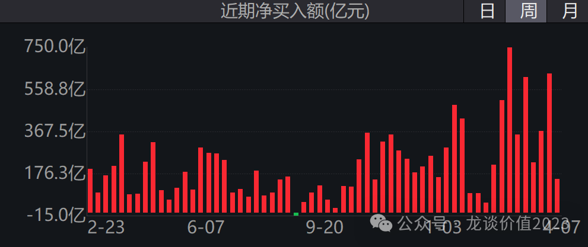
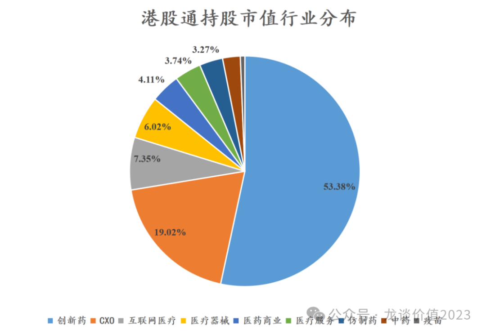
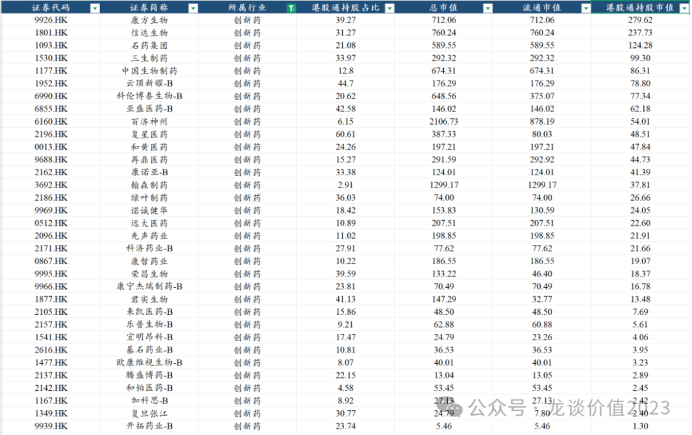
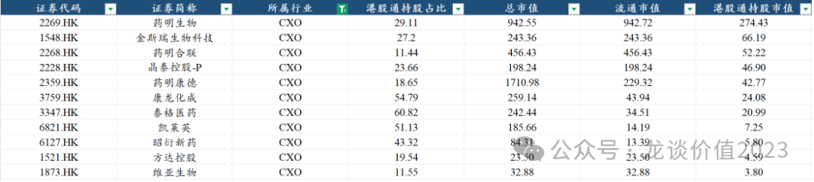
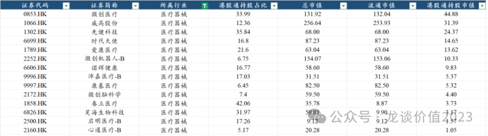
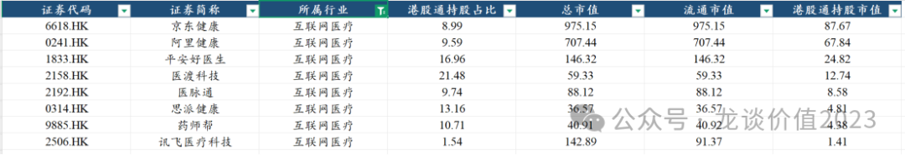
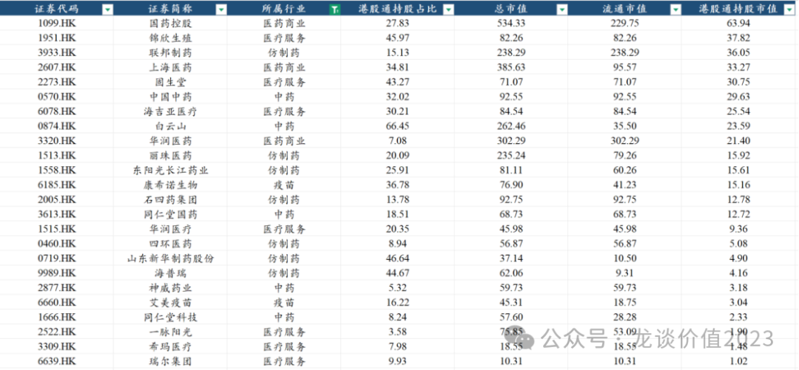

# 南下资金扫货

大家好，我是龙哥。

之前有一句话叫“跨国香江去，夺取定价权”估计大家都听过，只不过当时定价权是没夺取到，高位接盘是真的有，从此这句话从中性偏褒义的一句话变成了嘲讽拉满的一句话。

时隔两年，南下资金持续大笔增持港股，尤其是在当前复杂的国际政治环境下南下资金依然坚定的大笔买入港股权益资产。

因此在当前时间点，我们再来看南下资金对港股医药股的持仓，主要考虑几个问题，第一是南下资金主要买的是哪些股票，持股金额最高的是哪些公司？第二是南下资金对哪些公司的持股比例达到了非常高的水平，高到可以达到有“定价权”的水平？第三是哪些公司后续还有比较大的被南下资金进一步增持的潜力？因此由本文的数据分析情况，希望给大家一些帮助。

我们统计了90家港股通持股市值超过1亿元的公司，以此计算南下资金的持股情况。这里要注意的是，持股比例还很大程度上受到大股东持股比例的影响，如科伦博泰、中国生物制药这些控股股东的持股比例较高的公司，必然意味着南下资金的持股比例不会达到很高的水平。

（以下数据均截至为4月3日收盘价）

统计范围内的90家港股医药公司合计的流通市值是15239亿元，港股通的持股市值合计是2886亿元，南下资金持仓占流通市值的比例是19%，如果考虑其中还有相当一部分的实控人或大股东的持股，这个比例已经是不低的水平，随着南下资金的进一步涌入，“夺取定价权”可能不再是一句口号。

1、创新药行业

南下资金对创新药公司的持股合计达到1540亿元，占比53.4%。

其中，对康方生物、信达生物的持股市值达到280亿和238亿，持股比例分别达到39.3%和31.3%，都是比较高的持股水平。对石药集团、三生制药、中国生物制药的持股市值分别124亿、99亿、86亿，这是南下资金对港股创新药的持股市值前五。

在头部的中、大市值公司里，持股市值和持股比例显著偏低的主要是百济神州、翰森制药、再鼎医药。

翰森制药特殊的地方在于大股东的持股比例过高，孙飘扬家族的持股比例目前仍然高达82%，导致流通盘本身就非常少，因此南下资金能买的量也就很少。

百济神州则是因为三地上市，仅在港股上市流通的股本也不算很多，但相比流通市值来说其南下资金持股比例仍然是偏低的，百济由于有A股上市，国内机构和资金可能会选择直接买A股百济，可估值的巨大差异还是客观存在的。

而再鼎医药持股比例低，主要是其此前license in的商业模式一直存在分歧，但不得不说其选择产品管线的眼光真是一绝，随着其也将在25年底到26年临近盈亏平衡、以及自研管线如DLL3-ADC卓越的临床数据表现，分歧也可能会逐渐抹平。

另外科伦博泰的南下持股比例20.6%也要低于康方、信达等公司，主要也是科伦博泰的大股东科伦药业的持股比例还有57%，实际占自由流通股的比例已经比较高了。

其他大部分公司，我们一般认为南下资金持股达到40%以上就是比较高的水平了，可能就没有太多继续获得南下资金增持的空间，持股比例低于20%则可能还有一定的增持空间。比较典型的荣昌生物曾经南下资金持仓比例达到50%+，随后孱弱的基本面和财务风险使得南下资金持续减持至34%左右，近期又有所回升。

除了以上我们提到的公司外，南下资金持股比例20%左右或以下的二线创新药公司还有远大医药、先声药业、和黄医药、康哲药业、诺诚健华等。另外小biotech的南下持股比例差异就非常巨大了。

2、CXO行业

南下资金对CXO行业的持股市值合计是549亿元，占比19.02%。

持股市值一马当先的还是药明生物，高达274亿元，占流通股比例的29.11%，此外药明合联和药明康德分别是52.2亿和42.8亿元，药明康德本身是有A股的，并且AH溢价并不高，因此其H股的投资价值就并不突出，而药明合联由于此前药明康德和药明生物的持股占比很高，也限制了其流通盘，而目前药明康德在持续大笔减持，且药明合联本身也有做配股，流通盘会越来越多。

除了药明系3家以外，金斯瑞的南下持股66亿元占比27.2%，晶泰控股虽然作为上市不太久的次新股，但由于其是AI制药目前比较纯正的标的，也得到南下资金的追捧，持股比例高达24%。

3、医疗器械行业

南下资金对医疗器械板块的持股市值合计174亿元，占比6%。

港股有3家医疗器械平台型公司，分别是微创医疗、威高股份、先健科技，南下资金持股比例分别34%、12%、36%，其中对威高的持股比例偏低，但实际上威高股份的基本面在24H2有所企稳，25年给了收入端10%-15%的增长指引，并且威高股份提高了股利支付率到50%，股息率达到5%，估值只有不到10倍PE，在器械公司里是南下资金还有较大增持空间的标的。

4、互联网医疗

互联网医疗的南下资金持股212亿元，占比7.35%，主要的持仓来自京东健康、阿里健康，另外平安好医生和医渡科技、医脉通也有部分持仓。

京东健康和阿里健康的南下资金持股比例分别是9%和9.6%，互联网医疗前些年受到互联网行业的政策面影响和整体增长的降速，杀估值杀的非常严重。

但好的地方就是从我们完全看不懂的估值水平跌到了可以用傻瓜式的方式计算估值的水平，像京东健康，我们强烈看好京东健康的时候，是他跌到600亿元市值的时候，那时候他有560亿的现金、40-50亿元的经营现金流、双寡头垄断的竞争格局、双位数的业绩增长。

在当下来看的话，京东健康年初那段时间跟随医疗AI的主题上涨，但其对25年的利润指引并不乐观（线下投入、利息收入减少），25年未必能有大的行情，还要关注其后续的新业务的投入情况和政策面的变化。

另外做线上数字营销的医脉通和AI医疗的讯飞医疗科技我图省事也都给归到了这个板块。医脉通处于AI赋能降本增效、收入和经营利润恢复快速增长的阶段，也有极其充沛的在手现金。讯飞医疗科技则是目前非常纯正的AI医疗的公司，已经有了一定规模的收入，且具有比较强的先发优势、技术优势和渠道优势，只是前期炒医疗AI使得估值拔到比较高，这波跟随大盘跌下来也可以开始关注，讯飞医疗科技刚刚在3月纳入港股通，目前南下资金持股比例也还非常低。

5、其他行业

其他行业包括医药商业、仿制药、医疗服务、中药、疫苗等板块，合计的持股市值也不是很多，其中占比比较高的主要是国药控股、锦欣生殖、联邦制药、上海医药、固生堂、中国中药等。

......

近期重点文章（可直接点击下列链接查看）：

《[医药再迎政治风险考验](https://mp.weixin.qq.com/s?__biz=MzkyMzQ3MDc3Mw==&mid=2247484324&idx=1&sn=f5e3ee849121ed9f038afe25551cfbb4&scene=21#wechat_redirect)》

《[医药暴涨，估值贵了吗？](https://mp.weixin.qq.com/s?__biz=MzkyMzQ3MDc3Mw==&mid=2247484317&idx=1&sn=28b1cabe165edbe8fe713987e79e3ee9&scene=21#wechat_redirect)》

《[医药最高景气方向](https://mp.weixin.qq.com/s?__biz=MzkyMzQ3MDc3Mw==&mid=2247484299&idx=1&sn=c6677f52d0ea6ebfbc11420984b3636d&scene=21#wechat_redirect)》

《[又一家百亿创新药巨头出现](https://mp.weixin.qq.com/s?__biz=MzkyMzQ3MDc3Mw==&mid=2247484285&idx=1&sn=c741f32eb039e33d3c3915a65dfb984f&scene=21#wechat_redirect)》

《[美国药品大降价](https://mp.weixin.qq.com/s?__biz=MzkyMzQ3MDc3Mw==&mid=2247484234&idx=1&sn=28cf6165faae82f398c9afb5f39bd641&scene=21#wechat_redirect)》

《[生物药龙头关键年](https://mp.weixin.qq.com/s?__biz=MzkyMzQ3MDc3Mw==&mid=2247484213&idx=1&sn=e31cea42ba599a77117d7d7daf895fec&scene=21#wechat_redirect)》

风险提示：本文仅讨论行业/公司经营情况，投资需综合考虑公司经营、估值、管理层等多方面因素，建议读者审慎参考，本文不作为投资依据，不建议大家根据本文做出投资计划。

<!-- wxmp-comments-begin -->

---

## 留言（11 条，含回复共 21 条）

- **Bryan** 👍5 · 2025-04-09 16:49
  其他啥也不说了，周一把上涨过程中减仓的1/3仓位买回了，今早开盘消费贷20万，医药领域买入了10W，本身重仓的康诺亚和康方下单晚了没追，算了；创新药ETF昨天低位买了一笔，今天加了一笔，医疗ETF给漏了，好像半仓在医药了[加油]
- **勇敢的心** 👍4 · 2025-04-09 15:41
  为啥有些红色字体的内容，泛着金黄色的光[哇][哇]，谢谢龙大[偷笑]
  - ↳ **作者** · 2025-04-09 15:48
    啊[机智]
- **吕昊** 👍2 · 2025-04-09 15:26
  龙哥谈谈荣昌泰爱重症肌无力数据出炉后续的影响，荣昌的估值是不是可以拔高点
  - ↳ **作者** · 2025-04-09 19:28
    gMG的国内III期疗效数据很不错，安全性也还行，市场是给了很积极正面的反馈的。
- **王宁** 👍2 · 2025-04-09 15:38
  我们对老美加税，主做国内市场又有外国企业竞争的会受益吗？时代天使竞争隐适美这种
  - ↳ **作者** · 2025-04-09 16:06
    隐适美在中国有工厂，并不受关税影响。时代天使后面也要去美国建厂以应对关税。
- **丁山** 👍2 · 2025-04-09 15:45
  龙哥，恒生医药ETF现在可以继续加仓吗？还是等等港股稳定一些再加仓呢
  - ↳ **作者** · 2025-04-09 19:32
    都可以啊，如果你不怕短期波动剧烈，趁着大跌加一些也挺好，如果对回撤接受度低，就等事态稳定一些再说，但那时候就不知道是啥价格了。
- **Mocochan** 👍2 · 2025-04-09 18:09
  终于等到龙大发文，这几天我的港股创新药ETF和恒生医疗ETF等等跌的太厉害了，看着这个跌法我还在纠结是不是逻辑整个破了...加税对创新药公司影响有这么大么？[捂脸]
  - ↳ **作者** · 2025-04-09 18:35
    看看周一一早的文章呀
- **阿葱** 👍1 · 2025-04-09 15:12
  还是坚定持有恒生医药ETF
  - ↳ **作者** · 2025-04-09 19:31
    面对这种市场不折腾也挺好的，投资嘛心态稳定很重要，在这种剧烈波动的市场里冲杀也未必能赚钱，做反了方向还容易心态崩掉。
- **灵感自在** 👍1 · 2025-04-09 15:24
  好久没提问龙哥了，这次想问一下对于爱博的最新观点，人工晶状体应该很受益于对美征税吧
  - ↳ **作者** · 2025-04-09 19:29
    受益应该是受益的，爱博在人工晶体的市占率已经不低，但在高端的人工晶体领域还算是新人，刚开始放量，高端晶体还是有空间的。
- **布谷～Lilian** 👍1 · 2025-04-09 17:13
  感谢龙大，今天文章的全盘整理！！！
  - ↳ **作者** · 2025-04-09 19:16
    [抱拳][抱拳]
- **YYD** 👍1 · 2025-04-09 17:37
  感觉血制品更好些
  - ↳ **作者** · 2025-04-09 19:15
    如果后面确认国内对进口产品加征关税中包含药品，那血制品确实会有明确的量价齐升的受益。
- **Ming** 👍1 · 2025-04-09 18:25
  请问下映恩生物值得申购么
  - ↳ **作者** · 2025-04-09 18:35
    值得

<!-- wxmp-comments-end -->
