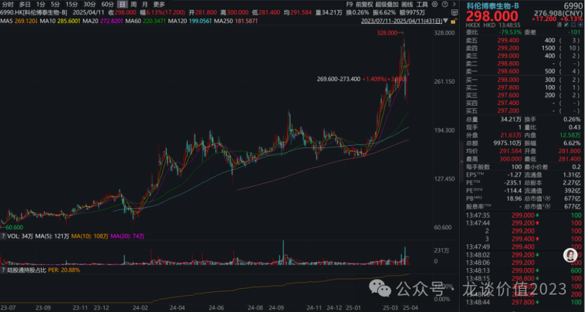
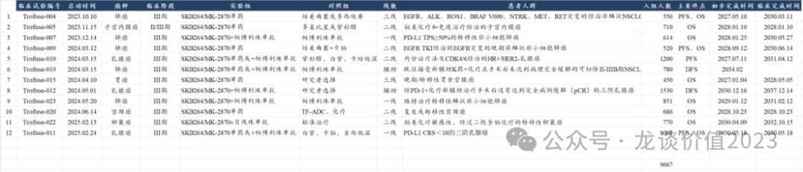
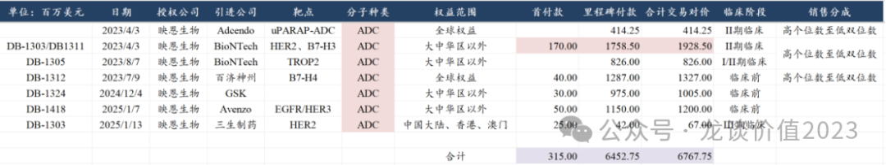
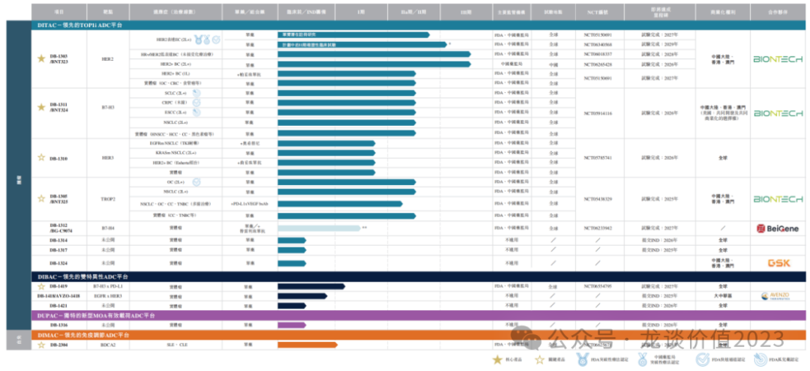
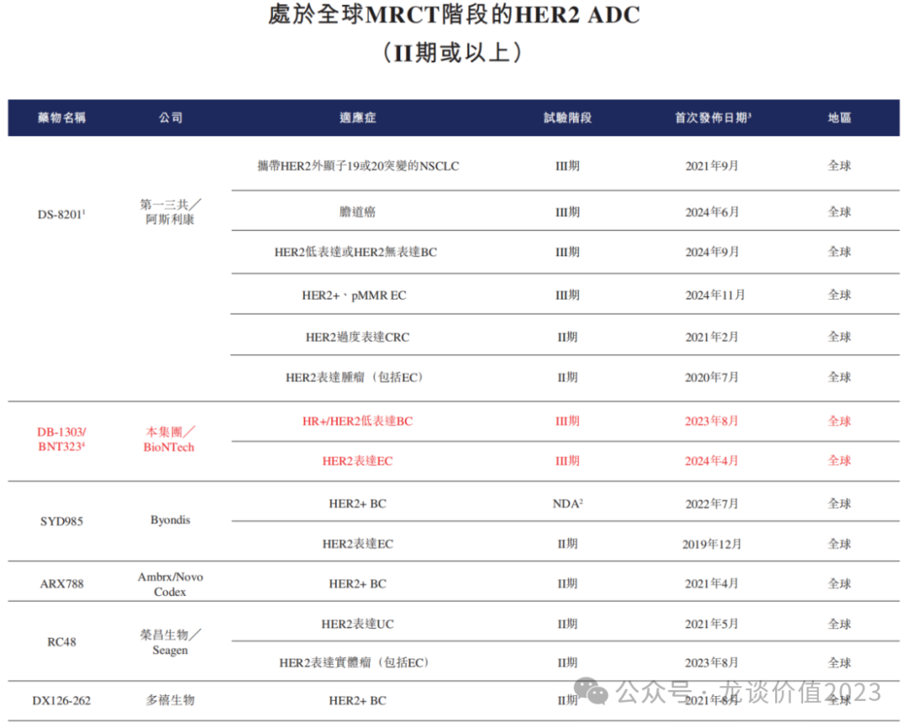
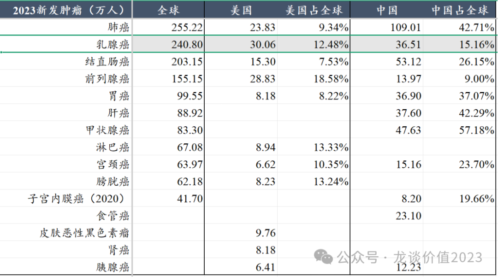
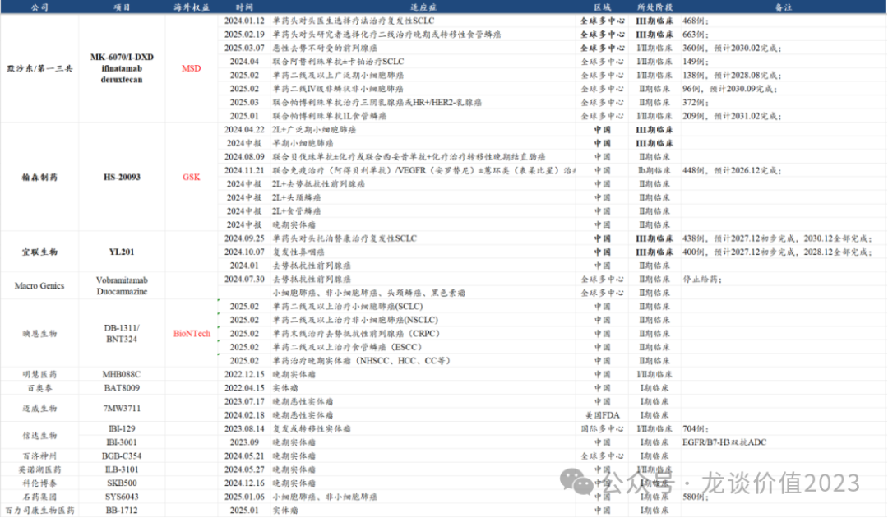

# 把握下一个ADC领域龙头biotech

大家好，我是龙哥。

今天和大家聊一家下周将要上市的港股创新药新股——映恩生物。

上一家ADC领域龙头biotech公司——科伦博泰生物，自上市以来，其管线海外研发进展持续超预期，MSD疯狂的开了13个全球多中心III期临床，累计计划入组患者人数接近1万人，科伦博泰的股价也随之水涨船高，并且科伦博泰上市时的市场情绪很差，使得上市时的估值偏低，自IPO以来股价涨幅超过5倍。

而映恩生物同样是把核心ADC管线做了一系列的海外BD授权，虽然不像科伦博泰这样授权给肿瘤免疫之王默沙东，但也是授权给了巨有钱的BioNTech、全球biopharma新贵百济神州、欧洲老牌MNC葛兰素史克。

以上在研管线的海外BD授权，合计给映恩生物带来3.15亿美元的首付款、64.5亿美元的里程碑付款，合计交易对价高达67.7亿美元。

映恩生物的在研管线包括ADC、双抗ADC、自免ADC，目前对海外授权的有4个ADC药物、1个双抗ADC药物，另外还把HER2-ADC的国内权益授权给了三生制药。

①HER2-ADC

只要看创新药的投资人这几年必然都听说过DS-8201德曲妥珠单抗的威名，由于8201超强的临床表现和绝对的领先优势，使得具有巨大市场潜力的HER2-ADC市场，敢于做全球多中心临床去抢这块肥肉的公司已经非常少，而映恩生物/BioNTech刚好就是其中一家：

映恩生物和BioNTech目前在国内和全球开的两个适应症的注册临床，分别是HER2低表达乳腺癌和HER2表达子宫内膜癌。

从发病率来看乳腺癌已经是欧美市场发病率最高的癌种，也是国内仅次于肺癌、结直肠癌和胃癌的第四大癌种，患者群体极其庞大，美国新发患者高达30万人/年。

乳腺癌药物的全球市场是一个超过400亿美金的超大市场，而HER2低表达乳腺癌适应症可以覆盖50%左右的乳腺癌患者，诞生了包括HER2-ADC、CDK4/6等重磅靶点，以及AKT和PI3Kα等新兴靶点，根据沙利文的预测，其预计到2032年全球HER2-ADC市场规模达到150亿美元。

乳腺癌之外，映恩生物/BioNTech差异化开发的适应症是HER2阳性子宫内膜癌，子宫内膜癌在海外市场算不上是一个大癌种，在国内每年新发在8万左右，但是目前主要疗法就是化疗和PD-1/L1单抗，叠加曲妥珠单抗、贝伐珠单抗等的联用，国内二线子宫内膜癌目前有信达生物的信迪利单抗+和黄医药的呋喹替尼联合疗法，以及中国生物制药的PD-L1+安罗替尼联合疗法。

而海外市场，在PD-1市场已经充分竞争的情况下，GSK依靠子宫内膜癌的适应症，其多塔利单抗24年销售6亿美元同比+232%，25年可能成为一个十亿美金级别的产品，映恩生物/BioNTech的DB1303/BNT323有望成为全球首个获批子宫内膜癌适应症的HER2-ADC，叠加HER2低表达乳腺癌，在全球市场来看预计仍会有一定的市场机会。

除了单药治疗的机会以外，BioNTech还手握全球进度第二的PD-L1/VEGF双抗，这是有望成为PD-1之后下一代IO王者的双抗靶点，BioNTech对其寄予厚望，目前已经启动了针对非小细胞肺癌和小细胞肺癌的两项全球多中心III期临床，并且已经启动了与HER2-ADC、TROP2-ADC、HER3-ADC的联用探索，BioNTech的HER2-ADC和TROP2-ADC都是自映恩生物引进，在未来IO+ADC的全球竞争中，BioNTech已经手握王炸，因此映恩生物/BioNTech的HER2-ADC哪怕面对DS-8201的巨大压力，也仍有不小的市场机遇。

HER2-ADC的国内市场权益被授权给了三生制药，三生制药作为CSO负责国内市场商业化。

②B7-H3 ADC

HER2-ADC主要用在乳腺癌，其次是胃癌、肺癌、卵巢癌、子宫内膜癌等，而B7-H3相对来说覆盖范围更广，包括全球最大癌种非小细胞肺癌和小细胞肺癌，以及在肝癌、胃癌、前列腺癌、乳腺癌等大癌种中都是表达率较高，覆盖了全球前6大癌种中的5个，目前各家首发适应症基本都是成药概率最高的小细胞肺癌，MSD则还启动了针对2L食管鳞癌的III期临床。

映恩生物的B7-H3 ADC海外权益同样是授权给了BioNTech，当时与HER2-ADC一起拿到了1.7亿美元的首付款。

B7-H3 ADC目前海外的主要竞争者，是默沙东/第一三共和GSK/翰森制药，这两家分别在24年1月和24年4月启动了国际多中心和国内的III期临床，GSK也将在25年内把B7-H3在海外推到注册临床，另外国内还有一家宜联生物的B7-H3 ADC在24年9月启动III期临床。

映恩生物的B7-H3 ADC在国内正在进行多个癌种的II期临床，BioNTech正在海外进行I/II期临床，国内顺位第四、海外顺位第三。

③双抗ADC

映恩生物目前有2款双抗ADC在研，包括DB-1419（PD-L1/B7-H3 ADC）和DB-1418（HER3/EGFR ADC），前者在国内外处于I期临床阶段，后者虽然还处于临床前阶段，但由于百利天恒的HER3/EGFR双抗ADC高价授权给BMS，映恩生物在25年1月以5000万美元首付款+11.5亿美元里程碑付款的交易对价将其海外权益授权给了Avenzo。

④自免ADC

映恩生物布局了首款自免ADC——DC2304（BDAC2-ADC）用于治疗皮肤型红斑狼疮和系统性红斑狼疮，此外百济神州也布局了一款自免ADC——BGB-45035（IRAK4-ADC）。

自免ADC的目标是以更加高度特异性、对健康细胞影响更小的方式递送抗炎药，实现更安全、效果更好、更持久的治疗反应，虽然目前还没有靶点和分子成药，但是也已经引发市场的关注。

⑤其他ADC

除以上核心产品外，映恩生物还有HER3-ADC、TROP2-ADC、B7-H4 ADC处于临床阶段，TROP2-ADC的海外权益也被授权给BioNTech，未来与IO联用的市场潜力可以参照默沙东引进科伦博泰的SKB264后启动的一系列与K药联用的全球大III期，B7-H4 ADC的全球权益则是在23年7月被授权给百济神州，百济也在24年启动了该项目的I期临床，预计25年也会有早期数据读出。此外映恩生物还有一款临床前阶段的ADC授权给GSK。

本次映恩生物的IPO，发行价94.6港元-103.2港元/股，发行前总股本6010.42万股，本次IPO发行1507.16万股，发行后总股本7517.58万股，发行市值71.12亿港元-77.58亿港元，约为67.35亿-73.47亿元（未计入员工股权激励部分）。虽然当前创新药板块的市场热度并不低、且远高于科伦博泰IPO时的市场热度，但IPO的估值确实不高，并且其IPO后还将有20亿左右的在手现金。

风险提示：本文仅讨论行业/公司经营情况，投资需综合考虑公司经营、估值、管理层等多方面因素，建议读者审慎参考，本文不作为投资依据，不建议大家根据本文做出投资计划。

<!-- wxmp-comments-begin -->

---

## 留言（15 条，含回复共 31 条）

- **峰回路转** 👍5 · 2025-04-11 19:03
  已中签，沾沾喜气[呲牙]
- **和** 👍3 · 2025-04-11 15:45
  龙哥现在是不是又给了一次低吸恒生医药ETF的好时机[偷笑][偷笑][偷笑][偷笑]
  - ↳ **作者** · 2025-04-11 15:48
    是的呀，投ETF的话最好的买点不就是这种短期情绪性的急跌嘛
- **疯子** 👍2 · 2025-04-11 15:37
  龙哥，准备去参加贝达的股东大会，请问问啥问题比较合适[呲牙]
  - ↳ **作者** · 2025-04-11 16:00
    你作为股东问你想问的问题就是了，如果是我的话估计也就是问问EGFR/cMET后续进一步的临床计划，还有重组白蛋白的销售计划
- **早晨** 👍1 · 2025-04-11 15:26
  大陆A股的散户~买不到港股创新药个股，有没有港股创新药ETF。
  - ↳ **作者** · 2025-04-11 15:27
    2月26日，4月2日的两篇文章，请查阅[好的]
  - ↳ **作者** · 2025-04-11 18:59
    你看你问的问题，答案都在问题里了
- **胡文超** 👍1 · 2025-04-11 15:40
  龙大，为啥再鼎医药最近比其他医药跌得多啊？
  - ↳ **作者** · 2025-04-11 15:56
    艾加莫德增加了一个竞品泰它西普，再就是他有个别引进美国的产品，这俩因素影响都还好。再鼎医药4-5月应该会有两个比较重要的信息值得关注，一个是FGFR2b海外第一个III期临床数据的发布，有改写胃癌一线治疗的潜力，另一个是DLL3-ADC在ASCO上更新数据，也比较值得关注。
- **人生在世** 👍1 · 2025-04-11 15:44
  FDA，昭衍影响怎么看
  - ↳ **作者** · 2025-04-11 15:54
    会有影响，不过中短期应该不会很大，一个是能省动物实验的应该还是少数，再一个昭衍是国内为主，CDE这边还没调整。不过FDA一直还是走的比较前面的，要重视他们这边的变化，AI带来的突破也是很值得关注的。
- **叶** 👍1 · 2025-04-11 15:52
  康方卖飞了。。。可惜
  - ↳ **作者** · 2025-04-11 15:58
    额，这怎么会存在卖飞呢，是有啥更好的选择吗
- **悦霖同辉** 👍1 · 2025-04-11 16:09
  龙哥国内医药ETF存在投资价值吗
  - ↳ **作者** · 2025-04-11 16:23
    也可以，不过要弱于港股。
- **麦** 👍1 · 2025-04-11 16:14
  打新映恩，不知道中不中
  - ↳ **作者** · 2025-04-11 16:24
    打新打中了也没多少，还是要看上来以后的
- **cloud** 👍1 · 2025-04-11 16:20
  药明生物影响大吗？
  - ↳ **作者** · 2025-04-11 16:24
    药明系会有投资收益，不过对总体估值的影响有限。
- **对方正在输入...** · 2025-04-11 16:37
  错过了，没打。。。
  - ↳ **作者** · 2025-04-11 17:25
    打新没多少，上市之后才是重点
- **饶沙** · 2025-04-11 17:27
  龙哥，解毒下美国的生物安全法案的影响？
  - ↳ **作者** · 2025-04-11 17:28
    下次提问，起码字打对[旺柴]以及，你猜猜看我周一的文章写的什么内容[旺柴]
  - ↳ **作者** · 2025-04-11 17:33
    上周就知道那个报告的事了，所以才写了周一一早那个文章，最终报告读下来，主要还是攻击药明系，对创新药这边影响不大。
- **钟汶灏** · 2025-04-11 17:39
  龙哥怎么看金斯瑞呢？受到美国那边的影响大吗？蓬勃生物后续还有可以BD出去的管线吗？
  - ↳ **作者** · 2025-04-11 17:54
    蓬勃生物做CDMO的，做啥管线授权[捂脸]传奇生物在美股，不卖股权的话对金斯瑞的股东来说就没法价值兑现。
- **苏@163.com** · 2025-04-11 21:41
  请问龙哥，4月15日当天港股通能买映恩生物吗？
  - ↳ **作者** · 2025-04-11 23:11
    港股通不行，只能港股账户
- **Kobe8wang** · 2025-04-14 17:11
  明天上市今天就可以买了吗
  - ↳ **作者** · 2025-04-14 17:12
    今天是暗盘交易

<!-- wxmp-comments-end -->
