# 宇宙级大药

大家好，我是龙哥。

康方生物/SUMMIT的Ivonescimab（AK112，依沃西，PD-1/VEGF双抗）被誉为“中国创新药领域的deepseek时刻”，可见该产品对全球创新药研发的意义。本文来聊聊康方AK112的市场价值及后续的竞争格局。

康方生物的AK112是入行以来最让人印象深刻的一款产品，没有之一。其对行业的深远影响，值得持续跟踪和复盘。

1、巨额BD授权引领行业拐点

康方生物的AK112在2022年12月的这笔高达50亿美元的海外BD授权，几乎是重塑了中国创新药出海的逻辑，我们这两年对创新药行业讲的主要的出海的逻辑，基本可以认为起点就是2022年12月康方和科伦博泰的两笔BD授权。

从康方生物开始，中国创新药海外BD授权在23-24年全面加速，一方面是中国创新药厚积薄发的体现，另一方面从康方开始，让更多海外公司关注到了中国创新药分子的价值。

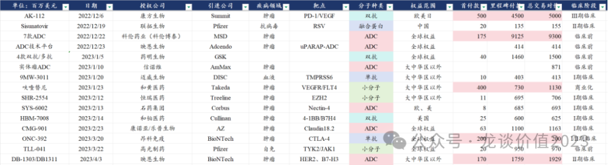

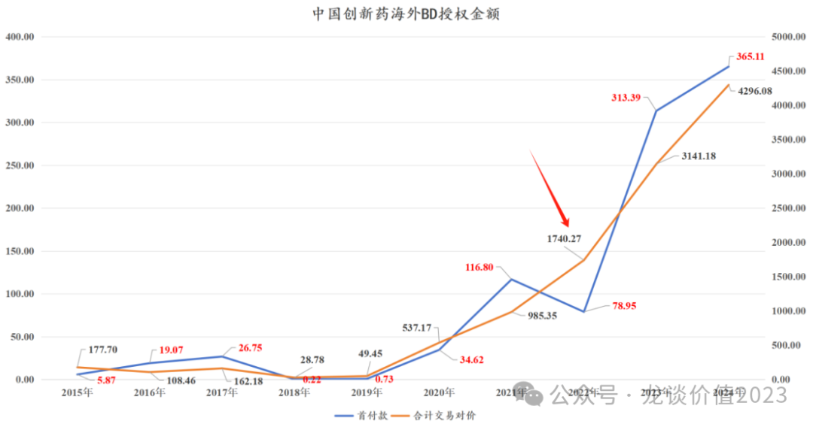

2、优异临床数据震撼产业

2024年9月在WCLC大会上发布的AK112首个头对头K药的一线PD-L1阳性非小细胞肺癌III期临床数据显示mPFS（中位无进展生存期）为11.14个月VS 帕博利珠单抗（K药）为5.82个月，PFS改善5.3个月，HR值为0.51（降低49%的疾病进展或死亡风险），从其生存曲线来看随着随访时间的延长，HR值有望继续降低。

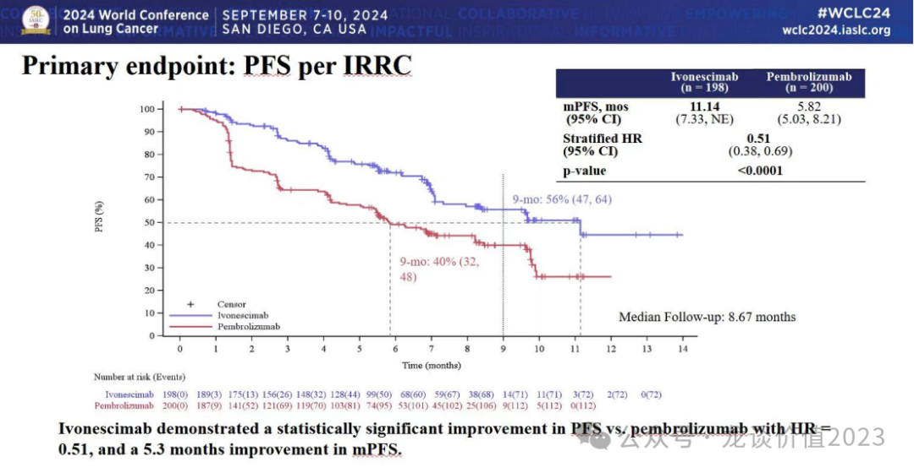

就亚组来看有更超预期的表现：在PD-L1低表达人群中的HR值达到0.54，在PD-L1高表达人群达到0.46；在鳞癌人群中达到0.48，在非鳞癌人群中达到0.54，鳞癌人群由于相对缺少基因突变，PD-1等免疫治疗的临床价值更高。脑转移人群HR值0.55，无脑转移人群HR值0.53。肝转移人群HR值0.47，无肝转移人群HR值0.53。各亚组均有非常优秀的表现。

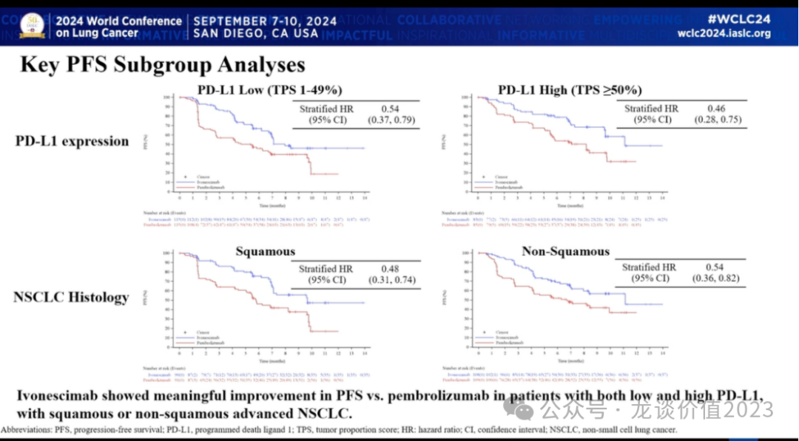

安全性方面，肺鳞癌患者中三级以上不良反应发生率为22.2%VS18.7%，比K药略高但基本接近的水平，总体患者生活质量相当。

也是这个临床结果的发布，使得AK112具备了被冠以“中国创新药DeepSeek时刻”威名的实力。

临床数据发布后的几天里，相关公司的股价大幅上涨，其中Summit涨160%、Instil bio涨500%，康方生物涨40%，BioNTech涨40%，宜明昂科涨40%。

3、IO疗法庞大市场空间

知道K药现在有多牛，才能理解AK112的市场价值。

2024年K药全球销售额294.82亿美元同比增长17.88%，K药在突破200亿美元的全球销售额后仍维持了4年的20%左右增速，销售增长持续超预期，K药已经在肿瘤领域累计获批了超过40个适应症，覆盖了大部分的主要癌种，相比于过去国内的各种适应症数十个的“中华神药”，K药才是真正的“宇宙神药”。

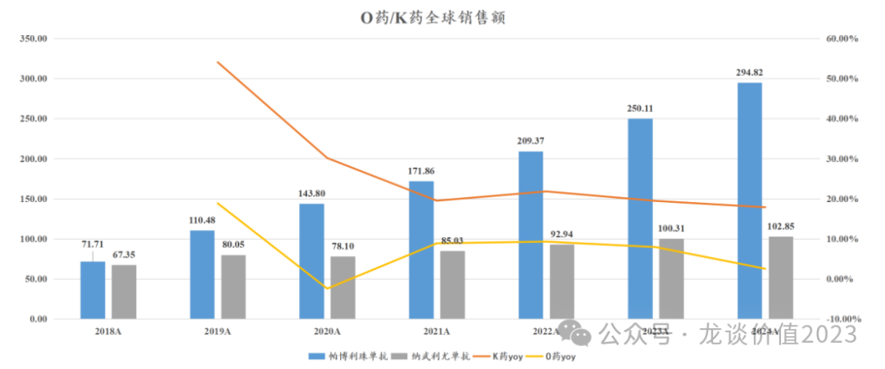

除了K药——帕博利珠单抗以外，肿瘤免疫目前在全球市场已经获批了多款药物，还包括24年全球销售103亿美元的纳武利尤单抗、47亿美元的度伐利尤单抗、41亿美元的阿替利珠单抗，25亿美元的伊匹木单抗，以及后续几个PD-1单抗、LAG-3单抗，肿瘤免疫的三个靶点PD-1/L1、CTLA-4、LAG-3在24年合计实现550亿美元的全球销售额，同比增长13.3%，合计增加了65亿美元的销售额，其中45亿美元的增量来自K药。

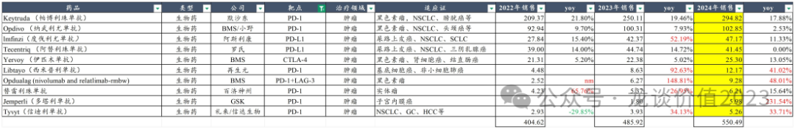

（国内只计入有披露销售额的百济、信达，实际其他家国产合计还有10亿美元以上，包括康方生物两款双抗合计18亿、恒瑞医药、复宏汉霖13亿、君实生物15亿、中国生物制药、基石药业、乐普生物、康宁杰瑞等等）

而根据高盛的报告，康方也在24年业绩会上展示了高盛报告中对IO疗法和康方/SMMT的Ivonescimab的销售预期，预计PD-1/L1的全球销售额将在2028年达到900亿美元，相较2024年的520亿美元，复合增速约为14%。

后来者如再生元和GSK借助个别适应症的优秀表现也可以实现高速放量，轻易就可以达到10亿美元级别销售额。

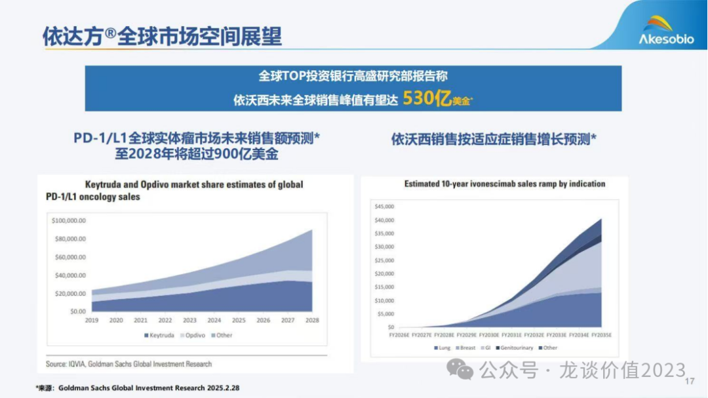

高盛对Ivonescimab的销售预期，也是前所未有的乐观，其报告预计全球销售额将在2035年达到450亿美元，且预计销售峰值达到530亿美元，过往的“重磅炸弹药物”已经不足以形容，可谓是真正的“宇宙级大药”。

根据康方生物与SMMT的授权交易内容，康方生物在22年12月授权欧美日权益，获得5亿美元首付款、45亿美元里程碑付款、低双位数（10%-15%）销售分成，又于24年6月授权中美/南美/中东/非洲权益，交易对价7000万美元，销售分成与前一次交易一致。

4、康方引领行业研发

在康方生物的AK112尚未进行海外BD授权的阶段，国内已经有一些公司开始陆续跟随康方生物的研发，22年12月（巨额BD）和24年9月（头对头K药临床数据发布）这两个关键时间点之后，进一步激发了行业研发热潮和BD授权。

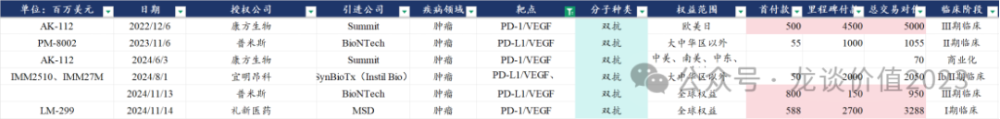

BD授权方面，除了康方生物的这笔交易以外，还有3笔国内公司的海外BD授权：

第二笔是23年11月国内双抗龙头之一——普米斯生物，将PD-L1/VEGF授权给在新冠mRNA疫苗领域一战成名的BioNTech，后来BioNTech进一步在24年11月对普米斯进行收购，收购总对价9.5亿美元。

第三笔是宜明昂科在24年8月将PD-L1/VEGF双抗授权给SyBioTx，交易对价合计20.5亿美元。

第四笔是24年11月礼新制药将其处于I期临床阶段的PD-1/VEGF双抗授权给IO霸主默沙东，获得了笔康方那笔交易更高的5.88亿美元首付款，总交易对价达到33亿美元。

临床进展方面，行业内竞争者逐渐增加，领先优势比较明显的是康方生物/SUMMIT和普米斯/BioNTech，目前均已经启动了全球多中心和国内的III期临床，其他厂家则在I/II期临床或在规划III期临床中。

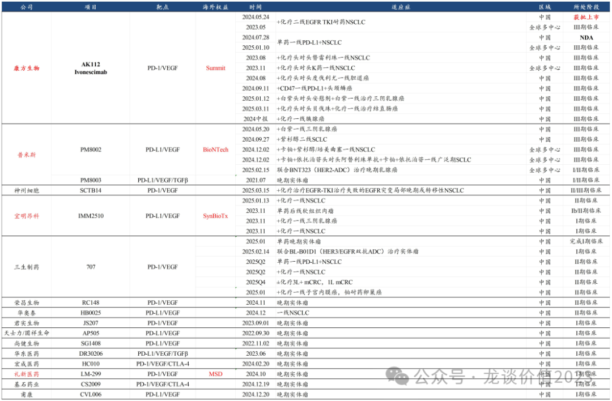

①康方生物

目前在AK112上，康方生物已经启动了多个注册临床：

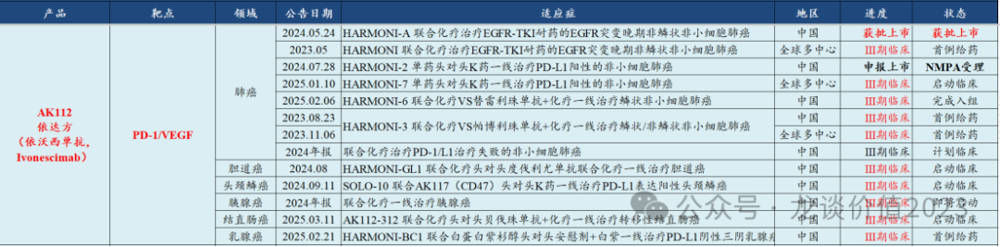

其中包括在中国区已经启动的9个适应症的III期临床（其中1个适应症已经获批、1个适应症NDA）、和SMMT在海外开展的3个III期临床，在肺癌领域实现全覆盖、且还在筹备肺癌辅助/新辅助的注册临床，同时覆盖了一线胆道癌、一线头颈鳞癌、一线胰腺癌、一线结直肠癌和一线三阴乳腺癌等前线的适应症。

而海外市场，目前启动了肺癌领域的3个III期临床，分别是联合化疗头对头化疗二线治疗EGFR TKI经治的NSCLC、单药头对头K药一线治疗PD-L1阳性NSCLC、联合化疗头对头K药+化疗一线治疗NSCLC。

第一个海外III期临床HARMONI预计在25年中读出III期临床数据，该适应症在25年内有望申报上市，最快26年在美国获批上市。

Summit对依沃西寄予厚望，只是短期资金压力客观存在，后续还是有望进一步拓展更多适应症的注册临床。

②BioNTech

BioNTech目前几乎已经“all in”BNT327/PM8002——PD-L1/VEGF双抗。

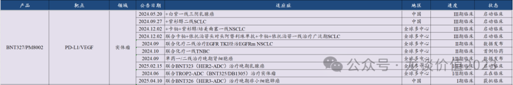

此前24年普米斯在中国区启动了两项III期临床，分别是一线三一乳腺癌和二线小细胞肺癌，而BioNTech完成对普米斯的收购后，马上启动了联合化疗一线治疗NSCLC和联合化疗一线治疗广泛期SCLC的全球多中心III期临床。

且BioNTech借助其ADC产品线的优势（自国内映恩生物、宜联生物引进，见文章《[把握下一个ADC领域龙头biotech](https://mp.weixin.qq.com/s?__biz=MzkyMzQ3MDc3Mw==&mid=2247484358&idx=1&sn=7dddbb02ce72e890e4b4565060eb8470&scene=21#wechat_redirect)》），也在积极探索IO+ADC的联合疗法，目前已经陆续启动了PD-L1/VEGF双抗联合TROP2-ADC、HER2-ADC、HER3-ADC等的临床探索。

BioNTech在新冠mNRA疫苗中赚到超过200亿欧元的利润（21-23年利润分别103亿欧元、94亿欧元、9.3亿欧元），截止24年底的在手现金还有超过200亿美元（前几天股价一度跌破净现金），且新冠疫苗还在持续的贡献现金流，24年辉瑞Comirnaty收入还有53.54亿美元。

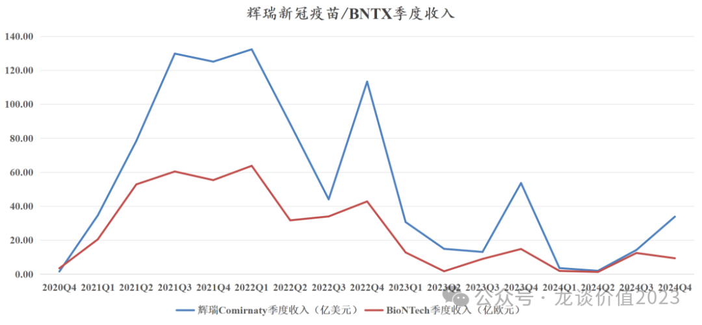

庞大的在手现金和新冠疫苗仍在持续贡献的现金流，BioNTech志在赌出一个世界级的大药，PD-L1/VEGF可能是决定BioNTech能否再上一个台阶的核心管线。

③三生制药

三生制药今年以来股价的蜕变，来自两个核心的驱动因素，其一是24年销售规模高达50亿元的核心产品特比澳在24年医保谈判中居然没有降价续约医保，大超市场预期。

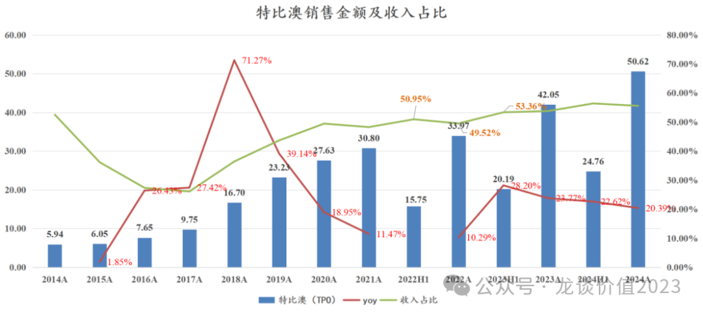

其二是其在研管线PD-1/VEGF双抗在年初发布了一线NSCLC的II期临床ORR数据，小规模患者的初步II期数据显示ORR略好于康方生物的AK112。

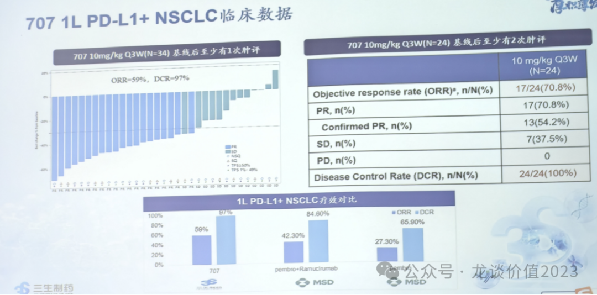

前者使得三生制药未来2年的业绩基本盘有比较高的确定性，后者则是使得三生制药获得了参与国内乃至全球IO大市场竞争的筹码。

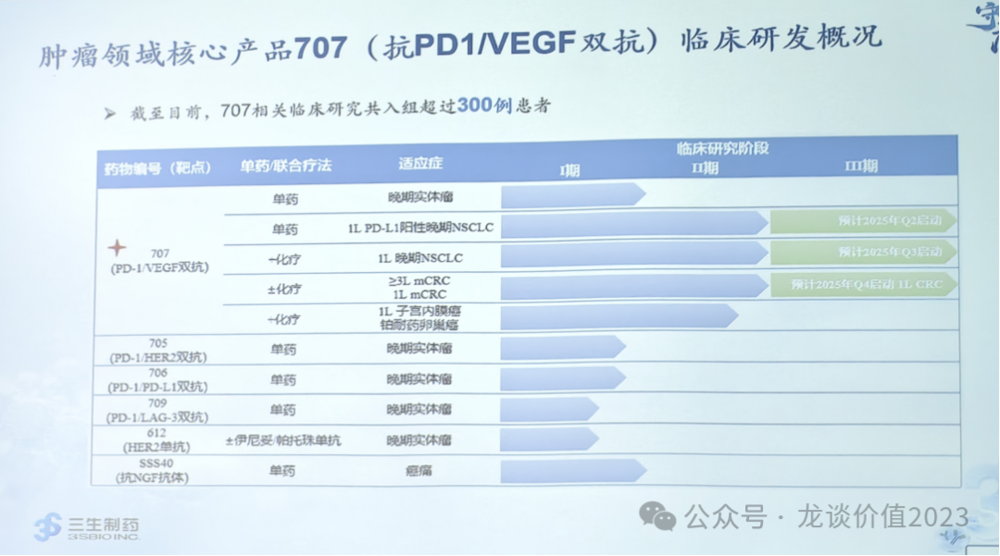

三生制药预计25Q2启动单药一线PD-L1阳性NSCLC的III期临床，25Q3启动联合化疗一线NSCLC的III期临床，25Q4启动联合化疗一线CRC的III期临床。

④神州细胞

神州细胞于2025年3月15日启动了SCTB35（PD-1/VEGF双抗）联合化疗治疗EGFR-TKI治疗失败的EGFR突变局部晚期或转移性非鳞状NSCLC的II/III期临床。

⑤君实生物

君实生物24年报显示其JS207（PD-1/VEGF双抗）获批联合化疗一线治疗广泛期小细胞肺癌的II/III期临床。

⑥宜明昂科

宜明昂科计划2025年启动IMM2510（PD-L1/VEGF）单药后线治疗软组织肉瘤的注册II期临床。

⑦荣昌生物

荣昌生物的RC148（PD-1/VEGF）目前处于II期临床阶段。

⑧基石药业

CS2009（PD-1/VEGF/CTLA-4三抗）目前在国内和海外进行I期临床，为国内第二款PD-1/VEGF/CTLA-4三抗，升级版的摸着康方AK104+AK112过河。

⑨华东医药

DR30206（PD-L1/VEGF/TGFβ）由子公司道尔生物研发，为同靶点全球第二家进入临床阶段，第一家是上文提到的普米斯生物。

5、IO全球竞争

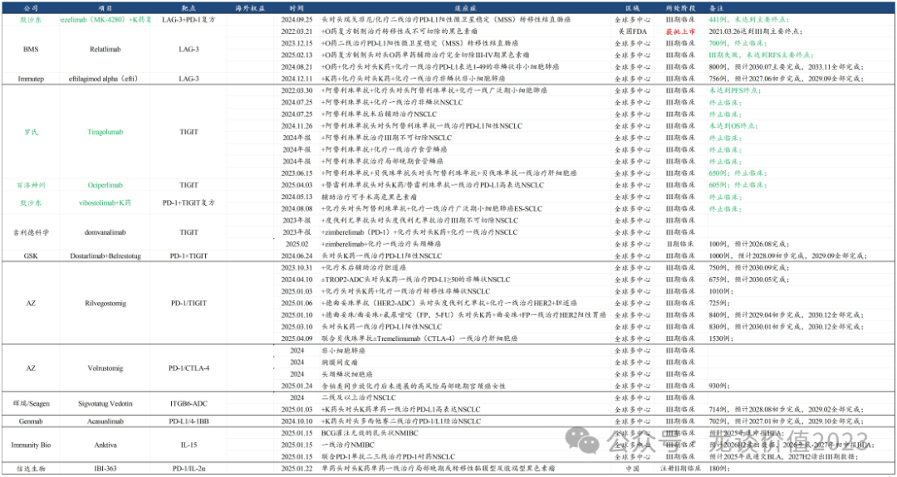

在PD-1之后的下一代IO产品的竞争，已经经历了多个靶点的探索和失败，包括TIGIT、CD47、LAG-3等。

目前仍在推进的，包括阿斯利康的Rilvegostomig（PD-1/TIGIT双抗）、吉利德科学的TIGIT单抗、GSK的Belrestotug（TIGIT）、BMS的Relatlimab（LAG-3）、Immutep的eftilagimod alpha（LAG-3）、信达生物的IBI-363（PD-1/IL-2α）等处于注册临床阶段。

另外还有一系列的靶点如IL-15、ITGB6-ADC、PD-L1/4-1BB等处于PD-1经治患者二线治疗的注册临床中。

风险提示：本文仅讨论行业/公司经营情况，投资需综合考虑公司经营、估值、管理层等多方面因素，建议读者审慎参考，本文不作为投资依据，不建议大家根据本文做出投资计划。

<!-- wxmp-comments-begin -->

---

## 留言（12 条，含回复共 26 条）

- **峰回路转** 👍4 · 2025-04-14 17:16
  仰恩生物，暗盘好牛呀
  - ↳ **作者** · 2025-04-14 17:20
    映恩生物，确实是IPO的价格给的挺低的，加上现在创新药的市场情绪不错，恐怕是很难像当时的科伦博泰那样给一个很好的开盘价了。
  - ↳ **作者** · 2025-04-14 19:33
    他暗盘已经涨完了，开盘价不就已经起来了，哪里还有很好的价格了。
- **隐隐** 👍4 · 2025-04-14 17:40
  如此看来前几天康方跌了二十个点的时候就是绝佳的建仓机会，但是因为看不懂所以敢去etf，也是一个好的替代。
  - ↳ **作者** · 2025-04-14 17:55
    嗯，康方和博泰以及其他类似的头部企业，遇到这种错杀都是好的买点，个人投资者不好分辨个股是不是错杀的话，买行业etf是很好的策略。
- **晓风残月** 👍3 · 2025-04-14 17:23
  龙哥，迈瑞的业绩是不是有问题了，这股价也不维护了一路向下
  - ↳ **作者** · 2025-04-14 17:28
    24年三季报就已经明显兜不住了，24Q4压力更大，25Q1应该还要继续渠道去库存，业绩企稳最快可能在25Q2，等年报和一季报出来看看到底能有多差吧。
- **Zhanghh** 👍2 · 2025-04-14 17:29
  龙哥，泰格这种CRO究竟受关税影响有多大啊？跌的我不知道该不该割肉了
  - ↳ **作者** · 2025-04-14 17:33
    临床CRO受到的影响不是关税，主要是国内订单价格还没起来，海外业务又可能涉及生物医疗信息安全问题，不好评价，要起来的话主要看行业β。
- **LQ** 👍2 · 2025-04-14 20:53
  请问龙哥，707管线是在三生制药还是国健啊
  - ↳ **作者** · 2025-04-14 20:54
    在三生制药哈，之前在三生国健，后来把自免以外的管线都转到沈阳三生了
- **竹子** 👍1 · 2025-04-14 17:10
  龙哥，昭衍新药的逻辑变了吗？猴子废了？
  - ↳ **作者** · 2025-04-14 17:13
    你反应过来的好像有点晚[捂脸]
  - ↳ **作者** · 2025-04-14 17:26
    消灭不至于，需求确实会减少，AI现阶段还不能完全替代动物实验，FDA这次也只是说单抗药物。
- **和** 👍1 · 2025-04-14 17:19
  恒生医药ETF太猛了，快要冲到前期下跌高位了[强][强][强][强][强][强][强][强][强]
  - ↳ **作者** · 2025-04-14 17:21
    创新药大部分是被错杀的，很多都拉回来了，指数和ETF必然就也是如此了
- **漾** 👍1 · 2025-04-14 17:28
  龙哥，时代天使怎么看呀？
  - ↳ **作者** · 2025-04-14 17:32
    时代天使，我对于他们到美国建厂的行为持保留态度，比较怀疑在美国建厂能不能挣钱。不建厂的话美国市场又有关税的影响。
- **lee** 👍1 · 2025-04-14 17:29
  三生制药的上市主体是三生国建不？
  - ↳ **作者** · 2025-04-14 17:31
    港股的三生制药呀，三生国健只是三生制药的一个控股子公司，自免这块的药物都在三生国健研发和商业化。
- **CHY** 👍1 · 2025-04-14 17:49
  老师好，药明康德和凯莱英这种，市场在外但是自身经营很优秀的cxo，到底该咋估值，拿了挺长时间，被套中，比较纠结，理论上应该是底部了，快要反转了，又来关税的事情。。。
  - ↳ **作者** · 2025-04-14 17:54
    这个是比较无奈的，涉及到他们讲的国家安全的问题，就不是用市场经济理论能解释的，必然会对应着明显的估值折价。
- **苏@163.com** 👍1 · 2025-04-14 18:03
  龙哥还继续看好国内创新药快速发展的大趋势吗？其发展会不会受到国际贸易摩擦的影响？谢谢
  - ↳ **作者** · 2025-04-14 18:19
    可以看看我上周一一早发的文章。目前是不受影响的，但也要对政治因素的变化保持敏感度。
- **早晨** · 2025-04-14 21:12
  你这创新药ETF的证券代码是什么？请教一下！
  - ↳ **作者** · 2025-04-14 22:52
    往前翻一翻，有几篇文章专门写ETF的，有不少可选的标的

<!-- wxmp-comments-end -->
