# 南下资金扫货2

大家好，我是龙哥。

上周写了一篇《[南下资金扫货](https://mp.weixin.qq.com/s?__biz=MzkyMzQ3MDc3Mw==&mid=2247484346&idx=1&sn=73ead3d2fc35257c15fd44d703f85e61&scene=21#wechat_redirect)》，主要聊了聊南下资金对港股医药股的持仓情况，应朋友的需要让我再来梳理一下南下资金对全行业股票的持仓情况，因此在医药之外给大家插播一条聊聊全行业南下资金持仓的文章，给大家做个参考。

有南下资金持仓的港股公司超过800家，合计的持仓总市值是3.905万亿元（以下无特殊说明的情况下都是以人民币计价）。

1、行业分布

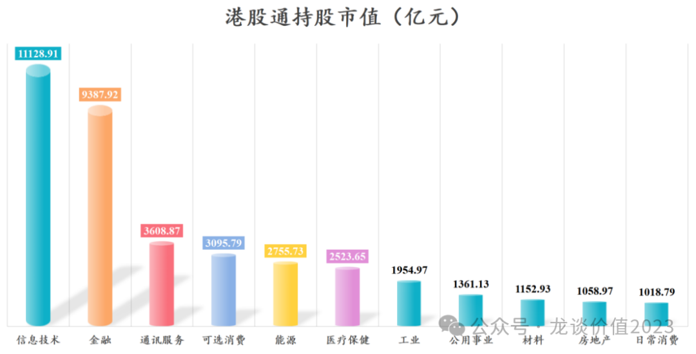

（注：数据截至上周五，南下资金仍在持续加仓，叠加股价波动，最新日期的数据会略有偏差；阿里巴巴、美团、快手是大家传统意义上认为的互联网公司，被wind行业分类归为可选消费、通讯服务等，我给手动调整为信息技术）

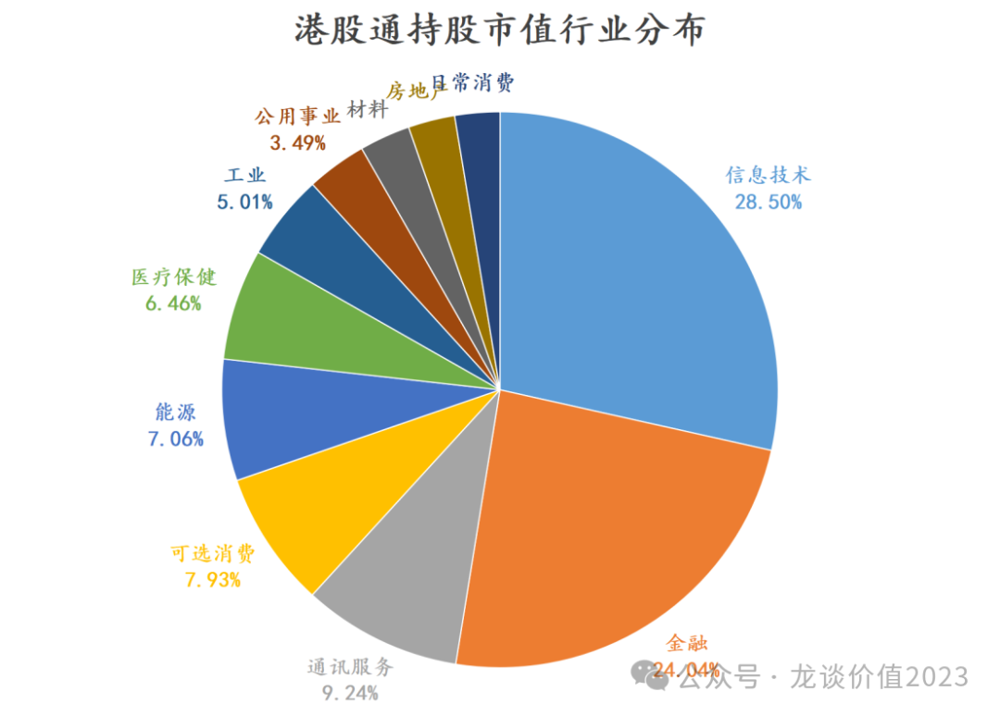

信息技术是南下资金持仓的第一大行业，持仓个股70个占比8.7%，但是持仓市值达到1.11万亿元占比28.5%，从AH两个市场的比较优势来说，H股市场比A股市场最大的优势行业就是互联网。

南下资金持仓市值较高的互联网/科技公司，包括腾讯、小米、阿里、美团、中芯国际、舜宇、商汤、金蝶、华虹、B站、中兴、金山等等大家耳熟能详的公司，还有速腾聚创、第四范式、黑芝麻智能等新兴科技细分领域头部公司。

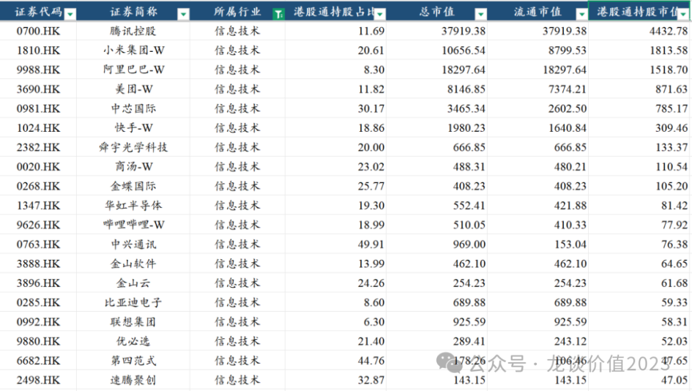

金融是南下资金持仓的第二大行业，持仓个股80个占比9.9%，持仓市值0.94万亿元占比24.0%，主要是一系列的大型国有银行、保险公司为主，还有汇丰银行、香港交易所等。

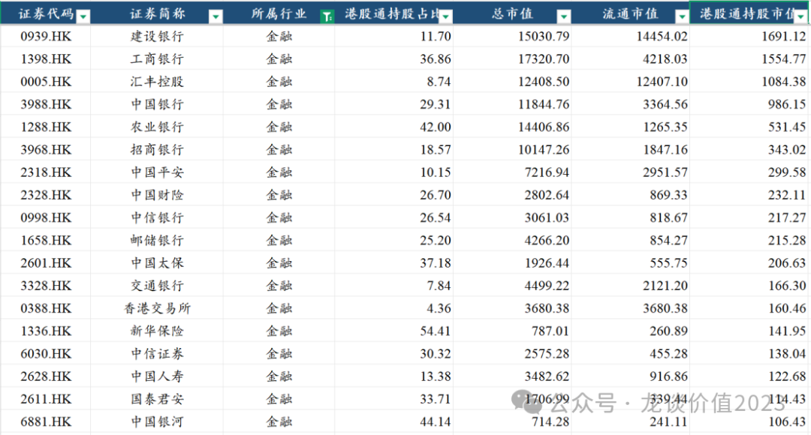

第三大行业是通讯服务，估计大家也都能知道是什么公司，3600亿元的持仓里中国移动一家占2200亿，中国电信560亿，中国联通342亿。

第四大行业可选消费有133家公司占比16.5%，市值占比则是7.9%，泡泡玛特以外目前持仓占比比较高的主要是汽车整车。

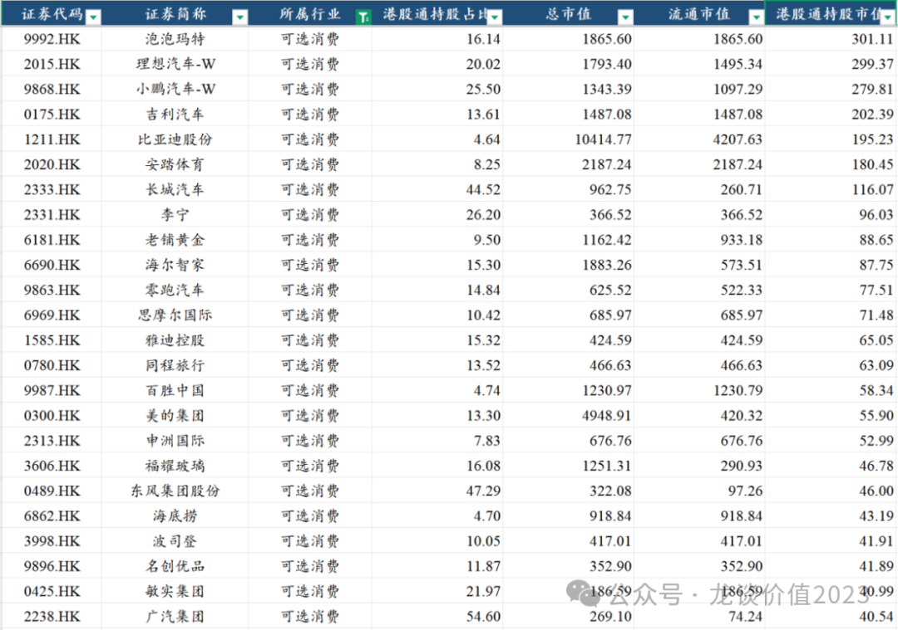

然后是能源行业，大家熟知的三桶油+中国神华等高股息的公司。

医疗保健行业公司数量高达115家、占比14.5%，但是市值占比只有6.5%，南下资金的前三大持仓是康方生物、信达生物、药明生物。

虽然我们一直说港股医药公司、尤其是创新药公司的平均质地和估值水平都要显著好于A股，但从全行业横向对比来说，港股互联网公司相较A股科技股的比较优势似乎更强，港股红利股相较A股也很有优势。

再后面的工业、公用事业、材料、房地产和日常消费行业的持仓市值都在1000多亿元。

2、TOP30重仓持股

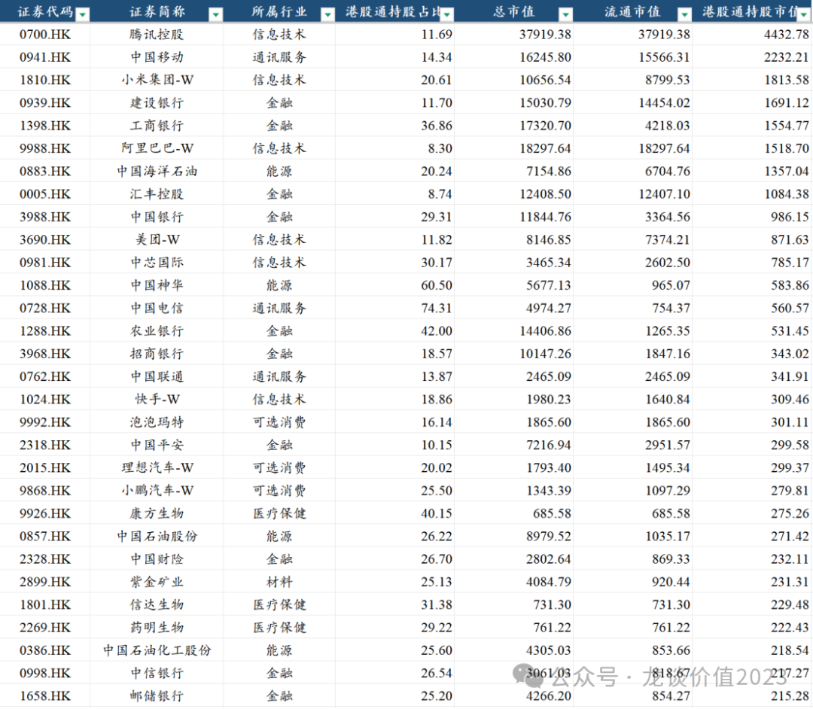

TOP30个股合计持股市值2.43万亿元，3.7%的公司贡献了62.2%的持仓，我们选几个最有特点的公司来说。

腾讯控股一家4433亿元的持仓市值，占南下资金持仓的11.73%，如果把南下资金整体看过一个资产管理组合，那腾讯控股的仓位就是11.73%，而港股通持股占腾讯的流通盘约为11.69%，从港股通持股比例来说并不算高，从整个南下资金的持仓比例来说对腾讯的持仓算是比较集中的。

值得注意的是，之前南下资金对腾讯的持仓比例在10%左右，今年1月上旬美国国防部将腾讯纳入涉军名单导致股价大跌后，南下资金反而大笔逆势抄底，加仓了四五百亿的腾讯，使得持仓比例提升到11.3%，后续又继续震荡提升到11.7%。

南下资金持仓市值第二的中国移动，港股通占流通盘14.4%，自2021年以来南下资金几乎是单边持续加仓，股价累计涨幅超过150%，即便是涨了这么多，24年分红对应当前市值的股息率还有5.9%，而由于中国移动A股相较H股溢价47%，A股中国移动的股息率则是4.1%。类似的还有中国电信、中国联通，也都是港股股息率显著高于A股，自2020年底以来南下资金持续买入，股价上涨都在2-3倍以上，其他如四大行、三桶油等逻辑类似，不再赘述。

港股的阿里巴巴是在24年9月新纳入港股通的标的，自纳入以后南下资金用短短半年多的时间买进去16亿股，高达1600亿元的持仓市值，是去年9月以来南下资金买入的主力标的，半年时间已经买到了8.5%的流通盘，占到南下资金对港股持仓的3.9%，但相对来说还有很大的提升空间。

可选消费方面持仓最多的是泡泡玛特、理想汽车、小鹏汽车等，持仓市值都在300亿元左右，持仓比例分别在16%、20%、25.5%。汽车整车从长期来看并不是好的商业模式，但中期来说中国新能源车的技术快速迭代创新、车型周期快速轮动，还是会带来一些投资机会，包括大家现在比较熟悉的小米和华为两家主导的一系列车型更是流量拉满。

3、南下资金控盘标的

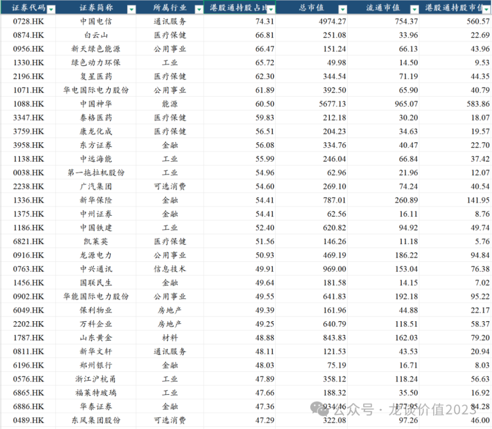

从持股比例角度来看又是另一番光景，目前有18家公司南下资金持仓比例50%以上，59家超过40%，103家超过30%，184家超过20%。

持仓比例要达到非常高，需要有两个前提，第一个是公司的大股东或者实控人的持仓基本是内资股或者A股为主，港股几乎全是自由流通股，第二是具有某些极致的特质，比如以上公司中要么是股息率确定性很高、估值底很明确的，要么是行业/公司质地和市场关注度不错、AH价差又尤其较大的。

持仓比例很高，意味着内资掌握定价权，则股价受到外资进出的影响就会小得多。但同样的问题还有也要面临内资的内卷和互割。

南下资金持股比例最高的中国电信，港股通持股占流通盘比例已经达到74.5%，中国神华的南下资金持股比例达到60.5%，新华保险达到54.4%，龙源电力达到50.9%，中兴通讯达到49%（此前最高达到54%）。可以看到对于市值偏大的公司来说南下资金能买到如此之高的比例而没有出现内资之间的“互割”，股票的“真实股东回报能力”在其中的影响因素是主导性的，也基本是长线资金基于长期配置的标的。

就我们医药行业来说，南下资金持仓占流通股比例最高的分别是复星医药（62.3%）、泰格医药（59.8%）、康龙化成（56.6%）、凯莱英（51.6%）、云顶新耀（46.4%）、亚盛医药（44.8%）。

对CXO的钟情真是挡不住，不过也可以理解，我们之前说药明康德其实是医药股里AH溢价最小的公司，所以买A和买H的差别并不大，但是如果我们看其他家的CXO，泰格、康龙、凯莱英的AH股溢价分别是85%、93%、56%，都要远高于AH溢价全行业平均30%左右的水平，那么买H股就要比买A股的性价比高得多。

这里也再多讲一点我的看法，AH溢价由于两地市场流动性、具体股票流动性、投资者结构差异和偏好差异等因素，并不能一概而论什么水平是绝对合理的水平，且多数情况下从中期维度AH的股票比较常见的是同涨同跌的。

但对于做价值投资的人来说，做的久了最终是拼认知深度。比如你说，“龙哥，你也看好百济，我也看好百济，我买A股百济赚的比你买H股百济赚的多的多”，那我也只能认，我自己的认知就在这，就只能赚认知范围内的钱。

更何况，中芯国际的例子还历历在目，中芯国际至今AH溢价还有110%，南下资金已经买到30%的港股流通盘，而与之对应的北向资金对A股中芯国际的持股比例只有2.1%，今年以来H股中芯国际就是大幅跑赢A股中芯国际。

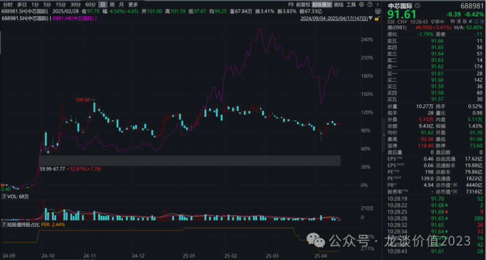

......

另外再提一下我今年来定投的两个组合。

第一个龙谈医药科技组合，这个组合原本是美股科技+AH医药的组合，医药和科技这两个相关度非常低的行业放在一起可以大幅提升组合的抗风险能力，即便是同样遭受了上周一的暴跌，也可以快速反弹，目前仍做到了8个点的超额收益。

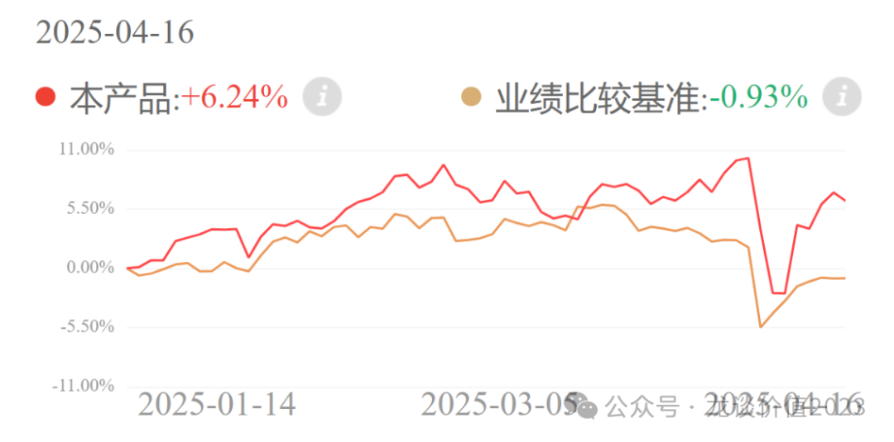

不过近期管理人考虑到几点因素，将美股AI科技调整为港股AI科技：

①美国经济目前不确定性较高，高关税，低通胀，高增长难以同时实现，对美股的基本面将造成较大影响

②deepseek问世以来，阿里巴巴，腾讯纷纷上调资本开支预期，今年中国AI产业的发展进入加速期，并且产业的发展在中美博弈的背景下只会更加急迫

③上周恒生科技下跌之后目前估值处于较低水平，回到deepseek出现之前，目前位置中期来看性价比较高。

第二个龙谈美元债组合。大家知道美债最近急跌了很多，但人民币兑美元同时也有所贬值。今年4个月的时间，组合的超额收益仍然在2%以上。

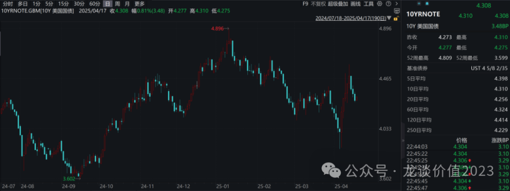

美债近期回升到4.5后往下回落，经过这一轮压力测试，体现特朗普政府对于美债非常重视，4.5将是比较高的位置，往后来看下行空间仍然较大。虽然近期美元贬值降低了一些美债的投资收益，但是长端美债的资本利得确定性比较强，预期资本利得能够较好对冲美元币值的风险。

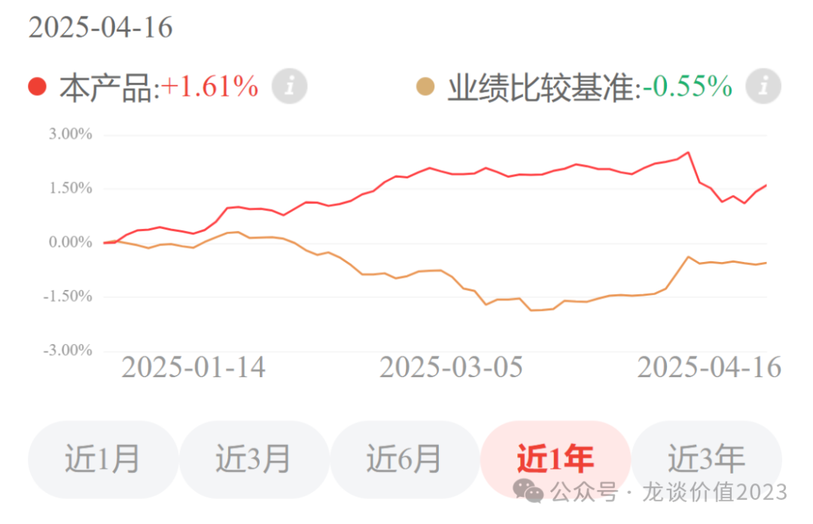

以上两个组合，可以直接扫以下二维码在京东金融的APP或者小程序上查看。

风险提示：本文仅讨论行业/公司经营情况，投资需综合考虑公司经营、估值、管理层等多方面因素，建议读者审慎参考，本文不作为投资依据，不建议大家根据本文做出投资计划。

<!-- wxmp-comments-begin -->

---

## 留言（5 条，含回复共 11 条）

- **安之** 👍2 · 2025-04-17 13:32
  沙发[呲牙]
  - ↳ **作者** · 2025-04-17 13:33
    哈哈，再翻上去读文章[呲牙]
- **老加仓** 👍1 · 2025-04-17 13:50
  还看好Cxo啊？估值要打折扣了
  - ↳ **作者** · 2025-04-17 14:05
    我只是客观描述南下资金的持仓，估值打不打折扣不是我来决定的，H股的CXO本来就是折价的。
- **杨思宁** 👍1 · 2025-04-17 13:59
  谈一下，恒瑞港股上市后，H的估值是否能大于a股？
  - ↳ **作者** · 2025-04-17 14:06
    建议可以翻遍全市场的AH股看看，有几家是H股估值能高于A股的[尴尬]
  - ↳ **作者** · 2025-04-17 14:09
    这个问题也没什么意思，你要真和H股的其他pharma公司比估值，那岂不是估值得砍一半以上。
- **乙方** 👍1 · 2025-04-17 18:13
  龙哥好！目前港股创新药指数估值如何，历史估位置处于什么位置？目前还可以定投吗？美国生物安全法（4月10日初稿）对港股创新药有何影响？谢谢
  - ↳ **作者** · 2025-04-17 20:29
    第一个问题，见4月2日文章。
    第二个问题，短期市场情绪剧烈波动导致的杀跌往往是更好的定投买点。
    第三个问题，大部分观点在4月9日文章有讲到，4月10日只是一个研究报告，并没有生物安全法，报告里基本没有提到创新药海外BD授权。
- **丁山** · 2025-04-17 16:08
  龙谈科技医药组合，会把所有的美股AI科技调都换成港股AI科技吗？
  
  美股科技普遍都很贵了，是要更换了。
  - ↳ **作者** · 2025-04-17 16:16
    是的，全部更换的

<!-- wxmp-comments-end -->
