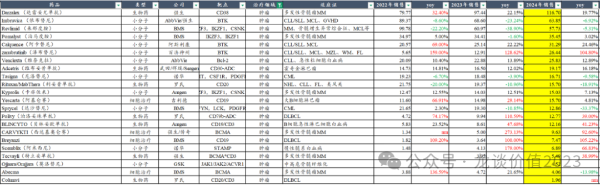
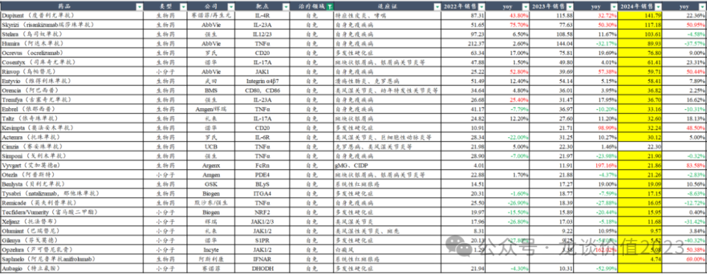
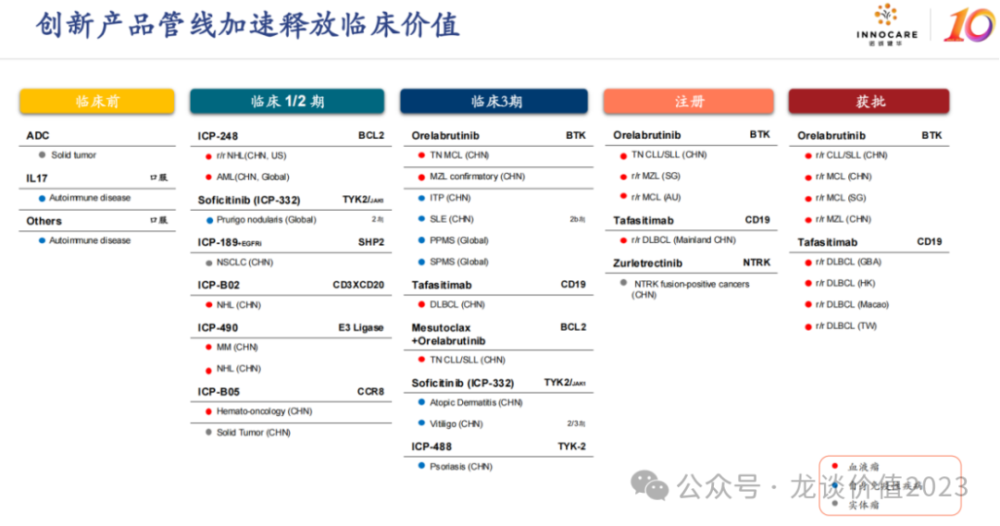
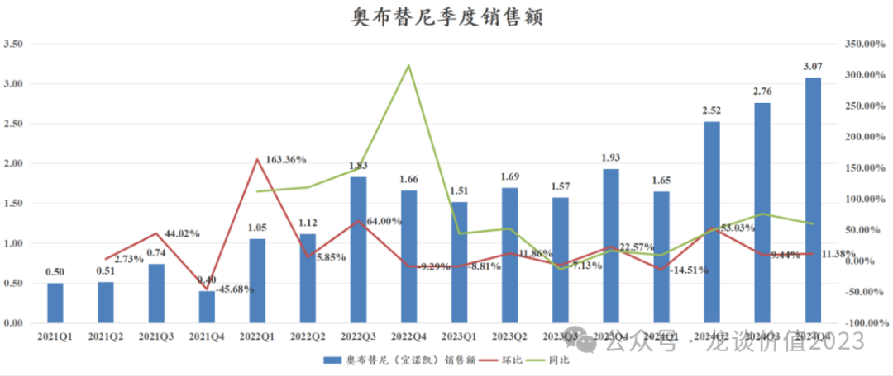
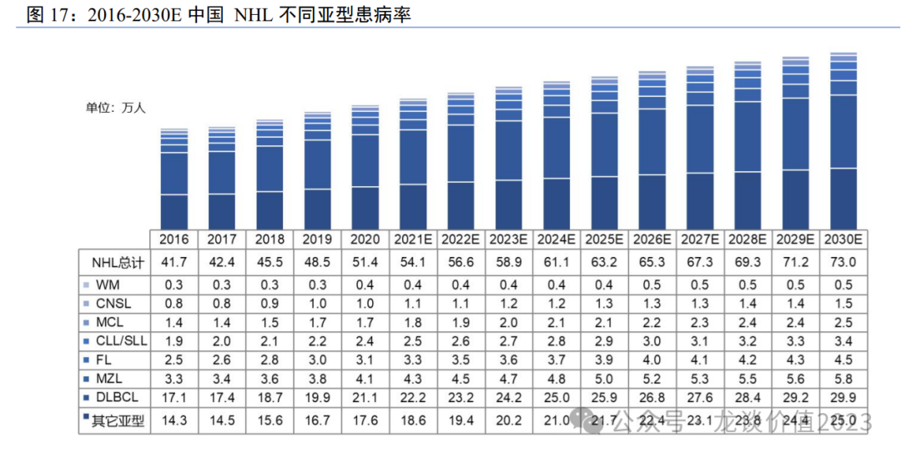
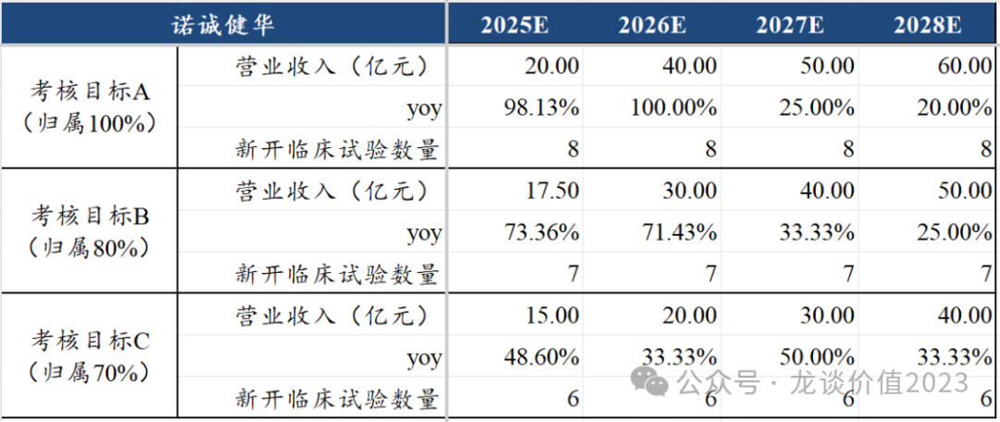

# 横跨两个黄金赛道

大家好，我是龙哥。

今天聊聊一家横跨血液瘤和自免两大黄金赛道的新兴biopharma公司——诺诚健华。

首先来聊聊，为什么说血液瘤和自身免疫性疾病是两大黄金赛道，这两个赛道的共同点是——定价较高的慢病或类慢病领域。

血液瘤药物目前随着一系列小分子靶向药和生物药的突破，生存期越来越长，一些血液瘤的用药时长经常可以达到5年以上、生存期可以类比很多传统慢性病，但是血液瘤药物的定价却又是以“肿瘤药定价体系”来进行定价。

自免疾病也是类似，自身免疫性疾病药物在国内定价虽然和肿瘤药一样都是要远低于海外，但是相比于传统的心血管、糖尿病等慢性病的定价要高得多，并且自免疾病患者群体庞大、过去治疗方案与海外差距非常大，随着国产自免药物的逐渐进入商业化，该领域也已经处于爆发的前夕。

具体到国内的医保谈判价格我们可以更直观的理解我以上的观点：

①血液瘤：

亚盛医药的奥雷巴替尼在2022年医保谈判价格对应年用药费用是17.5万元，是典型的高价肿瘤药的定价体系，但是奥雷巴替尼在一二代TKI经治的T315I突变阳性CML的患者中的中位PFS还要超过4年，也即理论上患者用药周期可以超过4年。

第二代的BTK抑制剂，目前国内有百济神州、诺诚健华、阿斯利康3款药物获批上市，3家公司在22-24年的医保谈判中对BTK抑制剂价格谈判的年用药费用都在12-13万左右，是典型的肿瘤药在国内的定价体系，而第二代的BTK抑制剂我们知道在复发难治的CLL中的用药DOT都要超过5年，在一线CLL中的CLL用药周期会更长的多，已经是典型的慢病用药的超长用药周期。

从全球市场来看，血液瘤大品种市场规模超过500亿美金，且出现多个百亿美金的大品种，包括来那度胺、达雷妥尤单抗、伊布替尼等。

②自免：

自免疾病类似心血管、糖尿病等传统慢性病，需要长期用药，国内目前心血管、糖尿病等慢病药的医保谈判中，年用药费用大概在小几千到大几千不等，而自免的创新药，定价年用药费用普遍在2-4万左右，对于患者群体不太大、竞争格局尤其好的部分自免药物定价可以在5-20万不等，如再鼎医药的艾加莫德如果按照一年用药5个周期计算的年用药费用达到22万（目前实际DOT用不到那么久）。

定价高、患者群体庞大、用药依从性较好等因素，使得自免领域在国内市场也陆续开始出现大品种，如诺华的可善挺国内销售已经达到60亿以上。

海外市场更不必多说，自免已经连续多年是仅次于肿瘤的第二大药物市场，诞生了多个百亿美金和数十亿美金的超级大品种，如阿达木单抗峰值超过200亿美金，多年的全球药王，度普利尤单抗24年超过140亿美元，瑞莎珠单抗超过110亿美元且仍有51%的高增长。

......

诺诚健华我们从管线来看，目前有一款血液瘤领域的BTK抑制剂奥布替尼在国内商业化，CD19坦妥昔单抗在国内申报NDA，TRK抑制剂卓乐替尼在国内申报NDA，还有血液瘤领域的BCL-2抑制剂在III期临床，自免领域则是有BTK抑制剂、TYK2-JK1抑制剂（JAK1抑制剂）、TYK2-JH2抑制剂等3款分子在III期临床。

①奥布替尼血液瘤

奥布替尼的销售从24Q2开始爆发，逐季度上调预期，主要受益于独家纳入医保的血液瘤适应症——边缘区淋巴瘤（MZL），MZL的患者群体本身比较多，此前主要是off labal使用CD20单抗或者BTK抑制剂，而目前有奥布替尼正式获批该适应症并纳入医保，由此具备了市场竞争力。

24年奥布替尼国内销售额合计10亿元同比增长49%，330人的销售团队实现超过300人的单产，在国内来说已经算是比较高效的销售团队。

公司对25年销售指引是30%的增长，仍有上调销售预期的潜力。其中MZL在24年已经占到奥布替尼销售额的30%（约3亿元），25年预计进一步提升到40%（5.2亿以上，同比+70%以上）。

除此以外25年奥布替尼还有一线的CLL/SLL将会获批上市，如果能在630以前获批的话还有机会参加今年的医保谈判（还要看今年医保谈判卡时间点的情况）。奥布替尼还有一线治疗MCD亚型DLBCL目前在III期临床随访。

②CD19单抗

CD19单抗坦昔妥单抗是诺诚健华海外BD引进的一款分子，目前在申报的是国内血液瘤最大的癌种——弥漫大B细胞淋巴瘤（DLBCL）适应症，可以与BTK抑制剂共用销售团队，会有业务上的协同。另外CD19在海外24年还有滤泡性淋巴瘤（FL）的III期临床取得成功。

③TRK抑制剂

这是诺诚健华第一款实体瘤的新分子，就在上周4月16日刚刚提交上市申请，预计在26年获批上市，是一款泛癌种治疗TRK融合阳性实体瘤的药物，适应症不大，诺诚健华本身也没有实体瘤的销售团队，因此该药物的销售预期并不高。

④BCL-2抑制剂

诺诚健华在今年2月启动了BCL-2抑制剂联用奥布替尼一线治疗CLL/SLL的注册III期临床，有望成为中国市场首家获批一线CLL的BCL-2抑制剂，同时还在开发急性髓系白血病（AML）等适应症，今年将持续有数据读出。

⑤奥布替尼自免适应症

奥布替尼目前在自免领域有2个适应症启动III期临床，分别是在国内正在进行的ITP的III期临床和在海外进行的原发进展型多发性硬化（PPMS）、继发进展型多发性硬化（SPMS）的全球多中心III期临床。此前赛诺菲的Rilzabrutinib在ITP、Tolebrutinib在SPMS已经取得III期临床的成功，且Rilzabrutinib已经在国内申报上市，奥布替尼这两个适应症成药的概率也会相应比较高。另外奥布替尼目前还在在国内进行SLE的IIb期临床，目前已经完成患者入组。

⑥ICP-332（TYK2-JH1）

ICP-332被诺诚健华用于开发中重度特应性皮炎（AD）、白癜风等适应症，虽然说是TYK2抑制剂，但其更类似一款JAK1抑制剂，有望成为安全性更佳、没有黑框警告的AD适应症小分子药物。

全球第一款JAK1抑制剂乌帕替尼24年全球销售额60亿美元同比增长50%，国内AD药物市场包括赛诺菲的IL-4Rα单抗、辉瑞的阿布昔替尼和艾伯维的乌帕替尼等3款药物，目前又有国产康诺亚的IL-4Rα单抗和恒瑞的JAK1抑制剂获批，诺诚健华有望成为下一款国产JAK1抑制剂上市，分享特应性皮炎的千万患者人群、百亿市场潜力。

⑦ICP-488（TYK2-JH2）

ICP-488被诺诚健华用于开发中重度银屑病适应症，国内启动III期临床，预计25年完成III期临床患者入组，是国内第二家启动III期临床的TYK2抑制剂，其作为银屑病小分子口服疗法，作为生物制剂的补充。

在此前的文章中我们曾写到，IL-23p19作为一款疗效极佳、且给药间隔长达12周的生物制剂，是一款在银屑病领域几乎“杀死比赛”的药物。BMS和诺诚健华的TYK2抑制剂目前披露的数据来看并不能相较IL-23p19形成竞争优势，且需要每天口服给药，或许能拿到部分不愿意打针的患者，但预计市场规模不会太大。BMS的TYK2抑制剂在海外的销售额就显著低于预期。

TYK2抑制剂后续一方面关注临床数据极佳的武田制药、益方生物的临床开发进展，另一方面则要看则IBD适应症的拓展情况，IBD的临床未满足需求要显著高于银屑病，IL-23p19虽然也有IBD适应症获批，但疗效也并不算很出众，因此IBD市场目前仍大有可为，包括前几年MNC们重金投资的TL1A和TYK2靶点。

⑧其他早期分子

除了以上分子以外，诺诚健华有一款与康诺亚合作开发的CD20\*CD3双抗在今年1月实现海外BD授权，另外其也开始布局ADC药物，目前披露的第一款B7-H3 ADC处于临床前阶段。

公司在24年底发布的股权激励计划中，有对25-28年的较高的业绩考核目标，其中对收入端的考核目标较高：

该业绩考核之下，如果仅靠奥布替尼血液瘤的销售，想要达到的难度很大，哪怕是想要达到归属70%的考核目标C都有难度，这也就意味着公司的股权激励考核目标中包含了对产品海外BD的预期。目前管线中包括BTK自免适应症、BCL-2及其他早期分子都有海外BD授权的潜力。

估值方面，诺诚健华目前H股的市值不到150亿元，包括：

①肿瘤条线，奥布替尼国内血液瘤适应症（预计峰值20亿）、CD19单抗（预计峰值8-10亿）、BCL-2抑制剂（预计峰值15亿、30%份额）、NTRK抑制剂（暂不给预期）、SHP2抑制剂（暂不给预期）。

②自免条线，奥布替尼全球自免适应症（全球峰值潜力较高，10亿美元+，但海外临床不确定性较多），ICP-332、ICP-488（两款药物覆盖AD和银屑病等自免大适应症，峰值潜力20-30亿+）。

另外截至24年底诺诚健华在手现金约78亿元，剔除有息负债后的净现金约为65亿元。

......

近期重点文章（可直接点击下列链接查看）：

《[宇宙级大药](https://mp.weixin.qq.com/s?__biz=MzkyMzQ3MDc3Mw==&mid=2247484380&idx=1&sn=f59a39aac3c6cb168c326d789c8d8031&scene=21#wechat_redirect)》

《[把握下一个ADC领域龙头biotech](https://mp.weixin.qq.com/s?__biz=MzkyMzQ3MDc3Mw==&mid=2247484358&idx=1&sn=7dddbb02ce72e890e4b4565060eb8470&scene=21#wechat_redirect)》

《[恒瑞医药火力全开](https://mp.weixin.qq.com/s?__biz=MzkyMzQ3MDc3Mw==&mid=2247484343&idx=1&sn=8a9443fca3fd94f88388790956537836&scene=21#wechat_redirect)》

《[南下资金扫货](https://mp.weixin.qq.com/s?__biz=MzkyMzQ3MDc3Mw==&mid=2247484346&idx=1&sn=73ead3d2fc35257c15fd44d703f85e61&scene=21#wechat_redirect)》

《[医药再迎政治风险考验](https://mp.weixin.qq.com/s?__biz=MzkyMzQ3MDc3Mw==&mid=2247484324&idx=1&sn=f5e3ee849121ed9f038afe25551cfbb4&scene=21#wechat_redirect)》

《[医药暴涨，估值贵了吗？](https://mp.weixin.qq.com/s?__biz=MzkyMzQ3MDc3Mw==&mid=2247484317&idx=1&sn=28b1cabe165edbe8fe713987e79e3ee9&scene=21#wechat_redirect)》

《[CXO全面复苏](https://mp.weixin.qq.com/s?__biz=MzkyMzQ3MDc3Mw==&mid=2247484308&idx=1&sn=3ecff125b0b85e5cd323cb99f646e2a3&scene=21#wechat_redirect)》

《[医药最高景气方向](https://mp.weixin.qq.com/s?__biz=MzkyMzQ3MDc3Mw==&mid=2247484299&idx=1&sn=c6677f52d0ea6ebfbc11420984b3636d&scene=21#wechat_redirect)》

《[又一家百亿创新药巨头出现](https://mp.weixin.qq.com/s?__biz=MzkyMzQ3MDc3Mw==&mid=2247484285&idx=1&sn=c741f32eb039e33d3c3915a65dfb984f&scene=21#wechat_redirect)》

《[创新药出海，分歧时刻](https://mp.weixin.qq.com/s?__biz=MzkyMzQ3MDc3Mw==&mid=2247484272&idx=1&sn=a5850a6c1302ac8942030e1e7c5db971&scene=21#wechat_redirect)》

《[美国药品大降价](https://mp.weixin.qq.com/s?__biz=MzkyMzQ3MDc3Mw==&mid=2247484234&idx=1&sn=28cf6165faae82f398c9afb5f39bd641&scene=21#wechat_redirect)》

《[中国创新药出海双王已立](https://mp.weixin.qq.com/s?__biz=MzkyMzQ3MDc3Mw==&mid=2247484223&idx=1&sn=8607586f00583da6b063edd81ede3f5b&scene=21#wechat_redirect)》

《[生物药龙头关键年](https://mp.weixin.qq.com/s?__biz=MzkyMzQ3MDc3Mw==&mid=2247484213&idx=1&sn=e31cea42ba599a77117d7d7daf895fec&scene=21#wechat_redirect)》

《[中国创新药出海之王](https://mp.weixin.qq.com/s?__biz=MzkyMzQ3MDc3Mw==&mid=2247484173&idx=1&sn=52dcb6390d13960d7ec157efb9ec76f6&scene=21#wechat_redirect)》

《[创新药巨头狂飙](https://mp.weixin.qq.com/s?__biz=MzkyMzQ3MDc3Mw==&mid=2247484144&idx=1&sn=0b26f935e3f7a1a6248b091a6c0ec916&scene=21#wechat_redirect)》

《[最全ETF梳理](https://mp.weixin.qq.com/s?__biz=MzkyMzQ3MDc3Mw==&mid=2247484135&idx=1&sn=2a8555f0200922f90e82d51562574545&scene=21#wechat_redirect)》

《[生物科技的狂欢](https://mp.weixin.qq.com/s?__biz=MzkyMzQ3MDc3Mw==&mid=2247484124&idx=1&sn=233fb7eda9c948a508908c6a66a6a4d0&scene=21#wechat_redirect)》

《[两个资产配置的重点方向](https://mp.weixin.qq.com/s?__biz=MzkyMzQ3MDc3Mw==&mid=2247484114&idx=1&sn=9d862ed9cfbfe39f4608466e3943f3e8&scene=21#wechat_redirect)》

《[医药行业趋势展望](https://mp.weixin.qq.com/s?__biz=MzkyMzQ3MDc3Mw==&mid=2247484101&idx=1&sn=febb0b581f3311f2fb2477ef02efdb50&scene=21#wechat_redirect)》

《[非典型利空](https://mp.weixin.qq.com/s?__biz=MzkyMzQ3MDc3Mw==&mid=2247484042&idx=1&sn=7f0001decb5fca1b658ec50e1c995893&scene=21#wechat_redirect)》

《[中国医药历史性事件](https://mp.weixin.qq.com/s?__biz=MzkyMzQ3MDc3Mw==&mid=2247484024&idx=1&sn=4d42f6d88e255b20f426271c9be37b88&scene=21#wechat_redirect)》

《[最重要行业拐点](https://mp.weixin.qq.com/s?__biz=MzkyMzQ3MDc3Mw==&mid=2247483961&idx=1&sn=a6c753e24d874e551a8d2eebbfb515dd&scene=21#wechat_redirect)》

风险提示：本文仅讨论行业/公司经营情况，投资需综合考虑公司经营、估值、管理层等多方面因素，建议读者审慎参考，本文不作为投资依据，不建议大家根据本文做出投资计划。

<!-- wxmp-comments-begin -->

---

## 留言（8 条，含回复共 17 条）

- **和** 👍1 · 2025-04-21 16:12
  最近恒生医药ETF交易咋那么低迷？
  - ↳ **作者** · 2025-04-21 16:19
    上周五和这周一港股不开盘，ETF交易低迷一点也正常。
- **刘亮** 👍1 · 2025-04-21 16:17
  龙哥，试剂板块怎么看？目前大部分都是进口吧，后期国产替代能不能做起来
  - ↳ **作者** · 2025-04-21 16:21
    的确有国产替代的潜力，科研试剂国内公司普遍还比较小，跨国巨头占据大部分市场。不过核心矛盾还是国内整个科研试剂细分领域的市场规模有限且比较分散，行业整合可能需要较长的时间，单个公司的市值天花板有局限性。
- **Frank** 👍1 · 2025-04-21 16:21
  龙哥，请问迈瑞您怎么看，跌了好几年了
  - ↳ **作者** · 2025-04-21 16:24
    迈瑞这个真的也在评论区回复过好多遍了，建议平时看文章的同时也多看看评论区，有很多重要的问题都回答过了。
    迈瑞医疗调报表调了几年，一直稳定20%的业绩增速，直到去年Q2开始兜不住20%的增速了，Q3进一步承压，24Q4-25Q1压力更大，渠道去库存应该要持续到今年Q1，所以要看24Q4和25Q1业绩有多差，以及Q2有可能是业绩企稳的季度，也要跟踪观察。
  - ↳ **作者** · 2025-04-21 16:28
    迈瑞更多是和设备端的行业周期和渠道库存有关，新产业受IVD行业β影响，包括集采、反腐、DRGs等因素的影响，会有些差别，当然迈瑞的IVD业务也要面临类似的行业现状。
- **尘缘** · 2025-04-21 16:57
  亚盛医药，好像专门做血液瘤这个赛道，另外它的BCL-2在2024年11提交了NDA，它才是第一家吧？
  - ↳ **作者** · 2025-04-21 16:58
    嗯，亚盛的BCL2做的是后线的CLL，应该是国产第一家。诺诚在一线CLL有机会是国产第一家。
- **zzlpq** · 2025-04-21 17:26
  抽空聊聊天坛[好的]
  - ↳ **作者** · 2025-04-21 18:07
    我准备等到血制品公司的财报出完以后，就整个行业写一篇，还得稍等到5月份咯[握手][握手]
- **求索者** · 2025-04-21 19:29
  龙哥最近功课没做足啊，亚盛2575联合阿卡在国内一线注册临床在23.10就获cde批准了。。。。。。而且就算要吹bcl2也得吹百济啊，最起码百济的基础研究和临床剂量探索做的扎实，诺诚的248还是算了吧，连单药的数据都不够。
  - ↳ **作者** · 2025-04-21 21:52
    你看你读文章不细心吧，你觉得我会连亚盛在国内提交NDA都不知道吗，亚盛提交的是后线CLL，一线CLL推的很慢、成药概率有不确定性，一线CLL是有可能诺诚第一家推到主要终点的哦。
- **Bryan** · 2025-04-21 21:48
  期待龙哥讲到和誉～
  - ↳ **作者** · 2025-04-21 21:52
    也是很好的公司， 有机会会讲讲
- **🍵** · 2025-04-21 22:53
  诺成建华A股和H股哪个估值更便宜一些？
  - ↳ **作者** · 2025-04-21 23:00
    诺诚的A股比H股溢价接近140%

<!-- wxmp-comments-end -->
