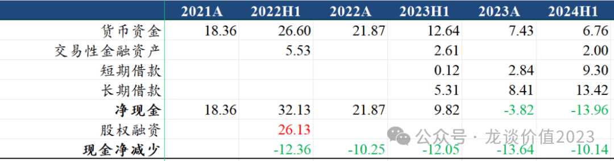
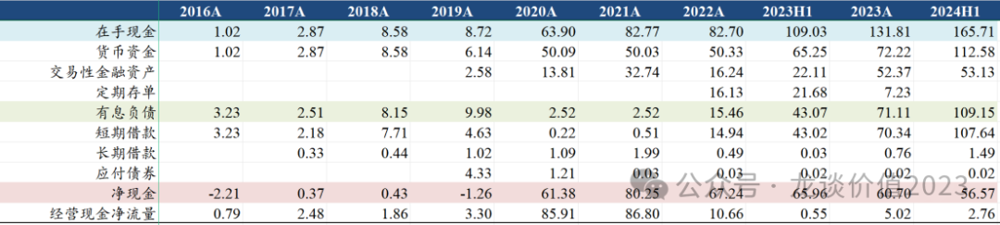

# 医药行业离谱事件2

***本文发于2024.09.06，配合头条文章使用更佳。***

***提示：本文纯属虚构，如有雷同，纯属巧合。***

**1、根本花不完**

某公司，管理层，业绩电话会：我们银行授信还有十几亿，都用不完。

？？？哥，清醒点好吗，你以为你是王多鱼，十个亿呀十个亿、一生一世花不完？你每半年就能花10个亿啊哥。

**2、你管我赚多少，反正不给你**

某公司：

行业超高景气、公司赚大几十亿利润：我们把资金用在产能扩张、抢占市场份额。

行业产能严重过剩、价格战、利润下滑：我们把资金留在应对寒冬。

行业企稳：海外利率高，我们国内经营靠借债、现金留在海外吃利息。

**3、我不干了，我去享受生活，下午就飞美国**

某公司过去3年股价相较高位跌了90%+（见《**[医药行业离谱事件](http://mp.weixin.qq.com/s?__biz=MzkyMzQ3MDc3Mw==&mid=2247483848&idx=1&sn=aa0791f438ad4b17069d48348913448b&chksm=c1e5df12f692560444fe0d830ab3b82f8c0cf444fe24089d9ac497504a3c16c6ee6f235557b2&scene=21#wechat_redirect)**》第6条），前几年疯狂加杠杆无序扩张导致行业退潮后目前债务压力巨大，股东大会公司管理层遭到小股东密集声讨，把董事长怼急眼了，当场说我不干了，我可以现在就写辞职信，下午就飞美国，直接吓坏现场小股东，毕竟这位董事长是他们的精神信仰。

后来在某公司的某子公司股东大会上又被小股东怼，直言1亿薪酬对他来说太少了、根本看不上。

**4、常态化**

某公司表示，我们产品对外授权收入可以每年都有，对BD团队有每年收入增长的考核要求，别看我们现在PE高，加上BD的收入利润之后就不高了。

过去几年医药行业好多常态化，一堆公司的新冠收入常态化，某CXO公司的投资收益常态化，还有BD收益常态化。

**5、应收账款之谜-2**

见《**[医药行业离谱事件](http://mp.weixin.qq.com/s?__biz=MzkyMzQ3MDc3Mw==&mid=2247483848&idx=1&sn=aa0791f438ad4b17069d48348913448b&chksm=c1e5df12f692560444fe0d830ab3b82f8c0cf444fe24089d9ac497504a3c16c6ee6f235557b2&scene=21#wechat_redirect)**》第9条

某公司一款超级爆款疫苗产品（在整个中国医药市场的单品年销售额是前无古人、后也不知道有没有来者），多年利润全部转化为应收账款和存货，直到今年一季度还有双位数增长，到二季度突然收入爆降48%......

原因嘛咱也不知道，首先排除压货的可能性....？

**6、半年的渠道库存**

某公司表示，我们渠道库存大概1-2个季度，是正常水平。

你等下，1-2个季度的渠道库存、是1个季度还是2个季度啊.....你这两个季度是上半年2个季度还是下半年2个季度啊.....你下半年那2个季度可是占全年收入57%啊.....

**7、言出法随**

某公司，所处领域，产品价格高，全行业被要求降价，公司重点创新产品，直接与普通同类产品比价，同行都降了，就公司创新产品降价幅度不够。

公开发函。群情激奋。公司紧急赶赴京都，道歉、反思、降价三连。

**8、10年复合30%增长**

某公司，前几年各家推票都按照10年复合30%增长来线性外推，这种线性外推之下的结论就是——100倍PE都算合理。结果，现在公司拼命把体外资产往体内装，也只能做个低个位数增长。

**9、应收账款问题不大**

某两家公司，前两年xg里积攒了不少应收账款，公司表示，我们会计处理比较激进，我们xg相关回款挺好，我们不会大规模计提减值，前面计提的甚至可能充回。

2023中报：滴！计提3.17亿。滴！计提2.52亿。

2023年报：滴！计提4.89亿。滴！计提3.83亿。

2024中报：滴！计提2.96亿。滴！计提2.55亿。

这位行业老二，应收款规模是总市值的1.4倍。

**10、三不发**

某公司：我们要发港股的IPO，但我们有“三不发”，H股估值低于A股我们不发......

***再次提示：本文纯属虚构，如有雷同，纯属巧合。如有更多虚构的离谱事件，欢迎私信交流。***

<!-- wxmp-comments-begin -->

---

## 留言（0 条，含回复共 0 条）

_暂无留言_

<!-- wxmp-comments-end -->
