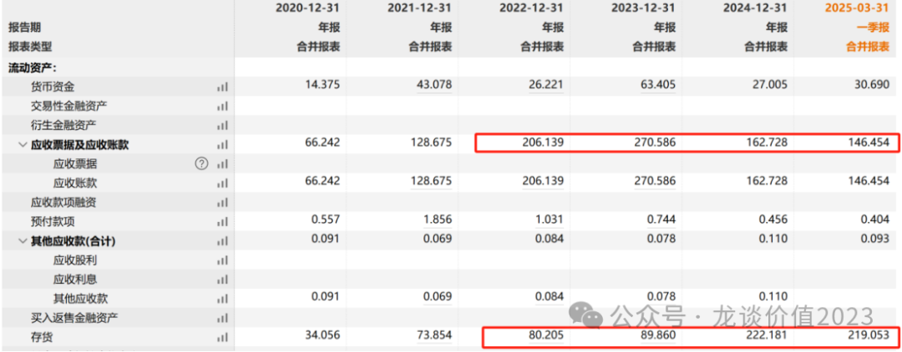
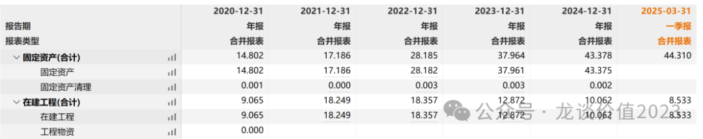
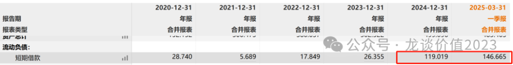
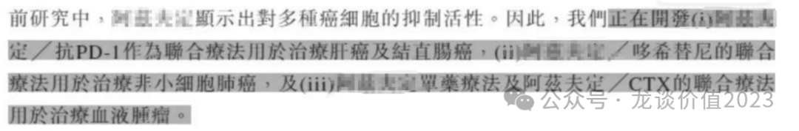

# 医药行业离谱事件3

提示：本文纯属虚构，如有雷同，纯属巧合。

1、价值毁灭之王

某公司，在中国市场代理一款全球最火爆的常规疫苗（非新冠），全球销售峰值接近百亿美金，这家中国公司23年在中国的销售收入峰值达到74亿美元，曾经的一针难求、排队预约都需要至少一两个月以上，巅峰时期公司的市值超过2300亿元。

这些年公司是不是赚的盆满钵满？

从收入端确实是，2018-2024年这7年间，该公司代理品种收入合计达到1600亿元，期间还顺便卖了100亿元的新冠重组蛋白疫苗。最终带来的是什么？是花不完的现金和充沛的股东回报吗？

No No No

带来的是无穷无尽的应收账款和存货，与日俱增的资产减值。

带来的是10亿出头的自产产品收入却建设了超过50亿的固定资产和在建工程。

带来的是近150亿元的有息负债。

在之前的医药行业离谱事件系列里，已经是领先市场讲到其财务报表中不对劲的地方，但仍然低估了离谱程度。

2、新冠药抗肿瘤

2021年创新药行业曾有一个经典诈骗故事，某抗肿瘤的小分子靶向药被拿去做抗新冠适应症，市值一度炒到300多亿，这个公司是国内创新药领域为数不多做fast follow能全部做失败的公司，包括抗新冠适应症。

谁知道到了2025年，还有更癫的事情发生了，一款之前在国内获批且销售规模还不小、但一直市场比较有争议的抗新冠药物，居然新开了抗肿瘤的适应症。

肿瘤药抗新冠，新冠药抗肿瘤。好好好......

3、光速审批疫苗

大家知道前些年疫情期间，有几款市场关注度不低的国产或进口新冠mNRA疫苗，如某\*代理的德国公司的疫苗，如某森与某微合作研发的疫苗，但最终都因为各种原因没能正式获批。

但是有那么一家神通广大的企业，从没做过mRNA疫苗，却能在拿到新冠mRNA疫苗批件后不到一年的时间光速获批。

4、杭州之殇

杭州的城市管理水平和营商环境，一直是被大家高度评价的。

但是在医药行业，杭州似乎没有那么幸运。

某癌症早筛国产之光企业，收入从21年的2亿出头，爆发至23年的20亿，随后由于发不出无保留意见的2023年审计报告而停牌至今，内部还在争取定性内控瑕疵，到底是财务造假还是内控瑕疵相信大家都已经心中有数。

在这一年间公司还上演更多戏码，财务总监离职跑路到美国，董事长被罢免，公司办公场地迁到某大股东旗下另一家上市公司的楼里，又派了该大股东的年轻秘书来管公司，主打掏空最后的利益。

杭州还有另外一家高值耗材细分领域头部公司，大股东资金占用、资本运作也是把公司和小股东坑的不轻，市场份额一降再降。

5、数据编辑错误

YS中心回应对外公开的个别仿制药品种一致性评价存在数据重复的问题：

编辑错误，已改正。

6、抗新冠神药滞销

某抗新冠中成药神药，当年F城的时候吃的喝的发不上都要发这款药物，24年前三季度还有5.5亿利润，24年报预报突然业绩变脸，全年预亏6-8亿元，Q4单季度亏损11.5亿-13.5亿元，核心呼吸系统产品滞销，产品临近有效期计提存货减值。

7、蛇吞象

某家电巨头，24年收购了某市值接近500亿的国内血制品龙头公司之一的22%股权，成为该血制品龙头公司的实控人，然后居然想用其控股的另一家市值仅100亿出头的公司吸收换股合并该市值近500亿的血制品龙头公司。

最终该合并事项告吹，两家公司复牌后股价均暴跌。

风险提示：本文仅讨论行业/公司经营情况，投资需综合考虑公司经营、估值、管理层等多方面因素，建议读者审慎参考，本文不作为投资依据，不建议大家根据本文做出投资计划。

<!-- wxmp-comments-begin -->

---

## 留言（6 条，含回复共 15 条）

- **求索者** 👍8 · 2025-04-22 10:45
  龙哥最近高产啊，看来家庭地位极速攀升[呲牙]
  - ↳ **作者** · 2025-04-22 10:47
    最近硬气了不少，龙嫂天天找我请教医药的观点[悠闲][悠闲][悠闲]
- **知行** 👍4 · 2025-04-22 10:25
  龙哥，把对应的公司评论区首字母展示一下，我们好避坑，哈哈
  - ↳ **作者** · 2025-04-22 10:27
    你看，阅读不认真吧，本文纯属虚构啊，哪有什么首字母[旺柴]
  - ↳ **作者** · 2025-04-22 10:31
    这都是公示处理的，搜下就有了[呲牙]
- **Bryan** 👍2 · 2025-04-22 10:37
  疫苗属于雷区，很久没关注了，节约了精力...
  1.&nbsp;龙哥，传奇Q1营收很好啊，上周也微微一硬，但总体走势这么拉跨，是不是主要受美股中概股的情绪影响啊？
  2.&nbsp;诺诚好猛...大统领帮忙打下来了价格，可惜哪天买不过来，捞老朋友去了，忘了他，继续等回调吧...
  - ↳ **作者** · 2025-04-22 10:41
    传奇生物核心还是受到竞争格局恶化的潜在担忧，其次是你说的美股中概的问题，传奇生物的价值兑现需要靠被收购，而他错过被收购的好时候了，现在这种政治环境下再让MNC花上百亿美金来买一个中国公司，难度要大很多。
- **西城老舅** 👍1 · 2025-04-22 10:36
  第一家公司可是风头无两的大白马，那时候我就一直看不懂，不用自己研发，就靠代理就这么有护城河吗？结果我没选，躲过一劫。但是我选了另一家号称研发牛的，一样掉坑里了[捂脸]
  - ↳ **作者** · 2025-04-22 10:43
    疫苗是21年以来医药市值崩塌最严重的行业，杀估值、杀业绩、杀逻辑，万众瞩目到过街老鼠。实际上头部这家公司不需要什么护城河，绝大部分公司也都谈不上什么护城河，能做好大品种的营销、赚到充沛的现金流、给合理的股东回报，那起码是没得喷的公司，而不是像现在这样.....
- **在路上** 👍1 · 2025-04-22 10:38
  请问盘中港股创新药987018怎么回事？指数涨了5%，etf涨了2%，但溢价率正常
  - ↳ **作者** · 2025-04-22 10:39
    你交易软件没更新吧，我这显示ETF涨了5.4%
  - ↳ **作者** · 2025-04-22 10:44
    不是这个吗
- **日子一箩筐** 👍1 · 2025-04-22 10:54
  我就掉到毁灭之王里去了，当年没有任何一个机构说他不好，都夸上天了
  - ↳ **作者** · 2025-04-22 10:56
    那我得感谢某券商，写了篇报告名叫《救黎民于水火，解百姓于倒悬》，看完报告我就把疫苗全清掉了[旺柴]
  - ↳ **作者** · 2025-04-22 13:41
    [好的][好的][好的]

<!-- wxmp-comments-end -->
