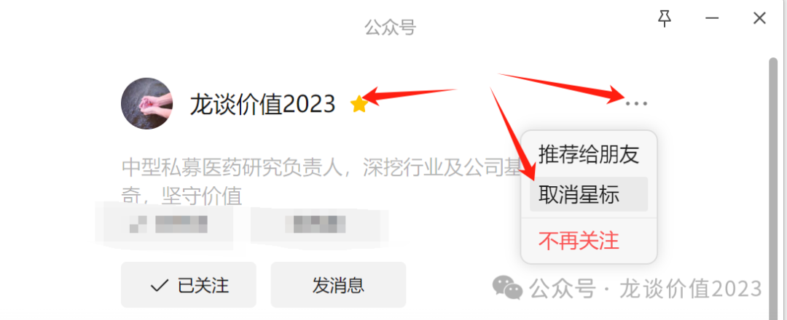
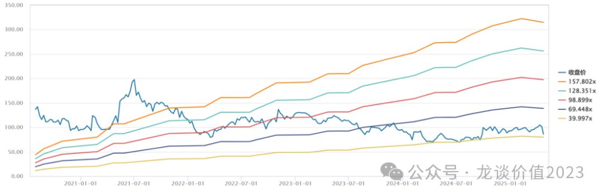
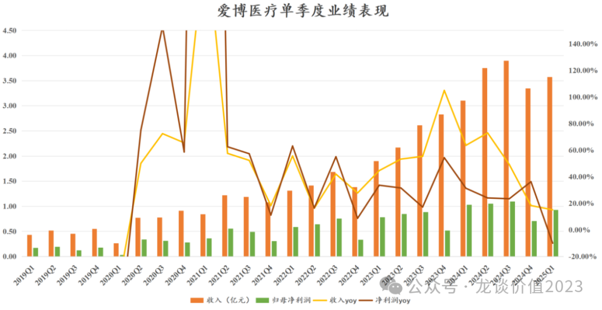
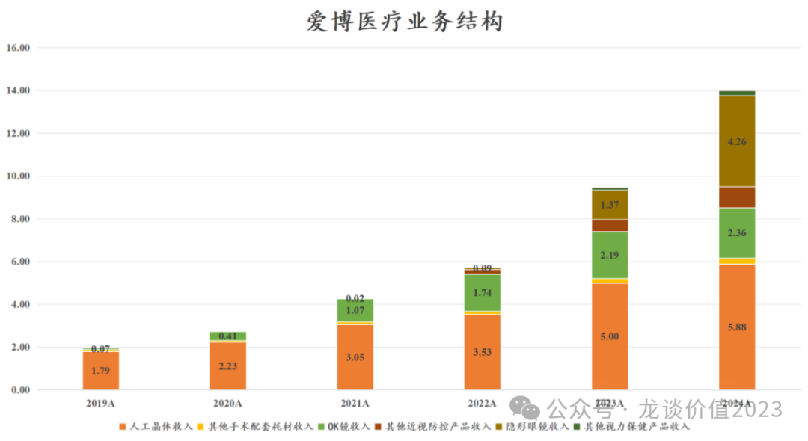
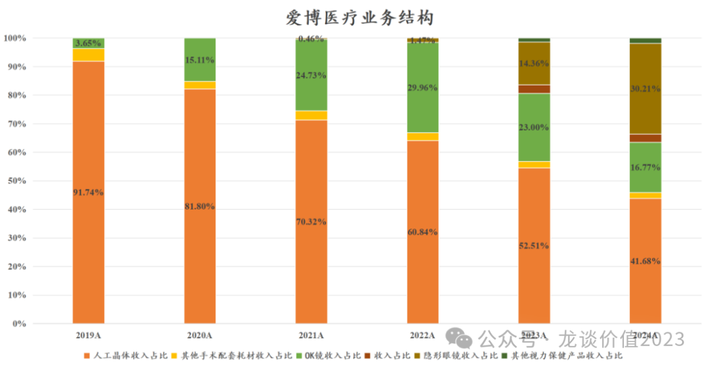
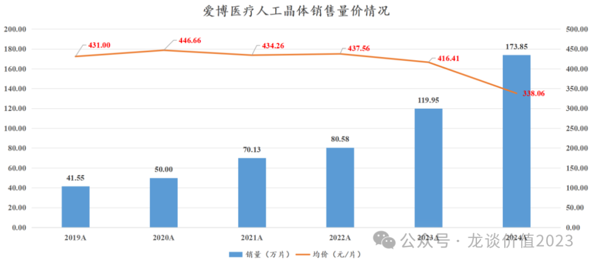
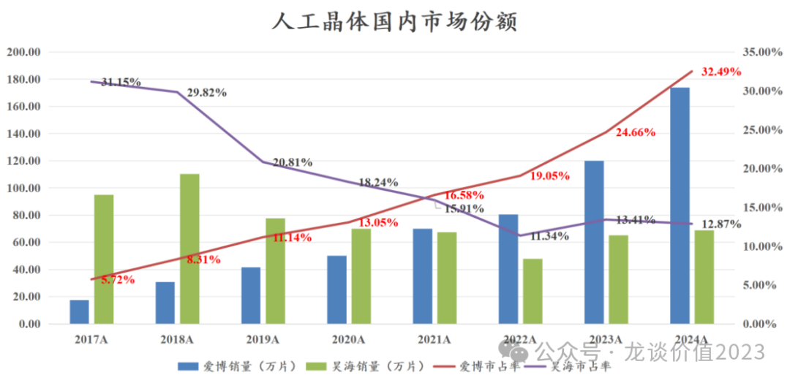
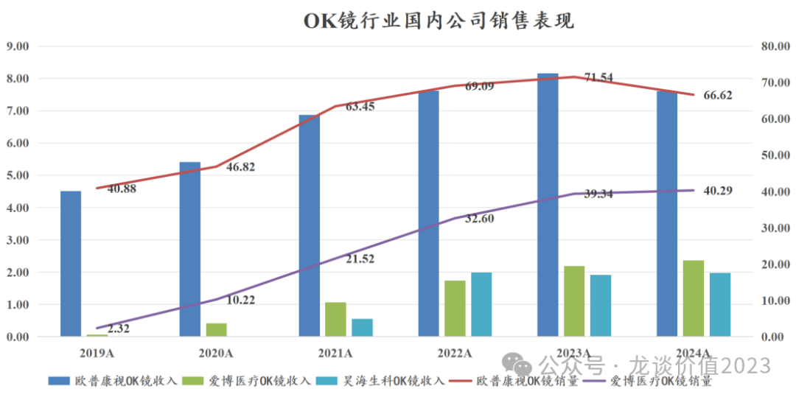
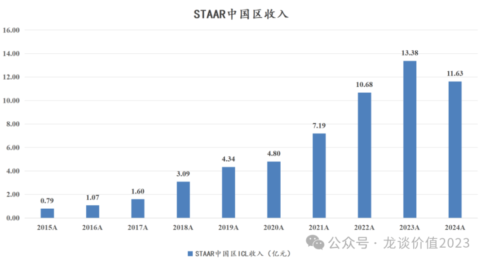

# 眼科超级成长股跌倒

大家好，我是龙哥。

文初先提醒一下，有几位读者后台留言说最近错过几篇好的文章，像周一刚写的《[横跨两个黄金赛道](https://mp.weixin.qq.com/s?__biz=MzkyMzQ3MDc3Mw==&mid=2247484409&idx=1&sn=cd9c01b6be30e09a0d4fb3c2d15d078b&scene=21#wechat_redirect)》周二就暴涨19%，结果周三才看到文章......

大家可以把公众号加个星标，这样文章更新可以及时看到，否则以微信公众号当前的推送方式，很容易错过好文。

眼科领域是过去大家关注度最高的医药细分领域之一，这个领域诞生了一众牛股，包括眼科用药的兴齐眼药，眼科耗材的爱博医疗、欧普康视和昊海生科，以及眼科医疗服务的爱尔眼科、普瑞眼科等等。

但随着这两年的消费降级和行业竞争加剧，一个个眼科超级成长股的神话破灭，最终只剩下一个爱博医疗的业绩成长性还一枝独秀，这最后的神话，也在披露24年年报和25年一季报后被打破，爱博医疗一季报后两个交易日股价暴跌24%。

我们本文就来聊聊，爱博医疗目前的业绩情况、业务发展阶段、以及未来是否还有足够的成长潜力。

1、业绩情况

爱博医疗2024年收入14.10亿元+48.24%，归母净利润3.88亿元+27.77%，爱博医疗在2020年科创板上市以来的5年间，收入从19年的1.95亿增长至14.10亿，5年收入复合增速48.5%，归母净利润从0.67亿增长至3.88亿，5年利润复合增速42%，业务结构的变化使得公司毛利率和净利率有所下降，但从这个成长性来说确实无愧超级成长股的说法。

但是再好的成长股，也架不住超高的估值，爱博医疗近5年的利润增长了5.8倍，同时估值从超过200倍PE下降到40倍PE，公司用了5年的时间消化超高估值，仍然没有达到很便宜的水平。

在2020年我们第一次讲爱博的时候就提到，这种估值下，爱博可能得用3-4年时间消化高估值，如今5年过去，业务结构也和我们当时判断的出现了很大的变化，支撑了其超高的成长性，却没有给股东在过去5年的业绩增长中带来回报，反而等来了一季报的低于预期。

2025年一季度，爱博医疗收入3.57亿元+15.07%，归母净利润0.93亿元同比下降10.05%，扣非归母净利润0.86亿元同比下降12.83%，这是自2020年Q1疫情冲击因素之外，爱博医疗的近20个季度首次出现利润同比下滑。

业绩短期下滑主要有几方面的原因，包括人工晶体集采降价、OK镜竞争加剧导致的价格压力以及PR新产品上市加大了销售费用投入等因素，我们下面从各项业务来看公司的具体情况。

2、业务分拆介绍

在2019年以前，爱博医疗95%以上的收入来自人工晶体及白内障手术配套耗材，公司的第二成长曲线——角膜塑形镜（OK镜）自2019年开始贡献收入，2020-2022年复合增速190%，到2022年收入占比达到30%。

公司的第三成长曲线——隐形眼镜自2022年开始贡献收入，2022-2024年复合增速608%，到2024年收入占比达到30%，与此同时OK镜的增速显著放缓，收入占比下降至17%。

而上图中没有的新业务——有晶体眼人工晶体（PR）已经正式获批上市，将在2025年开始贡献收入，有望成为公司的下一重要成长驱动力。

1）人工晶体业务

爱博医疗的人工晶体24年收入5.88亿元同比增长17.66%、收入占比仍有42%，其中销量173.85万片同比增长44.93%，由于集采导致平均价格下滑18.8%至338元/片，毛利率89.16%小幅下降0.07%总体仍维持稳定，集采后以价换量并没有导致爱博的人工晶体毛利率出现显著下降，这点倒是挺超我预期。

可以看到，上一轮的人工晶体集采基本未伤及到爱博医疗的出厂价，而本次的人工晶体集采则开始对出厂价有较大冲击，24年人工晶体集采从5-6月开始大概执行了半年左右，就对爱博的出厂价带来了这么明显的冲击，25年这个出厂价口径还会有进一步的下滑，主要在25年的上半年体现，25年下半年就将回到正常的基数水平。

爱博的人工晶体销量这几年还有快速的增长，从2020年的50万片飙升到2024年的174万片，但实际上行业增速并不高，行业只有个位数的复合增速，而爱博医疗在国内的市占率从13%飙升到30%以上。

当前爱博医疗在人工晶体领域的市占率已经较高，后续销量的增速势必也会放缓，集采也导致单焦点人工晶体的价格下降较多，但同时也要看到，爱博医疗的多焦点人工晶体也借集采开始放量，高端晶体的放量未来可以带动销售均价的显著提升，可能在26-27年会有所体现。

2）OK镜

OK行业近年的增长大幅的低于市场预期，一方面是本身受到消费降级的影响，另一方面则是受到竞品离焦镜的冲击，OK镜配镜+配套产品的使用费用大概要每年大几千到一万多，而离焦镜配一副眼镜之前最高是三四千，目前国产价格战之下只需要一两千，要知道我们现在去大一点的眼镜店配一副普通的近视眼镜可能都要大几百到一两千......

爱博医疗的OK镜增速已经是显著的高于行业，但是23-24年还是受限于行业增速而逐渐放缓，23年销量增长21%、24年销量增长则只有2.4%。

OK镜行业的竞争格局仍在进一步恶化，包括爱尔等下游的连锁医疗机构也开始投资自研的OK镜产品，预计爱博的OK镜业务未来很难再看到较高的增长。

虽然OK镜无法贡献业务增长，但爱博医疗同时还有离焦镜业务，离焦镜业务23-24年实现较高的增长，贡献了部分的业务增量。

3）隐形眼镜

爱博医疗通过收购江苏天眼和福建优你康两家公司进入隐形眼镜代工领域，2023-2024年隐形眼镜销量分别为6037万片和2.14亿片，销量分别同比增长16倍和2.55倍，销售均价分别为2.26元/片和1.99元/片，隐形眼镜业务的毛利率分别为26.63%和26.18%，25年则预计产能爬坡到3亿片。

根据爱博医疗披露的24年年报，其旗下负责隐形眼镜业务的子公司：天眼医药24年收入1.96亿元、净利润761万元，净利率3.9%；优你康24年收入1.48亿元、净利润1237万元，净利率8.4%，厦门美悦瞳收入0.86亿元、净利润163万元，净利率1.9%。

隐形眼镜代工从全球市场来看体量最大的是台湾的几家公司，包括晶硕、精华、金可海昌等：

晶硕23-24年收入在15-16亿元，毛利率54%-56%，净利率高达24%-27%。

精华23-24年收入在10亿元左右，毛利率22%-27%，净利率12%-16%。

海昌已经退市，退市前2020年前后的毛利率在54%-55%，净利率在13%-15%。

另外还有一家日本的SEED也是国际领先的隐形眼镜代工企业，23-24年收入在15-16亿元左右，毛利率43%左右，净利率4%-6%则是显著低于台湾企业。

对比可见，以国内的制造业产业链优势，未来爱博医疗的隐形眼镜收入体量起来以后，毛利率和净利率比较有可能与台湾的几家代工企业对标，也既毛利率达到40%-50%，净利率达到15%-25%，相较爱博医疗当前26%的毛利率和个位数的净利率有较大的提升空间。

4）PR晶体

爱博医疗的PR晶体在2025年的1月6日正式获得注册证上市，大家如果关注爱博医疗的公众号就会发现他们在4月开始陆续发文关于在全国多省市的医院开始首例植入其“龙晶”PR晶体。

在爱博医疗之前，全球只有一家主流的做有晶体眼人工晶体的厂家——STAAR SURGICAL公司，这也是一家美股上市的美国公司，2023-2024年的收入在22亿-23亿元左右，毛利率在76%-78%左右，Staar公司23-24年中国区收入占比分别是57.6%和51.4%，24年中国区收入同比下滑的13%，同样是受到国内消费降级的影响，其ICL手术3万多的价格目前要比全飞秒的价格高一倍左右。

以STAAR的中国区收入和出厂价大致推算，预计国内市场目前ICL晶体的销量大概在30-35万片/年。

爱博医疗的龙晶上市后预计将逐渐替代部分STAAR公司的市场份额，由于PR晶体的出厂价要显著高于常规的人工晶体，且爱博医疗本身有丰富的生产经验和销售渠道，预计未来PR晶体将成为高毛利、高净利的大品种。

3、25年业绩趋势

25Q1爱博医疗的业绩的确低于市场预期，且由于人工晶体和OK镜的负面影响预计还会持续到Q2，整个上半年可能都是爱博医疗成立以来最低迷的半年度，下半年则有望看到爱博医疗的业绩企稳。

爱博医疗年报电话会上对25年的增长目标是20%以上，并且表示对此比较有信心，爱博医疗历史上的业绩兑现能力是非常强的，公司口径的增长指引也值得作为重要参照。如考虑25年爱博医疗归母净利润增长20%到4.7亿元，到今天的最新估值是33倍PE。

......

近期重点文章（可直接点击下列链接查看）：

《[宇宙级大药](https://mp.weixin.qq.com/s?__biz=MzkyMzQ3MDc3Mw==&mid=2247484380&idx=1&sn=f59a39aac3c6cb168c326d789c8d8031&scene=21#wechat_redirect)》

《[横跨两个黄金赛道](https://mp.weixin.qq.com/s?__biz=MzkyMzQ3MDc3Mw==&mid=2247484409&idx=1&sn=cd9c01b6be30e09a0d4fb3c2d15d078b&scene=21#wechat_redirect)》

《[把握下一个ADC领域龙头biotech](https://mp.weixin.qq.com/s?__biz=MzkyMzQ3MDc3Mw==&mid=2247484358&idx=1&sn=7dddbb02ce72e890e4b4565060eb8470&scene=21#wechat_redirect)》

《[南下资金扫货](https://mp.weixin.qq.com/s?__biz=MzkyMzQ3MDc3Mw==&mid=2247484346&idx=1&sn=73ead3d2fc35257c15fd44d703f85e61&scene=21#wechat_redirect)》

《[恒瑞医药火力全开](https://mp.weixin.qq.com/s?__biz=MzkyMzQ3MDc3Mw==&mid=2247484343&idx=1&sn=8a9443fca3fd94f88388790956537836&scene=21#wechat_redirect)》

《[医药再迎政治风险考验](https://mp.weixin.qq.com/s?__biz=MzkyMzQ3MDc3Mw==&mid=2247484324&idx=1&sn=f5e3ee849121ed9f038afe25551cfbb4&scene=21#wechat_redirect)》

《[医药暴涨，估值贵了吗？](https://mp.weixin.qq.com/s?__biz=MzkyMzQ3MDc3Mw==&mid=2247484317&idx=1&sn=28b1cabe165edbe8fe713987e79e3ee9&scene=21#wechat_redirect)》

《[CXO全面复苏](https://mp.weixin.qq.com/s?__biz=MzkyMzQ3MDc3Mw==&mid=2247484308&idx=1&sn=3ecff125b0b85e5cd323cb99f646e2a3&scene=21#wechat_redirect)》

《[医药最高景气方向](https://mp.weixin.qq.com/s?__biz=MzkyMzQ3MDc3Mw==&mid=2247484299&idx=1&sn=c6677f52d0ea6ebfbc11420984b3636d&scene=21#wechat_redirect)》

《[又一家百亿创新药巨头出现](https://mp.weixin.qq.com/s?__biz=MzkyMzQ3MDc3Mw==&mid=2247484285&idx=1&sn=c741f32eb039e33d3c3915a65dfb984f&scene=21#wechat_redirect)》

《[创新药出海，分歧时刻](https://mp.weixin.qq.com/s?__biz=MzkyMzQ3MDc3Mw==&mid=2247484272&idx=1&sn=a5850a6c1302ac8942030e1e7c5db971&scene=21#wechat_redirect)》

《[美国药品大降价](https://mp.weixin.qq.com/s?__biz=MzkyMzQ3MDc3Mw==&mid=2247484234&idx=1&sn=28cf6165faae82f398c9afb5f39bd641&scene=21#wechat_redirect)》

《[中国创新药出海双王已立](https://mp.weixin.qq.com/s?__biz=MzkyMzQ3MDc3Mw==&mid=2247484223&idx=1&sn=8607586f00583da6b063edd81ede3f5b&scene=21#wechat_redirect)》

《[生物药龙头关键年](https://mp.weixin.qq.com/s?__biz=MzkyMzQ3MDc3Mw==&mid=2247484213&idx=1&sn=e31cea42ba599a77117d7d7daf895fec&scene=21#wechat_redirect)》

《[黎明前的黑暗](https://mp.weixin.qq.com/s?__biz=MzkyMzQ3MDc3Mw==&mid=2247484184&idx=1&sn=55ec711da3240320949b76ae746cc139&scene=21#wechat_redirect)》

《[中国创新药出海之王](https://mp.weixin.qq.com/s?__biz=MzkyMzQ3MDc3Mw==&mid=2247484173&idx=1&sn=52dcb6390d13960d7ec157efb9ec76f6&scene=21#wechat_redirect)》

《[创新药巨头狂飙](https://mp.weixin.qq.com/s?__biz=MzkyMzQ3MDc3Mw==&mid=2247484144&idx=1&sn=0b26f935e3f7a1a6248b091a6c0ec916&scene=21#wechat_redirect)》

《[最全ETF梳理](https://mp.weixin.qq.com/s?__biz=MzkyMzQ3MDc3Mw==&mid=2247484135&idx=1&sn=2a8555f0200922f90e82d51562574545&scene=21#wechat_redirect)》

《[生物科技的狂欢](https://mp.weixin.qq.com/s?__biz=MzkyMzQ3MDc3Mw==&mid=2247484124&idx=1&sn=233fb7eda9c948a508908c6a66a6a4d0&scene=21#wechat_redirect)》

《[两个资产配置的重点方向](https://mp.weixin.qq.com/s?__biz=MzkyMzQ3MDc3Mw==&mid=2247484114&idx=1&sn=9d862ed9cfbfe39f4608466e3943f3e8&scene=21#wechat_redirect)》

《[医药行业趋势展望](https://mp.weixin.qq.com/s?__biz=MzkyMzQ3MDc3Mw==&mid=2247484101&idx=1&sn=febb0b581f3311f2fb2477ef02efdb50&scene=21#wechat_redirect)》

《[非典型利空](https://mp.weixin.qq.com/s?__biz=MzkyMzQ3MDc3Mw==&mid=2247484042&idx=1&sn=7f0001decb5fca1b658ec50e1c995893&scene=21#wechat_redirect)》

《[中国医药历史性事件](https://mp.weixin.qq.com/s?__biz=MzkyMzQ3MDc3Mw==&mid=2247484024&idx=1&sn=4d42f6d88e255b20f426271c9be37b88&scene=21#wechat_redirect)》

《[最重要行业拐点](https://mp.weixin.qq.com/s?__biz=MzkyMzQ3MDc3Mw==&mid=2247483961&idx=1&sn=a6c753e24d874e551a8d2eebbfb515dd&scene=21#wechat_redirect)》

风险提示：本文仅讨论行业/公司经营情况，投资需综合考虑公司经营、估值、管理层等多方面因素，建议读者审慎参考，本文不作为投资依据，不建议大家根据本文做出投资计划。

<!-- wxmp-comments-begin -->

---

## 留言（18 条，含回复共 43 条）

- **星移无痕** 👍6 · 2025-04-24 18:07
  这两天情绪低点了吧，被锤爆了。龙哥觉得手术量降低的说法可信度多少，我觉得是有可能的。
  - ↳ **作者** · 2025-04-24 18:23
    嗯，但是中期来看我觉得手术量还是稳定的，爱博的份额也还在提升，后面更重要的是高端晶体的放量。
  - ↳ **作者** · 2025-04-24 18:25
    是的，手术需求没有消失，只是短期集采扰动。另外，刚看到GS豁免名单，希望龙晶借机快速占领市场。
- **范征** 👍5 · 2025-04-24 18:07
  一直在跟踪爱博，公司研发能力，执行力都很强，难得得好公司，唯一的缺点就是一直很贵国内的机构真是恶心，爱博这么跌现在还有30多倍，他们绝对是罪魁祸首！
  - ↳ **作者** · 2025-04-24 18:23
    医药基金主动+被动还有三千多亿.....
- **天道酬勤** 👍4 · 2025-04-24 18:29
  文章写的真及时，正想看呢，希望把通策医疗也分析一下
  - ↳ **作者** · 2025-04-24 18:32
    通策，老读者都知道的我从来没写过，本身我就不太喜欢这种老板，加上齿科受到消费降级、行业竞争、区位限制等因素的影响，缺乏成长性，估值却又不便宜。
- **曹伟-常昇私募｜君行健创投** 👍3 · 2025-04-24 18:14
  33倍PE，感觉还是贵了，1.6倍PEG
  - ↳ **作者** · 2025-04-24 18:16
    嗯，今年业绩肯定是基数和增速低的。
  - ↳ **作者** · 2025-04-24 18:30
    文章写的真及时，正想看呢，希望把通策医疗也分析一下
- **賢琳無雙** 👍3 · 2025-04-24 18:21
  妖股兴齐眼药护城河有吗？[旺柴][旺柴]
  - ↳ **作者** · 2025-04-24 18:26
    就是进度上领先加上有成熟的眼科销售渠道，护城河谈不上吧。
- **迷雾** 👍3 · 2025-04-24 18:30
  龙哥，欧普康视怎么看
  - ↳ **作者** · 2025-04-24 18:35
    欧普总体产品线还是围绕OK镜及相关产品，OK镜业绩基数很高，我觉得OK镜行业未来都不乐观，欧普的研发能力又比较弱，看起来还是比较难有大的成长性。
  - ↳ **作者** · 2025-04-25 11:45
    巩膜镜我好久没看了，两三年前看过，印象中是海外很多年前的品种，也没有做起来，当时是觉得不符合现实需求。
- **魏小魏** 👍2 · 2025-04-24 17:56
  医药的鬼故事是这么多！&nbsp;爱尔眼科我估计也好不了！
  - ↳ **作者** · 2025-04-24 17:59
    爱博还持续有新业务来支撑，爱尔在内的下游的公司是正面承受竞争加剧和消费降级冲击，可以说爱博的业绩是眼科领域为数不多的的α，爱博都出问题的话，其他的压力只会更大。
  - ↳ **作者** · 2025-04-24 18:01
    片仔癀&nbsp;，长春高新已经公布过了&nbsp;，通策医疗也提前跌了，就等爱尔眼科了！
- **廖书豪** 👍2 · 2025-04-24 17:58
  即使按照乐观指引这样看，眼科公司现在估值看起来都不便宜啊[捂脸]当然好东西没便宜过是实话
  - ↳ **作者** · 2025-04-24 18:04
    爱博主要是历史上也没便宜过，至于其他的眼科产业链的公司，增速早就掉下去了，估值仍然不低，只能说医药有些资金还是有信仰。
- **陌上初薰** 👍2 · 2025-04-24 17:58
  龙哥，谈谈迈瑞吧，心都碎了
  - ↳ **作者** · 2025-04-24 18:30
    每篇文章都有人问，多翻翻历史文章的留言部分。迈瑞业绩企稳可能要到Q3，还有的等。
- **JMTerry** 👍2 · 2025-04-24 18:00
  靠龙哥文章续命[发抖]
  - ↳ **作者** · 2025-04-24 18:30
    [加油][加油][加油]
- **zhz** 👍2 · 2025-04-24 18:05
  我就是看完文章第一时间买了点诺诚建华，龙哥书中有黄金
  - ↳ **作者** · 2025-04-24 18:20
    [机智][机智]效率高
- **一斛珠** 👍2 · 2025-04-24 18:19
  上半年找个戴维斯双杀的机会抄底建仓？[呲牙]
  - ↳ **作者** · 2025-04-24 18:25
    好公司想要有好价格，一定是短期出啥问题的时候，不然现在市场研究资源严重过剩，这种明星票都被充分挖掘，凭啥给你好的价格。
  - ↳ **作者** · 2025-04-24 20:39
    清明节后系统性杀跌也没带来股价跌多少.....
- **大庆** 👍2 · 2025-04-24 20:38
  龙少能聊下心脏瓣膜三剑客吗？[呲牙]，谢谢
  - ↳ **作者** · 2025-04-24 20:40
    倒是提醒我了，后面空了可以写一篇行业的更新
- **日子一箩筐** 👍1 · 2025-04-24 18:02
  唉&nbsp;，起码人家自己家有研发的产品，还是要好过一些只卖药的[苦涩]
  - ↳ **作者** · 2025-04-24 18:29
    啊一时不知道你说的只卖药的是谁[捂脸]这个事吧就是说，虽然像OK镜竞争格局也恶化，但像人工晶体、PR，竞争格局相比其他耗材领域，还算是竞争格局好的。
- **北纬32°** 👍1 · 2025-04-24 18:17
  请问老师，康泰生物这个公司如何？
  - ↳ **作者** · 2025-04-24 18:28
    疫苗行业这几年，受新生儿下滑、竞争格局严重恶化、激烈价格竞争，呈现量价齐跌，成人疫苗像HPV、二倍体狂苗这些也受到渗透率饱和、消费降级的影响，算是医药里价值毁灭最惨的行业，没有之一。
  - ↳ **作者** · 2025-04-24 18:35
    是黑暗时刻没错，但我现在不知道以上说的这些因素哪些能有改善，黑暗时刻后面是不是还会有至暗时刻[捂脸]
- **blueman** 👍1 · 2025-04-24 18:37
  掉欧普康视的坑里了，不知啥时候能爬出来，感觉现在应该是底部区间了吧
  - ↳ **作者** · 2025-04-24 18:38
    见另一条关于欧普的评论....
- **ALL-IN** 👍1 · 2025-04-24 19:11
  龙哥什么时候能谈谈乐普么，这年报没发看了，年初业绩指引的20亿到结果的2亿。估值是越跌越贵，越来越看不懂了，旗下的为民生物还有希望拯救乐么[流泪][流泪][流泪]
  - ↳ **作者** · 2025-04-24 20:38
    基本面应该是见底了，但反转向上还得看，就前阵子留言里也写到的，我还挺期待今年器械板块有政策面的边际变化的。民为生物这个也可以看，他三靶点推的还算挺快的。
- **低碳哥** · 2025-04-24 20:36
  龙大晚上好，贝达出一季度报了，净利拉垮，扣非大增，有什么看法😀
  - ↳ **作者** · 2025-04-24 20:44
    看贝达的利润也没太大意义，因为他研发投入有部分资本化，利润是虚的。现在国内药企越来越多喜欢研发投入资本化的，就很烦，搞点破利润放那里有啥用，当投资人真看不懂嘛，真实一点嘛.....
  - ↳ **作者** · 2025-04-24 22:30
    是的，好像恒瑞都开始搞研发投入资本化了吧？

<!-- wxmp-comments-end -->
