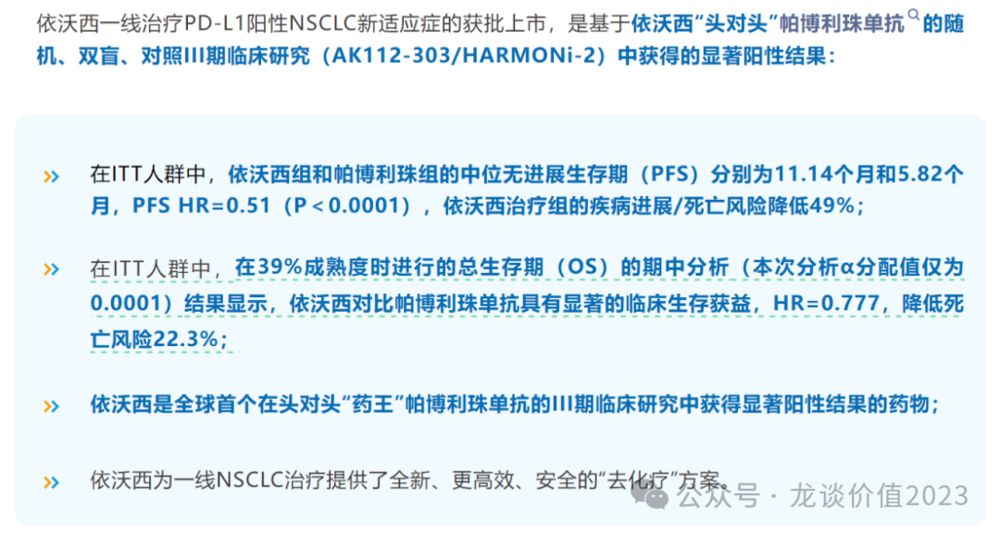
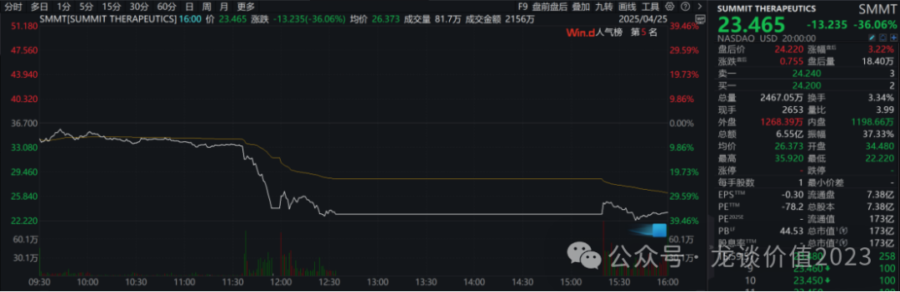
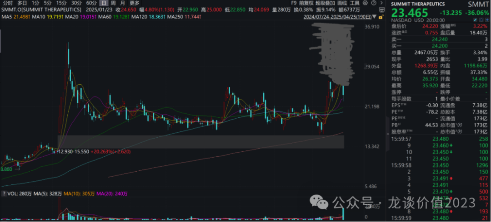
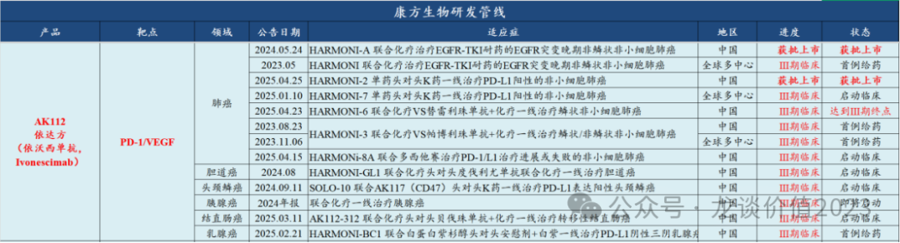

# 康方惊魂夜

大家好，我是龙哥。

周末康方生物发布了AK112一线治疗PD-L1阳性NSCLC新适应症在中国正式获批上市的消息，并同时公布了该III期临床OS数据在39%成熟度时的首次期中分析的情况，显示HR值为0.777，也既降低了22.3%的死亡风险，这也使得依沃西成为全球首个与K药头对头取得OS的HR值小于1的药物。在文章《[宇宙级大药](https://mp.weixin.qq.com/s?__biz=MzkyMzQ3MDc3Mw==&mid=2247484380&idx=1&sn=f59a39aac3c6cb168c326d789c8d8031&scene=21#wechat_redirect)》中我们已经具体分析了战胜K药的意义和市场潜力。

随之而来的问题，是在该数据下，Summit股价反而暴跌36%，由此引发了一系列热烈的讨论。

首先在讨论这个数据的因素以前，我想先就股价的因素聊聊我的看法，这次的数据从其重要程度、数据质量和现实意义来讲，并不足以对AK112的临床价值和市场价值带来如此之大的影响，但是股价的波动却显然大于此。

核心原因应该在于：①Summit在这次数据发布之前，已经有大量的资金提前埋伏进去；②康方和SMMT在24年5月的股价巨幅波动给人留下深刻印象、甚至是心理阴影。

要知道在4月9日到4月24日这短短的11个交易日里Summit的股价暴涨了121%，试想一下如果Summit的股价表现是我下图中画的这样，这次的数据还会引发这么大范围的争议吗？——讨论必然会有，争议和悲观情绪必然不会那么多。大部分投资人还是不可避免的会以解释股价的角度去分析问题。

......

对于这次发布的数据，刚才康方生物举办的公开电话会，相信很多朋友也听了，没有太多增量信息——大多是验证了大家周末的一些分析和猜想，这里我也综合来聊聊我的看法，包括对股价的看法。

首先，能取得相较K药的OS获益的确是历史性的突破，一定是一个巨大的成功，目前尚未有任何一款其他药物能在头对头K药中取得OS小于1的HR，即便是当年同样的该适应症，全球药王K药头对头化疗时也取得了OS的HR在0.8左右的结果，但并不妨碍K药封神。

这也是为什么即使Summit跌幅看起来极其巨大，但只是从270亿美元跌到170亿美元——甚至要高于过去半年震荡的平台价格——而不是跌到几十亿美元市值。

Summit跌幅巨大也有短期搏数据超预期的资金较多的因素，公司股价仅跌回到4月11日的价格，仍然是较高的位置，也就是说美股市场对于依沃西成为一款超越K药的优秀的IO疗法并没有因为此次的数据而产生大的争议。

1）值得担忧的点：OS获益，但获益不够明显，市场对康方AK112的OS获益存在更高的预期。

①在中期分析中，HR值=0.777，市场部分观点认为中期分析中0.75-0.80的HR值意味着最终的结果中OS获益显著或者不显著（HR＞0.8）是五五开，也既并非是必然能取得OS获益，如果本次HR值能在0.75以下，则最终取得OS获益的概率会很高。

但是说实话我也不知道之前市场预期的HR值到底是多少，甚至有投资人是抱着HR值达到0.6、0.7这样的不现实的想法来预期。

②市场部分观点认为要在相对容易做的单药治疗PD-L1阳性NSCLC中取得强阳性结果，才更有机会在依沃西+化疗头对头K药+化疗一线治疗NSCLC的III期临床中取得OS获益，因此该适应症如果OS获益不够显著，则联用化疗成功的概率就会降低，从而影响依沃西未来在肺癌领域的统治力。

③市场部分观点认为，进一步外推到更多适应症，依沃西想要替代K药更多适应症的市场，也需要一个标杆的适应症验证依沃西显著好于K药，从而意味着未来扩适应症成功的概率也很高，而该预期也可能受到影响。

2）分歧或可能导致错杀的点：本身样本量不足、α分配值仅0.0001。

在周末大家的讨论中就猜测，本次期中分析仅作为向CDE批准该适应症展示OS获益趋势的分析，并未期待在本次分析中就做出OS获益的HR值，事实上在刚才的电话会议中，公司也明确了这点。

公司在对该临床设计的时候与CDE沟通的就是PFS作为主要终点，因此只需要入组398例患者即可以达到主要终点的PFS显著获益，但是同样是该适应症如果想要达到OS获益，需要入组的患者量需要上一个数量级，如康方该临床入组398例TPS＞1的NSCLC患者群体，而同样适应症在接近10年以前的K药头对头化疗时的KEYNOTE-042入组了1274例患者，即便如此其OS的HR值还是在0.8左右。

而本次的期中分析，数据成熟度39%、α分配值0.0001，即便在如此严苛的α值之下仍取得了0.777的HR值、降低22.3%的死亡风险。因此也有包括Jefferies在内的不分国内外、买卖方投资人认为这次发布的是超预期的临床数据——对应Summit的下跌是被错杀。

......

以上是就我的理解和市场普遍的观点做的分析，那么当前位置龙哥我怎么看这个数据、影响，以及更重要的是如何看待相关公司的股价？这个是更现实的问题和各位读者可能更关心的。

首先必须要承认，我也没有能力根据当前的信息分析出未来依沃西与K药头对头的几个临床到底会呈现什么样的OS结果，并不是说成功或者不成功，而是当前的信息不足以做出分析，但是现在的信息可以得出的结论，是依沃西相较K药的确呈现出了已经可以明显看到的临床获益。

K药头对头化疗在PD-L1阳性NSCLC中取得的OS结果是16.4个月VS 12.1个月，HR值是0.79，延长了4.3个月的生存期。而随着这些年PD-1在临床使用的趋于成熟，二三线治疗出现很多ADC及其他创新疗法， OS必然也会对应有所延长。

我们假设K药单药治疗PD-L1 TPS＞1的NSCLC患者OS可能被延长到了18个月以上，那么HR值要做到0.75意味着什么？意味着延长6个月的生存期，从绝对值角度来说这个OS的延长甚至要比K药相较化疗延长的OS还要多出40%，这也是为什么我上文说有些投资人期待所谓的HR值0.6/0.7是不现实的，更何况这还要在一个患者量/数据量不够大的临床试验样本中做到。能做到0.75-0.8的HR值，已经意味着依沃西可以将其mPFS的获益（11.14个月VS 5.82个月）绝大部分转化为OS获益，这是一个很优秀的结果了。

对于股价来说，我们也做出了一下基本的判断。

康方生物本轮自4月9日到4月25日累计涨幅是47%，而Summit的累计涨幅是121%，康方生物的涨幅是Summit的39%，本身Summit就呈现明显的超涨，因此有些投资人担心康方会不会像Summit那样大跌30%是过于悲观的，虽然去年524出现的踩踏让人印象深刻，但这次的事件经历了整个周末的深度的讨论，大家也会对交易计划和股价波动的应对有充分的准备，因此再次出现去年那样的踩踏的概率本身就很低。

上文提到Summit跌回的价格是在4月11日前后的价格，假如对应康方生物回到4月11日的股价在什么位置、对应今天多少的跌幅，大家去打开K线一看便知，也就更好理解今天上午康方的股价表现。

实际上除了康方生物和Summit以外，还有更多标的受到影响，比如周五BioNTech也跌了15%、盘中最大跌幅23%，市值回到245亿美元，在手现金200亿美元，一款全球进度第二的PD-L1/VEGF双抗和多款IO+ADC联用组合。再比如Instil Bio，周五暴跌35%，已经跌到0.8亿美元市值，而在手现金还有1.1亿美元、净资产1.7亿美元，手握自宜明昂科引进的一款PD-L1/VEGF双抗，在去年9月康方生物在WCLC发布数据的时候Instil的股价涨了500%，在所有相关标的中弹性最大。

国内市场，三生制药的股价也受到影响，今天大跌了10%，后续也会找机会单独聊聊三生制药的业务基本盘和PD-1/VEGF双抗的情况。

......

不知不觉又到月底，再开一次赞赏~

4月发文10篇文章，和大家聊了医药行业大涨后的估值，聊了政治风险的考验，聊了南下资金的偏好，聊了医药行业离谱事件第三部，聊了恒瑞、映恩、诺诚、康方、爱博等行业内比较优秀的公司。

更新的历史文章合集也已经为大家准备好，大家在公众号主页就可以看到。

医药的投研确实有一定的专业壁垒，需要长期的、深度的积累，很荣幸大家喜欢龙哥的文章，望再陪大家一轮医药牛市~

风险提示：本文仅讨论行业/公司经营情况，投资需综合考虑公司经营、估值、管理层等多方面因素，建议读者审慎参考，本文不作为投资依据，不建议大家根据本文做出投资计划。

<!-- wxmp-comments-begin -->

---

## 留言（2 条，含回复共 4 条）

- **Bryan** 👍1 · 2025-04-28 14:17
  龙哥，今天和4.14文章看下来几点感悟，
  1.&nbsp;PD-L1/VEGF肯定是一个要好于K药的好药，是否神药继续跟踪；看好这个药，平常应该更关注康方，BioNtech（看完怎么有点反向再鼎的意思？比SMMT关系丰富啊），三生这种有基本盘，多管线或者现金流丰厚的公司；
  2.&nbsp;想要博取弹性，有充沛海外资金的情况再去参与或者分配部分仓位到SMMT,&nbsp;Instil&nbsp;Bio这种公司搏一搏；
  3.&nbsp;为什么宜明昂科会授权给Instil&nbsp;Bio？这公司市值，在手现金都这么低，哪有实力去做领创啊？是那种海外biotech小公司，倒卖坐等被收购的？我记得之前康诺亚授权出去的也是一些小的biotech,&nbsp;都怀疑是手套公司
  - ↳ **作者** · 2025-04-28 14:38
    Instil这种就是资本攒局，低成本搞点好药再转手卖给MNC，你看当年恒瑞那个TSLP.......康诺亚的是newco的方式。
- **只一点点** · 2025-04-28 13:32
  重仓和黄，瑟瑟发抖
  - ↳ **作者** · 2025-04-28 14:38
    跟和黄有啥关系呢[捂脸]

<!-- wxmp-comments-end -->
