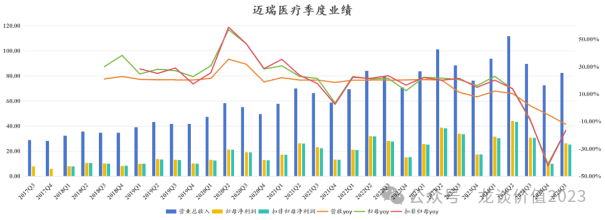
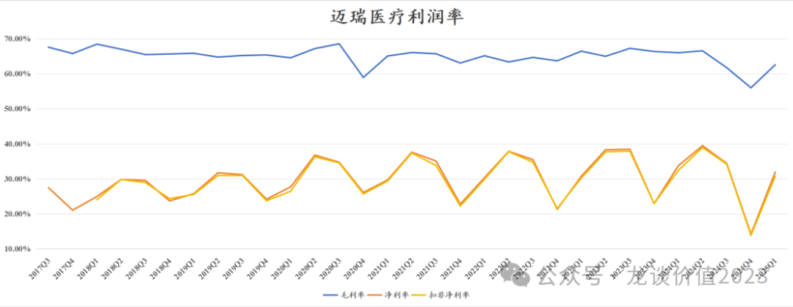
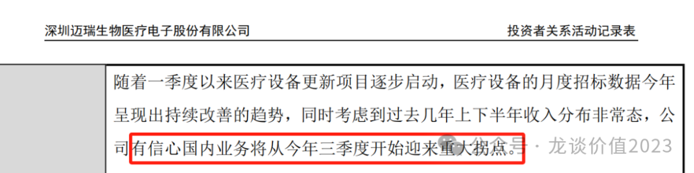
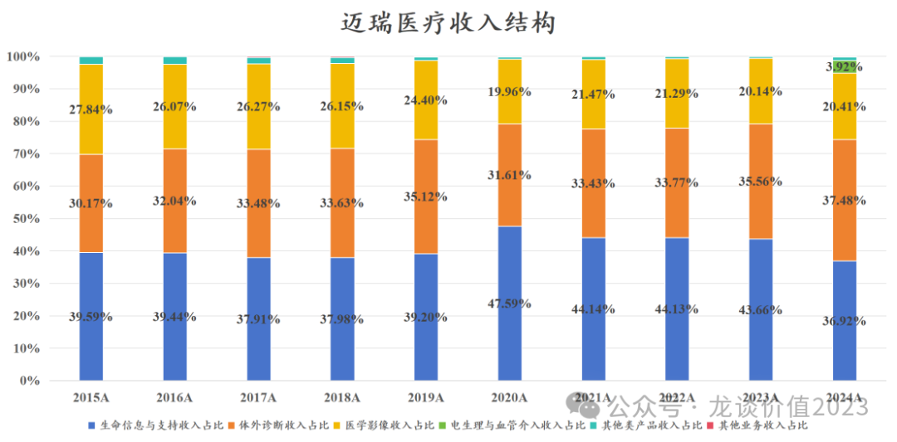
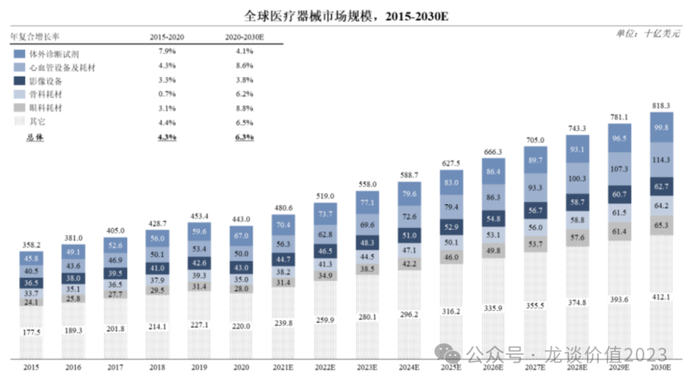
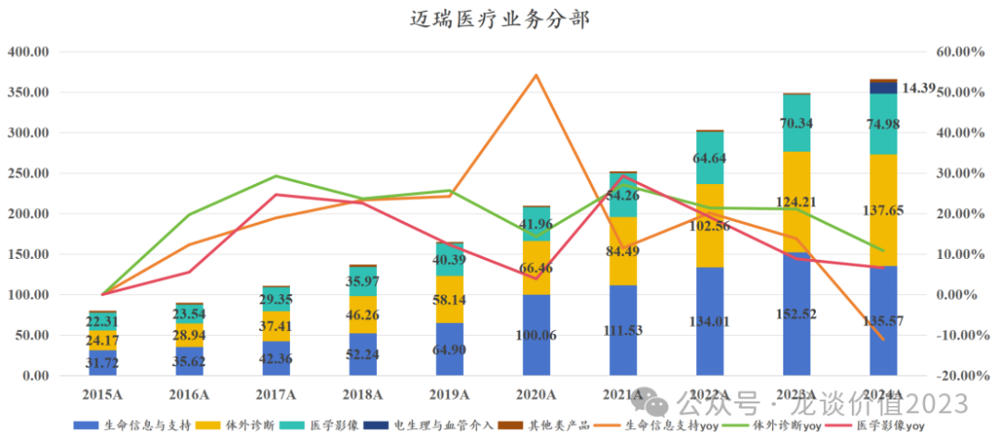
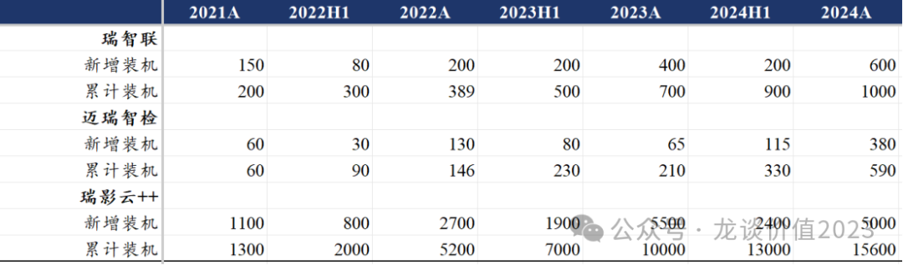
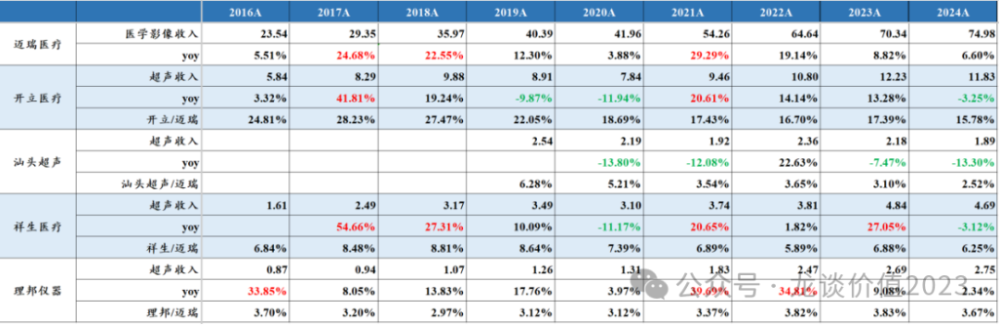
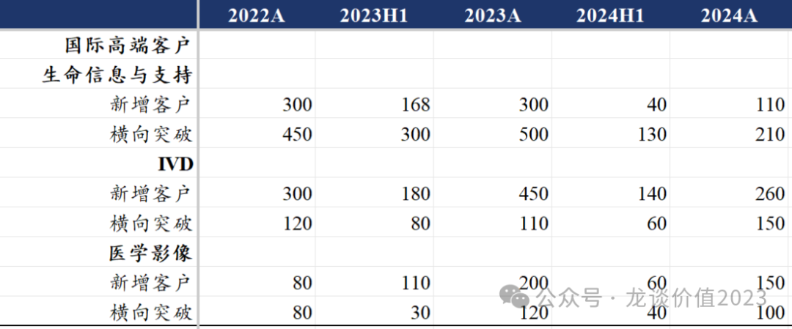
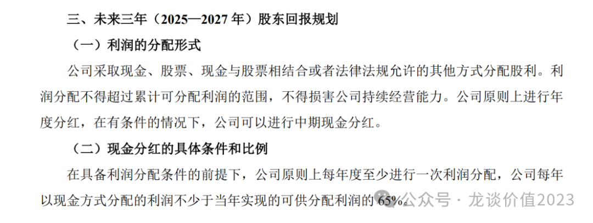

# 医疗器械霸主至暗时刻

大家好，我是龙哥。

今年以来几乎每篇文章留言都会有读者问到迈瑞的情况，我也多次回答过这个问题，就是至少要等到年报和一季报后再看，迈瑞医疗在上周发布了24年的年报和25年的一季报，我们也如期来聊聊迈瑞医疗的情况。

1、总体业绩趋势

众所周知迈瑞医疗会对季度间和年度的业绩做平滑，从2020年的四季度到2023年的2季度，迈瑞医疗连续11个季度的收入增速维持在20%左右，也就是上图中橙色曲线几乎完全横在20%附近的那段时间，直到2023年下半年医疗反腐对整个医疗设备采购带来较大冲击后，迈瑞医疗的收入端开始呈现压力，无法再稳定在20%左右的增长，收入增速开始逐渐往下掉，迈瑞医疗2021-2023H1的收入增速都调整在20%出头，而2023年全年收入增速掉到15%，2024年进一步掉到5%。

如果从上半年和下半年来做划分，按照我们看医疗设备的经验来说，行业长期的普遍规律是下半年会高于上半年、四季度会是全年设备采购和收入确认的高点，而迈瑞医疗近几年不论是基于业绩调控的因素还是基于政策面的影响，下半年收入始终低于上半年。

迈瑞医疗2024年下半年的收入是162亿元同比-1.6%、环比-21.1%，2023下半年的收入是165亿元同比+9.6%、环比-11%，23年下半年本身就是医疗反腐影响下的一个低基数，24H2则是进一步下滑，公司应该是在24年下半年以来进行了渠道库存的消化，这也是行业普遍进行的，其他可比的设备公司也都有类似的趋势。

利润端，迈瑞医疗同样会进行季度间的平滑，过去几年利润率始终维持在稳中有升，2019-2023年的净利率分别是28.3%、31.7%、31.7%、33.2%。迈瑞对利润端的调控能力还要强于收入端，直到2023年迈瑞医疗依然维持了20%出头的归母净利润增速。

但是利润的波动幅度往往会大于收入端，当收入端稳定向上的时候净利率提升使得利润增速还要高于收入端，而一旦收入端承压开始下滑，利润端的负反馈可能超过收入端的波动幅度。也因此，从上文第一张图可以看到，从24Q2开始利润端降速，24Q3到25Q1利润端呈现显著大于收入端的下滑，24Q4单季度的净利率更是下滑超过8个点。

从季度业绩趋势来看，24Q2是迈瑞医疗历史上季度业绩基数最高的一个季度，净利率更是达到历史最高的39.44%（对于全球的设备公司来说都是一个高的离谱的利润率水平），因此从同比的角度来看25Q2仍然会存在较大的下滑压力，公司本身对业绩拐点的预期也是2025年的三季度：

这是公司公开发布的投资者关系活动记录表里明确写到的，可以认为是公司较为有信心的公开业绩指引，由于包括医疗反腐、检查结果互认、DRG、集采等多方面复杂政策因素导致的不确定性，迈瑞医疗已经有一段时间不给明确的业绩指引，因此这次给的明确的业绩拐点指引，还是很具参考意义的。

2、业务分部情况

从24年初并购惠泰医疗后，迈瑞医疗的业务分部从生命信息支持、体外诊断和医学影像三大业务板块增加到四大业务板块——增加电生理与血管介入板块。

2024年该新增的电生理与血管介入业务板块贡献了14.39亿的合并报表收入，占总收入比重3.9%，由于惠泰股权的交割是在4月15日，因此实际上半年只并表了2个月的收入，下半年并表了6个月的收入，而血管介入板块在24年下半年的收入占比是6.6%，也既并购惠泰给迈瑞24年下半年带来了6.6%的收入增量，扣除该部分后迈瑞在24H2的收入下滑幅度更加显著。同样的道理，2025Q1惠泰医疗收入5.64亿元，占迈瑞25Q1收入的6.85%，剔除并购惠泰的部分，迈瑞医疗25Q1收入增速是-18.1%。

从近年业务结构的变化来看，迈瑞医疗传统三大业务中，IVD板块的收入占比从30.2%提升到37.5%，医学影像业务收入占比从27.8%下降至20.4%，生命信息支持板块收入占比从39.6%下降至36.9%，新增电生理与血管介入板块收入占比3.9%。

我们从全球医疗器械市场规模也能看出迈瑞医疗的业务布局，公司覆盖了全球医疗器械市场最大的四大领域——IVD、心血管耗材、影像设备、骨科耗材。

①体外诊断

市场规模最大的IVD板块，也是迈瑞医疗近年增速最快的业务板块，过去9年的复合增速高达21.3%，IVD收入从24亿提升至138亿元。2024年IVD板块收入137.65亿元+10.82%，其中国际市场同比增长30%，国内市场类似其他IVD公司，受多方面政策因素影响业绩压力较大。

迈瑞医疗从2013年开始进入化学发光领域，10年时间做到国产第一，2024年迈瑞的化学发光国内业务超越“罗雅贝西”中的贝克曼成为仅次于两大国际巨头罗氏和雅培之后的国内第三，“三瑞生态”中的瑞智检在24年也开始加速装机。

IVD板块预计未来会较长时间作为迈瑞医疗第一大业务板块，公司近两年连续收购海外核心IVD原材料和销售渠道，提升体外诊断试剂的产品力和拓宽国际销售渠道，助力未来在国内市场的国产替代和在全球市场的攻城略地。

迈瑞医疗过去擅长的是设备销售，而IVD板块随着设备铺设越来越多，试剂占比也会持续提升，而IVD试剂的毛利率和净利率都要显著高于IVD设备，从利润端来说IVD未来给迈瑞的贡献可能还要高于收入端。

②生命信息与支持

生命信息支持是迈瑞医疗国内和全球竞争力最强的业务板块，除了包含监护仪、麻醉机、输注泵等传统产品外，也包含硬镜、超声刀等外科产品线，在受益于新冠疫情期间的大量采购需求时，收入占比一度提升至47.6%，但随后持续回落，尤其是24年前面几项传统产品的国内市场规模出现了大规模的收缩，实际上我们对以上新冠受益产品的市场上收缩早就有预期，只是时间问题。

2024年生命信息支持业务收入135.57亿元同比下滑11.11%，毛利率62.55%同比下降4.23%，其中硬镜为主的微创外科板块24年收入增长了30%以上，硬镜目前仍是国产替代的重点方向，24年迈瑞医疗推出了UX7系列4K三维荧光内窥镜摄像系统、4K三维电子胸腹腔内窥镜系统，进一步增强该业务板块的产品力。

由于国内医院床位数的趋于饱和、传统产品组合的趋于饱和，海外市场和微创外科产品线未来虽然能带来一定增量，但仍然预计生命信息支持板块未来的收入占比可能还会进一步下降。

③医学影像

医学影像是全球市场规模最大的器械领域之一，但是由于迈瑞不做大型医学影像设备，仅靠超声和DR也会有明显的天花板，当然迈瑞当前深耕超声领域也在全球和国内市场持续提升份额。

2024年迈瑞医疗医学影像业务收入74.98亿元+6.60%，毛利率66.85%同比小幅下降0.25%较为稳定，超高端超声Resona A20首年上市给迈瑞贡献了4亿的收入，超声业务24年艰难的做到持平。

对比国内其他超声领域可比公司可见，二线的开立医疗、祥生医疗、汕头超声、理邦仪器等公司与迈瑞的收入体量差距还在持续扩大，例如开立在2017年超声收入占迈瑞医学影像收入的28.2%，目前只有15.8%，祥生从最高8.8%下降到目前6.25%，理邦仪器近年稳定在3.7%左右，汕头超声从6.3%下降到2.5%，超声行业龙头公司的研发实力与后排公司拉开差距，可以在中低端超声市场趋于饱和的情况下，去进攻GE、西门子等巨头占据的高端和超高端超声领域。

④心血管耗材

迈瑞医疗依靠对国内优秀的头部企业之一——惠泰医疗的并购而跨入该领域，该部分业务有望借助迈瑞医疗的全球化经验加快国际化布局，预计后续会是迈瑞医疗收入端的重要增量，但由于迈瑞目前对惠泰的持股比例只有24.6%，因此利润端的合并比例偏低，贡献会相对少一些，24年对惠泰医疗合并的归母净利润占迈瑞医疗的利润比例大概只有1%。

⑤骨科耗材

迈瑞医疗也是通过并购进入骨科耗材领域，努力布局了多年，但一直表现不佳，骨科耗材集采到目前来看似乎也并未能助力迈瑞在该领域实现大的突破，后续还需观察，国内其他骨科头部公司普遍已经开始连续从集采中走出来，业绩呈现翻转趋势，如大博医疗、威高骨科、爱康医疗等等。

2024年，迈瑞医疗中国区收入203亿元同比-5.1%，海外收入164亿元同比+21.28%，海外收入占比提升5.96%至44.75%。

正如迈瑞医疗过去的电话会议所言，过去几年国内的医疗能力建设和国产替代使得迈瑞医疗国内收入增速始终高于海外，国内收入占比从2015年的46%提升至2023年的61%，而24年以来海外市场重回加速增长，收入占比也有所提升，借助疫情期间产品口碑而突破的海外客户，以及近年研发驱动产品力持续提升，迈瑞近年在海外高端客户的突破上收获颇丰。

3、其他财务指标

迈瑞医疗2024年经营现金流124.3亿元同比增长12.38%，净现比1.07，2020-2024年的5年间，迈瑞医疗累计实现归母净利润475亿元，累计实现经营现金流535亿元，近5年累计的净现比是1.13。而2025Q1经营现金流14.94亿元同比-48%，渠道库存出清的影响在24年Q3以来持续显现。

增长不够、分红来凑，24年迈瑞医疗分红率65%，累计分红76亿元再创历史新高，当前市值对应的股息率为2.85%，且迈瑞承诺未来三年股利支付率都不低于65%。

......

迈瑞医疗曾经以优秀的成长性和ROE吸引一众投资者倾心，但终究也难逃产业周期的β的影响，医疗设备行业的宿命如此。但一轮周期过后，研发端和销售端都呈现出强者恒强，行业集中度仍在提升，我们也终将迎接王者归来。

......

近期重点文章（可直接点击下列链接查看）：

《[康方惊魂夜](https://mp.weixin.qq.com/s?__biz=MzkyMzQ3MDc3Mw==&mid=2247484445&idx=1&sn=6293f8664790f222d17303a8eec3e9fb&scene=21#wechat_redirect)》

《[眼科超级成长股跌倒](https://mp.weixin.qq.com/s?__biz=MzkyMzQ3MDc3Mw==&mid=2247484435&idx=1&sn=c0a693b7e68a1b66f50dafe59eeca8ea&scene=21#wechat_redirect)》

《[宇宙级大药](https://mp.weixin.qq.com/s?__biz=MzkyMzQ3MDc3Mw==&mid=2247484380&idx=1&sn=f59a39aac3c6cb168c326d789c8d8031&scene=21#wechat_redirect)》

《[横跨两个黄金赛道](https://mp.weixin.qq.com/s?__biz=MzkyMzQ3MDc3Mw==&mid=2247484409&idx=1&sn=cd9c01b6be30e09a0d4fb3c2d15d078b&scene=21#wechat_redirect)》

《[把握下一个ADC领域龙头biotech](https://mp.weixin.qq.com/s?__biz=MzkyMzQ3MDc3Mw==&mid=2247484358&idx=1&sn=7dddbb02ce72e890e4b4565060eb8470&scene=21#wechat_redirect)》

《[南下资金扫货](https://mp.weixin.qq.com/s?__biz=MzkyMzQ3MDc3Mw==&mid=2247484346&idx=1&sn=73ead3d2fc35257c15fd44d703f85e61&scene=21#wechat_redirect)》

《[恒瑞医药火力全开](https://mp.weixin.qq.com/s?__biz=MzkyMzQ3MDc3Mw==&mid=2247484343&idx=1&sn=8a9443fca3fd94f88388790956537836&scene=21#wechat_redirect)》

《[医药再迎政治风险考验](https://mp.weixin.qq.com/s?__biz=MzkyMzQ3MDc3Mw==&mid=2247484324&idx=1&sn=f5e3ee849121ed9f038afe25551cfbb4&scene=21#wechat_redirect)》

《[医药暴涨，估值贵了吗？](https://mp.weixin.qq.com/s?__biz=MzkyMzQ3MDc3Mw==&mid=2247484317&idx=1&sn=28b1cabe165edbe8fe713987e79e3ee9&scene=21#wechat_redirect)》

《[CXO全面复苏](https://mp.weixin.qq.com/s?__biz=MzkyMzQ3MDc3Mw==&mid=2247484308&idx=1&sn=3ecff125b0b85e5cd323cb99f646e2a3&scene=21#wechat_redirect)》

《[医药最高景气方向](https://mp.weixin.qq.com/s?__biz=MzkyMzQ3MDc3Mw==&mid=2247484299&idx=1&sn=c6677f52d0ea6ebfbc11420984b3636d&scene=21#wechat_redirect)》

《[又一家百亿创新药巨头出现](https://mp.weixin.qq.com/s?__biz=MzkyMzQ3MDc3Mw==&mid=2247484285&idx=1&sn=c741f32eb039e33d3c3915a65dfb984f&scene=21#wechat_redirect)》

《[创新药出海，分歧时刻](https://mp.weixin.qq.com/s?__biz=MzkyMzQ3MDc3Mw==&mid=2247484272&idx=1&sn=a5850a6c1302ac8942030e1e7c5db971&scene=21#wechat_redirect)》

《[美国药品大降价](https://mp.weixin.qq.com/s?__biz=MzkyMzQ3MDc3Mw==&mid=2247484234&idx=1&sn=28cf6165faae82f398c9afb5f39bd641&scene=21#wechat_redirect)》

《[中国创新药出海之王](https://mp.weixin.qq.com/s?__biz=MzkyMzQ3MDc3Mw==&mid=2247484173&idx=1&sn=52dcb6390d13960d7ec157efb9ec76f6&scene=21#wechat_redirect)》

《[创新药巨头狂飙](https://mp.weixin.qq.com/s?__biz=MzkyMzQ3MDc3Mw==&mid=2247484144&idx=1&sn=0b26f935e3f7a1a6248b091a6c0ec916&scene=21#wechat_redirect)》

《[最全ETF梳理](https://mp.weixin.qq.com/s?__biz=MzkyMzQ3MDc3Mw==&mid=2247484135&idx=1&sn=2a8555f0200922f90e82d51562574545&scene=21#wechat_redirect)》

《[生物科技的狂欢](https://mp.weixin.qq.com/s?__biz=MzkyMzQ3MDc3Mw==&mid=2247484124&idx=1&sn=233fb7eda9c948a508908c6a66a6a4d0&scene=21#wechat_redirect)》

《[两个资产配置的重点方向](https://mp.weixin.qq.com/s?__biz=MzkyMzQ3MDc3Mw==&mid=2247484114&idx=1&sn=9d862ed9cfbfe39f4608466e3943f3e8&scene=21#wechat_redirect)》

《[医药行业趋势展望](https://mp.weixin.qq.com/s?__biz=MzkyMzQ3MDc3Mw==&mid=2247484101&idx=1&sn=febb0b581f3311f2fb2477ef02efdb50&scene=21#wechat_redirect)》

《[非典型利空](https://mp.weixin.qq.com/s?__biz=MzkyMzQ3MDc3Mw==&mid=2247484042&idx=1&sn=7f0001decb5fca1b658ec50e1c995893&scene=21#wechat_redirect)》

《[中国医药历史性事件](https://mp.weixin.qq.com/s?__biz=MzkyMzQ3MDc3Mw==&mid=2247484024&idx=1&sn=4d42f6d88e255b20f426271c9be37b88&scene=21#wechat_redirect)》

《[最重要行业拐点](https://mp.weixin.qq.com/s?__biz=MzkyMzQ3MDc3Mw==&mid=2247483961&idx=1&sn=a6c753e24d874e551a8d2eebbfb515dd&scene=21#wechat_redirect)》

风险提示：本文仅讨论行业/公司经营情况，投资需综合考虑公司经营、估值、管理层等多方面因素，建议读者审慎参考，本文不作为投资依据，不建议大家根据本文做出投资计划。

<!-- wxmp-comments-begin -->

---

## 留言（11 条，含回复共 23 条）

- **Frank** 👍7 · 2025-05-06 15:59
  谢谢分享，希望Q3可以看到迈瑞雄起
  - ↳ **作者** · 2025-05-06 16:10
    一般来说股价会领先于基本面
- **和** 👍6 · 2025-05-06 15:54
  恒生医药ETF又快新高了[得意][得意][得意][得意][得意]
  - ↳ **作者** · 2025-05-06 15:58
    [加油][加油]今年港股医药大幅跑赢A股医药，港股创新药质地更好、估值更低，坚持对的事情终于迎来好的结果
- **ÉTINCELLE** 👍4 · 2025-05-06 16:17
  龙哥，想请教一下业绩在年度和季度调节，一般在什么财务科目上可以观察出来？
  - ↳ **作者** · 2025-05-06 16:20
    调收入一般不就是看收入端和应收账款、现金流的匹配度，调利润就很多了，毛利率、各种费用都可以调，像最近披露年报和一季报的一些公司看财务指标就很像是Q4利润挪到Q1，去年Q4的毛利率异常的低，费用率又异常的高，到Q1又反过来。
  - ↳ **作者** · 2025-05-06 16:21
    像迈瑞这种属于调节的比较明显的，每个季度给你20%，常识也知道不可能每个季度刚好20%[捂脸]
- **王熙** 👍4 · 2025-05-06 16:23
  等下半年，迈瑞医疗王者归来
- **大内总管** 👍4 · 2025-05-07 00:00
  龙哥&nbsp;请教下&nbsp;有没有偏cxo类型的基金&nbsp;&nbsp;~可否给些建议~
  - ↳ **作者** · 2025-05-07 09:03
    被动基金应该是没有，我得回去翻翻主动管理基金有没有
- **彭三好** 👍2 · 2025-05-06 15:57
  三季度业绩回升？
  - ↳ **作者** · 2025-05-06 15:59
    公司口径是这么讲，从季度业绩分拆来看业绩拐点也大概率在三季度。
  - ↳ **作者** · 2025-05-06 16:11
    那可能要看行业β会不会下跌，但毕竟A股医药指数今年本身也没涨，再出现行业性大跌的可能性应该也不大吧？
- **Vincent** 👍2 · 2025-05-06 17:47
  龙哥康方医药还看好吗
  - ↳ **作者** · 2025-05-06 18:01
    上周刚写的文章哈
- **夏笑涨** 👍1 · 2025-05-06 16:05
  亲爱的龙哥&nbsp;鱼跃医疗可以长期持有吗&nbsp;谢谢🙏！
  - ↳ **作者** · 2025-05-06 16:12
    在器械各细分领域来看，家用医疗器械应该算是逐渐从疫情的剧烈上下波动中走出来的细分板块，集采的风险又相对可控一些，还算可以。
- **执着如呆** 👍1 · 2025-05-06 16:06
  龙大，海外业务这块受影响不大是吗？
  - ↳ **作者** · 2025-05-06 16:13
    海外业务方面，公司其实也讲了，美国收入占比6%，对总体的业绩影响确实不大。进口关税对部分核心原料可能会有影响，公司也在积极寻求替代厂商，不过对今年的利润端还是会有影响。
- **尘缘** 👍1 · 2025-05-06 17:59
  龙哥，在医学影像方面，联影医疗是不是比迈瑞要强？
  - ↳ **作者** · 2025-05-06 18:03
    联影主要做大设备，大设备和小设备的区别蛮大的，迈瑞就不愿意做大设备，所以不太可比，只能说都是所在领域非常优秀的企业
- **赛特** · 2025-05-06 16:08
  美国关税政策对恒瑞，百济这种新药研发公司有什么影响呢？
  - ↳ **作者** · 2025-05-06 16:14
    对新药研发公司的影响目前来看还是要小于设备、低值耗材、原料药、CDMO这些领域的，虽然也不是完全没影响，但我认为仅从关税来说影响可以忽略。创新药生产成本占比很低，又可以委托海外CDMO生产，像百济直接在美国建厂了。

<!-- wxmp-comments-end -->
