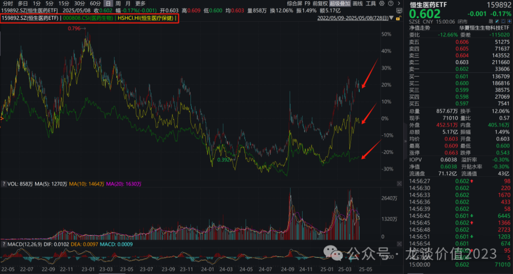
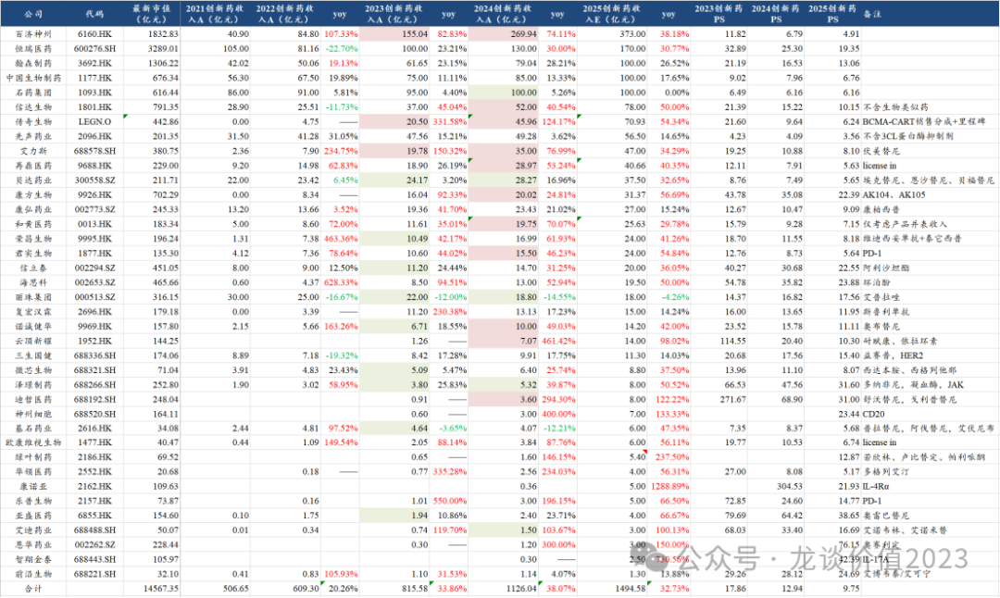
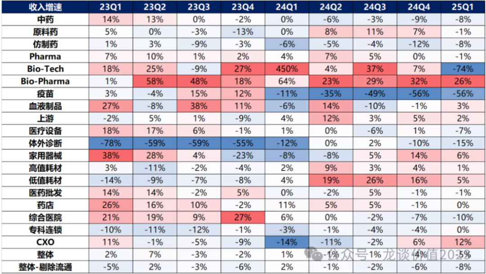
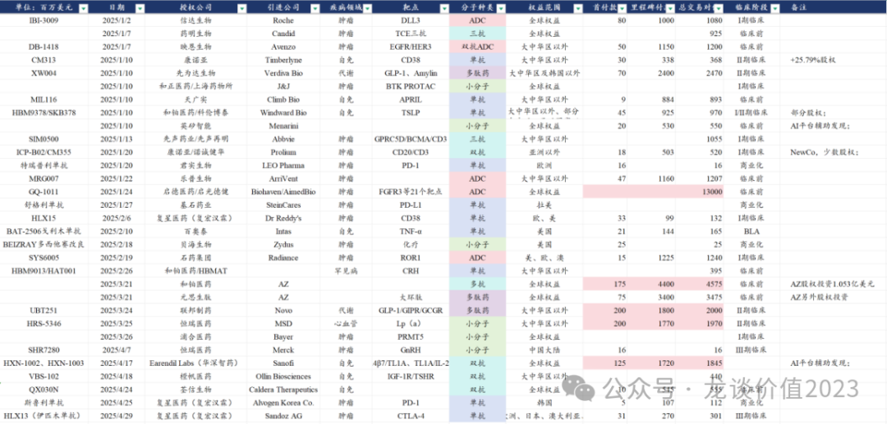
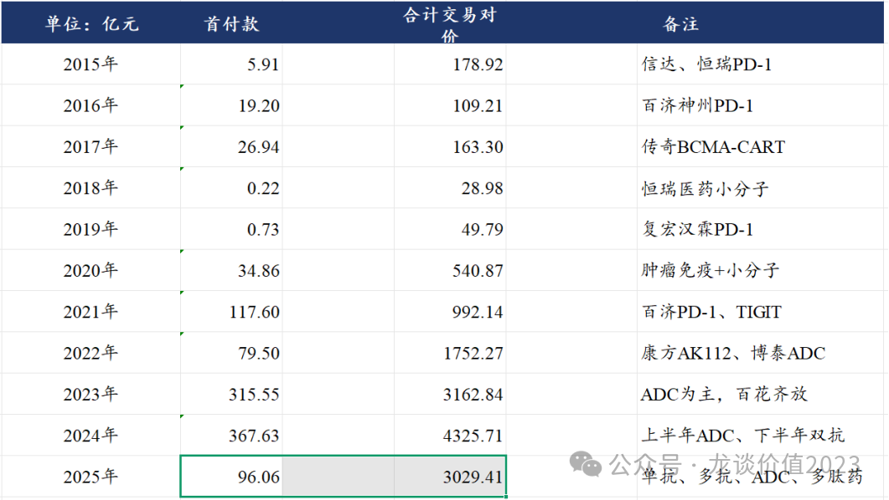
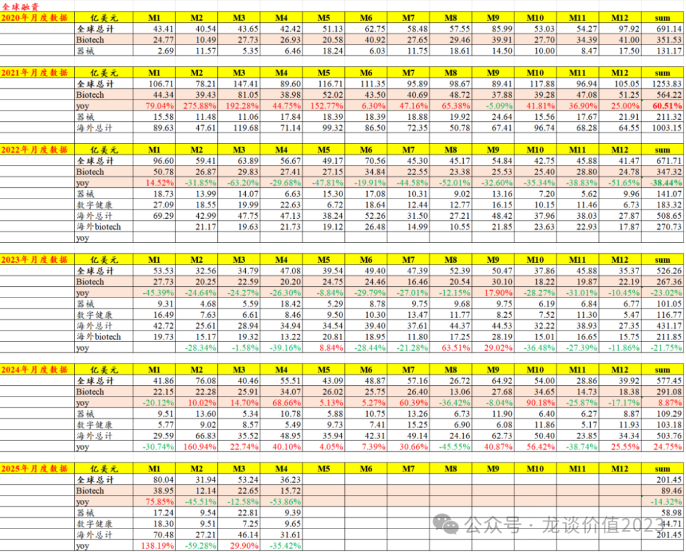
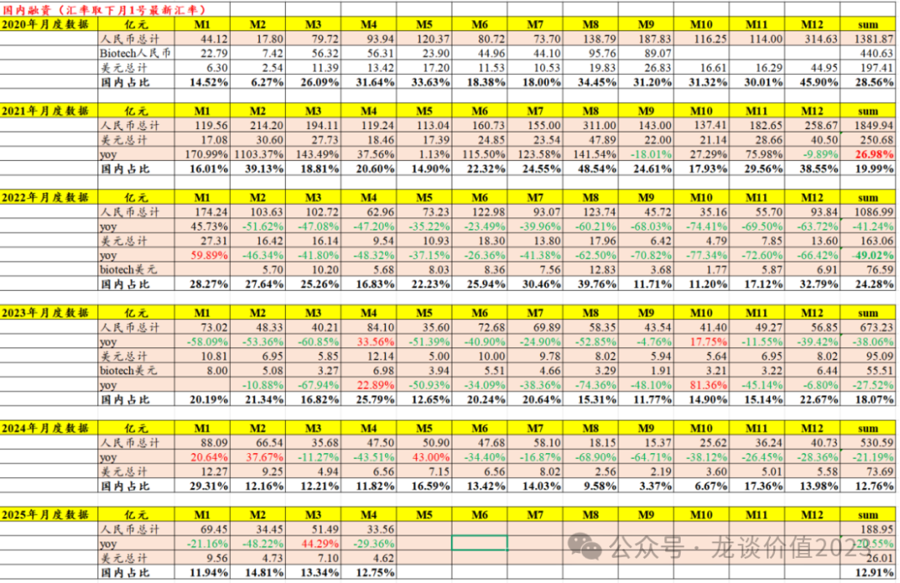

# 创新药太猛了

大家好，我是龙哥。

这两年给大家聊的最多的医药子领域就是创新药行业，聊的最多的标的就是159892恒生医药ETF，去年下半年以来，不论是从基本面还是从股价表现上都在持续兑现，从近三年来看ETF也基本是持续跑赢AH医药指数的。

背后核心的原因，是这两年我也逐渐认识到一个事情——哪怕我把个股讲的再细致，也无法改变大部分个人投资者拉长时间看很难在个股上赚钱的现状（不论牛熊），但是对于有长期成长空间的好的行业，如果能和大家一起去持续的投行业指数基金，则赚钱的概率就要高的多的多。

随着24年年报和25年一季报披露完毕，这里再给大家更新一下创新药行业最新的情况，包括主要创新药企业的产品销售情况，以及今年来创新药海外授权情况，包括全球生物医药融资数据的更新等等。

1、国产创新药销售大爆发

据统计主要上市创新药企业的创新药销售数据，预计38家有创新药收入的主要创新药上市公司2024年创新药收入合计约1126亿元同比增长38%，行业呈现非常高速的增长。（部分公司没有统计在里面，如复星医药、上海医药、华东医药等公司，主要是实在不知道如何拆分创新药的收入，因此实际国内创新药收入体量要比以上统计规模更大）

这个增长单独给大家看可能大家感受还不够震撼，但是如果把其他细分领域放在一起给大家看，这个感受会更明显：

从上图华福医药团队统计的各个医药细分领域单季度收入增速可以看到，大部分的子行业都是连续几个季度下滑，能作为持平的子行业已经不错，能连续几个季度增长的更是寥寥无几。

而biopharma行业在所有医药细分领域中的增长一枝独秀，维持30%左右的行业高增长，在24Q1高达64%的增速基础上仍在25Q1实现26%的收入增长，遥遥领先于医药其他子领域。

pharma总体增长承压，主要是整个医药工业总盘子并没有扩张，而创新药这边呈现高增长，此消彼长就意味着很多传统药品品种以及中成药需要让出部分市场出来，但pharma这边总体仍相对稳定，内部有较大分化，较多传统pharma逐渐业绩企稳向上。

biotech的季度收入波动受个别公司的BD授权交易首付款确认影响较大，总体也是高增长趋势。另外创新药产业链的CXO行业已经呈现3-4个季度的持续性修复，生命科学上游也开始有所修复，行业龙头的收入增速、毛利率都在修复。

国内2024年创新药收入体量最大的百济神州（270亿元）、恒瑞医药（130亿元）、翰森制药（79亿元）等，收入有一定体量的公司中增速最高的则是传奇生物+124%、艾力斯+77%、百济神州+74%、和黄医药+70%等。

以上38家公司在23年的创新药收入大概800多亿，同比增长34%左右，24年收入体量1100多亿，同比增长38%左右，而25年预计总体创新药收入在1500亿左右，同比增长32%-33%，在医药所有细分子领域中依然是一枝独秀的增速。

预计2025年国内将会出现百济、恒瑞、翰森、中生、石药等5家创新药收入突破百亿元的国产创新药公司（信达、传奇预计26年突破）。其中预计25年增速较高的公司是云顶新耀+112%、康方生物+57%、君实生物+55%、传奇生物+54%、信达生物+50%、海思科+50%、诺诚健华+42%、荣昌生物+41%、再鼎医药+40%。

以创新药收入计算PS估值最低的是先声药业3.56倍、百济神州4.91倍、华领医药5.17倍、再鼎医药5.63倍、君实生物5.64倍、贝达药业5.65倍（唯一A股）、基石药业5.68倍、传奇生物5.73倍，2025年行业平均为9.72倍PS，其他有代表性的头部公司（仅计算创新药收入对应的PS）中恒瑞医药为19.35倍、翰森为13.1倍、信达为10.1倍PS，信达生物最近这几年从PS角度基本就是处于行业平均水平附近，或者说信达作为一个国内销售为主的综合型的biopharma，其PS估值大致能代表国内创新药公司的估值中枢。

2、创新药出海BD继续火爆

2025年以来中国生物医药海外BD授权合计达成31项合作（包含3款Biosimilae，另有2款只授权拉美或韩国单一市场），也即全球主要市场（欧美日等）的创新药海外授权合计有26项，而去年同期，24年1-4月合计为17项，24年全年则分别为全口径的62项和欧美日主流市场创新药BD授权合计55项，今年1-4月就达成了接近24年全年一半的交易项目数量。

2025年以来中国生物医药海外BD授权合计交易对价为3000亿元，其中拿到首付款为96亿元，相较2024年同期分别为1148亿元和25亿元，分别同比增长164%和284%，即便剔除掉启德医药130亿美元的那笔交易，25年1-4月的总交易对价也有超过2000亿元，同比增速依然是超过80%的高增长，当然，24年几项大的BD授权主要发生在下半年，24年全年为4300亿元和368亿元，以此来看25年也是4个月的时间完成24年70%以上（或剔除启德那笔交易外约48%）的总交易对价。

因此仅从1-4月的数据对比来看，25年中国创新药海外BD授权的项目数、项目金额都维持非常高的同比增速。

原本很多观点认为，23年中国创新药海外BD都是靠吃前几年较高的资本投入的老本，根本不可持续，结果到24年又迎来了进一步的爆发，24年照样很多人持有这样的观点，然后我们看到25年1-4月迎来的是资本市场的进一步火热、中国创新药海外BD授权的进一步加速，惊不惊喜、意不意外？

3、全球生物医药融资企稳

从全球市场来看，医疗健康领域的一级市场融资，仍然呈现比较大的月度间的波动，25年前四个月全球生物科技领域一级市场融资合计89.5亿美元同比下降14.32%，整个海外医疗健康领域一级市场融资合计201亿美元同比增长11.4%。

中国市场1-4月医疗健康领域一级市场融资合计189亿元同比下降21%，即便已经经历了22-24年连续3年的大幅下滑仍处于下降通道，但是从月度融资额的绝对值来看应该已经是企稳——24年8-9月最差的时候单月只有15-18亿元的一级市场融资额。

目前来看在美国利率仍然高企、美国经济衰退风险突出、美国医改政策波动期等环境下，全球医疗健康领域投融资可能也不容易马上出现爆发式的增长，即便是上文提到基本面出现改观的CXO行业，也是呈现比较明显的结构性机会，如我们在文章《[CXO全面复苏](https://mp.weixin.qq.com/s?__biz=MzkyMzQ3MDc3Mw==&mid=2247484308&idx=1&sn=3ecff125b0b85e5cd323cb99f646e2a3&scene=21#wechat_redirect)》中所述。

如果我们参照龙头公司药明康德的一季度业绩，也可以发现，药明康德优秀的业绩表现和订单增长，几乎全部来自多肽药（GLP-1系列减重药）的贡献——药明康德Q1收入增量为16.73亿元，而TIDES部门收入增量为14.6亿元，而实验室相关的CRO服务如药物发现和测试业务都还在下滑。

因此，中国CXO行业的修复也好、景气度的变化也好，除了政治因素的影响以外，更多也还是要关注新技术周期的影响而非单单从行业β角度看行业反转。

......

创新药行业短期客观存在的两大问题，一个是筹码结构已经远不如一年前好——不少机构对创新药的观点、预期和持仓趋于一致，意味着短期的波动和分歧都可能会出现，另一个是美国关税、医改相关的变化还会持续显现，我们也要及时跟踪最新的政策面变化情况，如此前的文章《[美国药品大降价](https://mp.weixin.qq.com/s?__biz=MzkyMzQ3MDc3Mw==&mid=2247484234&idx=1&sn=28cf6165faae82f398c9afb5f39bd641&scene=21#wechat_redirect)》就专门为大家解读IRA法案后的研发趋势的变化等。

短期的这些波动可能带来一些分歧，也未必不是好事，目前的市场也在给大家更多研究和思考的时间——对产业趋势把握的重要程度要远胜过对短期几根K线波动的交易，从前期的鸡犬升天，也会逐渐看到个股的剧烈分化。当出现系统性大跌的时候，或许就是应该看看159892恒生医药ETF的时候。

风险提示：本文仅讨论行业/公司经营情况，投资需综合考虑公司经营、估值、管理层等多方面因素，建议读者审慎参考，本文不作为投资依据，不建议大家根据本文做出投资计划。

<!-- wxmp-comments-begin -->

---

## 留言（13 条，含回复共 26 条）

- **韩小平** 👍13 · 2025-05-09 10:16
  都说赚自己认知的钱，龙大在医药这个领域，就说这些数据已经碾压9层以上的博主了，赞！
  - ↳ **作者** · 2025-05-09 10:57
    不太喜欢和博主比，可以和职业医药投资人比，哈哈
- **风林火山** 👍7 · 2025-05-09 10:18
  担心美国关税和美国医药集采
  - ↳ **作者** · 2025-05-09 10:58
    关税我们一直觉得还好，对创新药这边影响不大，美国医药倒也不是集采，是复杂的医改，是要持续关注变化的。
- **BO** 👍7 · 2025-05-09 11:42
  龙哥&nbsp;迪哲医药怎么样&nbsp;现金流也是个问题
  - ↳ **作者** · 2025-05-09 11:46
    迪哲现在倒不是现金流的问题，他们定向增发已经通过了，核心还是现有品种如何支撑起来这个估值。
- **知行** 👍6 · 2025-05-09 10:14
  龙哥，川普搞他们的医药，对我们创新药有影响么
  - ↳ **作者** · 2025-05-09 10:56
    有啊，我之前专门写过一篇文章讲IRA法案，实际也不排除情况更差，政策面要持续跟踪的。
- **Slk** 👍6 · 2025-05-09 11:38
  在迈瑞里熬死了[捂脸]公司又说了3季度反转了要，这个估值只能等了
  - ↳ **作者** · 2025-05-09 11:41
    是的，收入端要三季度企稳，利润端还有关税的不确定性影响。
- **苏@163.com** 👍5 · 2025-05-09 10:57
  龙哥，我感觉创新药这个方向既然实现了行业盈利扭转，是不是意味着这个行业行情不会就持续一年，有没有可能是3年？
  - ↳ **作者** · 2025-05-09 11:09
    从年度来说我觉得可以乐观一些，但季度和月度的波动必然会存在而且会很大，创新药历来如此。
- **苏@163.com** 👍4 · 2025-05-09 10:11
  值得关注
  - ↳ **作者** · 2025-05-09 10:55
    [抱拳][抱拳]
- **小1** 👍4 · 2025-05-09 10:23
  今天开始分步加仓159892,不敢一把梭，慢慢加仓，越跌越加
  - ↳ **作者** · 2025-05-09 10:59
    实际上我的读者里，慢慢投etf的基本没有不赚钱的，还没回本的都是高位一把梭哈的。投行业基金又不是投股票，而且就算投股票我也不觉得应该一把梭。
- **尹** 👍3 · 2025-05-09 10:30
  您好，龙大。&nbsp;创新药这么好，为什么康龙化成这么差。股票反应上应该是最差的了，这货还有希望吗？&nbsp;感觉30都是近几年高点
  - ↳ **作者** · 2025-05-09 11:02
    你看，这不就是本文第三段写到的，创新药也是结构性的好，是跟随技术趋势和产业趋势的，虽然都受到美国政策影响，但是药明系依然走的最强，合联和康德，在ADC和GLP-1领域的统治力，使得他们的基本面就是行业最强的。
- **砼行** 👍3 · 2025-05-09 10:39
  想让龙哥解读HR季报
  - ↳ **作者** · 2025-05-09 11:06
    恒瑞季报没太多好说的啊，等下周诺诚发了一季报，我把创新药主要公司的一季报一篇文章一起说一下
- **Bryan** 👍3 · 2025-05-09 10:41
  龙哥，有几个问题讨教，
  1.&nbsp;荣昌怎么最近这么多吹，股价涨幅也很夸张啊，泰它西普最近最大的临床进展就是MG即将获批吧？但之前我们聊过数据偏少，其疗效并非对再鼎FcRn的BIC;&nbsp;&nbsp;另外，荣昌BD一直没看到，他的海外III期都是自己做的？
  2.&nbsp;怎么看对岸政治运动对其国内医药市场的影响？从罗伯特肯尼迪，到FDA的人事变动，为了改善赤字问题，大统领也要走医保控费的路，本周CBER新主任的任命扰动就不小啊;
  3.&nbsp;如果看康方在胰腺癌上面的布局前景？AK104之前夏瑜总说海外BD不会贱卖，是已经有好的潜在意向买家了？应该不会自己独立去做海外临床吧？
  4.&nbsp;TAVR三傻辛苦写一篇了，我看着是器械里面最景气的方向了...沛嘉机缘巧合我拿了两年，也等到了保本出的机会[捂脸]
  - ↳ **作者** · 2025-05-09 11:11
    美国医改的压力是客观存在的，对于他们做到什么程度就是边走边看吧。
    一线胰腺癌很难做，这个在出数据之前谈不上前景，能成药的话那当然是全球创新药领域又一巨大突破。
- **王熙** 👍3 · 2025-05-09 10:48
  请问龙大，从未来5-10年的时长来看，是不是百济神州的基本面是最好的？可以说是中国第一创新药公司？
  - ↳ **作者** · 2025-05-09 11:08
    3-5年纬度百济的利润释放、第二批分子的成药的确定性都在提升，5-10年纬度还得跟着看，我一直说创新药并不是好的商业模式，行业技术更迭变化日新月异。
- **PBalu 一颗尘埃** 👍2 · 2025-05-09 10:26
  康方持有几年了。预计
  何时年营业收入可以突破百亿呢？
  - ↳ **作者** · 2025-05-09 11:00
    康方的核心并不是收入突破百亿，而是海外的成药，海外的成药意味着天花板的突破，远不是国内做个100亿收入能比的，国内100亿收入顶多20-30亿利润，海外如果做到100亿美金，对康方来说可能是接近100亿的利润。

<!-- wxmp-comments-end -->
