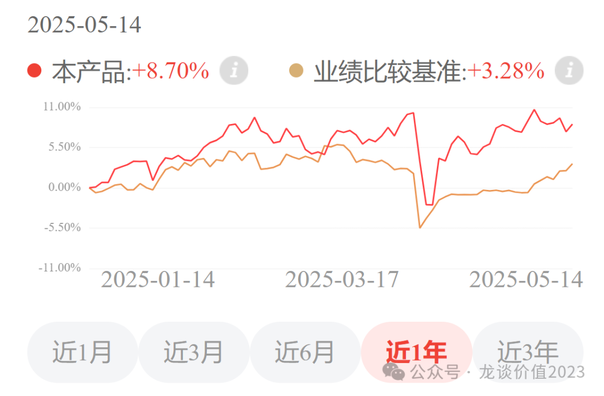
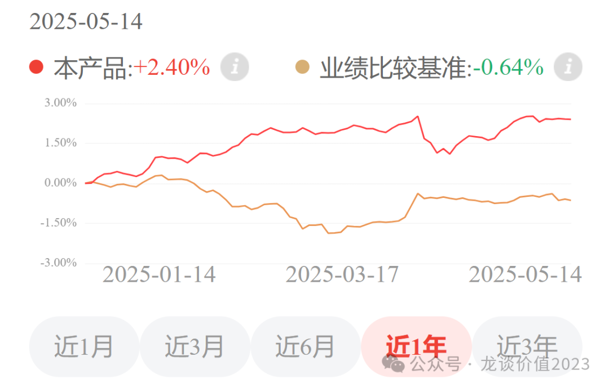
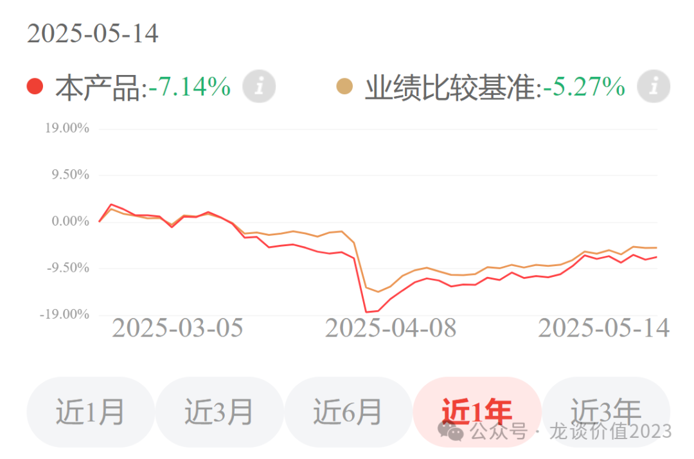

# 3个投资方向

大家好，我是龙哥。

好久没提我自己在定投的几个基金组合了，今天和大家更新下，由于今天头条文章的内容比较长，所以就放在单独的一篇文章来讲。

之前和大家讲过几次我定投的龙谈医药科技组合（AH医药+港股科技互联网）、龙谈美元债组合（美元债），另外我还在定投的一个组合是龙谈中国AI科技组合，今天把这三个组合都和大家聊一下。

和大家聊这几个组合，以及我自己也在定投这几个组合，核心的时代背景，是指数投资或者说被动投资时代的到来。

1、龙谈医药科技组合

龙谈医药科技组合选择的初衷，是我看好全球AI科技浪潮带来的中长期投资机会，同时也看好国产创新药为主导的中国医药行业的中长期蓬勃发展；同时我用量化模型做策略的时候发现一个现象，就是美股AI科技与AH医药具有非常低的相关性，可以很好的互补，当然后来由于考虑中美之间的zz因素，选择把美股AI科技调整为港股AI科技，以起到类似的效果，也可以减少过去投资美股AI科技时老是被限额的问题。

多数时候我对投资组合的稳定性要求要高于弹性，做资管行业的都知道，如果产品组合出现大幅度的回撤，那么不论涨回来或者不涨回来，都会导致持有人因为种种难以克服的人性弱点而要么低位割肉、要么回本就卖，而我们做投资肯定不是为了回本......

因此我选择了这样的一个组合来作为主要定投的方向，既可以覆盖最看好代表未来产业发展趋势的两个方向，又能兼顾降低组合因单一行业因素导致的回撤幅度。

从实际的净值表现来看，除了4月7日那次系统性杀跌难以避免以外，组合还是表现出了很强的回撤控制能力和超额收益，今年以来累计收益8.7%，超额收益5.4%左右，今年市场看似火热，实际上wind全A的涨幅只有2.32%，且银行板块今年涨了8.4%......

2、龙谈美元债组合

在去年考虑资产配置组合中的固收部分的投资时，我们选择了美元债投资，核心原因以两点，其一是美债有4.5%的票息打底，同时我们判断美债当前的高利率并不可持续，潜在的降息可能性将带来美债的上涨空间，例如8年久期的话每降息1%就对应上涨8%；其二是当时国内的国债收益率已经很低很低，我们预计利率进一步下降也即国债进一步上涨的空间不大了。

在这个基础上选择配置的美元债组合，近年来的表现也还不错：

今年以来龙谈美元债组合涨了2.4%，对标的国内的中债指数则是跌了0.64%，固收产品跑出了3%的超额收益，大家应该很容易理解这是什么样的表现。

3、龙谈中国AI科技

除了以上的龙谈医药科技以外，我自己还定投了一个中国AI科技组合，管理人是选择了A股和H股的AI、互联网、半导体、机器人、软件、消费电子、游戏、先进制造、智能电动车、大数据等领域的ETF构建了这个组合，覆盖AI科技浪潮下受益的各个产业方向。

中国是全球第二大经济体，并且和美国在经济实力、科技、军事等关键领域进行比拼，自从今年1月份Deepseek问世以来，大家越来越多的看到中国科技实力的厚积薄发，有别于之前电子、汽车领域，中国这次在人工智能革命中和美国的差距并没有那么大，中国的工程师红利不仅仅在医药领域凸显，在大模型开发、机器人制造能力方面都在发挥优势。未来五年是人工智能角逐的关键时代，人工智能相关的投资机会将此起彼伏，层出不穷，所以选择以人工智能为主要投资方向的A股组合，是在A股市场获得长期较高回报的最优选择。

（业绩比较基准为中证科技100指数）

由于管理人构建这个组合的时候在相对高位，回调幅度相对大一些，但最近一个月也有5%的反弹，跑赢业绩基准的4.5%。

之前一直没和大家聊这个组合，主要原因也是纯AI科技的组合波动幅度要明显更大，我基于自己的情况也去部分定投了这个组合，也是由于波动较大，我更倾向于以每周定投的方式参与中国AI产业的投资机会。

......

对于以上三个产品组合，感兴趣的读者可以直接扫描以下二维码在京东金融的APP或者小程序里了解。

<!-- wxmp-comments-begin -->

---

## 留言（1 条，含回复共 2 条）

- **墨** · 2025-05-15 12:41
  能在支付宝买不？
  - ↳ **作者** · 2025-05-15 12:43
    目前只能在京东金融哦

<!-- wxmp-comments-end -->
