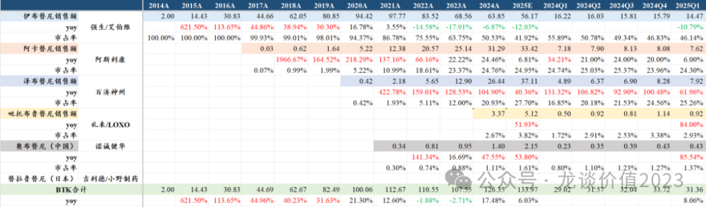
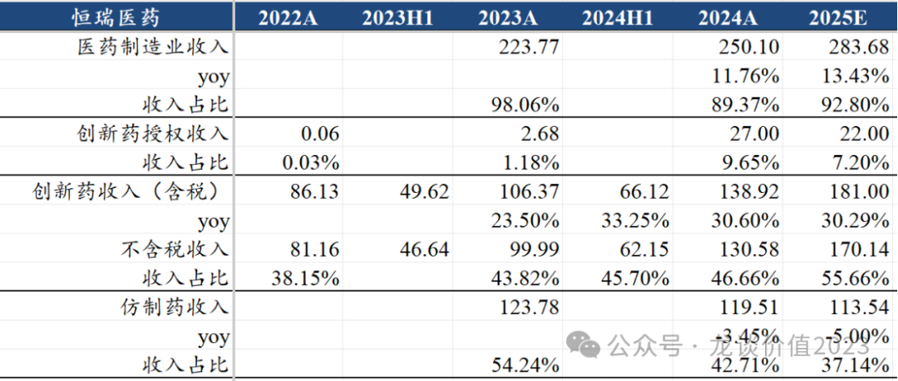
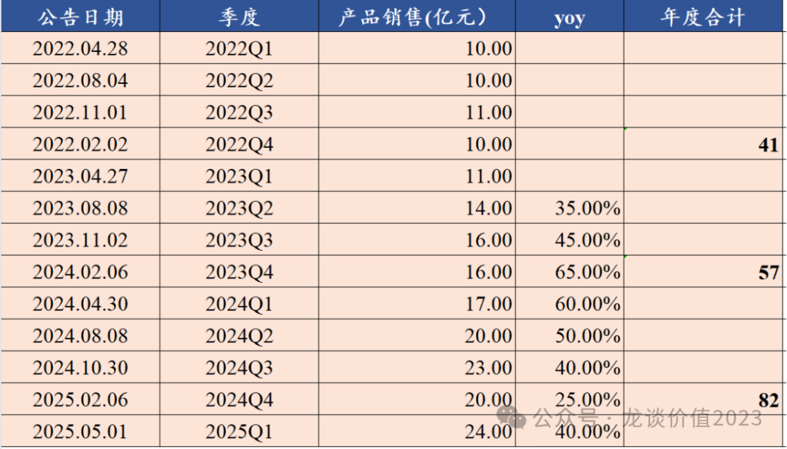
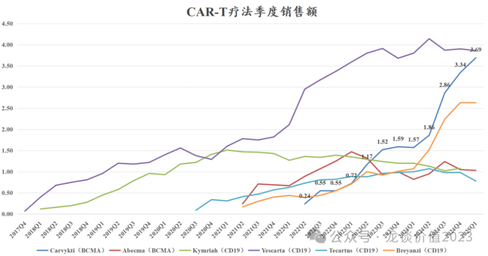
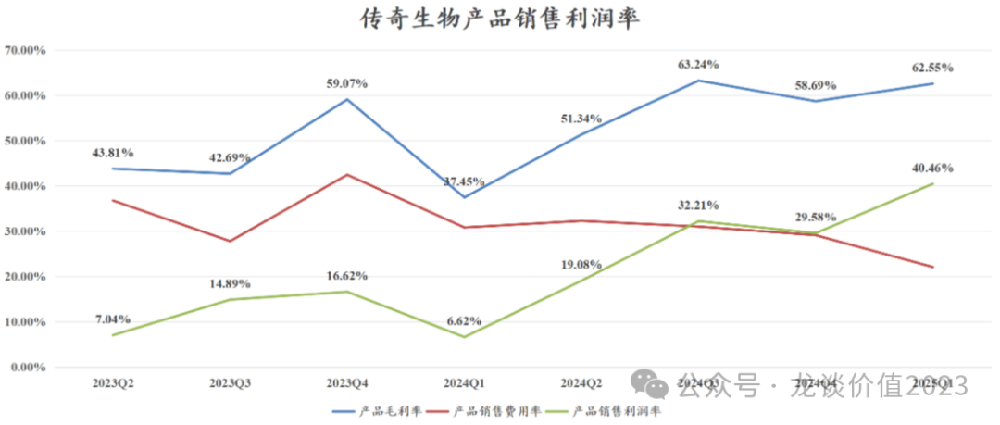
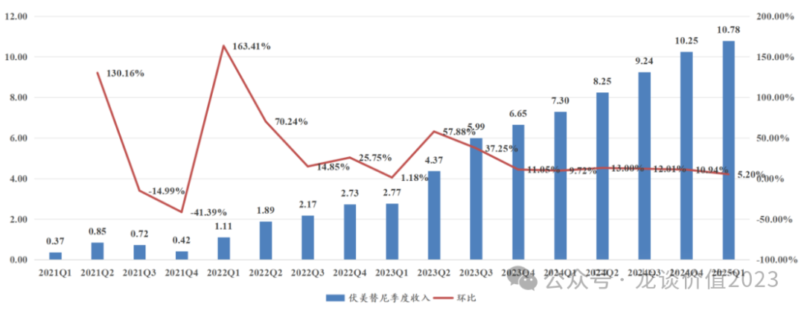
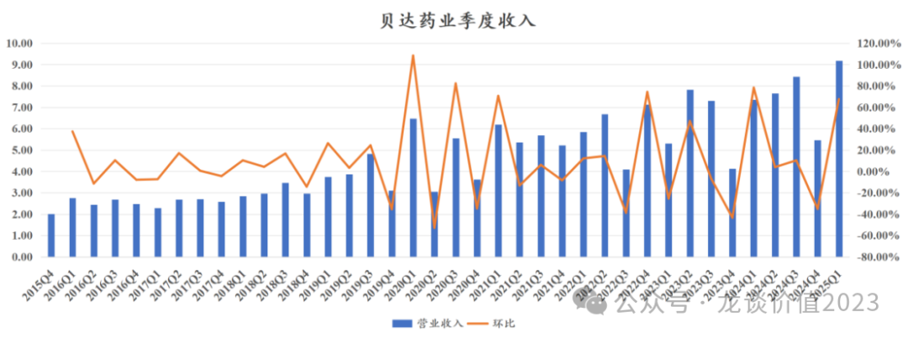
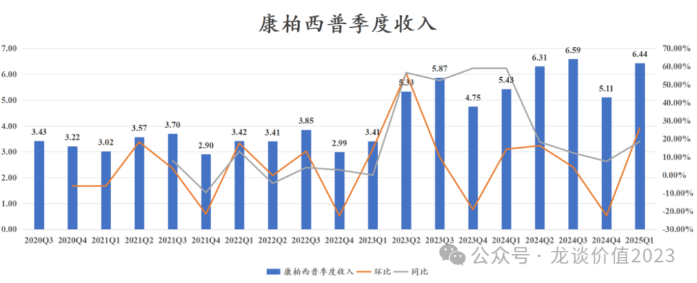
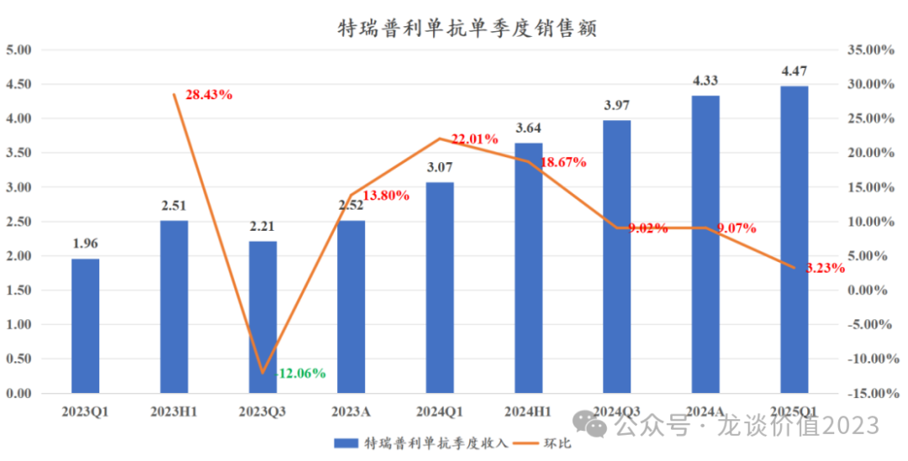
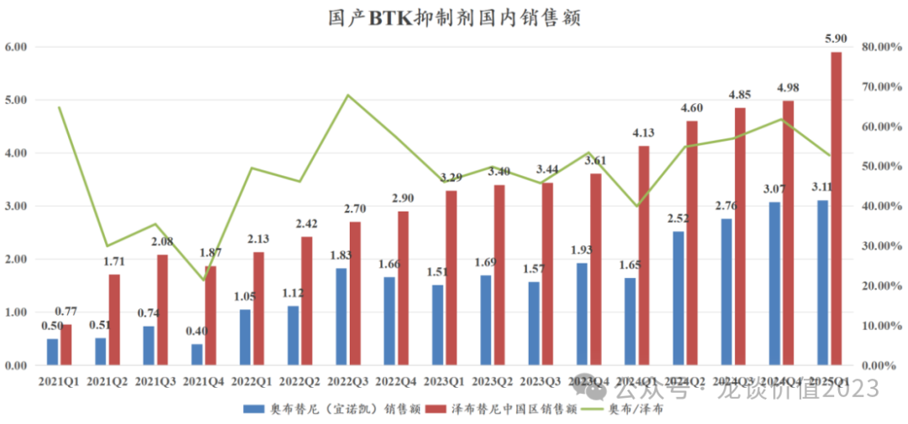

# 创新药十大金刚一季报

大家好，我是龙哥。

随着前天晚上诺诚健华发布一季报，这波年报和一季报的财报季终于结束，在上一篇文章《[创新药太猛了](https://mp.weixin.qq.com/s?__biz=MzkyMzQ3MDc3Mw==&mid=2247484474&idx=1&sn=2e83130102738a0aeed6568245534666&scene=21#wechat_redirect)》中和大家聊了行业大概的24年度和25一季度的增速情况，那本文就具体的主要创新药公司聊聊披露的一季报的情况，也可以从中一览创新药行业的增长动能。由于港股公司大多不单独披露一季报，因此这里分析的公司主要是A股公司以及AH股或者港美股同步上市的公司，包括11家创新药收入体量靠前的pharma和biotech。

1、百济神州

百济神州25年一季度收入11.17亿美元同比增长49%，产品收入11.09亿美元同比增长48%，其中泽布替尼全球销售额7.92亿美元同比增长62%，比预期的8.0亿美元低1%，基本符合预期，泽布替尼美国销售5.63亿美元同比增长60%，欧洲销售1.16亿美元同比增长73%，其他市场销售1.13亿美元（中国、日本及其他），泽布替尼全球份额提升至25%以上，25Q1全球BTK抑制剂市场增长2.35亿美元，而泽布替尼增长超过3亿美元；替雷利珠单抗一季度销售1.71亿美元同比增长18%。

25Q1产品销售毛利率85.5%同比提升1.8%，研发费用4.82亿美元同比增长5%，销售及管理费用4.59亿美元同比增长7%，费用率同环比均继续实现大幅下降。

25Q1 GAAP净利润127万美元，为百济神州首次实现季度盈利，经调整净利润1.36亿美元，经调整净利率12.2%，去年同期经调整净利率为-19.5%；25Q1经营现金净流量4400万美元同比增加3.53亿美元。

公司维持全年指引不变，收入端预计49-53亿美元，毛利率预计80%-90%的中位区间，全年GAAP经营利润为正，经营活动现金流为正，目前来看以上指引完成的难度都不大。

研发端超预期的是Bcl2抑制剂索托克拉用于R/R MCL的注册II期临床预计下半年读出数据并递交全球NDA，近期已经在国内陆续递交R/R CLL和R/R MCL的NDA，也是早于预期的。

2、恒瑞医药

2025Q1收入72.06亿元同比增长20.14%，归母净利润18.74亿元同比增长36.90%，扣非归母18.63亿元同比增长29.35%，经营现金净流量5.55亿元同比下降55.8%。

其中，恒瑞医药在Q1预计确认了授权DLL3-ADC给IDEAYA的7500万美元首付款，对应约5.5亿元收入、4.7亿元净利润，扣除产品授权部分后的收入约66.6亿同比增长11%，归母净利润约14.04亿元+2.6%，扣除BD后的产品端的表现依然不算亮眼，仿制药部分仍有拖累。

恒瑞医药25Q2预计会确认授权MSD一款Lp（a）药物的2亿美元首付款，以及授权德国默克一款产品国内商业化权益的1500万欧元首付款，但24年同期确认了2亿欧元的授权德国默克的首付款和技术转移付款，因此Q2的增长主要还是得靠产品端销售增长，预计25Q2的表观增速不会太高。

3、信达生物

Q1单季度产品收入超过24亿元，同比增长40%以上，主要增长驱动力来自①信迪利单抗仍在快速增长；②新产品放量，24年底以来新上市4款新药（BTK、ROS1、三代EGFR、IGF-1R），PSCK9单抗新纳入医保目录等。

24Q1-Q4收入增速分别60%、50%、40%、25%，25Q1收入增速回到40%。

2025年预计信达生物收入端仍将维持高速增长，24-25年合计新增7-8款重磅商业化产品，市场潜力也将显著大于21-23年上市的几款新药，24-25年上市的品种也将陆续改变信达生物以PD-1+biosimialr为主的产品收入结构。

4、传奇生物

2025年一季度Carvykti收入3.69亿美元同比增长135%、环比增长10.5%，其中美国区收入3.18亿美元同比增长127%，欧洲及其他市场收入0.51亿美元同比增长219%、销售占比13.8%；传奇生物Q1对Carvykti合并报表1.856亿美元，里程碑收入930万美元，合并收入1.95亿美元同比增长107%。传奇生物的Carvykti为25Q1全球唯一销售还在增长的CAR-T疗法。

Q1毛利率63.42%同比提升21.66%，产品毛利率62.55%同比提升25.10%，原本预计新产能投产导致短期毛利率稍有压力，实际表现较好；产品销售费用率22.09%同比下降8.74%、环比下降7.02%，单季度研发费用1.02亿美元继续维持稳定在1亿美元左右，研发费用率52.28%同比下降55.17%、环比下降3.70%，管理费用也继续稳定在0.3亿美元左右，管理费用率16.16%同比下降17.78%、环比下降2.18%。公司Q1净利润-1.01亿美元，经调整净利润-0.27亿美元，经调整净利率-13.85%同比提升76.89%、环比提升17.84%，以当前趋势来看Q3-Q4前后有望看到传奇生物经调整利润的转正。产品毛利率扣除销售费用率的产品销售利润率40.46%创新高。

5、艾力斯

Q1单季度收入10.98亿元同比增长47.86%，归母净利润4.11亿元同比增长34.13%，扣非归母3.96亿元同比增长31.45%，毛利率96.74%维持在较高水平，净利率37.37%同比略有下降，主要是财务费用部分有所减少、以及所得税大幅增加。

伏美替尼的季度销售仍维持强劲增长，预计环比增长5%左右，同比增长47%左右，不过今年预计会看到伏美替尼的同比增速逐季度放缓，在去年35亿元的销售额的基础上今年突破45亿元目前看没太大难度。

伏美替尼大单品的放量也使得艾力斯成为国内创新药公司中产品销售净利率最高的创新药公司，没有之一，24年净利率超过40%，不过预计公司后续也会逐渐加大研发投入力度。

6、贝达药业

Q1收入9.18亿元同比增长24.71%，单季度收入创历史新高，除了埃克替尼外，贝达药业多个产品都在放量阶段，包括三代EGFR贝福替尼、二代ALK抑制剂恩沙替尼、贝伐珠单抗、伏罗尼布等。

单季度的扣非净利润1.64亿元同比增长83.59%，扣非净利润的绝对值也是创历史新高，不过贝达的表观利润没有太大参考价值，因为贝达对不少研发投入进行了资本化。

贝达药业今年还将新增两个商业化品种，一个是CDK4/6抑制剂泰瑞西利，另一个是代理武汉禾元生物的重组人血白蛋白。

7、再鼎医药

25Q1收入1.07亿美元同比增长22.2%，其中产品收入1.06亿美元同比增长21%，尼拉帕利收入0.495亿美元同比增长8.8%；艾加莫德收入0.181亿美元同比增长37.12%、环比下滑40%大幅低于预期，公司表示是受到季节因素影响、3-4月患者数显著回升、预计后续季度环比增速加快，但还需Q2观察同环比增速；奥马环素收入0.151亿美元同比增长52.53%、环比增长37.3%符合预期。

虽然Q1销售受多方面因素影响低于预期（春节等季节因素，Q4渠道备货皮下注射剂型等），但公司维持全年5.6亿-5.9亿美元的全年收入指引，且指引25Q4实现经营性盈利，公司也维持2028年20亿美元收入指引。

近期催化剂：5月中旬ASCO更新DLL3-ADC数据，更新70-80人的ORR和安全性数据，5月底还会更新数据（可能PFS），数据读出后是一个可能BD的时间点，但如果对产品全球竞争力的信心充足，公司也未必有意愿较早进行BD授权；5-6月（时间尚不确定）FGFR2b单抗首个III期数据读出，潜在胃癌颠覆性疗法，读出数据后预计年内申报NDA；KarXT和TF-ADC在注册审批中。

8、康弘药业

康弘药业一季度收入11.99亿元同比增长9.70%，其中康柏西普收入6.44亿元同比增长18.6%、环比增长26%，康柏西普的收入占比在24年超过康弘药业总体收入的50%，到25Q1的收入占比约为54%，且单产品毛利率接近95%，是康弘药业的盈利利器。

随着国内阿柏西普和雷珠单抗陆续有生物类似药申报和获批，以及罗氏的重磅双抗产品法瑞希在国内的销售放量，康柏西普后续的增长还是会存在些许压力，康弘药业还需加快推进早期阶段的基因疗法等下一代创新疗法以承接康柏西普可能出现的增长瓶颈。

9、荣昌生物

25Q1收入5.26亿元同比增长59.17%、环比增长3.5%，毛利率83.26%同比提升5.76%、环比提升1.45%，24年以来荣昌生物的产品销售放量、尤其是泰它西普的放量渐入佳境，销售表现比22-23年要顺畅的多。

利润端一季度亏损2.54亿元同比减亏接近1亿元，在资金压力大到无以复加的情况下公司终于是连续进行降本控费，缩减了非核心的研发管线并进行了不小规模的裁员。

10、君实生物

君实生物25Q1收入5.01亿元同比增长31.46%，虽然这几年君实生物陆续有昂戈瑞西单抗（PCSK9）、阿达木单抗和氘瑞米德韦（3CL）等产品上市，但PD-1单抗特瑞普利仍然是君实的主力收入来源，25Q1的收入占比仍高达89.3%，特瑞普利单抗25Q1销售4.47亿元同比增长45.7%、环比增长3.2%，肺癌辅助新辅助、一线SCLC、一线TNBC一线肾癌、一线肝癌等5个前线大适应症均在24年以来获批上市，使得特瑞普利单抗在24年以来的几个季度销售也呈现持续改善。

不过君实生物目前的问题还是显而易见，PD-1单抗累计投入了60亿的研发投入，截至目前累计收入还没能突破60亿元，PD-1单抗的研发投入还不知道何时能回本，承接PD-1单抗的下一代产品还不知道是什么，虽然君实生物也启动了PD-1/VEGF双抗的II/III期临床，但其身位来看是不如PD-1时代君实生物的国产第一的领先位置。

11、诺诚健华

2025年一季度收入3.813亿元同比+129.92%，产品收入3.117亿元+89.11%，其中奥布替尼收入3.11亿元+89.2%、环比增长1.2%，过去两年的一季度都是诺诚建华产品销售低基数的季度，环比都会有10%上下的环比下滑，但是25Q1由于MZL适应症的增长，公司还是实现了环比的增长。

产品收入之外的产品授权收入6960万元，主要是今年1月公司与康诺亚各持有50%权益的CD20\*CD3双抗海外授权获得1750万美元首付款。

一季度归母净利润0.18亿元、扣非净利润0.016亿元，经营现金净流量0.565亿元，产品授权收入使得公司季度扭亏。Q1单季度毛利率90.54%同比提升5.19%预计主要也是产品授权拉动。

Q1单季度销售费用1.14亿元同比+27.34%、销售费用率29.90%同比下降24.09%，管理费用0.43亿元同比+0.84%、管理费用率11.22%同比下降14.36%，研发费用2.08亿元同比+16.81%、研发费用率54.45%同比下降52.73%，毛利率扣除三项费用率后的经营性利润率为-5%，另有公司较大规模在手现金贡献的利息收入和投资收益使得公司Q1实现盈利，截止25Q1末公司在手现金77.6亿元、有息负债11.2亿元，在手净现金约66.5亿元。

后续管线，CD19单抗预计25年中获批上市，BTKi奥布替尼治疗ITP预计26H1申报NDA，Bcl-2抑制剂预计27年初申报NDA，ICP-332（TYK2/JAK1）预计2026年底到2027年初申报NDA。

......

近期重点文章：

《[创新药太猛了](https://mp.weixin.qq.com/s?__biz=MzkyMzQ3MDc3Mw==&mid=2247484474&idx=1&sn=2e83130102738a0aeed6568245534666&scene=21#wechat_redirect)》

《[创新药利空虚惊一场](https://mp.weixin.qq.com/s?__biz=MzkyMzQ3MDc3Mw==&mid=2247484479&idx=1&sn=220426116884355ebe728bcbc1c1b3a2&scene=21#wechat_redirect)》

《[康方惊魂夜](https://mp.weixin.qq.com/s?__biz=MzkyMzQ3MDc3Mw==&mid=2247484445&idx=1&sn=6293f8664790f222d17303a8eec3e9fb&scene=21#wechat_redirect)》

《[医药暴涨，估值贵了吗？](https://mp.weixin.qq.com/s?__biz=MzkyMzQ3MDc3Mw==&mid=2247484317&idx=1&sn=28b1cabe165edbe8fe713987e79e3ee9&scene=21#wechat_redirect)》

《[美国药品大降价](https://mp.weixin.qq.com/s?__biz=MzkyMzQ3MDc3Mw==&mid=2247484234&idx=1&sn=28cf6165faae82f398c9afb5f39bd641&scene=21#wechat_redirect)》

《[眼科超级成长股跌倒](https://mp.weixin.qq.com/s?__biz=MzkyMzQ3MDc3Mw==&mid=2247484435&idx=1&sn=c0a693b7e68a1b66f50dafe59eeca8ea&scene=21#wechat_redirect)》

风险提示：本文仅讨论行业/公司经营情况，投资需综合考虑公司经营、估值、管理层等多方面因素，建议读者审慎参考，本文不作为投资依据，不建议大家根据本文做出投资计划。

<!-- wxmp-comments-begin -->

---

## 留言（8 条，含回复共 17 条）

- **叶凌** 👍4 · 2025-05-15 11:57
  君实的BTLA单抗不谈了？
  - ↳ **作者** · 2025-05-15 12:02
    这个要等待三期临床的结果，我个人能力所限看不清楚这个品种的成功率和市场潜力，不是说一定不行哈
- **和** 👍2 · 2025-05-15 11:38
  恒瑞医药这个月真是一路高歌猛进啊[呲牙]
  - ↳ **作者** · 2025-05-15 11:39
    恒瑞毕竟马上下周港股就要发了，港股折价20%多
  - ↳ **作者** · 2025-05-15 11:46
    这个并不绝对，问题是AH溢价平均就是30%多的水平呀，比如百济现在AH溢价是80%
- **王熙** 👍2 · 2025-05-15 11:48
  我发现一个情况，不知道对不对，请龙大指点：一家公司的毛利率在增长，比如&nbsp;81%提高到83%，是不是往往意味着公司的业绩与基本面在增强？&nbsp;因为我看到文章里的创新药公司，毛利率都是在提升的
  - ↳ **作者** · 2025-05-15 11:50
    创新药本身生产成本都是很低的，主要的成本就是固定资产摊销比较多，因此随着产品的放量，一般成本会有显著的摊薄，体现为放量阶段毛利率也会提升。
- **Bryan** 👍2 · 2025-05-15 11:59
  2.&nbsp;再鼎，艾加莫德销量我相信是季节性原因，毕泰它西普还在三期，疗效也有争议...DLL3-ADC之前德数据潜力很大啊，已经5月中了，拜托帮忙跟踪解析[抱拳]
  - ↳ **作者** · 2025-05-15 12:05
    泰它西普之前应该就有off labal用的。
    DLL3-ADC肯定是会关注数据更新的。
- **Mr.姚** 👍1 · 2025-05-15 11:37
  康方的一季报一直没公布，感觉好像不太妙的样子
  - ↳ **作者** · 2025-05-15 11:38
    你没发现港股公司大部分是不披露一季报的吗[尴尬]
- **blueman** 👍1 · 2025-05-15 11:53
  感觉基本都在增长嘛，那是否说明整个行业来说现在就是底部区间了吧
  - ↳ **作者** · 2025-05-15 11:53
    你看我前面那篇文章就知道了，23-24年行业增速分别34%、38%，今年预计行业增速33%。行业早就不是底部了，都涨好多了。。。
- **Bryan** 👍1 · 2025-05-15 11:59
  龙哥，聊一下3个公司，
  1.&nbsp;传奇，销售数据强生那边前两周就有口径出来吧？一季报各项数据也都改善很大，但这两天跌的这么厉害是为什么？只能看Anito-cel的临床数据，可是还是样本量很小，疗效略超，安全性更优的老状态啊,&nbsp;ArcellX自己的股价也走得很分裂，在低位啊，异体Cart-T就更不明朗了吧？百思不得其解
  - ↳ **作者** · 2025-05-15 12:04
    这个我自己理解，一方面是通用CAR-T的影响，虽然还处于早期，但股价提前反映甚至过度反映也是正常的；另一方面是由于药品降价的压力，美国最近医药股都表现很差，你可以翻翻几个MNC、保险公司，股价都是一塌糊涂，XBI最近也是走的很弱。
- **也无风雨也无晴** 👍1 · 2025-05-15 12:04
  贝达药业真的一言难尽，恩沙替尼bd还没有合适的，其他新药放量也不明显，真的垂头丧气
  - ↳ **作者** · 2025-05-15 12:06
    唉，去年底贝达还信誓旦旦的说12月28日之前完成美国的BD，这一晃又过了5个月了。

<!-- wxmp-comments-end -->
