# 医药资源品无人问津

大家好，我是龙哥。

今天和大家更新下血制品行业的情况，上一次给大家写血制品行业还是23年《[行业性拐点已至](https://mp.weixin.qq.com/s?__biz=MzkyMzQ3MDc3Mw==&mid=2247483723&idx=1&sn=74f4dc11969a7ac7272d6fea5e755a26&scene=21#wechat_redirect)》，那时候血制品行业勃勃生机万物竞发的景象犹在眼前，尤其是在医药大多子领域表现不佳的情况下23年血制品的表现尤其突出，而时隔2年，现在的血制品行业已经几乎是无人问津。

这其中的原因也是多方面共振，如22年底新冠放开后行业需求爆发、量价齐升带来的业绩高基数，如供给端持续扩张使得供需矛盾不再紧张，如对重组类产品上市竞争的担忧。本文来和大家聊聊，这里面我们也还是会着重讲到行业龙头天坛生物的情况。

1、行业采浆量扩展

血制品被誉为医药资源品，核心是因为血制品的原料——血浆的供给是有限的，血制品的供给端高度依赖上游新建浆站和采浆的增长，而终端的需求增长相对稳定、还会随着一些突发事件如新冠而出现需求的阶段性爆发引起量价齐升，一定程度上说血制品具备周期资源品的属性，再往跟高维度说血制品在重症、烧伤等领域的重要应用意味着其具备很强的战略价值，而我国的人血白蛋白长期以来都是约三分之二需要依赖进口。

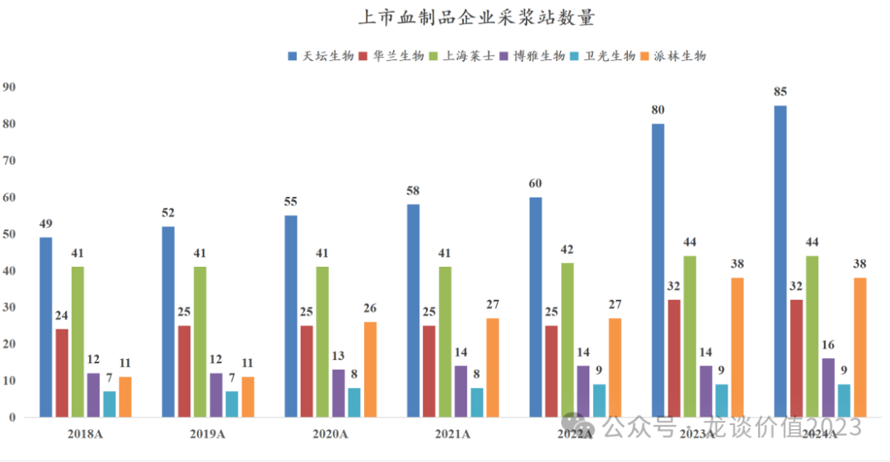

从上游的采浆站开始看，23-24年实际上是采浆站加快扩张的2年，行业上市公司中，天坛生物、华兰生物、上海莱士、博雅生物、派林生物等的采浆站数量都有不同程度的增长，其中天坛生物在运营浆站从60个增加至85个，同比增长了42%，天坛生物还有另外22个在筹建中的浆站；华兰生物多年没有新增浆站，23年新增7个浆站、浆站数量同比增长28%；派林生物也是超过10个新建浆站投产，在运营建站增加到38个、同比增长41%。

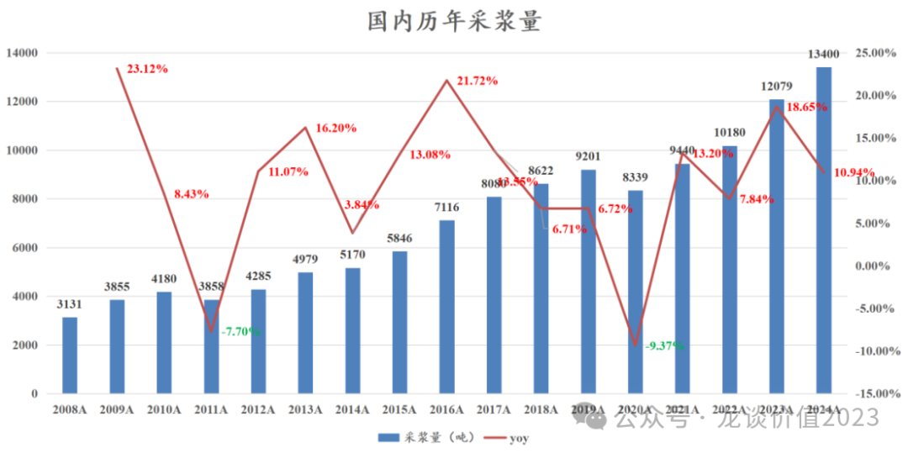

国内2024年采浆量合计是13400吨，2017-2021年复合增速是4%，2021-2024年复合增速是12.4%。

从采浆站和采浆量两个维度，都验证了我们在23年提出的行业供给端加速扩张的逻辑。

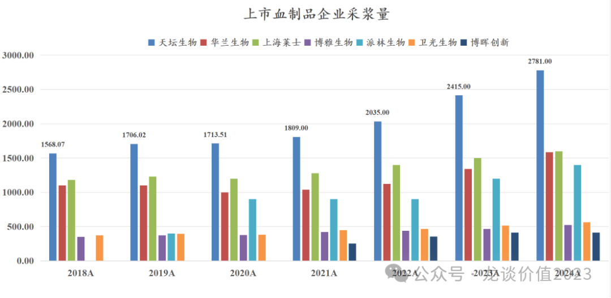

上市的7家血制品公司2024年合计采浆量是8863吨，占国内总采浆量的66.2%，也即国内7家上市血制品公司大约占据了三分之二的血制品市场份额，随着上市公司陆续对非上市公司的并购整合，这个占比预计还会持续提升。

2018-2024年对全行业采浆增量贡献最明显的是天坛生物，2018-2024年全行业采浆量增长接近4800吨，天坛生物一家增长了超过1200吨，贡献了25.4%的行业增量。派林生物由于双林生物合并了派斯菲科，以及一系列新建浆站，采浆量实现大幅增长，从2020年的900吨左右增长至2024年的1400吨左右。

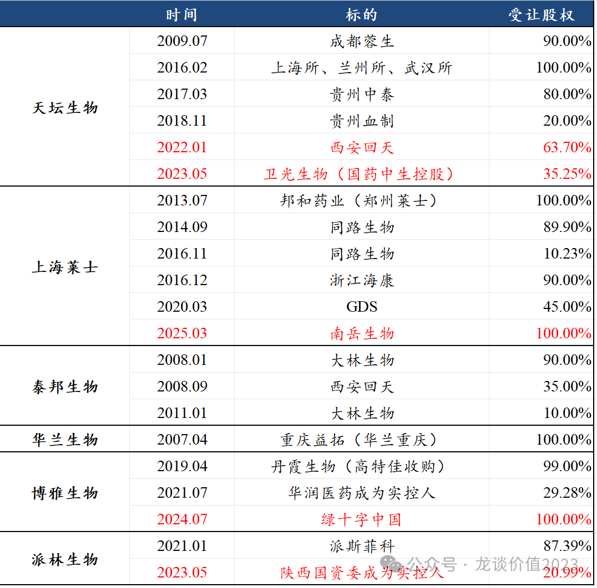

近年行业的并购重组也开始增加，头部上市公司在这几年积累的丰厚利润和现金流之下也面临行业新批浆站的压力，外延并购是行业整合和供给端格局优化的重要方式。

总体来看，在采浆环节，行业近年基本维持稳定的增长，且23-24年随着大量新建采浆站批件的下发，行业供给有所加速；行业内公司存在一定分化，天坛生物、派林生物的行业份额显著提升，华兰生物、上海莱士、博雅生物等的份额有所下降；政策面新批浆站也存在向央国企倾斜的趋势。

2、血制品收入

血制品的价格从过往来看总体是相对还算稳定的，在血制品的省级或联盟集采中，唯一降价幅度稍大一些的是人纤维蛋白原（博雅23-24年纤原收入连续下滑，吨浆贡献纤原的收入从100万降至78万），其他的血制品尤其是主要的白蛋白和静丙，哪怕面对集采时也是价格相对稳定、降价幅度有限，而在行业需求短期大增、供需错配之际还能有所提价，但出厂价的提价速度也远不及终端价的波动幅度大。

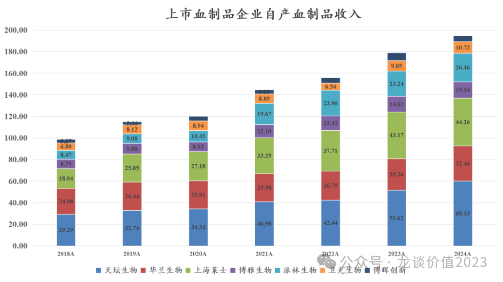

价格稳定+采浆量稳定增长，带来的就是大家可以看到的上图所示，血制品公司的收入增长相当稳定，全行业来看这几年基本处于稳定的收入扩张期。7家上市公司合计的血制品收入自2018年的98.7亿元增长至2024年的194.9亿元，接近翻倍增长，6年的行业复合增速是12.2%。

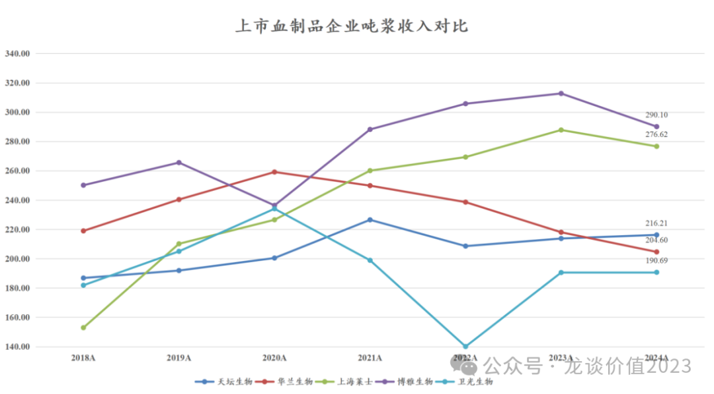

如果从吨浆收入角度来看，7家上市血制品企业2018-2024年总体平均的吨浆收入大概在215万-235万之间波动，最高的博雅生物曾经突破300万的吨浆收入，最低的卫光生物则是不足200万。

天坛生物总体处于行业平均水平附近，近年呈现稳中有升，从2018年的187万提升到2024年的216万，天坛生物过去绝大部分血制品收入来自白蛋白和静丙，近年随着旗下各个生物所陆续补全小品种的批件，其其他凝血因子类的血制品占比显著提升。

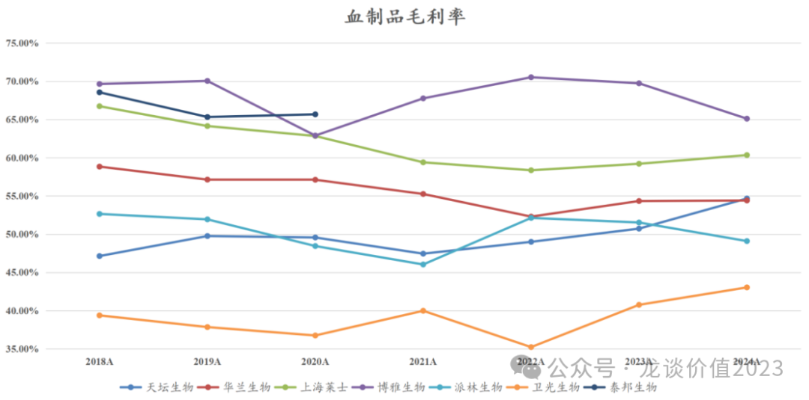

由于血制品大部分成本来自采浆，其次是固定资产折旧，因此毛利率自然也就和吨浆收入有非常直接的关系，吨浆收入越高，说明同样的血浆能采集的血制品品种数量、收率、市场价格等方面可以具有优势，从而显著降低血浆成本占比，提升毛利率。

从上图也可见，天坛生物随着品种数量的增加和采浆量提升的规模效应，其毛利率从2018年的47%提升至2024年的55%，在产品价格稳定的情况下毛利率提升了高达7.5个百分点，与之相对应的净利率从25%提升到35%，提升了高达10个百分点。

总体来看行业收入规模与采浆量呈现同向的稳健增长，吨浆收入提升（品种增加+价格提升）和规模效应使得行业内部分公司的毛利率有所提升。

3、供需格局转变

自2022年底放开的阶段时间里，密集增加的重症患者使得市场对静丙和白蛋白的需求都出现大幅增加，渠道库存被快速消耗，行业短期需求呈现量价齐升，以及再延续到后续的渠道补库存，这是23年行业最辉煌的那段时间驱动业绩的重要逻辑。

从上文分析可知，这一轮的行业血浆供给端的扩张主要是在2023-2024年，在历经一年多的行业补库存之后，行业重新回到供需平衡、甚至白蛋白开始呈现供过于求，这也使得24年以来血制品公司的季度波动更加呈现无序性，如果再叠加新产能投放节奏和发货节奏的调整，呈现出来的可能就是像天坛生物这样：季度间的波动幅度显著加大、单季度的业绩对未来增长预期的判断能起到的作用变得非常小。

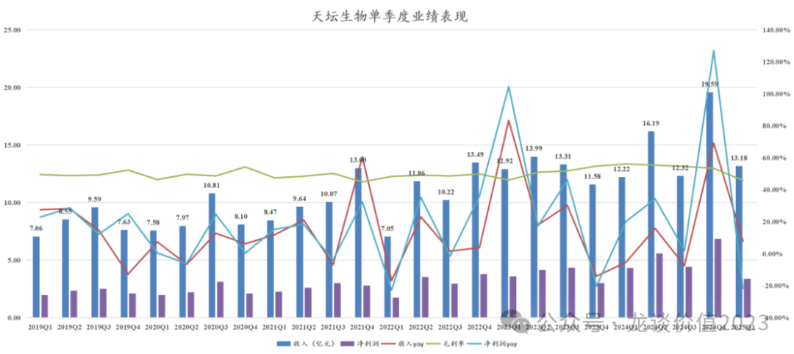

当然这也不尽然都是坏处，好处就是可以让大家减少对短期业绩的内卷，而更多的聚焦中长期的产业逻辑和业绩趋势，例如我们如果看天坛生物半年度和年度的收入表现，就要远比单季度的表现要平滑的多。

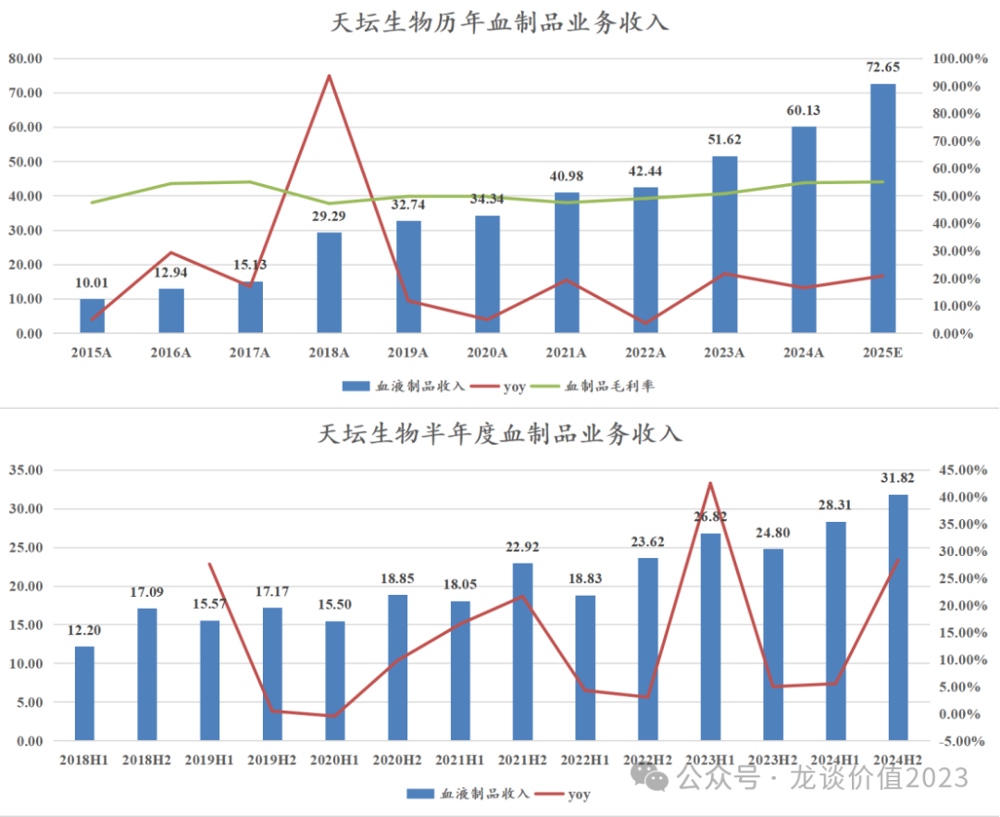

供需格局转变的另一个重要因素，是重组类产品的上市，这对于行业供给端来说是巨大的压力，但从国内血制品产业的“国家安全”角度则是很正面的作用。

第一个对血源的血液制品带来冲击的是重组人凝血因子VIII，重组八因子在进口厂商主导的时候供给端也相对有限，但随着国产神州细胞的重组八因子带着超大规模产能踏入市场后，重组八因子的市场快速扩张，神州细胞的重组八因子自2021年获批上市，次年就实现超10亿元销售，23-24年分别实现收入17.8亿和18.9亿，后续还有中国生物制药、天坛生物的重组八因子获批，行业竞争加剧。

第二个可能血液制品带来冲击的，是重组人血白蛋白，这也将冲击血制品最大的一块市场——国内出厂价口径超过200亿的人血白蛋白市场。重组白蛋白目前有2家主要的国产企业，分别是武汉禾元生物和通化东宝的兄弟公司安睿特生物，前者是通过转基因水稻生产的植物源的重组人白蛋白，后者则是生物发酵的方式生产。

武汉禾元的重组人白蛋白已经在24年申报上市，预计将在25年正式获批上市，前期考虑生产成本和新产品的推广成本，定价可能会高于普通人血白蛋白；武汉禾元当前产能约10吨（100万瓶，10g/瓶），新建产能100吨（1000万瓶）预计在2026年底达产、约为国内需求的10%出头。

通化安睿特的重组人白蛋白早在2024年4月就已经在俄罗斯获批上市，2025年4月宣布在国内完成III期临床研究揭盲、达到国家要求的临床疗效指标和安全性数据，后续将申报上市，安睿特一期规划了30吨/年的产能，对应约300万瓶、超过10亿元的产值，安睿特未来生物药产能的扩张也要快于武汉禾元（需要拿地种水稻），其未来可能会对人白蛋白行业的格局带来更大的威胁。

总体来看重组白蛋白对行业供需格局的潜在影响客观存在，从2-3年维度来看可能影响还相对比较有限——重组白蛋白也受限于产能和更高的定价，但长期来看越来越高的采浆成本和越来越低的生物药生产成本，总归会对血制品行业供给受限的逻辑带来不小的影响。

4、天坛生物

上文聊到行业的时候已经对天坛生物做了比较多的梳理，这里主要再聊聊天坛生物2025年的情况。

2024年天坛生物采浆2781吨同比增长15.16%，单站采浆量32.72吨同比增长7.03%，23-24年新投入运营的浆站采浆量持续爬坡，基本锁定25年双位数以上的增长；公司还有22家拿到批件待建或者在建的浆站，为未来几年采浆量的增长持续贡献增量。

公司在上周也公布了股东大会文件，其中包括对2025年的财务预算，公司在每年的股东大会文件里都会有这个财务预算。

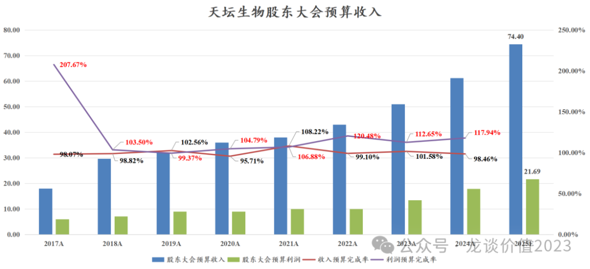

2025年的收入预算是74.40亿元同比增长23.3%，这个增速如果做到的话将是创下2018年公司资产重组以来最快的单年度收入增速；净利润预算是21.69亿元同比增长2.7%，利润端的预算给的相对保守，可能是因为25年新产能投产可能会对毛利率和净利率略有影响。

从天坛生物历史上的财务预算达成率来看，收入可能相较预算有一定偏离、但总体偏离也不会太大，利润端则是基本都可以显著超过财务预算的水平，2018-2024年收入预算的达成率平均是100.64%，利润预算的达成率平均是109.37%。

目前市场卖方机构对天坛生物2025年的盈利预测一致预期是收入68.6亿+13.7%、归母17.0亿+9.7%，而根据天坛生物的股东大会年度财务预算情况，其25年收入端可能在70-71亿元以上，归母净利润保底可能在16-17亿元，最新估值对应为22.2倍-23.6倍PE。

......

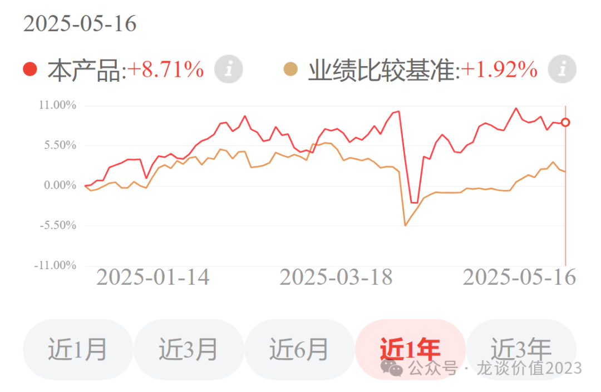

更新下龙谈医药科技组合的净值，截至上周五是8.71%，今天恒生医疗再度大涨，这两天组合净值可能会回到接近新高了，恭喜这波跟随定投加仓的读者们~

（感兴趣的读者可以通过下图二维码中的小程序或APP了解）

风险提示：本文仅讨论行业/公司经营情况，投资需综合考虑公司经营、估值、管理层等多方面因素，建议读者审慎参考，本文不作为投资依据，不建议大家根据本文做出投资计划。

<!-- wxmp-comments-begin -->

---

## 留言（8 条，含回复共 16 条）

- **田野** 👍1 · 2025-05-19 19:48
  天坛远期的纠结点在于，又好几年没有批新浆站了！
  - ↳ **作者** · 2025-05-19 20:05
    他手里还有22个待建的，后面新批浆站应该是要和新产能匹配
- **十二点睡先生** 👍1 · 2025-05-19 22:44
  南微医学现在是不是只能看海外出口了?即使国内出了和创新药一样的创新器械支持政策，对南微的实际利好也有限吧
  - ↳ **作者** · 2025-05-19 22:52
    国内和海外都很重要啊，国内器械集采政策也需要纠偏和转向
- **Bryan** 👍1 · 2025-05-19 23:10
  这个领域放弃了，最震惊的之前才知道美国是全球第一大产能国，老美很多卖血的。。。还有之前英国的血液污染事件，都大跌眼镜。。。
  - ↳ **作者** · 2025-05-19 23:17
    美国供应了全球70%的血浆
- **COCO** · 2025-05-19 18:56
  目前血制品行业是否存在机会
  - ↳ **作者** · 2025-05-19 19:10
    这个阶段是行业磨底吧。
- **鎂轩，请叫我轩轩** · 2025-05-19 18:58
  我买的是华兰生物，已经被套了好多年了。这个公司是不是将在血制品行业掉队，再也回不去了？
  - ↳ **作者** · 2025-05-19 19:10
    华兰这些年血制品业务发展虽然不快，但也基本稳定，尤其是这两年新增7个浆站，采浆也恢复增长。主要是华兰疫苗那边比较差，流感疫苗需求不行，竞争格局又严重恶化。
- **种豆南山** · 2025-05-19 19:46
  和黄药业为啥这么特立独行的走势呢[捂脸]
  - ↳ **作者** · 2025-05-19 20:06
    这几个季度呋喹替尼海外环比基本没增长，国内销售又有压力，就这样了，还是得靠研发管线后续兑现
- **caoguoan** · 2025-05-19 20:02
  龙哥，大博医疗去年营收和净利润都是增长的，是不是表明公司率先走出集采的影响？后面有没有机会？
  - ↳ **作者** · 2025-05-19 20:04
    骨科基本上是从集采里走出来了，大博医疗增速尤其高主要是创伤产品集采续约有提价，这个高增长主要是一次性的提价带来的。
- **也无风雨也无晴** · 2025-05-20 08:48
  现在是drg，血浆能涨价么？
  - ↳ **作者** · 2025-05-20 08:51
    血浆是原料，采浆成本是基本每年有小幅提升的。

<!-- wxmp-comments-end -->
