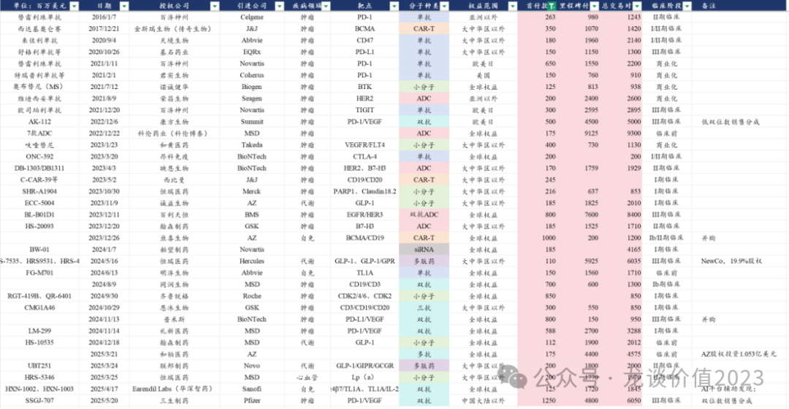
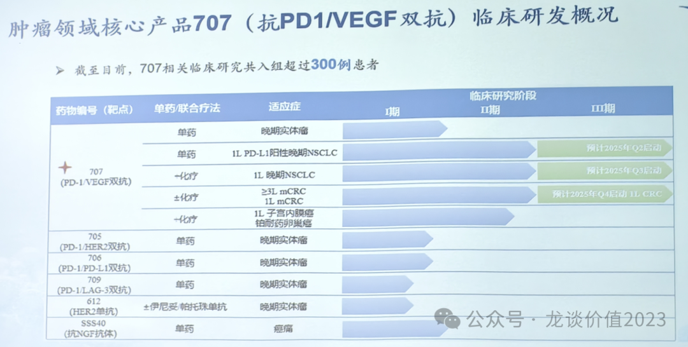
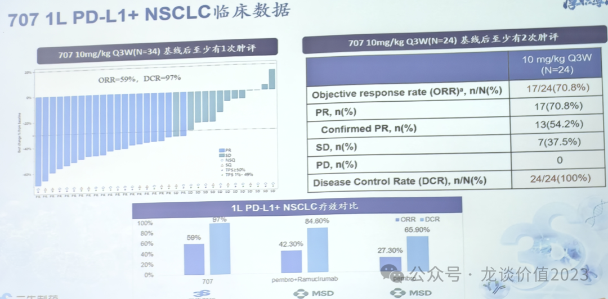
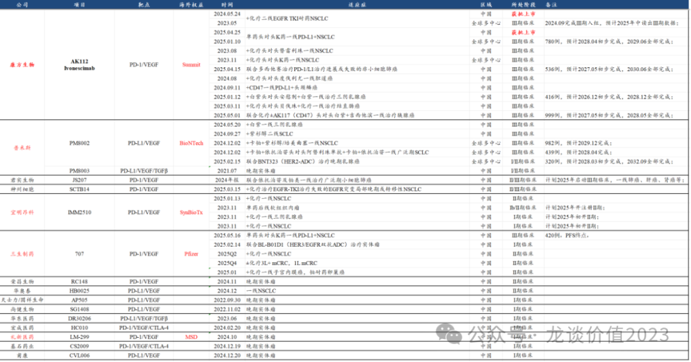
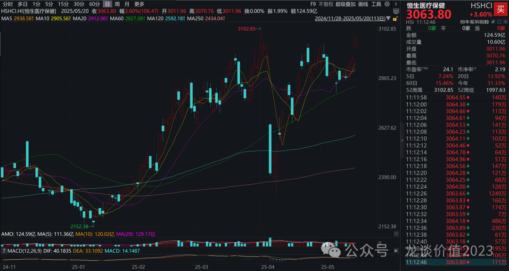
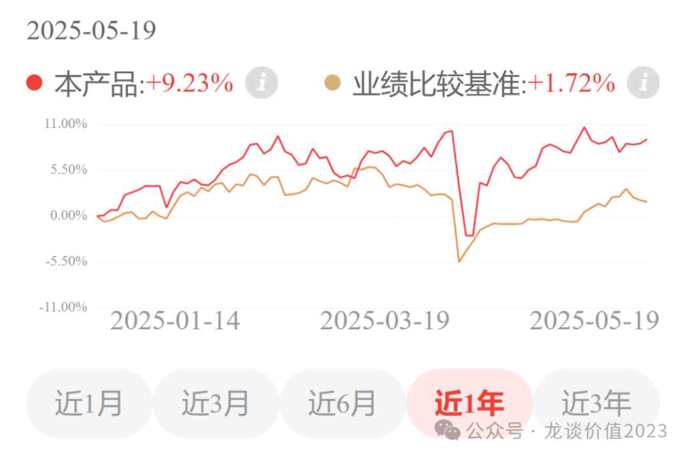

# 创新药520的浪漫是三生制药给的

大家好，我是龙哥。

在前阵子的文章《[宇宙级大药](https://mp.weixin.qq.com/s?__biz=MzkyMzQ3MDc3Mw==&mid=2247484380&idx=1&sn=f59a39aac3c6cb168c326d789c8d8031&scene=21#wechat_redirect)》、《[康方惊魂夜](https://mp.weixin.qq.com/s?__biz=MzkyMzQ3MDc3Mw==&mid=2247484445&idx=1&sn=6293f8664790f222d17303a8eec3e9fb&scene=21#wechat_redirect)》中给大家详细介绍了PD-1/L1\*VEGF双抗的研发情况和竞争格局，我们知道，康方生物在2022年与Summit合作的那笔交易，说是使得中国创新药行业转危为安的关键拐点也不为过，但没想到创新药行业的另一个里程碑事件也是PD-1\*VEGF双抗达成，那就是首个10亿美元首付款的超级重磅BD交易。

三生制药在今天一早发布公告，将其SSGJ-707（PD-1/VEGF双抗）以12.5亿美元首付款+48亿美元里程碑付款+双位数销售分成+1亿美元股权投资的总包，授权给全球顶级MNC——辉瑞。

在中国创新药出海的历史上，合计有34笔首付款超过1亿美元的交易，这其中如果剔除掉AZ收购亘喜和BioNTech收购普米斯的两笔交易，则首付款能超过5亿美元的共有7笔交易，分别是：

- 2021年1月百济授权PD-1单抗给诺华拿到6.5亿美元首付款；
- 2022年12月康方授权PD-1/VEGF双抗给Summit拿到5亿美元首付款；
- 2023年12月百利天恒授权EGFR/HER3双抗ADC给BMS拿到8亿美元首付款（但需承担一半研发费用）；
- 2024年8月同润生物授权CD19/CD3双抗给默沙东拿到7亿美元首付款；
- 2024年9月齐鲁锐格授权CDK2抑制剂给罗氏拿到8.5亿美元首付款；
- 2024年11月礼新制药授权PD-1/VEGF双抗给默沙东获得5.88亿美元首付款；
- 再到本次的三生制药授权PD-1/VEGF双抗给辉瑞获得12.5亿美元首付款，创下历史新高，达成中国创新药出海BD授权的新的里程碑。

以上7笔重磅交易中，包含3笔PD-1/VEGF双抗的交易（加上BNTX收购普米斯就是4笔），以及1笔PD-1单抗的交易，也即7笔重磅交易中肿瘤免疫独占其4。

......

为什么是三生制药？

这款双抗最早由三生国健开发，但是由于三生国健的整个战略方向都倾斜在自身免疫性疾病领域，因此三生国健将自免以外的临床管线的权益全都授权给了三生制药的全资子公司沈阳三生，三生制药开始推进这款药物的临床试验。

在领头羊康方生物陆续读出优秀的数据后，三生制药也加快了该分子的临床开发进度：

三生制药在今年1月初步读出了一线肺癌的II期临床ORR数据，展现出好于AK112的临床疗效和安全性的潜力。

从全球的竞争格局来看，康方生物/Summit一马当前，BioNTech/普米斯紧随其后，这俩都已经陆续开展了多项III期临床试验，尤其是康方生物，在国内和海外分别已经开展了9项和3项大III期临床。

随后的君实生物、神州细胞、三生制药三家国内公司在24年底以来陆续开展了II/III期临床或者III期临床，属于第二梯队的公司。

再往后还有宜明昂科、荣昌生物、华奥泰（华海）等公司处于临床II期，以及一批公司处于I期临床。

除了PD-1/L1\*VEGF双抗以外，另外有看点的是基石药业的PD-1/VEGF/CTLA-4三抗，结合3个成药的靶点（或者说是结合康方AK104+AK112），今年也已经上临床，可以期待基石药业今年的早期数据读出。

三生制药的本身就是国内处于康方、普米斯以外进度较领先的第二梯队公司之一，叠加读出了很不错的早期数据，全公司上下也都高度重视该分子，多位核心高管前期一直在全球接洽各大MNC谈BD合作，才有了今天三生制药这笔超级重磅的BD交易，今天三生制药股价大涨36%，恒生医疗保健指数也受带动大涨3.6%。

这是三生制药给各位创新药投资人的520的浪漫。

......

三生制药除了这款双抗以外，本身就有比较稳固的基本盘。

2024年91亿元的营业收入中，包含一款销售规模达到50.6亿元（同比+20.4%）的重磅药物特比澳（重组人血小板生成素，TPO），作为一款主要用于化疗导致血小板减少（CIT）的药物，特比澳在销售规模达到50亿元后竟然可以在2024年的医保谈判中维持原价实现续约，可见从医保局的角度也是认可该产品的临床获益和市场价值，该产品目前在国内几乎没有竞品，后续潜在的竞品也不多，主要是恒瑞医药的海曲泊帕和齐鲁制药的罗普司亭生物类似药。

三生制药的另一款大单品是曼迪（米诺地尔），这个品牌应该比特比澳更让大家熟知，作为国内卖的最好的治疗脱发的消费医疗品种，24年曼迪实现13.4亿元的收入同比增长19%。

三生制药还有2款EPO合计销售10亿元左右，虽然EPO在集采后有一定压力，但三生制药还开发了长效EPO替代当前的短效EPO，预计未来三生制药在EPO领域也是可以维持10亿以上的销售额。

后续在研管线方面除了PD-1/VEGF双抗，三生制药在24年以来还完成了4笔license in品种交易，分别引进了海和药物的口服紫杉醇溶液、东阳光药的克立福替尼、映恩生物的HER2-ADC、翰宇药业的司美格鲁肽生物类似药等4款药物的国内商业化权益。

三生制药持有三生国健80.89%的股权，而三生国健目前的市值超过240亿元，这两天也受到PD-1/VEGF双抗BD授权的预期和影响而暴涨，三生国健除了持有PD-1/VEGF双抗的部分权益外，其目前有益赛普、HER2单抗、CD25等3款药物处于商业化阶段，24年合计实现接近10亿元的产品收入，后续有IL-17A申报NDA、IL-1β完成急性痛风关节炎III期临床入组、IL-4Rα完成成人AD适应症III期临床入组、IL-5正在进行III期临床，几款药物都是国内具有10亿级别市场潜力的品种。早期管线还有IL-33、BDCA2、TL1A等都是国内较为靠前的研发进度。

......

最后再提一句，今天创新药板块继续大涨，不出意外的话龙谈医药科技组合净值将会达到新高，还是恭喜和我一起定投的各位读者们~

感兴趣的读者可以扫码在小程序或直接在京东金融APP了解~

......

近期重点文章：

《[创新药十大金刚一季报](https://mp.weixin.qq.com/s?__biz=MzkyMzQ3MDc3Mw==&mid=2247484501&idx=1&sn=1ac9bebe7a5ed9abc82da88728838488&scene=21#wechat_redirect)》

《[创新药利空虚惊一场](https://mp.weixin.qq.com/s?__biz=MzkyMzQ3MDc3Mw==&mid=2247484479&idx=1&sn=220426116884355ebe728bcbc1c1b3a2&scene=21#wechat_redirect)》

《[创新药太猛了](https://mp.weixin.qq.com/s?__biz=MzkyMzQ3MDc3Mw==&mid=2247484474&idx=1&sn=2e83130102738a0aeed6568245534666&scene=21#wechat_redirect)》

《[横跨两个黄金赛道](https://mp.weixin.qq.com/s?__biz=MzkyMzQ3MDc3Mw==&mid=2247484409&idx=1&sn=cd9c01b6be30e09a0d4fb3c2d15d078b&scene=21#wechat_redirect)》

《[医药暴涨，估值贵了吗？](https://mp.weixin.qq.com/s?__biz=MzkyMzQ3MDc3Mw==&mid=2247484317&idx=1&sn=28b1cabe165edbe8fe713987e79e3ee9&scene=21#wechat_redirect)》

风险提示：本文仅讨论行业/公司经营情况，投资需综合考虑公司经营、估值、管理层等多方面因素，建议读者审慎参考，本文不作为投资依据，不建议大家根据本文做出投资计划。

<!-- wxmp-comments-begin -->

---

## 留言（11 条，含回复共 24 条）

- **董老大** 👍7 · 2025-05-20 11:23
  三生有幸！失敬失敬[鼓掌][鼓掌][鼓掌][合十][合十][合十]
  - ↳ **作者** · 2025-05-20 11:26
    三生三生，三生有幸，叠加520，确实是绝了😂
- **牛马嘉** 👍2 · 2025-05-20 11:18
  康方被背刺了？
  - ↳ **作者** · 2025-05-20 11:29
    算是吧，辉瑞那边ADC和康方进行IO+ADC的临床合作，扭头买了三生制药的分子....
- **小1** 👍2 · 2025-05-20 11:31
  上周特朗普宣布降低药费，我以128.2一股的价格疯狂抄底百济神州，疯狂了一把，后面看了你的文章惊魂一场后，我这几天死死拿着没卖，今天已经盈利了9个点，请问这个公司半年内还能持续持有吗？还有就是买你的产品医药，高科技和美债，现在这个位置您推荐买不?我没时间炒股，希望你给我打理，又怕现在创新药是股价高点不敢下手，请您指点，谢谢！520快乐，祝你情场赌场双丰收！[玫瑰]
  - ↳ **作者** · 2025-05-20 11:39
    我在上周四专门有一篇文章写到这几个组合，医药科技组合如果没出现其他大的系统性风险，是可以长期定投的。
    美债的话就是作为固收去投，总体回报率应该还是比国内的定存要好一些。
    AI科技组合我讲的少，因为纯AI科技的波动幅度很大，这个就看个人选择了。
  - ↳ **作者** · 2025-05-20 12:27
    百济神州的属于创新药国际化的龙头了，尤其H股的百济估值确实不高，如果后续美国药品相关政策不再有大的变化，那应该没啥大问题，不过还是要紧密跟踪美国的药品政策。
- **墨** 👍2 · 2025-05-20 11:51
  三生估股价昨天提前反映，是不是消息被提前获取了
  - ↳ **作者** · 2025-05-20 11:53
    你要看前面两个交易日的股价那的确有可能，但这个BD谈到后期了确实也传了一阵子了。
- **致力于成为一名合格的交易员** 👍2 · 2025-05-20 11:53
  恒瑞股价还在压制着不让涨
  - ↳ **作者** · 2025-05-20 11:59
    谁压制的[捂脸]
- **fengzhy** 👍1 · 2025-05-20 11:22
  康方危？[恐惧][恐惧]
  - ↳ **作者** · 2025-05-20 11:28
    危不至于，但是Summit现在大概率还是等待被MNC收购的，现在默沙东买了个礼新的I期的项目，辉瑞又买了个三生制药的项目，能有庞大资金和肿瘤管线、有需求收购SMMT的MNC不就越来越少了，并且竞争是更加激烈了。
- **lee** 👍1 · 2025-05-20 11:29
  看晕了，这款药是三生国健的还是三生制药的？
  - ↳ **作者** · 2025-05-20 11:32
    三生国健最早开发，后面把权益授权给三生制药了，三生国健手里还有部分权益。另外三生制药持有三生国健81%的股权，三生国健的也都是三生制药的。
- **Bryan** 👍1 · 2025-05-20 11:40
  龙哥，两点感概，
  1.&nbsp;PD-1/VEGF怎么也有点当年PD-1的赶紧开始扎堆了？不知道国内CDE怎么看到，希望FDA还是保持优效性的评审传统，控制一下内卷吧。次带问题，为什么summit没有被大MNC收购？现在的竞争格局对summit,&nbsp;康方销售峰值有多大影响？
  2.&nbsp;作为一个散户，真的研究精力有限，之前龙哥《宇宙级大药》开始关注三生，但管线不熟悉，K线其实在最终整理期下沿想投机买点的，没买到，不过BioNtech买了一点(美版再鼎的赶紧，管线前景好，资金充裕)。回过头看，三生基本盘比石药好，创新药管线也更好，去年配红利型医药就不该选石药，而应该选三生，当然三生压根没进入我的视野...
  - ↳ **作者** · 2025-05-20 11:44
    不仅是国内，全球的创新药研发都是在高度内卷，低垂的果子都摘的差不多了，GLP-1、下一代IO、ADC这些已经相对明确的未来的重磅药物领域，都是拼命往里面挤。但PD-1/VEGF双抗怎么说这竞争格局其实比当年的PD-1还是要好一点，当然你也可以认为终局没太大区别，但我们看全球市场的话PD-1一线二线公司差距还是蛮大的。
- **禁止的鱼** 👍1 · 2025-05-20 11:42
  龙哥，请教一下，这种对外授权的项目如何给估值啊？
  - ↳ **作者** · 2025-05-20 11:46
    和国内估值一样呀， 估值的大头就是，按海外的市场价值，不管是DCF还是峰值*PS估值，然后*成功率，*权益比例
  - ↳ **作者** · 2025-05-20 12:11
    我们一般是只对销售分成折现，里程碑付款一般包含的都是最大范围的潜在付款，可能包含很多潜在适应症的，实际能达成的比例未必非常高
- **许志强** 👍1 · 2025-05-20 12:05
  持有三生国健的股权好像没那么高，有一部分是三生制药大股东自持的
  - ↳ **作者** · 2025-05-20 12:10
    股权穿透一下就知道了，是有80%多的。
- **开心最好** 👍1 · 2025-05-20 12:37
  龙老师，键凯科技这个算是创新药公司吗
  - ↳ **作者** · 2025-05-20 12:38
    做原料的，下游客户会涉及创新药，他自己有做点长效的改良新药

<!-- wxmp-comments-end -->
