# 医药24年烧了多少钱？

大家好，我是龙哥。

前面用3篇文章分别介绍了创新药行业24年年报《[创新药太猛了](https://mp.weixin.qq.com/s?__biz=MzkyMzQ3MDc3Mw==&mid=2247484474&idx=1&sn=2e83130102738a0aeed6568245534666&scene=21#wechat_redirect)》、25年一季报《[创新药十大金刚一季报](https://mp.weixin.qq.com/s?__biz=MzkyMzQ3MDc3Mw==&mid=2247484501&idx=1&sn=1ac9bebe7a5ed9abc82da88728838488&scene=21#wechat_redirect)》以及血制品行业24年年报情况《[医药资源品无人问津](https://mp.weixin.qq.com/s?__biz=MzkyMzQ3MDc3Mw==&mid=2247484518&idx=1&sn=9b8f16caf0f091208042db0e21676817&scene=21#wechat_redirect)》，后面还会选几个重点的医药细分领域梳理。

有读者问到想看看从全行业的角度来看医药行业及子行业和重点公司的研发投入情况，本文就简单的给大家分析一下，看看医药各子行业的费用投入情况。

全行业我统计了合计596家A股、港股、美股中概的中国医药公司，包含制药、医疗器械、医疗服务、医药商业等板块，不含互联网医疗、医疗信息化等板块，全行业596家公司目前合计的总市值是7.69万亿元，合计营业收入是36255亿元，合计销售费用4424.4亿元，总体销售费用率12.2%，合计研发费用1746亿元，总体研发费用率4.82%。

这个行业总体的费用率受到医药流通公司的摊薄比较明显，所以看全行业费用率不是很有意义，例如我们剔除掉医药商业板块（药店+流通）后研发费用率约为9.62%、销售费用率约为19.31%，如果只考虑成药和器械，则销售费用率达到23.2%，研发费用率达到11.1%。因此，我们还是具体看各个细分子行业的数据。

1、制药板块

我们把制药板块分为创新药、化学制药、生物制药、疫苗、血液制品、中药、原料药等7个部分，合计332家公司，合计市值4.84万亿，占医药行业总市值的63%。过去很多年机构持仓对制药板块在医药行业里都是低配的，高配的是医疗服务、药店、CXO、器械等方向，25年以来制药板块则是回到显著高配的水平。

①创新药

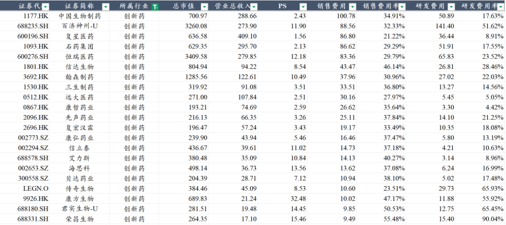

创新药板块86家公司合计市值达到2.12万亿，占行业总市值的27.6%，合计营收2837亿元，合计销售费用867亿元，销售费用率30.56%，占行业总销售费用的19.6%，合计研发费用775亿元，研发费用率27.32%，占行业总研发费用的44.39%，是医药行业研发投入的中流砥柱。

研发费用最高的百济神州超过140亿的研发费用，是唯一在产品研发管线和商业化都真正实现全球化布局的顶级biopharma；后续的恒瑞医药、复星医药等因为有研发投入资本化，因此研发费用并未反映全部的研发投入，但也已经是较高的水平，石药集团、中国生物制药的研发费用超过50亿元，传奇生物、翰森制药、信达生物的研发费用超过20亿元。

这里还要另外提一句，最近又开始有卖方发“市研率”的数据，不由得让我回想起上一轮医药牛市巅峰的市研率估值法。市研率是用市值除以研发费用，这个估值对于高研发投入的未盈利公司来说有参考意义，但意义确实不大。

从我们这么多年看创新药和医疗器械行业的经验来说，研发投入的规模并不能完全反映企业的研发实力和研发管线价值，例如国内有的传统药企以前也每年十几二十亿乃至更多的研发费用投进去，结果除了做了一批仿制药以外，在创新药领域的巨额投入基本都是打水漂；再比如还有的biotech做啥啥失败，管线里没一个能拿得出手的，研发投入不少、资金即将枯竭，看市研率就没任何意义；再比如同样是产品管线还不错的biopharma，其研发投入效率都可能存在较大的差异。因此，创新药的市场行情的确比较火热，但还是要理性的看待估值体系，市研率之类的指标大可不必。

②化学制药+生物制药

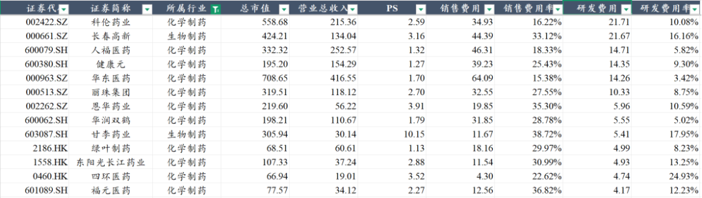

化学制药+生物制药板块96家公司合计市值8706亿元，占行业总市值的11.32%，合计营收3064亿元，合计销售费用735.5亿元，销售费用率24%（华东、人福等有相当体量的医药流通业务），占行业销售费用的16.6%，研发费用226.6亿元，研发费用率7.4%，占行业研发费用的13%。创新药+化学生物制药的研发费用占行业的57%，收入占比则只有16.3%。

其中研发费用最高的是科伦药业的21.71亿元（其中12亿在科伦博泰）和长春高新的21.67亿元，其次是华东医药、人福医药、健康元、丽珠集团等。化学/生物制药板块的研发费用率普遍要比创新药板块低一些，基本是在个位数到10%之间。

实际上大部分的传统药企这些年都在积极的转型创新，化药和生物药板块的公司大多也可以合并到创新药板块里，只是我这里为了把转型做的慢的公司和转型相对成功的公司做个区分。

传统药企的研发投入普遍不会像biotech/biopharma那样烧钱，原因是传统药企的钱大多是过去很多年慢慢积累下来的做业务赚的钱，自然不会像借助资本市场快速融资的公司那样烧钱，但研发投入少一点不代表完全没东西，传统药企这两年也出现了多个优秀的海外BD大品种，还是可以积极的关注一些传统药企能慢慢转型成功走出来的公司。

③中药

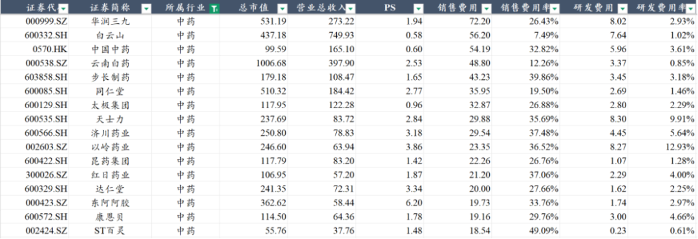

中药板块78家公司合计市值9402亿元，占行业总市值的12.23%，合计营收3865亿元、占全行业的10.66%，合计销售费用877亿元，销售费用率22.7%（白云山、云南白药等具有较大体量的医药流通业务），占行业销售费用的20%，研发费用112亿元，研发费用率2.9%，占行业研发费用的6.4%，这也比较符合大家朴素的认知，中药板块可以通过极少的研发投入获得较大规模的收入体量，且销售费用投入规模较大。

2、医疗器械板块

我们把医疗器械板块分为高值耗材、低值耗材、医疗设备、IVD这四个方向，合计141家公司总市值1.42万亿元，占行业总市值的18.5%，合计收入2675亿元。

①医疗设备

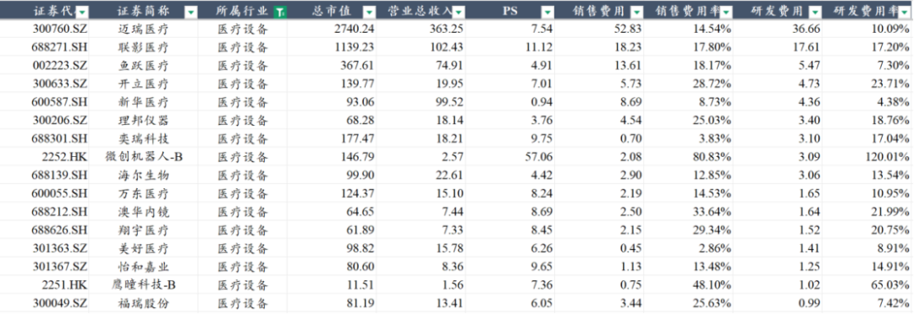

医疗设备板块是我国医疗器械行业的传统优势领域，借助国内优势电子领域的供应链实现较好的发展，行业35家上市公司合计市值达到6121亿元，营业收入合计894亿元，销售费用合计137亿元、销售费用率15.2%，占行业销售费用率的3.1%，研发费用101.5亿元，研发费用率11.4%，占行业研发费用率的5.8%。

行业研发投入体量最大的迈瑞医疗、联影医疗都是大家比较熟悉的公司了，迈瑞医疗常年维持10%左右的研发投入强度，销售费用率也已经控到极致，使得迈瑞这几年给大家呈现了非常好的利润率水平；联影医疗由于收入体量只有迈瑞的28%，还处于费用的高投入阶段，销售和研发费用率都要高于迈瑞，未来也会随着收入的扩张而逐渐摊薄。开立医疗也是近年维持较高的研发投入强度，公司致力于成为多产品线的平台型设备公司。

②高值耗材

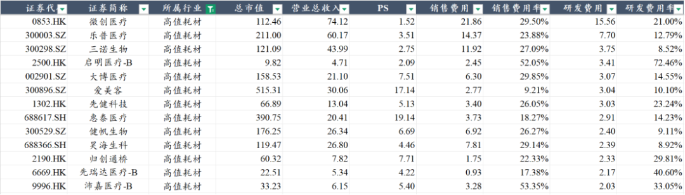

高值耗材行业普遍还是比较高的研发投入强度和销售费用率，其研发和销售费用结构与创新药类似，但由于高值耗材这几年基本是被集采持续打击，行业内公司也被迫进行降本控费、削减研发和销售费用开支。

高值耗材领域50家公司合计市值4123亿元，收入677亿元，销售费用155亿元，销售费用率22.9%，销售费用占行业3.5%，研发费用85亿元，研发费用率12.6%，研发费用占行业4.9%。

微创医疗及其分拆上市的多家核心子公司的降本控费在行业中体现的最明显，微创医疗过去几年的过度扩张使得财务风险完全失控，在产业下行期被迫进行全面的战略收缩；乐普医疗虽然没有暴露很大的财务风险，但这几年也被集采干的不轻，近年也在持续的收缩研发和销售费用投入。

高值耗材拥有诸多价值量很高的细分领域心血管介入、神经介入、骨科、眼科、齿科、血液净化等等，从产业升级角度是一个可以类比创新药的重要医药细分领域，因此我们也比较期待在政策面后续会出现一些边际变化，使得创新器械也可以有类似创新药医保谈判的单独定价。

③IVD行业

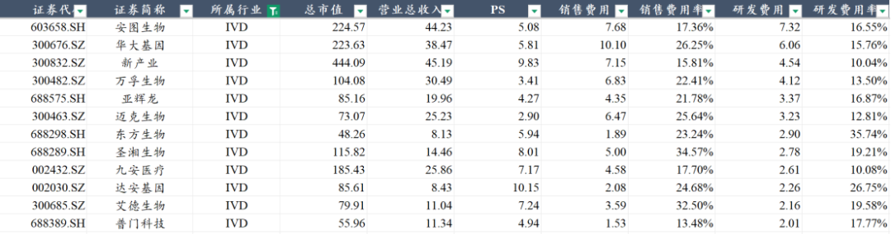

国内医改政策对各个细分领域的影响阶段有一定时间差，如2018年最早开始仿制药集采，倒逼一众药企转型创新，才有了这几年创新药行业的蓬勃发展；再到2020年开始高值耗材、低值耗材集采，而2024年以来明显感受到的是在高耗、低耗集采之外，医疗设备、IVD、中药、连锁药店等领域成为集采或者整治的重点，院内市场的IVD和中药在去年下半年以来的感受尤其明显。

IVD行业38家公司市值合计2839亿元，收入合计549亿元，销售费用率19.87%、研发费用率12.53%，总体也属于高研发投入、高销售费用的领域，在集采的压力下未来可能也会呈现毛利率下降、销售费用压减等趋势。

3、CXO及生命科学服务

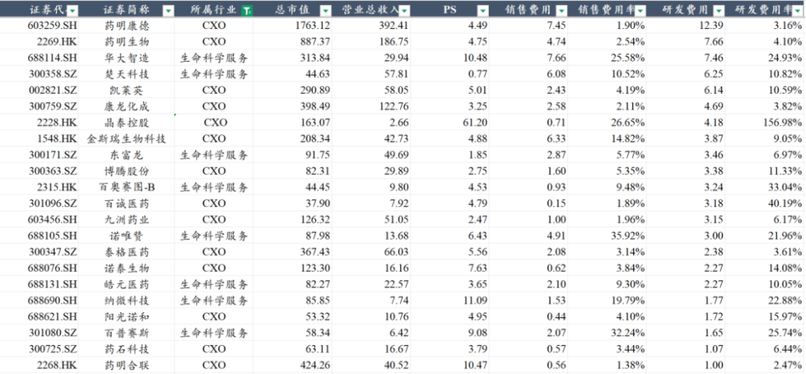

CXO相对来说并不是需要很高的研发投入强度和销售费用投入的方向，行业内研发投入绝对值相对高一些的公司主要就是药明系、凯莱英、康龙等，还有一个特殊一点的是AI制药的晶泰控股，后续还有英矽智能会上市，英矽智能也是非常值得关注的一家纯正的AI制药的龙头。生命科学服务板块则相对要求更高的研发投入强度，板块研发费用率13.9%、销售费用率13.9%。

4、连锁药店

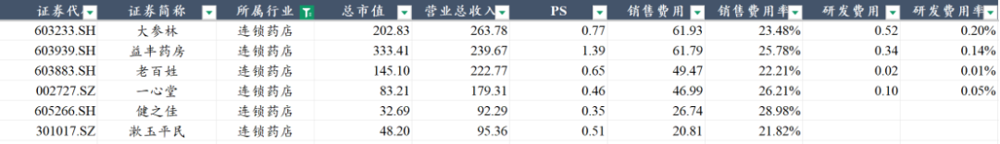

连锁药店行业主要的6家上市公司合计市值845亿元，合计收入1093亿元，合计销售费用268亿元、销售费用率24.5%，头部连锁药店的毛利率在30%-40%，费用端绝大部分是销售费用。

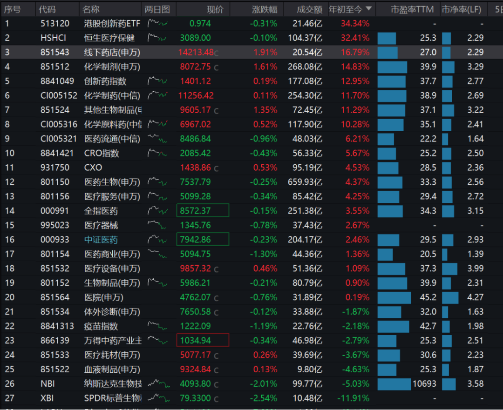

药店行业去年年中以来也承受了较大的政策面的压力和消费低迷的影响，属于在行业供给过剩的背景下同时受到政策端和需求端的双重打击，板块在去年下半年的跌幅较大，但如果我们看今年以来，药店行业实际上是A股医药各个细分行业的涨幅第一，股价已经领先于行业供给出清和需求修复而企稳。

......

之前推荐大家关注的医药科技定投组合，昨天已经创新高，今年来累计涨幅13.51%，跑赢业绩基准接近11%，选择比努力更重要，个股选的累死人，不如看准方向持续下重注。

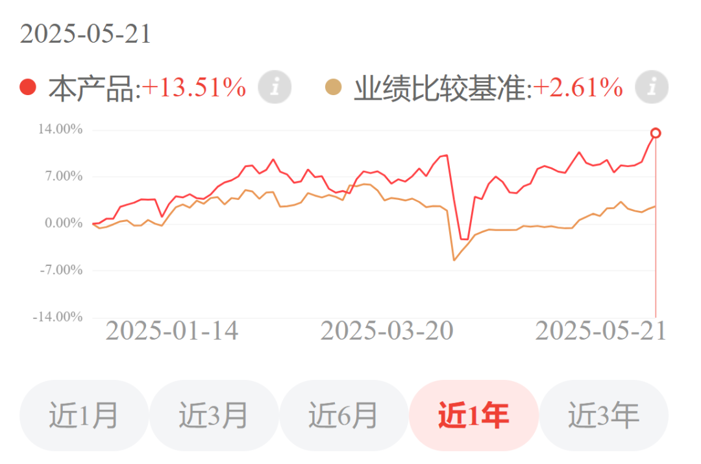

推荐大家关注的美元债组合也在新高附近，跑赢业绩基准超过3个点，要知道这是一个作为固收产品持有的组合。

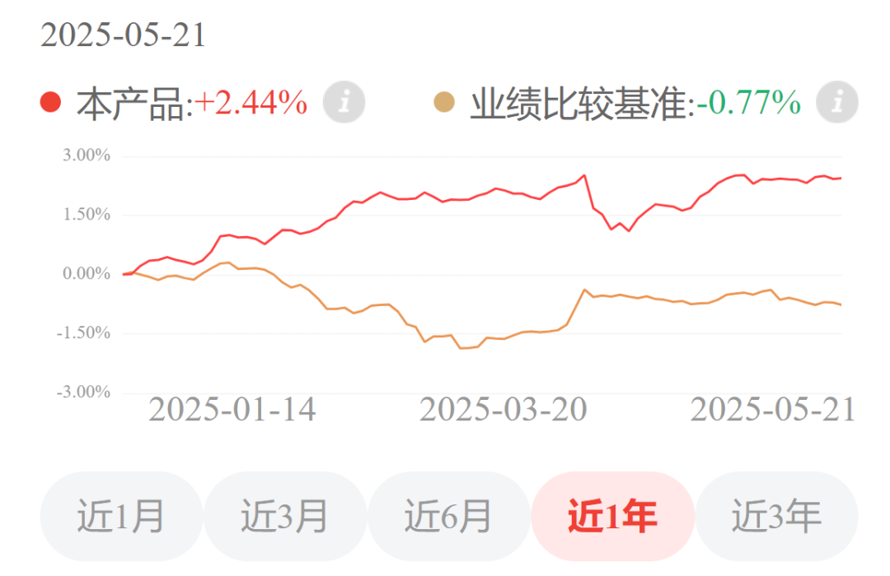

感兴趣的读者自行扫码了解~

风险提示：本文仅讨论行业/公司经营情况，投资需综合考虑公司经营、估值、管理层等多方面因素，建议读者审慎参考，本文不作为投资依据，不建议大家根据本文做出投资计划。

<!-- wxmp-comments-begin -->

---

## 留言（4 条，含回复共 10 条）

- **和** 👍4 · 2025-05-22 15:31
  恒生医药又新高了[呲牙][呲牙][呲牙]
  - ↳ **作者** · 2025-05-22 15:35
    三生制药的巨额BD授权在周二的文章也有讲到，确实是对板块热度有积极的作用。
- **你笑起来真好看5G** 👍3 · 2025-05-22 15:31
  益方生物2024研发费用3.84亿元（同比下降13.22%），是不是太少了，应该回避这种公司啊
  - ↳ **作者** · 2025-05-22 15:34
    研发费用不是永远线性增长的，他会和研发项目有比较大的关系，比如我去年有几个大项目做III期临床，那费用投入肯定就比较大，然后这几个临床今年做完了，今年就不需要投那么多钱了，但不代表公司不行了，反而公司可能进入商业化兑现阶段了。
    对于益方生物，他本身倒不是一个把管线铺的很宽的公司，还是追求高成功率高效率的公司，虽然管线都是follow为主。
- **昱辰谈势3C** 👍1 · 2025-05-22 15:07
  龙哥，现在君实生物的研发管线是不是进展的不理想啊
  - ↳ **作者** · 2025-05-22 15:14
    就特瑞普利单抗来说这两年陆续批了多个大适应症，确实是帮助他在国内的销售实现快速增长，海外方面销售低于预期。后续管线确实没有太多的进展，BTLA的III期要等结果数据，PD-1/VEGF双抗今年开II/III期临床。
- **无价之宝** · 2025-05-22 16:44
  龙哥你好，我看你表单里面金斯瑞的数据是只包含cxo子公司的还是包含传奇生物等全部的呢？另外没看到爱博医疗，想请教下爱博医疗算高耗材板块吗？板块里面算头部优秀公司了吧
  - ↳ **作者** · 2025-05-22 16:49
    只包含金斯瑞，金斯瑞已经不再对传奇生物合并报表了。
    爱博医疗是属于高值耗材，只是他研发费用绝对值不算多，24年就1亿出头，所以没放进来。
  - ↳ **作者** · 2025-05-22 17:27
    龙大，有跟进爱博pr的进院情况吗？估计什么时候能或者有没有机会扭转业绩下降的预期和态势？谢谢
  - ↳ **作者** · 2025-05-22 17:29
    4.24的文章有写哈

<!-- wxmp-comments-end -->
