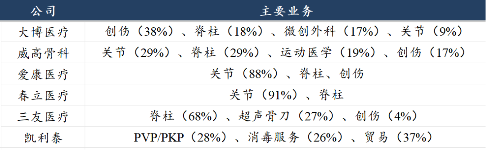
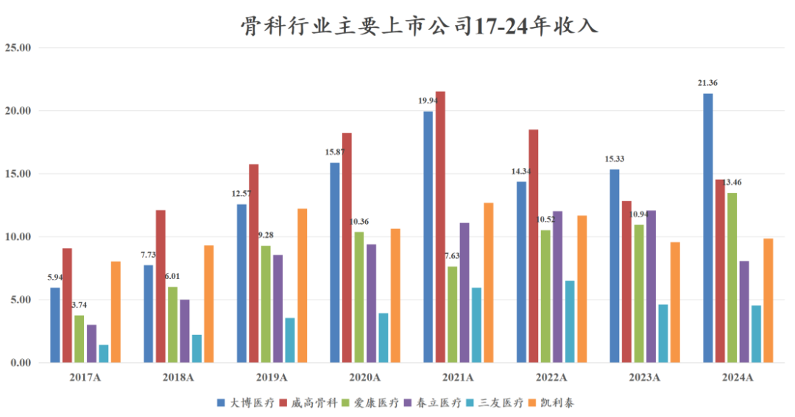
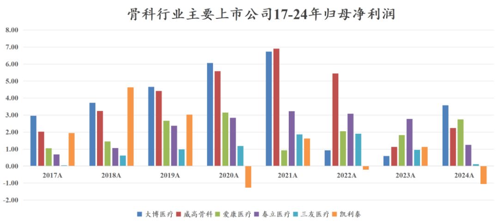
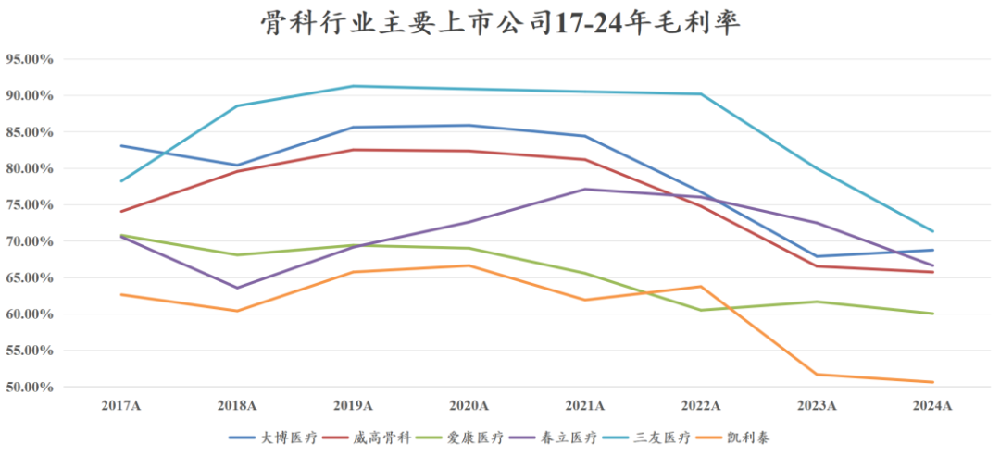
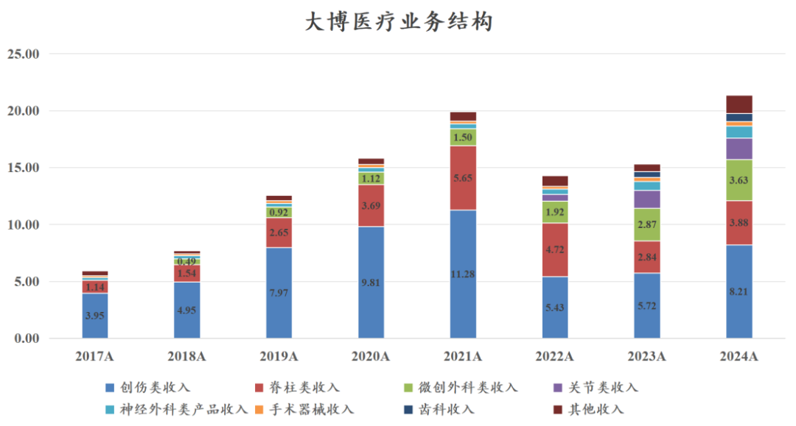
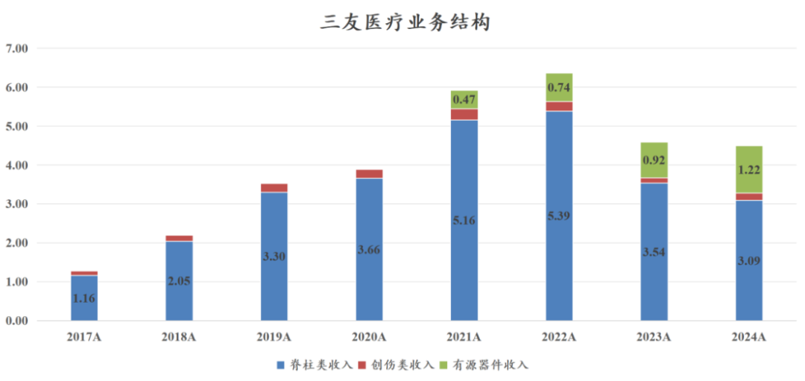
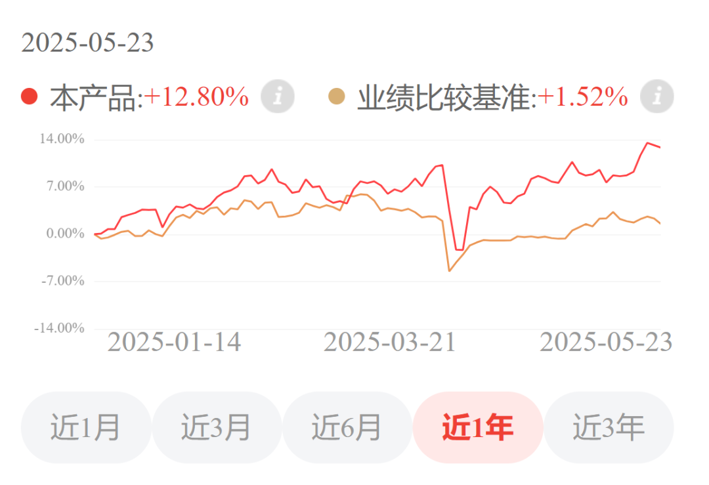
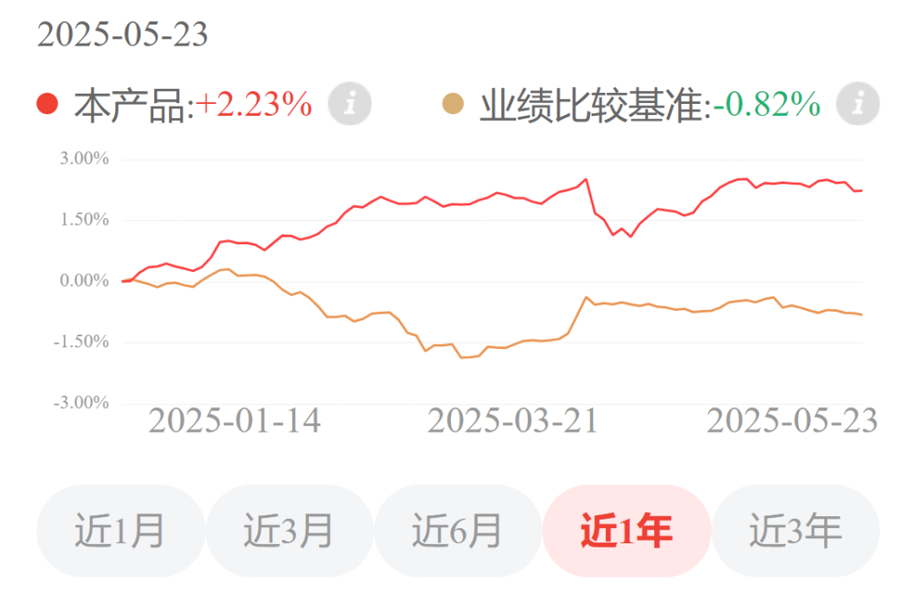

# 骨科行业新征程

大家好，我是龙哥。

骨科耗材是曾经医药行业的黄金赛道，当年被誉为“金眼银牙铜骨头”，也是2020年那阵我们经常聊到的赛道。而骨科耗材也是在冠脉介入后第二个被国家集采的高值耗材细分领域，关节、创伤、脊柱、运动医学在过去几年陆续进行国采，使得骨科耗材行业的公司普遍在收入利润端受到较大冲击，直到现在我们看到骨科集采基本已经充分反映在业绩中，个别降价幅度过大的领域也开始出现纠偏式的提价，由此骨科耗材领域的几家公司业绩普遍逐渐企稳，这里我们就来聊聊行业目前的情况。

我们这里主要聊到的是以下6家骨科行业AH上市公司，这里也给大家列了一下6家公司财报披露的主要业务结构情况（春立为23年）。

收入端来看，到2024年收入端创下历史新高的有两家公司，分别是大博医疗和爱康医疗，威高骨科的收入在24年同比有企稳增长，三友医疗24年同比仍略有下滑、但从季度表现来看也已经明显企稳，只有春立医疗在24年出现较大幅度的下滑，凯利泰这边核心的椎体扩张球囊导管和脊柱创伤耗材的占比持续下降，到24年只有34.6%，消毒服务和贸易占了收入的大头，已经快被踢出骨科耗材行业。

利润端来看骨科公司的利润表现要比收入端差的多，普遍距离历史新高还有一定距离，利润表现最好的是爱康医疗，24年利润已经恢复到了历史最高水平的87%，其次是大博医疗，恢复到了历史最高水平的53%，而威高、春立、三友等的盈利恢复则还相对滞后。

从利润率角度来看，行业的利润率从过去的20%-50%下降到现在的15%-20%，行业目前处于一个我们认为算是相对合理略偏低的盈利能力。

毛利率方面行业从70%-90%的毛利率下降至60%-70%，虽然说和过去我们通常认为的创新药械企业动辄80%-95%的毛利率已经不可同日而语，但这个毛利率水平还是要远高于普通制造业水平，之前开玩笑说骨科耗材成了“五金件”，现在看还是比五金件的毛利率高一些的哈，像国内外的五金件的公司（坚朗五金等）毛利率大概就是30%-40%......

聊完行业目前大致的业绩趋势，再来就具体公司聊聊行业的变化。

1）大博医疗

大博医疗的收入创新高、利润企稳，一方面是集采纠偏提价，另一方面是公司较早就进行多业务领域的布局，多业务领域的发展使得其在集采一波冲击后可以快速地走出来。

大博医疗的业务范围比以上几家骨科公司都要更复杂，集采导致创伤之王——大博医疗的创伤类收入占比从63%下降至38%，同时微创外科的占比从6%提升到17%，公司新进入的骨科关节领域也自2022年以来借助集采实现快速放量，另外神经外科、手术器械、齿科、其他业务都有不同程度的快速增长，多业务线的快速发展是公司收入能创下历史新高的基础。

创伤类产品在2022年遭到集采的重挫，22-23年的收入只有5个多亿，相较过去两年10-11亿的收入体量基本腰斩，而随后的创伤类产品集采续约对此前过大的降价幅度进行了纠偏，2023年9月创伤集采续约时的最高有效申报价相较上一轮集采的中选价普遍有较大幅度提升，相较大博医疗、威高骨科、迈瑞医疗和三友医疗的创伤集采中标价分别平均高48%、28%、64%、25%，因此从2024年的业绩表现来看各家骨科公司的创伤业务都有不同程度的显著修复，大博医疗、威高骨科、三友医疗三家公司的创伤业务24年收入增速分别为43%、24%、38%，毛利率分别同比提升3.67%、6.60%、-6.63%，其中威高骨科2024年的创伤产品均价同比提升15.24%。

2）爱康医疗/春立医疗

爱康医疗和春立医疗是国内关节的双龙头，关节也是最早进行集采的骨科耗材细分领域，但两家公司的业绩趋势有所不同，春立医疗在首次关节集采中的价格相对偏高，使得春立医疗在2021年的业绩并未像爱康这样受到明显的冲击，但在后续的集采续约中二者业绩趋势反转，24年爱康医疗收入同比增长23%，而春立医疗反而下滑33%，威高骨科的关节业务同比增长46%，大博医疗的关节业务增长21%。

爱康医疗原本对24年的业绩目标是收入增长30%、利润率20%，实际业绩来看利润率的确修复到20%，但收入增速还是低于预期。

两家公司都在大力拓展海外业务，爱康医疗24年海外收入2.74亿同比增长20.78%，海外收入占比20.38%；春立医疗24年海外收入3.53亿元同比增长78.3%，海外收入占比43.84%。

3）三友医疗

三友医疗原本业务高度集中在脊柱领域，2020年三友医疗脊柱业务收入占比93.7%、创伤收入占比5.9%，而到了2024年公司脊柱业务收入占比68%、创伤业务收入占比4.1%，主要是公司收购了水木天蓬超声骨刀带来的有源器件收入的快速增长，2024年超声骨刀及相关耗材的收入合计达到1.22亿元同比增长32%，收入占比也达到26.9%。

虽然三友医疗的收入体量在国内骨科行业还不够靠前，但从产品布局的角度来说三友医疗一直是比较追求国际化高水平创新的骨科公司，公司目前在全球市场的布局思路，是争取做全球最好的脊柱手术机器人（春风化雨）+全球最好的超声骨刀有源设备（水木天蓬）+创新脊柱耗材系列产品+Implanet全球独家脊柱内固定拉力带产品，有突破性临床价值的手术机器人搭配系列耗材的组合，相比过去单纯耗材的出海，成功率会高的多。只不过春风化雨机器人的商业化落地可能要到2027年。

总体来看骨科行业在几年的集采冲击下基本处于政策影响逐渐落地和出清的过程，收入端已经开始创出历史新高，利润端虽然还与历史新高有差距、但也在边际修复中，各家企业也都在寻求不同的出路：

①行业全面追求出海，除了威高骨科以外其他骨科耗材公司的海外收入占比普遍已经提升到10%-20%的水平。

②行业全面进行手术机器人等配套设备的研发和业务延伸，爱康、春立、三友等都有明确的规划，威高则是有集团开发手术机器人。

③各家从前些年的躺赢到现在普遍都大幅增加了研发投入，大博的研发费用率从8%提升到14%，威高骨科从4%提升到8%，爱康从8%提升到10%，春立从7%提升到13%，三友从8%提升到18%。

估值方面，根据25年的盈利预测，各家公司的PE估值分别约为大博医疗31倍、威高骨科35倍、三友医疗65倍、爱康医疗17倍、春立医疗16倍，港股估值总体还是要显著低于A股。

......

龙谈医药科技组合最新净值12.80%，超额收益11.3%。

龙谈美元债（固收类）最新净值2.23%，超额收益3%。

感兴趣的读者扫码了解~

近期重点文章：

《[医疗器械霸主至暗时刻](https://mp.weixin.qq.com/s?__biz=MzkyMzQ3MDc3Mw==&mid=2247484461&idx=1&sn=448e08c5385c8433cb52f5322d89b2d8&scene=21#wechat_redirect)》

《[眼科超级成长股跌倒](https://mp.weixin.qq.com/s?__biz=MzkyMzQ3MDc3Mw==&mid=2247484435&idx=1&sn=c0a693b7e68a1b66f50dafe59eeca8ea&scene=21#wechat_redirect)》

《[医药24年烧了多少钱？](https://mp.weixin.qq.com/s?__biz=MzkyMzQ3MDc3Mw==&mid=2247484551&idx=1&sn=69b7264675dc2ac1a809e29b27e61622&scene=21#wechat_redirect)》

风险提示：本文仅讨论行业/公司经营情况，投资需综合考虑公司经营、估值、管理层等多方面因素，建议读者审慎参考，本文不作为投资依据，不建议大家根据本文做出投资计划。

<!-- wxmp-comments-begin -->

---

## 留言（11 条，含回复共 24 条）

- **Old Lee** 👍2 · 2025-05-26 16:39
  国内有哪家实时血糖测量仪能和雅培相媲美的吗？
  - ↳ **作者** · 2025-05-26 16:41
    CGM现在国内做的比较好的硅基、三诺，然后鱼跃
- **云深不知处** 👍2 · 2025-05-26 16:40
  通策、爱尔这些是不是已经没的救了？
  - ↳ **作者** · 2025-05-26 16:42
    消费医疗的话和宏观环境的关系更大一些，你看消费也是一样，新消费火的一塌糊涂，大部分老消费不温不火的。
- **金李成** 👍2 · 2025-05-26 16:46
  凯利泰的商誉太高了，以后减值风险是不是很大？而且会计师事务所给出了非标年报
  - ↳ **作者** · 2025-05-26 16:48
    不只是商誉的问题，就他这业务发展趋势和公司发展方向来说本身也没啥意思，更不用说已经被ST了，没必要在这种公司上浪费时间。
- **-Jasper** 👍2 · 2025-05-26 16:52
  港股春立扣除有息负债还有大把在手现金，够便宜
  - ↳ **作者** · 2025-05-26 16:53
    是的，37亿的市值，还有18亿的在手现金
- **石泉** 👍2 · 2025-05-26 17:07
  春立和爱康哪个更有投资价值
  - ↳ **作者** · 2025-05-26 17:14
    没太大区别
- **老呐用飘柔** 👍2 · 2025-05-26 17:10
  龙大，骨科德拐点到了吗
  - ↳ **作者** · 2025-05-26 17:13
    这文章写的不就是这么个事嘛，哈哈
  - ↳ **作者** · 2025-05-27 12:36
    看了半天，德改成的才对。不然以为哪家德公司给错过了。
- **Doki** 👍2 · 2025-05-26 17:12
  龙哥，有没有科创板创新药的ETF呀
  - ↳ **作者** · 2025-05-26 17:15
    啊有的，印象中这两天还要上一个，晚点我看看有没有必要介绍下
- **baggio** 👍2 · 2025-05-26 20:05
  请问龙总，像华为watch&nbsp;&nbsp;d2这种，号称已经通过医疗认证的，可以实时监测血压的手表，靠谱吗
  - ↳ **作者** · 2025-05-26 20:54
    他们又医疗器械注册证，印象中之前都可以刷医保的，日常用来监测血压是没啥问题的，但如果是涉及到用药的话最好还是用专业设备
- **小1** 👍1 · 2025-05-26 16:39
  龙大大：您好！请问爱康医疗现在可以入不？中长期持有的话是不是可以？我感觉中国人口结构老年化严重，&nbsp;利好关节耗材，年纪越大，骨质疏松，越容易骨折，包括四肢骨折，髋关节骨折，脊柱压缩性骨折，不过这几年被集采弄得做台脊柱压缩性骨折的骨水泥手术都只收费几千了，不知道还有必要买爱康医疗不？求您指点！[微笑]来自医疗行业的牛马的灵魂提问，求翻牌。
  - ↳ **作者** · 2025-05-26 16:46
    爱康还好，经过集采续约后的价格体系基本稳定了，量的需求如你说的那样是有增长的，总体基本面企稳向上，估值也还不高，关注度也不是很高。
- **李白好白** 👍1 · 2025-05-26 18:23
  对了龙哥，微创是不是要走出来了？&nbsp;据说上海资本要买日本商社持有的股份
  - ↳ **作者** · 2025-05-26 18:24
    这个传好久了，不知道能不能落地啊，而且就算接了大冢，能换掉管理层吗？
- **廖书豪** · 2025-05-28 13:16
  请问龙哥，大A创新药都涨上天了，医疗服务这种老服务是因为模式原因还是没出清，怎么还在地上趴着[捂脸]
  - ↳ **作者** · 2025-05-28 17:03
    医疗服务，要么和医保高度相关，要么和消费高度相关，你看哪个是趋势很好的吗[捂脸]创新药那边是出海和政策鼓励支持的，独一份啊
  - ↳ **作者** · 2025-05-28 17:27
    所以他叫新消费啊[捂脸][捂脸]

<!-- wxmp-comments-end -->
