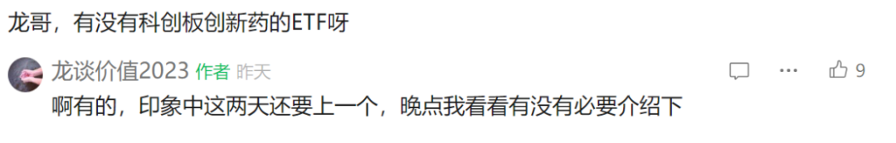
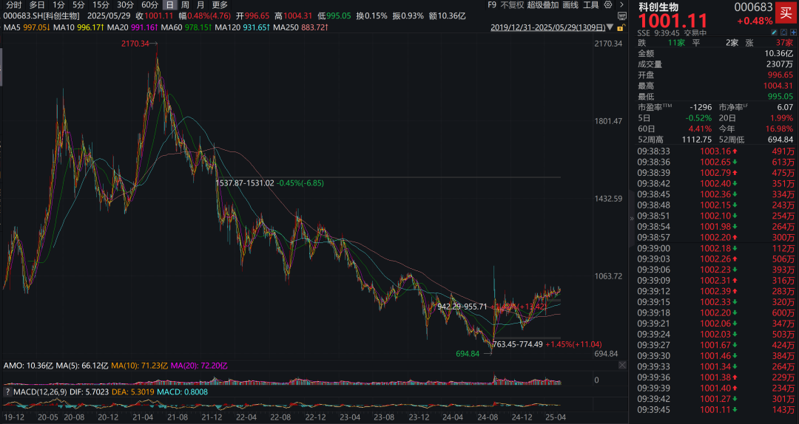
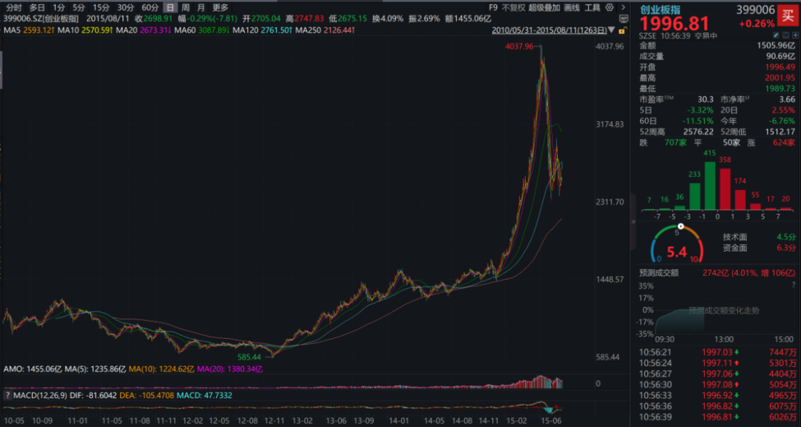
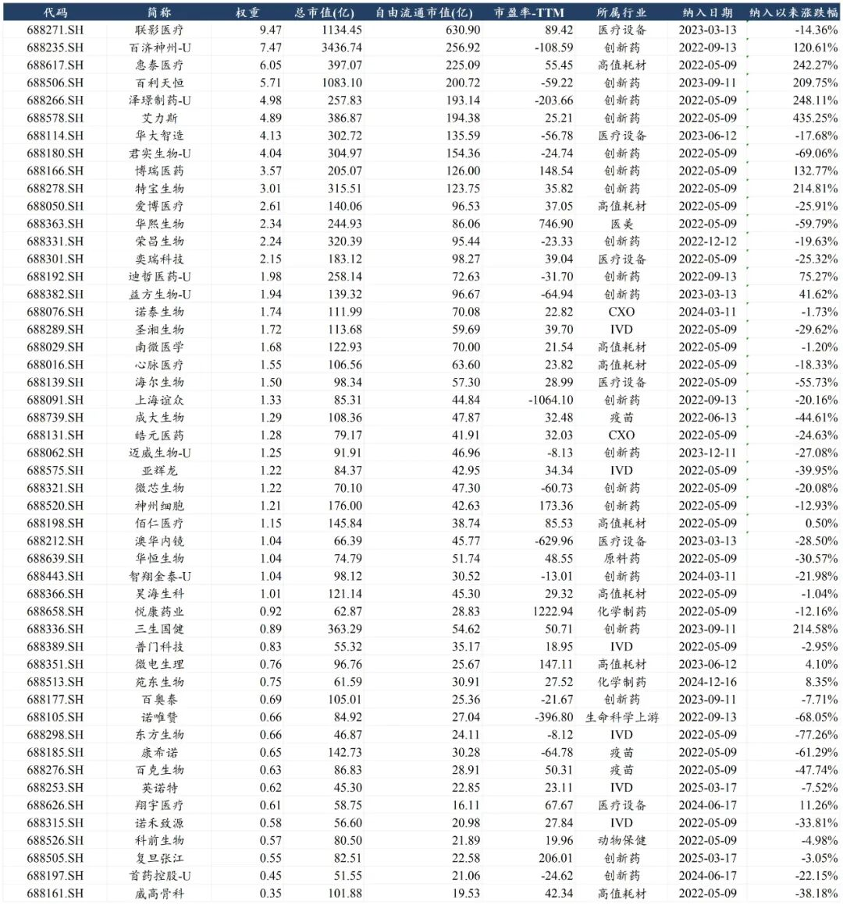
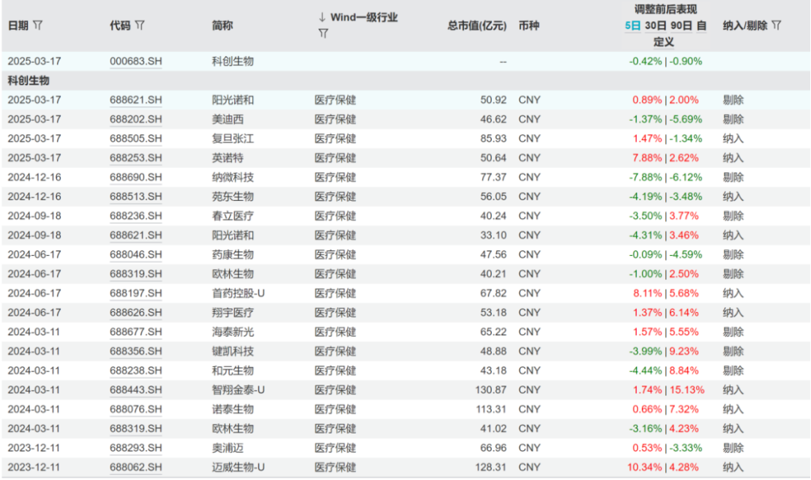
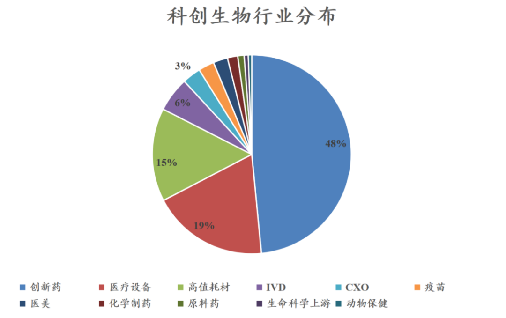
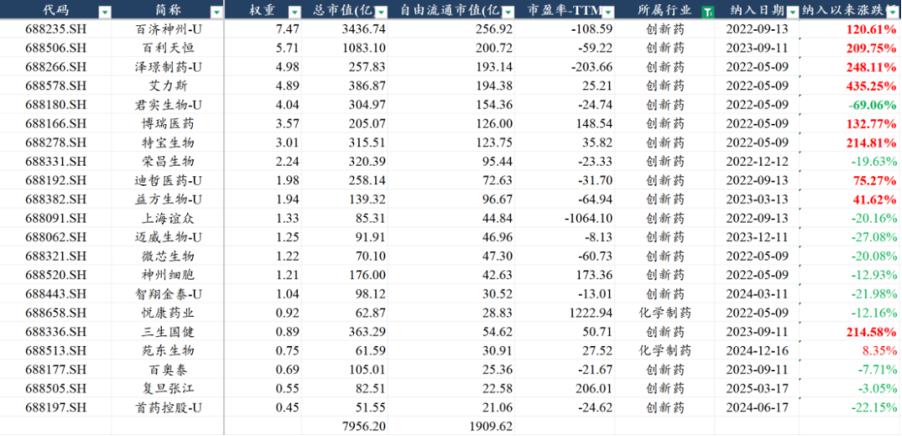
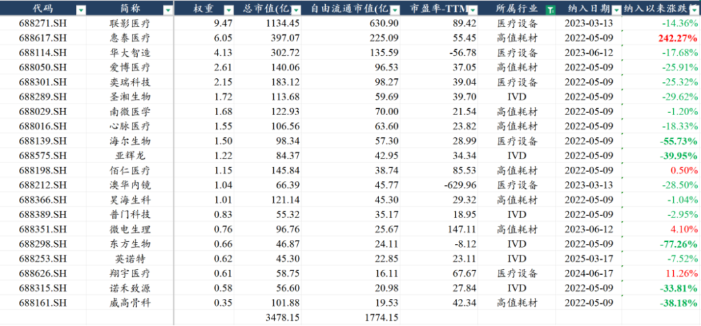
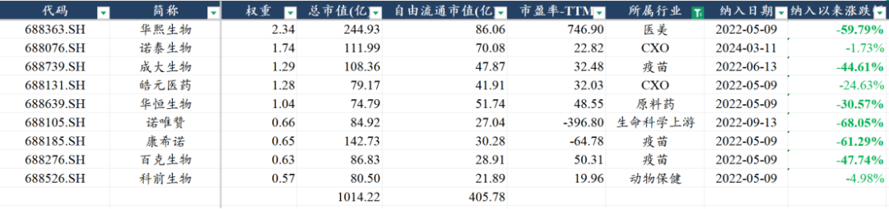

# A股创新药高质量投资标的

大家好，我是龙哥。

前两天有读者问到有没有科创板创新药的ETF，刚好昨天就有一个科创医药ETF基金（588130）上市，就借这个机会给大家聊聊这个ETF的情况，作为大家投资科创板医药股的一个备选。

首先科创医药ETF跟踪的指数是000683上证科创板生物医药指数，这个指数嘛顾名思义，就是科创板头部的生物医药行业公司构建的指数，指数自成立以来的表现如下图所示：

我们从这个指数成立至今的表现来看，实际上在整个科创板来说都非常有代表性，这个类似的走势也曾经在创业板成立的前几年有所复制，首先就是从19年科创板成立开始，板块热度一直比较高，记得龙哥当时所在的公司每周都会开会把科创板新交招股书的新股讨论梳理一遍，而当时科创板最炙手可热的板块之一就是生物医药。

当时根据复盘创业板成立的那几年的走势，大家对科创板也有一个基本的判断，就是这种新成立的交易板块（2019年的科创板、2010年的创业板）在起始的那1年会有比较高的估值溢价，那么随着1年期的IPO前股本的限售股解禁和减持，估值会逐渐的下降，随着上市满3年的大股东/实控人的IPO前股本的限售股解禁和减持，估值会逐渐与其他市场的可比公司的估值趋于持平。

如果对比以上科创生物指数和创业板指数的表现，是不是就比较接近了，科创生物成立之初的上涨幅度和持续时间都要明显更长，因此下跌的时间和空间都要更长，创业板指数在2011-2012年这两年指数跌了50%，科创生物在2021年7月到2024年9月这3年零2个月的时间最大跌幅达到了67%。

所以站在现在这个时间点看，我们不敢说科创板、或者科创生物是不是2013年的创业板，至少我们认为科创生物是汇集了近5-6年的A股的最优质的一批生物医药行业公司，又经历了漫长的下跌和消化估值，里面必然还是会有一批公司有看点的。

同时如果我们对比几个重点医药指数的表现，今年表现最好的恒生医疗涨了30%，其次就是科创生物涨了17%，然后是申万医药涨了4%，科创生物的表现也是跑赢所有A股医药细分领域的。

一个指数或者一个基金是否值得投资，一方面是对行业的深度研究和理解，这个龙哥在今年的文章里已经聊了挺多，同样重要的还是得具体看他的持仓情况，这点不管是主动管理基金还是被动管理基金都是如此。下面就是科创生物指数的完整持仓，合计是50家公司：

这个持仓会有动态调整，但是一般每期调整的个股数量就是1-2个，不会有非常大幅度的波动，通常是因为股价的剧烈波动或者新股的上市从而调出或纳入指数。

这50家公司如果做个行业分类的话，包括19家创新药公司、8家高值耗材公司、6家IVD公司、6家医疗设备公司、3家疫苗公司、2家CXO公司、2家化学制药公司，以及生命科学上游、医美、原料药、动物保健等领域各1家。

从指数权重来看，创新药占比48%是绝对的第一大板块，因此呢，虽然没有绝对纯粹的科创板创新药基金，但是科创生物里的创新药+化学制药+CXO也达到了53%的权重，叠加器械领域的部分优质公司。

就具体细分行业和公司，我们主要聊聊创新药和创新器械。

1）创新药

创新药这边，21家公司合计是50%的指数权重，合计市值7956亿元，合计流通市值1910亿元，由于创新药存在很多AH同时上市的情况，甚至有多家是先在港股上市、后在A股上市的情况（百济、君实、荣昌等），这些公司的A股流通盘就相对少一些。可以看到创新药头部公司在纳入指数后大多是出现了较大幅度的上涨，也是这一轮行业基本面和行业指数企稳向上的主要驱动力。

创新药里的第一大权重是大家比较熟悉的百济神州、权重7.47%，但是大家可以发现百济神州的总市值虽然要远高于联影医疗、但是权重却不如联影医疗，主要就是因为百济神州的大部分流通盘都在美股和H股，A股的流通市值只有257亿，占总股本的比例不到10%，因此大家可以看到百济神州的AH溢价目前处于比较高的水平，也主要是A股的流通盘小、但是流动性过剩。

后面几家也是大家比较熟悉的公司：

百利天恒：在前几天三生制药的12.5亿美元首付款的BD授权之前百利天恒的8亿美元首付款授权的EGFR\*cMET双抗ADC是中国创新药出海授权最高的首付款金额。

泽璟制药：虽然早期第一批研发的多纳非尼、吉卡昔替尼等的研发和商业化持续miss，第二批开发了DLL3/DLL3/CD3三抗、PD-1/TIGIT双抗、及后续多个双抗/三抗分子。

艾力斯：国产第二家、国内第三家第三代EGFR TKI，商业化持续超预期使得其成为国内biotech中盈利能力最为突出的一家，24年实现35.6亿收入+76%、归母净利润14.3亿。

君实生物：国内第一代的biopharma，历经PD-1的商业化连续失利，24年开始依靠4个国内领先的大适应症恢复高增长，跟随康方开发的下一代IO双抗PD-1/VEGF已经进入II期临床。

博瑞医药：GLP-1/GIPR国内研发进度仅次于恒瑞医药的国产第二家、国内第三家，礼来的替尔泊肽放量速度已经威震全球，国内市场群雄环伺，博瑞在其中占据领先身位。

特宝生物：长效干扰素功能性治愈乙肝商业化持续超预期。

荣昌生物：泰它西普老树开新芽，SLE之后的gMG、IgA肾病等多个自免大适应症持续突破，临床和商业化现转机，股价涨上来之后趁机配股也减小了资金压力。

迪哲医药：阿斯利康的班底（甚至其作为独立公司但目前仍与AZ在同一栋楼里）开发了ERBB Exon20ins和JAK1两款全球FIC/BIC药物（所在适应症）在国内获批商业化、同时在进行全球多中心临床，后续开发BTK/LYN双靶点抑制剂、第四代EGFR抑制剂等。

益方生物：前期开发了三代EGFR、KRAS G12C、口服SERD、URAT1等几款fast follow的me too新药，但去年底以来依靠一款潜在BIC的TYK2抑制剂的银屑病II期临床数据惊艳全场。

后面的公司就不一一罗列了，能在科创板创新药行业低迷的几年里慢慢走出来的公司起码都还是有两把刷子的。虽然我们一直说A股的创新药公司总体的质地上不如港股，但不代表科创板没有好的创新药公司，就是科创板的估值虽然经过几年的消化、但港股也同样经过几年的杀估值，因此直到今年港股创新药的涨幅和估值抬升显著强于A股，我们才愿意再回来和大家聊聊科创板创新药的情况。

2）医疗器械

20家科创板医疗器械龙头公司合计市值3478亿元，合计流通市值1774亿元，与创新药相对的，医疗器械这边自纳入指数后普遍是下跌的，且有部分公司跌幅巨大，唯一的亮点是惠泰医疗，在这几年的高值耗材集采下惠泰医疗把握机会实现逆势持续高增长、利润率持续提升，并且还被中国医疗器械之王迈瑞医疗看上并收购大股东股权实现控股。

当然医疗器械板块表现的如此之差，我认为并非是科创板医疗器械质地的问题，实际上科创板的医疗器械公司的质地相比港股并不差，甚至在医疗设备、IVD这两大器械子行业、以及高值耗材里的电生理、眼科、内镜耗材等高成长的赛道龙头公司都在科创板上市，因此科创板的器械公司的确是出细分领域冠军的方向。

那大家可以就会质疑了，龙哥你说科创板器械公司质地普遍不错，怎么这几年还跌的爹妈不认呢？这个和公司个股α就没太大关系了，主要还是行业β所致，器械板块我们很多次提到，与创新药有两大差别：

①出海方面创新药一个BD授权就可以兑现逻辑，医疗器械的出海则是漫长且艰难的，这里也体现了医疗器械实际上具有很强的进入壁垒和强者恒强的特点，国内小公司想要去突破国际市场的难度要远高于创新具有较大偶然性的创新药。

②国内市场方面，仿制药虽然进行了一系列集采，但创新药的国家医保谈判已经使得国内创新药具备了相对完善的定价机制，成熟、稳定的定价机制对于投资预期是至关重要的，而医疗器械板块目前尚未形成。

但是医疗器械板块实际上也是支持我国产业升级和新质生产力发展的方向，从全球市场来看都是高精尖、高价值量的赛道，也是提高医疗质量的重要方向，因此我们认为监管层面不会完全放弃掉这个大方向，高值耗材自2020年以来历经5年的集采冲击，大部分细分赛道的集采影响已经基本落地，部分赛道例如我们周一写到的骨科《[骨科行业新征程](https://mp.weixin.qq.com/s?__biz=MzkyMzQ3MDc3Mw==&mid=2247484565&idx=1&sn=8844a485f7ad04d8f4cb73f7e8253ce5&scene=21#wechat_redirect)》已经开始出现部分纠偏，我们认为距离高值耗材行业的政策面拐点应该已经不远，当创新器械也开始形成类似创新药那样的成熟定价机制的时候，就是行业预期反转和企稳的时候。

3）其他细分行业

创新药和创新器械以外的细分行业，公司少、市值小、表现差，没有太多好讲的，不过权重占比也只有10%，对总体指数和ETF的影响都不大。

其中值得注意的是，CXO板块的两家公司，诺泰生物和皓元医药，分别是非肿瘤和肿瘤领域最火热的两个赛道的CDMO公司，也既GLP-1为主的多肽药CDMO领域和ADC CDMO领域，在对应赛道的景气度下实际上也是CXO行业比较早实现股价企稳的公司。

总体来说，在A股的生物医药领域可投资标的的质量过于参差不齐，至少我们看科创板生物医药指数、指数成分股以及指数对应的科创医药ETF基金（588130）都还是值得大家长期关注的。

......

不知不觉到5月底了，这个月AH医药指数全月涨幅都在5%左右，个股表现也是百花齐放，中间曾有一些美国药品政策波动的因素，龙哥也给大家撰文分析过了。这个月给大家聊了创新药行业年报、一季报情况，行业增长气势如虹，也给大家陆续分享了一些当前几乎无人问津的血制品、器械赛道。月底开一次赞赏，望大伙多多支持，各位的支持是龙哥持续分享的动力~

风险提示：本文仅讨论行业/公司经营情况，投资需综合考虑公司经营、估值、管理层等多方面因素，建议读者审慎参考，本文不作为投资依据，不建议大家根据本文做出投资计划。

<!-- wxmp-comments-begin -->

---

## 留言（12 条，含回复共 24 条）

- **甘文武** 👍6 · 2025-05-29 12:23
  龙哥可以帮忙梳理一下有潜在大额BD预期的创新药管线嘛[呲牙]
  - ↳ **作者** · 2025-05-29 12:28
    可以
- **JMTerry** 👍5 · 2025-05-29 12:15
  这个指数很可以，舒服[社会社会]
- **和** 👍5 · 2025-05-29 12:25
  常山药业怎么样？是不是小作文满天飞
  - ↳ **作者** · 2025-05-29 12:28
    资金驱动吧，这个我确实没法做合理判断他这个表现
- **亦复如是** 👍3 · 2025-05-29 12:21
  龙哥，恩华药业逻辑顺吗？长期持有预期不高可以吗？比如年华6-8%
  - ↳ **作者** · 2025-05-29 12:27
    行业方面，麻醉虽然也有增加个别竞争者，总体的竞争格局还是要好于大多数的医药细分领域。销售方面，恩华这两年还是一个新品放量的阶段。研发这边，短期没啥大的爆款，所以这波创新药行情没咋在恩华反映，中枢神经和麻醉这块新药开发难度是大一些，但恩华这几年研发投入强度还是可以的，至少支撑公司稳健增长还是难度不大的。
- **天涯过客** 👍3 · 2025-05-29 13:09
  龙大伟思医疗有跟踪过吗？
  - ↳ **作者** · 2025-05-29 13:12
    有跟踪，前阵子还去南京调研过，总体伟思医疗和麦澜德今年基本面都是有好转的，不过短期市场炒作的也不只是业绩基本面的因素，有一些主题，这个就看市场演绎了。
- **尹** 👍2 · 2025-05-29 12:00
  康龙化成和泰格生物看来。
  - ↳ **作者** · 2025-05-29 12:01
    CXO我今年一直是认为，药明合联＞药明康德＞凯莱英＞药明生物＞康龙化成＞其他。不过这个唯一的问题是没注意到H股的凯莱英之前那么那么便宜......
- **迷雾** 👍2 · 2025-05-29 12:00
  龙哥，想问一下你对药名生物的看法
  - ↳ **作者** · 2025-05-29 12:02
    我在年初的文章里，有分析整个药明系三家的情况，其实你分拆药明生物去看的话，他主要的增量来自ADC和双抗，那ADC现在已经给你独立分拆出来药明合联了，那理论上你就去买他旗下最好的资产就是了。
- **摘编8866** 👍2 · 2025-05-29 12:25
  龙哥，迈瑞被套10个点，迈瑞还有戏不，啥时候能解套[流泪]
  - ↳ **作者** · 2025-05-29 12:30
    迈瑞就是我5月初写了篇文章，公司自己判断Q3基本面见底，所以股价也提前企稳了，不过业绩和订单都还是要持续跟踪的，拐点不是说就那一刻突然就拐点了。
- **昱辰** 👍2 · 2025-05-29 12:31
  龙头，贝达药业与博锐生物达成&quot;曲帕双珠&quot;全面合作。这个空间有多大？
  - ↳ **作者** · 2025-05-29 12:34
    曲妥珠竞争者蛮多了，后面也就是集采，贝达现在进场也没啥空间。帕妥珠竞争格局稍微好一点。曲妥珠+帕妥珠，和贝达的CDK4/6可以稍微形成点协同，其他也没啥了。贝达核心还是要在产品研发上做突破，搞这种biosimilar的国内权益毕竟是小打小闹。
- **tmac** 👍2 · 2025-05-29 12:32
  问下港股的爱康和春力因为各种因素给不了太高的估值啊，比如a股给到30到40，而港股就只能在20到30。
  - ↳ **作者** · 2025-05-29 12:35
    那倒也不是这么绝对，现在耗材整个的关注度都还很低，AH溢价客观存在，在关注度低的时候港股的流动性折价对估值的影响会更突出。
- **賢琳無雙** 👍2 · 2025-05-29 13:05
  科创板艾迪药业怎么没有？业绩反转啦。
  - ↳ **作者** · 2025-05-29 13:06
    艾迪是科创板标的，只是还没有纳入这个指数成分股哈
  - ↳ **作者** · 2025-05-29 13:12
    HIV新药国内本来就做得公司很少，艾迪是目前唯一一个国产复方制剂新药，也还好啊，不过就是要跟数据看他销售情况
- **Bryan** 👍1 · 2025-05-29 12:55
  Intil盘子这么小，好像资金在做三生映射的再次卖身预期…当时复习完买个点BioNtech，结果今年行业beta好，涨的多的都是弹性标定…
  - ↳ **作者** · 2025-05-29 12:59
    这个要看你怎么看待这个事，如果是看未来PD-1/L1*VEGF双抗的商业化价值和成就2-3家biopharma和MNC，那应该就是Summit和BioNTech，BioNTech主要是现金占比太高，所以呈现估值下有底、向上弹性也受限。Instil bio的话，你看去年9月康方WCLC上读出数据的时候也是他弹性最大涨了几倍。

<!-- wxmp-comments-end -->
