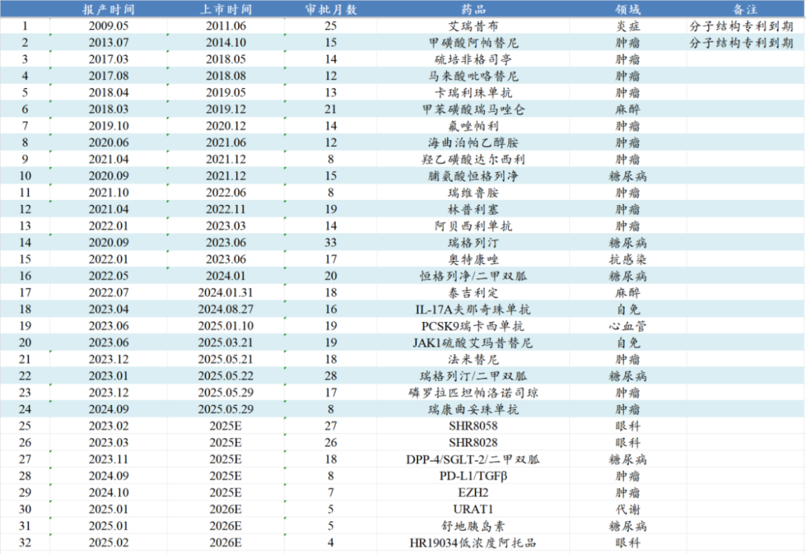
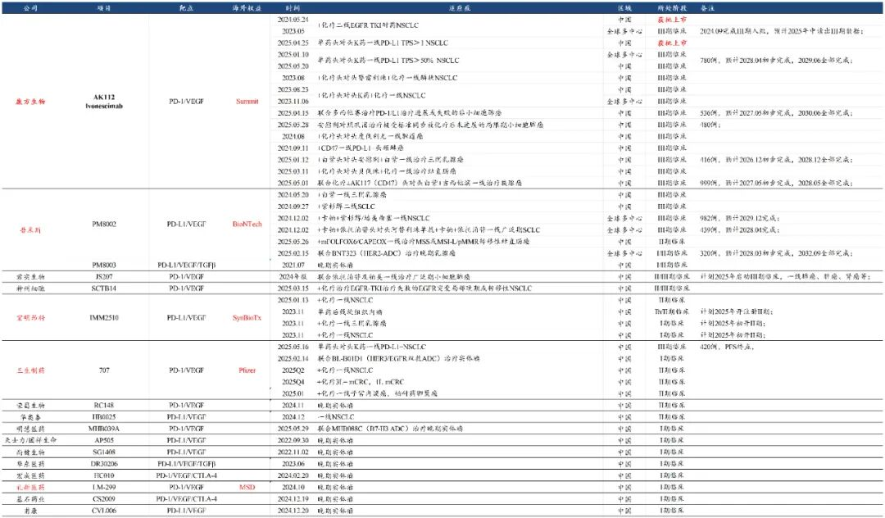

# 创新药破历史记录的一天

大家好，我是龙哥。

2025年5月29日，又是中国创新药行业创造历史纪录的一天，合计有8家中国创新药公司申报的11款创新药（9款国内自主研发创新药）在国内实现首次获批上市：

恒瑞医药：瑞康曲妥珠单抗（HER2-ADC）、磷罗拉匹坦帕洛诺司琼复方制剂（NK-1ARA/5-HT3RA）、苹果酸法米替尼（VEGFR）。

复星医药：枸橼酸伏维西利（CDK4/6）、芦沃美替尼（MEK1/2）。

泽璟制药：盐酸吉卡昔替尼（JAK1/2/3）。

海创药业：德恩扎鲁胺软胶囊（AR-氘代恩杂鲁胺）。

迈威生物：阿格司亭α（HSA-G-CSF）。

特宝生物：怡培生长激素（PEG-rhGH）。

嘉和生物：来罗西利（CDK4/6，自G1 Therapeutics引进）。

百济神州：泽尼达妥单抗（HER2双抗，自Zymeworks引进）。

对于国产创新药的密集上市，我们认为，既要对行业的蓬勃发展给予充分的肯定，也要认识到行业依然客观存在的问题。

1）行业蓬勃发展

2025年1-5月，恒瑞医药累计有3款新药首次申报上市，有6款新药首次获批上市。2018-2024年恒瑞医药每年分别有2、2、1、3、2、3、3款新药首次获批上市，2025年尚未过半，恒瑞医药已经完成6款新药的首次获批，预计2025年内恒瑞医药还会有3-5款新药获批上市，2025年也将成为恒瑞医药创新药“超级收获年”，拿下9-11款新药首次获批。其中HER2-ADC瑞康曲妥珠单抗仅用了8个月就获批上市，效率非常高；恒瑞历史上曾有AR抑制剂和CD4/6等两款药物同样以8个月的审批时间获批上市。今年我们已经在《[恒瑞医药火力全开](https://mp.weixin.qq.com/s?__biz=MzkyMzQ3MDc3Mw==&mid=2247484343&idx=1&sn=8a9443fca3fd94f88388790956537836&scene=21#wechat_redirect)》和《[巨头黄昏还是黎明前的黑暗](https://mp.weixin.qq.com/s?__biz=MzkyMzQ3MDc3Mw==&mid=2247484184&idx=1&sn=55ec711da3240320949b76ae746cc139&scene=21#wechat_redirect)》中和大家聊到恒瑞医药，这里不再用太多篇幅去赘述。

2025年1-5月，复星医药累计有3款新药获批上市、1款新药提交上市注册申请。最近5年的复星医药基本上可以说是“两条腿走路”，其中一条粗壮的大腿是复宏汉霖，先期靠生物类似药在一众biopharma中率先实现盈利，去年以来又在创新药开发中逐渐展现实力；复星医药的另一条腿就是BD引进产品，曾依靠BD引进的mRNA疫苗和新冠药阿兹夫定赚的盆满钵满，但随后高业绩基数之下的下滑压力巨大。直到2025年，复星医药的CDK4/6、MEK1/2获批上市，ALK/ROS1抑制剂提交NDA申请，在复宏汉霖和外部BD以外，复星医药的“第三条腿”终于也开始进入收获期。

泽璟制药的吉卡昔替尼的获批也是充满波折，公司最早在2022年6月达到III期临床终点，在2022年10月就提交了上市申请，最终在2025年5月29日才获批上市，审批了31.5个月，这个审批时长在当前的创新药审批环境下还是比较少见的，在此期间中国生物制药的JAK抑制剂治疗MF适应症在24年7月也递交了NDA，预计获批时间也将临近，泽璟的领先优势弱了很多。

海创药业的德恩扎鲁胺同样是经历了波折，公司最早在2022年2月底就达到了注册临床的终点，但是一直到2023年3月才终于递交上市申请，但在随后因CDMO公司的原料药问题而撤回申请，在2023年11月重新申报，直到又过了18个月才堪堪获批上市，从注册临床达到终点到获批也历经了整整39个月，也算是历尽艰辛，终于是苦尽甘来。值得注意的是虽然恒瑞医药的AR抑制剂早在2022年6月就已经获批上市，但恒瑞医药获批的是mHSPC适应症而非本次海创药业获批的mCRPC，因此海创药业可以与肿瘤药巨头恒瑞做差异化竞争。

百济神州自海外license in的泽尼达妥单抗是海外和国内首款获批上市的HER2双抗，获批的首个适应症是二线HER2阳性胆管癌，后续还在开发一线HER2阳性胆管癌、一线HER2阳性胃癌、一线HER2阳性乳腺癌等前线适应症。

2）行业竞争烈度较高

除了以上内容以外，本次获批的一系列新药，还让龙哥想给大家泼盆冷水，那就是在看到创新药行业爆发式增长的同时，也要意识到行业竞争格局的恶化和高强度的竞争依然是客观存在的。

例如这次单日获批的11款药物中，就包含2款CDK4/6抑制剂，国内市场已经有辉瑞的哌柏西利（专利到期）、礼来的阿贝西利、诺华的瑞波西利等3款进口CDK4/6抑制剂以及恒瑞医药的达尔西利、轩竹生物的吡洛西利、先声药业的曲拉西利（骨髓保护）等3款国内药企申报的CDK4/6获批上市，本次再新增2家公司的CDK4/6获批上市，后续还有中国生物制药和贝达药业的CDK4/6处于申报上市阶段，预计也都将在未来1-2个月内获批上市，这样国内CDK4/6在今年就将成为3进口+7国产合计10家竞品的竞争格局，已经比很多仿制药的竞争格局更差，另外与CDK4/6共同分享乳腺癌潜在市场的还有HER2-ADC、AKT抑制剂、PI3Kα抑制剂等新兴靶点领域。

再比如这次迈威生物获批的阿格司亭α是一款长效升白药物，长效升白药物从最早的石药集团、齐鲁制药、恒瑞医药这肿瘤药pharma三巨头，到后续第四家山东新时代，23年5月第五家亿帆医药/中国生物制药，23年6月特宝生物/复星医药，然后是23年9月双鹭药业，再到本次的迈威生物/扬子江药业，这个领域凑齐了石药、齐鲁、恒瑞、中生、复星、扬子江6大中国制药巨头神仙打架，人手一个的结果可能就是最终每家都赚不到钱，白白面临医保降价和集采压力。

和短期市场热点更贴近一点就是现在市场热度极高的PD-1/L1\*VEGF双抗，康方生物在前方一马当先的冲杀出一条血路，一众后来者快速跟进。

全球创新药开发面临同样的问题，低垂果子已经被摘完、大家一旦看到某些大的疾病领域出现机会就蜂拥而至，包括PD-1/VEGF双抗、包括ADC药物、包括GLP-1单靶/双靶/三靶点药物等。

总体来说，我们既要积极乐观的看到创新药行业的蓬勃发展和出海的巨大市场潜力，也要客观认识到行业存在的竞争压力，行业未来的发展也不会一帆风顺，在曲折中前行，各位都是中国创新药从弱小到强大、从跟随到引领的见证者。

......

最后，还是非常感谢昨天文章中赞赏的几十位读者，龙哥现在每个月底开一次赞赏，虽然这点钱对龙哥来说是无关痛痒，但大伙知道现在公众号也没什么创收方式，龙哥的文章纯属自我驱动给大家分享，大伙的一点赞赏是让龙哥看到各位读者对文章内容的认可而能持续分享的动力。

也是为了感谢大伙，对于所有赞赏过的读者（不论金额），如果有部分行业数据的需求（医保和医疗行业基础数据、创新药上市公司创新药收入汇总、中国创新药出海BD授权梳理、全球及国内生物医药融资月度数据，部分龙头公司研发管线梳理及季度业绩跟踪等），龙哥都可以免费分享给大伙，大伙可以随时在公众号主页留言，留下你的邮箱、需要的资料，龙哥会在端午节后给大伙一一发送。

过去也给大家分享过几次，所有龙哥看到的都发送并回复确认了，有些因为公众号会屏蔽消息而看不到，所以如果龙哥没给你回复“已发送”，记得再重新留言。

另外，更新过的历史文章合集也放在了第二条，感兴趣的读者可以在端午节多多温习~

祝大家端午节快乐~

风险提示：本文仅讨论行业/公司经营情况，投资需综合考虑公司经营、估值、管理层等多方面因素，建议读者审慎参考，本文不作为投资依据，不建议大家根据本文做出投资计划。

<!-- wxmp-comments-begin -->

---

## 留言（6 条，含回复共 12 条）

- **和** 👍5 · 2025-05-30 08:06
  甘李药业今年业绩怎么样？是胰岛素龙头吗
  - ↳ **作者** · 2025-05-30 08:20
    胰岛素集采续约提价基本陆续反映在业绩里了，后面的业绩弹性应该要看海外的情况了。
- **JMTerry** 👍4 · 2025-05-30 08:36
  端午安康[玫瑰]
  - ↳ **作者** · 2025-05-30 08:42
    [太阳][太阳][太阳]
- **Vincent 韩👀🐲** 👍4 · 2025-05-30 09:09
  龙哥，觉得今年的创新药是年度级别的大爆发吗？慢慢让中国的创新药企业走向世界，有成为世界级公司的机会和估值认可？
  - ↳ **作者** · 2025-05-30 13:53
    实际上行业的爆发从2023年就开始了，只不过股价的反映直到24年下半年才开始，到现在都已经是在股价上开始趋于狂热了。中国创新药和创新药企业走向世界也已经在进行中了。
- **建国** 👍3 · 2025-05-30 08:13
  医药基金这几天大涨，葛大妈的医疗创新，回来点血，割肉了。怕来回坐电梯
  - ↳ **作者** · 2025-05-30 08:21
    专业做fof的投资人有个原则，基本不会碰规模超过300亿的主动管理基金，多数情况下超过100亿的就不会投了。对主动管理人来说规模是业绩的敌人。
- **天野源** 👍3 · 2025-05-30 08:51
  龙哥最近创新药是情绪高点了。。后面您觉得创新药还会是这次牛市的大主线吗，一直到牛市三阶段冲顶？
  - ↳ **作者** · 2025-05-30 13:54
    大概率是，从基本面上和逻辑上医药没有其他赛道可以匹敌的，哪怕我们说器械的逻辑有改善，在出海上也没法和创新药pk的。
- **Luca** 👍1 · 2025-05-30 08:05
  泉哥被查有影响吗，对创新药
  - ↳ **作者** · 2025-05-30 08:18
    情绪面可能有点影响，实质性影响不大吧，毕竟已经退了这么多年了，行业现在的发展逻辑包括出海和国内政策支持也不会因为这种事件而改变

<!-- wxmp-comments-end -->
