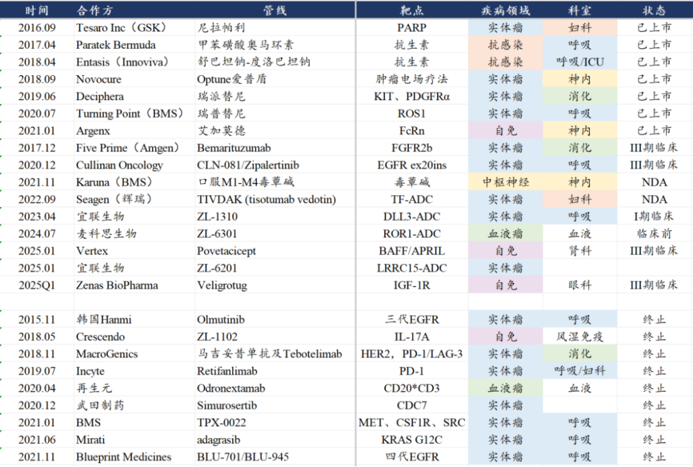
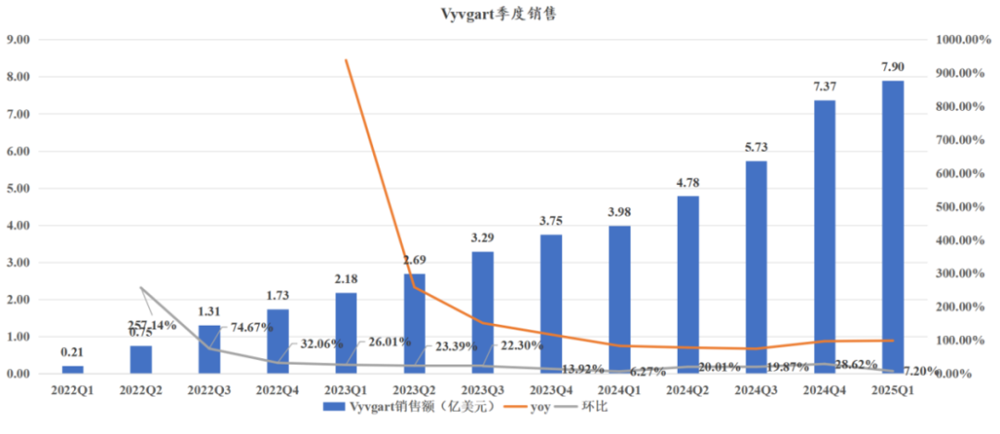
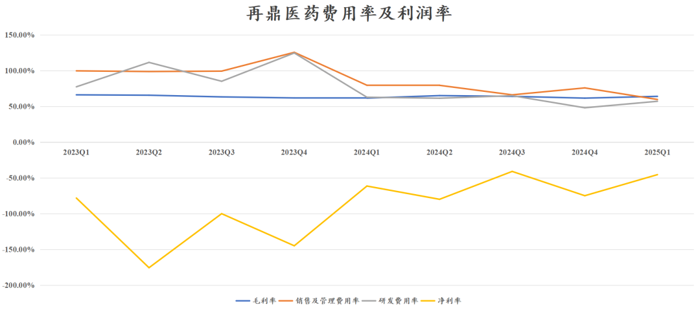
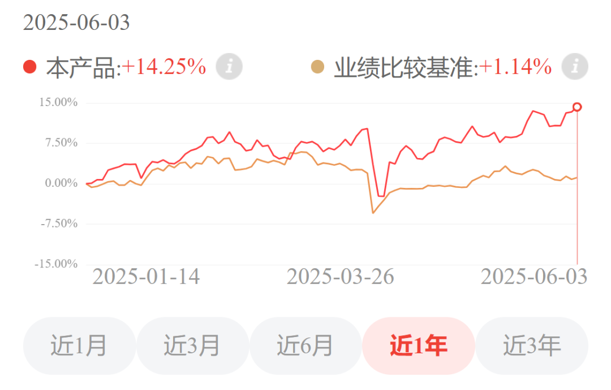
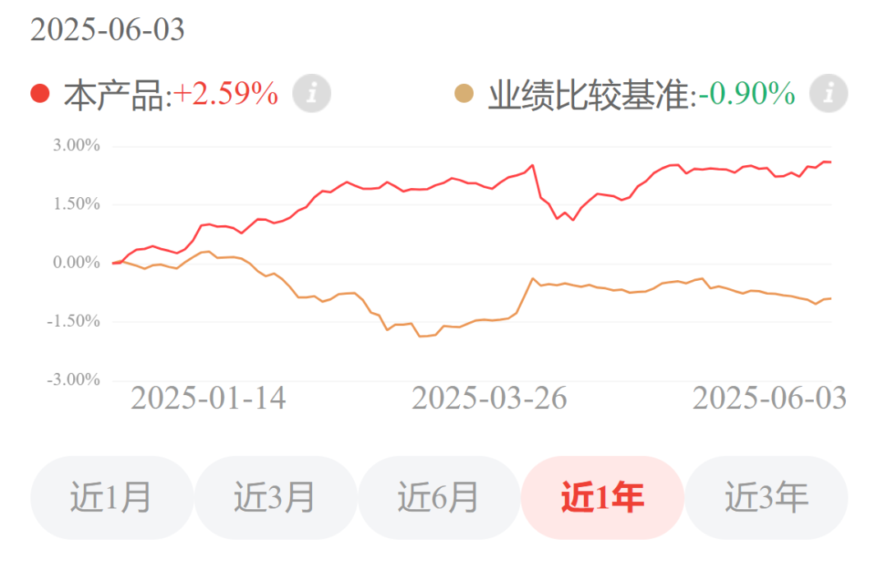

# 创新药战略眼光之最

大家好，我是龙哥。

和大家聊创新药这么多年，有一家公司在创新药品种选择上的战略眼光，是龙哥比较佩服的，虽然license in的商业模式这么多年饱受争议，但一方面是国内政策面有明显改善、商业化品种密集兑现期、销售收入进入快速增长期，另一方面是其自研也开始展现亮点，因此这里我们还是来聊聊这个BD引进之王——再鼎医药。

再鼎医药自2015年以来引进了一系列肿瘤、自免、中枢神经和抗感染领域的新药：

其中已经成功上市的有7款药物，还有6款药物处于NDA或者III期临床阶段，ADC领域借助宜联生物等公司的技术平台开发的自研ADC管线也陆续进入临床阶段或者披露早期临床谁；即便是有部分因为种种原因而砍掉的研发管线，其中也有几个从全球市场来看都是相对领先和优秀的品种，只是在国内市场与海外市场的竞争环境差异导致被剁掉。

具体来看：

①尼拉帕利（则乐）：这是一款Parp抑制剂，在国内上市时间较早且市场份额领先，优势是覆盖一线卵巢癌且不需要基因检测，2024年尼拉帕利在国内销售额约为1.87亿美元且仍在增长，相较早先市场预期的20亿元的销售峰值已经相差无几。

②肿瘤电场治疗（爱普盾）：爱普盾的海外研发历经波折，最终还是成功获得FDA批准了联合PD-1/L1或多西他赛治疗铂化疗耐药的脑转移NSCLC；在最新的2025年ASCO上再鼎的海外合作方Novocure还公布了治疗肿瘤电场治疗（TTFields）的胰腺癌III期临床数据，中位总生存期mOS为16.2个月VS化疗组14.16个月，HR值为0.82，p=0.039，中位无痛生存期为15.2个月VS化疗组9.1个月，HR值0.74，p=0.027，而我们知道肿瘤治疗过程中重要的不仅仅是延长生存期，还有是在生存期内让患者有尽量好的生存质量。

后续再鼎应该也很快会在国内申报一线胰腺癌的适应症。爱普盾24年国内销售0.4亿美元同比下降13%，主要是胶质母细胞瘤这个小适应症贡献，公司削减了在该品种上的销售资源投入，后续肺癌、胰腺癌等大适应症有望支撑爱普盾重回增长。

③艾加莫德（卫伟迦）：全球首款FcRn单抗，上市仅3年，全球市场销售已经达到单季度接近8亿美元，24年全年21.86亿美元，同比增长83.6%，遥指下一个50亿美元的重磅炸弹品种。

艾加莫德目前在国内已经获批的是全身型重症肌无力（gMG）和慢性炎性脱髓鞘性多发性神经根神经病（CIDP），这两个适应症都已经获批了皮下注射制剂，后续还有甲状腺眼病、干燥症等适应症在III期临床。

2024年艾加莫德国内销售0.94亿美元同比增长835%，公司对该品种的国内销售峰值预期是10亿美元，我们认为就目前的适应症和竞争格局来说达到10亿美元销售峰值的难度还是比较大的，大概率还是会有些折扣，具体还要看其后续销售情况及适应症拓展情况。

④奥马环素（纽再乐）、舒巴坦钠-度洛巴坦钠（鼎优乐）：这是再鼎引进的两款抗生素品种。奥马环素是一款广谱抗生素，用于社区获得性肺炎，也是比较大的适应症，24年国内销售0.43亿美元同比增长99.48%，我们认为该品种做到10亿元以上的峰值应该问题不大。

鼎优乐是一款用于碳青霉烯耐药不动杆菌感染的超级抗生素，目前临床使用的多粘菌素之下仍有30%-40%的死亡率，可以说是一款救命的抗生素，这款药物目前是让感染科能力超强的辉瑞做国内的商业化。

⑤瑞普替尼（奥凯乐）：24年5月获批的一款ROS1/TRK抑制剂，目前已经获批治疗ROS1阳性的NSCLC，且今年4月申报了NTRK阳性实体瘤的上市申请，根据此前BMS发布的注册临床数据，一线治疗ROS1阳性NSCLC的mPFS达到了35.7个月，为可比药物中最长的水平，以此推算总生存期可能达到6-7年以上。由于潜在的用药时长长达3年，因此即便是ROS1、NTRK突变的肺癌患者占比比较低，预计仍然可以实现一定规模的销售，该品种在24年刚开始商业化，25年将会开始贡献一定体量的收入。

⑥呫诺美林-曲司氯铵（KarXT）：KarXT是一款口服M1/M4毒蕈碱激动剂，用于精神分裂症治疗，是目前唯一没有黑框警告的精分药物，在疗效和安全性上展现出卓越的表现，此前BMS以140亿美元收购了Karuna Therapeutics获得了该药物，再鼎医药在2021年11月引进了该药物的国内商业化权益。

国内精神分裂症患者超过800万人，大多患者没能接受治疗或者治疗对症状改善不足，新的治疗方法具有很强的临床需求和社会价值。公司对该品种的国内销售峰值预期也是10亿美元，同样的我们认为也要根据后续商业化的情况再做进一步的推测，精神类药物的推广难度不小，但精分的治疗中心总体比较集中，头部500家医院覆盖85%的市场（含各地精卫中心），公司规划今年几十人销售团队、未来200人销售团队，预计26年上半年可以获批上市。

⑦TIVDAK：全球首款TF-ADC用于二三线治疗复发或转移性宫颈癌，25年3月在国内申报上市，预计将于26年上半年获批上市。

⑧Bemarituzumab：全球首款FGFR2b单抗，30%的胃癌患者存在FGFR2b阳性突变，在II期临床中Bema+化疗一线治疗胃癌的OS达到30个月，相较PD-1+化疗一线胃癌的生存期接近翻倍，同时还在进行一项PD-1+Bema+化疗用于一线胃癌的III期临床，有望成为颠覆胃癌一线治疗的一款药物。

2023年全球胃癌新发患者人数接近100万人，其中中国新发胃癌患者人数接近37万人，占全球新发胃癌患者的比例达到37%，发病率仅次于肺癌、结直肠癌和肝癌，为国内第四大癌种、全球第五大癌种。

由于Bema突出的临床疗效，再鼎对该品种在国内的销售峰值预期也是10亿美元，Bema将在25年中读出首个一线胃癌的全球III期临床数据，有望在下半年递交上市申请，是再鼎医药的下一个潜在重磅品种。

⑨Povetaciept：一款潜在best in calss的治疗IgA肾病的BAFF/APRIL双靶点融合蛋白，6月2号Vera刚刚宣布了Atacicept（APRIL/BAFF）治疗IgA肾病的III期临床成功，根据其III期临床数据显示150mg剂量治疗36周后的尿蛋白肌酐比值（UPCR）下降46%，而再鼎医药引进的Pove在I/II期临床显示80mg剂量治疗48周可将UPCR下降66%，此前荣昌生物的泰它西普披露的II期临床24周数据显示降低49%的UPCR，也是不错的表现。

IgA肾病在国内发病人数达到百万人，是患者群体较为庞大的自免性疾病，近年陆续开始有新药在该领域获得突破，首先是云顶新耀引进的那款布地奈德肠溶胶囊，25年公司预计耐赋康国内销售额会达到10亿元，然后是诺华的阿曲生坦获得FDA批准用于治疗IgA肾病，再到BAFF/APRIL双靶融合蛋白，后续还有武田的CD38单抗也在进行IgA肾病的III期临床。

⑩ZL-1310：再鼎医药自研的一款DLL3-ADC，在ASCO也更新了I期临床数据，2L SCLC（n=33）ORR为67%，其中1.6mg/kg剂量组（n=16）客观缓解率ORR为79%、疾病控制率DCR为100%，为目前小细胞肺癌最好的ORR表现；脑转移患者ORR=68%（n=22）；未接受过放疗患者的ORR为86%（n=7）；另外也在DLL3双抗经治患者中观察到治疗缓解。

安全性方面，低剂量组（＜2mg/kg，n=50）三级及以上TRAE发生率6%，严重TRAEs发生率4%，未发生≥3级间质性肺炎，无不良事件导致停药，总体安全性表现非常好。后续临床规划是25年内以1.6mg/kg剂量与FDA沟通启动二线SCLC的全球注册性临床，且25年更新联合疗法一线治疗SCLC的临床数据。

23年全球肺癌发病人数255万人、是当之无愧的全球第一大癌种，中国新发肺癌109万人，占全球的42.7%，小细胞肺癌占肺癌患者的10%左右，也既全球小细胞肺癌发病人数在25万人左右、国内超过10万人，也算是个不太小的癌种。DLL3相较其他在小细胞肺癌有潜力的靶点如B7 H3的优势是这个靶点非常干净，在SCLC的表达比例达到85%-95%，而B7-H3只有65%；DLL3-ADC在二线治疗中展现优秀的临床表现，后续也有机会推到一线治疗。2016年艾伯维曾以58亿美元收购Stemcentrx管线中的DLL3-ADC，但最终以失败告终，时隔8年，DLL3-ADC再次站到大家眼前，早已经脱胎换骨。

在自研管线方面除了DLL3-ADC，再鼎医药还有多款肿瘤和自免领域的新分子进入临床或者即将进入临床阶段，包括ROR1-ADC、LRRC15-ADC、IL-31/IL-13双抗等。

License in的模式在再鼎医药一直是充满争议，核心的问题就是这种模式下到底能否实现盈利，毕竟目前的再鼎医药也只有63%左右的毛利率，扣除掉三费后的亏损还是不少，公司给了25年底实现盈亏平衡、26年全年实现扭亏的指引，目前看也是有挑战的目标。

但当前的再鼎医药，的确已经不是3年前的再鼎。

那时的再鼎医药依靠尼拉帕利、肿瘤电场治疗、瑞派替尼、奥马环素等看起来难有重磅市场潜力的商业化品种，并无扭亏的希望；而再鼎第二批的商业化品种，艾加莫德、KarXT、FGFR2b单抗三款药物都具有上到30亿以上销售峰值的市场潜力，公司更是对这三款药物都寄予了10亿美元销售峰值的期望；再往后展望再鼎第三批的商业化品种，自研的DLL3-ADC将开始发力，Pove、Veligrotug等继续承接公司收入的增长。

收入体量的快速提升，也将大幅摊薄公司的研发和销售费用，25年一季度公司销售及管理费用率59.53%同比下降接近20个点、环比下降超过15个点，预计未来几年销售及管理费用率会逐渐下降至40%以下；研发费用率也从23-24年的100%、59%进一步下降，当前单季度的研发费用趋于稳定，预计未来几年再鼎的研发费用率将会逐渐降至20%以下。毛利率方面，后续随着艾加莫德的CDMO生产换用大罐子，也将显著降低生产成本、使得其毛利率有所提升。

......

最后再给大家更新下龙哥定投的几个组合的情况，港股科技经过一段时间的回调也逐渐企稳，至于AH医药近期的表现不用多说大家也都能看到，因此，龙谈医药科技组合本周净值继续创历史新高：

龙谈美元债组合也已经创历史新高：

感兴趣的读者自行扫码了解：

风险提示：本文仅讨论行业/公司经营情况，投资需综合考虑公司经营、估值、管理层等多方面因素，建议读者审慎参考，本文不作为投资依据，不建议大家根据本文做出投资计划。

<!-- wxmp-comments-begin -->

---

## 留言（21 条，含回复共 45 条）

- **范征** 👍5 · 2025-06-04 15:50
  目前世界（可能）无法治愈的18大疾病，在A股快都给治愈了：第一,狂犬病第二,艾滋病第三，渐冻症（肌萎缩侧索硬化症）第四，晚期癌症第五，阿尔茨海默病（通化金马在研）第六，原发性肺动脉高压第七，1型糖尿病（冠昊生物/中原协和/安科生物在研）第八，类风湿关节炎（海南海药在研）第九，系统性红斑狼疮（荣昌生物/恒瑞医药在研）第十，帕金森病（热景生物在研）第十一，囊性纤维化（凯莱英在研）第十二，血友病（舒泰神）第十三，地中海贫血第十四，脊髓灰质炎后遗症第十五，特发性肺纤维化（恒瑞医药/泽璟制药在研）第十六，克罗恩病（华东医药在研）第十七，多发性硬化症（诺诚健华在研）第十八，埃博拉出血热（鲁抗医药在研）
  - ↳ **作者** · 2025-06-04 15:57
    你这不严谨啊，里面好多不对的[旺柴][旺柴]实际上这里面很多疾病的研发突破不仅是国内A股怎么样炒，是的确在全球都有明确进展的。
  - ↳ **作者** · 2025-06-04 15:59
    哈哈哈，段子嘛，咱看个乐子就好啦
- **熊熊** 👍4 · 2025-06-04 16:19
  请教龙哥，本轮创新药上涨有持续性不？
  - ↳ **作者** · 2025-06-04 16:23
    这问题不需要我回答了啊，就今年都一大批翻倍票甚至有几个涨三四倍的票，持续性已经是非常强了。
    核心还是我们过去两年一直讲的逻辑，国内政策面的企稳转向，股价涨之前大家都不信吧，但实际上只要认真看我给大家分享的数据，那政策转向是非常明确的啊，出海的逻辑，BD授权的爆发，从23年就开始了，到今年这个逻辑才爆发式的反映在股价中，同样早就在我们的数据里实实在在的告诉大家了。
    所以你说这波行情的扩散，必然是从理性分析到过热乃至狂热的过程，但行业基本面是切实改善的，拿着有基本面的优质公司也不会那么慌，再不济我过去两年为了提振大家的信心，也一直在讲ETF，普通散户买ETF才是赚钱的王道。
- **肥锋  家诚哥** 👍4 · 2025-06-04 19:14
  多谢龙哥一直按摩，港股最黑暗的时候，一直加仓创新药和互联网两只ETF
  - ↳ **作者** · 2025-06-04 19:30
    [强][强][强]
- **也无风雨也无晴** 👍3 · 2025-06-04 16:04
  我知道，龙大有深度，我大幅减仓了，看看有没有波段做，现在创新药人满为患了，想想前两年门可罗雀。医药研究员都快转型了
  - ↳ **作者** · 2025-06-04 16:05
    也别快转型了，身边确实有不少朋友转行的，也就时隔几个月而已，确实让人唏嘘。
- **求索者** 👍3 · 2025-06-04 16:08
  确实眼光很好，艾加莫德、pove、1310；龙哥家庭地位直线上升
  - ↳ **作者** · 2025-06-04 16:17
    FGFR2b、FcRn、ROS1、KarXT、DLL3等等，选品的眼光确实让人佩服
    家庭地位已经见顶了，现在龙嫂比较牛逼
- **Vincent 韩👀🐲** 👍3 · 2025-06-04 17:20
  龙哥，CXO在这一波创新药热度中，会有更确定的业绩改善预期吗?并且可能延续的周期更长一些？
  - ↳ **作者** · 2025-06-04 18:43
    海外为主的CXO其实已经看到明确的业绩改善了，国内为主的CXO业绩改善会有滞后性，不是说创新药的股票一涨就能看到CXO业绩改善的，从资本市场火热到一二级市场融资增加到企业加大研发投入，到订单量价齐升，有个传导过程。
- **CasperTree** 👍2 · 2025-06-04 16:06
  我只知道常山药业也要封神了
  - ↳ **作者** · 2025-06-04 16:09
    当年说4e中国男人ED的时候已经封神
- **洪珂** 👍2 · 2025-06-04 16:15
  下次推云顶新耀
  - ↳ **作者** · 2025-06-04 16:19
    在今年创新药收入超10亿的公司里云顶应该是增速最快的那个，不过他这个业绩预期应该已经比较多的反映在股价里了，今年如果还要有大的股价弹性的话，要么是销售超预期兑现，要么是新的管线价值提升
- **王熙** 👍2 · 2025-06-04 16:47
  百济神州（H），在这轮创新药上涨时落后很严重，是因为估值太高了吗？还是因为前期高领减持影响了信心？或者是，在等待6月26日百济新研发管线的催化剂？
  - ↳ **作者** · 2025-06-04 16:49
    一方面是确实短期催化和边际变化都不如小公司，另一方面他在美国市场已经是有一定业绩基数了，而且泽布替尼销售预期打在股价里了，而美国药品降价压力客观存在。
- **伟仔** 👍2 · 2025-06-04 16:50
  龙哥您好，带状疱疹后神经痛怎样医啊。谢谢你
  - ↳ **作者** · 2025-06-04 16:56
    虽然我是分享医疗相关内容的，但具体到疾病治疗还是去医院开处方哈。带状疱疹后神经痛通常就是加巴喷丁，去年海思科获批了一个1类新药克利加巴林胶囊用于该适应症，可以去找医生了解下是否适合用药。
- **阿葱** 👍2 · 2025-06-04 16:53
  坚定持有159892&nbsp;两年了&nbsp;确实不容易
  - ↳ **作者** · 2025-06-04 16:54
    那也是关注挺久的读者了，不容易[抱拳][抱拳]
- **Novak王振** 👍2 · 2025-06-04 17:34
  龙哥，能帮忙分析下和黄医药嘛，这波创新药滞涨明显，除了李嘉诚的背景影响，还有希望迎来补涨嘛
  - ↳ **作者** · 2025-06-04 18:45
    和黄之前我们也讲到，主要是现有品种销售承压，新品种研发和BD预期延后，但好在估值够便宜、下有底，就是等待下一个研发方面的催化。
- **王玉萍** 👍2 · 2025-06-04 17:46
  麻烦龙大看下康缘药业，有没有启动的迹象呀，套麻了[擦汗]
  - ↳ **作者** · 2025-06-04 18:45
    其实你看看季度业绩就知道，很多中药的业绩从去年Q3Q4突然就崩了，不只是康缘。中药吃了几年政策红利，终归逃不过集采、反腐。
- **Bryan** 👍2 · 2025-06-04 18:28
  龙哥，有好多可以一块分享的啊，
  1.&nbsp;我是23年中就看着政策全面转向开始投港股创新药的，其实政策面和产业的进步都非常显著，但却是比较难熬的是股价的极度落后，特别是好几家公司在我心中预期比较高，也没怎么卖，结果即使今年1月中前都是不断的过山车；看着科技，机器人这些拔估值上涨，其实是难受的，不过越跌越买是做到了，今年也在做T,&nbsp;卖飞就算了吧，大部分也赚了不少；顺便问一下，龙嫂是干嘛的啊，为何这么牛逼，我也是老读者我都不知道[捂脸]
  2.&nbsp;好久没盘再顶管线了，其实上次探讨过RC18对FcRn的冲击没那么大的，但刚好季度业绩下滑，股价却跌了那么多，DLL3其实半个月前也有一些消息，但涨一下又跌，我也就在鸡贼做T了，今天看了还有好几个宝贝，底层真的得拿住。
  - ↳ **作者** · 2025-06-04 18:48
    确实，从行业反转到基本面兑现到股价真正走出上升趋势，中间间隔2年，其中诸多波折，只有一路持仓走过来的投资人才能懂。
- **Bryan** 👍2 · 2025-06-04 18:55
  5.&nbsp;之前就提过类似的遗憾，港股没有跟踪小biotech的XBI,&nbsp;其实beta行情来了，这种就是弹性最大，一个买过的和铂金，一个周末继续看PDL1-VEGF才想起的宜明昂科...散户既没精力也没能力跟全，而且长期将肯定还是买不贵的白马型公司更能真的带走收益，所以总结，还是得龙哥发医药主题基金[破涕为笑][嘿哈]
  - ↳ **作者** · 2025-06-04 18:59
    小biotech涨的时候弹性大，跌的时候弹性也大[破涕为笑]其实也没必要非得投这种特别早期的，xbi里的公司绝大部分也都是价值毁灭，只有极少数走出来的。至于你说的投指数的问题，这个目前确实不容易解决，因为国内的ETF基本也只能买港股通里的标的，而你看弹性大的小biotech大部分都不在港股通。
- **Chris 李贺** 👍1 · 2025-06-04 15:51
  港股的医药终于熬出头了，3年了[破涕为笑]
  - ↳ **作者** · 2025-06-04 16:08
    医药上一轮牛市，2020年8月见顶一批，2021年2月见顶一批，2021年7月初见顶一批，22年底国内政策面见底+出海逻辑重塑，个股股价开始企稳，再到24年9月行业见底，再到今年来的大行情，实属不易。
- **隐隐** 👍1 · 2025-06-04 15:58
  创新药太难了，我只看到再鼎医药营收一个亿（应该没记错），市值几百亿，所以真的是不懂[破涕为笑]
  - ↳ **作者** · 2025-06-04 16:03
    再鼎医药24年收入4亿美元，25q1收入1.07亿美元，市值294亿港元/37亿美元
  - ↳ **作者** · 2025-06-04 16:04
    创新药研究壁垒确实挺高的，但产业趋势又很强，所以我之前一直讲行业ETF啊
- **丁山** 👍1 · 2025-06-04 16:20
  龙哥，能谈谈这几年医药低谷期你是怎么熬过的吗？
  - ↳ **作者** · 2025-06-04 16:30
    痛苦和折磨肯定是很多的，一度也想要看其他行业，一度也怀疑自己做的事情有没有意义，期间大家也知道，股票投资人不如狗，医药股票投资人更是low爆了。
    不过医药行业的好处在于细分领域够多，哪怕全行业很差的时候也总归是能找到一些阶段性还不错的细分领域，比如22年和大家聊医疗器械医疗设备、开立医疗这些，23年和大家聊血制品、天坛生物这些，24年以来就几乎all in创新药，实际上大家看久了就能知道我是一个很注重用数据说话的人，创新药行业的数据很大程度上让我有信心坚持下来。如果是在其他比较单一的行业经历接近4年的大熊市，估计会更难熬吧。
- **妙蛙** 👍1 · 2025-06-04 16:29
  完全不懂个股，买的恒医ETF出坑了，感谢龙哥底部时的按摩，后期低位没啥钱定投，不然早该盈利了。etf盈利少，但是个股又涨了这么多的情况下，是该分批减[破涕为笑]，还是等等进一步过热呀。
  - ↳ **作者** · 2025-06-04 16:35
    ETF涨的不如个股，有部分原因是ETF里的持仓不全是创新药，其他行业还有一部分，再加上股价弹性最大的很多都是非港股通标的，本身国内的ETF也买不了。
- **zhz** 👍1 · 2025-06-04 16:44
  今天涨的很好[捂脸]
  - ↳ **作者** · 2025-06-04 16:48
    发布DLL3数据昨天就该涨的[旺柴]
- **知行** 👍1 · 2025-06-04 17:09
  龙哥，港股创新药预计估值修复还有多大空间呢？
  - ↳ **作者** · 2025-06-04 17:11
    现在不是估值修复，现在是全行业拔估值[破涕为笑]
  - ↳ **作者** · 2025-06-04 17:29
    创新药的估值感觉很难估啊，龙哥哪天能够写一篇创新药估值方法和龙头公司的合理市值范围么，辛苦~

<!-- wxmp-comments-end -->
