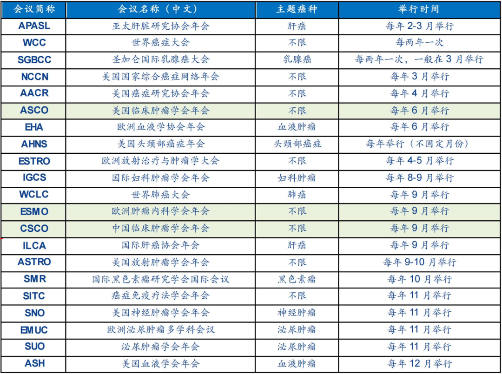
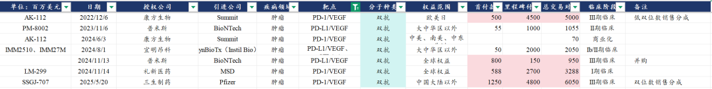
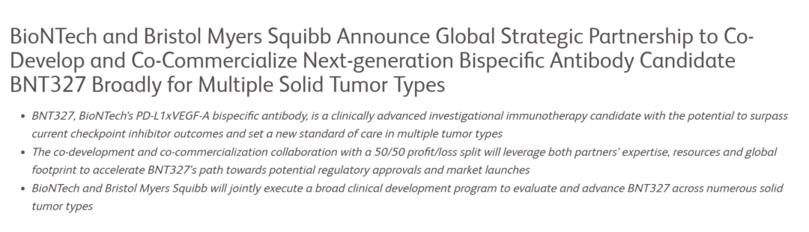
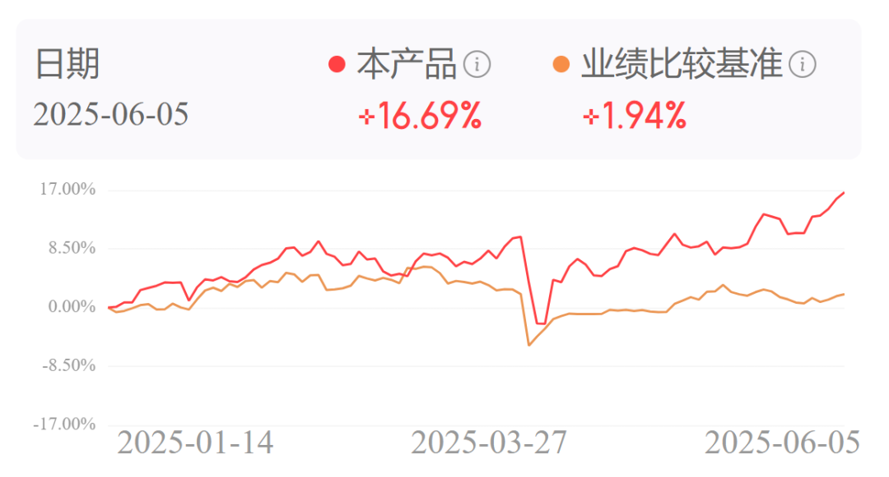
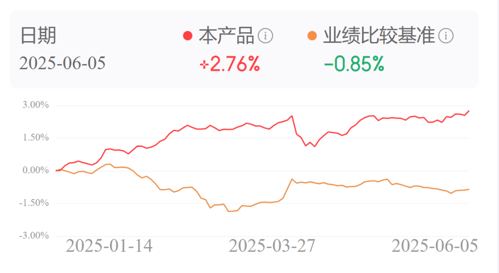

# 创新药重磅催化落地

大家好，是龙哥。

一年一度的ASCO数据发布完，终于得空给大家简单聊聊ASCO的结果，在肿瘤领域每年有很多学术年会，但其中最重要的就是美国临床肿瘤学会年会（ASCO）和欧洲肿瘤内科学会年会（ESMO），以前还有中国临床肿瘤学会年会（CSCO）、但由于反腐等原因，国内已经好几年不开了，除了美国、欧洲、中国的这三大年会以外，还有AACR、ASH、WCLC、EHA等年会也都是大家会比较关注的。

大家知道创新药公司的估值跃迁幅度最大的部分就来自于临床数据的发布，其次才是商业化的超预期与否，卓越的临床数据往往就可以提前锁定一个药物是否能成为一款重磅药物，而优秀的临床数据往往企业也会选择在大的学术会议上去发布，因此每年各个疾病领域的学术会议上的数据发布就是展示各个领域创新药技术突破的盛会，不仅是以上肿瘤领域，其他疾病领域也都有对应的学术会议。

纵观2025年ASCO，可以看到技术突破或者优秀的临床数据，主要来自IO双抗和ADC领域，主要覆盖的疾病领域是肺癌（NSCLC、SCLC）、乳腺癌，这里我们就主要聊聊IO双抗和ADC领域一些表现比较好的靶点和分子。

1）IO双抗：

本次ASCO上IO双抗数据更新值得关注的是康方生物/Summit、三生制药的PD-1/VEGF双抗和信达生物的PD-1/IL-2α双融合蛋白，其中信达生物显著超预期的优秀、三生制药符合预期的不错、康方生物基本符合预期。

①AK112依沃西（PD-1/VEGF）：康方生物/SUMMIT公布EGFR TKI耐药NSCLC的二线治疗全球多中心III期临床数据，PFS显著获益、OS未能获益，与国内临床数据一致性较高，虽然引发康方/SMMT股价巨幅波动，但决定其未来全球市场潜力的核心逻辑还是一线NSCLC的成药（OS获益），市场并未全面否认其价值，尤其是在辉瑞和后续BMS的两笔超级BD交易后，市场对PD-1/VEGF双抗的市场价值的认知还在进一步提升。

（BMS与BioNTech总交易对价111亿美元，包含15亿美元首付款，全球市场权益50:50）

②SSGJ707（PD-1/VEGF双抗）：三生制药公布SSGJ-707在一线PD-L1+NSCLC的II期数据，在10mg/kg剂量下ORR64.7%、DCR97.1%，高于康方AK112在20mg/kg剂量下的50%和89.9%，肺鳞癌组和TPS≥50%组的ORR分别75%和77%；但安全性方面≥3级副作用32.5%VS29.4%，TRAEs导致停药比例8.4%VS1.5%，TRAEs导致死亡1.2%VS0.5%，均高于AK112。因此总体来看三生制药的707展现出更好的疗效和更高的毒性。

③IBI-363（PD-1/IL-2α）：信达生物公布IBI-363在肺癌中的数据，是今年ASCO上非常亮眼的潜在下一代IO疗法的数据，在IBI-363治疗IO经治的非小细胞肺癌I期临床中，高剂量组3mg/kg显示出卓越表现，肺鳞癌3mg/kg剂量组与1/1.5mg/kg剂量组的PFS分别为9.3个月VS5.5个月，12个月OS率为70.9%VS 58.2%，低剂量组的mOS达到15个月，EGFR野生型肺腺癌PFS为5.6个月VS2.7个月，12个月OS率为71.6%VS58.2%，低剂量组的mOS达到17.5个月。三级以上TRAEs为42.6%，TEAEs导致停药比例6.6%，TEAEs导致死亡比例2.9%。总体来看在IO经治的鳞癌与非鳞癌中都展现较强的疗效，但总体毒性也依然较高。

市场可能预期礼来等大的MNC潜在BD引进信达生物的IBI-363海外权益，且交易对价预期是10亿美元首付款级别。

2）ADC药物：

本次ASCO上ASCO从早期到后期的数据披露都比较不错，III期数据如第一三共/阿斯利康发布的HER2-ADC在一线HER2阳性乳腺癌的数据，吉利德发布的K药+TROP2-ADC在一线三阴乳腺癌的数据，科伦博泰发布的TROP2-ADC在三线EGFR TKI耐药NSCLC的OS获益等；早期数据则更多，包括TROP2-ADC在一线肺癌的卓越表现，再鼎发布的DLL3-ADC的全球2L SCLC优秀表现，映恩生物的B7-H3在前列腺癌的数据，复宏汉霖的PD-L1 ADC早期数据等等。

①TROP2-ADC：TROP2-ADC的全球市场潜力在持续放大，本次ASCO上第一三共和科伦博泰都更新了一线NSCLC的数据，在一线NSCLC中K药+化疗在鳞癌和非鳞癌的mPFS分别为9个月和8个月，PD-L1高表达患者中K药单药的mPFS在5-6个月，而联用TROP2-ADC后PFS显著延长，科伦博泰的II期临床数据显示PD-L1+TROP2-ADC在一线NSCLC的mPFS长达15个月，其中PD-L1≥1%和≥50%的PFS均为17.8个月，这也显著长于AK112一线治疗PD-L1阳性NSCLC的III期临床mPFS为11.14个月，当然K药+ADC是双药联用、AK112是IO单药，并不代表IO双抗表现差，未来IO双抗也大概率要广泛的进行与ADC的联用。

三线EGFR TKI耐药NSCLC中，科伦博泰发布的III期数据显示mPFS为6.9个月VS化疗2.8个月（依沃西+双药化疗二线为7.06个月VS4.80个月），mOS的HR值为0.36，显示明确的OS获益，且三级以上不良反应发生率低于多西他赛，这意味着三线EGFR TKI耐药NSCLC未来基本明确是科伦博泰TROP2-ADC的市场，且未来二线治疗的市场很可能也被其拿下相当部分，在这样的数据下，康方AK112及信达的PD-1未来在该适应症可能难有大的份额。

②小细胞肺癌SCLC：小细胞肺癌在这次ASCO上有较多突破，包括DLL3/CD3双抗二线治疗、卢比替定一线治疗、DLL3-ADC二线治疗等。

一线治疗中阿替利珠单抗（PD-L1）+卢比替定显示出OS获益（13.2个月VS10.6个月，HR=0.73），绿叶制药拥有卢比替定国内权益。

二线SCLC安进DLL3/CD3双抗III期临床显示ORR为35%VS20%，mOS为13.6个月VS化疗8.3个月，HR值0.60，显著OS获益，且安全性显著好于化疗组，安进对DLL3/CD3目前已经启动两项一线治疗SCLC的III期临床；泽璟制药DLL3/DLL3/CD3三抗在三线SCLC的ORR为62.5%（10mg）和58.3%（30mg），DCR分别为70.8%和66.7%。

再鼎医药的DLL3-ADC二线SCLC整体剂量爬坡（0.8mg-2.8mg）的ORR为67%、DCR为97%，其中1.6mg/kg剂量组的ORR为79%、DCR为100%，是目前二线SCLC最好的数据，公司基本确定1.6mg剂量组推注册临床，我们刚在前两天给大家介绍了再鼎医药《[创新药战略眼光之最](https://mp.weixin.qq.com/s?__biz=MzkyMzQ3MDc3Mw==&mid=2247484599&idx=1&sn=5ab89fbff32f4a1b1c0ff9750ce69cba&scene=21#wechat_redirect)》。

另外百利天恒的EGFR/HER3双抗ADC、翰森的B7-H3 ADC和宜联的B7-H3 ADC也都展示出不错的ORR（50%-80%），但三级以上副作用高达50%-75%，毒性要显著大于DLL3-ADC和DLL3 TCE。

......

龙谈医药科技组合昨天净值继续新高，虽然昨天创新药板块有所回调，但是我们两条腿走路的另一条腿——港股科技昨天大涨，组合今年以来累计16.69%，超额受益14.75%。

龙谈美元债组合也在昨天创下历史新高，累计收益2.76%，超额收益3.61%，再次强调一下这是一款固收产品做出的收益水平，其中还包含了今年人民币兑美元大幅升值的情况下。

感兴趣的读者扫码了解：

风险提示：本文仅讨论行业/公司经营情况，投资需综合考虑公司经营、估值、管理层等多方面因素，建议读者审慎参考，本文不作为投资依据，不建议大家根据本文做出投资计划。

<!-- wxmp-comments-begin -->

---

## 留言（14 条，含回复共 30 条）

- **宋 浩** 👍3 · 2025-06-06 17:41
  老师，前言生物的几个创新药怎么样啊
  - ↳ **作者** · 2025-06-06 17:57
    前沿生物确实是看不到太多亮点，HIV药物更倾向于看看艾迪，但这俩都很难看出海逻辑
- **北海** 👍3 · 2025-06-06 17:51
  CSCO年会还在开的，去年厦门，今年济南。只是相对ASCO和ESMO重磅研究披露的比较少。
  - ↳ **作者** · 2025-06-06 17:56
    基本已经没什么行业影响力了，相比20-21年那阵已经不是一个东西了
- **无财作力** 👍3 · 2025-06-06 18:04
  大A的医药医疗不行[捂脸]，一直坚定的看好医药，可惜大部分仓位都在大A[苦涩]
  - ↳ **作者** · 2025-06-06 18:08
    啊上周四刚写了科创生物ETF。实在说A股的创新药从质地到估值大部分都不如港股，只有少数比较值得看的公司，所以投A股医药的话相对就比较依靠行业β。
- **生而自由20151021** 👍3 · 2025-06-06 18:22
  如果信达的363通过牺牲部分首付款授权给百济，换取高比例后期上市的销售分成该多好。
  - ↳ **作者** · 2025-06-06 18:23
    为什么要给百济？这种分子肯定是卖给有实力投几十亿乃至上百亿美金去做临床开发的全球顶级MNC才能利益最大化啊。。
  - ↳ **作者** · 2025-06-06 18:48
    百济在实体瘤ADC和小分子领域今年也都会有一些早期数据读出
- **低碳哥** 👍2 · 2025-06-06 17:52
  龙谈价值2025[庆祝][庆祝][庆祝]
  - ↳ **作者** · 2025-06-06 18:13
    啊对了，还有个事，上周五的文章里写到的免费赠送的资料，我已经全部发过了，如果有没收到的，可能是留言被屏蔽了，记得重新发一次
- **丁山** 👍2 · 2025-06-06 18:09
  龙哥，有没有CXO为主的ETF呢？创新药融资恢复，就该轮到CXO了。
  - ↳ **作者** · 2025-06-06 18:14
    这个我要再盘一下，之前找过是没看到很纯粹的CXO的ETF的
- **老加仓** 👍2 · 2025-06-06 18:14
  丽珠集团没啥新药亮点吧
  - ↳ **作者** · 2025-06-06 18:21
    有个IL-17A/F还不错，但国内银屑病现在很卷，还得看后面推广怎么做。丽珠这几年确实是挺保守的，没有太多看点，股东回报是积极的做。
- **赶路的** 👍1 · 2025-06-06 17:47
  感觉这都是一年或者几个月的差别，癌症治疗都是驼子里拔将军啊
  - ↳ **作者** · 2025-06-06 17:54
    不了解医药行业或者不了解肿瘤的人往往希望有一款药直接治愈肿瘤，甚至一直有种邪恶的猜想说制药巨头明明有治愈肿瘤的药却不会对外发布，为了让大家持续的买他们的药。实际上接近行业的人就会知道，能延长几个月的生存期对于大多实体瘤已经是不错的进步，能延长一年以上的生存期已经是巨大的突破。不过好的地方在于，我们慢慢也看到，越来越多的癌种的生存期被显著延长，部分实体瘤的生存期也可以达到平均七八年甚至更长，肿瘤慢病化越来越接近现实。
- **兵七进一** 👍1 · 2025-06-06 17:58
  泰格医药是不是完了，感觉没有任何起色
  - ↳ **作者** · 2025-06-06 18:04
    这个也重复好多遍了，多看看历史文章里回答过的问题吧。CXO，尤其是国内为主的CXO，业绩企稳肯定是滞后的，目前创新药行情火爆，一二级市场融资陆续修复，CXO的订单量价修复应该也是时间问题。
- **兰⑧** 👍1 · 2025-06-06 18:07
  眼科，牙科都不涨
  - ↳ **作者** · 2025-06-06 18:12
    创新药的逻辑和医疗服务的逻辑完全不相干啊
  - ↳ **作者** · 2025-06-07 07:58
    眼科，牙科是医疗消费，部分还是可选消费。创新药的方向是必选疾病，砸锅卖铁也要治的，也是先进技术，科技制高点的抢夺！国家战略！时代的上甘岭，必须赢的科技高峰，消除痛苦，造福人民！有钱人老了！
- **丁山** 👍1 · 2025-06-06 18:08
  龙哥，创新药最近一直涨，短期内是不是等下回调再定投呢？我建底仓。
  - ↳ **作者** · 2025-06-06 18:10
    择时一直都是件挺难的事，我也没法做这种行情演绎中的精准择时，我也不知道什么时候会不会回调、回调幅度有多大，所以......
- **CHY** 👍1 · 2025-06-06 18:10
  原来京东金融还能买基金！？绕
  - ↳ **作者** · 2025-06-06 18:12
    是的，而且现在给的服务更好，新用户一个月免佣金，还有其他给的各种优惠我也记不清了，感兴趣的话可以去自己看看[破涕为笑][破涕为笑]
- **隐隐** 👍1 · 2025-06-06 18:22
  基金经理万总发表的观点适用于港股创新药吗？[破涕为笑]
  - ↳ **作者** · 2025-06-06 18:44
    鸡犬升天的时候肯定是适用一些公司的，但还是要意识到产业端真实的变革
- **知足常乐** 👍1 · 2025-06-06 18:38
  不提艾力斯，就是耍流氓
  - ↳ **作者** · 2025-06-06 18:43
    那我倒要请教一下，艾力斯在ASCO上发布的什么突破性的临床数据？

<!-- wxmp-comments-end -->
