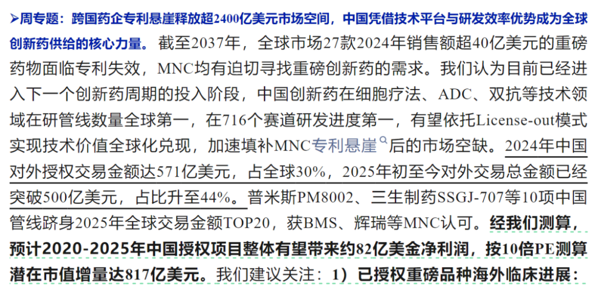
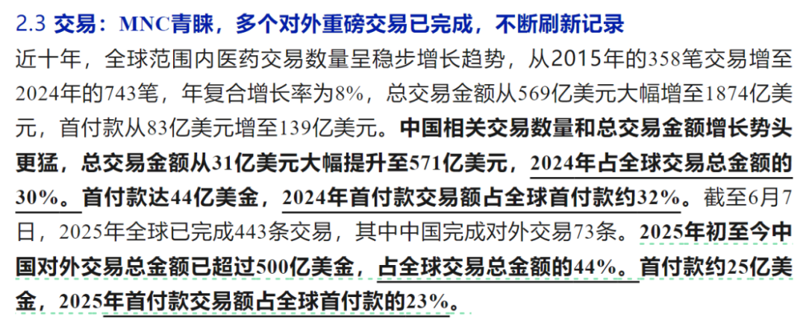
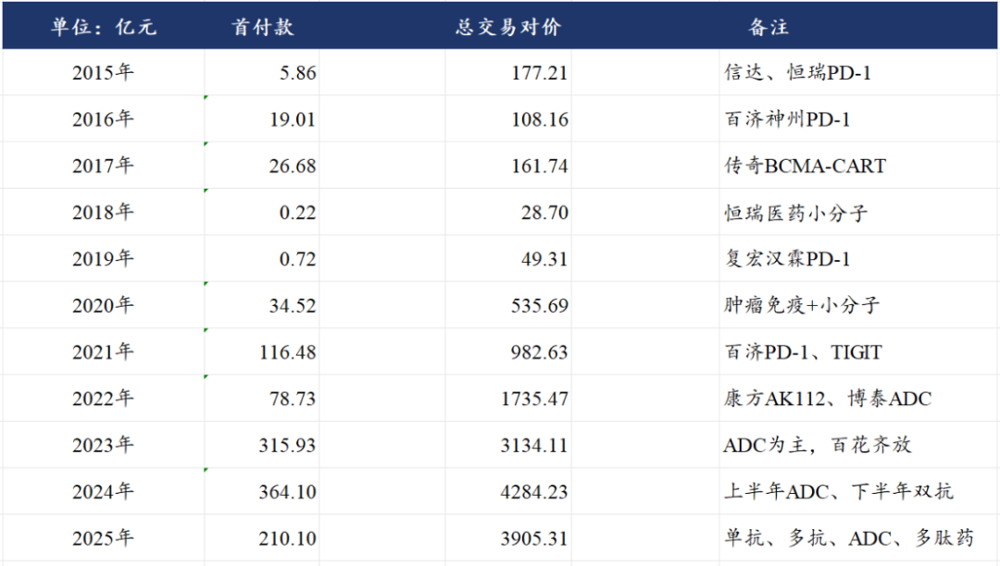
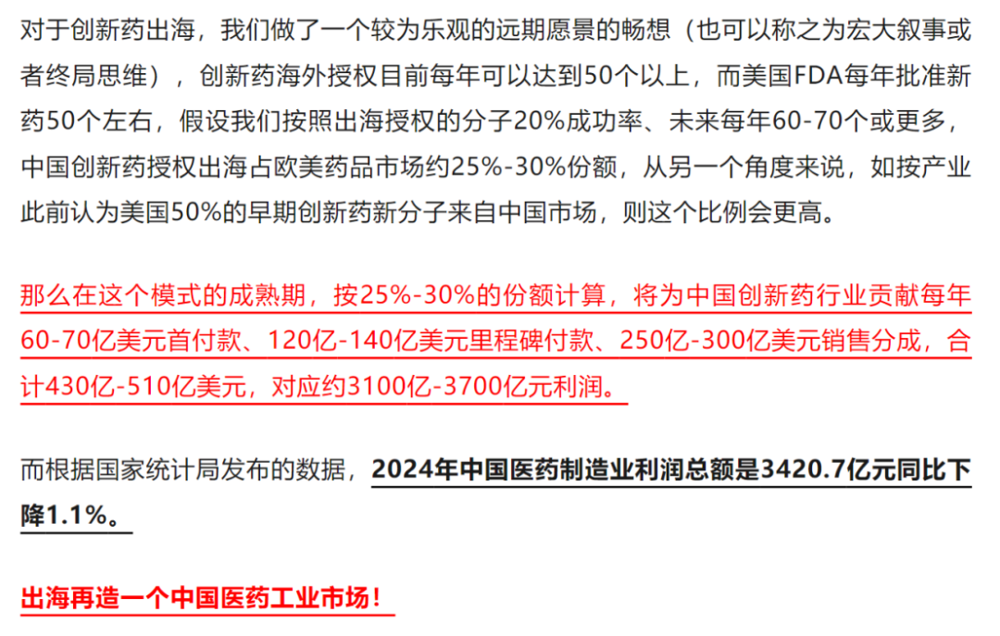

# 创新药宏大叙事

大家好，我是龙哥。

周一看到华福医药团队发布的周报里讲到了中国创新药海外BD带来的利润增量和市值增量，其测算的是2020-2025年已经达成的中国创新药出海授权交易预计带来82亿美元的净利润和817亿美元的市值增量，也就是接近6000亿元的市值增量。

同时其报告里还写到按总的交易对价来计算2024年中国创新药BD授权的首付款占全球的32%、总交易对价占全球的30%，2025年以来则是首付款占全球的23%、总交易对价占全球的55%，总交易金额超过500亿美元。

他们引用的医药魔方的这个数据，与我们此前统计的数据基本一致：2025年截止到6月初，中国创新药出海BD交易的首付款210亿元，已经达到去年全年的57.7%，总交易对价3905亿元，已经达到去年全年的91%，如果剔除掉启德医药那笔130亿美元的授权，总交易金额也已经达到2024全年的69%，而我们知道由于BD谈判的节奏原因，这几年下半年的BD交易规模总体都是高于上半年的，也就是说25年全年中国创新药海外BD大概率还要以一个相对较高的增速创下新高。

在今年年初的时候，龙哥在《[医药行业趋势展望](https://mp.weixin.qq.com/s?__biz=MzkyMzQ3MDc3Mw==&mid=2247484101&idx=1&sn=febb0b581f3311f2fb2477ef02efdb50&scene=21#wechat_redirect)》中给大家聊了类似的思路，也就是说我们看远期，中国创新药出海到底能带来多少的潜在收入和利润，以及能带来多大的潜在市值空间，只不过当时创新药还未走出如此轰轰烈烈的行情，大家对这个逻辑和远景也没什么关注和理解。

以上测算基于的假设，是基于23-24年中国创新药海外BD数据而做出的一个线性外推的假设，因此对其分析过程可结论，也欢迎各位读者大人的批判。

以上的观点是认为，过去两年的首付款规模在50亿美元左右，从历史来看首付款基本是占里程碑付款的10%左右，假设未来出海的分子数量进一步提升，每年首付款金额提升到60-70亿美元（2025年就很可能超过这个水平），那么基于当前FDA每年批准的分子数量和国产创新药海外BD的数量，假设20%左右的海外BD的分子最终成药，也既最终可以拿到20%左右的里程碑付款，对应的就是每年有120亿-140亿美元的里程碑付款可以最终兑现。

以上假设对应国产创新药出海占欧美市场每年获批创新药的四分之一到三分之一的水平，那如果假设终端销售金额的占比也大概在这个水平，对应的就是海外1万多亿美元的市场中占据2500-3000亿美元的份额，保守按照10%的销售分成比例来计算，就是每年有250亿-300亿美元的销售分成。

这样合计是每年创造430亿-510亿美元的创新药出海收入，如果我们假设未来远期国产创新药的国内收入基本收回研发成本、贡献基础的利润水平、而海外授权收入近乎为纯利润，则意味着出海能贡献的行业利润水平，远期可以达到3100亿-3700亿元，中位数是3400亿元，刚好与2024年中国医药制造业利润总额3420亿元差不多。

也就是以上的结论就是——创新药出海再造一个中国医药工业产业。

当然，还有更乐观的测算，例如，假设未来海外1.2万亿美元的药品市场、中国创新药占到50%的份额、15%的销售分成，对应的是6000亿美元销售额、900亿美元/6400亿元中国药企销售分成。

基于以上线性外推式的假设，未来国产创新药市场潜在的利润空间大概是7000亿-10000亿元，按照成熟期全行业10-15倍PE，市值大概是7万亿-15万亿，看起来似乎非常多，其实也就是1-2万亿美元，大概相当于1.3-2.5个礼来的市值。

截止到昨天，中国医药行业里的化药+生物药（创新药+仿制药，不含中药）总市值大概是3.65万亿元，也就是看向遥远的未来，行业总市值角度大概是1-3倍的提升空间。当然，这个未来有多远呢，至少看10年内是不可能达到的，所以以上的假设，只是作为一个线性外推式的“宏大叙事”，切不可因此上头。

风险提示：本文仅讨论行业/公司经营情况，投资需综合考虑公司经营、估值、管理层等多方面因素，建议读者审慎参考，本文不作为投资依据，不建议大家根据本文做出投资计划。

<!-- wxmp-comments-begin -->

---

## 留言（13 条，含回复共 25 条）

- **知行** 👍7 · 2025-06-11 10:52
  先看到一倍再说。毕竟现在能够有宏观叙事的行业不多了，资产具备稀缺性，我们要等泡沫再撤退。等回落再接回。做做波段。
- **栗子** 👍4 · 2025-06-11 10:45
  龙哥在医药方面有很深的研究，并且能坚持那么久，确实令人佩服，这个行业普通人了解的不深，龙哥能不能推荐几个可以长线持有，有潜力的创新药股，上证的，谢谢
  - ↳ **作者** · 2025-06-11 10:50
    最近两年我大部分文章都是写创新药，但同时几乎全都是写港股创新药，难得提A股创新药也是上次写了个科创生物ETF，主要就是有一些类似你这样的读者还是想要A股的投资标的，核心原因也是多次重复过了，整个港股的创新药无论是质地还是估值都普遍好于A股，对于我们这样的能长期坚持在这个行业里的多少还是得有点对估值和逻辑的基本的底线的，是吧。当然也不是说A股没得投，最近港股创新药估值普遍起来以后，我也被迫选了几个A股还可以的标的，由于合规原因不能具体讲是哪几个公司，只能说A股创新药就是矮个子里挑高的，如果之后有机会以单篇的文章可以聊聊。
- **范征** 👍3 · 2025-06-11 10:47
  现在看见创新药的都是风险，减仓不少
  - ↳ **作者** · 2025-06-11 10:54
    以年初低点来算5个月的时间恒生医疗保健指数涨了60%，我复盘历史来看都是一个中短期非常大的涨幅了。不过考虑到指数拉长周期所处的位置和产业的发展趋势，也很难说是个非常贵的位置。
- **祝汉青HYTEM** 👍2 · 2025-06-11 10:40
  缅A的情绪上头，就是直接拉到十年后的价格[偷笑]
  - ↳ **作者** · 2025-06-11 10:42
    [尴尬]
- **吕昊** 👍2 · 2025-06-11 10:42
  龙哥，有时间介绍下科济药业，感谢。
  - ↳ **作者** · 2025-06-11 10:47
    细胞治疗这块国内比较有看点的上市公司就那么三两家，科济药业是其中一家，他们新的通用CAR-T技术平台首个上人体试验的产品，目前有几例患者的数据，期待看到更多患者数据，细胞治疗这些年总体市场发展是低于预期的，自体CAR-T还是很多局限性，大家期待通用CART久矣
- **蒋专利AI** 👍2 · 2025-06-11 11:01
  老年化社会加速，创新药需求指数级增长，看好创新药ETF，尤其是港股的，10年10倍稳稳地
  - ↳ **作者** · 2025-06-11 11:04
    你这个就是典型的用错误的逻辑阴差阳错赶上风口，创新药这波的逻辑核心是参与全球市场竞争，是全球化的逻辑，而老龄化社会实际上带来的是降本控费压力增大、仿制药使用需求大于创新药使用需求，可以参照日本老龄化社会之下的创新药行业，也可以参照2018-2022年的国内医药行业是如何被政策打压的。
- **归去来兮** 👍2 · 2025-06-11 11:03
  龙哥能否讲讲cxo的情况，作为创新药的上游，按理说可以享受整个创新药的增长，为何现在的市场资金并不买账？
  - ↳ **作者** · 2025-06-11 11:07
    CXO要分国内和海外来看，海外为主的CXO，本质上跟随的是全球创新药的技术趋势，所以和国内创新药热度的关联度有、但没那么高，投海外为主的CXO核心还是要跟随技术趋势，并且海外为主的CXO也不可避免的长期存在地缘政治风险。
    国内为主的CXO，过去两年经历了比较惨的价格战、量价齐跌、行业出清，那到现在创新药板块企稳，传导到CXO的业绩层面还需要更长的时间，可能需要半年到一年的时间，至于市场是不是会提前反映板块的反转预期，那就要看市场行情的演绎了。
- **求索者** 👍2 · 2025-06-11 11:13
  现在的市值大头儿都是辣鸡，真创新药太稀缺了
  - ↳ **作者** · 2025-06-11 11:44
    也不是，那市值大头的百济就不算真创新药了吗，涨幅大的就一定是真创新药吗......这种鸡犬升天的行情你要讲基本面反而是次要因素，更多的是看边际变化和筹码结构。
- **王熙** 👍1 · 2025-06-11 10:42
  低位谈逻辑，高位讲风险
  - ↳ **作者** · 2025-06-11 10:43
    低位谈的逻辑没人看，这不得再聊聊嘛[旺柴]
- **肥锋  家诚哥** 👍1 · 2025-06-11 11:25
  龙哥你好，现在选CXO自己都有点迟疑，选与海外关联大的会担心地缘，但是现在看估值相对较低，尤其是早年时间利用业绩数据好，老板经常减持的独角兽。选国内关联度高的确定性又不算高。不过现在来看，好像又找不出有比CXO更好的叙事。
  - ↳ **作者** · 2025-06-11 11:43
    地缘政治风险会长期存在，来回一个消息可能就会导致板块跌一跌，海外为主的CXO还是会经常给买点的。国内为主的就是像评论区另一条回复的，量价的回升会滞后于创新药二级市场表现的，可能滞后半年到一年，但股价大概率还是会提前企稳的。
- **天涯过客** 👍1 · 2025-06-11 11:42
  龙哥再鼎医药感觉还没怎么涨，后面怎么看？
  - ↳ **作者** · 2025-06-11 11:43
    上周写过
- **caoguoan** 👍1 · 2025-06-11 12:38
  从关注龙哥起就坚定看好创新药，只是港股创新药指数买得有点早，盈利不多。龙哥，我是哪年的粉？
  - ↳ **作者** · 2025-06-11 13:16
    2023年4月关注的，换到这个号之后第一批读者[抱拳][抱拳]
- **卷爸书房** · 2025-06-11 16:47
  如果按3000亿算，10-15就是3-4.5万亿，现在这个3.6万亿的市值差不多了呀？龙大是应该清仓创新药了吗？
  - ↳ **作者** · 2025-06-11 16:53
    2024年医药工业利润3400亿，你这3000亿是啥

<!-- wxmp-comments-end -->
