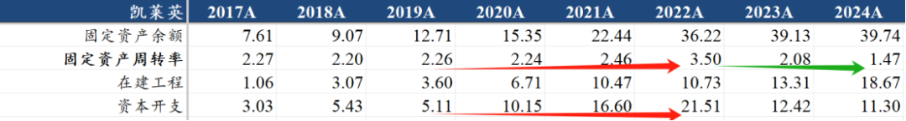
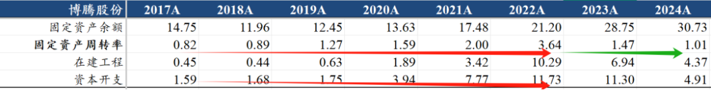
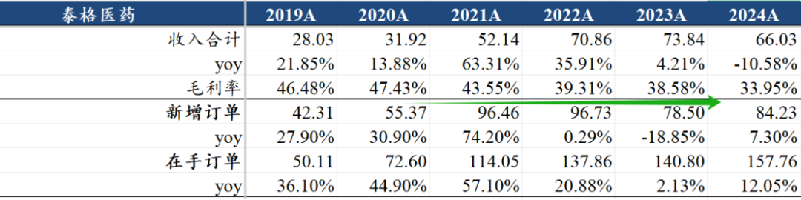
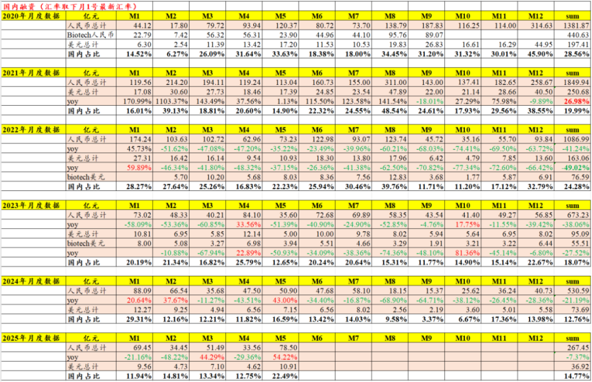
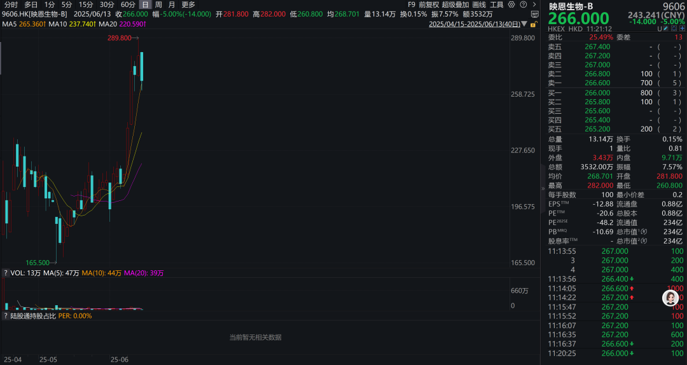
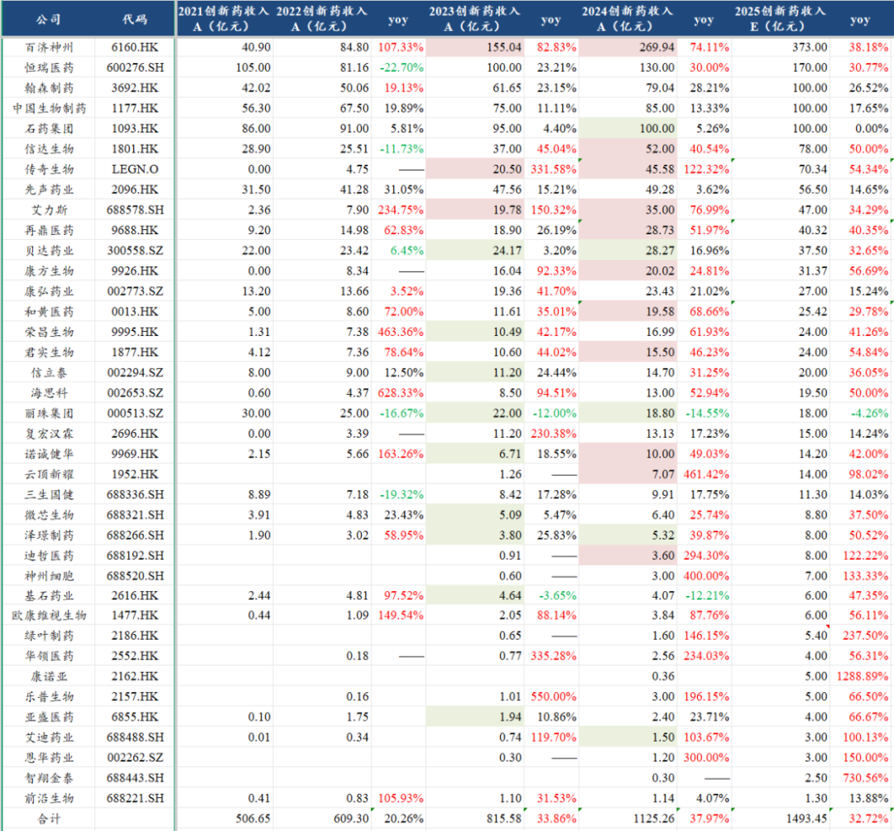
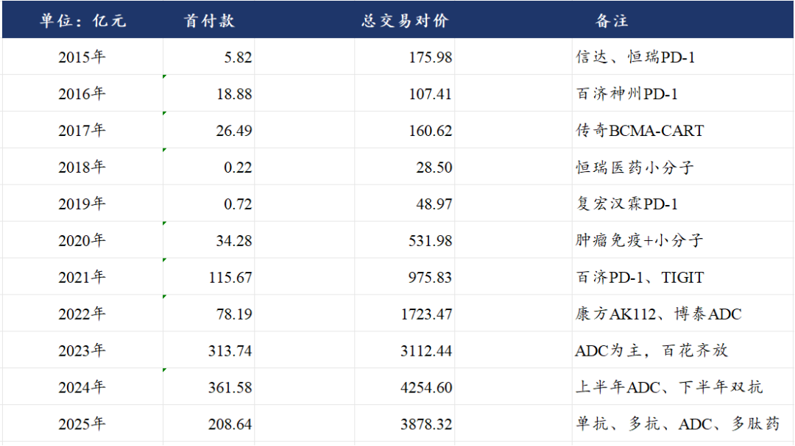

# 创新药行情延伸

大家好，我是龙哥。

创新药的行情在最近一个月尤为火爆，全市场对创新药的研究和投资热情高涨，创新药海外BD的逻辑持续催化，甚至已经到了部分公司只要公开宣布一下正在与MNC接洽就可以带动股价暴涨的程度，这盛况或者说非理性程度更甚于上一轮的创新药牛市。

那么在这个时间点，除了我们这两年一直聊的创新药行业外，我们还想就这个时候来聊聊CXO行业的观点，作为创新药产业链最重要的部分，CXO行业、尤其是国内业务为主的CXO行业能否在这样的创新药产业趋势中企稳向上？先说答案，我们认为是肯定的。

对于CXO行业的投资逻辑，不论是2019-2021年那波大牛市，还是这一轮的创新药牛市，都是可以分为全球市场竞争的CXO公司和国内为主的CXO公司，而我们文初先总体上做一个定性的判断，海外业务为主、参与全球市场竞争的CXO公司在上一轮的牛市和这一轮的行情中是不同的逻辑，而国内市场为主的CXO公司，在上一轮牛市和这一轮行情中的逻辑可能会比较相似。

以药明系为首的海外业务为主的CXO公司，在上一轮牛市中的主旋律是中国CXO企业在工程师红利下抢占全球市场份额，疫情更是强化了国内企业的效率优势（业务能力、扩产能力），在全球产能供给不足的情况下龙头公司的订单持续外溢到二三四线公司，因此我们可以看到上一轮牛市中的，CDMO行业药明康德的最低点到最高点涨幅4.8倍，凯莱英涨了10倍，博腾股份涨了14倍，临床前CRO行业美迪西涨了13倍，昭衍新药涨了14倍，可比的行业里二三线的公司反而涨幅要大于一线的药明系。

在这个过程中，凯莱英的固定资产周转率从稳定在2.2-2.3，提升至2021年的2.46、再到2022年的3.5，我们知道CDMO/CMO行业相对属于重资产的行业，固定资产周转率显著的提升对应盈利能力的显著提升，凯莱英的毛利率从46%左右提升到最高51%，净利率从23%左右提升到最高32%。

博腾股份的固定资产周转率从0.82提升到最高3.64提升了3.4倍，对应的毛利率从37%提升到最高52%，净利率从9%提升到最高28.5%。

而我们看这一轮海外为主的CXO公司的投资机会，则核心逻辑转变为跟随全球创新药产业趋势和技术方向，在今年介绍CXO行业的几篇文章里我们都反复强调这个逻辑《[医药最高景气方向](https://mp.weixin.qq.com/s?__biz=MzkyMzQ3MDc3Mw==&mid=2247484299&idx=1&sn=c6677f52d0ea6ebfbc11420984b3636d&scene=21#wechat_redirect)》、《[CXO全面复苏](https://mp.weixin.qq.com/s?__biz=MzkyMzQ3MDc3Mw==&mid=2247484308&idx=1&sn=3ecff125b0b85e5cd323cb99f646e2a3&scene=21#wechat_redirect)》、《[CXO王者归来](https://mp.weixin.qq.com/s?__biz=MzkyMzQ3MDc3Mw==&mid=2247484259&idx=1&sn=1bc93a5b4d6772af4068695f22d8f23f&scene=21#wechat_redirect)》，我们从全球创新药爆发的细分领域来看最核心的技术方向就是GLP-1为首的多肽药领域和肿瘤领域的ADC药物，去年下半年以来双抗药物也在持续爆发，在这三个细分领域，药明系的全球竞争力更甚过去的小分子和单抗药物时代，订单和收入的放量速度也远超过往。

另外多肽药CDMO和ADC CDMO也陆续有后续的二线公司开始有产能投出来，也会受益于行业景气度和下游biotech的差异化需求。

以美迪西、泰格医药等国内业务为主的CRO公司，则是与出海为主的CDMO/CMO公司有较大的逻辑差异，其与国内创新药行业的景气度有较大的关联，而不是类似CDMO公司那样与全球市场细分领域的景气度有较大关联，因此国内创新药行业的投融资水平和研发投入强度会直接影响到这些公司的订单量和订单价格。

实际上临床CRO这边的订单量和价格的涨跌，与我们二级市场参与者的感受并不完全相同，这个滞后性会比较明显，例如创新药的股价下跌从21年开始，连跌了21-22年两年之后，实际上21-22年CRO公司的新签订单普遍都还在增长，订单量下降最明显的是2023年，泰格医药、昭衍新药、美迪西等临床CRO和临床前CRO公司的新签订单在2023年都出现了大幅下滑，其中泰格医药23年新签订单下滑19%、昭衍新药下滑39%、美迪西下滑36%。

到24年行业的订单仍处于量价齐跌的状态，订单价格的低迷也导致行业内公司的毛利率受到较大影响，泰格医药的毛利率从47%下滑到34%，美迪西的毛利率从45%下降到24%，昭衍新药的毛利率从51%下降到28%，普蕊斯的毛利率从30%下降到24%。

我们知道2024年实际上创新药行业依靠国内放量和出海授权，在四季度行业股价已经明显企稳，24年反而是行业出清和毛利率最低的一年，二级市场股价的阶段性企稳在24年并没有显著的带来融资的修复，因此也并不能传导到上游的CXO行业。

CXO行业的景气度与创新药行业的研发强度有最直接的关系，而创新药公司的研发投入，其资金来源大致可以分为三部分，其一是一/二级市场融资的资金，其二是产品商业化销售贡献的现金流，其三是产品BD授权贡献的现金收入——尤其是首付款收入。

首先我们看融资情况，一级市场融资方面，2025年以来的国内医疗健康领域融资（包含创新药、器械、数字健康、服务等）同比仍然是下滑的，但是可以看到在5月出现了较大幅度的同比和环比的增长，也创下了过去16个月的新高，当然月度的数据参考性还不够强，但我们认为随着当前二级市场的火热表现，包括港股创新药IPO数量的重新开始逐渐增加，一级市场融资的修复只是时间问题。

二级市场融资方面，近期随着一些此前比较缺钱的公司二级市场股价涨起来，二级市场的增发也逐渐增多，包括A股的迪哲医药增发募资18亿元已经完成，神州细胞计划增发募资9亿元、不过是老板全额认购（神州细胞的老板真的有钱，23年底也曾掏了9个亿给公司）。

港股配售融资则是更多，就近期而言，如宜明昂科在去年底出通之前配售募资2.3亿港元，科伦博泰配售募资近20亿港元，荣昌生物配售募资8亿港元，康诺亚在前天配售募资8.6亿港元，君实生物就在今天折价12%配售募资10亿港元，还有信达生物老股配售3亿美元，云顶新耀在今天大股东计划减持7.63%的总股本。

新股IPO方面，港股今年以来上市了维昇药业、映恩生物、恒瑞医药、派格生物等4家创新药公司，其中映恩生物和恒瑞医药都给大家带来很不错的打新回报和上市后参与的回报，恒瑞医药我今年专门写过两次《[恒瑞医药火力全开](https://mp.weixin.qq.com/s?__biz=MzkyMzQ3MDc3Mw==&mid=2247484343&idx=1&sn=8a9443fca3fd94f88388790956537836&scene=21#wechat_redirect)》、《[巨头黄昏还是黎明前的黑暗](https://mp.weixin.qq.com/s?__biz=MzkyMzQ3MDc3Mw==&mid=2247484184&idx=1&sn=55ec711da3240320949b76ae746cc139&scene=21#wechat_redirect)》，此前也专门写了映恩生物的情况《[把握下一个ADC领域龙头biotech](https://mp.weixin.qq.com/s?__biz=MzkyMzQ3MDc3Mw==&mid=2247484358&idx=1&sn=7dddbb02ce72e890e4b4565060eb8470&scene=21#wechat_redirect)》。

除了这4家，今年后续还会有多家创新药公司IPO，行业新股的供给重新开始进入增长期。

在产品商业化销售和BD授权方面，都是我们老生常谈的内容了，产品商业化方面，行业已经基本从2022-2023年的行业销售持续miss中走出来，2024年我们统计的国内38家上市创新药企业合计创新药收入超过1100亿元同比增长38%，而预计2025年以上38家公司的创新药收入在1500亿元左右、同比增长约33%，2026年预计以上38家公司的创新药收入仍将在25%-30%的增长。这些统计中还不包含一部分难以拆分创新药收入的公司（如复星、华东、人福等），也不包含部分非上市公司（如齐鲁、扬子江等巨头）。

创新药的BD授权方面，已经是连续3年呈现高水平的BD授权收入，2023年-2025年这2年半的时间国内创新药公司预计拿到了接近1000亿元的首付款+里程碑付款，要知道23-25年整个医药行业的一级市场融资金额方才不到1500亿元，如果按照创新药占比一半来算意味着23-25年创新药一级市场融资额合计也只有700多亿元。

由此可见，以上二级市场融资、潜在向一级市场传导的一级市场融资、产品商业化销售、BD授权等方面共同的边际转向或者爆发式增长，都意味着国内创新药研发投入也将迎来拐点，向上游临床前CRO和临床CRO的传导只是时间问题，并且由于商业化和BD方面的突破，这个拐点可能并不像过去高度依赖一二级市场融资那样久的滞后。当然，这个时间可能也不会那么快，至少在二季度整个业绩下行的惯性还是存在，预计同比依然存在压力，环比可能会逐季度看到改善。

具体产业链公司的估值方面，如果参照wind一致预期的盈利预测，泰格医药25年PE是38倍（A股）、33倍（H股），诺思格34倍，普蕊斯23倍，昭衍新药45倍（A股）、28倍（H股），益诺思33倍。

......

近期重点文章：

《[创新药宏大叙事](https://mp.weixin.qq.com/s?__biz=MzkyMzQ3MDc3Mw==&mid=2247484619&idx=1&sn=9c50a7c53e83a5c5b592a0a46e33b026&scene=21#wechat_redirect)》

《[创新药重磅催化落地](https://mp.weixin.qq.com/s?__biz=MzkyMzQ3MDc3Mw==&mid=2247484610&idx=1&sn=840972449340d85b5fa31195d262ee93&scene=21#wechat_redirect)》

《[创新药破历史纪录的一天](https://mp.weixin.qq.com/s?__biz=MzkyMzQ3MDc3Mw==&mid=2247484588&idx=1&sn=2db3008d27ff92094a16fcc73ae1fffd&scene=21#wechat_redirect)》

《[创新药战略眼光之最](https://mp.weixin.qq.com/s?__biz=MzkyMzQ3MDc3Mw==&mid=2247484599&idx=1&sn=5ab89fbff32f4a1b1c0ff9750ce69cba&scene=21#wechat_redirect)》

《[医药24年烧了多少钱？](https://mp.weixin.qq.com/s?__biz=MzkyMzQ3MDc3Mw==&mid=2247484551&idx=1&sn=69b7264675dc2ac1a809e29b27e61622&scene=21#wechat_redirect)》

《[创新药十大金刚一季报](https://mp.weixin.qq.com/s?__biz=MzkyMzQ3MDc3Mw==&mid=2247484501&idx=1&sn=1ac9bebe7a5ed9abc82da88728838488&scene=21#wechat_redirect)》

《[创新药利空虚惊一场](https://mp.weixin.qq.com/s?__biz=MzkyMzQ3MDc3Mw==&mid=2247484479&idx=1&sn=220426116884355ebe728bcbc1c1b3a2&scene=21#wechat_redirect)》

《[创新药太猛了](https://mp.weixin.qq.com/s?__biz=MzkyMzQ3MDc3Mw==&mid=2247484474&idx=1&sn=2e83130102738a0aeed6568245534666&scene=21#wechat_redirect)》

风险提示：本文仅讨论行业/公司经营情况，投资需综合考虑公司经营、估值、管理层等多方面因素，建议读者审慎参考，本文不作为投资依据，不建议大家根据本文做出投资计划。

<!-- wxmp-comments-begin -->

---

## 留言（11 条，含回复共 22 条）

- **光头的复利人生** 👍13 · 2025-06-13 11:39
  创新药BD爆发-资金端好转-资本开支加大-利好CXO，跟我想一块儿去了哈哈[呲牙]方向上我也是埋伏了你说的ADC和多肽两个方向
  - ↳ **作者** · 2025-06-13 12:04
    师兄[旺柴]
- **快车** 👍5 · 2025-06-13 11:33
  早上刚减了，希望能下来&nbsp;沉淀下&nbsp;在往上走吧，人太多了
- **叶** 👍3 · 2025-06-13 11:49
  请教龙哥a股诺泰生物是不是多肽最好的标的了
  - ↳ **作者** · 2025-06-13 11:54
    行业龙头肯定是药明康德啦，药明康德今年多肽CDMO/CMO收入应该就接近100亿了
- **水木二师兄** 👍3 · 2025-06-13 11:54
  龙哥对AI医药晶泰控股怎么看
  - ↳ **作者** · 2025-06-13 11:57
    AI制药的方向是可以关注的，前阵子也去聊了英矽智能，英矽智能作为最纯粹的AI制药企业，也是创新药的估值模式。至于晶泰，我确实不知道这类公司如何估值。
- **单兵强（龙2-45号）** 👍2 · 2025-06-13 11:40
  龙少，可以说下毕得医药吗？
  - ↳ **作者** · 2025-06-13 11:43
    行业价格战打完之后，毕得和皓元的毛利率都有所修复，总体基本面是向好的，当然需求端的修复也是缓慢的。
- **大庆** 👍1 · 2025-06-13 11:30
  龙少，能聊几句海吉亚吗？谢谢
  - ↳ **作者** · 2025-06-13 11:37
    海吉亚就当前的现金流状况来说估值确实不高，就是后线城市医保和财政压力是长期存在的，会始终差于一二线城市，这个问题目前似乎看不到如何解决的途径。
- **朴实无华** 👍1 · 2025-06-13 11:46
  龙哥眼科牙科今年有没有机会翻身
  - ↳ **作者** · 2025-06-13 11:48
    这个要看宏观环境和总体的消费环境。
  - ↳ **作者** · 2025-06-14 13:49
    非刚需。看经济复苏情况。
- **天野源** 👍1 · 2025-06-13 12:02
  龙哥，接下来像大博医疗这样的骨科企业，会不会也受益于医药行业的回暖？还有您提到的这几家国内CRO企业，自己组个ETF，您看怎么样，什么比例会好一点？
  - ↳ **作者** · 2025-06-13 12:08
    前两周不是写过骨科嘛，已经在集采中修复了。
- **钟凯文 | 笨拙的荆棘鸟** 👍1 · 2025-06-13 12:34
  还有信达生物老股配售3亿美元
  ——龙哥，这是怎么回事啊[流泪][流泪][流泪]
  - ↳ **作者** · 2025-06-13 12:38
    这有啥怎么回事的啊，老股东看大家热情高涨，把宝贵的筹码交给大家，令人感动[旺柴]
- **新昵称** 👍1 · 2025-06-13 18:55
  泰格有个杠杆，就是他100亿的投资，之前是狗屎，现在重估了
  - ↳ **作者** · 2025-06-13 19:21
    是的，泰格的投资项目比较多，行业上行期和下行期都是相当于加杠杆
- **水木二师兄** · 2025-06-13 12:06
  龙哥，云顶减持影响这么大吗
  - ↳ **作者** · 2025-06-13 12:07
    减的太多了啊，7.63%的总股本，有点难看[捂脸][捂脸]

<!-- wxmp-comments-end -->
