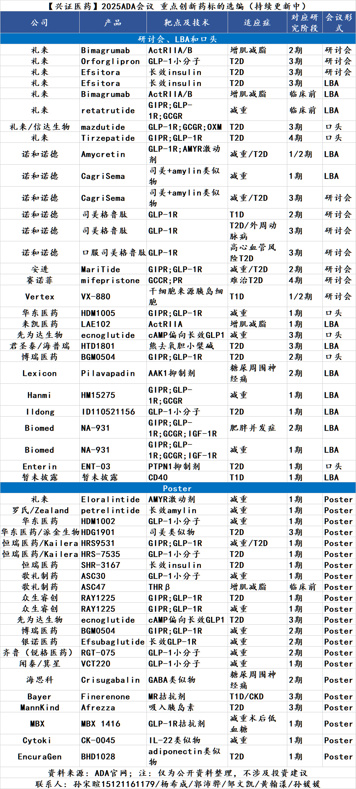
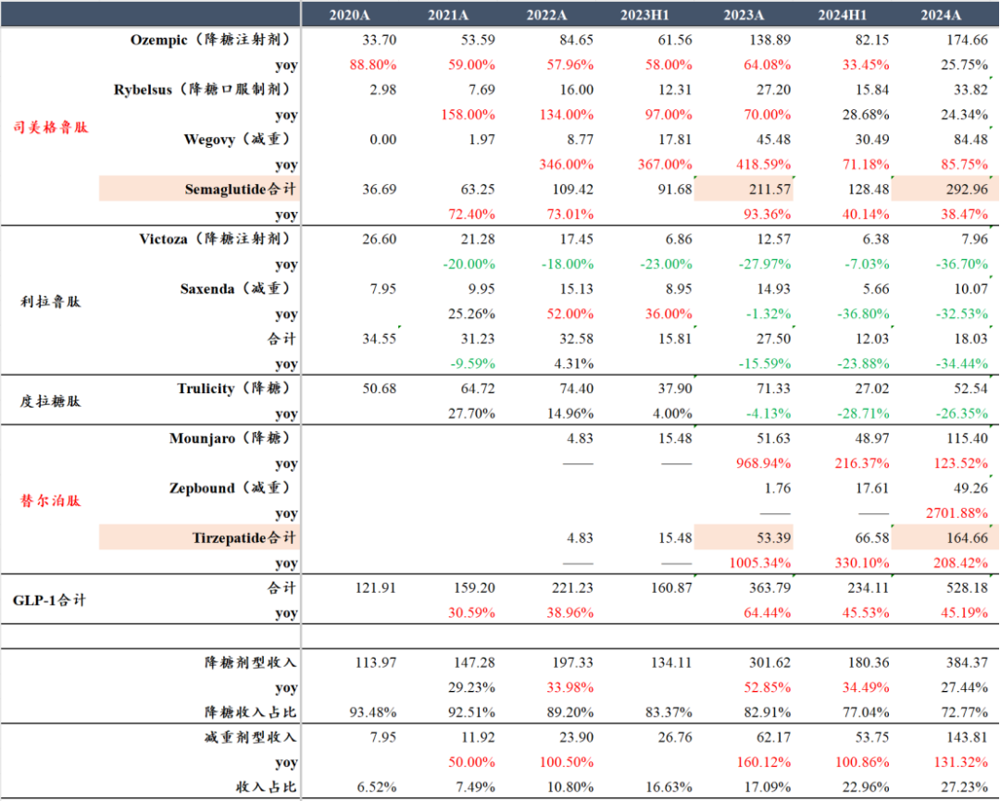
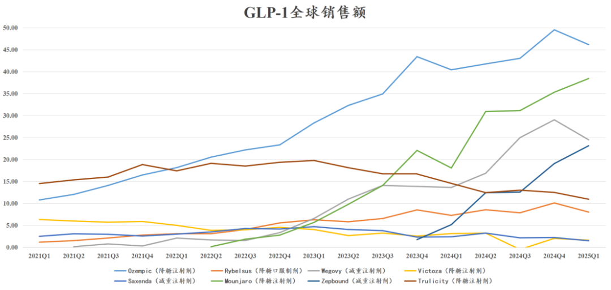
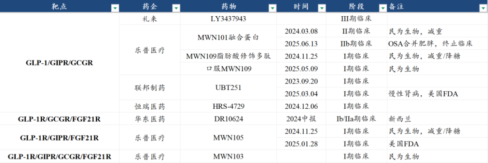
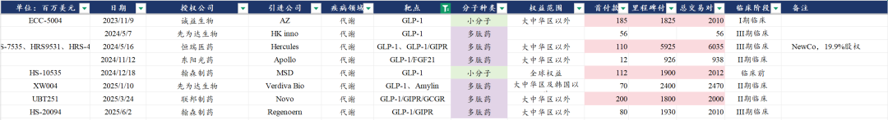

# 创新药顶级大药盛会

大家好，我是龙哥。

前两周曾给大家聊了全球肿瘤药领域最重要的学术会议——ASCO上展示的超预期的创新药临床数据，而在本月下旬6月20日到6月23日，又将迎来另一场重要的学术会议——美国糖尿病协会科学会议（ADA），在ADA上陆续会发布一系列的降糖、减重及糖尿病和肥胖相关并发症的治疗药物的临床前和临床数据，其中尤为重要的是国内及海外一系列的从MNC到biotech公司将会发布的GLP-1类药物的研发数据。

因此在当前这个时间点，我们就GLP-1相关减重药这个全球最重磅药物方向给大家做一些梳理，至于大家可能还会比较关注的减重增肌药物则会后续在其他文章中做梳理。

首先简单复习一下当前GLP-1类药物的全球销售情况，2024年4款主要的GLP-1类药物的全球销售额合计是528.18亿美元同比增长45.19%，这个销售规模已经超过了PD-1/L1类药物在2024年全球销售额525.19亿美元，成为全球第一大药物靶点，并且其增速也显著高于PD-1/L1类药物的13.3%，可想未来这个差距还会进一步扩大。因此，GLP-1类药物已经成为当之无愧的“全球药王”。

从几款药物的销售趋势来看，替尔泊肽的降糖剂型Mounjaro和减重剂型Zepbound呈现最强劲的销售增长趋势，从2025Q1的销售来看，二者的季度销售额都在快速接近司美格鲁肽的降糖和减重剂型，Q1单季度司美全球销售额合计是78.64亿美元，替尔泊肽的全球销售额合计是61.54亿美元。

我们从皮下注射的周制剂和每日的口服制剂两个方向来看当前的全球GLP-1行业的竞争态势，用一篇文章让大家完全了解行业最新研发态势，是绝对值得收藏的一篇文章。

1、皮下注射GLP-1周制剂

在目前所有在研阶段和商业化阶段的皮下注射周制剂GLP-1类药物中，目前大致可以看到三个疗效的分界线，也就是礼来和诺和诺德的世纪大PK的几款药物：

1）诺和诺德司美格鲁肽：大家最熟悉的减重药物，也是最早在全球“出圈”的减重药，2.4mg剂量下的III期临床68周平均减重幅度在13%左右，加剂量还能有所提升，口服司美格鲁肽的减重效果略低于注射司美格鲁肽。

2）礼来替尔泊肽：15mg剂量的III期临床72周平均减重17%左右（安慰剂校正），15mg剂量头对头司美的III期临床减重20.2% VS司美13.7%（非安慰剂矫正）。礼来的替尔泊肽头对头战胜司美，因此呈现出了上文图中相对司美更强劲的增长趋势，超越司美是未来几个季度将很快可以看到的。同样的在国内市场，替尔泊肽也已经开始与司美竞争，未来国内下一代GLP-1的开发也将跳过GLP-1R单靶点的竞争而进入GLP-1/GIPR或GLP-1/GCGR双靶点药物的竞争。

3）礼来Retatrutide：全球首款GLP-1/GIPR/GCGR三靶点药物，12mg剂量的II期临床显示48周平均减重22.1%，按其减重效果的趋势，在72周有望达到25%以上的减重效果。

诺和诺德下一代PK礼来该三靶点药物的司美格鲁肽+Amylin胰淀素类似物的III期临床68周减重22.7%（安慰剂校正前）或20.4%（安慰剂矫正后），略好于替尔泊肽，但与礼来三靶点有差距，导致诺和诺德股价暴跌，随后引进中国的联邦制药开发的GLP-1/GIPR/GCGR三靶点药物，三靶点药物的开发成为下一代GLP-1类药物竞争的高地，另外礼来也在探索替尔泊肽+胰淀素类似物的临床试验。

其他国内外重点公司产品疗效对比：

①信达生物玛仕度肽：信达自礼来引进中国区权益的GLP-1/GCGR双靶点激动剂，6mg剂量的III期临床48周减重14.37%，公司随后开了高剂量组9mg在II期临床24周减重15.4%，但随后48周减重18.6%，虽然好于替尔泊肽的III期表现，但趋势来看减重持续性不佳，在72周的表现依然可能弱于替尔泊肽，信达生物最新开启15mg这个更高剂量组头对头15mg替尔泊肽的II期临床。

②安进AMG133：每月给药一次的GLP-1/GIP双靶点融合蛋白，140mg-420mg剂量Q4W给药，减重效果突出，420mg高剂量下I期临床12周减重接近16%，堪称强悍，140-420mgQ4W的II期临床52周减重20%左右，介乎替尔泊肽与礼来三靶点Retatrutide之间。但该剂量可能会较难做成皮下注射给药，如果是静脉注射给药的话即便其疗效突出可能也很难与居家使用的皮下注射和口服制剂竞争。

③恒瑞医药HRS9531：恒瑞开发的GLP-1/GIPR双靶点激动剂，6mg和8mg的I/II期临床都显示出显著好于替尔泊肽的减重效果，目前启动了皮下注射剂型的III期和口服剂型的II期。

④众生药业RAY1225：9mg剂量Q2W的I期临床24周减重9.35%，表现与司美格鲁肽类似，双周给药有一定优势，但如果在疗效上显著弱于替尔泊肽，也很难在双靶点乃至三靶点药物未来的竞争中夺得一席之地。

⑤博瑞医药BGM0504：15mg剂量II期临床24周减重接近20%、疗效突出，与恒瑞HRS9531的6mg剂量II期临床表现接近，BGM0504目前也处于III期临床。

国内市场除了以上礼来、信达生物、恒瑞医药、博瑞医药、众生药业外，还有翰森制药的双靶点处于III期临床，未来国内双靶点药物的竞争大概率就是以上6家公司占据主要市场。

在三靶点药物市场，中国市场目前有联邦制药的三靶点GLP-1/GIPR/GCGR激动剂授权给诺和诺德，另外有乐普医疗、恒瑞医药、华东医药的几款三靶点乃至四靶点药物推进到临床阶段。

2、口服GLP-1药物

口服GLP-1及后续口服GLP-1/GIPR双靶主要用于因恐针或其他原因而不接受皮下注射剂型的患者，目前看口服GLP-1的减重效果与双靶点和三靶点皮下注射制剂有一定差距（36周减重10%左右）、且需要每天口服用药，因此预计未来主要作为皮下注射周制剂的补充。

但由于整个全球GLP-1用于降糖、减重及其他一系列慢性病的市场规模够大——潜在的千亿美金以上的市场，因此预计未来口服GLP-1仍将分到部分市场——且从绝对金额来说并不会小。口服小分子GLP-1目前主要需要应对的是高剂量下的安全性问题。

目前全球唯一一款获批上市的口服GLP-1是司美格鲁肽的降糖口服制剂Rybelsus，此外其减重口服制剂也已经申报上市。降糖口服司美的销售情况并不算好，占整个司美销售只有10.2%左右、占比还有所下降，此前最高占到17.3%，口服减重制剂上市后可能还能把这个比例提升一些。

①礼来Orforglipron：目前唯一在临床III期（降糖）成功的口服小分子GLP-1（口服司美为多肽药），45mg剂量下II期临床26周减重12.6%、安慰剂校正后减重10.6%，36周减重14.7%、安慰剂校正后减重12.4%。礼来后续选择36mg剂量组推进至降糖适应症III期临床（考虑安全性），36mg剂量组40周减重11%、安慰剂校正后减重10%。

非头对头VS口服司美III期临床68周减重12.7%。

安全性方面，Orforglipron在IIb期临床停药率10%-17%，36-45mg剂量组恶心、呕吐、腹泻发生率为37-48%、14-27%、14-33%。

②辉瑞Danuglipron：因安全性问题已经终止临床的GLP-1小分子，40mg-200mgBID剂量下II期临床减重6.9%-11.7%，安慰剂校正后减重8.3%-13.1%，最高剂量组减重效果略好于礼来Orfor。

安全性方面，Danuglipron在IIb期临床停药率50%，恶心、呕吐、腹泻发生率为73%、47%、25%，且存在肝酶升高的肝脏毒性，在慢病药中属于FDA较为重视的毒性问题。

③恒瑞医药HRS7535：辉瑞骨架的一款口服小分子GLP-1，目前已启动III期临床；最新披露II期临床235例患者给药30mg/60mg/120mg/180mg QD剂量，26周减重效果2.99%-9.3%，安慰剂校正后为减重0.49%-6.8%，其中180mg剂量组36周减重9.5%，安慰剂校正后为减重8.1%。疗效上上与礼来、辉瑞的小分子都略有差距。

此前发布的I期数据4周减重6.7%-9.3%。

安全性方面，HRS7535在II期临床36周停药率2.1%，恶心、呕吐、腹泻发生率为17-54%、16-38%、17-22%，未观察到肝酶升高趋势，总体安全性与礼来Orfor可比，显著好于辉瑞的分子。

④华东医药HDM1002：辉瑞骨架的一款口服小分子GLP-1，目前已启动III期临床；Ib期临床入组60例患者，在50mg-400mg剂量范围内4周减重4.9%-6.8%。

⑤硕迪GSBR-1290：2024年6月发布IIa期临床数据，两项研究治疗12周平均减重6.2%和6.9%（安慰剂校正），副作用导致停药比例5%-11%。2023年9月发布的Ib期数据，30mg/60mg/90mg QD剂量下4周减重1.1%/4.7%/4.9%（安慰剂校正）；轻度副作用比例50-66%，中度副作用比例33-50%。

⑥歌礼制药ASC30：礼来骨架的一款口服小分子GLP-1，Ib期临床剂量爬坡8例患者在2mg/10mg/20mg/40mg QD剂量4周减重6.5%（安慰剂校正），7例患者在2mg/5mg/10mg/20mg QD剂量4周减重4.5%（安慰剂校正）且无患者呕吐。减重效果显著好于礼来、辉瑞，与恒瑞HRS7535、华东HDM1002类似，但歌礼该数据的样本量太小。

过去两年，国内有诚益生物（2023.11）将处于I期临床的小分子GLP-1授权给阿斯利康、翰森制药（2024.12）将处于临床前的小分子GLP-1授权给默沙东。

由此可见，国内小分子GLP-1值得关注的公司主要是恒瑞医药、华东医药、翰森制药、歌礼制药，其中翰森制药一款辉瑞骨架的小分子GLP-1开发至II期临床，一款礼来骨架的小分子GLP-1授权给默沙东；歌礼制药作为国内礼来骨架的小分子GLP-1开发进度最快已经推进到II期临床，市场也对其海外大额BD授权有较高预期。

......

最后还是发福利的时刻，本文中对全球GLP-1类药物的年度/季度销售数据、国内GLP-1类创新药、生物类似药的竞争格局数据，可以分享给大家。

还是老规矩，唯一的要求是过去有对任意一篇文章、有过任意金额的赞赏的读者，都可以在后台留下你的邮箱，龙哥会抽空挨个免费发送。

风险提示：本文仅讨论行业/公司经营情况，投资需综合考虑公司经营、估值、管理层等多方面因素，建议读者审慎参考，本文不作为投资依据，不建议大家根据本文做出投资计划。

<!-- wxmp-comments-begin -->

---

## 留言（17 条，含回复共 37 条）

- **程刚** 👍4 · 2025-06-17 09:57
  牛批的，这篇文章含金量有七八层楼那么高
  - ↳ **作者** · 2025-06-17 10:04
    所以文初说这是值得收藏的一篇哈
  - ↳ **作者** · 2025-06-17 12:03
    所以你每天就好好研究高潮还是退潮，完全没必要研究产业趋势和技术[抱拳][抱拳]
- **Deer6792** 👍2 · 2025-06-17 12:18
  没有常山什么事啊
  - ↳ **作者** · 2025-06-17 12:21
    确实，单靶点的竞争已经没太大意思
- **墨** 👍1 · 2025-06-17 13:43
  龙哥，海思科也做报告，预期怎么样
  - ↳ **作者** · 2025-06-17 22:28
    海思科那个是糖尿病周围神经痛的一个药，和我们讲的降糖、减重还不是一个领域的，他那个药也已经在国内获批上市了，没什么预期差吧。
- **Mr.Yellow** 👍1 · 2025-06-17 21:18
  龙哥，这一波医药行情医疗器械没什么涨幅，能帮忙看一下&nbsp;联影这间公司吗，国内很多医院都是用他们的高端设备。
  - ↳ **作者** · 2025-06-17 22:26
    实际上这波不只是器械没什么涨幅，应该说是创新药和部分CXO以外几乎都没什么涨幅，创新药是独立的逻辑，是技术趋势+国际化的逻辑，并不是说创新药涨了其他行业就都得涨，逻辑是完全不同的。
  - ↳ **作者** · 2025-06-17 22:26
    联影这种大设备公司，未来的重要看点实际上也是出海，只是短期受国内的政策面和采购周期的影响还比较大，尤其是在反腐的大环境下。
- **笑看风云** · 2025-06-17 09:58
  龙哥，金斯瑞的业务能力和业务扩展速度怎么样，我感觉其CDMO业务2025H1应该会继续承压吧
  - ↳ **作者** · 2025-06-17 10:06
    在基因合成这块全球竞争力是毫无疑问的，在CDMO这边确实是做的不算好，再就是传奇生物的股权价值，传奇生物现在尴尬的是如果不被并购的话股东价值兑现逻辑就更复杂一些。
- **一一得一** · 2025-06-17 10:09
  龙哥，想问一下，这么多竞争对手，是不是也意味着后续就是价格战了？
  - ↳ **作者** · 2025-06-17 10:15
    中国市场确实会面临这样的问题，任何一个潜力比较大的靶点基本都是一窝蜂的往上冲，但大家可以看到即便是中国创新药最最最卷的PD-1市场，最终也是走出来几家销售体量挺大的行业龙头，GLP-1作为慢病领域，未来可能还会叠加品牌效应，竞争肯定会激烈，但跑的较快的几家还是能分到部分市场的。另外就是关注技术的进步和进一步的数据。
- **🍵** · 2025-06-17 10:12
  荣昌生物，龙大怎么看？现在估值高吗？
  - ↳ **作者** · 2025-06-17 10:17
    荣昌生物今年拐点还挺明显的，泰它西普的新适应症的突破，股权融资缓解了资金压力，但后续还是要关注费用端控费情况。估值主要取决于泰它西普能不能打开海外市场，没有海外市场的话就是很贵的，打开海外市场的话就还好。
- **季昂** · 2025-06-17 10:15
  龙哥，可以聊聊康方生物吗
  - ↳ **作者** · 2025-06-17 10:16
    康方今年聊了好多次了，也不能怼着一个公司一直讲呀
- **丁山** · 2025-06-17 10:16
  龙哥，有没有以CXO为主的ETF呢？我们散户很难把我个股。
  - ↳ **作者** · 2025-06-17 10:19
    这个确实没有，医药全行业的ETF，我在之前有篇文章给大家梳理过，在今年2月26号的文章。
- **小龙** · 2025-06-17 10:19
  龙哥，可以聊聊药明家族和药明家族的药明生物吗？
  - ↳ **作者** · 2025-06-17 10:28
    你刚关注不太久，可以往前翻翻文章，药明系重点讲过，应该是3月份吧
- **灵感自在** · 2025-06-17 10:28
  龙哥说器械耗材的拐点差不多也要来了，什么时候有空梳理一下？
  - ↳ **作者** · 2025-06-17 10:34
    嗯，器械短期政策还没落地的话就先看α，但我隐约感觉今年器械还是可以高看一眼的，不只是像现在几乎大部分医药投资人all in创新药这样的。
    其实你看像港股的器械β公司威高股份，虽然涨幅不算特别大吧，也走出趋势了。后续有机会会梳理一下这块。
- **木子斤** · 2025-06-17 11:19
  降糖药方面的甘李药业和通化东宝在GLP-1方面研发的如何？
  - ↳ **作者** · 2025-06-17 11:22
    相对落后，未来只能通过糖尿病慢病销售团队去抢少量市场吧。
- **Fang** · 2025-06-17 11:23
  才刷到龙大的新粉，甘李药业为什么不在糖尿病之例呢
  - ↳ **作者** · 2025-06-17 12:24
    甘李主要还是胰岛素集采续约提价和出海逻辑，在GLP-1这块落后了些
- **Lily** · 2025-06-17 11:26
  Hi&nbsp;减肥药怎么没提甘李药业&nbsp;and&nbsp;诺泰生物？多谢百忙中回复
  - ↳ **作者** · 2025-06-17 12:22
    甘李做的还是单靶点的GLP-1，虽然是双周制剂，我认为也没太大机会，可能能凭借渠道优势拿到一点市场吧。
  - ↳ **作者** · 2025-06-17 12:23
    诺泰生物是多肽药CDMO的头部公司之一，就收入体量而言应该是仅次于药明康德的，还是值得关注的，不过本文主要讲的创新药这块，所以没去特别强调
- **景月** · 2025-06-17 12:45
  龙哥，创新药到顶了？先声利好，断头刀/:kn，先声强发利好？
  - ↳ **作者** · 2025-06-17 12:47
    市场对BD太乐观了，还是得尊重客观规律，先声这种BD才1700万美金首付款，之前也是传的神乎其神的。
- **天野源** · 2025-06-17 18:10
  龙哥，器械的心脉医疗现在能看看吗？
  - ↳ **作者** · 2025-06-17 22:27
    心脉总体基本面是处于底部的，只是保守来说的话还是要看主动脉支架集采到底什么情况。
- **果壳** · 2025-06-17 22:16
  龙哥好，请问泰格医药后面怎么看[社会社会][社会社会][社会社会]
  - ↳ **作者** · 2025-06-17 22:24
    可以看上一篇文章

<!-- wxmp-comments-end -->
