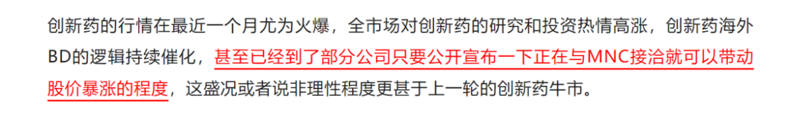
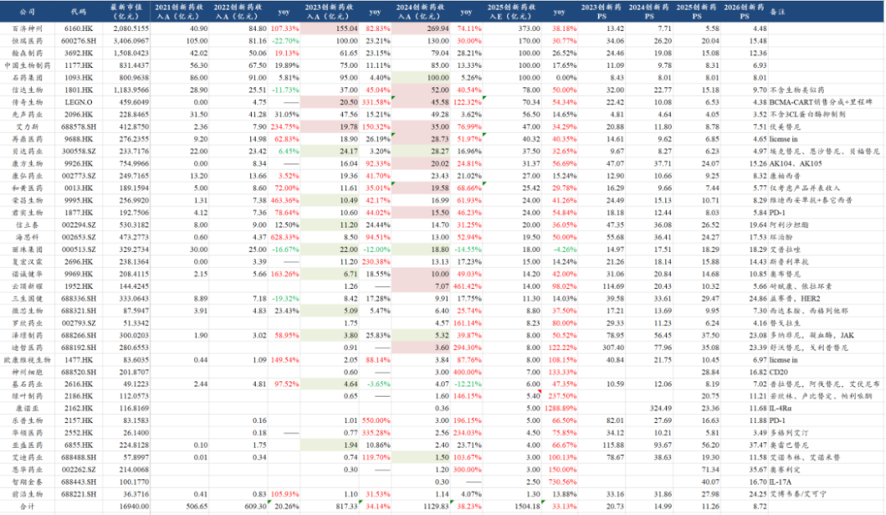
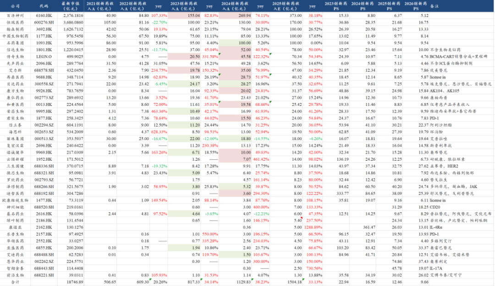
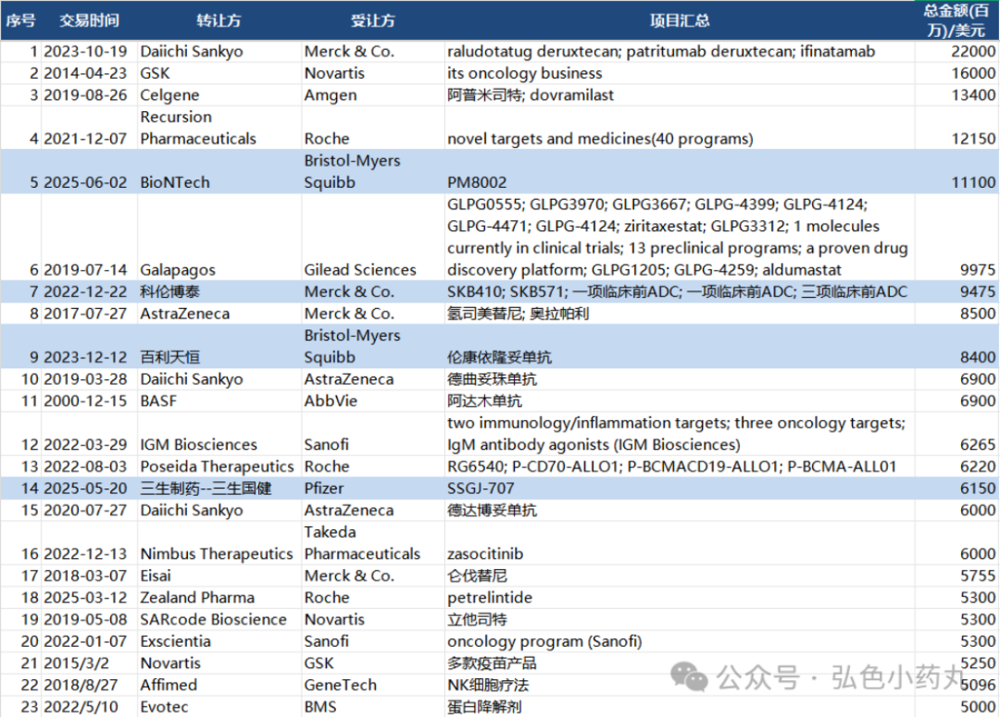
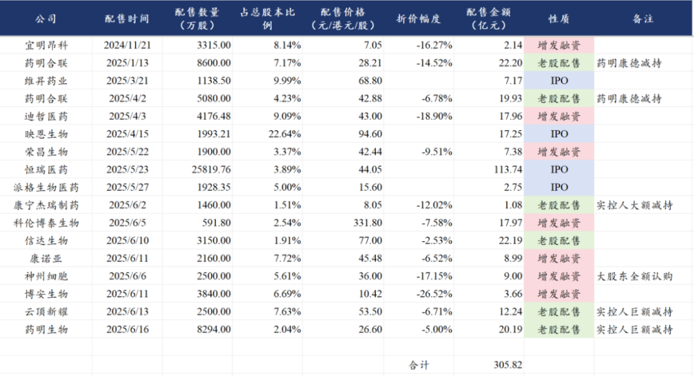

# 创新药目前处于什么估值水平？

今年以来，由部分BD交易授权超预期带来的创新药行情之火热也是近几年仅见的，由于市场对于出海逻辑的重估，带来了包括大量非医药资金涌入，推升了行业的暴涨。

那么市场的归市场，基本面的归基本面，在本周以来创新药板块回调之后，大家也开始趋于冷静，部分此前BD预期极高的公司也开始有退潮，那么这个时候我们来看两个指标，一个是创新药从产品销售端来看的估值处于什么水平？另一个是创新药在二级市场“拿走”多少钱？

1、行业估值

首先第一个问题，我们这里看的是产品销售端计算的PS估值，这里是剔除掉BD交易授权部分的收入的，由于部分公司的BD授权交易部分的收入实际上占了收入的大头，因此仅计算产品销售部分的收入显示的行业平均的PS肯定是要比实际的PS要高。

但我们看产品销售端的PS有两个意义，其一是看哪些公司是“绝对低估”，其二是BD交易从行业层面这两年高发、从企业层面则是偶发，那么最终还是要回归常态化的产品销售或销售分成角度来看长期业绩及估值的大头。

2025年6月19日创新药行业公司PS估值

2025年6月12日创新药行业公司PS估值

我们来分别看两个时间点的行业PS估值，一个是截止到昨天的，另一个是截止到上周五——行业指数最高点的。

这里我们统计的39家有至少一个或者多个创新药商业化的中国创新药上市公司，截止到6月12日的行业指数本轮高点，合计市值是18747亿元，预计25年合计的创新药收入约为1504亿元同比增长33%，预计2026年合计的创新药收入约为1940亿元同比增长29%，对应的PS估值为12.46倍和9.66倍。

这个估值是个什么概念呢，就是从龙哥过去几年跟踪创新药行业来说，在可比的条件下计算的行业平均的PS估值水平达到10倍左右，大概就是行业估值修复到合理的水平，那么在这轮的创新药热潮下，行业到6月12日的本轮高点，估值被拉到了12.5倍，大概相当于是透支到了2026年的估值。

以上估值的瑕疵之处也是没有反映BD交易带来的估值增量，毕竟本轮创新药的核心上涨逻辑来自出海的预期提升，而国内部分产品销售贡献的估值只能说是作为“基本盘”。不过BD交易部分的估值预期实际上也更多在没有产品商业化的公司中表现的会更为突出。

对于创新药的BD带来的收入利润和潜在的远期海外市场能带来的长期利润和估值，我们在此前的文章中多次聊到，如《[创新药宏大叙事](https://mp.weixin.qq.com/s?__biz=MzkyMzQ3MDc3Mw==&mid=2247484619&idx=1&sn=9c50a7c53e83a5c5b592a0a46e33b026&scene=21#wechat_redirect)》中的分析，从行业层面我们可以对此进行分割来看待，当然回到具体的公司层面则是合并来看。

上图中我们还更新到了最新6月19日也就是昨天的估值，截止到昨天以上39家公司的合计市值大概是16940亿元，对应25-26年的创新药销售端的PS估值约为11.26倍和8.72倍，相较6月19日的高点，行业的总市值和平均PS估值都回落了10%左右。

以上统计未包含如百利天恒、新诺威、科伦博泰等市值较大但尚无创新药商业化或者创新药刚开始商业化的公司，随着如科伦博泰等公司的创新药开始进入初步的商业化，也会逐步纳入进来。

以上估值讨论的是行业平均水平，但实际上我们看图中的数据，各公司的估值差异还是蛮大的，有的是和产品结构有关，有的是和国际化预期有关，有的是和创新药占比有关，也有的是市场尚未发掘或者预期过高的，这就见仁见智了，但对于估值绝对值比较低的，还是可以重点去看看的，尤其是预期低、存在潜在边际变化的公司，像这两个月涨幅最为突出的公司之一——荣昌生物——就是此前PS估值最低的公司、没有之一，近两个多月涨了2倍。

对于重磅BD授权的预期，也要相对理性的去做判断，借用弘则医药的小伙伴统计的数据来看，创新药行业历史上总交易金额超过50亿美元的一共有23笔（加上上周五的石药的那笔就是24笔），因此动辄50亿美元的BD交易预期实际上是不现实的，还是要尊重行业客观规律，更何况对于某些BD交易来说，总交易对价做的看上去规模很大、实际上首付款和潜在能拿到的里程碑付款都极少，除了忽悠忽悠不懂创新药的外行，也并不会带来长期价值的大幅跃迁。

2、行业融资和减持

创新药行业需要持续烧大笔研发费用的特点，使得行业景气度或者说研发投入强度很大程度上要依赖一二级市场融资，这也是为什么过去几年我们多次讲到，上一轮的创新药牛市是成也资本市场、败也资本市场。

2018年港股18A和2019年3月科创板第五套规则分别在港股和A股开始允许未盈利生物科技公司IPO上市，很大程度上促进了创新药行业借助一二级市场融资的能力，也同时很大程度上助力了国产创新药行业研发方面的爆发，但是同时也促成了上一波创新药估值的全面泡沫化，行业供给端过度内卷、实际研发端又在肿瘤免疫领域出现多个重磅靶点的全面失败、创新药出海逻辑破灭，行业一落千丈。

创新药行业要发展，必然无法脱离资本市场的支持，但相对理性、长期可持续的资本市场支持才能真正带来行业长期健康良性的发展，因此我们作为医药投资人来说，也并不希望看到如近期这样的鸡犬升天式的疯狂炒作，毕竟每次的鸡犬升天过后都必然是一地鸡毛，也会导致劣币驱逐良币——喜欢玩资本运作的企业借机通过各种花样炒概念、市值反而可能比踏踏实实做业务的企业更高的多。

2024年底以来主要创新药、CXO公司二级市场融资、减持情况：

从22年底宜明昂科的配股以来，一系列的增发、减持、IPO融资等，尤其是以港股市场为主，合计的规模大概是300亿元（其中神州细胞的增发为大股东全额认购），我们知道港股市场的流动性实际上远不如A股，从港股市场抽走接近300亿的资金在短期来说确实也不算小数目。

其中尤其突出的，是药明系的减持，药明康德和药明生物在药明合联上市后陆续做了多笔的减持，另外在周一药明生物的实控人也进行了20亿的股份减持，我愿称李革为医药行业资本市场最伟大的操盘手，没有之一。

......

总体来说，行业回调、热度下降之际，也是大家可以冷静下来思考的时候，创新药在一轮鸡犬升天后，相信后续的分化会尤其显著，这个时候回归讨论基本面和估值，意义重大。

风险提示：本文仅讨论行业/公司经营情况，投资需综合考虑公司经营、估值、管理层等多方面因素，建议读者审慎参考，本文不作为投资依据，不建议大家根据本文做出投资计划。

<!-- wxmp-comments-begin -->

---

## 留言（20 条，含回复共 39 条）

- **-Jasper** 👍8 · 2025-06-20 10:38
  A股减持还要排队，港股一把到位，更体现李哥操盘手的能力
  - ↳ **作者** · 2025-06-20 10:41
    医药投资简单化→跟着李哥走
  - ↳ **作者** · 2025-06-20 10:53
    调侃哈，别较真[偷笑]
- **田野** 👍6 · 2025-06-20 10:35
  创新药行业历史上总交易金额超过50亿美元的一共有23笔——但是现在感觉50亿的交易变成了的大白菜，家家都预期10亿美金首付+50亿美金总额了！
  - ↳ **作者** · 2025-06-20 10:36
    哈哈，所以还是要回归现实[打脸][打脸]
- **叶** 👍6 · 2025-06-20 10:41
  百济还是相对低的
- **JMTerry** 👍6 · 2025-06-20 11:00
  李哥就是烦，技术他们最好，骚操作也是他们最多
- **lllllllll** 👍6 · 2025-06-20 12:07
  龙哥，当大家还在讨论到底泡不泡沫，那感觉还远远没到泡沫
  - ↳ **作者** · 2025-06-20 12:08
    [破涕为笑][破涕为笑][破涕为笑]这种没法作为投资逻辑，我们还是用数据说话哈
- **步入森林** 👍6 · 2025-06-20 12:52
  感谢龙哥分享，虽然一直持有恒生医疗，但不知道估值高低，就只能啥都不操作，现在大体明白了
- **阿葱** 👍4 · 2025-06-20 10:31
  到最后还是159892拿着安稳[破涕为笑]
  - ↳ **作者** · 2025-06-20 10:33
    所以啊，不得不再次提到，普通投资人要赚钱还是得看好行业的情况下靠买ETF，自己买个股的方差太大了。
  - ↳ **作者** · 2025-06-20 10:36
    嗯&nbsp;不过投资这种东西总归是得自己吃过亏才能醒悟&nbsp;甚至亏过都不一定能悟[偷笑]
- **Seplues** 👍4 · 2025-06-20 10:46
  和黄怎么看？下半年有机会吗？这轮都没怎么涨~
- **天野源** 👍4 · 2025-06-20 11:03
  龙哥，科创板又放开未盈利企业上市了，据说有几百家医药企业等着上市。那一二级市场也起来了，那接下来是不是轮到国内CRO表现了。您几时也梳理下这几家企业吧[呲牙]
  - ↳ **作者** · 2025-06-20 11:10
    上周五的文章写的不就是这么个事嘛
- **Guts** 👍4 · 2025-06-20 11:38
  龙哥，既然公司分化显著，那对etf影响大吗，是不是近段时间基本就是震荡了
  - ↳ **作者** · 2025-06-20 11:47
    嗯，指数毕竟哐哐涨了这么多，短期涨了60%+，也要尊重客观市场规律
- **洪易** 👍3 · 2025-06-20 10:33
  龙哥，爱博这种眼科耗材，一般能给到什么样的估值？按PE的话，20-30倍合理么？
  - ↳ **作者** · 2025-06-20 10:35
    看成长性咯，24年四季度以来的这几个季度肯定是公司业绩压力最大的时候了，几项业务有不同方面的压力，公司利润端重回高增长可能要到25Q4到26年了。
- **牛马嘉** 👍3 · 2025-06-20 11:09
  科济药业，是国内CAR-T的龙头吗？
  - ↳ **作者** · 2025-06-20 11:11
    之一吧，领头羊是传奇生物，不过传奇生物除了在美国已经商业化的CARVYKTI以外后续管线推进相对慢了点，科济目前在通用CART算是国内走在前列的。
- **适意** 👍3 · 2025-06-20 11:50
  龙哥，恒瑞ps高是没有计入BD授权吗
  - ↳ **作者** · 2025-06-20 12:07
    恒瑞是只计入了创新药收入，不含仿制药和BD收入，所以表观的这个PS肯定是偏高的。
- **人过中年** 👍2 · 2025-06-20 10:34
  是否可以提供一些低估的票供参考呢？
  - ↳ **作者** · 2025-06-20 10:39
    你要要的内容就在文章里呀，文中的表格里，自己去翻翻看
  - ↳ **作者** · 2025-06-20 10:51
    其实这个表格，我之前也给部分读者分享过数据底稿的，5月30号的文章里
- **王熙** 👍2 · 2025-06-20 10:35
  港股的百济神州连跌4个月，而且PS也才5倍，这么弱的原因是高瓴资本减持？&nbsp;还是要在8月的财报发布？&nbsp;或者是6月26日新研发管线发布？
  - ↳ **作者** · 2025-06-20 10:40
    百济基本是完全错过这波2个月的创新药行情，炒小炒边际变化的阶段这种大市值公司包括恒瑞肯定是吃亏的，同时我个人会关注的百济的风险点还是美国的药品政策会发生哪些变化的问题。
- **吕昊** 👍1 · 2025-06-20 10:39
  龙哥，请教下，泰爱如果能够BD出去对于荣昌的估值是不是会有比较大的提升。
  - ↳ **作者** · 2025-06-20 10:42
    能BD出去肯定是会有提升，就是这BD也不是传了一年两年了,,
- **生而自由20151021** 👍1 · 2025-06-20 10:45
  点评一下和黄医药的ATTC平台呗
  - ↳ **作者** · 2025-06-20 10:47
    这个还是值得关注的，就是还处于临床前，啥东西都还没展示，也没啥好点评的，等他们分子推到临床、给大家展示一些数据才好点评呀。
- **MessiahV** 👍1 · 2025-06-20 11:13
  药明生物也没咋涨，为啥要减持呢
  - ↳ **作者** · 2025-06-20 11:18
    李哥在11块增持的，26块多减持的[撇嘴]
- **老土二** 👍1 · 2025-06-20 15:18
  龙哥说说若诚健华吧，一个投票日咋跌的这么狠？
  - ↳ **作者** · 2025-06-20 15:54
    这和投票有啥关系，你没见行业指数跌啥样嘛[捂脸]
- **嘀嗒** 👍1 · 2025-06-20 15:26
  龙哥，爱博昨天开完股东大会今天就放量大跌，知道是为啥吗，又有啥利空了。
  - ↳ **作者** · 2025-06-20 15:55
    应该就是全年利润指引给的不乐观

<!-- wxmp-comments-end -->
