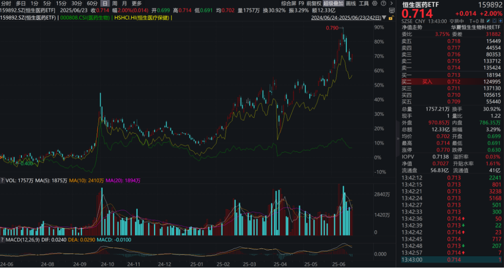

# 创新药后续还有哪些潜在重磅BD

大家好，我是龙哥。

在三生制药的那笔重磅BD授权之后，多次有读者想让龙哥写写还有哪些公司的重点品种有可能进行海外BD，本文就给大家聊聊。

文初还是要再和大家强调一下，下文分析的内容都是根据目前的全球创新药市场情况和偏好来做的分析，创新药行业变化非常快且大，需要持续的跟踪行业数据和研发进展。

全球创新药历史来看真正能达到数十亿美金的单品种BD非常有限，仅有24笔，其中单品种BD总交易对价超过50亿美金的只有10笔，且具有较高的预测难度。

因此过去2年龙哥一直一直在强调的是，大部分个人投资者投资港股创新药及创新药以外的大部分行业，最好的方式永远都是ETF，如159892恒生医药ETF。

回到正题，我们来梳理一下目前上市公司创新药管线里在今明年还有机会达成较大规模的海外BD授权的公司。

①信达生物PD-1/IL-2α融合蛋白：在《[创新药重磅催化落地](https://mp.weixin.qq.com/s?__biz=MzkyMzQ3MDc3Mw==&mid=2247484610&idx=1&sn=840972449340d85b5fa31195d262ee93&scene=21#wechat_redirect)》中我们讲到其此前披露的在IO经治的非小细胞肺癌患者中的I期临床数据，取得了OS的显著获益，使其取得了争霸全球下一代IO疗法的入场券，信达已经在国内启动一项黑色素瘤的注册临床，后续在IO经治NSCLC、结直肠癌会陆续启动III期临床。

IO疗法在近几年达成过一系列的重磅BD授权，2022年底以来的康方生物也激活了PD-1/VEGF双抗的研发热度，预计信达生物作为国内PD-1/IL-2α双融合蛋白的领军企业，也可能带动该领域的研发热度和BD可能性。

②石药集团/新诺威EGFR-ADC：公司已经比较久对外传递大额BD预期的品种，石药集团过去对外交流的口径一直是以比较浮夸为著称，对外给的预期和指引能落地的都非常有限，本次创新药的BD授权，在前两周落地了一个50亿美金总交易对价的AI药物发现平台的合作，虽然首付款1.1亿美元有些低于预期，但总归是落地了一个。

EGFR ADC目前石药开了二线EGFR TKI耐药NSCLC的III期临床，未来还有潜力与TKI联用突破到一线疗法，市场也给石药集团和石药新诺威较高的预期。

另外根据石药集团的指引，除了以上两笔以外，今年年内可能还会有另外一笔总交易对价达到50亿美元的技术平台BD授权落地。

③复宏汉霖PD-L1 ADC：公司此前在ASCO上发布了PD-L1 ADC的I期临床非小细胞肺癌的临床数据，展现较好的疗效和安全性，作为一款广谱抗肿瘤疗法，也被寄予较高的预期，目前公司启动了国际多中心II期临床，海外同靶点以MMAE毒素的辉瑞/Seagen的PD-L1 ADC已经启动了III期临床。

另外复宏汉霖还有一款在胃癌上临床数据非常卓越的HER2单抗HLX22也同样具有全球竞争力，目前已经在中、美、欧启动全球多中心III期临床。

④再鼎医药DLL3-ADC：在《[创新药重磅催化落地](https://mp.weixin.qq.com/s?__biz=MzkyMzQ3MDc3Mw==&mid=2247484610&idx=1&sn=840972449340d85b5fa31195d262ee93&scene=21#wechat_redirect)》、《[创新药战略眼光之最](https://mp.weixin.qq.com/s?__biz=MzkyMzQ3MDc3Mw==&mid=2247484599&idx=1&sn=5ab89fbff32f4a1b1c0ff9750ce69cba&scene=21#wechat_redirect)》我们也介绍了DLL3-ADC的情况和ASCO上发布的数据，在二线SCLC的I期临床展现出最好的疗效和安全性，公司考虑在近期规划首个注册临床，如果有好的BD交易对价的话可以考虑BD，公司目前账上现金充裕，也不排除自己做国际多中心注册临床。

⑤中国生物制药PDE3/4：公司自己官方发布的消息表示近期将有一笔标志性的重磅对外授权交易落地，大概率就是PDE3/4，公司也在前几天刚刚启动了该新药治疗慢阻肺（COPD）的国内III期临床。

⑥来凯医药ActRIIA单抗：潜在重磅减重增肌药物，目前在海外与礼来的GLP-1类药物进行联用的临床探索。GLP-1类药物的减重减掉的体重有相当一部分都是肌肉，但如果停药后出现复胖反而涨回来的大部分是脂肪，这个过程可能导致肥胖患者的体脂率进一步提升，因此在当前减重药开发的基础上，后续各家也希望开发可以减重不减肌或者减重增肌的药物，来凯的ActRIIA就是目前市场关注度还相对较高的一个靶点，来凯医药目前在国内开发进度较为靠前。

另外国内其他biotech像宜明昂科也开始跟进该靶点的药物，且宜明昂科在临床前还开发了一款GLP-1/ActRIIA的分子。

⑦歌礼制药口服小分子GLP-1R：上周的文章《[创新药顶级大药盛会](https://mp.weixin.qq.com/s?__biz=MzkyMzQ3MDc3Mw==&mid=2247484641&idx=1&sn=93ea4ad9f85d4cd6e44e997fc2754266&scene=21#wechat_redirect)》和大家聊了GLP-1领域目前国内外的新药开发情况，小分子GLP-1作为皮下注射周制剂的补充，预计未来也可以分到部分市场份额，整个GLP-1降糖、减重及其他更多适应症的市场规模够大，使得该领域稍微切一块市场都有机会做到较大的规模。

⑧益方生物TYK2抑制剂：益方生物在去年底发布了其TYK2抑制剂的II期临床数据，表现极为惊艳，已经可以与生物制剂的疗效正面PK，远好于BMS的TYK2抑制剂，与武田制药以40亿美元首付款+20亿美元里程碑付款收购的TAK-279疗效可比，因此益方生物的该TYK2抑制剂也被寄予厚望，后续在IBD适应症上如也能有较好的表现，大额海外BD的概率将会大幅提升。

⑨康方生物PD-1/CTLA-4：康方生物AK104在此前披露的临床数据显示在一线胃癌和一线宫颈癌实现全人群获益，我们知道美国FDA现在要求PD-1只能用于PD-L1阳性的胃癌一线治疗，而PD-L1阴性患者还是只能用化疗，而AK104有望占据占比达到70%的PD-L1阴性胃癌人群。除了宫颈癌和胃癌，康方AK104目前还在进行肝癌辅助、一线PD-L1阴性肺癌、序贯放化疗的局部晚期NSCLC维持治疗等适应症的III期临床。康方也在规划AK104在海外的开发计划——不论是否在短期能达成BD授权。

⑩荣昌生物泰它西普：泰它西普今年来在新适应症取得进展，其在国内新获批了gMG重症肌无力适应症，目前还有IgA肾病、干燥症、NMOSD等适应症在国内外推进III期临床，作为自免领域一款颇具潜力的药物，海外也不排除有BD的可能性，不过这个BD授权预期毕竟已经拖了很多年。

除了以上品种以外，还有一些公司的品种可能会有BD授权，这里不一一具体去介绍了，简单列举一下其他可能BD的重点品种，例如：远大医药的脓毒血症新药STC3141，泽璟制药的DLL3/CD3三抗，一品红的URAT1抑制剂（海外权益在海外参股公司手里），诺诚健华的TYK2/JAK1双靶点抑制剂，映恩生物的HER3 ADC、PD-L1\*B7-H3 ADC，康宁杰瑞的HER3\*TROP2 ADC，君实生物的DKK1等等，在IO双抗/三抗赛道还有神州细胞、君实生物、华海药业、荣昌生物、基石药业等一批公司在等待MNC的临幸，或许还有机会赶上末班车。

除了以上单个品种的授权外，还有部分公司的技术平台可能进行BD授权，例如：晶泰控股、英矽智能、石药集团等公司的AI药物发现平台，和铂的人源化纳米抗体平台，映恩、科伦博泰的ADC药物平台，科济药业的通用CAR-T平台，康弘药业的基因治疗药物平台，以及乐普旗下民为生物的一系列GLP-1三靶点乃至四靶点药物。

......

总体来看，对于BD授权模式下的国产创新药出海，我们在当前市场还是要理性客观的去看待，一方面是尊重客观事实——超大规模BD交易毕竟是罕见的，另一方面也不要妄自菲薄——国产创新药的全球竞争力的的确确在持续强化。行业β是相对容易判断的，159892恒生医药ETF仍是大部分普通投资人的首选。

个股方面，对于大部分创新药biotech/biopharma的投资模式，预期和估值低的时候更多进行的是定性分析，也即创新药在国内和海外能否成药、能否做大的BD授权或者能否被并购；预期和估值高的时候则要更谨慎的做定量分析，也既即新药的全球竞争格局、潜在渗透率和份额、销售分成等等。

风险提示：本文仅讨论行业/公司经营情况，投资需综合考虑公司经营、估值、管理层等多方面因素，建议读者审慎参考，本文不作为投资依据，不建议大家根据本文做出投资计划。

<!-- wxmp-comments-begin -->

---

## 留言（17 条，含回复共 37 条）

- **小草乙⅝** 👍6 · 2025-06-23 16:39
  感谢分享，说实话，创新药对我们这些外行来说真看不懂，所以一直买的是etf
  - ↳ **作者** · 2025-06-23 16:44
    对啊，逻辑是这样，创新药学习难度还是非常大的
- **宏～** 👍6 · 2025-06-23 16:39
  非常专业的文章，持续跟踪，非常感谢
  - ↳ **作者** · 2025-06-23 16:48
    [抱拳][抱拳][抱拳]
  - ↳ **作者** · 2025-06-23 17:44
    信诺维呢？
- **别来无恙** 👍4 · 2025-06-23 16:43
  亚盛医药的APG&nbsp;2575没有BD预期吗
  - ↳ **作者** · 2025-06-23 16:49
    这个有点类似荣昌的泰它西普，预期肯定有，只是确实拖了好几年没落地，大家也有点疲了，预期还是有的。
- **宇文大大爷** 👍4 · 2025-06-23 17:39
  金斯瑞生物的重点是哪些？
  - ↳ **作者** · 2025-06-23 17:47
    金斯瑞的创新药就是在传奇生物，传奇生物Carvykti已经在16年就授权强生，DLL3 CART也在23年底授权诺华。
- **虞涛** 👍3 · 2025-06-23 16:41
  请教下龙哥，君实生物后续有大的催化嘛？特瑞普利单抗是不是还有一段持续的开发和增长？谢谢。
  - ↳ **作者** · 2025-06-23 16:48
    特瑞普利拿了几个大适应症的医保，这两年的放量趋势挺确定的。君实主要还是要看后续承接PD-1的还有哪些品种，前阵子我也去公司聊了下，目前看就是PD-1/VEGF双抗开始加快开发进度，然后有个DKK1在肠癌不错。
- **吕昊** 👍3 · 2025-06-23 17:04
  感谢龙哥分享，有个问题想请教下，A+H股上市的公司市值应该如何计算？
  - ↳ **作者** · 2025-06-23 17:09
    算估值就各算各的呀，A股估值是按照A股的总市值算（A股股价*总股本），港股估值按照港股总市值算（H股股价*总股本）。
- **麦茫** 👍3 · 2025-06-23 17:17
  请问龙哥，常山的艾本那肽在降糖减重方面是不是很有预期。
  - ↳ **作者** · 2025-06-23 17:18
    只有降糖没有减重，单靶点降糖也没太大意义。同靶点比他更早获批上市的公司估值也只有他的十分之一不到，别较真[旺柴]
- **曾文** 👍3 · 2025-06-23 17:21
  甘李药业有何预期吗？
  - ↳ **作者** · 2025-06-23 17:33
    他主要还是胰岛素的出海吧，创新药这块确实弱一些
- **天野源** 👍3 · 2025-06-23 17:34
  龙哥，国内CRO企业的股价会不会也有二阶导，就是机构跟踪到它们的订单情况变好，不等业绩变好，就先涨了？
  - ↳ **作者** · 2025-06-23 17:36
    这不一直就是这么说的吗，会提前反映啊
- **John** 👍2 · 2025-06-23 16:45
  迪哲的舒沃哲和众生药业的有可能吗
  - ↳ **作者** · 2025-06-23 16:51
    迪哲的两个药都有可能，就是两个药适应症都不大，现行的IRA法案下海外药企做小适应症的意愿会下降。
- **丁山** 👍2 · 2025-06-23 17:01
  龙哥，根据你前面的文章把益诺思，昭衍新药，普蕊斯，诺思格和泰格医药，这几个以国内业务为主的CXO做一个组合怎么样？毕竟以海外业务为主的那几家面临着政治风险。
  - ↳ **作者** · 2025-06-23 17:08
    第一创新药向CRO的传导，先传导到订单，再传导到业绩，还需要较长的时间，估计得半年到一年，当然如果实际业绩反转股价也会提前反映。
    第二CRO里质地差别也挺大，可以适当的看一下质地和估值，剔除个别公司。
  - ↳ **作者** · 2025-07-16 21:55
    普蕊斯质地如何？在SMO这一块竞争力怎么样？
- **Munjuicekwai** 👍2 · 2025-06-23 17:03
  请教龙哥&nbsp;来凯今天大跌的原因是公布LAE102&nbsp;I期SAD研究结果低于预期吗
  - ↳ **作者** · 2025-06-23 17:11
    我感觉就是bima发数据的时候来凯有点纠结，bima数据太好他也不行（礼来买他的预期降低），bima数据太差也不太行（靶点成药性有问题）。不过这都是市场短期可能纠结的问题，不是核心矛盾。
  - ↳ **作者** · 2025-06-23 17:32
    就是说啊，可能里面的资金提前交易这个预期比较纠结吧，我猜
- **悦霖同辉** 👍2 · 2025-06-23 17:09
  感谢一路有你的及时分享和知识普及，受益匪浅，多谢！！！
  - ↳ **作者** · 2025-06-23 17:12
    [抱拳][抱拳][抱拳]
- **武** 👍2 · 2025-06-23 17:15
  创新药这玩意太难懂。等琢磨懂都完事了行情，就买etf就好了
  - ↳ **作者** · 2025-06-23 17:20
    这就是我过去两年一直在说的事啊，也是上一波牛熊我得出的结论，不论什么样的公司，最终一轮牛熊过去还是大部分人亏钱，的确不如ETF。
- **宇文大大爷** 👍2 · 2025-06-23 17:35
  赶紧收藏起来
  - ↳ **作者** · 2025-06-23 17:36
    [666][666][666]
- **caoguoan** 👍2 · 2025-06-23 22:17
  龙哥，神州细胞增发大股东全额认购怎么看？[抱拳]
  - ↳ **作者** · 2025-06-23 22:29
    今天本来想写神州细胞来着，下午一看已经爆拉了，算了先写个这个吧，神州细胞下次热度降一降再写[捂脸]
- **伊豆的卡夫卡** 👍1 · 2025-06-23 18:13
  晶泰控股利好公告，却暴跌，是不及预期吗
  - ↳ **作者** · 2025-06-23 19:05
    应该是有不少埋伏的资金，利好落地兑现，结果被砸成这样。。。。

<!-- wxmp-comments-end -->
