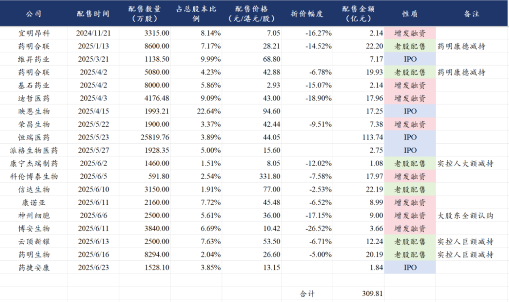
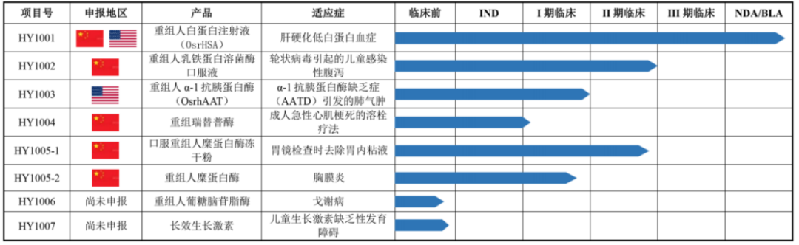
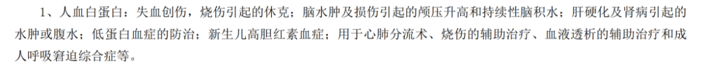
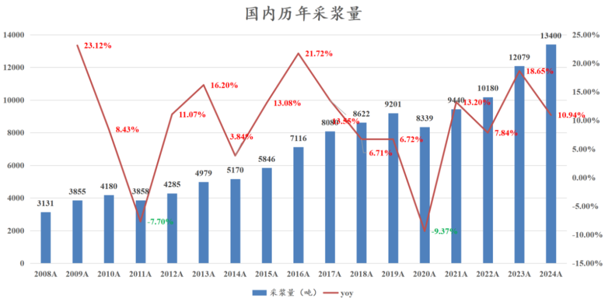
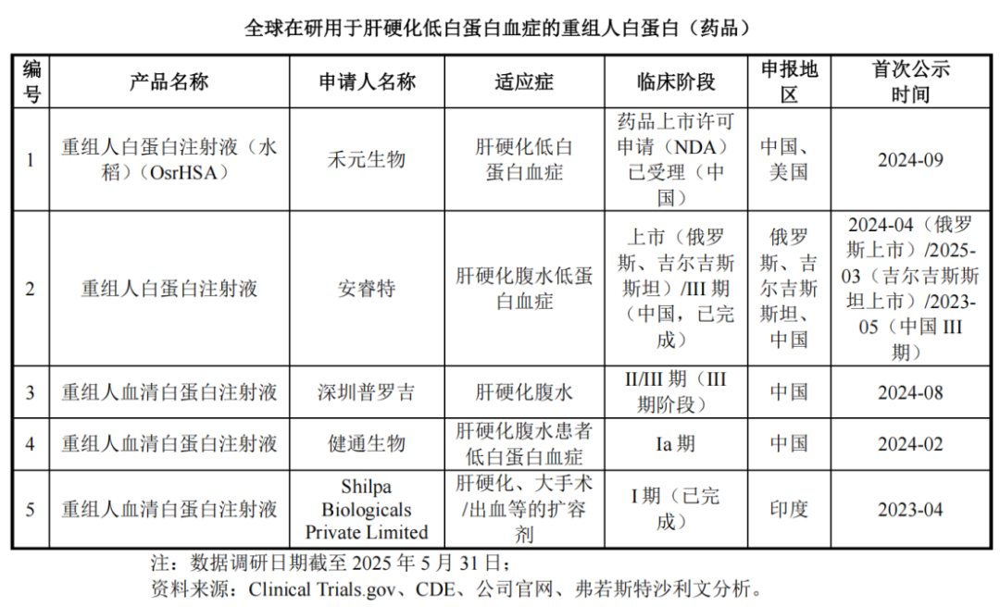
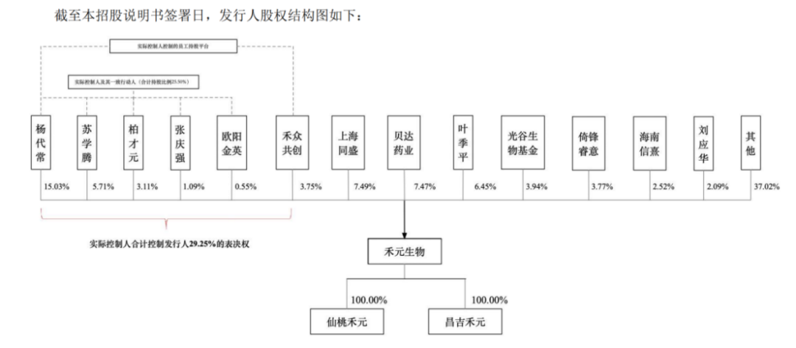

# 创新药行业重磅-科创板重新开放

大家好，我是龙哥。

昨晚，科创板第五套规则收紧2年后，终于再次迎来一家以科创板第五套规则申报的创新药公司——武汉禾元生物，对于创新药及产业链来说是一个较为重磅的消息，这里龙哥必须要和大家聊聊这个事。

首先经历上一轮医药大牛市的投资人必然都有记忆，2018年8月正式开启的港股18A和2019年3月正式开启的A股科创板第五套规则，是上一轮创新药及CXO行业牛市的基础，一系列优秀的创新药公司及CXO公司陆续在港股和A股上市，不但大大丰富了AH的创新药及产业链投资标的，而且很大程度上带动了一二级市场融资，共同促成了2019-2021年的医药牛市。

一二级市场融资对于创新药和CXO行业是如此的重要，尤其是二级市场融资——二级市场的IPO给了一级市场退出的通道，因此可以大大增强一级市场融资的信心，一二级市场融资共同构成了创新药biotech、biopharma的重要资金来源，直接影响行业研发投入强度。

也因此，2019-2021年的医药大牛市里我们看到创新药行业持续增加研发管线、员工人数快速增长、研发投入持续增长，创新药公司管线估值提升的同时也大幅拉动了CRO/CDMO行业的订单和业绩。

而在2022-2023年的医药大熊市里我们看到创新药行业大量公司裁员、研发投入收缩，逐渐传导到23-24年CRO行业订单到业绩的下滑压力。

在这个时间点，二级市场对创新药的预期已经有大幅修复，如上图所示，港股18A的增发和IPO融资陆续恢复正常，港股创新药IPO快速增加（近期还会有几家陆续上市，上市后表现也显著改善），而科创板第五套规则最后一家IPO的公司智翔金泰在2023年6月20日正式上市、至今已经整整2年没有新的第五套规则上市，直到昨晚武汉禾元递交上会稿，上交所上市审核委员会将在7月1日进行审议，对于创新药行业来说着实是又一个令人振奋的消息。

这里我们再简单讨论两个方面的内容，第一是关于武汉禾元，第二是关于CXO。

1、武汉禾元生物

禾元生物成立于2006年，此前不多的收入主要来自一些药用辅料和科研试剂，其估值主要来自在研项目，目前在研发阶段的在研管线有8个，其中大家关注度最高的就是重组人白蛋白注射液（HY1001）。

血液制品是我们过去时常聊到的一个赛道，作为医药资源品，尤其是在前两年的医药大熊市里血制品曾一度作为医药的“镇仓石”，尤其是22年底疫情放开后血制品曾迎来一波极高的景气度，23年全行业杀跌的情况下血制品几乎是一枝独秀。

中国血液制品行业最大的品种就是人血白蛋白，这两年国内的需求量大概在9000万瓶左右（折合10g/瓶），按照终端价平均330-370元/瓶，这是一个终端市场超过300亿、出厂口径超过200亿的超大单品。血制品的用途我直接截一个血制品公司年报里的内容如下图所示，其广泛的适应症应用范围是其成为超大单品的核心原因。

再展开一点说血制品用于重症、烧伤等领域是具有战略价值的......因此人血白蛋白提高国产化率实际上是有重要意义的。

人血白蛋白是唯一允许进口的血液制品，从近几年的行业趋势来看，人血白蛋白的国产化率非但没有提高，反而由于22年以来需求的增长，进口占比从60%左右提升到了66%左右，也既三分之二的人血白蛋白要依赖进口。

人血白蛋白的采集依赖血浆采集，平均每吨血浆的人血白蛋白收率在2800瓶左右（10g/瓶），我国2024年采浆量是13400吨同比增长11%，对应产能拉满也就是3700万瓶人血白蛋白，叠加有些公司并不能满产满销，国内白蛋白供给与9000万瓶的终端需求存在巨大缺口，从而使得国内市场的人白供应高度依赖进口，重组白蛋白的市场价值也由此而来。

全球市场来看人血白蛋白的供应在欧美市场是供给过剩的，因此欧美市场并没有研发重组白蛋白的动力，在2009年曾获批过的日本田边三菱的重组白蛋白也因数据造假而撤市，目前研发重组白蛋白的公司主要是国内的几家，包括本次聊到的武汉禾元和通化安睿特。

武汉禾元采用的是植物源重组白蛋白的技术路线，是用转基因水稻表达重组白蛋白后再做分离提纯，其在2024年9月递交了上市申请，并被纳入优先审评程序，有望在近期获批上市，公司应该也会争取630之前获批，从而参加今年的医保谈判。

通化安睿特采用的是酵母发酵的技术路线，通过生物发酵罐大规模生产，目前已经在俄罗斯和吉尔吉斯斯坦获批，大家也知道俄罗斯那边目前对这类战略物资类的药物必然是有需求的。

当然也不是重组白蛋白上市就可以大肆占据人血白蛋白的市场，还有三方面的因素要考虑——价格、适应症、产能。

价格方面重组白蛋白上市初期考虑生产成本和市场推广成本，定价应该不会太低，可能会要高于人血白蛋白。

适应症方面，目前武汉禾元做完III期临床申报的第一个适应症是肝硬化导致的低蛋白血症，占人血白蛋白应用的30%左右，后续重组人血白蛋白还需继续拓展适应症到更多市场。

产能方面，目前武汉禾元的产能大概是10吨重组白蛋白的产能，对应约100万瓶的产能，大概3-4亿的产值，而目前在建的100吨产能预计到26年底投产，对应1000万瓶的产能，届时可能满足国内对人血白蛋白的10%的需求，对应30-40亿的产值。

武汉禾元的重组白蛋白的商业化是与贝达药业和国药合作，贝达药业曾在24年9月公告与武汉禾元在部分区域的经销协议，与此同时贝达药业还是武汉禾元的股东之一，根据其发行前的股权结构来看贝达药业前后投资了3个多亿、在其中的持股比例是7.47%，而根据武汉禾元IPO的估值——发行25%的总股本募资24亿元，发行后估值约为96亿元，贝达药业的持股市值约为7.2亿元。

2、CXO行业

对CXO行业主要的观点，在《[创新药行情延伸](https://mp.weixin.qq.com/s?__biz=MzkyMzQ3MDc3Mw==&mid=2247484631&idx=1&sn=46d50979dcb5eb6edfbfb77cf83a7b18&scene=21#wechat_redirect)》中已经和大家聊过，总体来看在一二级市场融资、BD交易授权、创新药产品商业化等三方面都在改善创新药企业的经营现金流和筹资现金流，这也就意味着创新药行业在未来几年在资金方面的压力将会显著改善，也意味着行业有能力大幅加大研发投入，对应的是可预期的未来国内的CRO/CDMO行业将会迎来订单和业绩的改善。

近期通过一系列的线上和线下的会议，我们基本把大部分的CRO公司都聊了一遍，目前来看各家交流的情况、尤其是对于行业目前的情况的介绍具有极高的一致性，因此可以认为这些公司的交流口径还是比较具有行业代表性的，总结来说，行业内大龙头和细分领域龙头的经营趋势高度类似：

一方面是海外恢复高增长，不论是过去海外收入占比高或低的公司，普遍呈现海外订单和收入显著加速增长，2025年以来这个趋势尤其突出，反映的就是海外的创新药投融资和研发景气度回升要显著早于国内，其景气度已经传导到CXO行业。

另一方面国内市场自25年Q1以来，各家普遍已经感受到询单量开始提升，在24年的订单（量和价）低基数的基础上，25年以来订单量也已经开始出现显著增长，但订单价格目前还只是企稳略有回升，也既订单处于量增价稳的阶段，随着行业景气度的持续回升，后续有望看到量价齐升的趋势。

只是我们也一直强调，这个过程可能需要半年到一年的时间去传导，不会那么快的反映在业绩上，起码在Q2的业绩上可能还不会很快的反映。

......

近期重点文章：

《[创新药后续还有哪些潜在重磅BD](https://mp.weixin.qq.com/s?__biz=MzkyMzQ3MDc3Mw==&mid=2247484658&idx=1&sn=d7c51ba3a690495b19c9fec122a04e1b&scene=21#wechat_redirect)》

《[创新药目前处于什么估值水平？](https://mp.weixin.qq.com/s?__biz=MzkyMzQ3MDc3Mw==&mid=2247484651&idx=1&sn=170b1d665b283894fb722e7daeb885a7&scene=21#wechat_redirect)》

《[创新药行情延伸](https://mp.weixin.qq.com/s?__biz=MzkyMzQ3MDc3Mw==&mid=2247484631&idx=1&sn=46d50979dcb5eb6edfbfb77cf83a7b18&scene=21#wechat_redirect)》

《[创新药顶级大药盛会](https://mp.weixin.qq.com/s?__biz=MzkyMzQ3MDc3Mw==&mid=2247484641&idx=1&sn=93ea4ad9f85d4cd6e44e997fc2754266&scene=21#wechat_redirect)》

《[创新药宏大叙事](https://mp.weixin.qq.com/s?__biz=MzkyMzQ3MDc3Mw==&mid=2247484619&idx=1&sn=9c50a7c53e83a5c5b592a0a46e33b026&scene=21#wechat_redirect)》

《[创新药重磅催化落地](https://mp.weixin.qq.com/s?__biz=MzkyMzQ3MDc3Mw==&mid=2247484610&idx=1&sn=840972449340d85b5fa31195d262ee93&scene=21#wechat_redirect)》

《[创新药破历史记录的一天](https://mp.weixin.qq.com/s?__biz=MzkyMzQ3MDc3Mw==&mid=2247484588&idx=1&sn=2db3008d27ff92094a16fcc73ae1fffd&scene=21#wechat_redirect)》

风险提示：本文仅讨论行业/公司经营情况，投资需综合考虑公司经营、估值、管理层等多方面因素，建议读者审慎参考，本文不作为投资依据，不建议大家根据本文做出投资计划。

<!-- wxmp-comments-begin -->

---

## 留言（7 条，含回复共 17 条）

- **求索者** 👍8 · 2025-06-25 11:22
  行业低迷期不放行，行业热起来加速开发IPO，这简直就是人祸，一方面不能及时给企业融资，另一方面上市即巅峰割大a散户韭菜；大a这套吸血投资者来补贴企业的顶层设计不改变，就永远这个死样子。
  - ↳ **作者** · 2025-06-25 11:27
    所以说我这两年一直和大家聊港股创新药，这些东西确实难以评说，最后好公司都去港股上市，A股要么好点的公司贵的要死，要么就是赶在行业高点上一堆的乱七八糟的东西。
  - ↳ **作者** · 2025-06-25 11:35
    创新药的商业模式注定就是赌场，想吃股息买红利etf
  - ↳ **作者** · 2025-06-25 11:43
    创新药投资肯定是相对周期更短、更偏博弈的，但不同市场差异也非常大，这里就市场环境而言在港股投资创新药肯定是显著好于A股，在美股投资创新药又是另一番感受。
- **一一得一** 👍3 · 2025-06-25 11:08
  龙哥，今年医保谈判的药物期限是5月底吧？
  - ↳ **作者** · 2025-06-25 11:09
    之前说是提前，但和行业内公司聊下来最终应该还是卡630.
- **宁静致远** 👍2 · 2025-06-25 11:02
  禾元生物这个就属于市场前景瞎几把吹牛逼，适用证只一个，人类的人血白蛋白适应症多了去了。再看看人血白蛋白的院内市场，有多少呢，能替代啥！忽悠鬼呢
  - ↳ **作者** · 2025-06-25 11:07
    1.你难道不知道适应症可以拓展？所以所有药申报一个适应症就永远只有一个适应症？更何况这个适应症也占30%的临床应用占比了。
    2.人白院内和院外市场大概五五开，院内也是百亿市场。
    3.虽然你这种发言大概率是屁股决定脑袋，比如买了血制品的股票或者血制品行业从业者，但无论如何血制品公司因为潜在的竞品而杀估值了，还是要尊重产业的发展。
  - ↳ **作者** · 2025-06-25 11:17
    1.我什么也没吹，全文内容我都只是客观描述事实，你看着不爽可以取关，没必要这样情绪激动的抬杠。
    2.你甚至连血制品和输血都分不清，我懒得和你讨论。
- **低碳哥** 👍1 · 2025-06-25 11:10
  龙哥，康龙的不断减持有啥看法没，要不要换掉😓
  - ↳ **作者** · 2025-06-25 11:22
    增持和减持可能影响短期的股价，或者说可以部分反映重要股东的态度，但毕竟不是核心矛盾，CXO的核心矛盾还是基本面和政治风险，基本面上，之前的文章也都大概讲清楚了，国内为主的CXO就是等待基本面的企稳，海外为主的CXO就是跟随技术趋势；政治风险上，海外为主的CXO的政治风险肯定是长期反复的。
- **李振江** 👍1 · 2025-06-25 11:21
  请问禾元生物的平台用于生产抗体和免疫类药物是否可能减少副作用？还有贝达药业旗下基金还有禾元生物1.55%的股份，是否最受益于禾元生物的上市？
  - ↳ **作者** · 2025-06-25 11:25
    重组白蛋白本身就用于多种药物的原辅料，这个作为辅料来说供应商是有四五家的，算是相对成熟的市场，但是作为重组白蛋白的临床直接用药来说确实还是较少。
    贝达的基金投资应该是体外基金，上市公司持有的7.47%是明确的。
- **丁山** 👍1 · 2025-06-25 11:23
  龙哥，根据你前面的文章，把先声药业，再鼎医药，贝达药业，罗欣药业和华领医药，这几家PS很低的创新药公司做一个博取弹性的组合怎么样？&nbsp;当然，创新药的ETF肯定还是主力。
  - ↳ **作者** · 2025-06-25 11:30
    低估值策略在创新药很难说是一直有效的策略，前面的文章举例荣昌也毕竟是个例，这里主要考虑两点，第一是成长性或者在研管线还有较大价值的公司如果估值显著低估，有重估的可能性；第二是短中期可能出现显著边际变化的公司。
- **阿宝** 👍1 · 2025-06-25 13:41
  目前港股是香饽饽，美股是真没法玩，传奇被打压成什么样子……zzzz太难了
  - ↳ **作者** · 2025-06-25 13:46
    传奇只是一方面，核心在于投美股就投美国的创新药公司了

<!-- wxmp-comments-end -->
