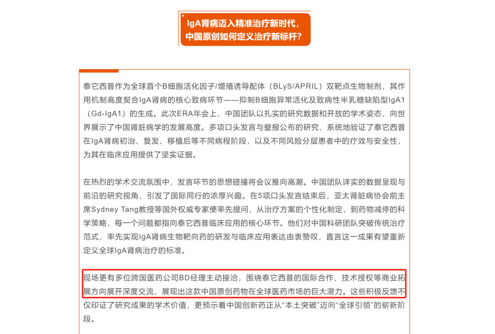
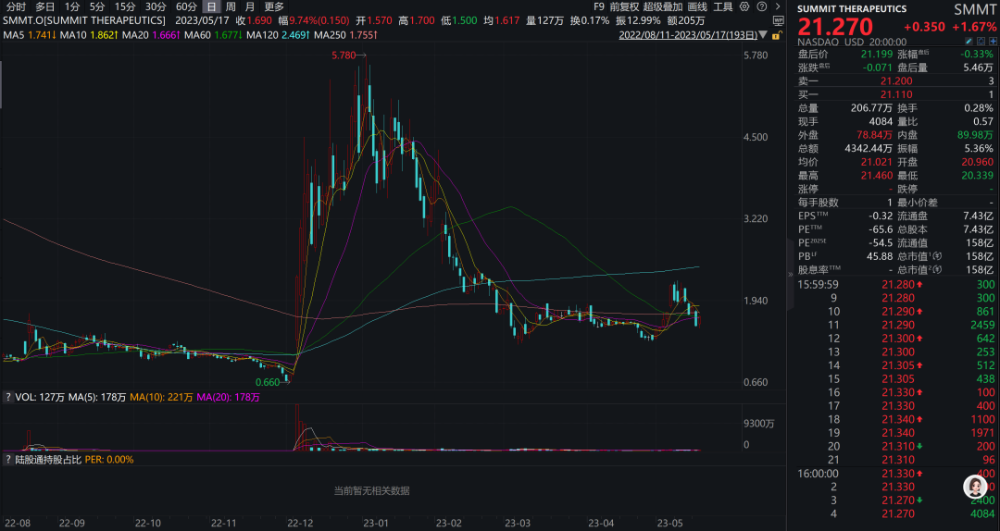
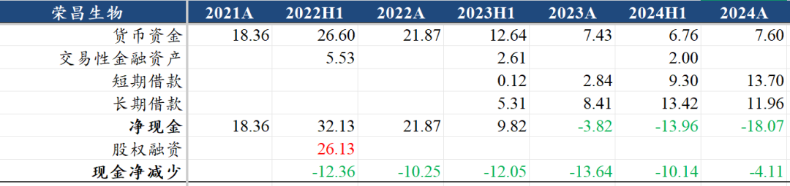
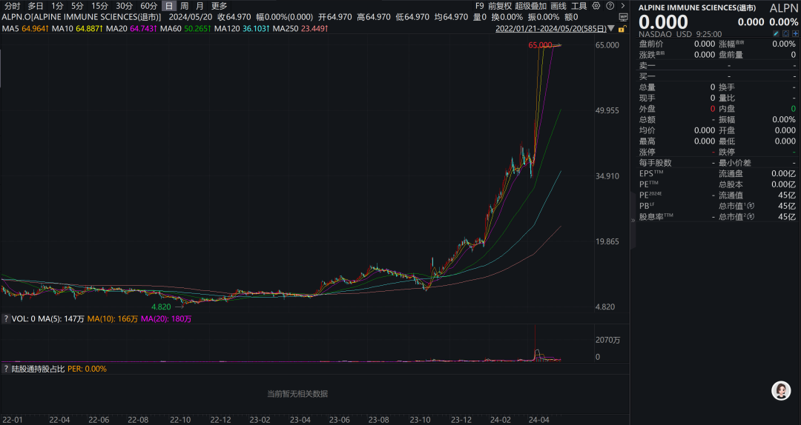
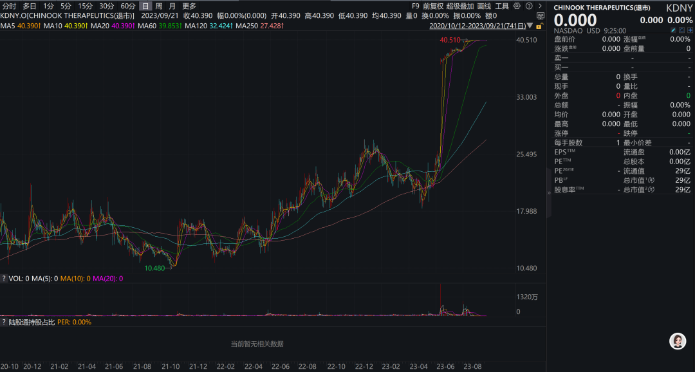
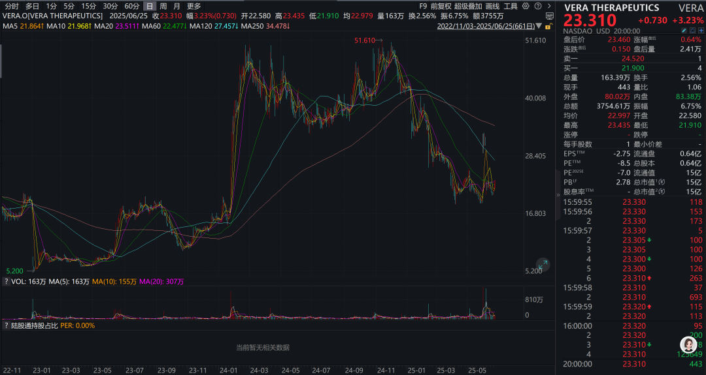
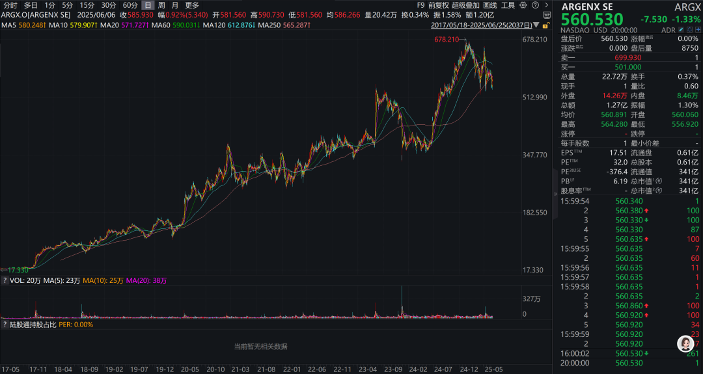
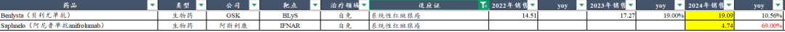
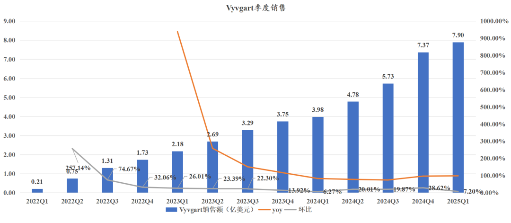

# 荣昌生物BD交易争议

大家好， 我是龙哥。

今早荣昌生物发布了大家“期待多年”的泰它西普的海外BD授权，虽然总交易对价比较高，但首付款规模很小、且是以Newco方式，似乎与公司此前官方对外释放的消息——与跨国医药公司BD经理接洽——有所差异，这也引起了市场今天较大的分歧，荣昌生物因此股价暴跌，也引发创新药行业一起暴跌。

这里我们就来仔细看看这笔交易，本文仅限客观梳理相关信息，不存在看好或不看好的观点。

1）BD交易结构：

4500万美元现金首付款+8000万美元认股权证（3.2亿股，对应Vor Bio总股本23%）+41.05亿美元里程碑付款+高个位数到双位数销售分成。

2）Vor Bio股权：

公司最早是做细胞治疗用于急性髓性白血病（AML），在本次交易之前已经无任何研发管线，股价从最高63美元/股（总市值22.7亿美元）跌至最低0.13美元/股（总市值0.16亿美元），跌幅99.8%。

荣昌生物8000万美元认股权证对应的价格是0.25美元/股，昨晚交易敲定后Vor股价暴涨74%至0.55美元/股，随后盘后交易进一步暴涨138%至1.32美元/股，对应Vor增发后总市值18.3亿美元，荣昌持有的23%的股权对应的价值为4.2亿美元，但股价可能波动较大，并不能完全作为首付款去理解；有乐观的投资人预期类比Summit，这个就见仁见智了，以及22年底BD交易后的Summit股价也曾经历大起大落：

3）泰它西普海外临床开发：

2022.03启动系统性红斑狼疮（SLE）III期临床；2022.11启动IgA肾炎III期临床；2024.06启动重症肌无力（gMG）III期临床。

公司预计2026年底-2027年上半年读出gMG的III期数据，2028年读出SLE的III期数据，则在美国最快上市时间可能是2028年，如美国临床推进出现一些不确定性或波折，较差情况下获批时间也可能有所延后。

本次交易后，应该是由Vor Bio承接泰它西普的海外临床开发，从而使得荣昌生物可以降低研发费用、同时些许缓解资金压力（有息负债25亿）。

4）可比公司估值：

①2024年4月Vertex以49亿美元收购Alpine（ALPN.O）获得Povetacicept（BAFF/APRIL），为目前全球IgA肾病领域表现最好的II期数据，处于III期临床。

②2023年6月诺华以35亿美元收购Chinook（KDNY.O）获得Eta抑制剂Atrasentan阿曲生坦，用于治疗IgA肾病，处于III期临床，目前已获批。

③2024年5月Biogen以18亿美元（11.5亿美元首付款+6.5亿美元里程碑）收购Human Immunology Biosciences获得CD38单抗，用于膜性肾病、IgA肾病等，处于II期临床。

④Vera公司（VERA.O）与BMS合作开发BAFF/APRIL双融合蛋白治疗IgA肾病，当前市值15亿美元。

⑤2024年5月旭化成以10.6亿美元收购Calliditas获得Nefecon（布地奈德缓释胶囊），用于治疗IgA肾病，已获批上市。

⑥2020年8月强生以65亿美元收购Momenta获得FcRn单抗，用于gMG及多种自免适应症。

⑦全球首家获批gMG的FcRn单抗来自Argenx，最新市值341亿美元。

5）可比药物销售额：

①系统性红斑狼疮：GSK贝利尤单抗（BLyS）用于治疗SLE，2024年全球销售额19.09亿美元+10.56%。阿斯利康阿尼鲁单抗（IFNAR）用于治疗SLE，2024年全球销售额4.74亿美元+69%。

②重症肌无力：Argenx艾加莫德（FcRn）用于治疗gMG，2024年全球销售额21.86亿美元+83.6%，25Q1单季度销售额接近8亿美元。

6）潜在问题：

①泰它西普国内专利2027年到期，专利补偿期5年，实际约为2032年专利到期，海外专利到期时间2028年，实际专利到期时间大概在2036年，也既国内还有7年专利期，海外在2028年上市后约有7-8年专利期可以销售，总体剩余专利期偏短。

②gMG、IgAN的竞争都趋于激烈，泰它西普在这两个领域竞争也有一定难度，以及SLE海外临床难度较大。

......

近期重点文章：

《[创新药行业重磅-科创板重新开放](https://mp.weixin.qq.com/s?__biz=MzkyMzQ3MDc3Mw==&mid=2247484669&idx=1&sn=c9d9bc8e6ab522ab2567d92000cb533f&scene=21#wechat_redirect)》

《[创新药后续还有哪些潜在重磅BD](https://mp.weixin.qq.com/s?__biz=MzkyMzQ3MDc3Mw==&mid=2247484658&idx=1&sn=d7c51ba3a690495b19c9fec122a04e1b&scene=21#wechat_redirect)》

《[创新药目前处于什么估值水平？](https://mp.weixin.qq.com/s?__biz=MzkyMzQ3MDc3Mw==&mid=2247484651&idx=1&sn=170b1d665b283894fb722e7daeb885a7&scene=21#wechat_redirect)》

《[创新药行情延伸](https://mp.weixin.qq.com/s?__biz=MzkyMzQ3MDc3Mw==&mid=2247484631&idx=1&sn=46d50979dcb5eb6edfbfb77cf83a7b18&scene=21#wechat_redirect)》

《[创新药宏大叙事](https://mp.weixin.qq.com/s?__biz=MzkyMzQ3MDc3Mw==&mid=2247484619&idx=1&sn=9c50a7c53e83a5c5b592a0a46e33b026&scene=21#wechat_redirect)》

风险提示：本文仅讨论行业/公司经营情况，投资需综合考虑公司经营、估值、管理层等多方面因素，建议读者审慎参考，本文不作为投资依据，不建议大家根据本文做出投资计划。

<!-- wxmp-comments-begin -->

---

## 留言（8 条，含回复共 17 条）

- **Bryan** 👍4 · 2025-06-26 16:31
  荣昌我记得二月份十几块的时候问过一次龙哥，但那时候本身重仓其他更优质的医药股了，包括诺诚，亚盛我都没有持仓。虽然事后看确实荣昌弹性最大，今天大跌后的股价也还要原来的3倍，但好像也很难说错过。
  前几天盘估值的文章删了？投资感悟是低位可以多看前景，亮点，容忍瑕疵；高位多看瑕疵，风险和估值，切勿观点跟踪股价走...
  - ↳ **作者** · 2025-06-26 16:49
    没删，还在
- **时间之外的往事** 👍3 · 2025-06-26 14:58
  类比summit纯属瞎扯，summit暴跌是市场对康方临床数据的解读偏差导致。后面澄清后快速修复并爆涨新高。
  - ↳ **作者** · 2025-06-26 15:00
    我截图的那段是2022年底刚刚授权之后的，不是后续因为数据导致的股价波动。不过至于怎么类比，这个我不太好评价，有持仓的投资人肯定是尽量往乐观、往宏大叙事去对比。
  - ↳ **作者** · 2025-06-26 15:06
    今早梳理了一下，从中国创新药海外BD历史上来看，首付款占比低的可以排上号的。
- **胡言胡语hws** 👍3 · 2025-06-26 14:59
  那么多mnc接洽，最后选择了这么个方案，实在想不通，有没有可能本身临床数据有很大水分？
  - ↳ **作者** · 2025-06-26 15:03
    BD交易方案本身，可能是没有MNC愿意出价，可能是公司想要占更多的权益比例，这个我们暂不做猜测。
    荣昌这次的问题，主要还是从syjt开始的在市场燥热的环境下进行“预告式BD”，几家公司也算行业里有头有脸的公司了，展现出那么强的股价诉求，把市场预期拉的那么高，然后再给出一个看起来不那么好的结果，带来的就是股价的巨幅波动。
- **赵汉辉 Patrick** 👍2 · 2025-06-26 15:27
  高产！但这个newco荣昌承担了更大的合作伙伴风险和股价波动风险，贪心不足蛇吞象
  - ↳ **作者** · 2025-06-26 15:29
    是的，肯定是要承担更大的风险的，投入那么大的项目、预期那么高的BD交易，现实才拿到4500万美元现金。到底是贪心不足蛇吞象、还是确实没有MNC愿意出不错的价格，也说不好。
- **也无风雨也无晴** 👍2 · 2025-06-26 15:34
  我可以这样理解么？mnc或者小公司都无所谓好坏，关键还是药的水平
  - ↳ **作者** · 2025-06-26 15:37
    那还是有关系的，药本身肯定是最核心的，但大公司和小公司的资金实力、临床开发能力和效率差距会很大。
- **冯江渝** 👍1 · 2025-06-26 15:03
  客观公正[强]
  - ↳ **作者** · 2025-06-26 15:21
    我也没有这个的持仓，利益相关性不太高（带崩我创新药持仓算有点相关[捂脸]），就给大家中性客观的讲讲现实情况。
- **花** 👍1 · 2025-06-26 15:19
  你好老师，怎么看晶泰和dove&nbsp;tree的BD?
  - ↳ **作者** · 2025-06-26 15:24
    晶泰那个BD算是一比较常规的技术平台的合作吧，和石药之前那个AI药物发现的BD合作差不多，首付款1亿美金，总交易对价几十亿美金，这种技术平台的合作最终能拿到的里程碑付款比例会很低，不确定性比较大，估值增量肯定不会太明显，定性来说就是验证其AI药物发现平台的价值。至于股价在BD交易披露后表现不太好，可能还是前期有不少提前知道消息而埋伏的资金吧。
- **月儿** · 2025-06-26 15:14
  龙哥，港股通创新药etf现在可以买吗？可以长期持有吗？[抱拳][抱拳]
  - ↳ **作者** · 2025-06-26 15:25
    这种问题涉及到合规的，一看就是没法回答的问题。我建议你可以参照6月20日那篇文章的内容，根据市场波动的位置和阶段做大致的判断。当然在产业趋势向上的阶段也可以考虑做定投ETF。

<!-- wxmp-comments-end -->
