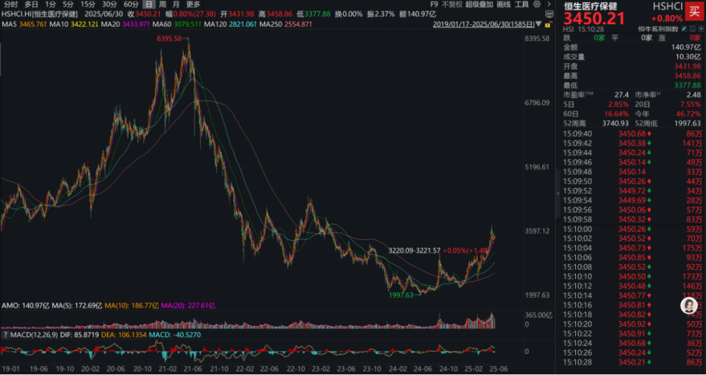
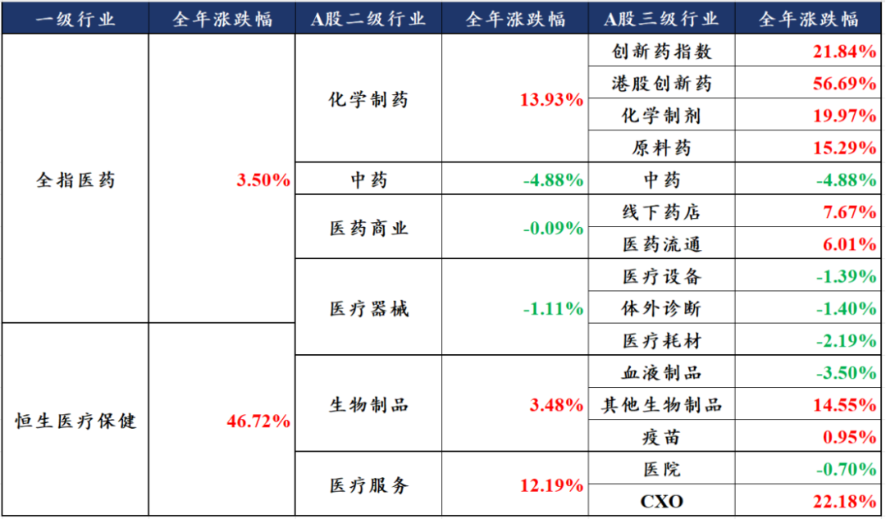
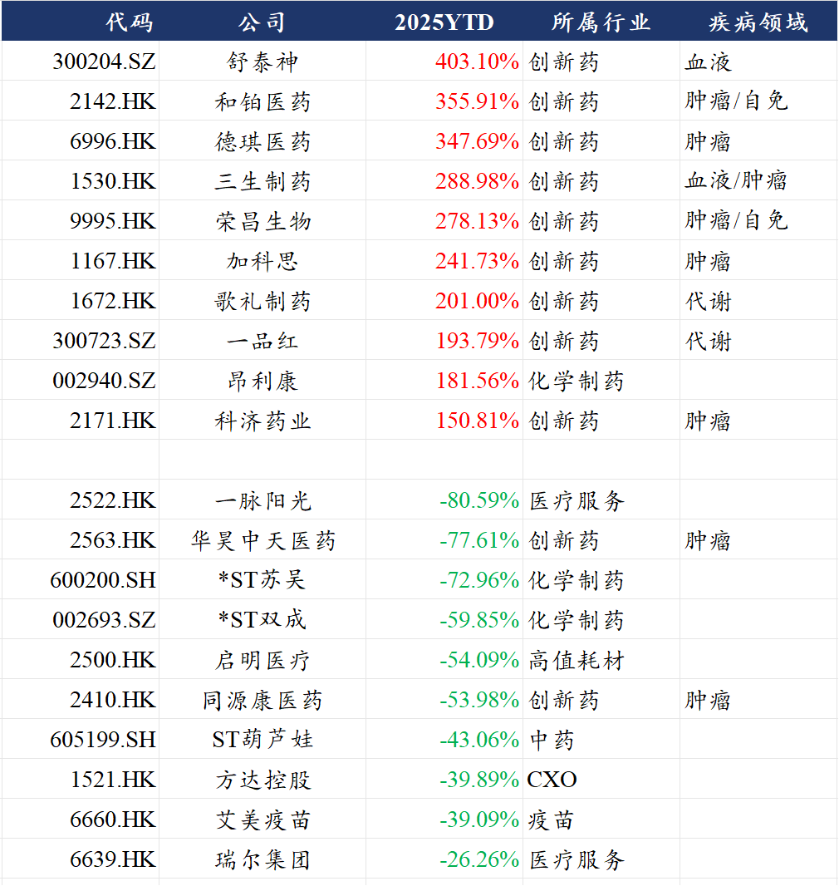
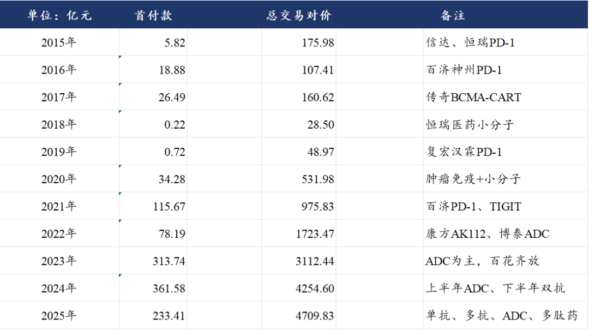
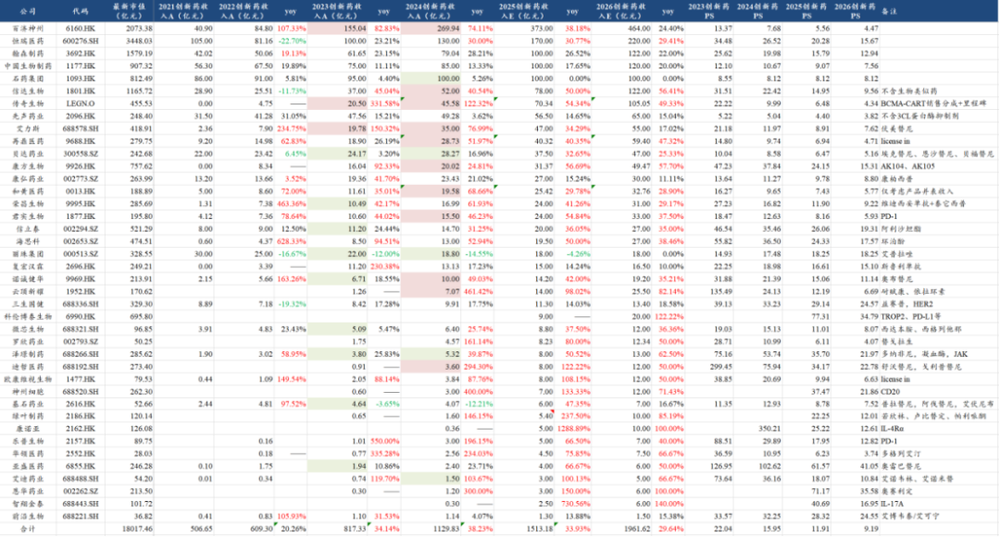
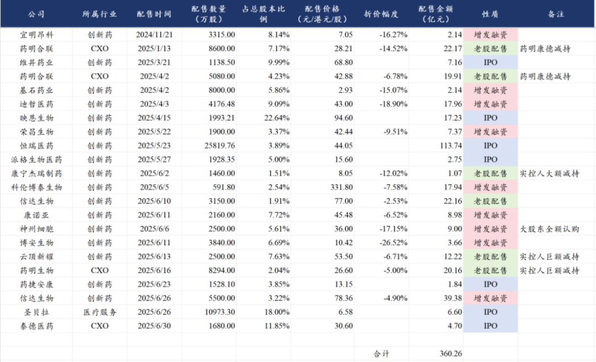
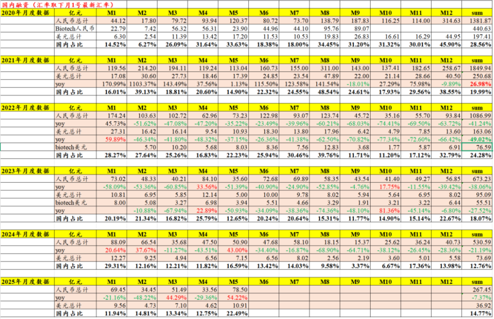
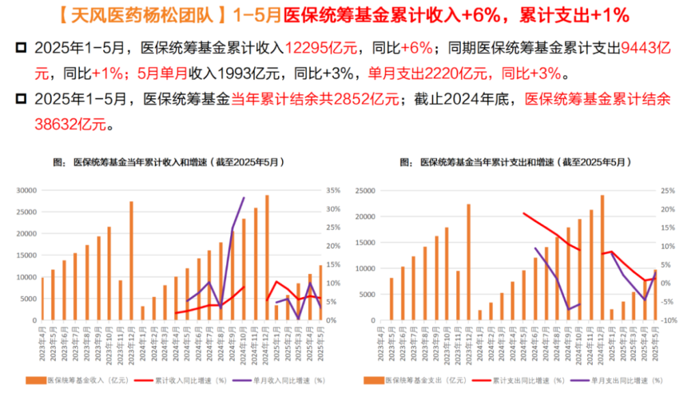

# 创新药行业半年度总结

大家好，我是龙哥。

今天是6月的最后一个交易日，也是2025年上半年的最后一个交易日，今天来简单总结一下上半年的行业情况。

今天上半年对医药投资人来说，尤其是对于港股医药投资人来说，是比较扬眉吐气的，经历了几年的漫长下跌，恒生医疗保健指数在2025年终于迎来爆发，上半年恒生医疗涨幅超过46%，港股创新药板块更是涨幅超过56%。当然，即便是上半年实现了非常大幅度的指数涨幅，从指数所处的绝对位置来说依然不算是高位：

1、细分子行业表现

从医药各个子行业来看，表现最突出的必然是港股创新药，今年以来涨幅达到56.69%，位居所有行业的第一位，港股创新药以更低的估值、更优质的质地，表现要显著好于A股创新药板块（包括化学制剂），不枉我们在港股创新药板块坚持这么久。

创新药以外，CXO板块今年也有有所表现，虽然涨幅确实远不及创新药，但行业22%的涨幅也并不算小，CXO行业大市值龙头在今年以来基本都是领先于行业的表现，这经历一轮医药行业的寒冬后，CXO行业的龙头公司的行业竞争力和市占率实际上都在进一步提升，小公司在这轮寒冬中有所出清。生命科学上游板块没有相应的指数，但从部分公司的股价表现来推测，行业板块的表现应该与CXO类似。

医疗器械板块在今年来的表现相对较为平淡，医疗器械全行业都受到医院端手术量低迷的影响，医疗设备、体外诊断行业则进一步始终受到国内政策面的压力，就在前一周的周五（6月20日），国家药监局发布了支持高端医疗器械创新发展的政策文件，提到医用机器人、高端医学影像设备、人工智能医疗器械、新型生物材料医疗器械等细分领域。我们在今年上半年判断2025年大概率看到医疗器械行业的政策拐点，目前药监层面已经站出来，也期待后续看到医保层面的相应政策变化。

连锁药店行业上半年的经营情况依然不佳，行业出清压力较大，但龙头连锁药店总体情况已经开始相比去年有所好转，行业现金流和经营最稳健的益丰药房也给出了今年的一个大型并购的指引，大参林、一心堂等也给了利润端企稳的指引，如一心堂在行业下行期被迫谋求转型、做门店的调改，从纯粹的药店开始向日本药妆店的模式转变，这两个月连续试点的一些门店对收入贡献了明显的增量，未来或许会成为行业趋势。

血制品行业上半年表现较弱，阶段性的白蛋白供给出现过剩的行业下行周期，叠加前几天提到的重组白蛋白作为潜在竞品对估值的压制，使得板块在今年来市场关注度很低。

中药板块是去年下半年以来的政策面重点暴击的方向，经历了前面几年对中药的全方位的、无保留的政策支持，现在也终于开始下狠手，部分院内中药头部公司的业绩在过去两个季度崩的比较惨。

上半年涨幅靠前的标的主要集中在创新药板块，共有29家公司实现股价翻倍，绝大部分都是创新药公司，其中涨幅和跌幅top10的公司如下：

2、创新药行业更新

由于今年来的文章都在反复论述创新药的投资逻辑和行业各个维度的变化，因此我们这里主要是总结式的过一遍。

创新药海外BD授权方面，上半年累计实现创新药海外BD授权交易46笔，拿到首付款233.4亿元、总交易对价合计4710亿元，已经超过2023-2024年全年的水平，如剔除启德医药130亿美元的那笔交易（潜在数十个分子），则总交易对价为3776亿元，也已经接近2024年全年4254.6亿元的水平。

也是在今年，中国创新药海外授权的历史总交易对价突破2000亿美金，首付款累计已经达到165.8亿美金。

创新药国内商业化方面，根据我们此前的测算，预计国内的上市创新药公司的创新药收入在2025年会达到1500亿元以上，同比增长也将维持在30%以上，2026年则是预计会接近2000亿元，进入商业化阶段的创新药公司也在持续增加。从我们历史统计的数据来看，在2023年还存在大量公司的创新药商业化销售miss，到2024年就呈现为少数公司miss、相当一部分公司开始持续的超预期、甚至逐季度上调指引和市场预期。

这也是过去我们一直讲的一个逻辑，从国内创新药政策拐点（2022年底）到基本面拐点（2024年）经历了1-2年的时间，创新器械的政策拐点到基本面拐点可能也需要这个周期。

二级市场融资方面，今年来开始有大幅的改善，不论是老股配售、新股增发、IPO融资等都显著增加，尤其是在港股市场表现更为突出，24年底以来的增发、大额减持和IPO累计规模已经达到360亿元，且港股的创新药IPO还在快速增加，后续大家又将看到一批biotech新面孔密集上市。

一级市场融资方面，二级市场的火热向一级市场传导还需要时间，25年5月的国内医药行业一级市场融资的绝对金额已经创下2024年1月以来的15个月新高，基本也是在2022年下半年以来的单月融资金额的高位附近，相信随着二级市场融资渠道的打通，后续一级市场融资的修复也只是时间问题。

医保收支方面，2025年1-5月医保统筹基金累计收入12295亿元同比增长6%、累计支出9443亿元同比增长1%，其中5月单月的收入1993亿元同比增长3%、支出2220亿元同比增长3%，城镇职工医保总体表现仍然强于城乡居民医保。

国内政策面，今年来国内政策面对创新药一直是比较友好的，或者说22年底以来的创新药支持政策延续性一直是不错的，除了商保丙类目录推出的时间晚了一些之外——这也不是医保局能完全掌控的，其他方面来看在国谈创新药入院、医保谈判价格、医保基金结算等方面都在持续改善，以及提出对于部分满足条件的创新药可以提前预付医保资金，在价格体系制定方面也在逐渐放松。

就在上周，还最新推出了《医疗保障法（草案）》，对国家医保体系和医疗行业支付端都是利好消息，主要的边际变化是：i立法方式保证医保基金运行独立性——确保医保资金不被侵占；ii.医保基金确定支付范围、价格体系时听取多部门意见——医保局不再独断定价体系。

海外政策面，今年以来还是颇有些波折，尤其是在创新药全面出海的大背景下，美国的药品政策也成为我们研究政策面的重点之一，4月以来从美国生物技术安全委员会的报告开始，再到后续的关税、美国IRA法案、最惠国药价等，需要持续的跟踪美国的政策面变化，对市场也带来了不小的波动。

我们认为未来对美国政策面变化的研究仍然不会停止，美国的医疗体系和财政压力意味着其医改压力是长期客观存在——类似我们在2018年之后的一系列医改政策。

3、6月重点文章

月底最后一天，再开一次赞赏，这个月给大家分享的文章包括：

创新药重点学术大会解读：

2025ASCO解读：《[创新药重磅催化落地](https://mp.weixin.qq.com/s?__biz=MzkyMzQ3MDc3Mw==&mid=2247484610&idx=1&sn=840972449340d85b5fa31195d262ee93&scene=21#wechat_redirect)》

2025ADA解读：《[创新药顶级大药盛会](https://mp.weixin.qq.com/s?__biz=MzkyMzQ3MDc3Mw==&mid=2247484641&idx=1&sn=93ea4ad9f85d4cd6e44e997fc2754266&scene=21#wechat_redirect)》

创新药行业观点及估值分析：

《[创新药行业重磅-科创板重新开放](https://mp.weixin.qq.com/s?__biz=MzkyMzQ3MDc3Mw==&mid=2247484669&idx=1&sn=c9d9bc8e6ab522ab2567d92000cb533f&scene=21#wechat_redirect)》

《[创新药后续还有哪些潜在重磅BD](https://mp.weixin.qq.com/s?__biz=MzkyMzQ3MDc3Mw==&mid=2247484658&idx=1&sn=d7c51ba3a690495b19c9fec122a04e1b&scene=21#wechat_redirect)》

《[创新药目前处于什么估值水平？](https://mp.weixin.qq.com/s?__biz=MzkyMzQ3MDc3Mw==&mid=2247484651&idx=1&sn=170b1d665b283894fb722e7daeb885a7&scene=21#wechat_redirect)》

创新药行业长期逻辑和空间展望：

《[创新药宏大叙事](https://mp.weixin.qq.com/s?__biz=MzkyMzQ3MDc3Mw==&mid=2247484619&idx=1&sn=9c50a7c53e83a5c5b592a0a46e33b026&scene=21#wechat_redirect)》

CXO行业观点分析：

《[创新药行情延伸](https://mp.weixin.qq.com/s?__biz=MzkyMzQ3MDc3Mw==&mid=2247484631&idx=1&sn=46d50979dcb5eb6edfbfb77cf83a7b18&scene=21#wechat_redirect)》

（近期行情确实在向CXO、生命科学上游延伸）

创新药公司解读：

《[荣昌生物BD交易争议](https://mp.weixin.qq.com/s?__biz=MzkyMzQ3MDc3Mw==&mid=2247484683&idx=1&sn=5afe337ee9c27bcfe438044e0b8c1582&scene=21#wechat_redirect)》

《[创新药战略眼光之最](https://mp.weixin.qq.com/s?__biz=MzkyMzQ3MDc3Mw==&mid=2247484599&idx=1&sn=5ab89fbff32f4a1b1c0ff9750ce69cba&scene=21#wechat_redirect)》

如果大伙觉得龙哥分享的内容还不错，可以赞赏支持一下，还是那句话，不在金额多少，有一份小小的赞赏至少代表对龙哥分享内容的认可。

也还是老规矩，赞赏过任意金额的读者，如果需要上文中的数据，都可以在后台留下邮箱，龙哥会在空闲时给需要的读者一一发送。

风险提示：本文仅讨论行业/公司经营情况，投资需综合考虑公司经营、估值、管理层等多方面因素，建议读者审慎参考，本文不作为投资依据，不建议大家根据本文做出投资计划。

<!-- wxmp-comments-begin -->

---

## 留言（12 条，含回复共 25 条）

- **执着如呆** 👍2 · 2025-06-30 18:21
  龙大，恒瑞这个&nbsp;3000&nbsp;亿出头的市值，是不是需要时间换空间了？
  - ↳ **作者** · 2025-06-30 18:23
    说实话我现在不太喜欢时间换空间这个说法，说白了就是估值贵了需要时间消化估值呗[捂脸]
  - ↳ **作者** · 2025-06-30 18:31
    兄弟，我之前也持有，清完没细算今年也有10个左右收益，好公司是好公司，但问题就在于业绩能不能大超预期大幅消化估值，不然在这个行情弹性不太够呀。
- **低碳哥** 👍2 · 2025-06-30 18:26
  心脉医疗去年业绩历史最高，但增速最低，高基数效应下，未来再回到实现40%以上增速的难度较大，此时股价又是历史低位，形成业绩顶与股价底的背离。咨询一下龙大，现在持有心脉还值不值得，谢谢了
  - ↳ **作者** · 2025-06-30 18:27
    心脉主要是被政策面干了一波比较惨烈，他这个赛道和收入体量，回到40%的增长就别想了，如果器械行业能看到大的政策拐点，还是有机会的。
- **Simon** 👍2 · 2025-06-30 18:27
  龙大，CXO今天上半年最后一天哆嗦了一下，是因为GLP1的催化嘛。下半年药明有没有可能走出来行情，根据今年业绩指引和产能预期，还是被低估挺严重的，当然法案对内资的压制还在。
  - ↳ **作者** · 2025-06-30 18:29
    应该如我此前文章写的，就是作为创新药行情的延伸，创新药的BD、一二级市场融资、商业化销售都在高景气，那向上游传导只是时间问题，股价也必然是会提前反映。
- **无名** 👍2 · 2025-06-30 18:42
  药疗器械这个位置确实可以建仓，甚至缝低到重仓ETF了
- **嘀嗒** 👍2 · 2025-06-30 19:05
  龙哥，癌症早筛那家是不是复牌无望了。强制退市投资者的股票怎么处理。
  - ↳ **作者** · 2025-06-30 19:10
    是的，看样子是直接退市了。
- **老加仓** 👍1 · 2025-06-30 18:24
  恩华医药算不算是创新药？业绩还可以，集采风险大不大？
  - ↳ **作者** · 2025-06-30 18:26
    集采风险可控，麻药的量价都会相对稳定，不过确实今年院内手术量比较低迷的话短期会有所影响麻药的使用。恩华目前有一款创新药奥赛立定上市初期在放量中。
- **袁超林** 👍1 · 2025-06-30 19:26
  你好龙哥！
  请问迈瑞医疗如何？
  现在还亏8个点
  - ↳ **作者** · 2025-06-30 22:02
    二季度业绩应该依然很差，短期业绩来说确实还是得逐季度跟踪来看情况，公司是希望q3企稳的。中长期来看可能就是国内海外一起做个低双位数增长。
- **BO** 👍1 · 2025-06-30 19:45
  龙哥&nbsp;请教一下&nbsp;信达的玛氏度肽&nbsp;除了减肥&nbsp;对重度脂肪肝有可能有帮助吗？&nbsp;上市完大概多久医院能开到这款药？
  - ↳ **作者** · 2025-06-30 22:03
    看他们适应症开发啦，海外同靶点的药物有的是先做的MASH适应症。
  - ↳ **作者** · 2025-06-30 23:54
    刚获批，按信达的效率，很快就可以开到处方了
- **caoguoan** 👍1 · 2025-06-30 20:04
  龙哥，请问创新器械有etf吗[抱拳]
  - ↳ **作者** · 2025-06-30 22:03
    有的，翻翻看今年2月的文章，有非常全的梳理
- **天野源** 👍1 · 2025-06-30 20:35
  龙哥，您觉得国内CRO行业的估值空间有多大？能简单谈谈吗，几时写个文章就更好了[呲牙]
  - ↳ **作者** · 2025-06-30 22:04
    这行业应该还是peg估值为主，主要看个股的竞争壁垒和业绩啦
- **李振江** 👍1 · 2025-06-30 21:27
  龙大，明天禾元生物上会，重组人血白蛋白目前只能替代白蛋白在肝硬化低白蛋白血症，请问如何支撑数百亿的市值，想象力不够[抱拳]
  - ↳ **作者** · 2025-06-30 22:05
    发行市值也没有几百亿啦，几百亿有点夸张了。上周有篇文章写到了可以去翻翻看。
- **晓风残月** · 2025-06-30 20:42
  龙大，迈瑞股东这个时间减持怎么看？
  - ↳ **作者** · 2025-07-01 10:36
    感觉就是二股东正常减持，之前A股不是减持要排队嘛，最近行情好了些，也放松了点

<!-- wxmp-comments-end -->
