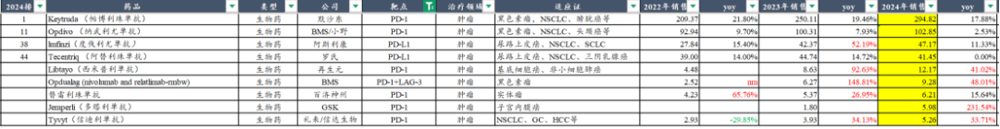
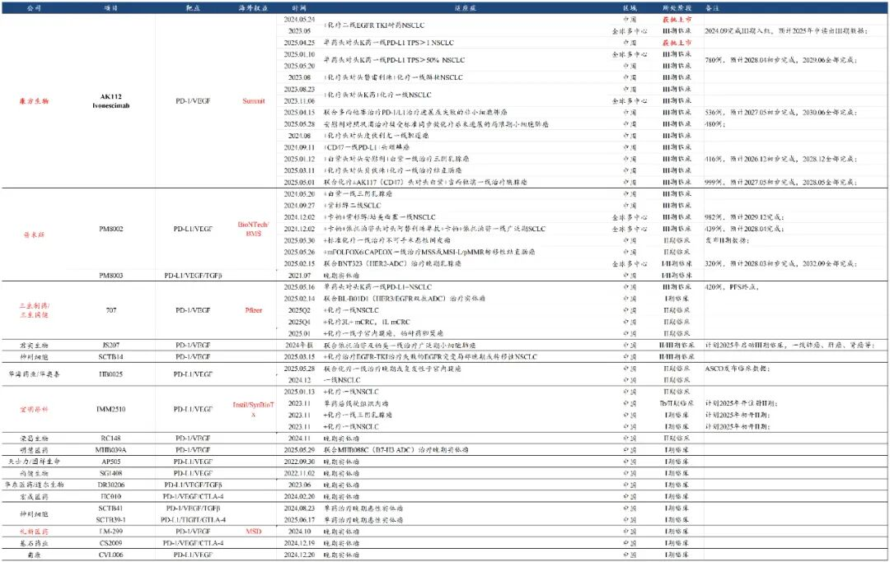
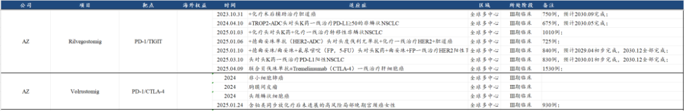
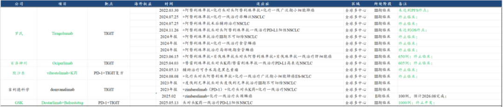

# 如何合理理解传闻的150亿美金交易

大家好，我是龙哥。

今天和大家聊聊昨晚海外媒体报道的阿斯利康与Summit可能达成总交易对价150亿美元的交易的情况。

BD交易尚未落地，这里主要想聊几个问题，第一是AZ为什么、或者说有没有动力去买依沃西？第二是150亿美金的交易对价该怎么看？第三是对康方生物什么影响？

关于PD-1/VEGF双抗的梳理，在此前的两篇文章《[创新药520的浪漫是三生制药给的](https://mp.weixin.qq.com/s?__biz=MzkyMzQ3MDc3Mw==&mid=2247484530&idx=1&sn=e240f64a1a2d6cac85cd2fa6c0b6b8ed&scene=21#wechat_redirect)》、《[宇宙级大药](https://mp.weixin.qq.com/s?__biz=MzkyMzQ3MDc3Mw==&mid=2247484380&idx=1&sn=f59a39aac3c6cb168c326d789c8d8031&scene=21#wechat_redirect)》里梳理的比较详细，最近的大牛股神州细胞就是相对滞涨的二线布局PD-1/VEGF双抗的标的。

1、AZ为什么可能买依沃西

在全球第一代的IO药物领域，也就是PD-1/L1领域，大致可以分为三个梯队，第一梯队的默沙东、BMS，第二梯队的阿斯利康、罗氏，第三梯队的再生元、GSK，收入体量分别是百亿美元以上、40亿美元左右、5-10亿美元。也就是说，在第一代的IO竞争中，阿斯利康的度伐利尤单抗全球销售额47亿美元虽然也是个重磅药物，但相较帕博利珠单抗全球接近300亿美金的销售额，是差着一个数量级的。

在潜在的第二代IO药物领域，也就是PD-1/VEGF双抗领域，目前全球的竞争格局尚未明确，但从当前的研发进度上来说，康方生物/Summit的AK112/依沃西还是比较领先的全球首位，然后是第二的BioNTech/普米斯/BMS的PD-L1/VEGF双抗PM8002，以及三生制药/三生国健/辉瑞的SSGJ707，以上3款药物都已经进入III期临床，尤其是依沃西已经开了12个国内III期临床和3个国际III期临床。

再往后就是君实生物、神州细胞两家处于II/III期临床阶段，华海药业已经完成II期临床即将进入III期，荣昌生物、宜明昂科/Instil处于II期临床，礼新医药/MSD处于I期临床。

由以上可见，由于Summit的估值较高，反而使得BMS、辉瑞、MSD都选择与国内进度更靠后的公司合作而非直接与Summit合作或者收购，行业第一顺位反而被空出来了。

再说回阿斯利康，虽然阿斯利康在第一代IO里属于二线公司，但AZ一点都不想做咸鱼，在第二代IO的开发中AZ投入巨大、且本身就是领先的——假如没有康方的话。

阿斯利康目前开发的IO双抗有两款处于III期临床阶段的，分别是PD-1/CTLA-4双抗Volrustomig和PD-1/TIGIT双抗Rilvegostomig。

PD-1/CTLA-4和PD-1/TIGIT都是双肿瘤免疫靶点的双抗，尤其是在PD-1/TIGIT，阿斯利康已经开了7个全球大III期临床，理论上来说应该是信心满满，但问题是，TIGIT靶点的成药性至今尚未验证，哪怕是阿斯利康在早期临床中看到很好的疗效，但当阿斯利康看到这样的行业全面失败的状态时，相信内心也是忐忑的：

站在阿斯利康的角度，在一众TIGIT无一幸免的全面失败的情况下，当前全力去推PD-1/TIGIT面临的风险也是非常巨大的，其几个大III期临床、尤其是一线肺癌的大III期基本都是要到2029-2030年完成，如果到那个时候几个大III期出现失败，就意味着阿斯利康将彻底失去在第二代IO争夺一席之地的可能性，而恰好现在有一个处于第一顺位的IO双抗——依沃西的全球权益还在待价而沽，如果能拿下依沃西，有很大可能直接一跃成为下一代IO的全球一线龙头。因此，从AZ的角度来说，买依沃西并不是一个很差的选项。

站在Summit的角度，同样是会有点发憷的，一方面是默沙东、BMS、辉瑞这三大美国MNC巨头和实体瘤龙头都已经买到了PD-1/L1\*VEGF双抗，要说临床开发能力、商业化能力，Summit肯定是与这三大MNC有巨大差距的；另一方面是下一代的IO不仅是单单开发IO疗法，更重要的是IO+ADC的联用，而要探索与ADC药物广泛的联合疗法同样是需要庞大的临床资源投入和临床开发能力，这也必须要依靠MNC的能力。Summit在当前时间点似乎也应该有很强的外部合作的意愿。

因此，AZ与Summit的合作，似乎是存在较强的合理性的。

2、交易对价150亿美金怎么看？

首先这个交易对价尚未确定，他的交易结构也没有确定，例如150亿美元是收购股权还是BD交易？BD交易是50%：50%收入费用共担还是权益给AZ、Summit拿销售分成？150亿美金里的首付款和里程碑分别占比多少？这些核心问题都尚未可知。

但这个150亿美元的总交易对价的合理性在于，此前全球第二顺位的BioNTech与BMS的合作，是15亿美元预付款、20亿美元周年付款、76亿美元的里程碑付款合计111亿美元的总交易对价，BMS获得的是PD-L1/VEGF双抗的50%的权益。

因此可预期的是全球第一顺位的Summit有可能获得的是20-50亿美元首付款+100亿美元+的里程碑付款，并且同样可能是50:50的权益比例。

3、对康方生物的影响？

康方生物的估值中大半来自对未来海外AK112的销售分成的预期，也既依沃西在Summit这边的开发进度、适应症拓展是直接关乎康方生物未来能拿到的全球销售分成的体量的，因此Summit如能与AZ或其他顶级的肿瘤MNC达成合作，必然是意味着未来的确定性提升。

目前市场给以上公司的定价是怎么样的呢：

①康方生物：目前900亿市值，国内估值大致在400亿左右，对应AK112的海外估值大概是500亿，这其中还未包含AK104的出海潜力。

②三生制药：目前550亿市值，国内估值大致在300亿左右（不含三生国健），对应SSGJ707的海外估值大概是250亿（拿到90亿元现金）。

③BioNTech：目前264亿美元市值，在手现金约200亿美元，并且又从BMS拿到15亿美元首付款，也既扣除现金的管线估值大概40亿-50亿美元（300亿元左右），包含PD-L1/VEGF双抗的50%全球权益和几款临床阶段的ADC药物。

④神州细胞：目前360亿元市值，在本轮炒作PD-1/VEGF双抗前的市值约为160亿元，本轮炒作PD-1/VEGF双抗已经带来了200亿元的市值增量。

⑤华海药业：目前340亿元市值，在本轮炒作PD-1/VEGF双抗前的市值约为210亿元，本轮炒作PD-1/VEGF双抗已经带来了120亿元的市值增量。

⑥君实生物（H股）：目前240亿元市值，在本轮炒作PD-1/VEGF双抗前的市值约为160亿元，本轮炒作PD-1/VEGF双抗已经带来了80亿元的市值增量。

此外还有荣昌生物、基石药业、宜明昂科/Instil、天士力等公司在不同程度上获益和获得市值增量。

以上公司的PD-1/VEGF双抗合计贡献的市值大概在1800亿元以上。

远期来看中国公司可以在PD-1/VEGF双抗上获得多少市值空间？

拍脑袋的算一下，假设未来PD-1/VEGF双抗的全球销售峰值在600-1000亿美元，中国公司平均拿到12%的销售分成——对应72亿-120亿美元，也既500亿-850亿元的收入分成，扣税后的利润大概是400亿-700亿元，潜在贡献的市值大概是4000亿-7000亿。

最后要再强调一下，AZ与Summit的这笔交易尚未落地，因此文中较多内容都还是主观推测而非客观事实，大家也谨慎和理性的看待。

风险提示：本文仅讨论行业/公司经营情况，投资需综合考虑公司经营、估值、管理层等多方面因素，建议读者审慎参考，本文不作为投资依据，不建议大家根据本文做出投资计划。

<!-- wxmp-comments-begin -->

---

## 留言（13 条，含回复共 28 条）

- **容德** 👍6 · 2025-07-04 13:17
  继续编继续骗，最后大股东卖公司，小散户一地鸡毛
  - ↳ **作者** · 2025-07-04 13:18
    踏空的被涨破防了？
- **fengzhy** 👍4 · 2025-07-04 12:54
  每次在涨势中发文龙哥应该有压力，但龙哥很客观[偷笑]。
  - ↳ **作者** · 2025-07-04 13:03
    神州细胞原本上周要写的，结果天天暴涨，写了就会说成吹票找人接盘了[捂脸][捂脸]
  - ↳ **作者** · 2025-07-04 13:04
    以及这种行业关键性的事件，也确实需要点评[破涕为笑]
- **阿宝** 👍3 · 2025-07-04 13:30
  龙头老大起飞，整个创新药趋势还在延续，躺在亚盛里慢慢变富[笑脸]
  - ↳ **作者** · 2025-07-04 13:40
    [强][强]
- **钟敏涛** 👍2 · 2025-07-04 12:21
  感觉这个靶点没其他国家什么事儿了
  - ↳ **作者** · 2025-07-04 12:26
    海外也有做的，确实效率上和中国公司有差距。
- **陌上初薰** 👍2 · 2025-07-04 12:21
  龙哥，迈瑞目前怎么看，折磨啊，市场并不相信管理层所说的三季度重大拐点
  - ↳ **作者** · 2025-07-04 12:26
    我觉得现在反映的是二季度可能会超预期的差
- **李振江** 👍2 · 2025-07-04 12:25
  康方生物的依沃西获得巨大成功尚且有不确定性，后排的就有点着急了吧。
  - ↳ **作者** · 2025-07-04 12:28
    成功率在提升，后排的炒预期就见仁见智了，没啥预期的时候可以埋伏，预期已经拉满了的那就另说了。
- **Bryan** 👍2 · 2025-07-04 12:48
  投资还是在熊市的时候简单，你只要挑选管理层靠谱，管线领先，市场大的公司。牛市来了，好的公司就得做详细的管线估值，考虑中性乐观预期这些了，而且往往涨不过二三线公司…
  总之不便宜了，我反正涨多了就像卖一卖，于康方就是一手十万，交易真的有点不便…
  - ↳ **作者** · 2025-07-04 13:02
    个人投资者不追求相对收益的话都还好，机构投资人比较怕熊市要绝对收益、牛市要相对收益。
    康方一手要十万，确实对散户交易不是很友好。
  - ↳ **作者** · 2025-07-04 13:40
    慢慢交给专业机构也挺好[呲牙]
- **caoguoan** 👍2 · 2025-07-04 13:40
  龙哥，这轮君实涨幅最小，跟资金的喜好有关还是它的临床数据有关？
  - ↳ **作者** · 2025-07-04 13:41
    他也没发布数据，最近大家说和他分子设计有关系。
- **和** 👍1 · 2025-07-04 12:08
  恒生医药目前高估了吗？
  - ↳ **作者** · 2025-07-04 12:26
    底部翻倍了啊，那看来确实高估了，可以等等了[嘿哈]，哈哈哈
- **Wayne** 👍1 · 2025-07-04 12:20
  销售峰值太乐观了，非小细胞肺癌差不多50亿美元，其他适应症竞品也很多。康方的海外权益差多不是summit估值的1/3。国内差不多500亿。
  - ↳ **作者** · 2025-07-04 12:24
    第一代IO已经超过500亿美金并且还在双位数增长，第二代IO用药周期更长，定价也大概率更高，市场规模肯定要超过第一代IO，除非是在大部分适应症上都失败，康方现在开了12个大3期，都失败的概率也不高。
    再说肺癌，全球IO在NSCLC都超过100亿美金，哪来的才50亿美金。
- **berlin0320** 👍1 · 2025-07-04 12:33
  扫了一眼BioNTech，太富了。我的理解是，是不是和前几年18A破净一样，觉得现金在他手里要打折，还是说扣除现金的管线就值40亿-50亿美元
  - ↳ **作者** · 2025-07-04 12:36
    他这种属于，现金在市值的占比过高[破涕为笑][破涕为笑][破涕为笑]他要是能分掉100个亿，管线估值估计还会给的更高很多。但对bntx来说，或许也不想就在新冠赚一把就结束吧，或许也像用200亿美金烧出一个全球头部biopharma来？
- **天涯过客** 👍1 · 2025-07-04 12:37
  龙哥，再鼎预估今年能实现盈利吗？
  - ↳ **作者** · 2025-07-04 12:42
    公司指引是今年底扭亏，26年全年做到扭亏。感觉有挑战，要看商业化进展。
- **隐隐** 👍1 · 2025-07-04 13:40
  如果逮着创新药前五大重仓买点能跑赢etf吗[捂脸]
  - ↳ **作者** · 2025-07-04 13:41
    你可以拉个数据看看，我没拉过[偷笑]

<!-- wxmp-comments-end -->
