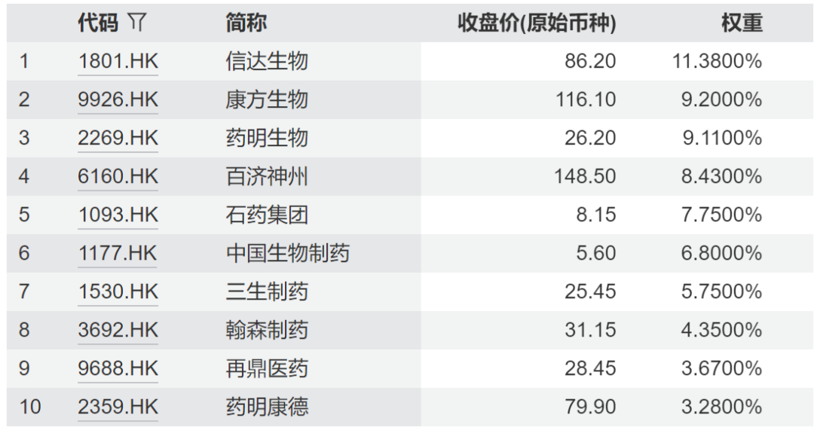
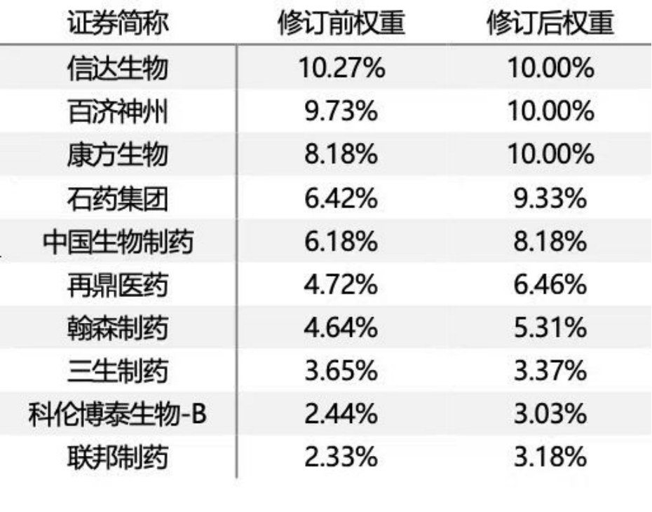
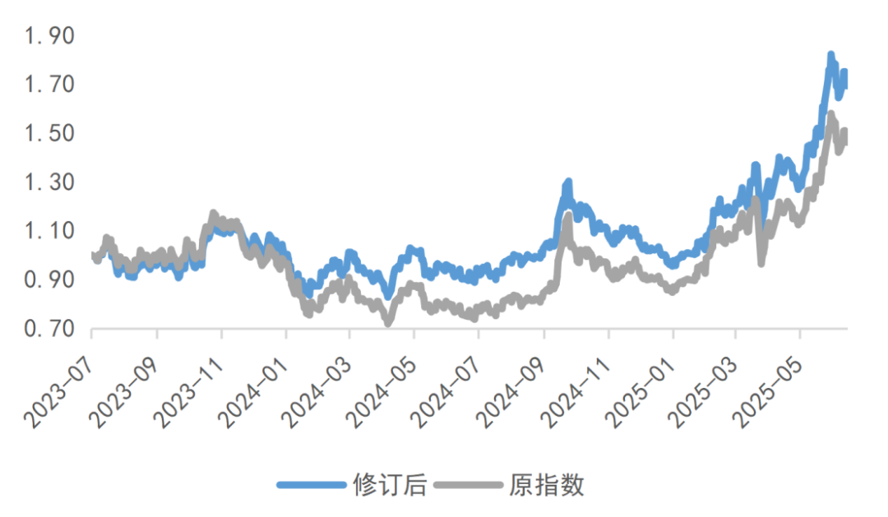

# 100%“纯度”的创新药投资标的要来了

大家好，我是龙哥。

上周，恒生港股通创新药指数宣布调整指数编制方案，将剔除CXO公司，从而使得该指数成为一个更加纯粹的创新药指数。修订生效后，这只指数将成为ETF跟踪的指数里首批“纯度”100%的创新药指数，而跟踪该指数的ETF目前也只有唯一的一个——恒生创新药ETF（159316），今天我们就来简单聊聊这个事儿。

首先，跟踪港股创新药的指数目前有多个：

- 987018.CNI国证港股通创新药指数：成份股38支，跟踪产品7支，跟踪产品规模171.3亿元。
- 931787.CSI中证香港创新药指数：成份股38支，跟踪产品3支，跟踪产品规模141亿元。
- 931250.CSI中证港股通创新药指数：成份股39支，跟踪产品10支，跟踪产品规模17.9亿元。
- 931409中证沪港深创新药产业指数：成份股50支，跟踪产品8支，跟踪产品规模11.8亿元。
- HSIDI.HI恒生创新药指数：成份股37支，跟踪产品1支，跟踪产品规模7.5亿元。
- HSSSHID.HI恒生沪深港创新药精选50指数：成份股50支，跟踪产品3支，跟踪产品规模5.49亿元。
- HSSCID.HI恒生港股通创新药指数：成份股35支，跟踪产品1支，跟踪产品规模4.5亿元。

仅以上7个港股的创新药指数就包含了33个跟踪相关指数的ETF基金，对于普通投资人来说可能乍一看有点太复杂了，到底该如何选择投资标的？是不是“都差不多”？

如果从定性分析来说，由于以上指数的大部分成份股都是创新药公司，在大的行业β之下可能差别确实不大，但是我们如果从定量分析来说差别还是蛮大的。

以本次重点讨论的恒生港股通创新药指数为例，其原本的前十大权重的成份股如下：

具体到CXO行业，其成份股中的CXO行业公司包括：药明生物（权重9.11%）、药明康德（3.28%）、金斯瑞生物科技（2.49%）、药明合联（1.58%）、晶泰控股（1.28%），也即包含了合计17.74%的CXO公司。

但等本次成份股调整生效后，其成份股将不再包含CXO公司，前十大权重股将会产生以下变化：

这个成份股调整对指数本身会带来什么样的影响呢，从定量分析来说就会看到非常显著的差异：

如果回溯过去3年的指数收益率，23年全年的指数涨幅从3.2%提升至8.2%，24年全年的指数涨幅从-11.5%提升至-4.5%，2025年以来的指数涨幅则是从60.1%提升至63.8%，调整前的年化收益为22.2%，调整后的年化收益为32.0%，看似不大的成份股调整，仅两年就带来了10%的年化收益差距。

指数在修订前和修订后的夏普比率分别为0.55和0.85，夏普比率的含义是“每承担1单位的风险可以获得的超额收益”，这个指标的意义在于，有些投资标的的高回报来自超高的波动率，也既通过承担更大的风险而获得的超额收益，因此投资标的的回报率并不是越高越好，但夏普比率却是越高越好。

波动幅度巨大的投资标的，一方面意味着高风险，另一方面我们一直说对于绝大部分投资人来说，高波动的资产对其持有的心态影响会非常大，投资人受其影响经常会过于关注短期的波动，对于赚钱的投资标的还好说，对于亏过大钱的投资标的经常是“回本就卖”，而我们投资肯定不是为了“回本”。

再来说说个股方面的变化，调整后主要创新药公司的权重变化如下：

石药集团+2.91%，中国生物制药+2.00%，康方生物+1.82%，再鼎医药+1.74%，联邦制药+0.85%，翰森制药+0.67%，科伦博泰+0.59%，百济神州+0.27%。

成份股权重的上升一般对应着相应公司在行业中的流通市值占比的提升，对应的就是公司获得了超出行业的股价/市值提升，短期的股价本身代表不了公司竞争力、盈利能力一定有大的变化，但中长期的市值跃迁和权重占比提升还是很能说明问题的。

从中长期来看，这次指数的调整还是值得大家重视的，核心原因在于，指数基金和ETF本质上是工具、而非主动管理，它应该满足投资人的确切的投资需求，而非让投资人被迫去自适应这些指数和ETF。

由于龙哥在去年以来基本大部分的文章都在讨论创新药产业的重大变化，我们也多次给大家拆解港股医药ETF的持仓结构，使得龙哥这后台留言和私信一直有很多读者反复的提问“有没有不含CXO的创新药ETF”，可惜的是一直都没有，上文中讲到的所有指数对应的ETF，或多或少的都包含15%-20%的CXO，那带来的影响也在上文有测算，也就是说买这些ETF的投资人每买80块的创新药资产就自动给你“搭售”20块的CXO资产，这个涉及到的问题并不是CXO资产好不好、值不值得投资的问题，而是我主观上希望投资的是什么资产的问题。因此，指数公司和基金公司，也必须要针对这种市场需求去开发对应的指数和基金。

风险提示：本文仅讨论行业/公司经营情况，投资需综合考虑公司经营、估值、管理层等多方面因素，建议读者审慎参考，本文不作为投资依据，不建议大家根据本文做出投资计划。

<!-- wxmp-comments-begin -->

---

## 留言（12 条，含回复共 26 条）

- **知行** 👍6 · 2025-07-07 16:41
  溢价可能主要来源于前两年CXO的暴跌，有一个问题，就是如果后期创新药如火如荼，美国制裁CXO无果，CXO板块是不是会有补涨的需求，如果剔除，是不是会导致挨打在场，反弹剔除的现象呢
  - ↳ **作者** · 2025-07-07 16:59
    这个的问题我在文中说了，问题并不在于CXO现在是不是值得投资的问题，我前阵子也刚写了一篇CXO的文章，本身对CXO的投资我不觉得有什么问题。问题的核心是，ETF本身是工具，以前的创新药ETF是你想买创新药必须搭售20%的CXO，现在你有的选择，想买纯创新药也有的选，想买带CXO的也有的选。
- **光头的复利人生** 👍6 · 2025-07-07 16:53
  其实现阶段CXO反而是性价比更高的选择[旺柴]
  - ↳ **作者** · 2025-07-07 17:18
    可惜没有CXO ETF，哈哈，得push一下基金公司....
  - ↳ **作者** · 2025-07-07 17:28
    确定性最高了，再加上扩产，没有法案的帽子，后面不敢想[旺柴]
    其实法案的帽子也是投资人自己决定的，暴跌时有，没准升浪的时候就没了[旺柴]
- **雨化心声** 👍4 · 2025-07-07 16:52
  恒瑞一家独大，撑起半个市场，确实失真了[旺柴]
  - ↳ **作者** · 2025-07-07 17:03
    非也，港股创新药基金不含恒瑞，恒瑞的H股刚在港股上市不久，也还没纳入指数，就算纳入也不会占比过高，因为恒瑞H股的流通盘没有很大，他这个权重是根据流通盘来的。
- **Ron** 👍3 · 2025-07-07 16:43
  那有没有只投cxo的etf[呲牙]
  - ↳ **作者** · 2025-07-07 17:02
    主要是，CXO的公司还不够多，ETF基金是需要跟踪指数的，现在也没有很好的CXO指数。另外我觉得CXO未必要投ETF，创新药你选ETF是因为创新药的专业化程度太高，个股之前差异太大，买ETF至少可以享受个行业β，但是CXO行业不是，CXO行业是典型的强者恒强，过去两三年的寒冬过去，你看药明系的竞争力还在进一步强化，所以CXO你可以买那四五个龙头公司就行。
- **劉** 👍3 · 2025-07-07 16:48
  调整后的这支和513120有什么区别，只是有无CXO的区别吧
  - ↳ **作者** · 2025-07-07 17:02
    是的。
- **大葱小鱼2022** 👍3 · 2025-07-07 17:03
  剔除CXO，今年的收益没有跑赢520500.
  - ↳ **作者** · 2025-07-07 17:17
    是跑赢的哦，我文中那个数据是截止到6月27号的
- **Dwjx2026** 👍2 · 2025-07-07 16:55
  请教龙哥：下一步需要把159892换成159316吗？从中长期看，哪个更具有投资价值？谢谢[抱拳]
  - ↳ **作者** · 2025-07-07 17:04
    还是那句话，这个文章的目的并不是说现阶段创新药一定比CXO以及其他行业都要好、要去满仓创新药，而是说现在有一个纯创新药的选择，现阶段创新药整个的热度过高，可以看看我6月13日那篇文章。
- **He** 👍2 · 2025-07-07 16:56
  实时持仓还不是有CXO
  - ↳ **作者** · 2025-07-07 17:20
    是的，指数成份股还没完成调整，要指数先调整，然后ETF才会调仓。所以文章标题才是“要来了”而不是“已经来了”
- **墨** 👍2 · 2025-07-07 17:00
  百济权重增加最少，这轮没啥涨幅
  - ↳ **作者** · 2025-07-07 17:07
    是的，百济这半年涨幅确实是低于预期，Bcl-2和BTK CDAC开发进度还不错，但后续实体瘤管线是没有给很多进展的，可以期待下下半年的进展。
  - ↳ **作者** · 2025-07-07 18:34
    是【期待“下下半年”】还是【期待（一）下“下半年”】？第一眼看还以为要再等一年多，吓一跳[捂脸]
- **空明** 👍2 · 2025-07-07 17:01
  513120是不是也变成了纯粹的创新药呢？
  - ↳ **作者** · 2025-07-07 17:07
    不是，目前只有恒生港股通创新药指数即将调整持仓，其他的指数都还没调整。
- **WIFI** 👍2 · 2025-07-07 17:05
  龙哥好，那现在药明生物剔除生物药，后续还值得留着吗，从发公告后就一直跌。
  - ↳ **作者** · 2025-07-07 17:11
    药明生物和这个关系不太大，目前其他持有CXO的创新药指数和ETF并没有调整成份股，因此暂时不影响这些ETF对药明生物的持仓，未来假如说出现调整的话咱们再做解读。
- **赵汉辉 Patrick** 👍2 · 2025-07-07 17:06
  要不龙哥你创立一个创新药指数
  - ↳ **作者** · 2025-07-07 17:16
    哈哈哈华创不是搞了个中国生物科技指数CBI指数嘛

<!-- wxmp-comments-end -->
