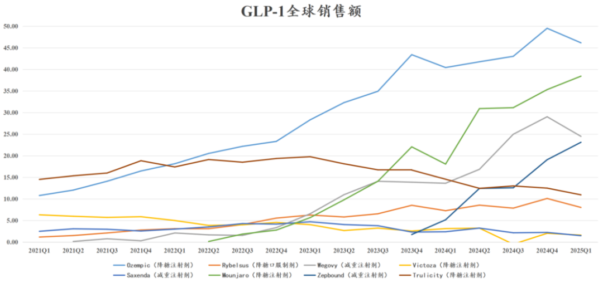
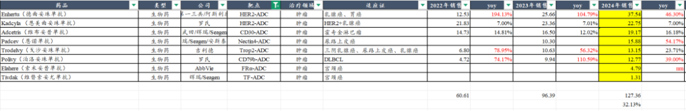
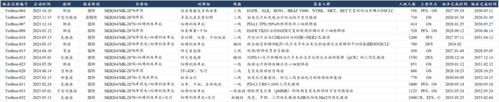
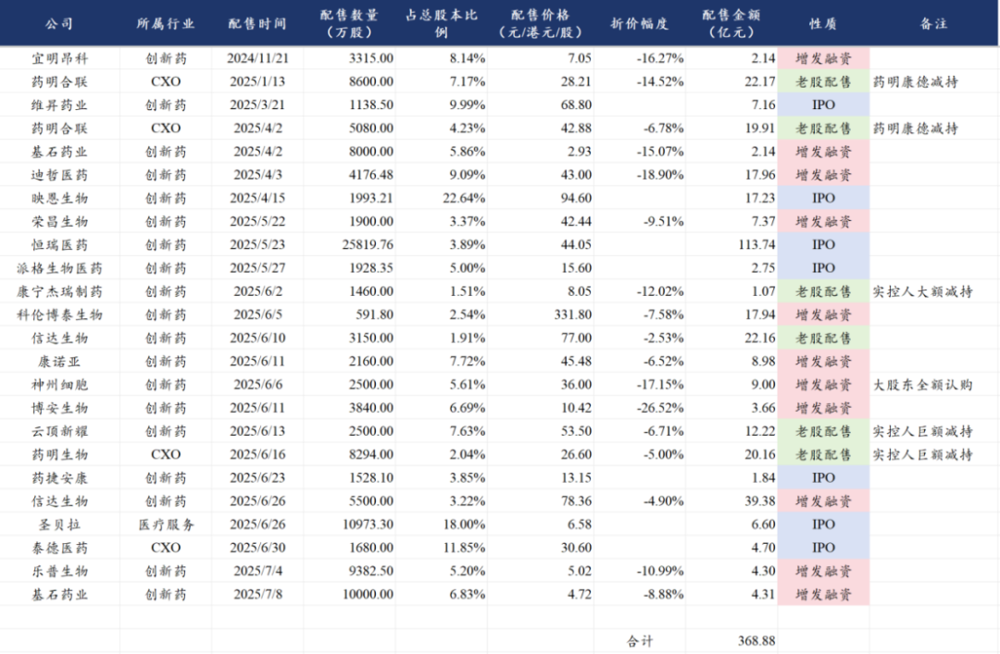
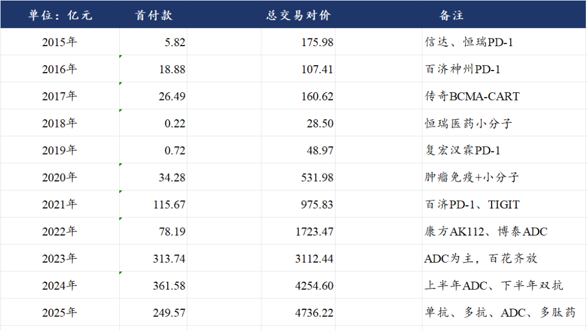
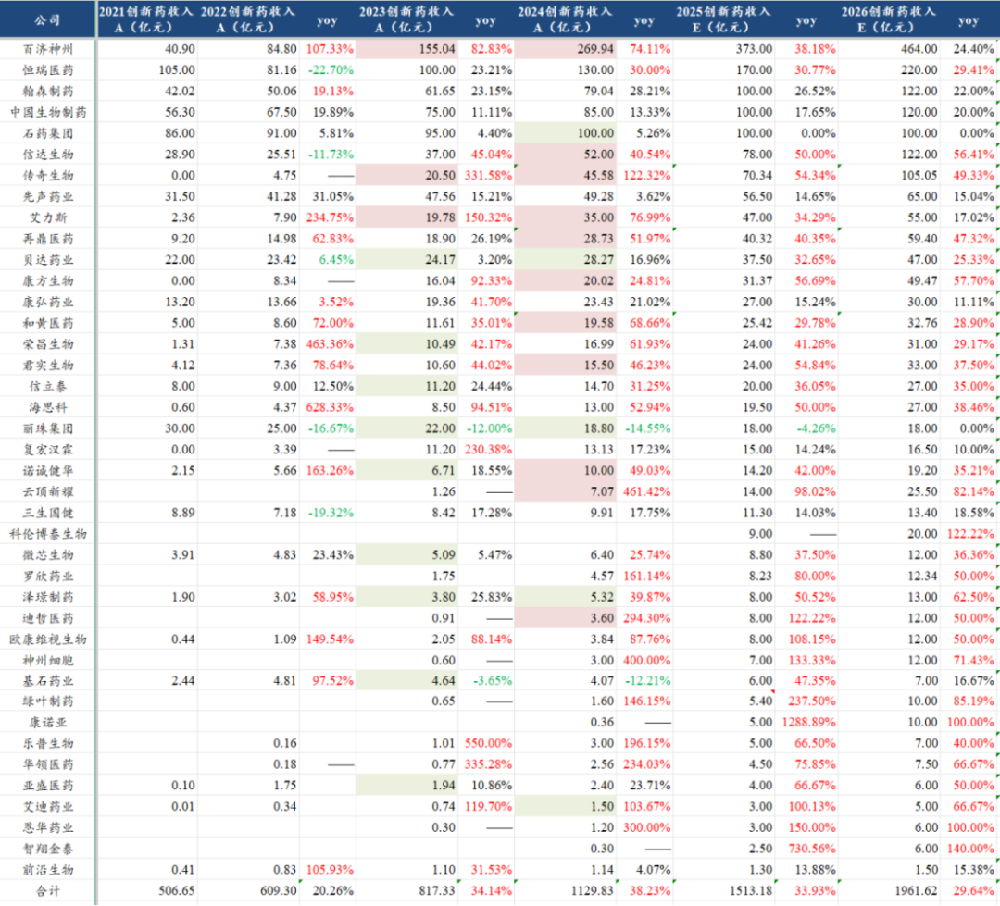
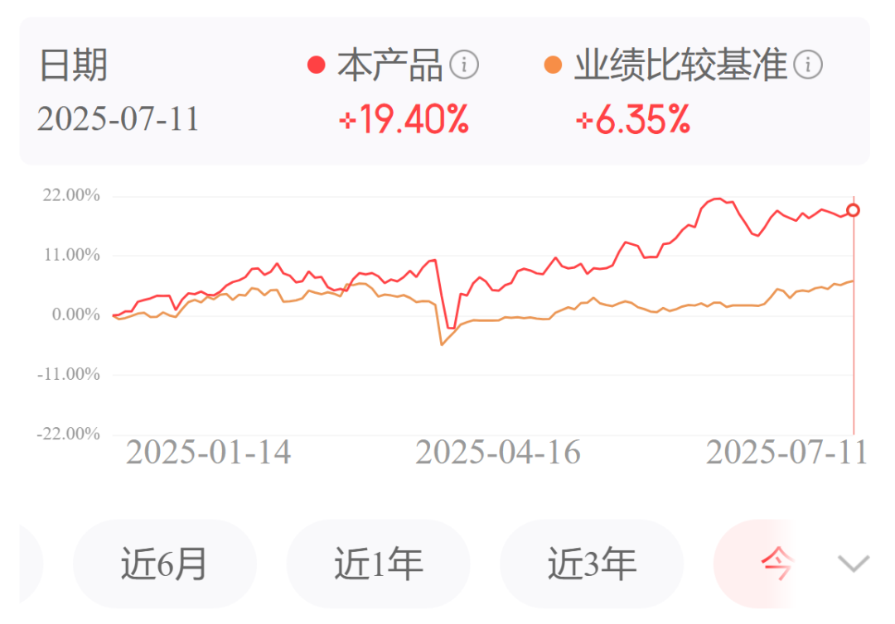
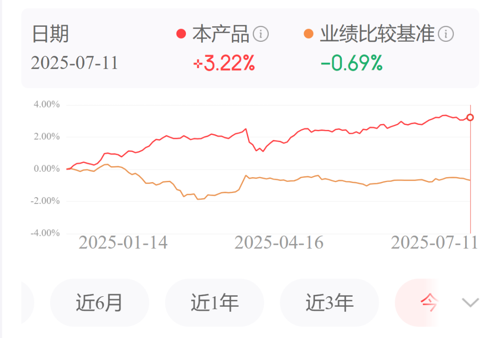

# 药明康德业绩大超预期再度引爆行业

大家好，我是龙哥。

上周四晚，药明康德发布了2025H1业绩预告，按公司原本经营情况公司是不需要发业绩预告的，但由于公司连续减持了在药明合联的持股，使得上半年这部分贡献了32亿的投资收益，导致表观的归母净利润增速超过了100%，因此公司发布了业绩预告。

具体来看，公司预计上半年收入207.99亿元同比增长20.64%，其中持续经营业务收入同比增长24.24%；归母净利润85.61亿元同比增长101.92%，扣非净利润55.82亿元同比增长26.47%，经调整净利润63.15亿元同比增长44.43%。

看Q2单季度，营收111.45亿元同比增长20.37%、环比增长15.43%，经调整净利润36.35亿元同比增长47.64%、环比增长35.63%，经调整净利率32.61%同比提升6.02%，净利率创下2022Q4（新冠大单高基数）之外的历史最高水平，过去10个季度（2023Q1-2025Q2）的经调整净利率分别为26.13%、27.79%、28.82%、24.86%、23.93%、26.59%、28.47%、27.99%、27.76%、32.61%，25Q2之前的9个季度的净利率都稳定在24%-28%左右，因此，在剔除投资收益后，药明康德的经调整净利率仍实现了大超市场预期的提升，预计提升的原因主要是多肽药CDMO订单的高毛利和公司控制降本增效。

公司原本指引全年可持续经营收入同比增长10%-15%至415亿-430亿元、净利率有所提升，实际25Q1-Q2表现来看收入增速超预期、净利率提升显著超预期，则公司全年收入和经调整净利润预期都很可能会上调，预计盈利预测上调后的估值在16-17倍PE，而可比公司lonza目前50倍PE，三星生物60倍PE。

此前六月的文章里已经给大家梳理过CXO行业的逻辑《[创新药行情延伸](https://mp.weixin.qq.com/s?__biz=MzkyMzQ3MDc3Mw==&mid=2247484631&idx=1&sn=46d50979dcb5eb6edfbfb77cf83a7b18&scene=21#wechat_redirect)》，这里我们再进一步的梳理一下CRO/CDMO行业的情况，尤其是估值情况：

1、CDMO/CMO行业

从整个CDMO行业来看，从去年以来我们一直在强调，CDMO/CMO领域由于大部分市场在海外，国内龙头公司的海外收入占比普遍较高，而全球市场的CDMO/CMO行业更多是跟随全球技术趋势，这两年在全球CDMO行业技术趋势带来的景气度最高的细分领域就是GLP-1多肽药CDMO和ADC CDMO两个方向：

①GLP-1药物已经超过PD-1/L1单抗成为全球第一大药物领域，2024年礼来和诺和诺德的4款主要的GLP-1类药物实现528亿美元的全球销售、同比增长45%，预计2025年GLP-1类药物的全球销售额将超过700亿美元，未来几年可能很快突破1000亿美元。

此前诺和诺德的司美格鲁肽以自主生产为主，国内CDMO/CMO企业基本没怎么参与，因此没能受益于司美的产品销售放量，而礼来的替尔泊肽的研发生产与国内CXO龙头的关联度较高，后续国内和海外的GLP-1系列药物、包括多肽药和小分子GLP-1，都较高水平的与国内CDMO公司合作，国内CDMO公司才开始高度受益于行业研发热度的提升。

②ADC药物2024年全球销售额突破100亿美元、行业增速在30%以上，后续还有一系列ADC重磅产品处于临床开发阶段，如科伦博泰与默沙东合作开发的TROP2-ADC目前已经开了14个全球III期临床、合计的计划入组患者人数达到1.3万人，仅临床开发费用就需要数十亿美金。

除了ADC药物领域以外，双抗领域的研发热度也在快速提升，PD-1/VEGF为首的IO双抗以及TCE双抗在实体瘤、血液瘤、自免等领域的开发热度自去年下半年以来快速提升，也诞生了多笔超大规模的BD授权。

从行业具体公司来看，药明系在以上三个药物形式领域的CDMO的全球竞争力得到了进一步的强化，在小分子和单抗药物领域药明系属于跟随者之一，只不过是后来者中最优秀的一家，而在这几个新的药物领域，药明系已经转为引领者之一。

具体来看各家公司的业绩和估值：

①药明康德中报预报业绩超预期，当前市值2228亿元，预计经调整利润138亿+30%，估值17倍左右PE。

②药明生物25年预计业绩修复，ADC、双抗药物预计有较大拉动，最新市值1084亿港元，全年经调整利润预期59亿元+24%，估值17倍左右PE。

③药明合联25年预计维持强势增长，最新市值553亿港元，2025年全年经调整利润预期增长50%，估值29倍左右PE。参考收入利润体量接近时的2020年中的药明生物（40%增速、17亿利润）为1500亿元市值、85倍PE。

④凯莱英业绩也将受益于GLP-1类药物CDMO需求爆发，预计凯莱英25年利润率有所修复，H股估值25-27倍PE，A股估值30-32倍PE。

除此以外还有诺泰生物、圣诺生物、皓元医药等细分行业表现突出的公司，这里不一一罗列，也都享受细分领域的景气度。

CDMO行业主要依靠全球需求，会反复受到海外政治风险的扰动，包括美国制造业回流、生物安全法案、药品关税、中美关系等复杂因素影响，且这些政治因素的影响可能会长期存在，因此以上公司的估值显著低于海外可比的龙头公司估值，就是市场给了其政治风险的折价。

2、CRO行业

CRO行业跟随国内创新药行业临床研发景气度，行业订单来自创新药研发投入，创新药研发投入资金来源主要包括三部分：①一二级市场融资，②BD收入，③产品商业化收入。

①一二级市场融资

二级市场融资已经显著修复，一级市场融资仍处于底部，今年以来创新药、CXO行业的定增、IPO、减持的规模已经达到367亿元。

②BD收入

2023-2025年中国创新药海外BD授权已经拿到的首付款925亿元，加上拿到的部分里程碑付款，预计超过1000亿元。

③创新药商业化收入

我们统计的40家有创新药商业化的上市公司23-26年将维持30%-35%的行业复合增速，预计到2025年超过1500亿收入、2026年接近2000亿收入，将贡献主要的创新药研发投入的现金流来源，且可持续。

以上三张图基本明确了后续可预期的CRO行业的景气度修复，从此前行业交流来看，2025年上半年，CRO行业总体订单量开始企稳回升、订单价格见底但尚未明显提升，目前市场反映的是对创新药二级市场修复后全行业研发投入修复的预期，行业内的公司例如泰格医药H股、昭衍新药、美迪西、普蕊斯、诺思格等等。

①泰格医药H股不含投资收益的最新估值36倍PE，26年估值约27倍PE，考虑25年一二级市场估值的回升，预计泰格医药25年投资收益部分也会有显著改善（24年为亏损3.35亿）。

②普蕊斯目前市值29.11亿元，在手现金8.5亿元，25年周期底部利润约1亿元，估值29倍PE，扣除现金估值20倍PE。

③诺思格目前市值50.41亿元，在手现金17亿元，25年周期底部利润约1.5亿元，估值33.6倍PE，扣除现金估值22.3倍PE。

......

最后再提一句龙哥自己定投的两个组合，龙谈医药科技组合和龙谈美元债组合：

龙谈医药科技组合今年来最新表现是+19.4%，超额收益是13%。

龙谈美元债组合（固收）今年来最新表现是+3.22%，超额收益3.9%。

嫌自己买基金做组合麻烦的读者可以了解下。

风险提示：本文仅讨论行业/公司经营情况，投资需综合考虑公司经营、估值、管理层等多方面因素，建议读者审慎参考，本文不作为投资依据，不建议大家根据本文做出投资计划。

<!-- wxmp-comments-begin -->

---

## 留言（11 条，含回复共 25 条）

- **光头的复利人生** 👍4 · 2025-07-14 15:23
  药明系整个都是高景气啊，双抗三抗有生物，多肽有合全，ADC有合联，爆款赛道全占了
  - ↳ **作者** · 2025-07-14 15:29
    所以说药明系实际上在这波创新药景气赛道里，竞争力又被进一步强化了，从过去的追随者之一，到现在的引领者之一。
- **自得** 👍3 · 2025-07-14 15:30
  泰格医药二季度预期怎样？它的逻辑回来了吗？谢谢
  - ↳ **作者** · 2025-07-14 15:32
    文中其实也都说到了，CRO公司的订单量开始修复，订单价格还没上升，所以业绩反映不会那么快，临床CRO的公司可能最快要到Q3Q4反映在业绩上，但是市场会提前反映这个预期。另外泰格还有就是多一块投资收益，他报表上有接近200亿的各种股权投资和基金投资，像今年创新药新上市的一个牛股映恩生物就有泰格医药投资。
- **快车** 👍3 · 2025-07-14 15:31
  美元债是什么，我一直想买，可以介绍一下吗
  - ↳ **作者** · 2025-07-14 15:50
    汇兑损失也是计入的，我之前也分析过这个问题，第一是国内现在是稳汇率的，第二如果美元出现明显贬值，对应着其经济压力可能更大，降息的预期也会提升，可以一定程度上对冲汇兑损失。
- **王熙** 👍2 · 2025-07-14 15:28
  专业的龙大，把2025全年的业绩预测都做出来了，牛
  - ↳ **作者** · 2025-07-14 15:37
    这不是最基本的嘛，做投资起码要做2-3年的盈利预测吧，哈哈，不然咋有信心持股
- **低碳哥** 👍2 · 2025-07-14 15:53
  龙大，博腾也出中报了，还机会回到曾经的辉煌吗？
  - ↳ **作者** · 2025-07-14 15:57
    比较难吧，上一波是头部公司产能不足带来的订单外溢大幅拉升了博腾的盈利能力，这一波未必还会复现。
- **COCO** 👍1 · 2025-07-14 15:26
  龙哥血制品行业有出现变化吗？龙头公司开始并购同行业？
  - ↳ **作者** · 2025-07-14 15:30
    行业并购整合已经进行了一段时间了，国内血制品公司还是比较多的，未来有可能会整合到10家以内的巨头吧
- **陌上初薰** 👍1 · 2025-07-14 15:30
  持有药明已经翻倍，到迈瑞最近建仓有点被埋了[破涕为笑][破涕为笑][破涕为笑]。另外，药明目前17倍的估值贵不贵啊。。。是不是涨了还便宜了？
  - ↳ **作者** · 2025-07-14 15:35
    你要说贵那肯定不算贵，只不过这个估值是包含了对潜在政治风险的折价的。
  - ↳ **作者** · 2025-07-14 15:39
    问题是地缘风险是客观存在的😂
    迈瑞就是看中报有多差吧，可能会下滑不少。
- **廖书豪** 👍1 · 2025-07-14 15:37
  龙哥，诺思格看起来相对便宜势头也不错，但是董事长的八卦有点多不敢下手啊，请问这种投资要按照个人的投资理念分开看公司吗[捂脸]
  - ↳ **作者** · 2025-07-14 15:45
    诺思格确实是看起来相对便宜，也是因为你说的一些原因导致公司这波股价是滞涨的，这个主要看你的投资思路，从行业β角度还是个股α角度，行业β角度越是因为一些特别事件导致的估值折价，对公司经营影响不大的话，都可能会有更大幅度的估值修复，个股α角度的话就要谨慎看待管理层和公司治理方面。
  - ↳ **作者** · 2025-07-14 15:56
    招标是恢复了，但那个超声集采的价格有点没法看，感觉设备行业并不算政策面出清，我还得再想想。
- **berlin0320** 👍1 · 2025-07-14 15:53
  现在回过头来看，当年生物的估值真是高啊(快跟泡泡玛特有的拼)
  - ↳ **作者** · 2025-07-14 15:55
    药明生物当时毕竟复合四五十的增速呢，叠加一轮医药泡沫化的牛市，爱尔眼科、通策医疗当年也是一两百倍，增速还远不如药明生物。
  - ↳ **作者** · 2025-07-14 16:00
    另外Lonza和三星的PE也够猛的
- **jiaoli** 👍1 · 2025-07-14 18:40
  龙哥，上游奥浦迈业绩也反转了，未来几年培养基预期是高速增长期？谢谢！
  - ↳ **作者** · 2025-07-14 18:46
    培养基肯定是高增长，之前奥浦迈主要是被CDMO这块拖累的
- **北纬32°** · 2025-07-14 18:25
  龙大，凯莱英中报如何？7.15之前还没有出预告[撇嘴]
  - ↳ **作者** · 2025-07-14 18:45
    业绩增速超过50%才强制披露预报的，不然不要求披露呀，康德也是因为投资收益才超过50%的。

<!-- wxmp-comments-end -->
