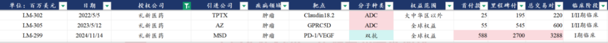
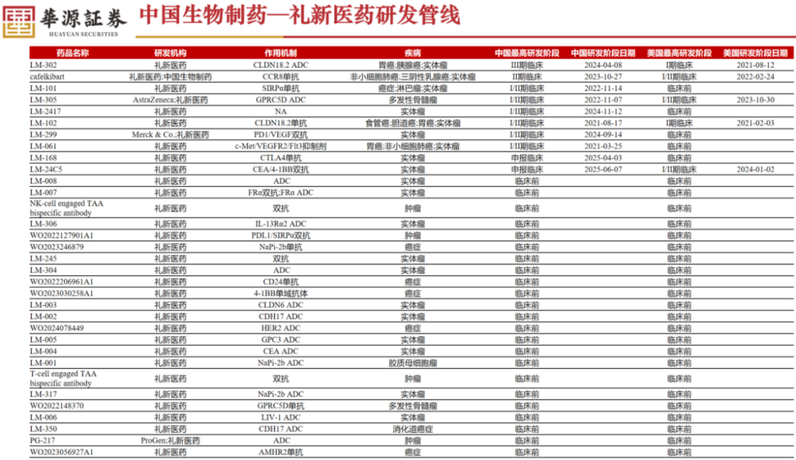
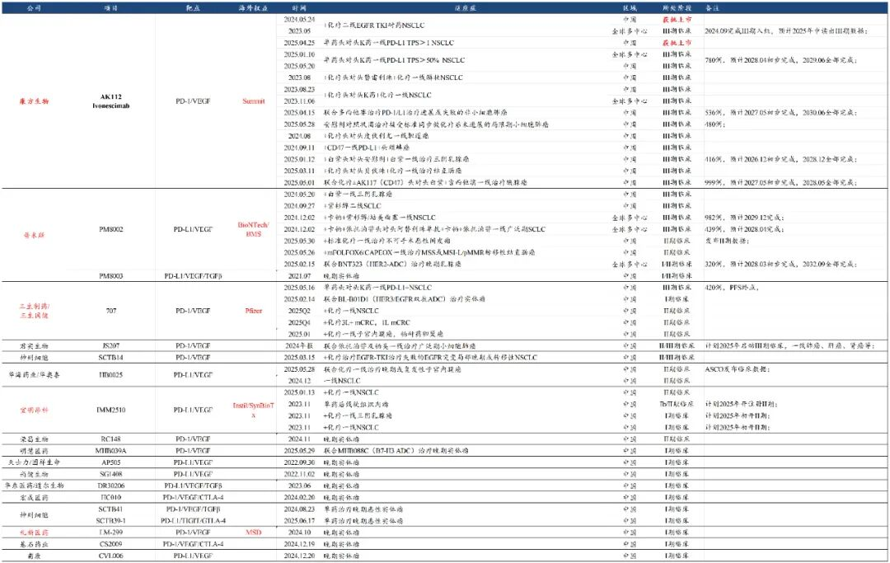
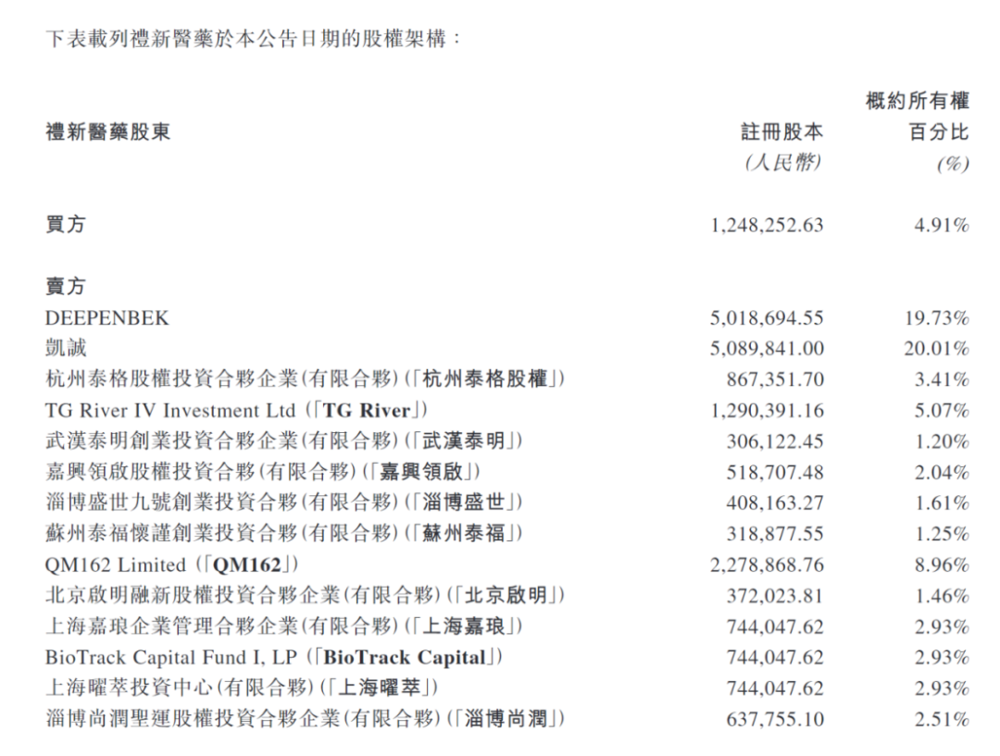
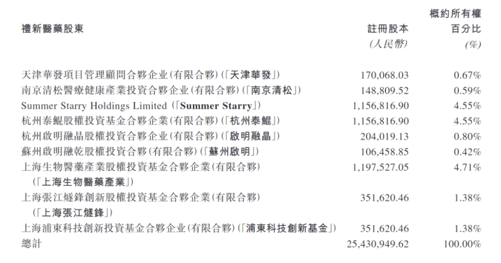

# 低价买到好的资产是一种很强的能力

大家好，我是龙哥。

昨晚中国生物制药公告，全资子公司正大制药投资以9.5092亿美元收购礼新医药95.09%股权，对应礼新估值10亿美元，此前中国生物制药已经取得礼新4.91%股权，本次收购后礼新将成为中国生物制药全资子公司。由于礼新医药在被收购时的在手现金有4.5亿美元，因此本次收购的付款净额为5.009亿美元。

1、礼新医药

礼新医药在去年以来可谓是炽手可热的一家biotech公司，核心原因是其在2024年底以5.88亿美元首付款+27亿美元里程碑付款将其PD-1/VEGF双抗授权给了全球IO之王默沙东，而作为潜在的下一代IO，授权给默沙东意味着提前锁定超级重磅药物的潜力——只要默沙东坚持开发下去。

具体来看，礼新医药有丰富的临床管线和临床前管线。

首先是礼新对海外BD授权的三个项目：

①LM-302（Claudin18.2-ADC）处于III期临床、海外权益以2500万美元首付款+1.95亿美元里程碑付款授权给TPTX公司。

②LM-299（PD-1/VEGF双抗）处于I/II期临床、海外权益以5.88亿美元首付款+27亿美元里程碑付款授权给默沙东，其中金斯瑞蓬勃生物占30%权益。

③LM-305（GPRC5D-ADC）处于I/II期临床、海外权益以5500万美元首付款+5.45亿美元里程碑付款授权给阿斯利康。

然后是其他临床管线：

④Cafelkibart（CCR8单抗）处于II期临床、国内与中国生物制药联合开发。

⑤其他临床管线还有LM-101（SIRPα单抗）、LM-2417、LM-102（Claudin18.2单抗）、LM-061（c-MET/VEGFR2/FLT3抑制剂）、LM-24C5（CEA/4-1BB双抗）。

从华源医药整理的这个数据来看，除了以上一系列的临床阶段的管线之外，还有一个规模庞大的临床前的ADC管线。

这样的BD授权的项目类型和体量，叠加这样的研发管线，在如今的港股IPO的话大概应该是多少估值？简单参照科伦博泰、映恩生物、康方生物、宜明昂科等等公司的估值，100亿以上的估值应该并不算过分，而参照海外对此类公司收并购的估值溢价平均要在30%-50%，也既正常来说收购礼新的估值应该起码在130亿-150亿以上，实际中国生物制药收购礼新的花费则仅有36亿元。

2、中国生物制药

收购估值极低，进入PD-1/VEGF赛道，获得大量ADC临床前管线。

中国生物制药本次以5.01亿美元的净价——也既36亿人民币的极低净价，获得礼新医药的控制权——即便是参照PD-L1/VEGF授权海外小公司、首付款仅有5000万美元的宜明昂科目前都有40亿市值，对于中国生物制药来说可谓是非常划算。

礼新医药为什么会这么低的估值去卖？

是很缺钱吗？——账上趴着4.5亿美元。

是股东无法变现吗？——现在港股IPO通道完全放开。

是股东不太懂估值吗？——创始人、董事长秦莹本身就是医药行业资本运作老手，其与天境的原董事长臧敬五是夫妻，后者更是资本运作的顶级玩家，礼新的股东中包含多个国内顶级的医药一级投资机构，说礼新的股东不懂估值倒不如直接说是龙哥不懂医药。

能以很低的价格买到好的资产，这本身是一项很强的能力，这个能力目前在国内创新药领域只有中国生物制药展现出来，并且不止一次。

收购礼新医药后，中国生物制药可以成为国内PD-1/VEGF双抗的重点玩家之一。

在上一代的IO疗法PD-1/L1时代中国生物制药进度属于相对靠后的，其PD-L1单抗到2024年5月才获批上市，比第一批在2018年底上市的国产PD-1单抗要晚了五年半，其代理销售康方生物的PD-1单抗AK105也没有太大的体量，因此在第一代IO疗法上中国生物制药的表现并不算突出。

而在PD-1/VEGF赛道，虽然在国内市场礼新也是相对靠后的玩家，但凭借中国生物制药的临床开发能力以及礼新与默沙东的合作，中国生物制药还是很有机会进入第二梯队，尤其是该赛道又少了原本第一梯队的恒瑞医药的竞争，更是给了中国生物制药大展身手的机会。

此外，如上文所述，礼新医药还有大量的ADC管线在临床前阶段，可借助中国生物制药的临床开发能力而快速推进，中国生物制药由此获得丰富的早期在研管线，也一定程度上补充了中国生物制药在ADC领域的管线丰富度。

而对于中国生物制药此前收购的A股资产——浩欧博，此前两周已经有传闻中国生物制药收购礼新医药，因此市场预期收购后很可能会注入浩欧博，但公司明确表示礼新不会装入浩欧博、且浩欧博目前没有任何资产注入计划，因此对于浩欧博未来的经营和是否有资产注入还要看中国生物制药的运作。

对于PD-1/VEGF赛道，主要影响就是另有一家国内pharma进入这个赛道，毕竟此前这个赛道的玩家基本是以biotech公司为主。

此前有传闻默沙东退货礼新医药的PD-1/VEGF双抗，本次并购落地更有传闻——否则不会那么低的收购估值，但实际上默沙东这边还在快速推进，退货与否的传闻我们暂时不予置评。

另外从礼新的股权结构可以看出，泰格医药旗下的泰格股权投资在礼新的持股有3.41%，泰格医药控制50%的杭州泰鲲持有4.55%的股权，本次礼新被并购，对于泰格医药来说也可以获得3-4亿的投资收益，今年来还有泰格医药投资的映恩生物在今年上半年IPO也会给泰格医药贡献几个亿的投资收益，而2024年泰格医药总的投资收益（含公允价值变动）是-3.35亿，25年总的投资收益将会大幅增加。

风险提示：本文仅讨论行业/公司经营情况，投资需综合考虑公司经营、估值、管理层等多方面因素，建议读者审慎参考，本文不作为投资依据，不建议大家根据本文做出投资计划。

<!-- wxmp-comments-begin -->

---

## 留言（8 条，含回复共 17 条）

- **Zhanghh** 👍3 · 2025-07-16 10:19
  龙哥好，泰格医药我已经拿了快3年了，从最高点110的持仓下来，也没有补仓，还亏损50%左右，请问龙哥我回本还有希望吗？[流泪]
  - ↳ **作者** · 2025-07-16 10:30
    泰格医药我倾向于H股的弹性更大，行业本身还处于周期底部，我觉得这时候不适合悲观。
- **相濡** 👍2 · 2025-07-16 10:39
  龙哥 康龙化成扣非业绩是不是还可以
  - ↳ **作者** · 2025-07-16 10:45
    嗯，中规中矩吧，之前的文章梳理CXO公司的一季报的时候也有讲到，康龙的业绩企稳已经连续多个季度了，毛利率和业务增速都在恢复，只不过康龙确实没有像药明这样抓住GLP-1和ADC的大的风口，所以就靠小分子这块的话确实没那么大的业绩弹性。
- **孙小山** 👍2 · 2025-07-16 11:14
  龙哥，能不能讲一下再鼎
  - ↳ **作者** · 2025-07-16 11:50
    再鼎没什么好新讲的，短期就是中报业绩估计一般。
    我要长教训，上一轮医药牛市就是讲的票有很多涨的也有跌的，涨了的大家就“没问题”，跌了的就一直问，一直问我就得一直讲，然后就有些读者觉得我特别看好这种讲的多的，然后就kuku买，买的多就问的多，问的多就讲的多，讲的多又买的多，形成负反馈。你看我同样重点讲的诺诚就从来没人问，天天赚钱都觉得理所应当的，就没问题。
- **丁山** 👍1 · 2025-07-16 10:27
  龙哥，请教一个操作上的事。感谢之前推荐的创新药ETF，收获很好。现在手中还有一些余钱，想继续加仓，但已经涨了很多，很犹豫，现在是硬着头皮加仓呢，还是等着回调一波再加呢？
  - ↳ **作者** · 2025-07-16 10:29
    交易上的事不好说，毕竟你让我去做这种精准择时我也做不好的，就我个人来说现在加仓的话更倾向于低估值的pharma重估和CXO
- **Bryan** 👍1 · 2025-07-16 10:33
  那么中生为什么能这么低价买到呢？
  龙哥，器械整体是有点惨啊，看爱博也前低了，整个创新药则是一点就着，不断新高[捂脸]，冰火两重天啊
  - ↳ **作者** · 2025-07-16 10:34
    有些话不能明说，得自己体会，哈哈。
    器械最近就是港股一些业绩不错的非通的小公司表现好，还是和业绩强相关的。
- **十二点睡先生** 👍1 · 2025-07-16 10:56
  看cro好像普遍估值都不低呢，看东财的一致性预期好像未来2-3年增速也不高。
  在您昨天文章提到3方面的因素影响下，cro未来几年有可能带来高增速的量价齐升吗？想请问下龙哥作为业内人士的判断是怎么样的？
  - ↳ **作者** · 2025-07-16 10:57
    我感觉昨天文章写的挺清楚的，现在的盈利预测都是基于周期底部的业绩做的线性外推，等大家看到盈利预测集体变化的时候股价已经反映完了。
- **边行边走** 👍1 · 2025-07-16 11:23
  关于创新药，那些价格低的时候根本不看涨了又捧成什么时刻的机构都是在菩提树下顿悟的吗？前后就半年时间，一月份创新药还惨不忍睹
  - ↳ **作者** · 2025-07-16 11:53
    市场的变化是很快，A股和H股的投资都很卷，这个是市场的归市场，市场就这样，不影响我们对逻辑的判断，市场如果永远都能高度有效，那我们全都买沪深300ETF不就行了，还做什么主动管理。同样的道理，我喊了两年的创新药逻辑，以前行情没起来的时候骂医药垃圾骂我蠢货的也多的是，大部分人不就是盯着那短期的行情做判断吗？
  - ↳ **作者** · 2025-07-16 12:00
    现在文章的阅读人气还是明显不如上一轮，很放心[吃瓜]
- **知行** 👍1 · 2025-07-16 11:40
  龙哥，恒瑞医药的减肥药怎么看，对信达生物的减肥药有多大影响。信达生物接下来的潜力管线是哪些啊
  - ↳ **作者** · 2025-07-16 11:55
    恒瑞的减重药管线布局是国内最全面和最快的，未来必然是要占据领袖之一的地位的，但这个市场够大，信达是国内企业的首发，加上信达很强的执行力，也是值得期待的。
    后续核心管线还是PD-1/IL-2α。

<!-- wxmp-comments-end -->
