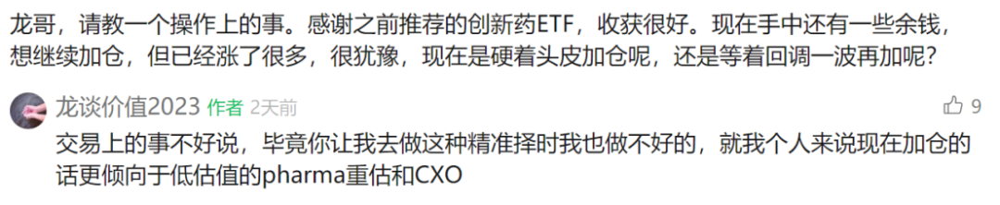
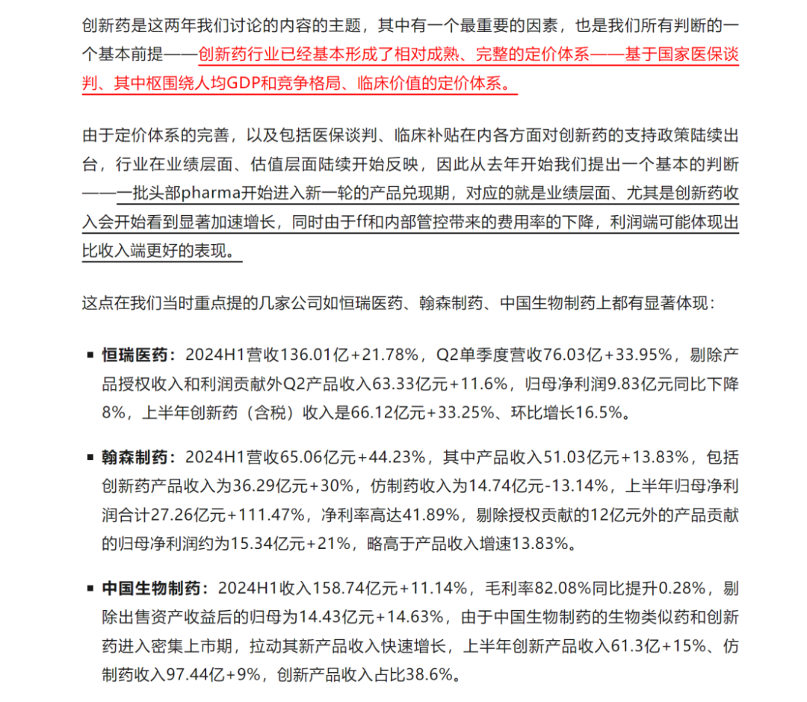
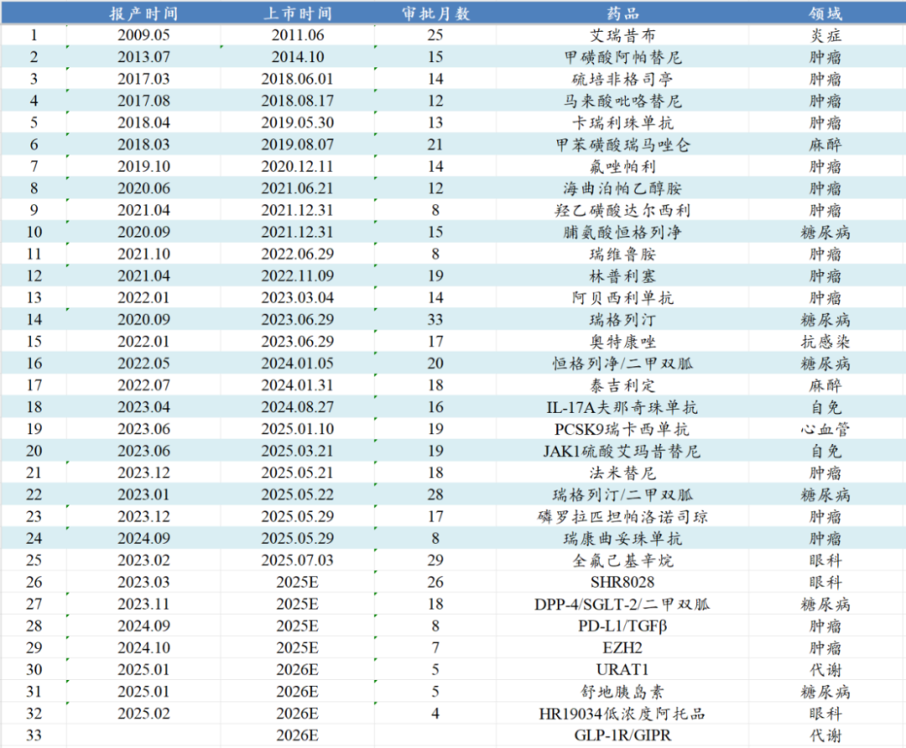
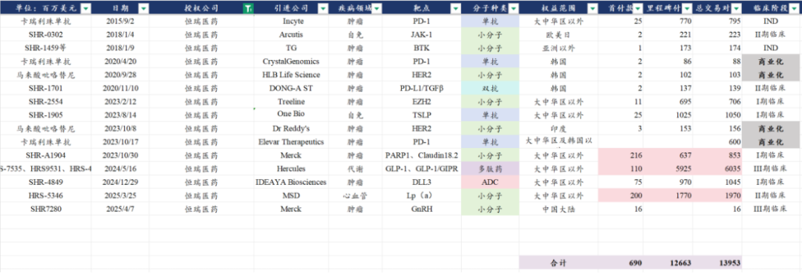
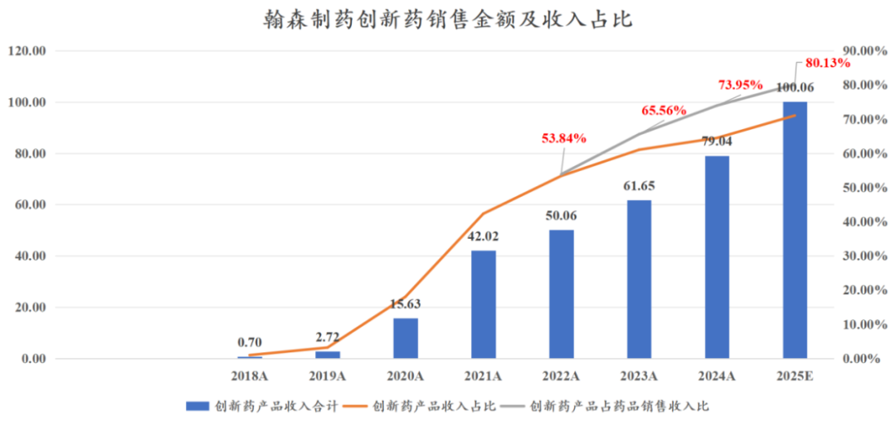
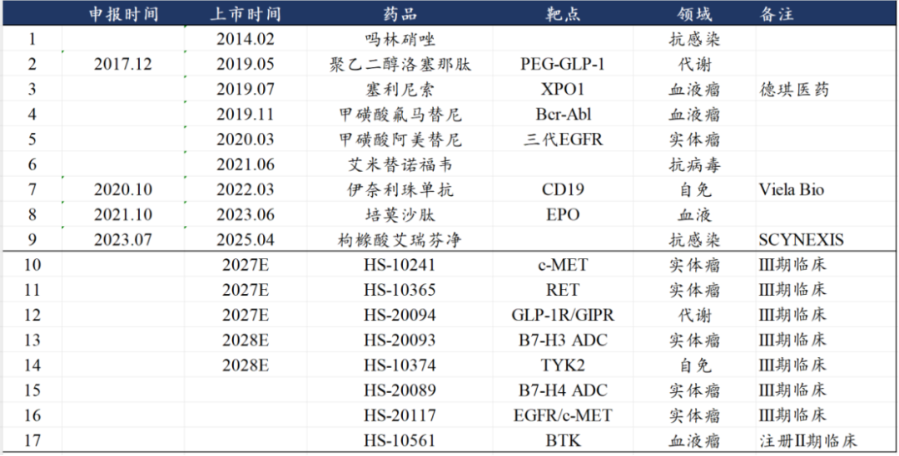
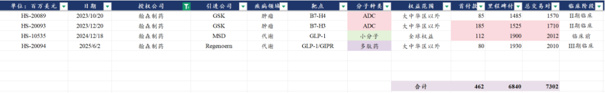
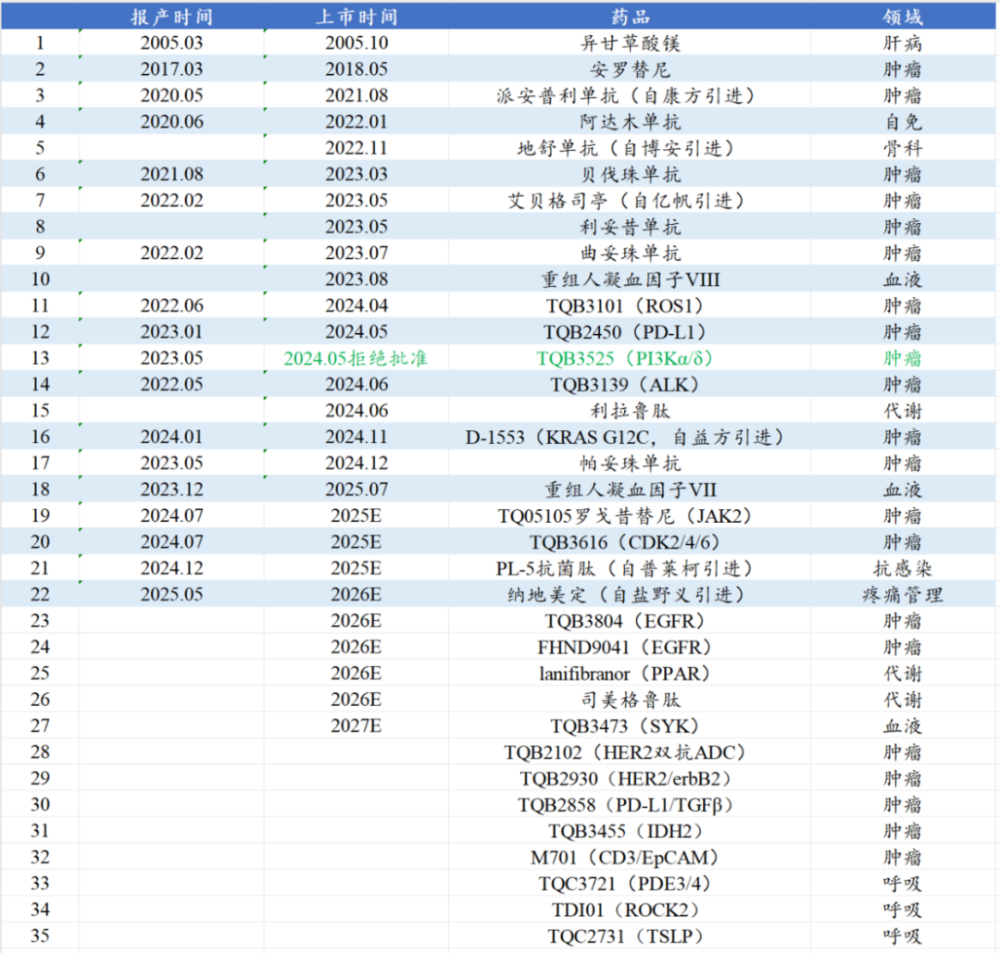
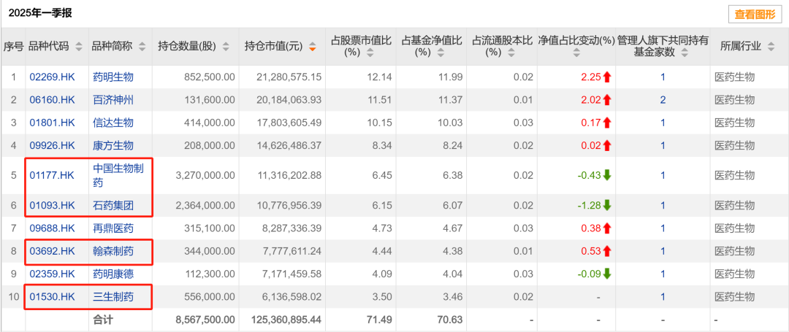

# 创新药浪潮下，传统药企的新时代

大家好，我是龙哥。

短期A股和港股创新药行情如火如荼，一大堆的创新药公司鸡犬升天，这个时候对于很多投资人来说，个股投资标的的选择反而越来越难，当然，行业ETF依然可选，如513780港股创新药50ETF，我们这两年也一直讲到，在大的行业β面前、尤其又是创新药这种高度专业化的细分行业，绝大部分投资人选择ETF都要好于选择个股。

在当前时间点着眼长期去看，应该如何对行业和主要的公司有个基本的判断，除了前面给大家分享过的行业估值的文章《[创新药目前处于什么估值水平？](https://mp.weixin.qq.com/s?__biz=MzkyMzQ3MDc3Mw==&mid=2247484651&idx=1&sn=170b1d665b283894fb722e7daeb885a7&scene=21#wechat_redirect)》以外，还想从行业底层逻辑再来聊一些事情，也是解答读者们现在可能主要考虑的一个问题，也是上一篇文章留言里的问题：

1、商业模式差异

在我们很早之前讨论创新药行业的时候，首先就对行业商业模式做了定性的分析，从全球创新药市场来说，创新药公司可以分为big pharma（大药企）、biopharma（生物制药企业）和biotech（生物科技）：

大药企：完善的产业链布局，从新药早期研发（靶点确认、药物发现），临床前研究、临床研究、产品注册（CDE/FDA沟通）和市场准入（医保/医院）、商业化学术推广等全流程有完善布局，大药企最强的优势应该在临床、注册和商业化，以及有几个比较强的专科疾病领域可以在以上环节形成较强统治力和规模效应。欧美头部大药企可能由于大品种的波动而阶段性的掉队，但长期总可以屡创新高——平台型的大药企和大器械企业在美股长牛是大概率事件（平台价值、可持续的高ROE）。

biopharma：后起之秀，通过在新兴领域的一个或几个重磅大品种实现突破成为平台型公司。传统领域普遍被老的大药企占据，很难突出重围，很可能在做大前就被收购，高速爆发的新兴领域最有望孵化出新的biopharma，例如肿瘤的双抗、ADC领域，抗病毒药物领域等。

biotech：过去的biotech主要靠单个产品的爆发，创新具有偶然性，可持续性很差，绝大多数是昙花一现，投资这类公司的长期回报预期较差，只能投中短期催化剂的兑现，主要时间节点是关键临床数据的发布、产品license out授权、产品获批上市、产品销售爆发超预期。

大药企的全产业链布局和积累，使得大部分的头部big pahrma，虽然可能因为产品管线布局的差异、市场环境的变化以及某些疾病领域和靶点的突破而呈现为不同的发展阶段，但拉长周期来看总体还是能跟上行业大的发展趋势。

过去我们对海外的MNC是有这样的基本的判断，但是对国内的这些pharma能否有能力复制海外MNC的路径也会有些担忧，而在去年以来看到国内一系列积极转型创新的头部pharma的种种表现，也逐步认可了这个商业模式的大逻辑也在国内市场同时发生着。

2、头部pharma量变到质变

在去年8月29日的文章《[最重要行业拐点](https://mp.weixin.qq.com/s?__biz=MzkyMzQ3MDc3Mw==&mid=2247483961&idx=1&sn=a6c753e24d874e551a8d2eebbfb515dd&scene=21#wechat_redirect)》中我们谈到中国创新药行业的历史性拐点，其中第一部分就讲到了传统pharma的基本面拐点：

当时的判断，基于的是恒瑞、翰森、中国生物制药等几家国内非常头部的pharma都已经凭借强大的创新产品管线实现走出集采的影响、基本面全面进入向上的拐点。

恒瑞医药经历了21-22年的低迷后，23年创新药收入106亿+23.5%，24年创新药收入139亿+30.6%，凭借恒瑞的商业化产品线，未来2-3年创新药产品收入可能还会进一步加速：

除了产品国内商业化的加速放量以外，我们在今年写恒瑞的几篇文章里也提到恒瑞强大的BD能力，恒瑞不论是对海外的BD数量、BD总交易对价在整个创新药行业都是遥遥领先、不失其行业龙头名号的。

翰森曾经也是被集采重击，但我们此前一直说，翰森是第一家真正意义上完全实现创新药转型的传统pharma，翰森的创新药收入占产品收入的比重从2018年的1%提升到2024年的74%，如果叠加BD收入则创新药收入占总收入的比重达到77%，2025年这两个比例都会突破到80%以上，由此翰森制药已经成为传统pharma中第一家真正意义上的纯正创新药公司。

出海方面，翰森制药不像恒瑞医药这样百花齐放，但是主打一个高质量，翰森对海外做的4笔BD交易，授权引进方分别是GSK、MSD两大欧美顶级MNC以及美国顶级biopharma再生元，合计拿到4.62亿美元的首付款、73亿美元的总交易对价，实力非常强悍。

中国生物制药我们周三的文章《[低价买到好的资产是一种很强的能力](https://mp.weixin.qq.com/s?__biz=MzkyMzQ3MDc3Mw==&mid=2247484742&idx=1&sn=3b77cde1e501d8be6f0a0bdf7d2ace00&scene=21#wechat_redirect)》刚写到其收购礼新医药这笔非常优秀的并购交易，以很低的价格买到了与中国生物制药高度协同的优秀肿瘤产品管线，并且还获得了与MSD合作开发的潜力巨大的二代IO药物PD-1/VEGF双抗。

实际上中国生物制药的创新转型在一众pharma里并不算非常早的，在前几年还是非常注重仿制药可以快速贡献现金流，因而对仿制药的投入还是不少，因此在2018年安罗替尼上市后一直到2024年才有自研的第二个创新药获批上市，中间时隔了6年。

但我们在去年8月的文章中还是重点提到了中国生物制药，也是看到了其从集采的影响中走出来、多年研发积累的生物类似药和创新药也陆续进入密集的上市兑现阶段：

也是由于中国生物制药创新药管线布局相对不算领先，因此这几年在从恒瑞、翰森等传统药企再到一众biotech火热的进行海外BD的时候，中国生物制药这边一直没太多动静，上一笔交易是2021年2月将ROCK2做了海外BD授权，直到今年，中生的创新药管线终于也将迎来出海方面的进展。

自有管线中PDE3/4具有很强的海外BD的预期，默沙东刚刚以100亿美金的总交易对价收购了海外一家做PDE3/4吸入制剂的公司，也将中生这个PDE3/4分子的价值量提升了一个台阶，中国生物制药本次收购礼新制药，也获得了礼新3款海外BD授权的分子，可以享受后续持续的里程碑付款和潜在的销售分成。

除了以上三家在创新药领域进展最为领先的传统big pharma以外，后续的一系列公司也都呈现不俗的表现，这里简单罗列一下，例如：  
石药集团在创新药转型上走了多年的弯路，今年来也逐渐走上正轨，小分子药物、ADC药物和AI药物发现平台的海外BD为其带来了累计2.83亿美元首付款和119亿美元的潜在里程碑付款，并且公司在今年6月与AZ达成一笔总交易对价53.3亿美元的BD授权后，后续可能还有两笔总交易对价在50亿美金的BD合作。

科伦药业持续投入10年之久的科伦研究院，曾经是长期拖累业绩的部门，直到科伦博泰给默沙东的ADC管线BD授权、再到科伦博泰独立IPO市值很快超越母公司，可谓是不鸣则已、一鸣惊人，中国创新药出海的重磅品种历史中大概率要留下科伦的大名。

三生制药是今年传统pharma中涨幅最大的公司，今年来的涨幅达到4倍，此前极致的低估值（6-7倍PE）+超级大品种的重磅海外BD（PD-1/VEGF），使得三生制药完成脱胎换骨的转变，半年前还是毫无存在感的“港股上个时代遗留的传统pharma”，时隔半年已经成为中国创新药出海的领军企业之一《[创新药520的浪漫是三生制药给的](https://mp.weixin.qq.com/s?__biz=MzkyMzQ3MDc3Mw==&mid=2247484530&idx=1&sn=e240f64a1a2d6cac85cd2fa6c0b6b8ed&scene=21#wechat_redirect)》。

此外还有华东医药、信立泰、海思科、丽珠集团、康弘药业、复星医药（复宏汉霖）、先声药业、绿叶制药等等一系列的传统药企都已经陆续走出集采的影响，进入新一轮的创新药兑现期。传统pharma在中国市场终于也迸发出最强的生命力。

传统pharma不是天生就该低估值，低估值的核心在于市场对其原有业务经营和增长可持续性的担忧，但新的风口已来，传统pharma甚至普遍已经从创新药转型从第一阶段的me too药堆数量到第二阶段的质量提升、冲向国际市场，在创新药重磅品种海外BD上国内的big pharma与新兴biopharma/biotech可以齐头并进。

同时这也带来了另一个影响，过去大家总是抱怨行业ETF对纯粹创新药标的的权重不够高——CXO、市值偏大的传统pharma都不被看好，而这一批头部传统pharma的基本面大幅改善、进入新的发展阶段，也会使得投资行业指数的投资人能更多享受到这轮创新药牛市。

以513780港股创新药50ETF为例，成立至今累计净值1.73，今年以来涨了84%，自今年3月以来份额有快速增加，目前总规模是12亿左右的比较适中的规模。其前十大持仓中包括4家头部传统药企，未来恒瑞医药的H股大概率也会纳入一系列的指数、从而获得ETF的配置。

风险提示：本文仅讨论行业/公司经营情况，投资需综合考虑公司经营、估值、管理层等多方面因素，建议读者审慎参考，本文不作为投资依据，不建议大家根据本文做出投资计划。

<!-- wxmp-comments-begin -->

---

## 留言（10 条，含回复共 22 条）

- **十二点睡先生** 👍11 · 2025-07-18 14:52
  创新药个股属实难以把握，买了之后涨跌都熬不住，最后换了港股创新药ETF，仓位占2成，从亏30%到如今收益率超过60%，虽然比不上很多个股的涨幅，但也贡献了今年账户一半的收益，这2年真是非常感谢龙哥的持续按摩，不然真熬不住，下一阶段等出现泡沫时，希望龙哥也多多提醒下我们及时撤退，周期的力量太强了
  - ↳ **作者** · 2025-07-18 14:54
    [抱拳][抱拳][抱拳]
- **PBalu 一颗尘埃** 👍5 · 2025-07-18 14:23
  翰森从开始关注你的公众号买进一直持有。
  - ↳ **作者** · 2025-07-18 14:29
    看你历史留言，biopharma里头部的康方，pharma里的翰森，都买的很好啊，药明生物其实也很好，就是分拆合联之后药明系最优质的资产变成合联了。
  - ↳ **作者** · 2025-07-18 14:36
    康方也持有近三年了。去年判断今年底前可以到120，现在已经突破140了。计划忽略波动继续持有到明年底再看看
- **DRAGON** 👍5 · 2025-07-18 14:45
  还是最看好那个夫妻店[呲牙]，资金有限，一直只拿着恒瑞，还会继续一直拿下去
- **张景涵** 👍3 · 2025-07-18 14:14
  龙哥您好！，能说一说过去您非常看好的爱博医疗吗？谢谢！
  - ↳ **作者** · 2025-07-18 14:16
    爱博医疗我前面写过文章分析过了，q2业绩压力会比较大，拐点应该在q3q4。
- **Bryan** 👍3 · 2025-07-18 14:17
  这一周又是卖飞打脸的一周，昨天意气小小的在富途卖空了一只跟风的医药，静待回头吧[翻白眼]。还是底部好选股啊
  - ↳ **作者** · 2025-07-18 14:18
    [呲牙]
  - ↳ **作者** · 2025-07-18 14:31
    周一卖了6成，周四又卖了剩下的6成，人已经不好了
  - ↳ **作者** · 2025-07-18 14:33
    你是融资了啊，卖了12成
- **马华磊** 👍3 · 2025-07-18 14:30
  ai的发展对创新药生物分子的发现效率提升，已经在行业产生生产力提升了么
  - ↳ **作者** · 2025-07-18 14:34
    嗯，在分子发现这块是明确有提升了
- **个人调研心得** 👍2 · 2025-07-18 14:16
  龙哥，关注挺久了，想问问关于cxo，有没有比较好的标的，可以中长期一点持有
  - ↳ **作者** · 2025-07-18 14:17
    参照7月14号的内容，我在评论区回复一下几十个字，肯定不如两三千字的文章内容写的具体呀，多读读文章内容，有问题再来留言讨论[呲牙]
- **胡言胡语hws** 👍2 · 2025-07-18 14:16
  请问金赛药业的临床管线怎么样？转型创新药还有机会吗？
  - ↳ **作者** · 2025-07-18 14:18
    金赛这些年研发投入其实投的一点都不少，就是效率看上去确实低了点，但也开始进入产品的兑现期了。
- **杜军** 👍2 · 2025-07-18 15:22
  龙哥：您对消费医疗怎么看呢？目前拐点没到？港股的海吉亚做为肿瘤医院中的希缺资源不被市场看好，能帮说说内在逻辑吗
  - ↳ **作者** · 2025-07-18 15:38
    消费医疗是和宏观经济高度挂钩，其他大众消费品不行的时候你也很难指望消费医疗很好。
    公立严肃医疗现在床位过剩，后线城市的医保一塌糊涂，那有什么稀缺资源。
- **杜杜** 👍2 · 2025-07-18 19:02
  龙哥，那么上一轮创新药全面泡沫化时的估值是多少呢？
  - ↳ **作者** · 2025-07-18 19:08
    下篇文章拉一下21年的估值给大家看看[破涕为笑]

<!-- wxmp-comments-end -->
