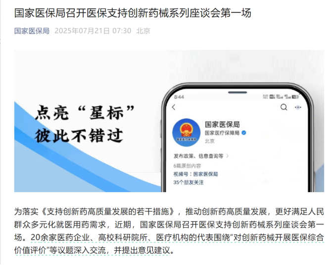
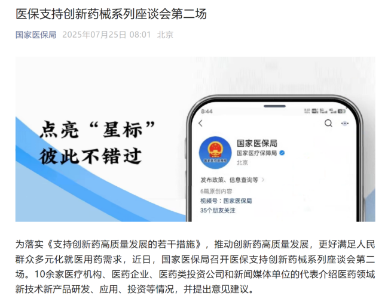
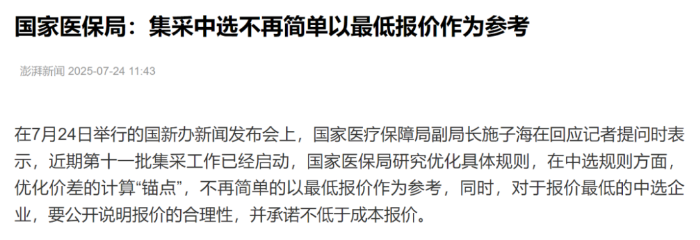

# 医疗器械终于迎来政策拐点

大家好，我是龙哥。

今年来创新药的行情极其火爆，医疗器械行业一直表现的不温不火，有不少投医疗器械的读者在留言或私信反复提问器械行业何时能有机会的问题，我们此前的回答一直是“今年器械行业有望看到政策拐点”，那到现在，我们可以说，医疗器械的政策拐点，应该是真的到来了。

医疗器械的政策拐点我们主要的期待有两点，第一点是从审批端，我们希望体现对创新器械与仿制器械在审批端、分类端的显著差异，这样才有可能在支付端实现显著差异；第二点是从支付端，我们希望看到支付端出现对医疗器械的新的定价体系的出现，参照药品行业的定价机制——仿制药还是会持续推进国家集采、创新药则是形成成熟的国家医保谈判的成熟体系，创新器械能否形成新的、区别于大部分普通仿制器械的定价机制，对未来该行业的市场空间和市值空间都会有重大影响。

从6月以来行业政策面陆续开始出现一系列变化：

1）审批端：药监局支持创新器械举措 

2025年6月20日周五下午盘后，国家药监局正式审议通过《关于优化全生命周期监管支持高端医疗器械创新发展的举措》，涉及的领域包括医用机器人、高端医学影像设备、人工智能医疗器械、新型生物材料医疗器械等高端医疗器械，支持举措包括优化特殊审评程序（类比创新药优先审评、突破性疗法等）、完善分类和命名原则（潜在区分创新器械与仿制器械）、持续健全标准体系、进一步明晰注册审查要求、健全沟通指导机制和专家咨询机制、细化上市后监管要求、强化上市后质量安全监测、密切跟进产业发展、推进监管科学研究和推动全球监管协调等十方面措施。

2）支付端：医保局召开支持创新药械座谈会

医保局支持创新药发展到今天已经是毋庸置疑了，已经在多方面的政策明文以及近3年的医保谈判中有明确反映，但对创新器械的支持一直还是停留在理论层面，我们此前也多次讲到，医疗器械目前是无差别的进行集采降价，这种背景下创新器械是难有生存之地的。

2025年7月21日，也就是本周一，国家医保局公众号发布其近期召开了“医保支持创新药械系列座谈会第一场”：

第一次座谈会邀请的是以行业专家为主，包括各个大学和医院的产业专家、政策研究专家，其中涉及到的企业方代表有上海罗氏制药和百济神州——分别是欧美和中国的顶级创新药器械。

紧接着今天早上，医保局的公众号又发布了第二场医保支持创新药械座谈会的情况：

这次邀请参加座谈会的，除了行业专家以外，包括了更多的企业代表以及资本市场投资机构代表，企业端，包括医疗器械领域的上海联影医疗（大型医学影像设备）、北京术锐机器人（手术机器人）、浙江强脑科技（脑机接口）、丹麦康乐保（医疗耗材），以及药品领域的迪哲医药、亿帆医药。

从以上邀请的一系列企业方可以看出，与此前药监局公布的支持创新医疗器械举措涉及的领域高度重合，我们可以基本认为，目前监管部门一致认可的、要重点支持的创新器械领域就是高端影像、机器人、AI、生物材料四大块。

3）医保局集采中选不再简单以最低报价为参考

这点实际上是与近期的反内卷和价格竞争政策相呼应的，这是国家对所有行业的要求，而医疗领域恰好又是前几年的集采中被一些极端低价伤害的比较严重的领域，实际上这个领域的“纠偏”——也就是不再以绝对低价作为唯一指标，早就已经发生，并且已经在过去多次的耗材、设备、药品集采中有所反映。市场对医保局的这个发言非常关注，实际上产业端更早些时候已经在这样做。

......

为什么龙哥判断器械行业会有政策拐点？又为什么判断今年很可能是器械政策拐点？这个问题我们是早就经过了深入思考的。

第一，医疗器械从全球来看是一个市场规模高达6000亿美元的庞大市场（VS全球创新药市场1.2万亿美元），中国医疗器械市场规模也已经突破万亿元（VS中国药品终端销售1.8万亿元），虽然相比全球和国内医药工业产业来说要小一些，但也大致可以看出，医疗器械在全球和国内市场的规模都已经达到药品行业的一半左右，是一个完全不容忽视的超大市场。

从大的产业的角度，这是国内进行产业升级、创造高收入工作岗位、提高人均GDP的重要领域之一，是不应该被放弃、不能被放弃的一个方向，这是产业层面和国家战略层面的问题。

第二，理论上来说，医疗器械的研发创新，需要有以下几点：①庞大的医疗市场和先进的临床医学水平、医工结合；②配套的新材料、电子制造产业链；③庞大的工程师团队。好家伙，这不就是为中国量身定制的吗？

但医疗器械与创新药的不同之处在于，创新药的出海可以通过简单的BD授权的方式，海外的临床、注册、商业化都是由海外MNC进行，由此国内的创新药公司实际上是以相对较低的成本、高效率开发早期分子去分享全球创新药市场。而医疗器械领域目前来说全球主流的技术引进模式还是巨头并购中小公司，以此实现技术引进协同或者跨领域扩张，器械企业本身在大部分情况下需要承担起来研发、临床、注册、商业化的全流程。

当然虽然这种困难客观存在，也意味着国内器械公司想要突破海外市场需要付出更艰难的、更长周期的努力，但总归还是有进展的，如迈瑞、新产业、联影、南微等公司已经在海外市场做出不错的成绩，这两年我们也看到国内较差的政策环境在不断倒逼企业拼命去打开国际市场。而一旦能够有所突破，器械企业形成品牌、渠道优势后，再借助器械本身迭代式、循序渐进式的创新模式，则很难被后来者颠覆。

......

在以上背景下，我们也再次重申我们对器械行业的拐点：

①器械板块政策拐点逐渐明确：

2020年以来医疗器械板块政策面呈现单边向下，集采趋于持续扩散，创新器械难有生存之地，产业遭到较大打击，类似2021-2022年的创新药。

前期药监局、医保局的主要改革精力都放在创新药领域，创新药政策从22年底医保谈判作为拐点，随后多部门的支持政策在23-24年陆续推出，行业政策拐点趋于明确，出海逻辑也在22年底重塑，基本面和股价滞后1.5-2年达到正式拐点（股价也受到大盘影响）。

创新器械在近期陆续开始看到政策拐点的迹象，药监局已经率先出手，医保局也连续组织产业专家座谈会，后续政策可能也已经在路上。

②方向选择：

方向上有几个思路可选：

- 大的器械平台公司或者行业ETF，直观反映行业政策拐点下的行业β，也就是第一步的行业性的估值修复。
- 尚未集采、但因为有集采预期而提前杀估值的标的。
- 已经集采、前期降价幅度较大导致杀业绩、杀估值的标的，后续有望修复预期和业绩。

风险提示：本文仅讨论行业/公司经营情况，投资需综合考虑公司经营、估值、管理层等多方面因素，建议读者审慎参考，本文不作为投资依据，不建议大家根据本文做出投资计划。

<!-- wxmp-comments-begin -->

---

## 留言（11 条，含回复共 21 条）

- **Jeff.Chen13** 👍10 · 2025-07-25 10:10
  感谢老师分析，大平台我选迈瑞医疗，弹性创新我重仓了爱博医疗（完美符合政策导向的好企业）
- **lijiang** 👍5 · 2025-07-25 10:10
  龙大，帮分析下微创医疗，最近大涨，是不是内部有啥变化
  - ↳ **作者** · 2025-07-25 10:12
    所以本文的内容是？
- **灵感自在** 👍3 · 2025-07-25 10:07
  龙大，下次把几个重点创新器械梳理一下吧，然后电生理这块目前什么个情况？
  - ↳ **作者** · 2025-07-25 10:09
    好的，后面都会梳理的，这篇是器械行业观点先点个题。
    电生理目前海外强生和波科都高度重视，增长都挺不错，尤其是PFA。国内的话行业也还在高速增长阶段，惠泰和微电生理也都是不错的。
- **隐隐** 👍3 · 2025-07-25 10:35
  要么就是迈瑞，要么就是医疗etf，不过etf最近涨了也有十几个点了[破涕为笑]
  - ↳ **作者** · 2025-07-25 10:39
    医药的行情这么火爆，有些业绩好的器械公司其实最近也偷偷涨了些，尤其港股很便宜的那些。
- **丁山** 👍3 · 2025-07-25 11:23
  龙哥，还是推荐几个医疗器械的ETF吧？我们散户还是跟踪不好个股。
  - ↳ **作者** · 2025-07-25 11:31
    好的，下一篇就分析下医疗器械etf的情况
- **廖书豪** 👍2 · 2025-07-25 09:59
  龙大最近高产啊，从创新到CRO到器械，适合开个打赏大家一起沾沾喜气了[呲牙]
  - ↳ **作者** · 2025-07-25 10:06
    马上月底了，你懂得[愉快][愉快][愉快]
- **和** 👍2 · 2025-07-25 10:05
  欧普康视咋那么弱？
  - ↳ **作者** · 2025-07-25 10:14
    欧普周三提前拉了15%啊.....
- **陈慧流氓牛～读好书，减肥～** 👍2 · 2025-07-25 10:07
  老师，乐普现在的管理者，你怎么看呀？
  - ↳ **作者** · 2025-07-25 10:10
    微创、乐普的管理层，都没什么好多说的，又没换，不是股价涨了就不一样了，同样的之前也不是股价跌了就那么罪大恶极了。这俩就都是类ETF的行业β标的。
- **Jimmy** 👍2 · 2025-07-25 10:10
  龙大，逻辑上是不是高端耗材类似爱博心脉这些相对与设备股的弹性会更大一点？
  - ↳ **作者** · 2025-07-25 10:12
    是的，医疗设备的政策压力实际上是23年下半年开始出现，24年开始放大，而高值耗材这些的政策压力是从2020年到现在已经5年，持续时间更久、反映更充分、出清更彻底。
- **陌上初薰** 👍2 · 2025-07-25 10:48
  座谈会怎么都没迈瑞参加啊？最近感觉迈瑞还是涨不动，可能都在等三季度，是不是能兑现重大拐点，如果管理层不靠谱，那完蛋了。。。
  - ↳ **作者** · 2025-07-25 10:51
    说迈瑞管理层不靠谱的还是挺罕见的.......迈瑞已经用实力证明就是国内器械行业顶级的管理团队。
    至于座谈会，我文中明确讲了啊，从参会企业来看就是按照国家层面定位的器械领域4个重点支持的高端领域各选了一个，其中包括一个海外的、3个国内的，3个国内的分别是上海、北京、浙江的公司，非常有代表性。这个不是说谁牛谁上桌，威高、乐普、微创不都也没上桌嘛。
- **Vincent** 👍2 · 2025-07-25 11:18
  龙哥港股的威高是不是值得看一看
  - ↳ **作者** · 2025-07-25 11:23
    [笑脸][笑脸][笑脸]

<!-- wxmp-comments-end -->
