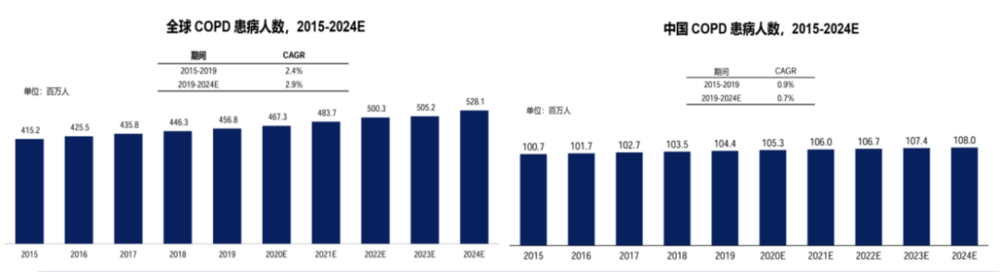
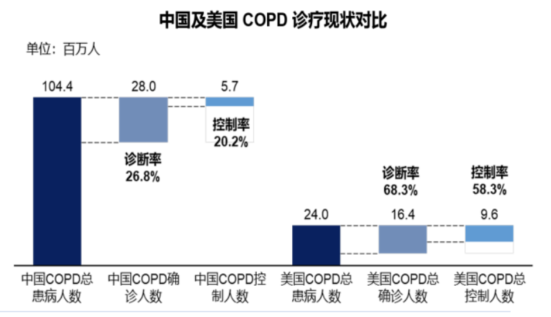
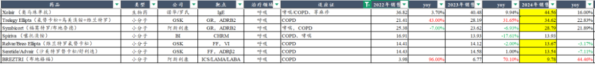
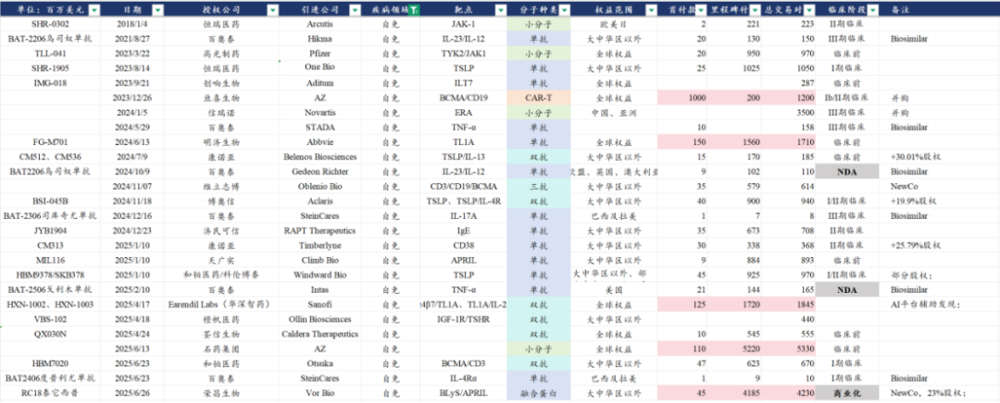

# COPD诞生百亿美金超大海外授权交易

大家好，我是龙哥。

今天一早，恒瑞医药给大家带来好消息，其在研用于治疗慢性阻塞性肺病（COPD）的HRS-9821（PDE3/4抑制剂）以及其他11个临床前分子的大中华区以外权益被授权给GSK，恒瑞医药获得5亿美元首付款和120亿美元的里程碑付款，合计125亿美元的总交易对价，也是国产创新药出海的又一个里程碑。

借此今天就来聊聊COPD领域的情况，以及国内创新药企业在COPD领域的新药开发进展。

1、COPD患者群体庞大、大品种频出、新靶点突破

提到COPD，首先大家能想到的就是患者群体极其庞大，COPD全球患者人数预计在5亿人以上，中国的患者人数预计在1亿人以上，其中中重度的患者占比在35%以上。在庞大的患者基数之下，COPD每年在全球造成300万人以上的死亡，是全球第三大死因。超大患者基数+较多死亡患者数量，使得该领域天然就容易诞生大药。

在患者群体庞大的同时，国内市场还存在的客观问题就是诊疗率低的问题，这个问题在所有中低收入国家都存在，呼吸困难、慢性咳嗽等症状相比其他感受更直观的疾病——剧烈疼痛、瘙痒等相对更可以忍受，经济条件差的患者接受诊疗的意愿都会相对偏弱。

呼吸科吸入制剂行业，算是我们的“老朋友”了，我们在2020年的时候就曾重点分享讨论COPD领域的药物，但当时的COPD领域国内药企开发的还是以呼吸科吸入制剂的仿制药为主，其主要难点来自制剂工艺，而时隔5年，行业也已经发生了比较大的变化，如PDE3/4、DPP-1等小分子新靶点和IL-4Rα、TSLP、IL-5、IL-33等生物药靶点陆续取得一些突破，COPD也进入一批新药密集兑现的阶段，行业有望重新迎来加速增长。

当前全球销售体量较大的COPD的治疗药物，仍然以小分子的吸入制剂为主，大分子药物则是陆续开始获批或进入注册III期临床。

我们看当前全球重点的COPD大品种，在小分子药物领域，主要包括GSK的Trelegy Ellipta（氟替卡松+乌美溴铵+维兰特罗）和阿斯利康的BREZTRI（布地奈德+格隆溴铵+福莫特罗）两款三联疗法（糖皮质激素ICS+长效抗胆碱药LAMA+长效β2受体激动剂LABA）增速较快，而上市时间更早的二联疗法则逐渐下滑。

以上仍是传统机制的小分子药物，主要通过多药复方联用的方式提高疗效。2024年6月，FDA批准了20年来首款COPD领域新机制的吸入制剂药物——Verona Pharma的Ensifentrine（PDE3/4抑制剂），该公司在前阵子刚被默沙东以100亿美金的总价收购。

生物药领域，全球首款获批的COPD生物制剂疗法是赛诺菲/再生元的度普利尤单抗（IL-4Rα），GSK的IL-5单抗在去年12月也在美国FDA申报上市用于治疗COPD，阿斯利康的TSLP单抗在今年3月启动COPD的注册III期临床，而前几天赛诺菲和罗氏发布的IL-33的III期临床数据均为两项临床一胜一负，其中赛诺菲的IL-33单抗在戒烟的COPD患者中达到III期终点、吸烟患者中未能达到终点。

2、竞争格局较好、聚焦龙头公司

全球市场在新机制上陆续取得突破，国内市场也有所跟进，相比肿瘤、自免等领域，呼吸科的竞争格局要显著更好，核心原因我们认为有几点，第一还是传统的问题，小分子呼吸科吸入制剂的工艺还是存在know how的壁垒，第二个则是COPD的临床确实比较难做，第三是呼吸科的商业化难度也较大。因此国内那么多做IL-4Rα的公司也有几家没有选择COPD这个大适应症去推临床。

国内和全球创新药开发，竞争格局都是一个极其关键的因素，全球市场COPD领域小分子药物的开发过去主要就是GSK、阿斯利康和勃林格殷格翰等少数玩家，现在默沙东收购PDE3/4、赛诺菲以生物制剂加入战场，GSK紧随默沙东之后选择BD引进一款恒瑞医药的PDE3/4抑制剂。

国内市场，竞争格局也相对简单，小分子药物和大分子药物开发的公司都比较有限，因此我们可以比较简单的梳理一下这个领域的研发进展以及未来还有BD潜力的分子。

1）新机制小分子吸入制剂

新机制的小分子吸入制剂主要包括PDE3/4和DPP-1。

PDE3/4目前有3家公司处于临床试验阶段：

①中国生物制药的TQC3721：2025年6月国产首家启动III期临床用于治疗COPD，此前大家对国内的PDE3/4海外BD预期比较高的实际上是中国生物制药，但没想到恒瑞医药率先落地，而此前市场对中国生物制药的PDE3/4海外BD的预期是首付款1亿美元左右，随着默沙东100亿美金的并购和本次GSK的5亿美元首付款+120亿美元里程碑付款这两笔交易落地，也意味着中国生物制药这款分子的潜在交易对价可能会有所提升。

②恒瑞医药的HRS-9821：恒瑞医药最早在2022年8月获得HRS-9821吸入混悬液的临床批件，然后在2025年7月初获得吸入粉雾剂的临床批件，该分子累计的研发费用是3843万元，BD授权仅首付款就赚了36亿元——接近100倍，三生三世花不完。

2023年8月恒瑞医药以2150万美元首付款+10亿美元里程碑付款将长效TSLP单抗SHR-1905授权给One Bio，时隔5个月该公司被GSK以10亿美元首付款+4亿美元里程碑付款收购，虽然恒瑞被“最黑中间商”血赚10亿美金，但塞翁失马焉知非福，也可能也是由此与GSK拉进了关系，或许间接促成了这次5亿美金+120亿美金的超级大BD。

③海思科HSK39004：海思科的HSK39004吸入混悬液最早在2024年7月获得临床批件，随后在今年2月获得粉雾剂的临床批件。

DPP-1目前有两家处于临床阶段：

①海思科HSK31858：2024年4月启动COPD的II期临床，并且2024年还启动了首个III期临床用于治疗非囊性纤维化支气管扩张症。

②复星医药XH-S004：2025年7月启动COPD的Ib期临床。

2）生物制剂

生物药我们主要从两个方面来考虑，一方面是目前海外已经成药的靶点，国内公司不论是只看国内市场还是未来看全球市场的BD机会都可以期待；另一方面是考虑当前成药靶点做排列组合的双抗组合的潜在机会。

IL-4Rα目前有6家公司申报了COPD适应症的临床试验，除了赛诺菲的度普利尤单抗在国内有望近期获批外，国产各家的临床进度有一定差异。

①三生国健：公司的SSGJ-611虽然在核心的AD适应症上的进度不算领先，但是公司在COPD上的推进速度是国产厂家中的第一顺位，公司已经在2025年6月首家启动III期临床，差异化竞争的眼光还是非常不错的。

②康诺亚：公司的CM310司普奇拜单抗在24年9月获批成人中重度特应性皮炎适应症、24年12月获批鼻窦炎伴鼻息肉适应症、25年2月获批过敏性鼻炎适应症，康诺亚在2024年7月启动了COPD的II/III期临床，国内进度较为领先，另外康诺亚的IL-4Rα还开了结节性瘙痒的III期临床、中重度嗜酸性哮喘的II/III期临床。

另外还有荃信生物QX005N、博安生物BA2101、洛启生物的LQ036申报临床。

TSLP单抗目前有2家公司申报了COPD适应症的临床试验：

①恒瑞医药：上文提到的恒瑞医药的长效TSLP单抗，在2024年5月拿到临床批件。

②荃信生物：QX008N（TSLP）治疗中重度哮喘和慢阻肺都处于Ib期临床。

IL-33/ST2目前有2家公司申报了COPD适应症的临床试验：

①三生国健：SSGJ621（IL-33单抗）治疗慢阻肺最早在2023年8月在国内申报临床。

②迈威生物：9MW1911（ST2）治疗COPD目前处于Ib/IIa期临床。

除了以上海外基本验证成药或者已经有较好的早期数据的靶点外，国内和海外也开始对双靶点的自免双抗加大开发力度，国内也已经出现多款对海外授权用于自免适应症开发的双抗：

就呼吸科的自免双抗而言，值得关注的包括：

①康诺亚：CM512（TSLP/IL-13），此前赛诺菲已经启动IL-13/TSLP双抗Lunsekimig用于治疗COPD的的全球II/III期临床，康诺亚为全球顺位第二的公司，此前在临床前阶段以Newco的方式授权海外，康诺亚持有海外标的公司30%的股权，有产品再授权的潜力。

②智翔金泰：GR2002（TSLP双抗）目前处于Ib期临床阶段，治疗哮喘、AD、慢性鼻窦炎伴鼻息肉等适应症，未来也有可能考虑开发COPD适应症。

③信达生物：IBI-3002（IL-4Rα/TSLP双抗）目前在中国和澳大利亚进行哮喘的I期临床试验，这两个都可用于COPD的靶点组合未来也有望用于开发COPD适应症。另外博奥信的IL-4Rα/TSLP双抗也处于I/II期临床阶段、且此前已经以4000万美元首付款+9亿美元里程碑付款授权给海外Aclaris公司。

④康方生物：AK139（IL-4Rα/ST2双抗）在今年2月申报临床，计划开发的适应症包括特应性皮炎、哮喘、COPD等。

⑤再鼎医药：ZL-1503（IL-13/IL-31双抗）目前处于临床前，计划开发适应症是特应性皮炎。

另外如和铂医药、荃信生物等biotech也在开发自免双抗，且都有自免双抗已经做了海外BD。

总体来看，COPD领域作为一个超大疾病领域，也是曾经诞生过全球药王和国内药王的疾病领域，这两年也逐渐进入新机制密集突破和商业化的阶段，后续大家将会看到多个COPD领域的大药崛起。

......

近期重点文章

[创新药浪潮下，传统药企的新时代](https://mp.weixin.qq.com/s?__biz=MzkyMzQ3MDc3Mw==&mid=2247484757&idx=1&sn=665201d4cd54a2d564c5a17b0a18bfbc&scene=21#wechat_redirect)

[低价买到好的资产是一种很强的能力](https://mp.weixin.qq.com/s?__biz=MzkyMzQ3MDc3Mw==&mid=2247484742&idx=1&sn=3b77cde1e501d8be6f0a0bdf7d2ace00&scene=21#wechat_redirect)

[创新药行业半年度总结](https://mp.weixin.qq.com/s?__biz=MzkyMzQ3MDc3Mw==&mid=2247484697&idx=1&sn=01a84904aac5ccd436dd6f6fc69790bf&scene=21#wechat_redirect)

[创新药后续还有哪些潜在重磅BD](https://mp.weixin.qq.com/s?__biz=MzkyMzQ3MDc3Mw==&mid=2247484658&idx=1&sn=d7c51ba3a690495b19c9fec122a04e1b&scene=21#wechat_redirect)

风险提示：本文仅讨论行业/公司经营情况，投资需综合考虑公司经营、估值、管理层等多方面因素，建议读者审慎参考，本文不作为投资依据，不建议大家根据本文做出投资计划。

<!-- wxmp-comments-begin -->

---

## 留言（18 条，含回复共 36 条）

- **项利平** 👍7 · 2025-07-28 18:56
  龙老师期待您分析医疗器械ETF.
  - ↳ **作者** · 2025-07-28 18:57
    本来是要今天写的，这不是早上突发了比较重磅的消息，就晚一篇文章写哈
- **天野源** 👍3 · 2025-07-28 19:07
  龙哥，您现在觉得创新医疗器械和CXO哪个确定性和弹性更大一些？
  - ↳ **作者** · 2025-07-28 19:09
    都还可以啊，我都要
- **和** 👍3 · 2025-07-28 19:47
  龙哥康龙化成基本面是不是很差？咋那么弱鸡
  - ↳ **作者** · 2025-07-28 21:29
    H股康龙上周是CRO涨幅第一。
- **亦复如是** 👍2 · 2025-07-28 18:41
  龙哥，再鼎这一波涨势落后，主要是市场不看好这个模式或者管理层选药的水平吗？
  - ↳ **作者** · 2025-07-28 18:44
    市场如果不看好商业模式，就没有前面那波上涨。市场如果不看好管理层选药水平.....我上一篇写再鼎的文章核心主题就是公司最牛逼的能力就是选药的水平，所以你是觉得我对这公司的分析就是个笑话嘛......[捂脸]
- **低碳哥** 👍2 · 2025-07-28 18:56
  龙哥，谈谈微创医疗引入国资战略股东的战略意义[呲牙]
  - ↳ **作者** · 2025-07-28 19:12
    这个应该说上海政府和上海国资肯定是为了支持上海本地产业发展的角度去做的，上海这边大型医学影像设备有联影医疗，高值耗材和手术机器人就是微创系最强，生物医药产业（创新药+医疗器械）又是上海最重点发展的产业之一。
- **马华磊** 👍2 · 2025-07-28 23:17
  今年为何爆发式到中国扫货，欧美日没有创新力了？
  - ↳ **作者** · 2025-07-28 23:22
    实际上我去年以来一直在发的数据显示，从23-25年已经连续三年扫货，只不过股价涨了大家才问这个问题。
- **陌上初薰** 👍1 · 2025-07-28 18:35
  龙哥，点评下药明中报呗
  - ↳ **作者** · 2025-07-28 18:39
    7月14日的文章已经大概写了预报的情况了，就不单独写一篇点评中报了，药明系的三家出完中报之后可以一起写一篇文章介绍下。
- **求索者** 👍1 · 2025-07-28 18:45
  5亿头款是不低的，最重要的还是分成比例，总款参考价值不大。
  - ↳ **作者** · 2025-07-28 18:47
    他这个总价这么高，核心还是因为还有另外11个分子，不是总价参考意义不大，如果能确定成药，总价的意义也是很大的。
- **白头翁** 👍1 · 2025-07-28 19:33
  龙老师健康元也是做吸入，和恒瑞这个一样吗？
  - ↳ **作者** · 2025-07-28 21:28
    不一样，健康元的吸入制剂在COPD这边主要还是仿制药为主，就是文中写到的2020年我们那时候聊到的东西，创新药有一个治疗支气管扩张症的妥布霉素吸入溶液，这个已经获批上市了。在COPD这边健康元的创新药主要就是荃信生物引进的TSLP和博安生物引进的IL-4Rα，文中都有提到。
- **BO** 👍1 · 2025-07-28 20:40
  对了 龙哥 忘记问了 信达的玛仕度肽啥时候医院才有呀 今天打电话去深圳的医院问了 还没有的开 [流泪]
  - ↳ **作者** · 2025-07-28 21:38
    他们现在可以线上渠道买
- **小口合** 👍1 · 2025-07-28 21:37
  龙哥，康诺亚今年业绩怎么样？你看好它吗？
  - ↳ **作者** · 2025-07-28 21:40
    今年IL-4R的销售业绩目前看应该是不错的，鼻科过敏性鼻炎上半年卖的不错，全年预期也还可以，到年底谈医保，明年进一步放量。商业化做的不错的话，早研管线再有一些看点，还是可以的。
- **步入森林** 👍1 · 2025-07-28 21:49
  恒生医疗从去年相对低点逐步加仓，一直持有到现在，一直没卖，涨的害怕[恐惧]
  - ↳ **作者** · 2025-07-28 22:46
    [呲牙][呲牙]
- **Breeze** · 2025-07-28 19:51
  龙哥，期待点评分析一下华东医药
  - ↳ **作者** · 2025-07-28 21:30
    华东医药其实没太多好点评的，就是比较稳健的pharma，要说亮点似乎也没太大的亮点，创新药铺的各领域也都有，再加上今年没什么自研品种做海外BD，所以就显得平平淡淡。
- **山野村夫** · 2025-07-28 19:58
  龙哥，创新药如果按照100°算温度的话，当下大概多少温度？
  - ↳ **作者** · 2025-07-28 21:34
    你这个问题其实就是问创新药行情到什么阶段了，进一步的就是想问还能不能买、啥时候该逃顶，说实话当行情逐渐走向热度爆发的时候我也判断不了处于多少度，这轮创新药每一次燃爆都是增加一个重磅的BD，我在之前的文章里也有分析当前还有可能做海外BD的项目，像这次恒瑞的这个项目都不在我当时分析的内容里（当时PDE3/4预计是中国生物制药做BD），不管创新药研发还是BD都还是有一定的偶然性的，我们也只能跟着市场边走边看。
- **尹** · 2025-07-28 20:06
  龙大 谈一下复兴吧 怎么老二没人要了
  - ↳ **作者** · 2025-07-28 21:35
    复星的看点80%在复宏汉霖。
- **涱泩🐳** · 2025-07-28 20:19
  龙哥
  凯莱英是不是王者归来？
  另外前天入了迈瑞医疗。等待资金蔓延
  - ↳ **作者** · 2025-07-28 21:36
    药明系确定是王者归来，凯莱英还要看业绩兑现。
- **Grace🍀🍀** · 2025-07-28 22:09
  呀，我踩到狗屎运，前两天刚加仓了恒瑞耶[耶]
  - ↳ **作者** · 2025-07-28 22:47
    恭喜恭喜[呲牙][呲牙]
- **墨** · 2025-07-28 22:34
  龙哥，港口尘埃落定，和黄是不是可以高看一眼？
  - ↳ **作者** · 2025-07-28 22:46
    你说和他港口的事没关系吧，确实有些投资人因为这个不敢买，你说有关系吧，他确实也是因为自己短期确实缺少催化剂，核心因素我感觉还是基本面短期不够强。

<!-- wxmp-comments-end -->
