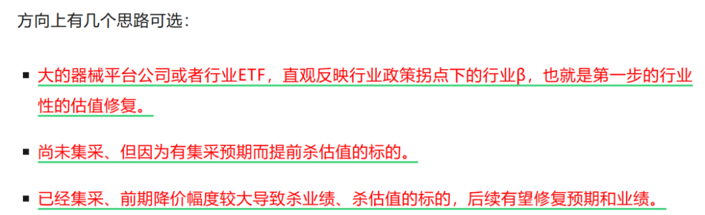
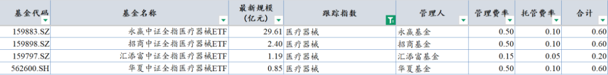
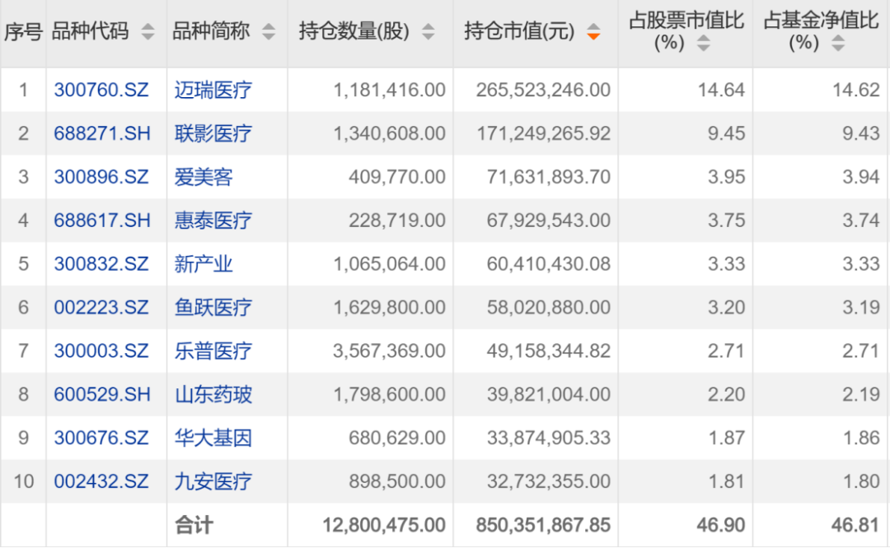
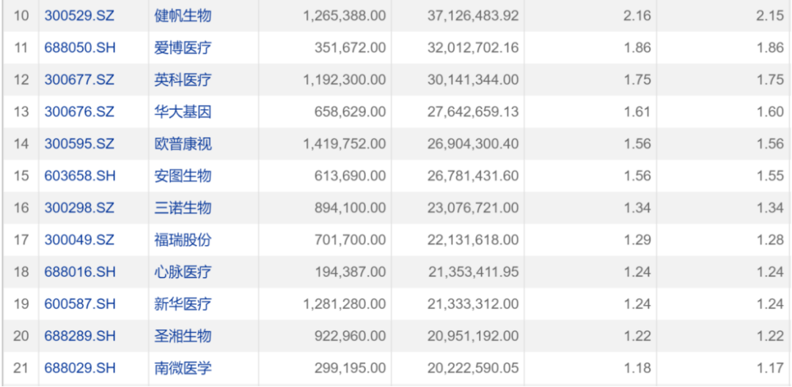

# 医疗器械政策拐点后——行业全梳理

大家好，我是龙哥。

上周五和大家聊了医疗器械行业的政策拐点《[医疗器械终于迎来政策拐点](https://mp.weixin.qq.com/s?__biz=MzkyMzQ3MDc3Mw==&mid=2247484765&idx=1&sn=126ce558bd7f6b23e07dc56c43968659&scene=21#wechat_redirect)》，也大致提了几个投资方向：

大家问题比较多的还是有没有行业ETF可以去配置这个赛道，想让我聊聊这个赛道的板块性的投资机会。

那我们本文主要讨论几点，第一是现有为数不多的、并不算很好的器械ETF投资标的，第二是可以作为行业β选择的行业平台公司，第三是可以去考虑的细分赛道，虽然没有很好的ETF可以选，但通过第二和第三部分，大家也可以自己去构建一个行业ETF。

1、医疗器械ETF

目前专注投资医疗器械领域的ETF一共有4个，分属4家基金公司：

由于其跟踪的指数都是中证全指医疗器械指数，所以4支ETF的持仓是高度一致的，该指数成份股超过130个，基本覆盖了A股所有的医疗器械公司。

相比于创新药，主要的问题还是在于——没有港股医疗器械ETF，我们知道今年买港股创新药ETF和买A股医药ETF的回报率差距巨大，医疗器械可能类似，但市场上没有好的工具我们也没办法，各家指数公司和基金公司如果有人看到这篇文章，希望能尽快有所动作抢占先机......

先看前十大持仓，迈瑞、联影、爱美客、惠泰、新产业、鱼跃、乐普、药玻、华大、九安。估计很多人一看就眉头一皱（包括我），前十大成份股虽说都是大市值的行业龙头或者细分领域龙头，但大部分都是近期股价表现的相对偏弱的公司，弱有弱的道理，其中相当部分是基本面的因素，毕竟器械行业此前一直处于被政策反复摩擦的阶段。

如果我们继续往后拉到成份股权重10-20名的公司，可能大家感觉会好一点，因为其中就开始出现一些集采有所出清或者接近出清、基本面可以期待有所向好的公司。

出现这种感受，主要原因是：

医疗器械行业有多个细分领域，如高值耗材、低值耗材、医疗设备、IVD等，各个领域所处的政策阶段是不同的，高耗、低耗是自2020年以来比较早被反复进行集采控费的方向，尤其是各家耗材公司普遍是已经经历过集采的杀估值、杀业绩，曾经的一个个细分赛道小龙头在过去几年大多被干的灰头土脸的，这时候在支持创新器械政策和器械集采政策回暖之际，这些公司拿出来一看，其实还是眉清目秀的。

医疗设备领域在耗材被集采摩擦的几年，则是还反复有机会，例如2022年的医疗新基建，在2022年为数不多的机会中我们重点聊的软镜等设备领域，以及在出海方面，医疗设备和低值耗材实际上是国内医疗器械出海的先锋军。但医疗设备行业在23年医疗反腐中首先受到重创，然后医院端的资金压力也一直没缓过来，虽说2024年底以来国内的招标有同比的明显修复，但也普遍还没回到2023年同期的水平，目前部分设备领域的国内集采降价也是让人触目惊心。

IVD领域则是受到包括集采在内的多方面的影响，从我此前给大家分享的那份中国医疗行业数据里【人均诊疗费用】及其他多种疾病的治疗费用结构的表的内容可以看到，在近10多年里，随着陆续控制辅助用药、药品和耗材集采，药费的占比有明显下降——意味着过去多年药品行业总盘子的增速是低于医疗行业增速的，然后是耗材和检查检验费用在门诊和住院费用中的占比在小幅提升，耗材我们上文提到2020年以来被持续暴击，而IVD则是这两年才陆续受到政策面较大的影响，包括集采降价本身以及拆套餐的影响。好在IVD的龙头公司也在出海方面做得不错，还算有一定亮点。

所以简单总结就是，器械行业各个细分领域所处的政策阶段不同，各个公司所处的政策阶段也还存在较大差异，设备和IVD不能说政策面完全出清、但也已经反映大半，且在出海方面表现更突出；耗材领域集采相对到了出清的末期，在出海方面也开始有进展。

有的读者可能就是想买个处于底部的行业ETF省事，那就只能在这4个医疗器械ETF里去选，我们之前给大家说过，选ETF的基本逻辑，跟踪误差差别不大的情况下优先选费率低的，费率相差不大的情况下优先选规模大的（流动性好）。

那对比以上4个ETF可以看到，159797汇添富医疗器械ETF的费率是0.2%，其他3个的费率都是0.6%，相当于是汇添富医疗器械ETF的规模相对小，想靠“价格战”抢市场份额。

2、类似行业ETF的平台公司

国内几家耗材领域头部的平台型公司，普遍存在的问题，是在单一赛道的深耕还不够深、但在业务的横向扩展上已经做了很多，这个有国内医疗器械行业客观环境限制的因素，也有各家企业经营管理上的问题。

国内医疗器械的行业龙头平台公司，医疗设备领域两大龙头公司迈瑞医疗、联影医疗，耗材领域三大龙头公司微创医疗、乐普医疗、威高股份，我们这里主要聊聊耗材领域的3家平台型公司。

①微创医疗：高值耗材+手术机器人。

微创医疗这几年经历了股价、市场预期、基本面、财务报表的大起大落，至今还是让很多投资人唏嘘不已。管理层何种水平已经有市场给出答案，我们这里不再过多讨论，微创医疗本身几项核心业务还是值得肯定的，主动脉及外周的心脉医疗受到政策面的冲击后依然坚挺，收入利润还是国内高耗领域头部水平；神经介入的微创脑科学短期有些集采的冲击，也还是国产行业龙头地位；微电生理是国内电生理的龙头地位；微创机器人在国内商业化持续低于预期，但去年以来在出海上出现大的突破，打开了更蓝海的市场；心通医疗近几年受制于国内整个TAVR行业发展低于预期，后续可能要承载集团CRM业务。

微创医疗的公司治理、优质核心业务分拆、债务等问题等说不上完全解决，有的可能只是延后，核心矛盾还是要几项核心业务能有向上的发展，如25H1的业绩预告中显示25年上半年收入还是下滑4%就不尽如人意。

近期上海国资接了日本大冢的股权，也是显示了上海地方对微创的支持，从产业发展角度上海是高度重视生物医药和医疗领域的，创新药领域以上海和苏州为中心的长三角是国内创新药企业聚集的核心区域，医疗器械领域上海有两大领头羊，分别是高端医学影像设备的联影医疗、高耗+机器人的微创医疗，上海国资支持微创医疗实际上是支持整个上海的医疗器械产业发展。

②威高股份：低值耗材+高值耗材。

威高股份的故事没有那么多星辰大海，作为一家“山东味十足”的山东威海企业，公司总体的风格本身就不是很偏向高风险、高回报的创新研发方向，而是相对更偏向于制造业方向，其低值耗材业务、药包业务、哪怕到高值耗材业务都是延续这个特点。也是因为这个原因，公司的业务发展、尤其是收入利润水平，哪怕也受到集采的影响，也并未像另外两家耗材领域龙头公司那样出现大起大落的巨幅波动，其不可避免的也花了几年时间去慢慢消化集采的影响、且经历了大幅的杀估值，但总体经营、资产负债表都相对稳健，还能维持稳定的分红。因此威高股份这家公司就是，没有那么绚丽的宏大叙事和弹性，有的是一份踏实和稳定。

③乐普医疗：高值耗材+医美+创新药。

乐普医疗这些年业务扩展也算不上成功，没做到微创那样多点开花，也没做到威高这样的踏实稳健，但也还是那句话，过去的历史暂且放下，着眼当下，乐普医疗的器械板块也有明显企稳，尤其是器械核心子公司心泰医疗在封堵器和介入瓣领域的投入迎来收获期，收入利润高速增长，已经成为乐普医疗器械板块的重要支柱。

器械板块之外，乐普医疗在医美产品的布局也逐渐进入收获期，在创新药板块通过收购民为生物获得了国内一线的GLP-1三靶点药物管线。

3、细分领域冠军

文章篇幅所限，后续有机会再对各细分赛道做详细的介绍，但可以先对主要的细分赛道和公司做一个罗列，方便大家“构建自己的医疗器械ETF”时选择标的。

①骨科：此前已经在[骨科行业新征程](https://mp.weixin.qq.com/s?__biz=MzkyMzQ3MDc3Mw==&mid=2247484565&idx=1&sn=8844a485f7ad04d8f4cb73f7e8253ce5&scene=21#wechat_redirect)文章中聊过骨科赛道的拐点，只是当时还没什么对器械领域感兴趣，现在可以再翻出来看看，其中的行业龙头大博医疗、春立医疗、爱康医疗、威高骨科、三友医疗等实际上股价也都已经走出不错的趋势。

②电生理：高成长的细分领域，行业优质公司惠泰医疗、微电生理。

③神经介入：高成长的细分领域，行业优质公司归创通桥、微创脑科学。

④结构心：高成长的细分领域，行业优质公司心泰医疗、沛嘉医疗。

⑤主动脉及外周血管加入：高成长的细分领域，行业优质公司心脉医疗、先健科技、先瑞达医疗。

⑥内镜下耗材：相对成熟但出海做的较好的细分领域，此前估值受集采压制，行业优质公司南微医学、安杰思。

⑦隐形正畸：国内受消费需求和集采压制、出海持续超预期，行业优质公司时代天使。

⑧家用呼吸机：国内行业仍有较大成长空间、出海能力较强的细分方向，行业优质公司瑞迈特、美好医疗。

⑨眼科耗材：国内短期集采压制但成长空间仍大，海外市场处于拓展初期，行业优质公司爱博医疗。

......

如去年的创新药那样，对于低迷了几年的医疗器械行业，龙哥也有太多内容想聊，后续的文章再一一展开。

月底了，开一次赞赏，各位的支持是龙哥持续分享的动力。这个月创新药的行情、CXO的行情都超出我们的预期，医疗器械板块也有了大的起色，也恭喜在至暗时刻和龙哥一起坚守过来的各位读者，终于迎来加速上涨的收获期，很荣幸再陪大伙一轮医药牛市~

风险提示：本文仅讨论行业/公司经营情况，投资需综合考虑公司经营、估值、管理层等多方面因素，建议读者审慎参考，本文不作为投资依据，不建议大家根据本文做出投资计划。

<!-- wxmp-comments-begin -->

---

## 留言（23 条，含回复共 50 条）

- **禤金城** 👍12 · 2025-07-30 12:42
  作为威高海外几年的代理商，威高的产品还是很受欢迎的。希望威高上海总部能给他们带来更多的人才和更开明的政策吧
  - ↳ **作者** · 2025-07-30 12:44
    哦对，借这条我说一句，读者里的医疗行业从业者、或者机构投资人同行，如果想加微信交流，可以后台私信我联系方式。
    
    注意：本人无读者交流群，无其他平台账号，不要通过其他渠道加联系方式，防止被骗。
- **灭火器** 👍3 · 2025-07-30 10:46
  龙哥辛苦感谢分享
  - ↳ **作者** · 2025-07-30 10:56
    [抱拳][抱拳]
- **黄磊** 👍3 · 2025-07-30 10:54
  龙哥，简直是及时雨！汇总的太好了，不然茫然了，哪些公司好都会搞不清！！感谢龙哥！！
  - ↳ **作者** · 2025-07-30 10:58
    医疗器械那么多优质的老朋友，都可以捡起来了啊
- **幸运丰** 👍3 · 2025-07-30 10:57
  哥，微创医疗价值回归还是？合理的估值能给多少？目前医保局不停地在开创新器械会，下一步是不是有更大地支持动作？
  - ↳ **作者** · 2025-07-30 11:10
    医保局这边，我之前已经明确有判断，今年大概率会有一些具体的措施，但不一定会是像创新药医保谈判这么重磅的，这个政策的节奏我们还要跟，但可以明确的是，如上周五文章所言，在审批端（药监）和支付端（医保）都已经明确了要开始支持创新医疗器械了， 态度上是明确转变了，不像过去把所有器械全当成仿制器械都去做集采。
- **雨泽** 👍3 · 2025-07-30 10:58
  龙哥，天使时代是不是快要价值回归了，或者说这个点性价比高
  - ↳ **作者** · 2025-07-30 11:08
    时代天使应该还是属于那种，相对下有底的公司，向上的弹性的话，则是要看海外的销售和盈利的情况，现在海外的销量是很猛的，关键要有规模效用、费用率要能降下来，利润率一旦有大的改善，估值弹性就有了。
- **F** 👍3 · 2025-07-30 11:12
  龙哥，请问有没有医疗器械场外主动管理形基金推荐啊，我不想玩场内，已经销户了。
  - ↳ **作者** · 2025-07-30 11:17
    我之前翻过，在非药尤其是器械持股多一点的，可以看看万民远的融通健康产业，他反正也是大家比较熟悉的基金经理了，虽然确实没把握住今年的创新药，还是比较价值的一位投资人。
- **赵东亮律师** 👍3 · 2025-07-30 12:02
  龙哥，是不是上面受集采压制的公司，政策转变的时候弹性更大？
  - ↳ **作者** · 2025-07-30 12:20
    嗯，可以这么理解
- **肥锋  家诚哥** 👍2 · 2025-07-30 11:16
  谢谢龙哥，这一波回血爆棚，就等着你开打赏
  - ↳ **作者** · 2025-07-30 11:22
    感谢感谢[握手][握手][抱拳]
- **junjun** 👍2 · 2025-07-30 11:37
  一直持有爱博，后续估值可以怎么看拜托[玫瑰]
  - ↳ **作者** · 2025-07-30 11:42
    估值算不上贵，要到q3基本面企稳，他这不是估值的事儿
  - ↳ **作者** · 2025-07-30 12:40
    龙哥，爱博管理层算是优秀的吧？
- **夏笑涨** 👍1 · 2025-07-30 10:48
  龙哥我想提问 为什么李嘉诚捐给香港大学附属医院的用于治疗肝癌的医疗设备 咱们内地这么多医院不想办法引进？
  - ↳ **作者** · 2025-07-30 10:54
    你要知道，如果真的是临床价值非常突出的设备，哪怕是几千万一台的高端设备国内很多医院都照样买。
- **低碳哥** 👍1 · 2025-07-30 10:48
  龙大，药明调整全年收入增速指引到13-17%，但上半年收入增速已经超20%，意味着下半年收入增速大概率下降——看似提升全年业绩指引，实际对三四季度是一个不太好的预期——自然不排除三季度后管理层再继续上调指引？
  - ↳ **作者** · 2025-07-30 10:53
    去年上半年和下半年的基数不一样，去年上半年低基数、下半年高基数，再就是我自己拍的增速可能还要比公司指引的略高一点，市场预期应该也是公司下半年还有可能略作上调吧。
- **执着如呆** 👍1 · 2025-07-30 10:50
  确实 11～20 很顺眼，1～10 里的爱美客和药玻太扎眼了……
  - ↳ **作者** · 2025-07-30 10:53
    药玻其实还好啊，你别觉得药包比较low，药包很赚钱的，山东药玻有50多亿收入和10个亿的利润，威高股份那边也有相当一部分利润是药包贡献的。
  - ↳ **作者** · 2025-07-30 12:54
    嗯嗯，这两家其实都是这样，山东药玻的董事长以前出来交流甚至用山东方言，很多南方的基金经理和研究员都听不懂[偷笑]
- **Hawk16H** 👍1 · 2025-07-30 11:03
  159873etf怎么样
  - ↳ **作者** · 2025-07-30 11:05
    这个其实大差不差，但这个相比医疗器械ETF，还增加了医疗服务的标的。
- **明月亦广寒** 👍1 · 2025-07-30 11:05
  喜欢联影医疗跟爱博医疗
  - ↳ **作者** · 2025-07-30 11:06
    都是非常优秀的公司
- **JMTerry** 👍1 · 2025-07-30 11:05
  不止这轮，后面几轮龙哥也要在[吃瓜]
  - ↳ **作者** · 2025-07-30 11:13
    现在是牛市大家都很开心，都说龙哥好啊，核心是得让大伙在这轮行情走弱的时候轻点骂我，不然把我骂自闭了就写不下去了，哈哈
- **唐小堂** 👍1 · 2025-07-30 11:41
  龙哥，是不是港股的标的更多一些
  - ↳ **作者** · 2025-07-30 11:42
    器械的话AH标的都挺多，也都有一些优质标的，这个比创新药好一些，创新药的优质标的集中在港股多。
- **十二点睡先生** 👍1 · 2025-07-30 12:22
  龙哥，南微出海做的挺好，国内又受益于集采政策的纠偏，估值上是不是可以高看一眼了？回到近5年的中位数水平应该是很有希望的吧
  - ↳ **作者** · 2025-07-30 12:24
    结合增长来看吧，历史估值也有历史估值的局限性
- **妙蛙** · 2025-07-30 11:08
  必须赞赏支持龙哥，龙哥安图怎么样，底部起来还不多[愉快]
  - ↳ **作者** · 2025-07-30 11:12
    如文中所言，IVD肯定是往后放的，IVD里能高看一眼的就是有出海能力的公司，而安图属于出海做的相对偏差的。
- **LXD** · 2025-07-30 11:12
  何老师，512170是医疗器械吗？
  - ↳ **作者** · 2025-07-30 11:15
    这个是医疗器械+CXO+医疗服务
  - ↳ **作者** · 2025-07-30 11:46
    怎么串台了
- **海** · 2025-07-30 11:22
  现在的基金没有涵括港股的持仓，都不想投资[捂脸]
  - ↳ **作者** · 2025-07-30 11:27
    你要知道，一年前我就一直讲恒生医药ETF，那时候很多人觉得买A股医药ETF更好，港股跌起来太吓人了，结果时隔一年，A股的就都看不上了，只想看港股的了。但物极必反，更何况器械不像创新药，创新药大部分优质标的在港股，器械相当一部分的优质标的在A股科创板的。
  - ↳ **作者** · 2025-07-30 11:40
    这种就只能在主动管理里翻一翻，我是没找到特别合适的。ETF的话同时覆盖沪港深的本身就不多，再到器械这种比较小的细分领域就更难有了。
- **李蓉** · 2025-07-30 11:43
  我看易方达医疗保健 加仓创新药 减持医疗器械了😂。医疗器械 是不是 个股行情啊？很难像创新药一样是板块行情吧？
  - ↳ **作者** · 2025-07-30 11:50
    嗯就是逻辑上肯定不如创新药强，至于行情演绎嘛咱们就边走边看呗，行业被政策干了这么多年，终于初见曙光，也不能太过保守是吧，只是初期选股难免还有熊市思维这个正常。
- **小武哥** · 2025-07-30 12:22
  龙哥，骨科排在第一位，是更看好吗？
  - ↳ **作者** · 2025-07-30 12:25
    也不是，因为我之前5月就写过骨科，就放前面提了一下，骨科是比较明确整个行业都明显出现业绩企稳了，股价也是比较早反映的。
- **攀枝摘花** · 2025-07-30 12:25
  龙哥，爱博半年业绩能修复回来不？四月中进的想博业绩增长，结果被。。。
  - ↳ **作者** · 2025-07-30 12:27
    你这个阅读不认真哦，我不论是文章还是留言都多次说过爱博最快q3企稳，q2业绩压力还是在的，也是股价前面跌那么多的原因。

<!-- wxmp-comments-end -->
