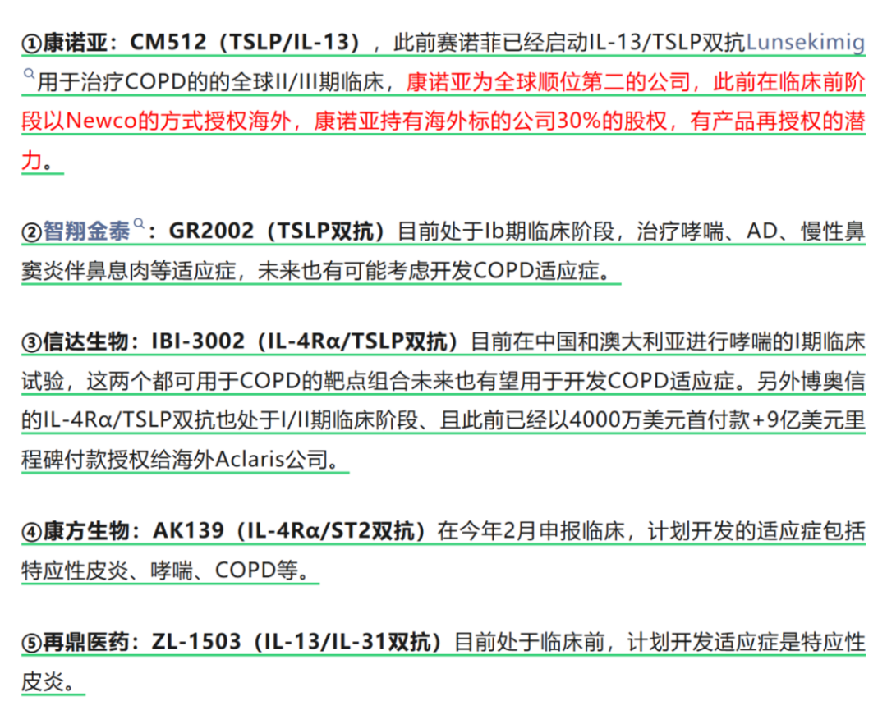
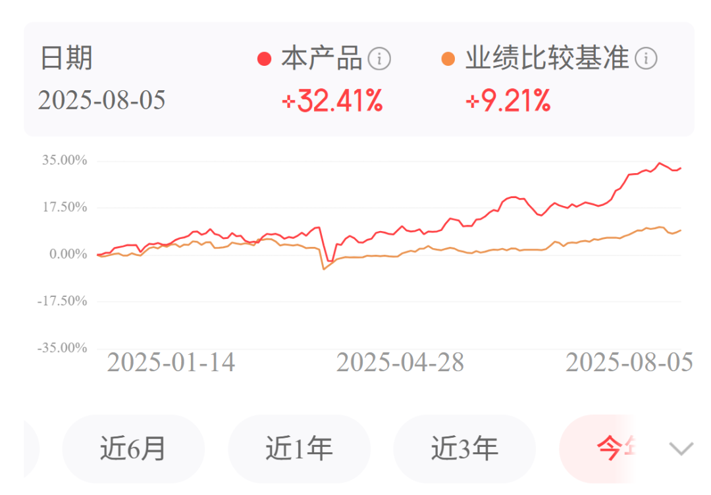
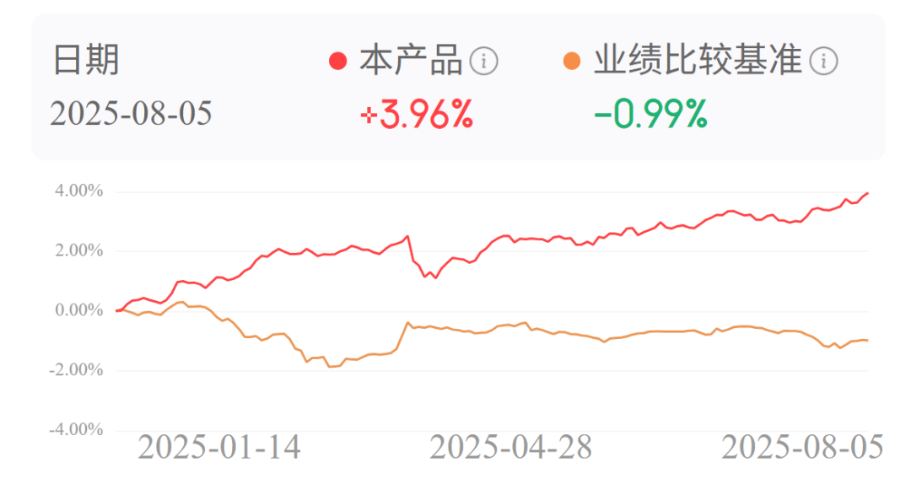

# 自免再现200亿美金超级大药

大家好，我是龙哥。

自免领域是我们过去两年和大家重点聊过的创新药投资方向之一，在上周也和大家聊了呼吸领域最大适应症COPD的研发现状，今天再进一步扩展来和大家聊聊对自免领域的一些展望。

自免巨头艾伯维在近期发布了2025年中报，根据其指引，预计其IL-23p19单抗risankizumab（Skyrizi）将在2025年实现171亿美元的全球销售额、同比增长46%，相较此前的指引上调了6亿美元，其中4亿美元来自IBD适应症、2亿美元来自银屑病适应症。按当前增长趋势，2026年Skyrizi的全球销售额有望突破200亿美元，成为继阿达木单抗（修美乐）后第二款全球销售额突破200亿美元的超级超级重磅炸弹药物，且大概率将超越阿达木单抗成为全球自免历史上的第一大药物。

同样是艾伯维的另一款自免重磅炸弹药物JAK1抑制剂乌帕替尼在2025H1实现全球销售额37.46亿美元同比增长48.5%，2025全年也大概率突破80亿美元全球销售额，这款药物过去4年以51%的复合增速狂飙，预计将在2026年突破100亿美元。艾伯维原本在修美乐专利到期时预计IL-23p19+JAK1两款药物补上修美乐的缺口，没想到时隔3年这两款药物就已经大幅超越修美乐的峰值，且仍在维持高速增长。

赛诺菲也在近期发布2025年中报，度普利尤单抗2025H1全球销售额80亿美元同比增长约20%，全年有望达到170亿美元，预计其也将在2026-2027年突破200亿美元的全球销售额，成为全球创新药历史上第三款突破200亿美元销售额的自免药物。

除了以上3款药物以外，自免领域还有多款重磅药物，包括罗氏用于治疗多发性硬化的CD20单抗预计25年全球销售额超过80亿美元，强生的乌司奴单抗24年全球销售103.6亿美元、由于专利到期25年销售额预计下滑40%左右、但仍有60亿美元以上的销售额，诺华的IL-17A单抗司库奇尤单抗在24年全球销售额突破60亿美元、25年仍有双位数左右增长，武田制药用于IBD适应症的维得利珠单抗预计25年全球销售额也将突破60亿美元。

从全球自免领域的重磅药物所处的疾病领域来看，主要是皮科、呼吸、IBD三大领域为主，为什么是这三大领域呢，前二者比较容易理解——患者群体太大，像特应性皮炎的患者群体仅在国内市场就有上亿人、其中中重度特应性皮炎的患者有1000万以上，呼吸科的哮喘和慢阻肺仅在国内都是大几千万到上亿的患者群体，其中中重度的患者也有小几千万计，超大患者群体、长期慢病用药，这就是类比10-20年前的心血管等慢病药的市场。至于IBD（溃疡性结肠炎、克罗恩病），虽然患者群体不算特别大，但是患者的生活质量较差、临床存在较大程度的未满足需求，近年生物制剂连续在疗效上的进步也诞生了多个大药。

围绕以上3个疾病领域，就是我们重点关注的自免药物的开发方向。在上一篇文章中我们主要讨论了COPD领域的药物[COPD诞生百亿美金超大海外授权交易](https://mp.weixin.qq.com/s?__biz=MzkyMzQ3MDc3Mw==&mid=2247484774&idx=1&sn=11871ed2ce3add81d6097b21ca12e358&scene=21#wechat_redirect)，今天这篇主要讨论皮肤科自免疾病的药物，IBD后面再单独一篇文章来聊。

在皮科目前主要关注3大病种，也即银屑病、特应性皮炎、系统性红斑狼疮，这三者也存在较大的差异。

皮肤科自免疾病治疗的刚需属性主要有两点，第一是皮肤科自免疾病导致的皮损会直观的反映在外观上，对患者的社交带来比较大的障碍；第二是很多情况下疼痛可以忍、但瘙痒很难忍，持续的瘙痒对生活质量的影响很大。

1、银屑病

我们判断未来海外的突破空间已经不大，核心因素是艾伯维的瑞莎珠单抗（IL-23p19）在这个赛道几乎已经“杀死比赛”，瑞莎珠单抗的III期临床数据显示16周可以实现71.2%的PASI-90（皮损清除90%以上）和46.2%的PASI-100（皮损完全清除）、76.5%的sPGA0/1（皮损清除或几乎清除），并且维持用药1年后能有87%的患者维持sPGA0/1，在疗效上就算不能说达到天花板、也已经非常接近天花板。与此同时瑞莎珠单抗还是一款维持期仅需Q12W、可居家皮下注射给药的药物，也就是只需要每隔12周（3个月）给药一次，维持期一年只需给药4次，对于患者用药依从性来说也是非常友好的。

自免类生物制剂核心就是看疗效、安全性、给要间隔、给药方式等方面，瑞莎珠单抗在疗效方面做到接近天花板，给药间隔做到超长的12周给药，给药方式方面可以居家用药、皮下注射而不需要去医院，安全性方面大部分副作用较轻且可逆，由此造就了这款即将突破200亿美元全球销售额的超级神药。

国内市场而言，还有一定的机会，核心因素在于国内目前银屑病治疗还是以维持期Q4W（每4周给药）的IL-17A为主，IL-17A在疗效上和IL-23p19有一定差距，同时给药间隔短的多，海外银屑病市场近年已经是60%以上的份额被IL-23p19拿去、且份额仍在提升，但国内市场则是诺华的IL-17A司库奇尤单抗（可善挺）一家独大，艾伯维不太重视国内市场导致瑞莎珠单抗没能在中国市场做起来，而国产厂商中目前有信达生物自研的IL-23p19已经在去年9月申报NDA，预计今年三到四季度获批上市，康哲药业自国外引进的一款IL-23p19单抗已经在国内商业化。

2、特应性皮炎

特应性皮炎是我们认为未来还有较大提升空间的一个疾病领域，虽然IL-4Rα度普利尤单抗今年预计会卖到170亿美金的超大规模，但不代表该领域的竞争也像银屑病领域一样接近结束。

我们前面提到的疗效、安全性、给药间隔、给药方式这四个方面，度普利尤单抗目前主要还可以提升的在于疗效和给药间隔，疗效方面，度普利尤单抗治疗成人中重度特应性皮炎（AD）的III期临床数据显示16周EASI-75（皮损缓解75%）在50%左右，JAK1抑制剂乌帕替尼的16周EASI-75也在50%-71%，EASI-90则是乌帕替尼40.8%VS度普利尤单抗22.5%，疗效上都还有较大的提升空间。

在给药间隔方面，度普利尤单抗是Q2W给药，口服的JAK1抑制剂是每日口服给药，在给药间隔方面也还有较大的提升空间。

我们也期待过IL-13、TSLP、OX40等靶点在特应性皮炎上的突破，但这两年看下来，单靶点即便能做到给药间隔的延长，也很难在疗效上有突破性的提升，这个和我们当初看PD-1之后下一代IO的感受非常相似，肿瘤免疫疗法在PD-1取得突破后的近10年间陆续失败了CD47、TIGIT、TIM3、LAG-3等一众靶点后，终于在康方、信达的双抗上看到了成功的希望。

而自免领域站在当前试点看未来，也很可能是双抗带来突破，例如我们了解到的一些早期分子已经实现了非常卓越的疗效表现，且药物的半衰期大幅延长使得其有机会做到3-6个月给药的超长效。

今天特应性皮炎领域的IL-4Rα正如当年银屑病领域的IL-17A，今天的自免双抗可能类似当年的IL-23p19，期待自免双抗出现一款能在AD领域“杀死比赛”的超级大品种。

双抗涉及的标的，与上一篇文章的内容有较大的重合度：

除了以上公司以外，如三生国健、和铂医药、荃信生物等在自免领域有一定程度深耕的公司也都在开发自免双抗。

3、系统性红斑狼疮

系统性红斑狼疮（SLE）的情况比前二者要复杂的多，从定性上来说，系统性红斑狼疮的患者群体虽然要比前二者少一个数量级（国内大几十万患者），但同时系统性红斑狼疮是自免疾病中少数会累及多器官、直接影响患者寿命的一类疾病，因此治疗的刚需更强，传统疗法激素治疗、非甾体抗炎药、免疫抑制剂等疗效一般且副作用普遍偏大。

但同时遗憾的是，系统性红斑狼疮在创新疗法上的突破一直比较缓慢，海外有GSK的贝利尤单抗（BLyS）、阿斯利康的anifrolumab（IFNAR单抗），国内有荣昌生物的泰它西普（BLyS/APRIL），但泰它西普在海外开发SLE适应症也受阻，目前在海外重点开发IgA肾病和gMG等适应症为主。

目前在进行SLE创新疗法临床试验的主要有：

JAK1抑制剂：艾伯维的乌帕替尼在进行III期临床，恒瑞医药的艾玛昔替尼此前也已经拿到SLE的临床批件。

BTK抑制剂：诺诚健华的奥布替尼在SLE的IIb期临床试验。

IFNAR：智翔金泰的GR1603已经完成SLE适应症的II期临床患者入组。

CD38单抗：康诺亚的CM313在进行SLE适应症的Ib/IIa期临床，且在今年1月以Newco的方式授权海外。另外还有康缘药业的CD38单抗拿到SLE的临床批件。

BDCA2：三生国健的SSGJ-626在进行系统性红斑狼疮（SLE）、皮肤型红斑狼疮（CLE）的I期临床。

除了以上单靶点的竞争以外，SLE的临床开发也开始进入双靶点及细胞治疗领域，如BCMA/CD3等TCE疗法、以及BCMA-CART、BCMA/CD19-CART等单靶点和双靶点的细胞疗法。

SLE领域我们目前还不知道在后续的创新疗法中有哪些能跑出来，还需要进一步跟踪以上靶点和公司的临床数据。

......

总体来说，皮肤科自免药物的市场潜力已经被市场持续验证，未满足的临床需求也客观存在，仍将在未来诞生诸多投资机会，尤其是自免双抗的竞争才刚刚开始，仍然大有可为。

......

最后再提一句，龙哥定投的龙谈医药科技组合（AH股创新药+港股科技互联网）今年累计32.4%，仍是大幅跑赢基准。

固收类的龙谈美元债今年来已经接近4%，而同期的中债还跌了接近1%。

感兴趣的读者可以自行在公众号主页了解~

风险提示：本文仅讨论行业/公司经营情况，投资需综合考虑公司经营、估值、管理层等多方面因素，建议读者审慎参考，本文不作为投资依据，不建议大家根据本文做出投资计划。

<!-- wxmp-comments-begin -->

---

## 留言（12 条，含回复共 26 条）

- **博子** 👍3 · 2025-08-06 12:25
  龙哥有空了了多聊聊药械这种底部行业哈，谢谢
  - ↳ **作者** · 2025-08-06 12:38
    我一直在聊啊，创新药暴涨之后我不就也开始给大家聊医疗器械了
- **疯子** 👍3 · 2025-08-06 12:58
  正好家里有人刚刚开始用度普利尤治疗特异性皮炎，效果有一点，就是半月一次打针有点麻烦
  - ↳ **作者** · 2025-08-06 13:00
    嗯，所以才说，给药间隔这个，有很大的提升空间，而且一旦有大的提升，患者依从性会大幅改善。
- **雨泽** 👍2 · 2025-08-06 12:26
  龙哥说说时代天使的半年报
  - ↳ **作者** · 2025-08-06 12:28
    半年报还没出，现在是预盈，非常nice啊，看中报的情况，海外应该接近扭亏了，之前大家一直担心海外业务是纯靠砸费用堆出来的量，只要海外盈利能起来，就海外现在这个案例数的增长趋势，未来可期。
  - ↳ **作者** · 2025-08-06 12:28
    另外，大家也看到前几天隐适美发的财报miss了，导致他当天股价跌了36%，我们测算下来，隐适美下调的部分，可能就是被时代天使抢了份额。
- **大庆** 👍2 · 2025-08-06 12:27
  龙少，时代天使这业绩是超预期了？转折点到了？
  - ↳ **作者** · 2025-08-06 12:38
    看另一条回复的留言哈
- **涱泩🐳** 👍2 · 2025-08-06 12:54
  龙哥，怎么感觉迈瑞和联影平台器械毫无反应？
  骨科和隐形赛道器械倒是长得挺不错的
  - ↳ **作者** · 2025-08-06 12:58
    在前面写器械的文章里写到了，高值耗材的政策压制是从2020年开始的，更早开始、更早出清，而设备的政策压力是从2023年开始的，相对来说还处于政策加码的阶段，很难说现在就到出清的阶段，有些设备集采的价格也很低的。
- **kaka** 👍1 · 2025-08-06 12:16
  龙哥，请问怎么看ai制药
  - ↳ **作者** · 2025-08-06 12:37
    AI制药方面，第一，如果你是想问晶泰控股，他昨天这个60亿美金的BD是之前发过的，股价也反映过，这个就有点类似石药那个50亿美金总包的BD，其实可以认为都是CRO服务。第二，AI制药在CRO/CDMO领域确实在应用，就像我前几天还刚去泓博医药调研，他们也在持续的完善他们的模型，从而显著提高临床前研发的效率。
- **我心飞翔** 👍1 · 2025-08-06 12:32
  感觉关注好久了，每篇都认真看，拿的港股创新药也有很不错收益，有鱼更有渔[啤酒][强]
  - ↳ **作者** · 2025-08-06 12:38
    [抱拳][抱拳]
- **劉** 👍1 · 2025-08-06 12:33
  请问龙哥怎么看中长期美元债，可配置到什么时候，主要关注什么指标
  - ↳ **作者** · 2025-08-06 12:42
    我们是看降息的，现在票息就比国内高的多，再加上潜在的资本利得。
- **sunya** 👍1 · 2025-08-06 12:33
  龙哥有类风湿关节炎的新药吗[抱拳][抱拳][抱拳]
  - ↳ **作者** · 2025-08-06 12:43
    类风关的药像比较成熟的阿达木单抗这些已经专利到期了，有国产的生物类似药，价格也降了不少了。
  - ↳ **作者** · 2025-08-06 12:59
    荣昌生物的泰它西普
- **冰太阳** 👍1 · 2025-08-06 12:52
  JAK1用在白癜风上也有好几种药在做临床
  - ↳ **作者** · 2025-08-06 12:54
    白癜风目前全球获批的唯一的JAK抑制剂就是Incyte的那个JAK1/2乳膏，确实也有一些在做临床，像恒瑞医药，诺诚健华的TYK2/JAK1开了白癜风的II/III期临床，也是国内进度比较靠前的。
- **疯子** 👍1 · 2025-08-06 13:00
  还有龙哥怎么看天坛生物的收购和HIV疫苗的开发？
  - ↳ **作者** · 2025-08-06 13:02
    HIV疫苗历史上失败很多，一个I期临床啥也说明不了，并且这个所谓的“天坛株”目前和天坛生物没任何关系。
    收购的话，现在血制品行业总体趋势就是大国企整合行业，这个也是我们之前判断的产业趋势。至于天坛生物短期放弃收购派林生物，总归后面要解决同业竞争的问题，我自己感觉早晚还是要注入的，后面再看吧。
- **川** 👍1 · 2025-08-06 14:08
  请教龙哥，瑞莎珠在中国开展各适应症为什么这么晚，不差这块市场？
  - ↳ **作者** · 2025-08-06 14:46
    艾伯维一直不太重视中国市场，从修美乐那时候就是

<!-- wxmp-comments-end -->
