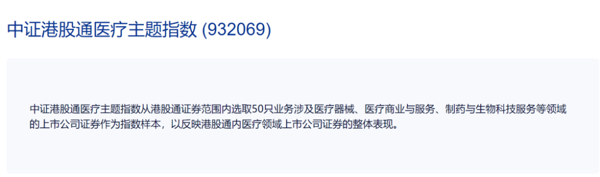
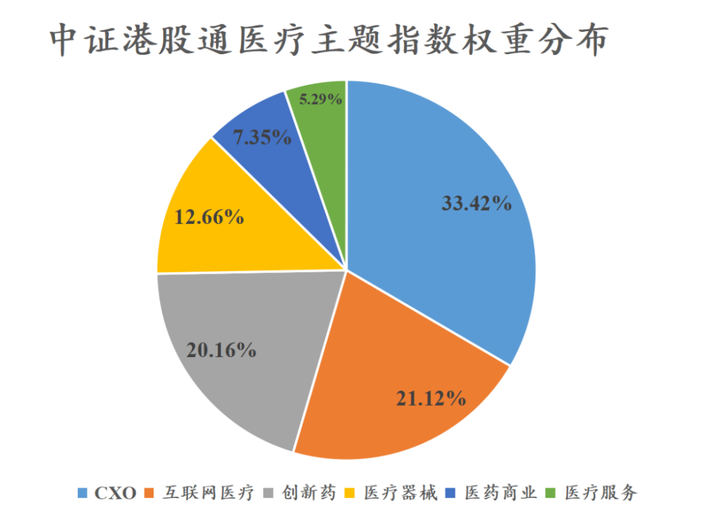
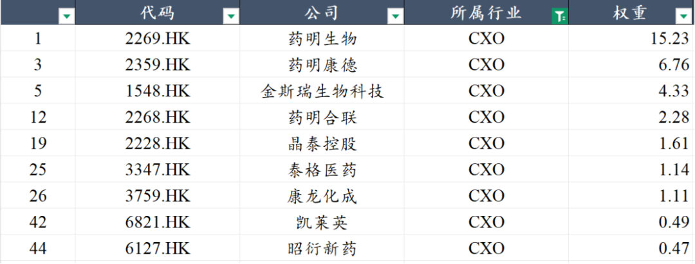
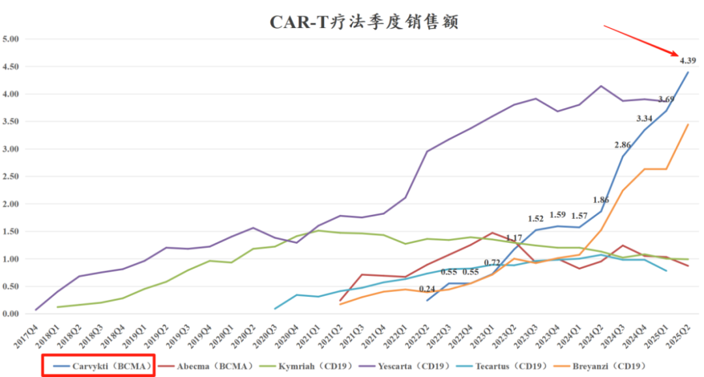
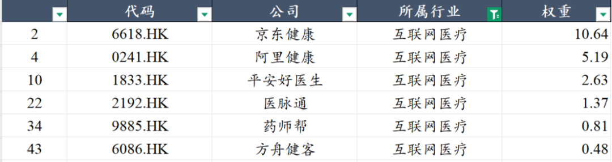
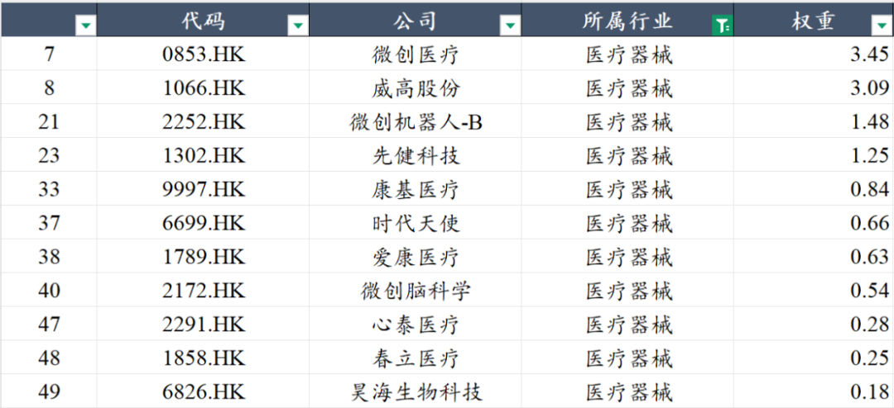
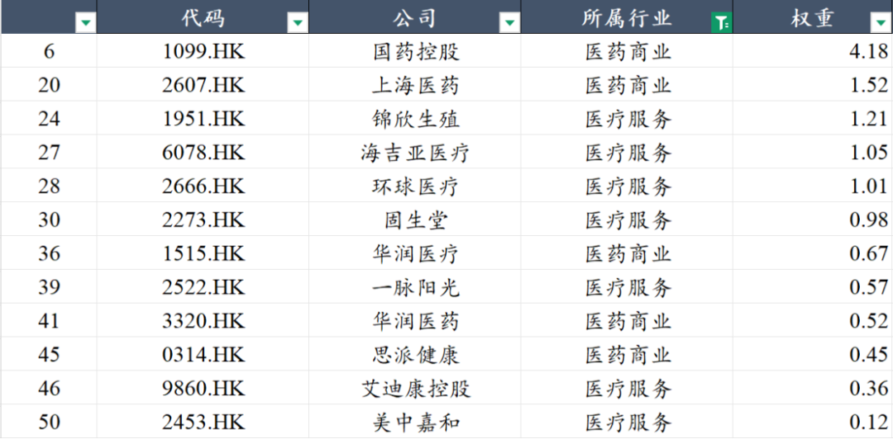
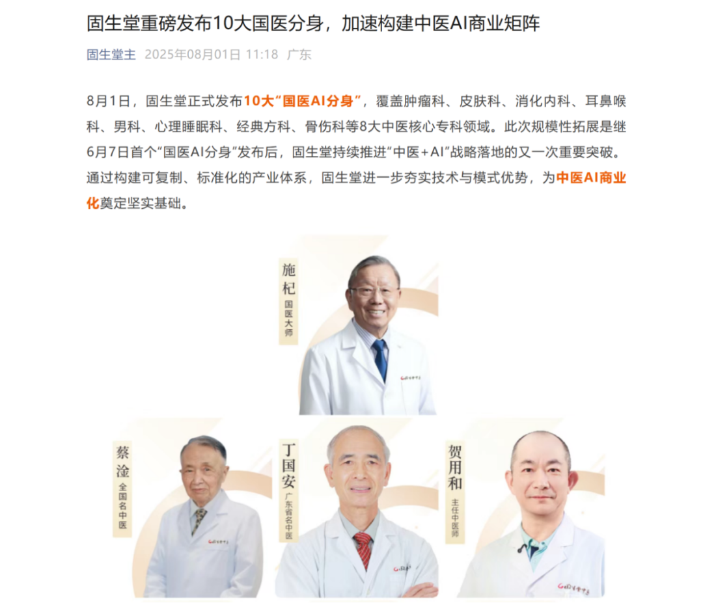
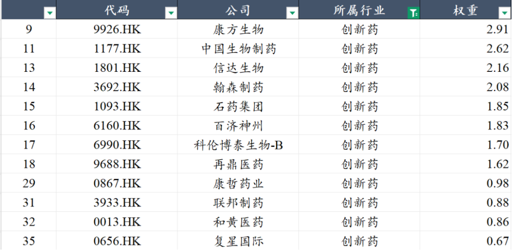
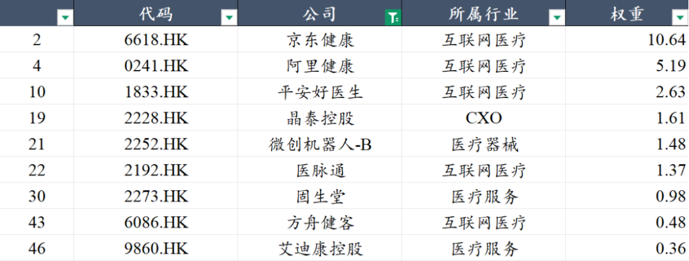

# 港股CXO+AI医疗+医疗器械投资标的

大家好，我是龙哥。

最近和大家多聊了些器械和CXO的观点：

不少读者问到专门投CXO或者CXO的ETF，之前确实是没找到比较合适的，刚好翻到一个在今天新上市的ETF——520510港股通医疗ETF，有可能能满足大伙的需求，所以这篇文章就来聊一下这个ETF的情况。

首先港股通医疗ETF跟踪的指数是中证港股通医疗主题指数：

在创新药板块今年总体涨幅比较大的背景下，之前大家选择行业ETF作为投资标的的时候，可能会有点诟病的，就是目前绝大部分的医药行业主动基金和被动基金，几乎都已经变成创新药基金，不论是基金经理主观去调仓还是随着创新药公司市值增长而权重提升导致的被动的权重变化，最终结果就是全市场、尤其是港股医药基金几乎都是高配乃至满配创新药。

而今天聊的这个指数和ETF的成份股则是有较大差别，这个指数跟踪的成份股包含了比较多的CXO、互联网医疗和医疗器械，创新药的占比只有20%，因此这个指数以及跟踪该指数的ETF，可以作为大伙在创新药以外的另一个选择。

从行业分布上来说，CXO、互联网医疗、创新药和医疗器械分别占33%、21%、20%、13%，这个行业配置结构就和其他绝大部分的港股医药ETF的结构截然不同，行业分布相对比较均匀、且相对更偏向医疗而不是制药，下面我们就他在各个行业的权重股做简单介绍。

1、CXO

指数成份股第一大权重板块就是CXO，占了33%，但说白了还是药明系为主，药明生物+药明康德+药明合联三家合计占24.3%的权重，也是药明系的这三家公司几乎包揽了目前全球最火的几大创新药赛道中的三大赛道——GLP-1为代表的多肽药、ADC药物、双抗/多抗药物，因此我们一直认为，如果从全球创新药景气度的角度去投资CDMO行业，药明系一定是绕不开的核心资产。

其次是金斯瑞生物科技，公司本身是全球基因合成的龙头公司，也算是CRO一个细分赛道的小龙头，另外就是大家都知道的金斯瑞的核心资产——持有47.5%的传奇生物的股权，其拥有目前全球销售额第一的细胞疗法，因此金斯瑞也算是半个CRO+半个创新药标的。

再往后的晶泰控股，我把他归到了CXO行业，也是大家比较熟悉的“AI制药第一股”，前阵子刚刚签署了1亿美元首付款+58.9亿美元里程碑付款的海外合作协议，借助其AI药物发现平台开发小分子药物。

再到后续的康龙、泰格、凯莱英、昭衍等，都是先发行A股后发行H股的公司，其H股的流通盘均较小，因此权重占比也都比较低。

2、互联网医疗

互联网医疗已经淡出大家的视线很久了，记得还是2020年的时候互联网医疗比较火，这几年一直没什么存在感，但实际上互联网医疗是可以诞生大市值公司的细分领域。

互联网医疗行业本身集中度比较高、龙头公司接近寡头垄断，再就是借助互联网平台的技术实力、本身的数据优势，互联网医疗公司实际上是医疗行业与AI医疗最接近的子领域之一。

很多投资人在年初炒AI医疗那波行情里挖掘各种相关的概念主题，殊不知最终股价表现最有持续性的反而是当时最容易被忽略的互联网医疗公司，如京东健康、平安好医生、医脉通、药师帮等已经突破了年初炒AI医疗时的高点创下本轮新高，京东健康更是再次突破了1500亿元的市值。

3、医疗器械

医疗器械虽然纳入了有11家公司在指数成份股，但是总体的权重只有12.66%，过去几年港股器械板块实在是跌的太惨烈，同时创新药、CXO板块的市值又在今年以来实现了较大幅度的跃升，导致大部分医疗器械的公司流通盘都跌的比较低的水平，也自然导致权重占比都比较低。

但好在，医疗器械板块我们认为已经处于政策拐点【[医疗器械终于迎来政策拐点](https://mp.weixin.qq.com/s?__biz=MzkyMzQ3MDc3Mw==&mid=2247484765&idx=1&sn=126ce558bd7f6b23e07dc56c43968659&scene=21#wechat_redirect)】，后续随着越来越多器械公司的基本面修复伴随着股价的修复，预计器械板块未来的权重也会伴随有所修复。

4、医疗服务+医药商业

国内三大医药流通龙头都在H股，也都在该指数的成份股中，医药商业由于更多是跟随整个药品行业的总量逻辑+部分行业集中度提升的逻辑，使得行业增速注定不会太快，属于医药里相对稳定的红利股，权重占比也不算高，就不做太多赘述了。

医疗服务这边，权重占比就更低了，其中值得关注的主要是固生堂，中药饮片集采短期虽然对其影响还要观察，但是其也是医疗服务公司里比较纯正的AI医疗相关标的，其在前几天正式发布了10大国医大师的AI分身，我们也挺期待看到AI在中医领域的应用落地。

5、创新药

创新药这边都是我们老生常谈的标的了，这里就不做过多赘述了。

除了以上传统意义上的行业分类以外，我们还可以从另一个角度来看这个指数的成份股结构，也就是从AI含量的角度：

实际上我们知道如药明系、康龙等头部CXO公司已经比较早就开始应用AI在药物发现、工艺开发等方面，那即便我们暂时不纳入这些头部的CXO公司，仅从以上的持仓也可以看出这个指数的“AI含量”还是不低的，以上9家公司贡献了25%的权重。

AI医疗虽然经历年初一波凭空炒作后就快速退潮，但就我们对一系列的公司包括CXO、医疗器械、医疗服务公司的调研来看，AI应用落地只是没那么快、需要时间，并不是毫无意义的主题概念，未来两年或许一些AI应用就会体现在医疗公司的报表上。

......

最后呢，还是要再总结一下，ETF本身是一种工具，我们不希望看到所有的医药行业ETF最终都变成创新药ETF，这不是哪个行业比较火或者哪个行业短期涨幅大小的问题，而是作为一类投资工具我要有的选，像这个520510港股通医疗ETF就是给我们另外一个方向的选择。

风险提示：本文仅讨论行业/公司经营情况，投资需综合考虑公司经营、估值、管理层等多方面因素，建议读者审慎参考，本文不作为投资依据，不建议大家根据本文做出投资计划。

<!-- wxmp-comments-begin -->

---

## 留言（10 条，含回复共 22 条）

- **天野源** 👍3 · 2025-08-07 12:17
  龙哥，最近CXO在调整，但是除了药明系，大多CXO其实还在历史底部，并不贵吧？
  - ↳ **作者** · 2025-08-07 12:28
    嗯，这个问题也是我们反复提到的，CDMO方向能抓住高景气方向的业绩基本都见底企稳了，CRO这边可能要到今年三四季度以后，所以CRO的业绩肯定是滞后的，中间股价也会有一些波折，或许是机会。
- **亦复如是** 👍2 · 2025-08-07 11:49
  很不错
- **光头的复利人生** 👍2 · 2025-08-07 12:26
  方向都挺好的，就是权重有些内啥……由于流通盘的因素，导致药明生物单票权重过大，要是能与康德、合联匀一匀就完美了
  - ↳ **作者** · 2025-08-07 12:27
    是的，康德毕竟是流通盘主要在A股，合联是新股、流通盘大头在生物和康德，导致生物一家的权重太高了，而生物又是这三家里最弱的。
  - ↳ **作者** · 2025-08-07 12:28
    所以我还是选择手搓一个组合了[旺柴]
- **和** 👍1 · 2025-08-07 11:50
  恒生医药是不是有点乏力要进入漫长的调整阶段了[疑问]
  - ↳ **作者** · 2025-08-07 12:00
    市场短期走势我们判断不了，我们只能在市场上尽量找基本面有看点并且估值还买的下手的标的。
- **caoguoan** 👍1 · 2025-08-07 12:07
  龙哥，有没有港股纯器械的etf推荐？
  - ↳ **作者** · 2025-08-07 12:13
    就是没有呀，所以我前面写器械投资标的那篇才写几个行业龙头平台公司可以当成行业etf。今天发的这个也是刚好今天上市的，不然也没有。
- **隐隐** 👍1 · 2025-08-07 12:15
  君实生物是有啥消息，突突了一天咋又回去了？
  - ↳ **作者** · 2025-08-07 12:29
    就是有传闻有个大BD那天晚上要落地了，结果没公告。
  - ↳ **作者** · 2025-08-07 16:51
    美国一个大的MNC有一个品种退出中国市场，恰巧君实在这个靶点上有同款，市场认为会提高市占率
  - ↳ **作者** · 2025-08-07 17:27
    这个逻辑就有点搞笑了，PCSK9能让君实涨30%？这过于牵强的解释。
- **如灿** · 2025-08-07 11:54
  请问晶泰控股那个大订单您怎么看？
  - ↳ **作者** · 2025-08-07 11:59
    这个文章里也有写到，实际上就是一个CRO订单，和石药集团那个50亿美金的订单差不多。
- **杜强** · 2025-08-07 11:56
  感觉涵盖的好全啊，新基可以直接上吗
  - ↳ **作者** · 2025-08-07 11:59
    主动管理和被动管理基金在这点上有区别，主动管理新基金一般要观察一段时间的投资风格，被动基金的话完全跟指数，就无所谓发行时间长短。
- **春风十里** · 2025-08-07 12:13
  龙哥，我想问一下，复兴医药这个标的如何？
  - ↳ **作者** · 2025-08-07 12:29
    复星系最优质的资产就是复宏汉霖。
- **刻舟求剑录** · 2025-08-07 18:07
  康基医疗一直停牌，有暴雷可能性吗？持有一点[破涕为笑]，麻烦老师帮看看
  - ↳ **作者** · 2025-08-07 18:16
    康基医疗主要是股权转让，大概率是好事吧，应该不太会涉及暴雷。

<!-- wxmp-comments-end -->
