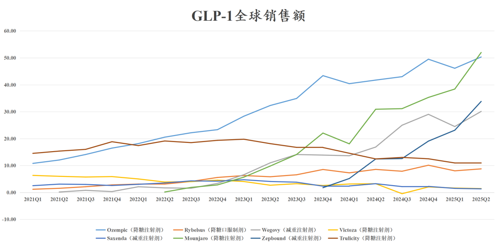
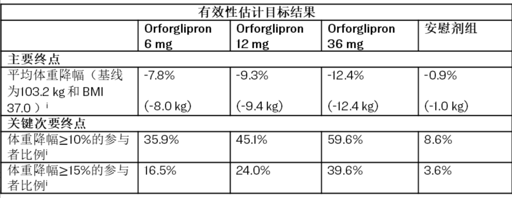

# 药王之争从未如此残酷

大家好，我是龙哥。

在今年3月7日和6月17日的文章里，龙哥给大家介绍了GLP-1为代表的减重药行业的情况[创新药顶级大药盛会](https://mp.weixin.qq.com/s?__biz=MzkyMzQ3MDc3Mw==&mid=2247484641&idx=1&sn=93ea4ad9f85d4cd6e44e997fc2754266&scene=21#wechat_redirect)，[药王竞争白热化](https://mp.weixin.qq.com/s?__biz=MzkyMzQ3MDc3Mw==&mid=2247484201&idx=1&sn=7d33aa996fccc6637bfa8b20d58ca64b&scene=21#wechat_redirect)。最新全球两大GLP-1药物龙头礼来和诺和诺德都公布了2025年中报，我们来看看新晋全球药王的情况。

礼来2025Q2：

- 替尔泊肽降糖注射剂Mounjaro全球销售51.99亿美元同比+68.21%、环比+35.32%；
- 替尔泊肽减重注射剂Zepbound全球销售33.81亿美元同比+171.99%、环比+46.26%；
- 度拉糖肽降糖注射剂Trulicity全球销售10.92亿美元同比-12.32%、环比-0.27%。

礼来这边替尔泊肽和度拉糖肽25Q2销售均超预期。

诺和诺德2025Q2：

- 司美格鲁肽降糖注射剂Ozempic全球销售50.33亿美元同比+20.58%、环比+9.10%，首次被礼来替尔泊肽反超；
- 司美格鲁肽减重注射剂Wegovy全球销售30.10亿美元同比+78.56%、环比+22.96%，同样首次被礼来替尔泊肽反超；
- 降糖口服制剂Rybelsus全球销售8.76亿美元同比+2.34%、环比+9.09%。
- 利拉鲁肽降糖注射剂Victoza全球销售1.43亿美元同比-55.77%、环比-12.19%；
- 利拉鲁肽减重注射剂Saxenda全球销售1.32亿美元同比-59.24%、环比-11.73%。

2025H1，司美格鲁肽合计销售167.83亿美元同比+30.63%，替尔泊肽合计销售147.34亿美元同比+121.30%，度拉糖肽销售21.87亿美元同比-19.04%，利拉鲁肽合计销售5.89亿美元同比-51.05%。

四款主要的GLP-1类药物2025年上半年合计实现全球销售额342.94亿美元同比增长46.48%。

以此推算：

- 预计司美格鲁肽25全年销售345.3亿美元同比增长18%，将超越默沙东的帕博利珠单抗正式登顶全球药王；司美将占诺和诺德全年收入的74%左右，且诺和诺德将全年的收入增长预期由13%-21%下调至8%-14%。
- 预计替尔泊肽25全年销售340.8亿美元同比增长107%，占礼来全年收入的56%左右。
- 替尔泊肽如进一步超预期，有望在2025年超越司美格鲁肽，其中降糖注射剂和减重注射剂预计都将超越司美，只是司美目前多一个口服剂型。
- 25全年GLP-1类药物全球销售额将超越700亿美元。
- 以当前趋势来看，2026年替尔泊肽基本确定超越司美格鲁肽。

药王之争从未如此残酷，阿达木单抗自2012年登顶全球药王，连续11年稳坐全球药王宝座（不含新冠药、新冠疫苗），2023年帕博利珠单抗正式从阿达木单抗手中接过药王宝座，而帕博利珠单抗刚坐2年，2025年又将被司美格鲁肽超越，2026年司美又将被替尔泊肽超越。

......

诺和诺德面对礼来的巨大竞争压力下调全年业绩指引，导致股价暴跌，但昨晚礼来业绩超预期并上调业绩指引，股价依然暴跌14%，市值损失千亿美金，主要原因是口服小分子GLP-1药物Orforglipron的III期临床数据低于预期。

具体来看：

Orforglipron用于减重的72周的III期临床结果，达到所有主要终点及次要重点，改善一系列心血管风险因素，预计2025年底向全球监管机构递交NDA申请、并大规模布局投资以满足预期需求。

具体数据方面，在3127名肥胖或至少伴有一种体重相关合并症的超重但无糖尿病人群中，Orforglipron的三个剂量组6mg/12mg/36mg以及安慰剂组的体重相较基线平均降幅分别为7.8%、9.3%、12.4%、0.9%，三个剂量组经过安慰剂校正后的减重幅度分别为6.9%、8.4%、11.5%。

安全性方面，接受orforglipron （6mg、12mg和36mg）的参与者中最常见的不良事件分别为：恶心（28.9%、35.9%、33.7%）vs. 安慰剂组10.4%；便秘（21.7%、29.8%、25.4%）vs.安慰剂组9.3%；腹泻（21.0%、22.8%、23.1%）vs. 安慰剂组9.6%；呕吐（13.0%、21.4%、24.0%）vs. 安慰剂组 3.5%；消化不良（13.0%、16.2%、14.1%）vs. 安慰剂组5.0%。Orforglipron由于不良事件导致的治疗中断率分别为：6mg组5.1%、12mg组7.7%、36mg组10.3%，安慰剂组为2.6%。Orforglipron总体治疗中断率分别为：6mg组21.9%、12mg组22.5%、36mg组24.4%，安慰剂组为29.9%。未观察到肝脏安全性信号。

诺和诺德口服司美格鲁肽此前披露的III期临床OASIS1的数据显示，667名患者在50mg剂量给药68周后实验组和安慰剂组分别实现15.1%和2.4%的减重效果，安慰剂校正后的减重幅度为12.7%，其中有85%的患者减重幅度超过5%VS安慰剂组26%，有34%的患者减重幅度超过20%VS安慰剂组3%。

此前披露的III期临床OASIS4的数据显示，307例患者在25mg剂量给药64周后实验组和安慰剂组分别减重13.6%和2.2%，安慰剂矫正后的减重幅度为11.4%，其中≥5% 体重减轻（79.2% vs 31.1%）、≥10% 体重减轻（63.0% vs 14.4%）、≥15% 体重减轻（50.0% vs 5.6%）和 ≥20% 体重减轻（29.7% vs 3.3%）。

数据对比可见，礼来Orforglipron的高剂量组36mg的减重效果约等于口服司美的低剂量组25mg的减重效果，而口服司美50mg的减重效果则要更好。

这个对国内减重药领域的影响主要体现在两方面：

①口服GLP-1类药物此前市场对礼来骨架的分子预期较高，实际临床表现低于预期后可能影响该类药物的BD预期和海外预期。

②礼来orforglipron的市场潜力可能被下调，从而影响为其代工的CDMO企业的预期，如凯莱英等。

风险提示：本文仅讨论行业/公司经营情况，投资需综合考虑公司经营、估值、管理层等多方面因素，建议读者审慎参考，本文不作为投资依据，不建议大家根据本文做出投资计划。

<!-- wxmp-comments-begin -->

---

## 留言（11 条，含回复共 24 条）

- **叶** 👍3 · 2025-08-08 11:55
  龙哥  百济今天是怎么了
  - ↳ **作者** · 2025-08-08 12:00
    百济我也好奇怎么了，业绩还是不错的，当然大盘跌大家都在跌，百济昨天很坚挺，今天补跌？或者可能是高瓴资本和baker又在大笔减持。
- **天天向上** 👍3 · 2025-08-08 12:13
  想找一个持股礼来、强生、默沙东的场内ETF，一直没找到。龙哥有推荐吗？
  - ↳ **作者** · 2025-08-08 12:58
    没有哎，回头找到的话我再介绍
- **陈俊** 👍2 · 2025-08-08 11:54
  龙哥  爱博是有啥雷么？完全不跟板块，一动不动呢
  - ↳ **作者** · 2025-08-08 11:58
    有些公司真的是，求求你们平时也多看看留言吧，就不能同一个问题一直问啊，就再鼎、爱博、迈瑞等等的2季度业绩压力大的公司，我起码在留言里每个都回复过5次以上。
  - ↳ **作者** · 2025-08-08 12:43
    我龙哥之前文章，评论区都看一遍，你就有答案了
- **廖书豪** 👍1 · 2025-08-08 11:58
  龙哥，大博和乐普都好强，健帆这还能看吗[捂脸]
  - ↳ **作者** · 2025-08-08 12:02
    骨科是业绩企稳比较明确的细分，大博又是这其中今年业绩弹性最大的，股价走的也确实很强。
    乐普医疗的话就参考我前面器械行业梳理的文章，还是器械行业大β+一点脑机接口概念+一点减肥药概念。
    健帆生物是相对独立逻辑，全看公司咋调业绩[撇嘴][撇嘴]
  - ↳ **作者** · 2025-08-08 12:06
    骨科里还是有点业绩节奏的差异，今年就是大博和春立比较突出吧。
- **tmac** 👍1 · 2025-08-08 12:06
  龙哥，礼来的不及预期对凯莱英影响会很大吗，目前估值我不算贵吧
  - ↳ **作者** · 2025-08-08 12:07
    凯莱英之前涨到不算很便宜了，再加上礼来这个影响，就跌的多一点。
- **余俊** · 2025-08-08 11:52
  信达一直的走势都不太好，是啥原因，后续的走势如何？谢谢！
  - ↳ **作者** · 2025-08-08 11:56
    啊？信达生物今年涨了150%，走势不太好？
- **天涯过客** · 2025-08-08 11:53
  龙哥，再鼎的2季度业绩怎么看
  - ↳ **作者** · 2025-08-08 11:55
    很差，非常差，我之前一直说再鼎二季度业绩不太行，没想到这么不行，同比只有9%，公司还嘴硬全年指引不下调。
- **hsc** · 2025-08-08 12:01
  龙哥，药石这个中报是不是偏正面[微笑]
  - ↳ **作者** · 2025-08-08 12:03
    我看着一般般吧，总体是见底了，也没太大亮点。
- **泪珠吻叶儿** · 2025-08-08 12:02
  龙哥，和黄再鼎的业绩暴雷怎么看
  - ↳ **作者** · 2025-08-08 12:04
    再鼎评论里写了。
    和黄的话，比再鼎更恶劣，知道他业绩一般般吧，没想到能炸到这个程度，国内的几个药上半年同比30%-50%的下滑，公司管理层上半年在干屁呢？拿着行业顶级的薪酬天天佛系躺平是吧。
- **小侯** · 2025-08-08 12:16
  再鼎医药要是在3季度4季度把zl1310授权出去，不就实现了管理层的饼了[破涕为笑][破涕为笑][破涕为笑]
  - ↳ **作者** · 2025-08-08 12:59
    [捂脸][捂脸][捂脸][捂脸]
- **王晓洋 Rita** · 2025-08-08 12:22
  GLP骨架小分子那个[偷笑]好像今天还涨了
  - ↳ **作者** · 2025-08-08 12:58
    确实，大涨，A股和H股的逻辑就是，别人失败了我就成第一顺位了[呲牙][呲牙][呲牙]

<!-- wxmp-comments-end -->
