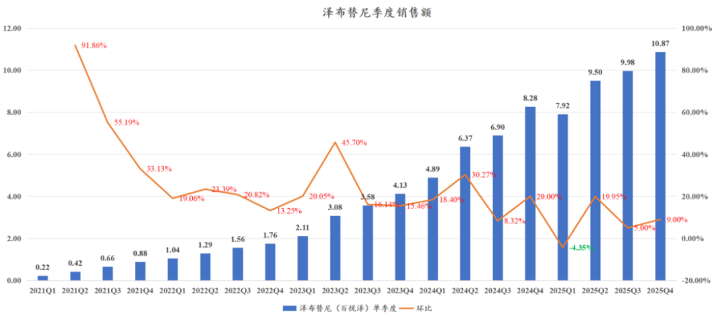
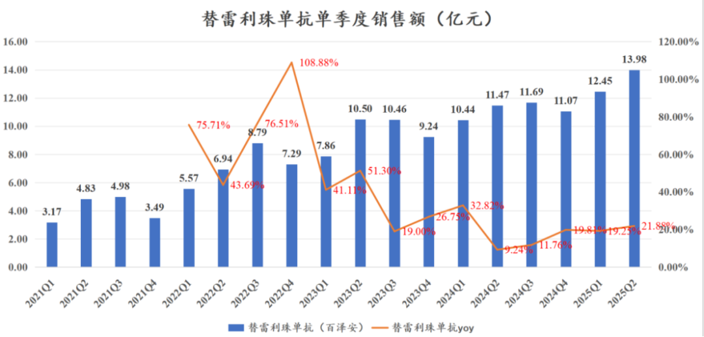
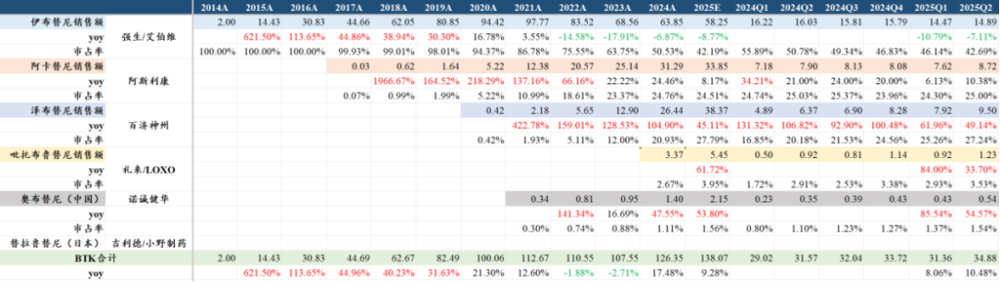
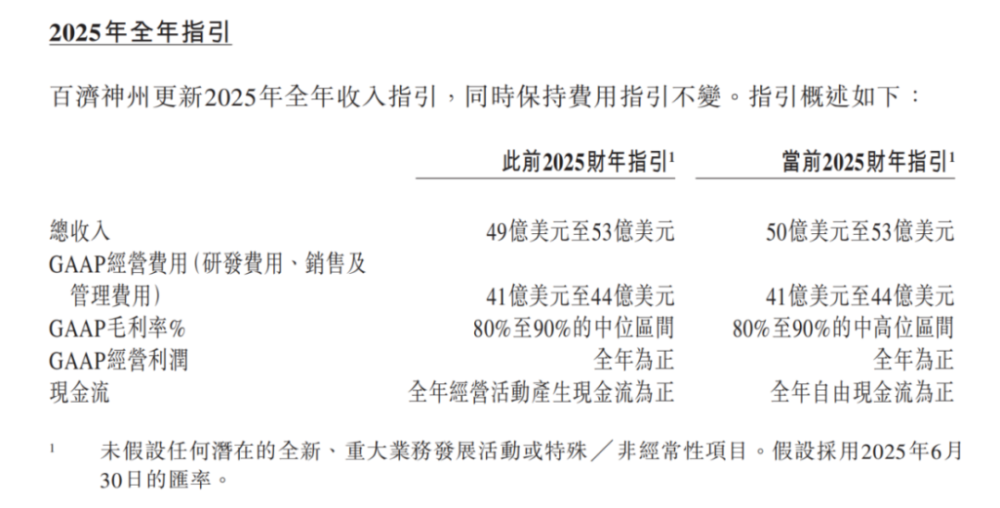
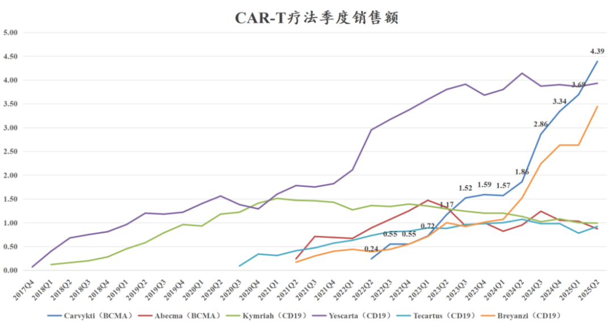
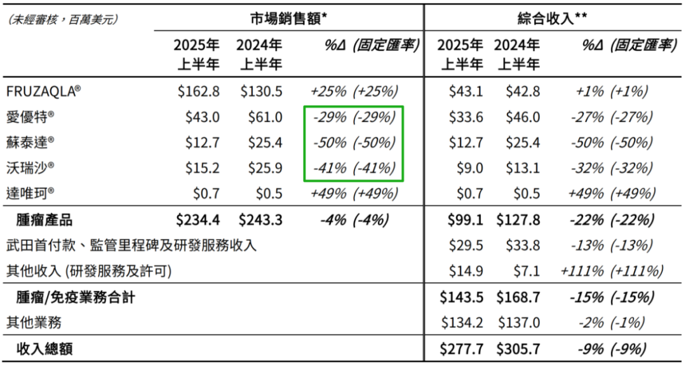
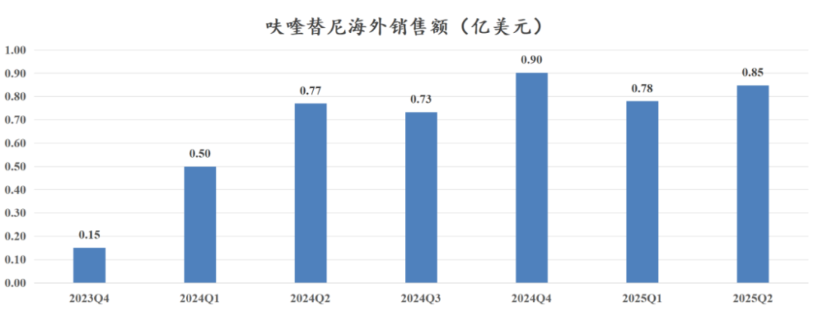
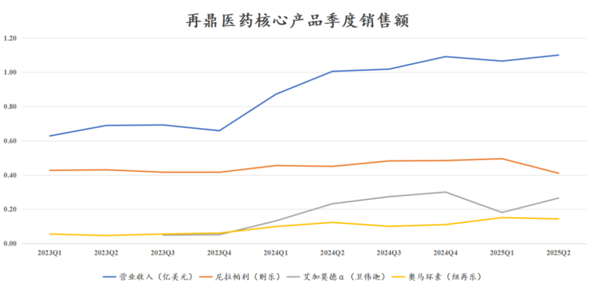

# 中国创新药美股五虎剧烈分化

大家好，我是龙哥。

标题党了一下下，国内创新药公司在美股陆续上市了也有多家公司，其中有个别被收购，有部分项目临床失利半死不活，最终剩下有一定看点的还有5家公司——百济神州、传奇生物、亚盛医药、和黄医药、再鼎医药，实际上我们可以看到这5家美股上市的中国创新药公司的国际化能力或眼光确实是行业比较靠前的。不过这5家公司现在也算不上五虎了，有的公司还是虎，有的公司已经快成hello kitty了。

5家公司中有3家在上周披露了中报，传奇虽然还未披露中报，但是强生的中报已经披露了传奇生物核心产品的销售情况，另外就是亚盛还未披露中报。本文就来聊聊以上4家的中报情况。

1、百济神州

结论：2025中报产品销售及利润超预期，首次经营性归母净利润转正、首次自由现金流转正，公司小幅上调全年指引。

百济在2025H1实现收入175.18亿元同比增长46%，其中产品收入173.60亿元同比增长45.8%，归母净利润4.50亿元同比扭亏、去年同期亏损28.77亿元，扣非归母2.61亿元、去年同期亏损31.25亿元，经调整净利润25.83亿元、去年同期亏损9.29亿元。

Q2单季度来看，单季度产品收入为13.02亿美元同比增长41%、环比增长17.46%；Q2单季度产品销售毛利率87.4%同比提升2.4%，主要是泽布替尼销售占比提升以及泽布替尼和替雷利珠单抗生产效率提高。

Q2研发费用5.25亿美元同比增长15%，销售及管理费用5.38亿美元同比增长21%，均显著低于收入增速。Q2单季度实现净利润0.94亿美元、去年同期亏损1.20亿美元，单季度净利润率5.75%同比提升20.36%、环比提升6.92%，经调整净利润为2.53亿美元、去年同期为0.23亿美元，2025Q2单季度实现自由现金流2.2亿美元、同比增加4.25亿美元。

2025Q2是百济神州历史上首次不含一次性BD收入下的经营性归母净利润转正，且首次实现自由现金流转正。

具体产品收入来看，泽布替尼Q2单季度销售9.5亿美元环比增长20%、同比增长49%、超市场预期，市场预期在9.2-9.3亿美元、环比增长17%左右；其中泽布替尼美国销售6.84亿美元同比增长42.8%、美国区销售占比72%，欧盟销售1.50亿美元同比增长85.2%、欧盟占比15.8%，中国区销售6.02亿元环比增长2%。

替雷利珠单抗Q2销售1.94亿美元同比增长22%同样超预期。

从全球BTK抑制剂销售额对比来看，预计BTK抑制剂总体销售34.85亿美元同比增长10.39%，其中2025Q2强生/艾伯维的伊布替尼销售14.89亿美元同比下滑7.11%，阿斯利康的阿卡替尼销售8.72亿美元同比增长10.38%，百济神州的泽布替尼销售9.50亿美元同比增长49.14%，百济神州一家基本吃下了行业全部的增长（百济增加3.13亿美元，全球BTK市场增加3.31亿美元），目前已经稳定超越阿卡替尼，预计还需要1年左右的时间追赶伊布替尼，毕竟强生+艾伯维的全球顶级MNC组合还是很强悍的，但此消彼长之下泽布替尼的反超也只是时间问题。

公司上调全年业绩指引，收入指引由49亿-53亿美元上调至50亿-53亿美元，毛利率指引由80%-90%的中位区间上调至80%-90%的中高位区间，现金流指引由全年经营现金流为正调整为全年自由现金流为正。

2、传奇生物

传奇生物核心产品Carvykti（BCMA CART）在2025Q2这个季度收入达到4.39亿美元，同比增长136%、环比增长18.97%，其中美国市场收入3.58亿美元、同比增长114.37%、收入占比81.55%，欧洲及其他市场收入0.81亿美元、同比增长305%、环比增长59%、收入占比18.45%。欧洲、日本等市场加速增长、收入占比也开始快速提升。

2025Q2对于传奇生物来说是一个新的里程碑，Carvykti正式登顶全球CAR-T细胞疗法最畅销药物，实现了对吉利德科学/Kite的全球首款CAR-T细胞疗法Yescarta（CD19）的反超。

在创新药的新技术领域，首次实现中国研发的创新药在全球成为领跑者，这是中国创新药历史的一个里程碑。

另外，以25年上半年Carvykti的销售情况推算，传奇生物/强生在25全年实现此前指引的翻倍增长（约19亿美元）应该已经问题不大。

3、和黄医药

和黄医药2025H1肿瘤产品收入2.34亿美元同比下降4%，其中合并报表部分收入0.99亿美元同比下降22%，肿瘤/免疫业务合计合并报表收入1.44亿美元同比下降15%。

国内商业化的4款产品中，3款主要的产品在上半年都实现大幅下滑，呋喹替尼下滑29%、索凡替尼下滑50%、赛沃替尼下滑41%。

我只能说，离谱。不知道的还以为和黄这三款产品遭遇集采了，除了医保谈判大幅降价和集采大幅降价以外我们还没见过能把创新药销售做成这样的biopharma。

呋喹替尼海外销售1.63亿美元同比增长25%，主要是因为24Q1的基数比较低，实际Q2的同比增速也只有10%。

公司指引25全年肿瘤/免疫事业部收入2.7亿-3.5亿美元，相较年报时指引3.5亿-4.5亿美元有大幅下调，按中位数计算下调22.5%。截至2024年6月底在手现金13.645亿美元。

近年和黄医药的人均薪酬一直在10万美元以上，大概相当于国内大多常规biotech平均薪酬水平的2倍左右，公司CEO拿3600万年薪，CFO拿1045万年薪，交出这样的破业绩，对得起股东吗？

4、再鼎医药

公司发布2025Q2销售业绩，Q2单季度收入1.1亿美元同比增长9.45%、环比增长2.8%，其中尼拉帕利收入0.41亿美元同比-8.9%、环比-17.2%，艾加莫德收入0.265亿美元同比+14.2%、环比+46.4%，扭再乐收入0.143亿美元同比+16.26%，三款收入占比较高的核心产品销售均低于预期，尤其是被寄予厚望的艾加莫德在经历一季度的调整后二季度仍未回到历史新高。

此前去公司调研，感受就是公司商业化可能还是有一些压力，但没想到这么差。公司表示维持全年收入指引5.6亿-5.9亿美元，目前来看完成的可能性已经很低。

风险提示：本文仅讨论行业/公司经营情况，投资需综合考虑公司经营、估值、管理层等多方面因素，建议读者审慎参考，本文不作为投资依据，不建议大家根据本文做出投资计划。

<!-- wxmp-comments-begin -->

---

## 留言（11 条，含回复共 25 条）

- **钢笔小帆** 👍4 · 2025-08-11 17:03
  再鼎的管理层也是一样高薪[呲牙]
- **王熙** 👍3 · 2025-08-11 17:12
  这篇文章感觉意犹未尽，看到一半就没了，请问龙大，明天是不是有续集[呲牙]
  - ↳ **作者** · 2025-08-11 17:13
    大部分公司还没发业绩呢，重点公司都会分批写。
    至于某些公司，低头不见抬头见的，不好说太难听，希望知耻而后勇吧[撇嘴]
- **幸运丰** 👍2 · 2025-08-11 17:26
  哥，现在微创系是应该买微创医疗还是买他的分支？
  - ↳ **作者** · 2025-08-11 17:28
    母公司是典型的价值毁灭，不创造股东价值，持续的增发和大规模的给管理层发股权激励收割小股东，债务都在母公司，现金和增长都在子公司。
  - ↳ **作者** · 2025-08-11 17:29
    行业β来的时候母公司可以阶段性的作为行业ETF去投资，切不可较真，更不能信管理层的宏大叙事。
- **lh-6kg** 👍2 · 2025-08-11 17:28
  再鼎坚持全年收入指引目标，你们调研的时候，没当面提出质疑么。
  - ↳ **作者** · 2025-08-11 17:32
    港股有些公司，历史上给的指引从来不能兑现，慢慢的公司指引就没人信了，这是在消耗自己公司的信誉，大家都是有自己的判断的。调研后我自己调整模型就认为公司基本不可能做到该指引了（除非BD），公司嘴硬你又没法怎么着他。
- **子默** 👍1 · 2025-08-11 17:26
  龙大，传奇生物业绩好，但走势似乎比不强。
  国内的和元生物也是细胞治疗的cro，是不是更没有机会啦？
  - ↳ **作者** · 2025-08-11 17:34
    这几年来看，细胞和基因治疗领域CDMO确实是miss很多，和元生物本身能力就不算强，行业β再不行的话就难搞。
- **朴实无华** · 2025-08-11 17:13
  龙哥医疗器械是不是该安排了？迈瑞跟联影
  - ↳ **作者** · 2025-08-11 17:14
    迈瑞和联影要等中报之后看情况。迈瑞现在也是，大家都知道中报很差，不知道能差到什么程度。
  - ↳ **作者** · 2025-08-11 18:00
    他现在是高值耗材+脑机接口+医美+减肥药[捂脸][捂脸]
- **风萧萧** · 2025-08-11 17:15
  亚盛呢？是不是半年报以后再解读？
  - ↳ **作者** · 2025-08-11 17:16
    嗯，血液瘤的亚盛、诺诚都半年报后一起写吧。
- **风驰电掣** · 2025-08-11 17:19
  写的真棒，烦请开打赏吧
  - ↳ **作者** · 2025-08-11 17:26
    赞赏每个月底开一次，感谢支持[抱拳]
- **天涯过客** · 2025-08-11 17:23
  龙哥，再鼎利空是不是相当于已经释放了？
  - ↳ **作者** · 2025-08-11 17:26
    嗯，二季度的利空释放了，三季度和四季度不知道
  - ↳ **作者** · 2025-08-11 17:50
    我觉得再鼎目前的业绩并不能说明什么，毕竟公司看点几乎不在已上市的产品上，如果没有公司不靠谱得指引 这个业绩是不是还行？公司下半年到明年上半年催化剂还蛮多的，相比同行得涨幅也落后不少，个人觉得算现阶段比较有性价比的标的了
- **Munjuicekwai** · 2025-08-11 22:13
  龙哥 biotech加科斯有调研最新动态么 pan-kras能成的话，想象空间可就大了
  - ↳ **作者** · 2025-08-11 22:30
    是的，pan-KRAS他最近在比较高效率的进行剂量爬坡，也在谈BD，这个药的成药确实比较难，一旦成功的话海外市场潜力远大于国内。
  - ↳ **作者** · 2025-08-11 22:46
    公司研究KRAS有十年，在戈来雷基础上修改和优化，成药性是不是更高？听说公司这一两个月会公布一期部分数据，能分析预测下会是什么样的数据吗？由于KRAS的特殊性，一期数据好，成药概率就会提高很多
- **云深不知处** · 2025-08-12 13:44
  为啥少了一家的评价？？
  - ↳ **作者** · 2025-08-12 13:45
    亚盛还没发中报呢[尴尬]

<!-- wxmp-comments-end -->
