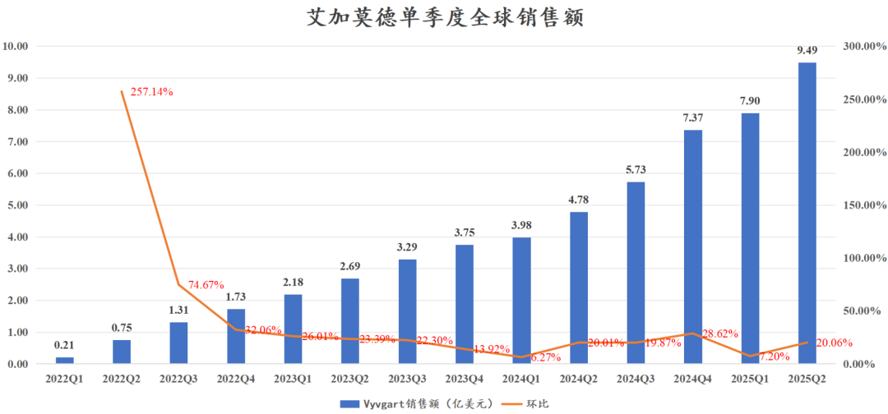
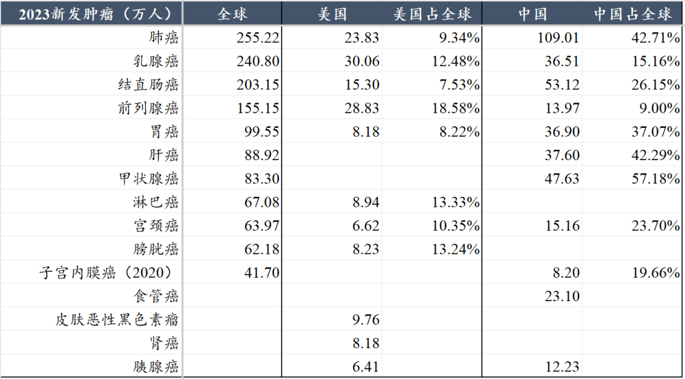
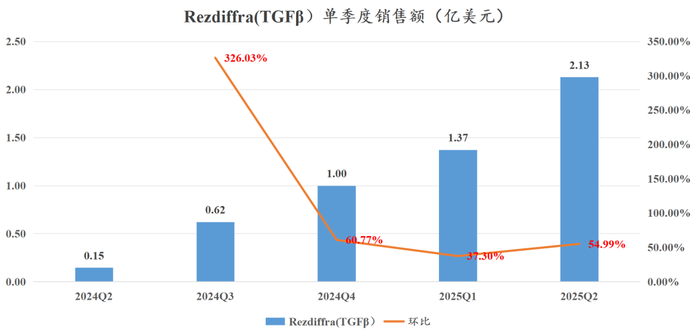
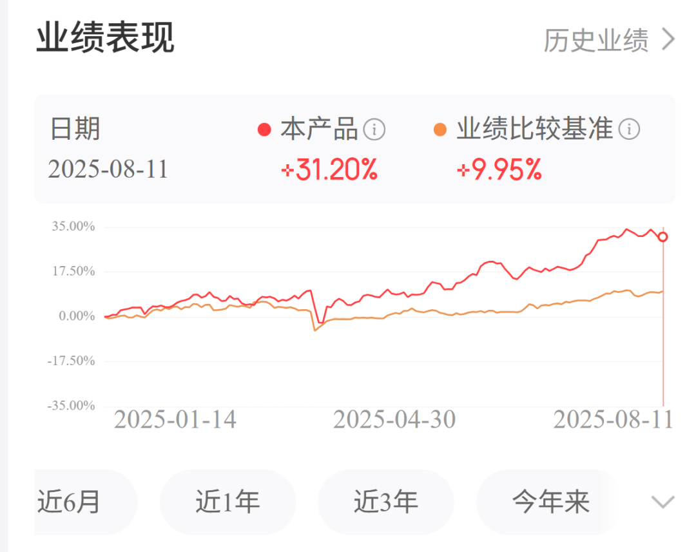
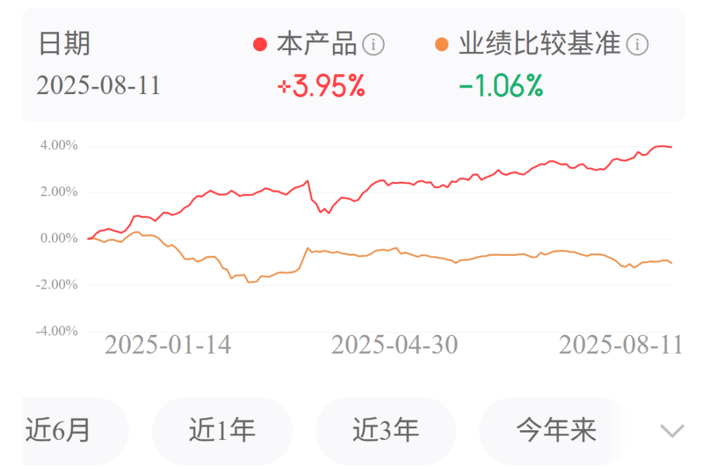

# 哪些全球顶级创新药在25年大超预期？

大家好，我是龙哥。

海外MNC的中报基本披露完毕，我们阅读并梳理了海外一系列MNC的中报情况，尤其是其核心产品销售和在研管线，本文就给大家简单聊聊在我们看到的MCN中报里，在25年上半年销售较为超预期的重磅创新药品种，参照全球顶级创新药品种，从而映射国内的研发方向。

1、自免：

自免领域在前两天的文章里刚给大家聊过：[自免再现200亿美金超级大药](https://mp.weixin.qq.com/s?__biz=MzkyMzQ3MDc3Mw==&mid=2247484792&idx=1&sn=8fb59368167f4ed7e950607826df81e7&scene=21#wechat_redirect)

①瑞莎珠单抗（IL-23p19）：上半年销售78.48亿美元同比增长65.74%，其中美国市场销售67.62亿美元同比增长69.22%，美国销售占比86.2%；公司指引全年达到171亿美元销售额、同比增速达到46%；达到百亿美金以上的体量还有这个增速的重磅药物，在常规药物中唯有减肥药可与之一战，这也在持续验证我们在过去的文章中对IL-23p19这个靶点的看好，其在银屑病领域的统治力已经毋庸置疑，在IBD适应症上也持续发力，对未来其他IBD疗法来说也都是挑战。

②乌帕替尼（JAK1）：上半年销售37.46亿美元同比增长48.47%，其中美国销售26.72亿美元同比增长53.39%，美国销售占比71.3%；乌帕替尼目前已经获批特应性皮炎、IBD等大适应症，销售也在持续超预期，预计最快26年就将突破百亿美金的全球销售额。

③艾加莫德（FcRn）：上半年销售17.39亿美元同比增长98.49%，Q2单季度环比增长20.06%；美国销售14.83亿美元同比增长96.53%，美国销售占比85.3%；根据再鼎医药的中报，上半年中国销售0.45亿美元，占全球2.57%。艾加莫德全年有望挑战40亿美元全球销售额。

重症肌无力、CIDP等适应症属于罕见病里发病率还相对偏高的适应症，在全球市场、尤其是药品定价较高的美国市场可以实现大规模的放量，但是在国内市场还是会受制于支付能力的局限性。

2、肿瘤：

1）血液瘤：单抗、小分子、ADC、TCE双抗、细胞治疗等多个领域多点开花。

①达雷妥尤单抗（CD38）：上半年销售67.76亿美元同比增长21.65%，其中美国销售38.46亿美元同比增长23.86%，美国销售占比56.76%，达雷妥尤单抗在多发性骨髓瘤一二线治疗的渗透率持续提升，预计25年将挑战140亿美元全球销售额。

②泽布替尼（BTK）：上半年销售17.42亿美元同比增长54.71%，美国销售占比71.5%；泽布替尼已经超越阿卡替尼成为全球份额第二的BTK抑制剂，全年有望突破38亿美元全球销售额。对于百济和泽布，昨天的文章已经具体写过（[中国创新药美股五虎剧烈分化](https://mp.weixin.qq.com/s?__biz=MzkyMzQ3MDc3Mw==&mid=2247484834&idx=1&sn=985827b5491440939c3898141bf5a3e3&scene=21#wechat_redirect)），不再赘述。

③西达基奥仑赛（BCMA-CART）：上半年销售8.08亿美元同比增长135.57%，其中美国销售6.76亿美元同比增长120%，美国销售占比83.7%；Carvykti全年有望突破19亿美元全球销售额。

在多发性骨髓瘤领域，强生依靠CD38单抗、BCMA-CART、BCMA/CD3双抗、GPRC5D/CD3双抗及后续在研的三抗等产品组合已经形成绝对统治力。

④Breyanzi（CD19-CART）：上半年销售6.07亿美元同比增长134.36%，全年有望挑战15亿美元全球销售额。BMS在多发性骨髓瘤领域被强生/传奇的Carvykti打的溃不成军，在DLBCL领域则是异军突起，未来1-2个季度有望成为全球最畅销CD19 CART疗法。

2）乳腺癌：全球第二、美国第一大癌种，CDK4/6辅助新辅助、HER2-ADC高增长。

2023年乳腺癌全球新发患者240万，为全球第二大癌种，美国发病人数30万人，为美国第一大癌种。乳腺癌患者群体庞大、生存期和用药周期较长，使得该领域天然会诞生大药。

①德曲妥珠单抗（HER2-ADC）：上半年销售22.89亿美元同比增长29.18%，其中美国销售11.28亿美元同比增长30.40%，德曲妥珠单抗是拉动全球ADC领域研发景气度的标杆品种，也是目前全球最畅销ADC药物，25年将挑战全球50亿美元销售额。

②瑞波西利（CDK4/6）：上半年销售21.33亿美元同比增长60%，全球3款主要的CDK4/6抑制剂预计25年全球销售额接近150亿美元，其中又以扩展至早期乳腺癌的瑞波西利增长最为突出。

3、糖尿病及代谢

在上周的文章里介绍了GLP-1类药物的销售情况：[药王之争从未如此残酷](https://mp.weixin.qq.com/s?__biz=MzkyMzQ3MDc3Mw==&mid=2247484818&idx=1&sn=e0910654f03d71607e16c7f1a5ee4e49&scene=21#wechat_redirect)，在此前的文章里也多次和大家聊到GLP-1类药物的情况。除了GLP-1类药物以外，代谢领域还有非酒精性脂肪肝、高血脂症等领域有创新疗法的突破和高增长。

①替尔泊肽（GLP-1R/GIPR）：降糖注射剂Mounjaro上半年销售90.41亿美元同比增长84.6%，减重注射剂Zepbound上半年销售56.93亿美元同比增长223.37%，GLP-1类药物已经是连续刷新全球重磅药放量速度记录的品种，前有司美格鲁肽，后有更离谱的替尔泊肽。替尔泊肽两个剂型全年销售有望突破340亿美元，尚有余力与司美竞争25年的全球药王。

②Rezdiffra（TGFβ）：上半年全球销售3.50亿美元，其中Q2单季度销售2.13亿美元环比增长55%，作为全球首个获批MASH适应症的创新药，全年有望挑战9-10亿美元全球销售额。除了Rezdiffra以外，后续司美格鲁肽也有望在年内获批MASH适应症，在经历无数失败后，MASH领域终于进入收获期。

③英克司兰（PSCK9 siRNA）：上半年销售5.55亿美元同比增长66%，作为半年给药一次的高血脂症创新疗法高速放量。诺华很快将面临90亿美元以上的大品种诺欣妥的专利悬崖，在心血管领域英克司兰是诺华的下一个重磅炸弹品种。

4、呼吸

①特泽鲁单抗（TSLP）：阿斯利康和Amgen在上半年合计实现销售额8.26亿美元同比增长62.92%，目前TSLP主要销售的适应症是重症哮喘儿童和成人患者的附加维持治疗，后续还有慢性鼻窦炎伴鼻息肉即将获批，以及COPD处于III期临床，在适应症拓展上仍有较大空间。

[COPD诞生百亿美金超大海外授权交易](https://mp.weixin.qq.com/s?__biz=MzkyMzQ3MDc3Mw==&mid=2247484774&idx=1&sn=11871ed2ce3add81d6097b21ca12e358&scene=21#wechat_redirect)

......

更新下龙哥定投的组合的净值表现，龙谈医药科技组合今年来+31.2%，跑赢业绩基准21%。

固收类的龙谈美元债组合今年来+3.95%，跑赢业绩基准5%。

风险提示：本文仅讨论行业/公司经营情况，投资需综合考虑公司经营、估值、管理层等多方面因素，建议读者审慎参考，本文不作为投资依据，不建议大家根据本文做出投资计划。

<!-- wxmp-comments-begin -->

---

## 留言（8 条，含回复共 17 条）

- **和** 👍5 · 2025-08-12 12:20
  能不能写一些关于眼科医药医疗的文章，感觉你从来没有写过啊？
  - ↳ **作者** · 2025-08-12 12:37
    也是关注我两年半了，怎么会这么说[捂脸][捂脸]
- **国际米兰** 👍2 · 2025-08-12 11:24
  龙哥好，能谈谈昨天南微的中报如何吗？
  - ↳ **作者** · 2025-08-12 11:31
    南微昨晚中报业绩中规中矩吧，上半年增长还可以，其中收入端有并购的因素加持，利润端有汇兑收益的加持。
- **田野** · 2025-08-12 11:31
  在平淡的整体增速下，各家MNC手里都有一些非常亮眼快速放量品种。文中重磅药也是未来各家专利到期填坑品种。
  - ↳ **作者** · 2025-08-12 11:32
    是的，除了艾伯维以外，其他MNC基本都有一个到几个大品种在未来1-3年面临专利悬崖，例如昨天刚梳理发现辉瑞未来3年有超过200亿美元的收入面临专利悬崖，当前的辉瑞就有可能是低估值陷阱。
- **东** · 2025-08-12 11:42
  龙哥，能跟投组合呢[害羞]
  - ↳ **作者** · 2025-08-12 11:43
    公众号主页下面有介绍的文章，可以了解下[呲牙]
- **阿榔** · 2025-08-12 11:49
  龙哥好，能否谈谈再鼎的ZL - 1310的前景及销售预期峰值？
  - ↳ **作者** · 2025-08-12 11:54
    这个在今年ASCO的时候我有篇文章解读过数据，感兴趣可以往前翻翻文章，再鼎这个DLL3-ADC肯定是好药，公司下半年就会开全球注册临床了。SCLC虽然在肺癌里15%左右的比例不算高，但架不住肺癌患者基数大，全球250万新发，SCLC又比较需要新疗法的突破。
- **景** · 2025-08-12 11:51
  龙大能不能把关键的几个药对应的公司列举一下，我查了下，没个标准的
  - ↳ **作者** · 2025-08-12 11:57
    你说的是国内还是海外对应的公司？海外的话就是艾伯维，Argenx，强生，百济，传奇生物，BMS，阿斯利康，诺华，礼来，Madrigal，安进
- **Bryan** · 2025-08-12 11:55
  龙哥最近好高产啊，涨上去对研究的精细度要求就高多了。昨天文章留言玩啦，您看下是否能翻一下，后面也写一些专题文章[抱拳]
  - ↳ **作者** · 2025-08-12 12:01
    最近很多公司进入中报静默期，调研和各种会议不多，案头工作多一些，有空就可以多写写
  - ↳ **作者** · 2025-08-12 12:02
    昨天问题我看了，等血液瘤几家出完财报吧，一起梳理一下业绩和管线
- **天野源** · 2025-08-12 12:01
  龙哥，现在国内CRO调整，是不是都在等中报出来后再行动？
  - ↳ **作者** · 2025-08-12 12:04
    我只能说中报之后有可能是个买点吧，具体还要看市场的演绎，比如有没有进一步的行业催化，比如期间有没有像样的回调。

<!-- wxmp-comments-end -->
