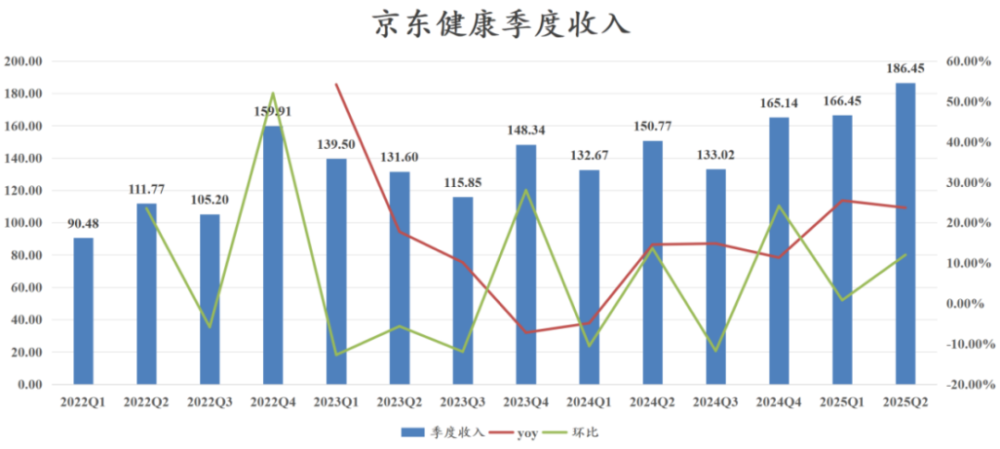
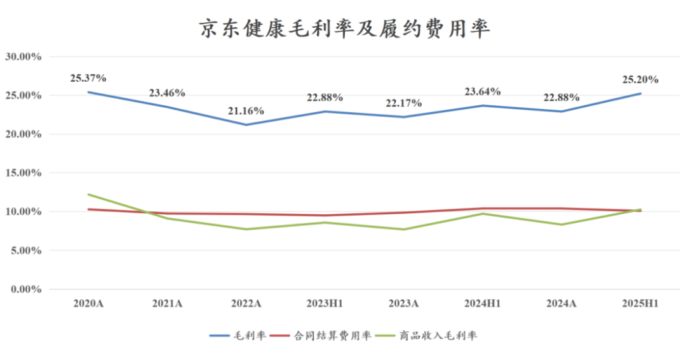
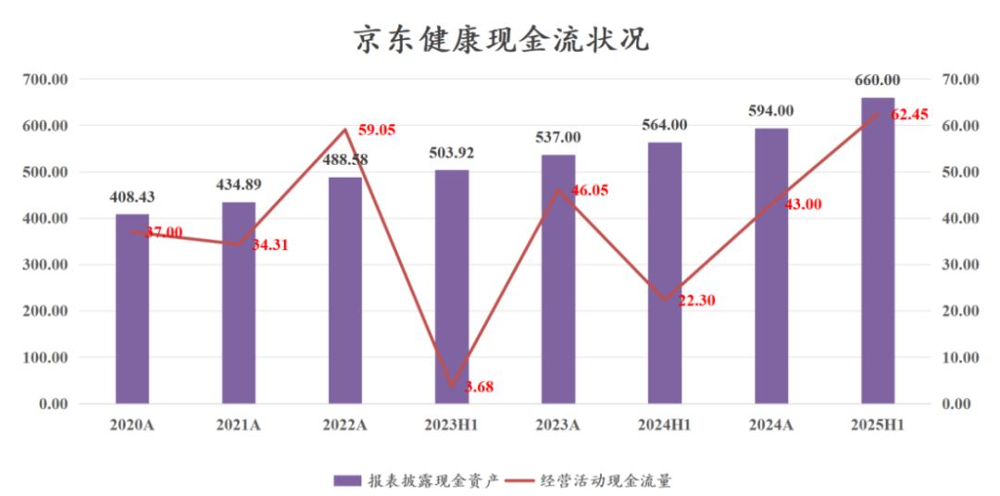
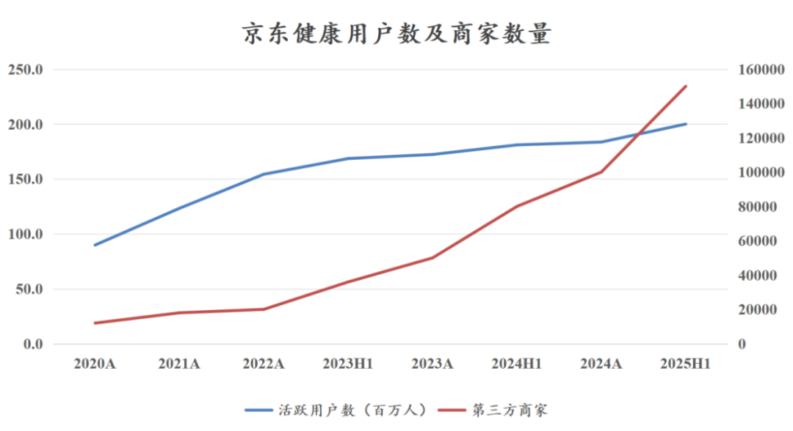

# 互联网医疗寡头业绩大超预期

大家好，我是龙哥。

我们在去年七八月的时候给大家提过京东健康，当时的逻辑非常简单，“560亿在手现金+每年40亿以上经营现金流+双位数增长+双寡头垄断竞争格局，只有600亿市值”，这种逻辑已经不需要各种复杂的分析预测了，只需要依靠常识就知道这估值之下必能赚钱。

到昨晚京东健康披露中报，今天股价再度大涨，底部至今已经上涨超过2倍，市值修复到1800亿，这里我们再来聊聊京东健康这份中报的质量。

收入端来看，2025年上半年收入352.9亿+24.51%，Q2单季度收入186.45亿+23.67%。京东健康在内的互联网医疗公司普遍在2020-2022年实现了收入的爆发式增长，原因嘛大家也都知道，疫情的三年使得这些线上医疗平台非常受益，京东健康从23年二季度开始进入消化高业绩基数的阶段，到2024Q2刚好就是京东健康消化完业绩高基数、重回双位数增长的时候，也是京东健康股价跌至最底部的时候。2024Q2-Q4公司恢复到双位数增长，25年Q1-Q2收入增速进一步上到23%-25%左右，表现亮眼。

利润端来看，京东健康2024H1-2025H1的归母净利润分别为20.37亿、25.96亿，同比增长27.45%，经调整净利润分别为26.44亿、35.70亿，同比增长35.04%，经调整净利率10.12%同比提升了0.79%，这其中包含的是公司毛利结构和费用结构的显著变化。

具体来看：

收入结构方面，公司25年上半年的服务收入（主要是平台、广告及其他服务）收入为59.59亿元同比增长34.39%，收入占比提升到16.89%同比提升1.25%，而医药和健康产品等商品收入为293.31亿元同比增长22.67%，收入占比从84.36%下降至83.11%。不要小看收入结构这1个多点的变化，要知道京东健康的服务收入的毛利率高达98%-99%，而商品收入的毛利率只有10%左右，就这一点结构变化，就使得公司总体的毛利率从24年上半年的23.64%提升到25年上半年的25.20%，当然从我们拆分的情况来看预计商品收入的毛利率本身也略有提升。这1.6%的毛利率的提升对公司总体盈利增长至关重要。

履约成本方面，京东健康25H1的履约成本是35.52亿元，费用率是10.07%同比下降0.31%，之前23-24年京东健康的商品收入的毛利率下降到只有8%左右，而履约成本反而提升到了2024年的10.37%，也就是公司的商品收入部分实际上是亏钱的，而现在商品部分的毛利率回到10%左右，履约成本略有下降，意味着公司商品收入部分的毛利可以覆盖掉履约成本，这部分不再是公司的利润拖累点。

经营性费用方面，销售费用率5.13%同比提升0.18%，管理费用率1.73%同比下降0.69%，公司25H1的股权激励费用只有3.55亿元，同比减少了2亿，在2021-2022年公司股权激励费用最多的时候高达25.8亿和21.0亿，24年已经降到11.3亿，25年预计进一步下降到7-8亿，经调整利润是不含这块费用的，但对于表观利润来说还是会有较大的影响。研发费用率2.09%同比下降0.19%，以上三项费用率合计下降了0.70%。

利息收入方面，我们知道公司在手现金很多，根据公司中报披露的信息，截止到25H1公司在手现金660亿元，而24H1的在手现金是564亿、24年底的在手现金是594亿，公司账上的现金像印钞机一样快速增加，2025H1的经营现金流是62.45亿元，创下公司历史上的最好表现。

但是由于降息等因素的影响，公司的利息收入并没有进一步的增加，25H1的利息收入是8.09亿元、收入占比2.29%，而去年同期则是9.90亿元、收入占比3.49%，利息收入占收入比重下降了1.2%，这也是为什么大家看到毛利率提升1.56%、履约费用率下降0.31%、三项经营费用率下降0.70%，但最终净利率提升并不太多。

业务方面，京东健康过去1年的发展还算不错，主要体现在以下几点：

①用户数和商家数量持续增长，截止到25H1的活跃用户数突破2亿人，可以看出京东健康这两年的新增活跃用户数增长已经明显放缓，不过相较京东集团的活跃用户数还是有差距的。

商家数量在这两年出现快速增长，诸多慢病药、偏消费医疗的药械产品、高价的创新原研药等品类（例如信达生物的玛仕度肽、诺和诺德的司美格鲁肽等），在这两年都会选择在京东健康进行产品的首发和推广，一定程度上也是在应对当前压力与日俱增的医保市场。

②即时零售取得较大进展，过去的京东健康是以B2C为主，我们知道很多慢病药在京东健康的价格要远低于药店的价格，但是B2C存在的一个问题就是即时性不足，大家在互联网药店买药可能配送到家需要几天的时间，如果着急用药的话就只能选择就近的药店或者在美团、饿了么这些平台下单（也是在就近药店的订单）。

而京东健康开始切入到O2O的赛道后，也开始做药品的即时零售的配送，从而扩大了其市场覆盖面，尤其是过去几年B2C增速放缓、O2O还在高增长的情况下，京东健康切入O2O赛道更显必要性。

③AI医疗取得突破，在今年初梳理AI医疗的时候就有提到过互联网医疗平台，实际上如阿里、京东、平安好医生等平台，资金实力雄厚、数据量庞大，一旦开始在AI上有所投入，相较其他小公司的优势是非常显著的。

京东健康乃至整个京东集团从今年一季度开始也的确加大了对AI的投入，公司发布了应用于线上全场景的AI京医系列产品，包括面向用户的AI医生、AI药师、AI营养师、AI心理咨询师等专业服务智能体及医生专家的数字分身，以及面向医生的AI诊疗助手、AI科研助手等，到2025年上半年，AI京医的智能体累计服务用户数超过5000万。

这也是京东、阿里这类用户基数庞大的互联网巨头的天然优势，更多的用户使用也可以帮助企业更好的训练模型，拉大与小平台的差距。同时，AI的突破也可以在一定程度上帮助京东健康真正打通“从药到医再到药”的商业模式正向循环。

......  
总体来看，在上一轮医药牛市出现大市值公司的医药细分领域中，创新药、CXO和互联网医疗的基本面和股价都已经走出来，包括我们此前聊到的一些ETF，也不仅再局限在创新药ETF，大伙在投资时也都有了更多的选择。

风险提示：本文仅讨论行业/公司经营情况，投资需综合考虑公司经营、估值、管理层等多方面因素，建议读者审慎参考，本文不作为投资依据，不建议大家根据本文做出投资计划。

<!-- wxmp-comments-begin -->

---

## 留言（13 条，含回复共 29 条）

- **和** 👍5 · 2025-08-15 11:46
  龙哥上次文章提到520510ETF刚好正中下怀包含其中，这星期好猛[强][强][强][强][强][强][强][强]
- **王熙** 👍3 · 2025-08-15 11:02
  现在就是医疗器械龙头还在装死中，哎
  - ↳ **作者** · 2025-08-15 11:05
    这个确实是基本面所处的阶段不同。
  - ↳ **作者** · 2025-08-15 11:26
    这样才提供的高切低的机会，要珍惜
- **戴着🐸 头套的🐶** 👍1 · 2025-08-15 11:03
  请教一下龙哥，目前创新药CXO的估值算高吗
  - ↳ **作者** · 2025-08-15 11:09
    创新药虽说行情是行业β，但基本面还是差异非常大的，现在这种鸡犬升天的行情，必然是有很多无厘头的炒作，至于这轮基本面不错的龙头公司，估值普遍也来到预期打到比较高的水平，这位置再去选股肯定是难度大了很多。
  - ↳ **作者** · 2025-08-15 11:11
    CXO的话，CRO和CDMO也差别很大，CRO普遍处于第一阶段的估值修复，现在看着估值不便宜的样子，实际上因为现在计算估值的业绩是周期底部最差的业绩，后续业绩修复之后估值就会下来。CDMO的话，由于基本面已经在修复，甚至行业龙头药明已经在高增长，估值并不算高，这其中包含了对政治风险担忧的折价。
- **小1** 👍1 · 2025-08-15 11:06
  请问医疗器械还有多久起飞，埋伏中[捂脸]
  - ↳ **作者** · 2025-08-15 11:13
    器械已经有不少公司今年涨幅巨大了，这个和基本面企稳的节奏比较有关系，你看我5月写的骨科拐点，骨科公司早就起飞了。
- **laor** 👍1 · 2025-08-15 11:06
  看好京东零售，现在原研药的管控，零售是条出路
  - ↳ **作者** · 2025-08-15 11:13
    是的，药企也都在寻找出路，线上营销，线上推广，还是有不少机会的。
- **HanaNeko** 👍1 · 2025-08-15 11:15
  龙哥对联合健康怎么看，属于烟蒂吗。
  - ↳ **作者** · 2025-08-15 11:22
    说到这，早上有个消息：最新报道显示，2026 年 Medicare Part B 月保费预计上调 11.6%，从 185 美元升至 206.50 美元；同时，Part B 年免赔额将增加 12%，从 257 美元提高至 288 美元。Part D 药物计划的基础保费预计上涨 6%，至 38.99 美元，免赔额上调至 615 美元，年度处方药自付上限也提高至 2,100 美元 。建议大家在开放注册期间（10 月 15 日至 12 月 7 日）审视所有 Medicare 选择，包括 Advantage 或 Medigap 方案
- **三余书生** 👍1 · 2025-08-15 11:15
  为什么牙医这么弱
  - ↳ **作者** · 2025-08-15 11:19
    不是牙医弱，是消费医疗都弱。消费环境你还不知道啥情况吗。
- **兔子的蔡** 👍1 · 2025-08-15 11:37
  时代天使怎么还磨磨蹭蹭啊，能来个大涨不？[破涕为笑]
  - ↳ **作者** · 2025-08-15 11:42
    发业绩那天大涨18%，这还算磨磨唧唧啊[捂脸]这还没发正式中报呢，器械大部分公司确实没法像创新药那样涨
- **Daye 朱子达** 👍1 · 2025-08-15 12:28
  龙哥，爱博基本面有大的隐患吗？一季度同比下跌10%就跌停到现在还没修复，好煎熬，想陪他重回100又怕中报爆雷。再鼎吃了一个雷了已经，好怕再来一个
  - ↳ **作者** · 2025-08-15 12:37
    第108次回复，爱博中报业绩压力比较大，预计三季度企稳。
- **不爱青椒** · 2025-08-15 11:16
  京东健康现在就是市值看着有些高，担心后面增长缓慢，股价弹性也弱
  - ↳ **作者** · 2025-08-15 11:19
    市场环境不同了，再想有去年那种靠常识买股票的时候不知道要再等多少年了，现在就得叠加更多更细致的分析了。
- **林尤琳** · 2025-08-15 11:16
  迈瑞的K线很多都是十字星，看着有点别扭，背后隐藏着点什么吗？
  - ↳ **作者** · 2025-08-15 11:17
    看K线图你们读者们应该比我专业[呲牙]
  - ↳ **作者** · 2025-08-15 11:35
    公司说的季度业绩调控，我感觉公司会尽力做到，毕竟公司还有一半的海外收入呢，海外这边压力不大的，不像国内。但IVD这边目前看下来的确压力还是非常大的。
- **berlin0320** · 2025-08-15 13:54
  很可惜去年龙哥说的时候犹豫了一下，要不然这个涨幅和创新药也差不多了。
  1. 有点想不明白，医药O2O这块，美团为啥没做起来呢。之前担心这里，结果在外卖上干起来了。
  2. 另外请教龙哥，互联网药房远期看自营和O2O大概是个什么比例。
  - ↳ **作者** · 2025-08-15 14:14
    美团做起来了啊，美团的医药的O2O之前就有几百亿规模了，已经发展的很好了，不然也不会吸引京东健康来做这块。
  - ↳ **作者** · 2025-08-15 14:15
    O2O和B2C的比例我还不好说，目前的趋势是O2O还是快的多的，B2C里还包含比较多的医疗器械、保健品这些对即时性要求没那么高的。
- **【名将】** · 2025-10-20 12:17
  假如从十年的角度看，你觉得京东健康是否会被对手超越？京东健康最大的几个风险是什么？
  - ↳ **作者** · 2025-10-20 16:35
    就目前来看被阿里健康反超的概率不高，但还是要注意在AI这块的投入和行业变化，就AI这块我认为阿里还是比京东要强不少的

<!-- wxmp-comments-end -->
