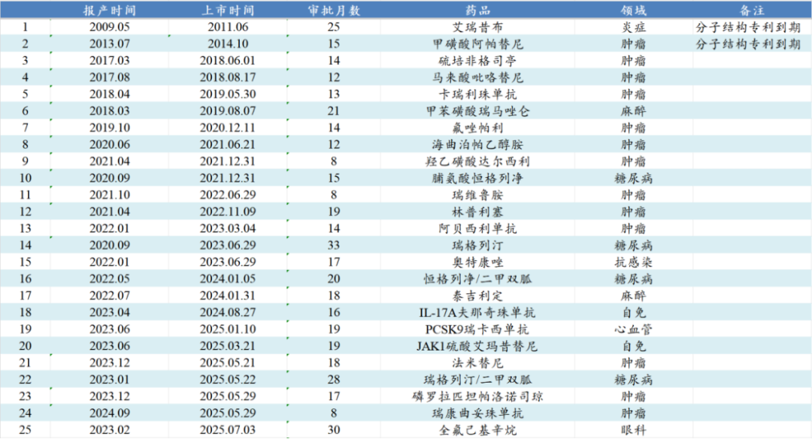
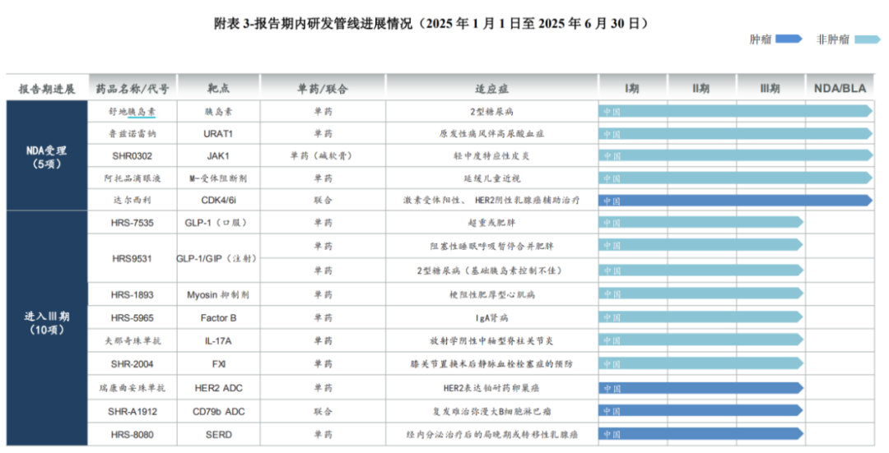
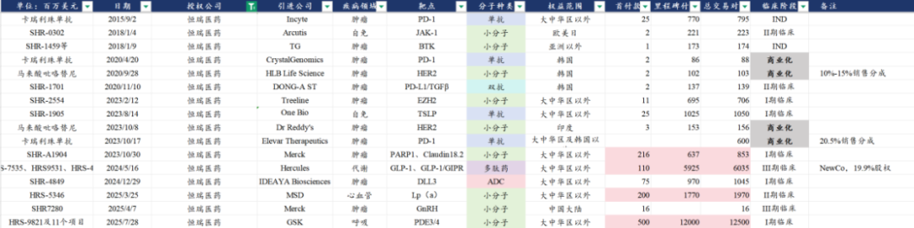
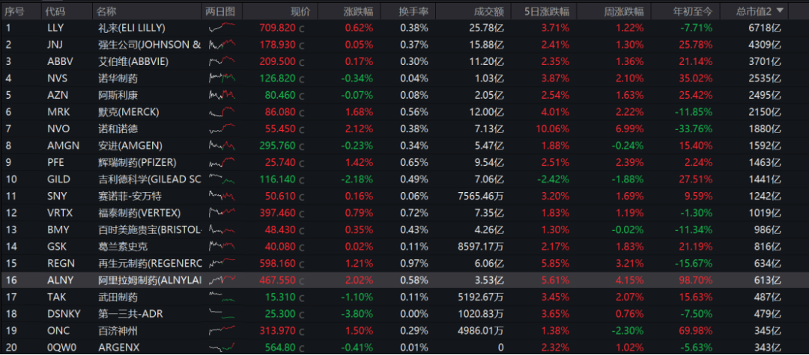

# 创新药龙头展望

大家好，我是龙哥。

恒瑞医药在周三晚上发布了25年中报，昨天实在太忙没空聊，今天来简单聊一下恒瑞中报的情况，我们今年已经有多篇文章聊到恒瑞，今天这篇文章会从更长期的角度聊聊对恒瑞的未来展望。

1、业绩情况

首先先对中报的业绩情况做个定性，2025年上半年恒瑞医药的创新药收入是略低于我们此前的预期，利润表现符合预期，公司的25年员工持股计划下调创新药复合增长目标自30%下调至25%。

具体来看：

恒瑞2025上半年收入157.61亿元同比增长15.89%，总体要高于国内投资人预期的10%收入增速，主要是BD收入贡献较大收入体量（收入占比12.7%）。其中：

①创新药产品收入：

上半年创新药产品收入75.70亿元同比增长21.8%、收入占比48%、占药品收入的55.3%，自2024年上半年恒瑞医药的创新药收入占产品收入比重首次突破50%，近一年进一步提升至55%，根据我们的推算，预计到2026年恒瑞医药的创新药占产品收入比重将会超过三分之二，2027年则是会进一步提升到75%左右。

②仿制药产品收入：

上半年仿制药收入61.23亿元同比下降0.21%%，恒瑞的仿制药业务仍在缓慢的出清中，短期收入占比依然不低，这也导致恒瑞虽然创新药部门有20%-30%的增长，但是总体医药制造业收入增速在这几年以及未来几年始终只有10%-15%。

仿制药部门目前还有三个比较大的品种，分别是七氟烷、布托啡诺和碘佛醇，其中碘佛醇的规模会相对大一些，另外生物类似药这边恒瑞一直做的不多，有些规模的主要就是贝伐珠单抗，生物类似药可能会在26年进行首批的集采，恒瑞的仿制药在海外这两年可能还会有点利润增量，总体能延缓一点仿制药部门的下滑，但趋势还是不可逆的。

③创新药BD收入：

2025年上半年创新药BD收入19.91亿元，2024年上半年大概在12.5亿左右（1.6亿欧元），2024年全年是27亿元。公司希望BD收入能常态化，这两年主要依靠新签项目的首付款，未来几年会有新项目的首付款+已授权项目的里程碑付款。

利润端，上半年归母净利润44.50亿元+29.68%，扣非归母42.73亿元+22.43%，同样是BD收入贡献主要增量，2024H1和2025H1的BD收入分别为12.5亿元、19.91亿元，按照所得税率15%计算贡献约10.625亿、16.924亿利润，也即BD收入贡献的利润增量约为6.3亿元。

扣除BD贡献的利润外，产品收入贡献的利润约为27.58亿元同比增长16.4%，依然要高于医药制造业的收入增速11.4%，公司上半年研发费用增长不多，公司2025H1研发投入38.71亿元总体持平，其中研发费用32.28亿元同比增长1.9亿元（+6%），研发费用率下降1.86%。

公司公布了2025年的员工持股计划，总的规模是1400万股、占总股本0.21%，就恒瑞这个员工数量和收入体量来说规模倒不算很大，股票来源是公司回购的A股股份，受让价30.95元/股，相较前收盘价折价50.8%，总规模8.8亿元。公司同时公告计划回购10亿-20亿元A股股份用于员工持股计划。

25年的员工持股计划对业绩考核是25年、25-26年、25-27年创新药收入分别不低于153亿元、345亿、585亿，简单计算就是25-27年的创新药收入分别在153亿、192亿元、240亿元以上，分别同比增长18%、25%、25%。

公司上一期员工持股计划对创新药的复合增长目标考核是30%复合增速，因此我们此前对恒瑞医药创新药收入的增长预期大概在30%复合增速，从中报来看创新药收入增速低于预期，2025年的员工持股计划业绩考核中，公司也相当于下调了考核目标。

2、管线进展及展望

短期的产品销售受到多方因素的影响，也已经是既成事实，我们更多还是要展望未来的发展。

我们看恒瑞医药的在研管线，直观感受就是“多”，密密麻麻覆盖各个领域、各个靶点，实际上此前我们也多次介绍过，恒瑞截止到今年7月已经累计获批了25个创新药，在国内创新药行业算是遥遥领先。

同时公司到2025年上半年还递交了5个新药/新适应症的上市申请，以及新开了10项III期临床：

这是恒瑞医药过去10年持续研发投入的成果，基于在中国市场的市场环境，恒瑞医药的fast follow的模式还是取得了不错的成果。

恒瑞过去管线的以数量取胜，也带来了一定数量的BD交易，尤其是在当前欧美药企密集到中国寻求高性价比创新药BD的大环境下更是恒瑞进入舒适区的时候。三十多年的仿制药开发、十几年的创新药开发的积累，始终能跟上和把握产业变迁路径的恒瑞医药，站在国际化的风口上，也是迎来新的挑战。

如上文讲到的，恒瑞医药的25个创新药在2025年全年可能才能实现150亿-170亿的创新药收入，26年可能争取200亿左右的销售规模，而百济神州的泽布替尼、传奇生物的Carvykti仅靠一个产品就能实现这个体量的收入。

我们纵观全球的创新药历史，几乎没有一家大型MNC或者新兴biopharma是靠“摊大饼”的方式实现企业价值的跃升，反而是从近年来看，头部的MNC的核心大品种的收入占比反而越来越高，例如默沙东的K药今年收入占比接近50%，礼来的替尔泊肽今年收入占比56%左右，诺和诺德的司美格鲁肽今年收入占比74%左右，吉利德科学的比克恩丙诺今年收入占比51%左右，赛诺菲的度普利尤单抗今年收入占比36%左右，哪怕是产品集中度偏低的诺华，增长也主要来自诺欣妥和瑞波西利等个别大品种。

在国内过去的新药研发环境下以数量取胜是一个不算错误的选择，过去收入体量小、资金量小、财务有压力的时候，我们可以说，“First in class/Best inclass是梦想、Fast follow才是生活”。

但现在生活质量显著提升了，尤其是在港股IPO之后，恒瑞医药截至25年中报手握50亿美金的现金，甚至已经比有些MNC的现金储备还多。这个时候环顾四周，600亿美金市值的恒瑞医药，超越了武田制药、第一三共、百济神州等公司。

恒瑞的早期管线越来越迈向前沿之际，是时候开始尝试摆脱市场对恒瑞的fast follow的定位了，此时正是好的时机，借助港股IPO融资之势，改善公司在分子开发方面的思路。速度固然重要，但要开发出真正的全球重磅品种，需要对靶点机制、对疾病领域更深刻的理解，而过去十几年的新药研发已经给了恒瑞不少的积累。

因此，恒瑞的研发策略，应该从速度第一转为质量第一，放眼全球市场没有足够竞争力的分子该剁就剁掉，没必要非得推进到商业化阶段，实际上现在海外创新药在国内上市与海外的时间差也越来越短，fast follow哪怕在国内也已经不太好使，恒瑞和智翔金泰的IL-17A在国内获批之际，诺华的可善挺已经以七八十亿的销售额全面攻占国内市场，留给一众国产fast follow的空间极其有限。

当年由于财务压力而开始的研发投入资本化，在新的阶段也可以终止，MNC每年百亿美金的研发投入也不需要资本化，市场也并不会因为MNC的短期研发投入波动导致的利润下滑甚至亏损就不看好公司。对于创新药公司而言，利润只是短期波动的决定因素之一，而管线价值才是长期市值中枢的核心决定因素。

50亿美金的现金，50个临床后期及商业化阶段的创新药，是恒瑞医药全面迈向国际化和FIC/BIC的底气，条件总比当年的百济、传奇要好的多。我们比较期待看到恒瑞下一次的蜕变、和第一个真正的国际化超级重磅品种的出现。

风险提示：本文仅讨论行业/公司经营情况，投资需综合考虑公司经营、估值、管理层等多方面因素，建议读者审慎参考，本文不作为投资依据，不建议大家根据本文做出投资计划。

<!-- wxmp-comments-begin -->

---

## 留言（16 条，含回复共 33 条）

- **砼行** 👍6 · 2025-08-22 12:49
  中报中规中矩，未来充满希望
- **空生** 👍5 · 2025-08-22 12:57
  迈瑞医疗业绩下滑，以后还能好不？
  - ↳ **作者** · 2025-08-22 13:11
    第108次回复迈瑞，短期来看中报业绩会比较差，市场也有预期中报很差，只不过我也不知道到底有多差。公司的指引是25Q3业绩转正。今年来国内IVD板块的压力确实是超预期的。
  - ↳ **作者** · 2025-08-22 13:28
    哈哈，龙哥无奈
- **杨一腾** 👍4 · 2025-08-22 12:52
  目前看到的对恒瑞最中肯的评价[强]获益匪浅，很有共鸣 相信恒瑞一定能做出全球大单品来的
  - ↳ **作者** · 2025-08-22 13:07
    大单品在恒瑞的早期管线中酝酿
- **安之** 👍4 · 2025-08-22 13:17
  龙哥，请教一下，泰格在CRO里的竞争优势主要体现在哪里？
  虽然新签订单增长7.3%，但是净利率一再下滑，24年净利率只有6.78%。是不是意味着这部分订单增长是靠低价抢回来的？
  而出海方面，24年泰格来自海外的营收占总收入的比例达46%，但在海外的市占率只有1.4%，泰格的出海优势还是靠低价+并购？
  - ↳ **作者** · 2025-08-22 13:20
    订单价格你看毛利率会更准确一些，确实过去一年多到两年整个临床的价格在下行，泰格不可避免的跟着行业下行。净利率可参考意义不大，主要是泰格有很多创新药投资，在产业下行期这些投资就是亏损，上行期又会放大利润，所以大家一直说泰格天然带杠杆，就是这个意思。
    至于海外部分，他海外不全是CRO，还有一部分实验室服务，就是他还并表港股那个方达控股，包括你说的净利率的问题，你看方达的收入体量不小，但没啥利润，也拖累泰格的利润率的。
- **海蓝啸** 👍3 · 2025-08-22 12:46
  恒瑞+药明已经兑现，等待回调，不过貌似比较难有舒服的位置了。现在开始布局爱博医疗和安图生物，龙哥这两个未来应该能走出来吧
  - ↳ **作者** · 2025-08-22 13:07
    两家公司有不差，爱博只是个增长节奏的问题，部分业务受到经济大环境和集采的影响也不可避免，公司还是很优秀的，也一直有新的成长曲线。安图的话这几年折腾了很多赛道，最终还是扛不住国内的IVD政策压力，出海又比较晚比较慢，需要更多时间走出来吧。
- **Eminem** 👍2 · 2025-08-22 12:35
  我今天就是要看又有谁在这问爱博 [捂脸][捂脸][捂脸][捂脸][捂脸]
  - ↳ **作者** · 2025-08-22 13:05
    今天到现在还真没有[旺柴]有几家公司之前一直是反复问反复答，还有很多没翻出来的留言也在问，哈哈
  - ↳ **作者** · 2025-08-22 13:19
    龙哥辛苦了，一个外行的我在您这受益匪浅，没少挣！不说假大空，谢谢你，做好笔记，认真阅读！爱你！哈哈哈哈
- **凡人詹** 👍2 · 2025-08-22 12:56
  就是怎么连跌呢
  - ↳ **作者** · 2025-08-22 13:09
    创新药销售低于预期的情况下，A股恒瑞还连涨呢
- **肥锋  家诚哥** 👍2 · 2025-08-22 13:00
  股价已经慢慢开始体现这些憧憬了，希望国内创新药企越来越好吧
  - ↳ **作者** · 2025-08-22 13:11
    是的，尤其是今年的国际BD。
- **尘缘** 👍1 · 2025-08-22 12:54
  龙哥，SHR-A1811会是一个重磅吗？另外，新药上市到销售放量，按中国市场情况，起码要2~3年的时间吧？这么说，最近3、4年是新药集中获批，那业绩要到5、6年后才有反映吧？请指教[抱拳]
  - ↳ **作者** · 2025-08-22 13:09
    1811曾经公司和我们都是寄予厚望的，但目前来看相比8201在大适应症上应该是没有足够强的竞争优势的，公司对这个品种的预期也下调了。
    销售放量基本就是进医保的前几年，恒瑞今年产品获批最集中，今年到明年密集进医保。
- **天野源** 👍1 · 2025-08-22 13:08
  龙哥，昭衍新药这种有很多实验猴的，是不是具有很强的周期性？
  - ↳ **作者** · 2025-08-22 13:17
    其实这个周期性也没大家想的那么大，只是上一波产业周期里伴随了新冠和限制进口这些因素导致周期性被大幅放大了，这轮周期我认为不太可能类比的。
- **Xingchen** 👍1 · 2025-08-22 13:09
  mnc 里面也有群狼战术的，不如阿斯利康，还是选择更合适自己模式比较好，虽然我认同您观点
  - ↳ **作者** · 2025-08-22 13:16
    嗯，阿斯利康这几年的表现在MNC里是比较出众的，多个产品线同步增长，专利悬崖压力相对没那么大。但阿斯利康前三大品种的收入占比也有40%，实际上在这几年TOP10或者TOP20集中度比较低的MNC就是诺华了，MNC大部分情况核心增长还是来自超级大品种。
- **东** 👍1 · 2025-08-22 13:33
  请问如何看待贝达
  - ↳ **作者** · 2025-08-22 13:34
    从2017年关注贝达至今，少有不miss的时候，不论是销售、研发、注册、BD。
- **吕智峰** 👍1 · 2025-08-22 16:56
  请解读一下诺程建华的中报吧
  - ↳ **作者** · 2025-08-22 16:57
    诺诚后面血液瘤的一起写一下吧
- **谢工** · 2025-08-22 12:57
  为什么各大医药公司研报看不到龙哥的，都是内部的吗？
  - ↳ **作者** · 2025-08-22 13:10
    你看到的那些研报是券商研究所或者专业的第三方研究机构对外发布的，我们作为投资机构，内部报告不会外发。
- **Kyle** · 2025-08-22 13:19
  联邦制药一直不温不火，UBT251授权好像也没带来太多价值提升呢
  - ↳ **作者** · 2025-08-22 13:22
    其实还是带来了价值提升的，你之所以感觉股价涨的不够，主要是他原有业务那边进入周期下行期，要不是创新药这块兜着的话股价早就跌下去了。
- **灵感自在** · 2025-08-22 13:27
  龙大，脑机这块是不是快到deepseek时刻了？前几天看到研报说国内走的没有比美国慢，很快就要获批商业化了
  - ↳ **作者** · 2025-08-22 13:30
    脑机这块应用嘛是有一些快落地了，但还是比较简单的应用，和大家想的真正的脑机接口差距还蛮大的，我感觉算不上DS时刻吧。

<!-- wxmp-comments-end -->
