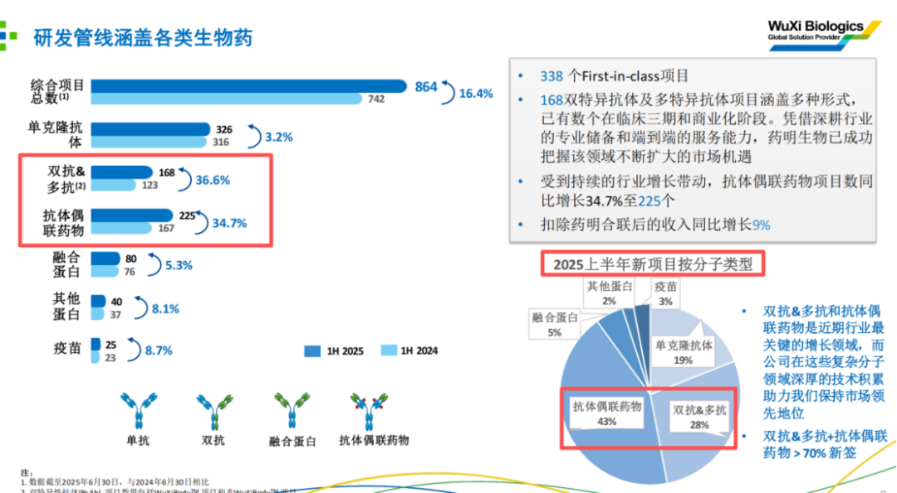

# CXO行业全面加速

大家好，我是龙哥。

我们今年来已经多篇文章和大家讨论CXO行业：[药明康德业绩大超预期再度引爆行业](https://mp.weixin.qq.com/s?__biz=MzkyMzQ3MDc3Mw==&mid=2247484730&idx=1&sn=d7a6a50d01511dab57602f403215e422&scene=21#wechat_redirect)，[创新药行情延伸](https://mp.weixin.qq.com/s?__biz=MzkyMzQ3MDc3Mw==&mid=2247484631&idx=1&sn=46d50979dcb5eb6edfbfb77cf83a7b18&scene=21#wechat_redirect)，[CXO全面复苏](https://mp.weixin.qq.com/s?__biz=MzkyMzQ3MDc3Mw==&mid=2247484308&idx=1&sn=3ecff125b0b85e5cd323cb99f646e2a3&scene=21#wechat_redirect)，[医药最高景气方向](https://mp.weixin.qq.com/s?__biz=MzkyMzQ3MDc3Mw==&mid=2247484299&idx=1&sn=c6677f52d0ea6ebfbc11420984b3636d&scene=21#wechat_redirect)，[CXO王者归来](https://mp.weixin.qq.com/s?__biz=MzkyMzQ3MDc3Mw==&mid=2247484259&idx=1&sn=1bc93a5b4d6772af4068695f22d8f23f&scene=21#wechat_redirect)。

也一直在强调，对于25年的中报而言，CRO和CDMO肯定是“冰火两重天”，CDMO行业跟随的是全球创新药产业趋势，已经比较明确的从周期底部企稳、并且在ADC和GLP-1、双抗等领域的蓬勃发展下呈现景气度的快速提升；而CRO行业、尤其是临床CRO，则还是一定程度上受制于国内创新药景气度提升的滞后性，其订单开始有所起色，传导到报表上的收入利润还需要一定时间。

目前，CDMO龙头公司的财报已经基本披露完成，而CRO公司的财报普遍还没有披露，因此我们本文先主要聊聊CDMO行业的中报情况，后续会再做另外一篇文章聊聊CRO行业的情况。

1、行业收入利润全面增长

①药明康德2025H1收入207.99亿元+20.64%，经调整归母净利润63.15亿元+44.44%；其中Q2单季度收入111.45亿元+20.37%，经调整归母36.35亿元+47.64%。

药明康德是最受益于GLP-1景气度的公司，此前的文章中介绍到的有望在今年争夺全球药王的减重神药——替尔泊肽就是药明康德给做CMO生产，国内外大量GLP-1单靶点、多靶点药物都是药明康德做CDMO服务，2025H1多肽及寡核苷酸类药物CDMO收入50.30亿元+141.83%，收入占比达到24%，其中Q2单季度收入27.9亿元，收入占比25%。

②药明生物2025H1收入99.53亿元+16.08%，归母净利润23.39亿元+56.05%，经调整归母净利润23.89亿元+6.15%。药明生物虽然没有披露具体的各分子种类的收入分布，但我们从项目数和其独立上市的子公司药明合联可以看出趋势：双抗/多抗+ADC合计贡献了公司上半年70%以上的新项目数，XDC业务的药明合联上半年收入27亿+62%，占药明生物收入比重达到27%。

③药明合联2025H1收入27.01亿元+62.19%，扣非净利润7.46亿元+52.74%，经调整净利润8.01亿元+50.06%。

④康龙化成2025H1收入64.41亿元+14.93%，康龙化成自2024Q1收入出现同比下滑后，2024Q2-2025Q2已经连续5个季度修复收入增速，连续4个季度恢复到双位数的收入增长，除了大分子和CGT CDMO外的核心业务板块都有不错的恢复。

⑤凯莱英2025H1收入31.88亿元+18.2%，其中小分子CDMO业务收入24.29亿元+10.66%，而新兴业务收入7.56亿元+51.2%，新兴业务的收入占比达到23.7%，新兴业务中表现最突出的是化学大分子（GLP-1等多肽类药物为主）收入3.79亿元同比增长超过130%，也即凯莱英也开始享受GLP-1类药物带来的上游景气度。

⑥博腾股份2025H1收入16.21亿元+19.88%，其中小分子CDMO收入15亿元，新兴业务领域收入1.16亿元同比增长37%、收入占比7.2%。

此外如九洲药业、药石科技、泓博医药等CDMO公司的收入端也都有不同程度的企稳。

2、在手订单全面恢复

各家CDMO公司的在手订单、新签订单普遍呈现恢复状态，其中又以行业景气度最高的多肽药、ADC药物领域的订单增速最快。

①药明康德2025H1末的在手订单566.9亿元同比增长37.20%，环比一季度末增长8.7%。

②药明生物2025H1末在手未完成服务订单114亿美元同比-12.31%，但如果剔除此前卖厂的30亿美元长期疫苗大单，则未完成服务订单实际增长14%左右；三年内未完成服务订单为42亿美元同比增长15.38%，都预示着公司的订单增长开始企稳回升。

③药明合联2025H1末在手订单13.29亿美元同比增长57.9%，新签订单同比增长48.4%。

④康龙化成2025H1新签订单同比增长超过10%。

⑤凯莱英2025H1末在手订单10.88亿美元同比增长12.16%。

3、毛利率、固定资产周转率回升

CDMO生产本身偏向重资产，固定资产折旧在成本中的占比较高，因此收入端的修复本身就可以带来毛利率的回升，尤其是前几年布局的新兴业务领域的放量会带来新兴业务的毛利率显著提升。各家的固定资产周转率也有所回升。

①药明康德2025H1毛利率44.45%创历史新高，Q2单季度毛利率达到46.35%。

②药明生物2025H1毛利率42.73%同比提升3.66%。

③药明合联2025H1毛利率36.11%同比提升3.96%，创药明合联的毛利率历史新高。

④康龙化成2025H1毛利率33.97%同比提升0.58%。

⑤凯莱英2025H1毛利率43.49%同比提升1.34%，其中小分子CDMO毛利率47.79%已经超越新冠大单之前的常规业务毛利率水平，新兴业务的毛利率29.79%同比提升9.50%。上半年凯莱英的固定资产周转率从0.69提升到0.81，在向着新冠前常规水平2.2左右恢复中。

⑥博腾股份2025H1毛利率27.63%同比提升8.81%，新兴业务仍较为拖累毛利率，固定资产周转率从0.47提升到0.53。

4、美国区收入占比全面提升

CDMO公司的业绩和订单修复普遍受益于更早从产业周期底部走出来、并且在新兴药物领域快速爆发的美国市场，CDMO公司的中国区收入类似上文提到的CRO服务板块，回复高增长都还有一定的滞后性。美国区收入占比提升，潜在的政治风险也会长期客观存在。但CXO行业的公司也都知道，国内创新药客户普遍钱少、事多、超级卷。

①药明康德2025H1美国区收入140.3亿元同比+31%，收入占比67.45%同比提升5.33%，中国区收入31.5亿元同比-7.35%，收入占比下降至15.14%。

②药明生物2025H1北美收入60.18亿元同比+20.12%，收入占比60.46%同比提升2.03%，中国区收入12.97亿元同比-8.53%，收入占比下降至13.03%。

③药明合联2025H1北美收入13.91亿元+68.94%，收入占比51.49%同比提升2.06%，中国区收入4.85亿元+11.36%，收入占比17.94%同比下降7.75%。

④康龙化成2025H1美国收入40.58亿元+10.62%，收入占比63.0%同比下降2.45%，欧洲收入12.24亿+29.44%，收入占比19.00%同比提升2.13%，中国收入9.66亿元+14.70%，收入占比15.00%同比下降0.03%。

⑤凯莱英2025H1海外收入24.75亿元+23.29%，收入占比77.64%同比提升3.21%，中国收入7.13亿元+3.39%，收入占比22.36%。

⑥博腾股份2025H1海外收入11.53亿元+23.17%，收入占比71.13%同比提升1.9%，中国收入4.68亿元+12.5%，收入占比28.87%。

5、员工人数仍在下降，人均单产有所提升

以上CXO公司的员工人数普遍还在同比持平或下降，过去几年普遍处于大幅裁员或者人员不增长的状态，当然，CRO业务与员工人数相关度更高，CDMO有关联性、但会低一些，包括目前的AI和自动化也会帮助CXO公司减少人员需求。由于收入端有显著修复，而人员数量还在减少，使得人均创收有显著提升，也会使得CXO公司的盈利能力进一步改善。

①药明康德2025H1员工人数37832人同比-4.01%，人均创收55万同比+22%。

②药明生物2025H1员工人数12552人同比+0.94%，人均创收79万同比+15%。

③药明合联2025H1员工人数2270人同比+51.74%，人均创收119万同比+7%。

④康龙化成2025H1员工人数22908人同比+7.20%，人均创收28万同比+2%。

⑤凯莱英2025H1员工人数9106人同比-2.09%，人均创收35万同比+21%。

⑥博腾股份2025H1员工人数4200人同比-2.33%，人均创收39万同比+23%。

6、资本开支开始回升

如果说CXO公司招募员工的速度相对会比较快、因此员工人数还不能非常直观的反映公司对未来业务发展的信心，那么投资周期更长的固定资产开支则是可以直观的反映公司对未来的信心，各家CDMO公司自2025年以来在资本开支上普遍开始有显著的修复。

①药明康德2025H1资本开支21.02亿元+39%，指引2025全年资本开支75亿元，而2024年资本开支为40亿元。

②药明生物2025H1资本开支19亿元同比持平，指引2025全年资本开支53亿元，2024全年为39亿元。

③康龙化成2025H1资本开支11.54亿元同比+21.5%。

④凯莱英2025H1资本开支4.86亿元同比-26%，但凯莱英目前固定资产39.4亿元，另外还有20.7亿元的在建工程尚未转固，公司后续有足够的新增产能。

⑤博腾股份2025H1资本开支2.31亿元同比-24%，博腾作为二线的CDMO公司，在扩产上并不敢像一线公司那么激进，况且多年来每次博腾大幅扩产都会带来产能过剩、产能利用率过低、毛利率和净利率下降。

......

此前的文章讨论CXO行业我们做了一些定性的分析，而本文更加纯粹的定量的数据的展示，也可以比较清晰的告诉大家，在这一轮的全球创新药产业趋势中，药明系的全球竞争力和市场份额的确在进一步提升，尤其是到ADC、双抗等新兴领域的全球竞争力更是比单抗时代出众的多。同时我们也看到在新兴业务领域，以上高速发展赛道的景气度也开始外溢到其他一二线的CDMO公司。

......

近期重点文章：

[哪些全球顶级创新药在25年大超预期？](https://mp.weixin.qq.com/s?__biz=MzkyMzQ3MDc3Mw==&mid=2247484844&idx=1&sn=82de722328a5675ecf9ac735e60fd5e4&scene=21#wechat_redirect)

[自免再现200亿美金超级大药](https://mp.weixin.qq.com/s?__biz=MzkyMzQ3MDc3Mw==&mid=2247484792&idx=1&sn=8fb59368167f4ed7e950607826df81e7&scene=21#wechat_redirect)

[医疗器械终于迎来政策拐点](https://mp.weixin.qq.com/s?__biz=MzkyMzQ3MDc3Mw==&mid=2247484765&idx=1&sn=126ce558bd7f6b23e07dc56c43968659&scene=21#wechat_redirect)

风险提示：本文仅讨论行业/公司经营情况，投资需综合考虑公司经营、估值、管理层等多方面因素，建议读者审慎参考，本文不作为投资依据，不建议大家根据本文做出投资计划。

<!-- wxmp-comments-begin -->

---

## 留言（20 条，含回复共 45 条）

- **阿宝** 👍3 · 2025-08-26 15:55
  一边地缘风险一边订单接到手软，这不是悖论吗[破涕为笑][破涕为笑]大胆冲！
  - ↳ **作者** · 2025-08-26 16:05
    不是悖论，政治风险确实更多是一种情绪上的担忧，这是中美之间的博弈，至于订单，那是全球MNC和biotech的“生活”，你不选药明你就速度慢。
- **光头的复利人生** 👍3 · 2025-08-26 17:16
  龙哥有没有关注一家二线的ADC CDMO公司叫东曜？
  - ↳ **作者** · 2025-08-26 17:17
    嗯，行业里说东曜做的还可以，但基本没有流动性，就没怎么关注。
- **余朝洋** 👍2 · 2025-08-26 15:33
  龙哥对于医疗器械怎么看。横盘好久了
  - ↳ **作者** · 2025-08-26 15:34
    医疗器械上个月底写了两篇文章讲过，去翻翻历史文章。
- **DRAGON** 👍2 · 2025-08-26 15:38
  我的药明生物和康德也该来一波大的了吧，也不枉我坚守了几年了
  - ↳ **作者** · 2025-08-26 15:40
    这不已经来了一波大的了吗，康德和生物这么大的盘子今年都80%左右的涨幅了。
  - ↳ **作者** · 2025-08-26 15:51
    我还没回本呢，看的更高更远一点[呲牙]
- **fengzhy** 👍2 · 2025-08-26 15:40
  未来的风险点有哪些？
  - ↳ **作者** · 2025-08-26 15:43
    长期、反复的风险就是地缘政治风险。
- **悦霖同辉** 👍2 · 2025-08-26 15:50
  龙哥：大博医疗怎么样？
  - ↳ **作者** · 2025-08-26 15:56
    可以翻翻看5月写的骨科的文章。大博医疗中报业绩也是超预期的， 全年的利润预期上调到5.5亿，目前对应今年估值大概44倍PE，估值也已经对其业绩反映的比较充分了。
- **天涯过客** 👍1 · 2025-08-26 15:44
  龙哥时代天使业绩怎么看？
  - ↳ **作者** · 2025-08-26 15:47
    时代天使的业绩是比较超预期的，此前发了预报就已经知道中报利润端已经有非常不错的改善，具体到业务这块，海外的案例数大超预期，公司原本指引全年21万例，仅上半年海外就做了11.72万例，全年应该要大幅上调。国内上半年的案例数增速也有14%，虽然ASP下降比较多，但是国内的价格战居然还能把销量增长这么多确实也是比较意外的，毕竟国内的消费环境大家都知道的。
  - ↳ **作者** · 2025-08-26 16:00
    海外的资本开支和运营费用增加，是此前就已经反映在时代天使的股价和预期里的，并不是中报预报之后大家才知道的。并且时代天使的海外经营性盈利如能有大幅改善，实际上也会减少对于其投固定资产开支的未来压力的担忧。
    专利起诉方面，就市场份额和增长趋势分析来看，时代天使确实是伤及了隐适美的全球份额，所以隐适美开始着急起诉，这个我现在也说不准最终结果，但隐适美的主要专利早已经到期，我个人判断应该影响不会太大，时代天使也已经做了回应，后续就跟踪诉讼的进展吧。
- **林尤琳** 👍1 · 2025-08-26 15:48
  龙哥，心脉什么时候从降价中走出来
  - ↳ **作者** · 2025-08-26 15:52
    去年那个降价的一过性影响已经反映在业绩里了，但后续主动脉不确定是不是还是要做国采，做国采的话就还要再等1年左右的时间去出清。
- **Jimmy** 👍1 · 2025-08-26 15:52
  看好双抗、ADC领域的话，药明合联是不是更好的选择？
  - ↳ **作者** · 2025-08-26 15:57
    今年来的文章和留言大家如果看的仔细，我一直说合联必然是最高景气赛道的首选。另外XDC是在合联这边，双抗还是在生物的。
- **向阳而生4108** 👍1 · 2025-08-26 16:11
  龙哥开立的中报辛苦龙哥分析下，
  - ↳ **作者** · 2025-08-26 16:20
    开立的中报的确还是表现一般，一方面是收入端，一方面是费用端，收入端这个受到行业总体的政策环境和经济环境以及采购周期的影响，开立这种公司更多时候是被动的接受的，但开立这个公司历史上一直存在的问题就是费用开支控不住，这个在公司的上行期还好，在下行期尤其明显，这就导致公司历史上的利润波动幅度一直非常巨大，理论上收入体量已经到了开立现在这个20多亿的体量是不该利润波动如此之大的。
    所以，进一步的说，开立可能会类似2021-2022年那波的情况，收入端先有改善，然后利润率大幅提升，这个过程很可能比大家预期的要长，所以对开立切不可预期太高。
- **雪山** · 2025-08-26 15:33
  请问诺泰生物呢？
  - ↳ **作者** · 2025-08-26 15:37
    公司要是当年没有搞财务造假，也不会被ST，现在在这高景气的赛道上，业绩、股价都不会缺，即使没在高景气赛道上，A股几年一轮的行情，股价也都会有点表现。
- **Werther** · 2025-08-26 15:36
  凯莱英这个业绩，为什么大跌呢
  - ↳ **作者** · 2025-08-26 15:39
    凯莱英昨晚发的业绩我认为并不差，今天跌也不是凯莱英自己跌，是整个CXO行业都在回调，回调的原因嘛我认为更多可能归为昨晚川普又口嗨降药价的事，毕竟文章里也写到CDMO的这些都是美国收入占比很高，降价+制造业回流的要求可能他在任上这几年都会反复的提，对于板块来说，涨多了的时候给你来这么个消息，必然就会有人想规避下风险。
- **LLL** · 2025-08-26 15:37
  龙哥 能说说乐普吗
  - ↳ **作者** · 2025-08-26 15:43
    乐普从中报情况来看，冠脉介入稳定，结构心的心泰医疗那边还是贡献了主要的收入利润增量，然后药品板块超我预期的企稳了。乐普接下来1-2年基本上处于他近几年布局的一个收获期，包括结构心、医美、眼科等领域都会有不少新产品。再就是减肥药这块，他之前收购了上海民为生物，在三靶点的布局上也是比较领先的，这块我之前也有单独的文章介绍过了。
    总体来说乐普还是从药品和器械双重集采打压的周期底部走出来，有一些新的增量业务，在牛市里概念主题比较多，包括脑机接口、减肥药这种大的主题。
- **小1** · 2025-08-26 15:42
  龙大，感谢您的文章！请教一下，心泰医疗有没有必要投资？我看中报数据还行。今天暴跌。[呲牙]
  - ↳ **作者** · 2025-08-26 15:45
    今天暴跌是因为乐普医疗大宗交易减持了心泰3.2%的股份，减持价格是22.79港元/股，折价比较多，港股对这种折价减持一般都是会直接跌下来。
  - ↳ **作者** · 2025-08-26 16:00
    一般不会，核心还是企业本身价值，心泰目前倒是不算贵，就是确实跟不住业绩。
- **在远方** · 2025-08-26 15:49
  龙大，能详细说说CS创新药指数吗，从2020年一直定投到现在，也有盈利10%，但非常遗憾年初没切换的港股创新药(才用的是另外开车一笔盈利100%，但仓位低 没赚到什么)，思维没转换过来。想问问CS创新药还能一直拿吗 里面有长春高新一直跌，这只股有跟踪吗？
  - ↳ **作者** · 2025-08-26 15:54
    CS创新药指数今年来也涨了36%了，虽然确实和港股创新药的差距比较大，但也不止10%吧。另外最近A股确实表现要显著强于港股。
    长春高新也在转型创新药，最近刚刚批了一个IL-1β单抗的新药，只是原有的生长激素的盘子太大，现在长效生长激素的价格战打的比较猛。
  - ↳ **作者** · 2025-08-26 16:06
    总比医药全行业指数会好一些吧
- **兵七进一** · 2025-08-26 15:54
  泰格医药中报预期怎么样？谢谢
  - ↳ **作者** · 2025-08-26 15:57
    如文中所言，临床CRO中报肯定是不好的，这个大家也都知道，但业绩到底啥情况还要看具体财报具体分析。
- **123456** · 2025-08-26 15:55
  龙哥：通策医疗怎样了，后续有机会吗？CXO里面康龙化成是条虫，股价表现最拉稀，今年就没怎吗涨！
  - ↳ **作者** · 2025-08-26 16:04
    主要是AH股的问题，今年A股的泰格、康龙都涨的不多，估值很低的H股的泰格和康龙都还是涨了不少的。
    通策医疗的话可以见另外一条消费医疗的回复。
- **Huginn** · 2025-08-26 15:55
  龙哥 医疗小白问一个问题啊 通策和爱尔这种牙茅和眼茅做toC 生意的  是不是属于消费板块   不能在创新药位置高的时候 去买他们做补涨
  - ↳ **作者** · 2025-08-26 16:02
    创新药的逻辑是出海，和消费医疗的逻辑确实是截然不同，消费医疗这边实际上更多是和宏观环境、大盘、消费板块关联度更高，比如你说做白酒涨多了之后的补涨是可以的，但是做创新药的补涨感觉逻辑是不对的。
- **琪** · 2025-08-26 16:19
  龙哥，ADC领域博腾也有产能，未来股价会不会炒起来
  - ↳ **作者** · 2025-08-26 16:22
    这块的能力建设和经验积累还是需要时间的，即便建起来产能，未必能有订单，即便有订单，未必能有可持续的、能推进到商业化阶段的大品种的订单，ADC领域呈现了非常明显的龙头集中效应，如果是看好细分领域的景气度，不要老想做杂毛的补涨，还是要多看看龙头的能力。
  - ↳ **作者** · 2025-08-26 16:27
    说是龙头更被针对，但其实我感觉没太大差别，真要药明被猛怼的时候，你看后排的公司少跌了吗，不也照样跟着暴跌嘛。
- **Jo** · 2025-08-26 17:44
  龙哥可以谈谈对中国生物制药的投资看法吗？
  - ↳ **作者** · 2025-08-26 18:01
    翻历史文章

<!-- wxmp-comments-end -->
