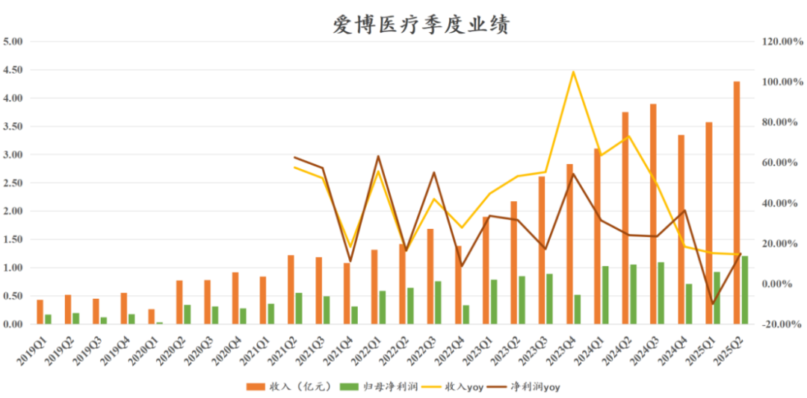
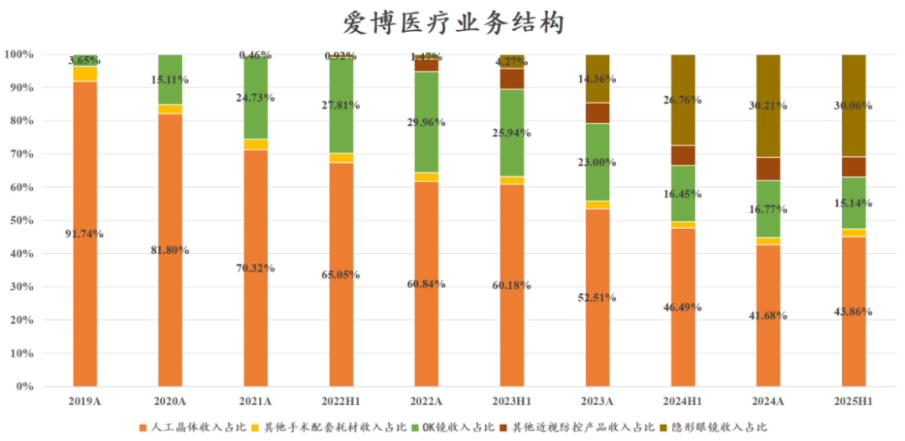
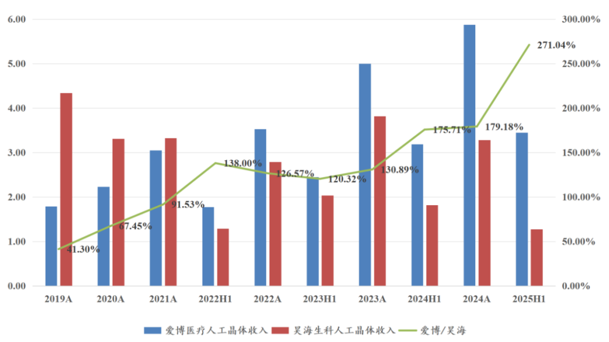
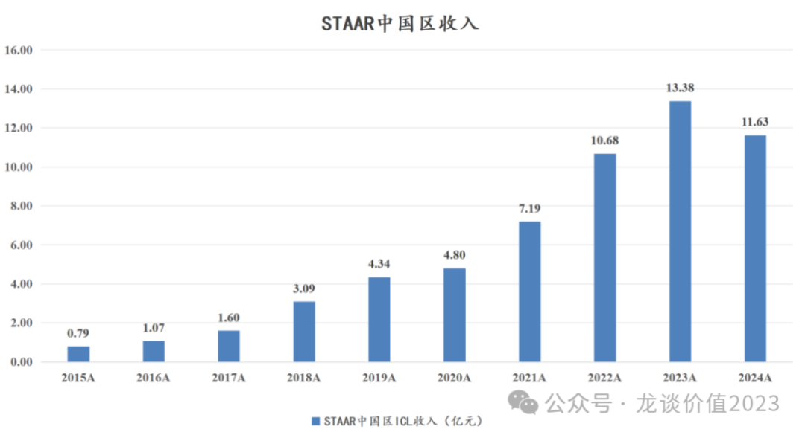
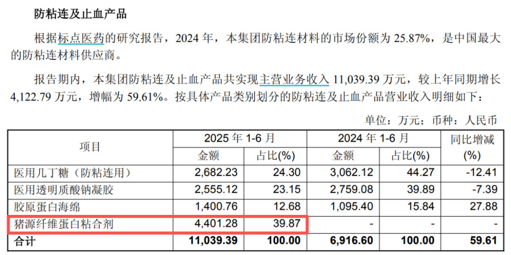

# 眼科龙头提前反转

大家好，我是龙哥。

我们在今年5月曾经分析过爱博医疗的年报情况，5月以来我们的基本判断都是爱博医疗的业绩应该会在三季度企稳，主要是去年的人工晶体国家集采是在二季度陆续开始执行，因此爱博医疗的二季度业绩在同比上必然还是存在较大的压力。

随着眼科耗材的3家主要公司在近期陆续披露了中报，前面的欧普康视、昊海生科的中报都比较差，也让我们对爱博医疗的中报又增添了一分担忧，但是直到昨晚爱博医疗正式发布，公司比我们预计的早了一个季度实现业绩企稳，再次展现了优秀超级成长股的韧性。

1、业绩情况

爱博医疗2025年上半年收入7.87亿元同比+14.73%，毛利率65.26%同比下降4.42%，归母净利润2.13亿元同比+2.53%。

Q2单季度营收4.30亿元同比+14.44%，时隔2个季度创下爱博医疗的单季度收入历史新高，二季度毛利率65.80%同比下降2.29%、环比提升1.20%。

毛利率同比来看受到高毛利的人工晶体集采降价、低毛利的隐形眼镜代工收入增速更高和收入占比提升的影响，还是有所下降，但环比相较一季度已经有所改善。

二季度的归母净利润1.21亿元同比+14.80%，扣非归母1.18亿元同比+18.01%，也均创下单季度的历史新高。

爱博医疗在2024Q4-2025Q2这三季度持续消化集采的影响，并提前走出集采冲击，可喜可贺。

2、业务分部

从具体的业务分部的表现，更能感受到爱博医疗的成长韧性，刚上市时候人工晶体收入占比达到90%以上，到2024年以来人工晶体的收入占比首次下到50%以下，OK镜的收入占比一度达到30%，又逐渐下降到15%，随后是隐形眼镜的收入占比达到30%，还有其他近视防控产品收入占比达到6%以上。爱博医疗通过持续的业务横向拓展、不断拓展能力圈，来降低单一业务的周期性影响，实现收入可持续的高增长。

①人工晶体

2025年上半年爱博医疗的人工晶体业务收入3.45亿元同比增长8.23%，收入占比为43.86%同比下降2.63%。

爱博上市这些年来，白内障手术的增速已经明显放缓，但爱博医疗的人工晶体业务一直维持较高的增长，哪怕是期间经历了两轮集采和疫情的反复波折，依然实现了20%的复合增长。

单看爱博医疗还不够明显，如果和昊海生科对比来看大家更能感受到爱博医疗这些年的行业地位的提升，2019年时爱博医疗的人工晶体收入只有昊海生科的40%出头，而到了2024年已经达到昊海生科的1.8倍，并且到2025年上半年这个差距进一步被放大到2.7倍，昊海生科的人工晶体在国采的冲击下25年上半年同比又下滑了30%，这个背景下爱博的增长就尤为不易。

从爱博医疗和昊海生科的财报来看，人工晶体的国采和进一步的降价，也在帮助行业实现产品升级，如昊海生科财报中表示集采后中端预装式非球面产品迅速替代普通球面及非球面产品，销量同比增长73.82%，销售占人工晶体产线收入比重从13.11%提升到29.36%。

对于爱博医疗而言，集采或许也是其进一步拉大优势的机会，研发端爱博医疗拥有最强的后续产品线，包括已经获批的双焦点人工晶体，以及在临床试验和注册阶段的三焦点人工晶体、扩景深人工晶体，在多焦点人工晶体领域，爱博为首的国产品牌才刚刚开始突破。

人工晶体业务中还有一块重要增量——爱博医疗的首款有晶体眼人工晶体（PR），在去年底正式获批后，今年上半年开始贡献收入，一季度PR晶体贡献的收入还很少，预计二季度有部分收入贡献，也一定程度上助力了人工晶体业务的企稳。

在今年8月初，爱尔康宣布收购全球主要的有晶体眼人工晶体供应商STAAR，总交易对价15亿美元，这是STAAR在经历股价腰斩再腰斩后的行业和基本面底部时的估值，仍有15亿美金的估值。STAAR有一半左右的收入来自中国市场，此前几乎是垄断这个市场，爱博医疗的产品给了市场一个新的选择，对于爱博来说则是新的成长曲线在放量的路上。

②OK镜

爱博医疗2025年上半年OK镜收入1.19亿元同比增长5.63%，另外还有其他近视防控产品（离焦镜等）收入0.47亿元同比增长15.59%。

OK镜行业的需求之低迷也是显而易见的，之前老有读者问眼科、齿科为什么跑不赢创新药，能不能做补涨。眼科、齿科这些消费医疗领域实际上更多跟随宏观经济和消费水平，与创新药出海的逻辑截然不同。行业低迷的情况下公司能做的事情也会比较有限，实际上爱博医疗上半年还能有同比中个位数增长也已经是行业比较好的表现，我们对比另外两家同行会更明显。

欧普康视2025年上半年收入8.71亿元同比-1.42%，其中OK镜收入3.56亿元同比-4.58%，这还是在2024年上半年OK镜收入就已经是同比下滑的基础上的表现。

OK镜行业的β有多艰难大家可以感受一下，在欧普康视近10年历史上，只有3个季度的总收入出现同比下滑，分别是2020Q1、2024Q4和2025Q2。从半年度来看，欧普康视的OK镜业务在2024H1/2024H2/2025H1连续3个半年度出现同比下滑。

昊海生科这边，公司上半年OK镜收入同比下滑10.83%，其中成熟产品（亨泰）表现较弱，新产品（迈尔康、童亨等）表现较好。

爱博医疗的OK镜业务也承受了较大的压力，但在2024年到2025年上半年都还勉强做到中高个位数增长，而总体来看更偏消费类的视光类产品的需求修复还要依靠大的消费环境的修复。

③隐形眼镜

爱博医疗的隐形眼镜业务目前主要是两个子公司——江苏天眼医药（持股87.78%）和福建优你康（持股51%）。

2025年上半年，爱博医疗的隐形眼镜业务收入2.36亿元同比增长29%，其中天眼医药收入1.12亿元同比+32%、净利率7.19%同比-0.84%，福建优你康收入0.71亿元+15%，净利率-9.54%同比+10.01%。2024年两家工厂合计实现了3.43亿元的收入和2000万元的利润，贡献了爱博医疗2024年隐形眼镜收入的81%。

目前隐形眼镜代工对于爱博医疗来说仍处于利润率较低的阶段，随着规模效应的提升，参照台湾隐形眼镜代工厂的20%左右的利润率水平，后续给爱博医疗贡献的利润水平也会有所提升。

3、业绩展望

目前来看，借助PR晶体的新产品铺货和放量，以及隐形眼镜的持续增长，爱博医疗已经初步走出最艰难的时刻，迈入新的成长期，公司年报时对全年20%的增长指引目前来看达成的概率也大大提升，如按照全年收入利润20%的增长推算，目前的估值大概在33倍PE。

......

最后再多提一句昊海生科，公司的医美、眼科、骨科等业务板块在上半年均表现较差，整份中报为数不多的亮点是这个猪源纤维蛋白粘合剂，这是一种从猪血中提取的蛋白质制成的新型生物材料，用于手术中控制出血不满意的外科止血，24年12月被纳入上海市生物医药“新优器械”产品目录，从而可以加快入院和进医保。25年上半年这个新品卖了4400万，对于一个新器械来说的确算是不错的表现。

跟踪昊海生科也多年了，业务发展说是差强人意都是极其给公司面子了，但公司不论业务发展的好坏，财报里都能对此如实、正常披露，包括爱博医疗的信息披露也一直是非常清晰明了，而很多公司不敢面对投资人，业务做的不好就不披露或者遮遮掩掩。希望其他上市公司能学着点，信息披露规范点、诚实点，别老藏着掖着的让投资人摸不着头脑。

......

8月又要结束了，又到了月底开一次赞赏的时间，还是那句话，赞赏无所谓多少，能看到大家一份支持和认可的心意就好，大伙的认可也是龙哥分享内容的动力。这两天市场回调幅度不小，大伙看着意思意思吧......

风险提示：本文仅讨论行业/公司经营情况，投资需综合考虑公司经营、估值、管理层等多方面因素，建议读者审慎参考，本文不作为投资依据，不建议大家根据本文做出投资计划。

<!-- wxmp-comments-begin -->

---

## 留言（21 条，含回复共 45 条）

- **JMTerry** 👍7 · 2025-08-28 11:53
  没想到这么快反转，老股东老怀安慰[捂脸]
  - ↳ **作者** · 2025-08-30 11:42
    请问龙哥以及各位大哥，看了爱博的机构调研问答，公司尽力争取今年业绩正增长！是不是预期太差了？龙哥说反转了，是不是这个问答对基本面反转没影响。能不能给小弟解惑一下，万分感谢！
  - ↳ **作者** · 2025-08-30 12:48
    行业β还是很弱，这从爱博以外的多家公司的表现，包括下游眼科服务的都能看得出来
- **Bryan** 👍4 · 2025-08-28 11:18
  又有点冰火两重天，8月份A股账户没有重点布局AI和芯片也涨的一般般，H布局的wAI mAI账户都绿了，不过还是逐步卖A买H吧，做不到买股票不看估值，但业绩的滞后性必然会导致买套卖飞。眼科龙头我今早开票追进去了，到底底部起来也不算多[破涕为笑]
- **老K** 👍2 · 2025-08-28 11:16
  请问是否意味着眼科医院也开始反转
  - ↳ **作者** · 2025-08-28 11:28
    二季度眼科医院的表现并不好，核心还是爱博的增长来自隐形眼镜、PR晶体，都属于爱博自己的α而不是行业β。
- **CHY** 👍2 · 2025-08-28 11:26
  老师好，爱博现在是不是黎明前的黑暗了，作为持有爱博4年的粉丝，现在浮亏20%左右，不太担心，因为选股时候就已经看到了公司优秀的管理，行业巨大的空间，和出色的技术实力。但是现在33倍的估值不知道该不该加仓。
  - ↳ **作者** · 2025-08-28 11:28
    明年有突破20%的可能吗？以及白内障手术增速下降也是受了宏观消费影响吗？是否可以理解为虽然爱博后续产品线依然能打，但是大涨还是需要经济回暖？收入预期改善？
  - ↳ **作者** · 2025-08-28 11:31
    白内障手术增速下降是行业渗透率比较高了，正常的行业增速下降。
- **老加仓** 👍2 · 2025-08-28 11:32
  超研股份的超声波器械市销率不错，海外占大头了
  - ↳ **作者** · 2025-08-28 11:33
    可以对比下开立的收入体量和市值，以及超研股份的收入体量和市值。次新股的估值就很难搞。
  - ↳ **作者** · 2025-08-28 11:38
    嗯，器械估计还是难，国内市场基本没戏，就看海外增量了。创新药也一样，没有BD，基本就是营收每年萎缩
- **胡琦宇** 👍2 · 2025-08-28 11:46
  龙哥，微创脑科学中报海外高增，但占比还太小。国内集采还有部分影响。想听听您对行业和公司后期发展的点评。
  - ↳ **作者** · 2025-08-28 11:49
    好赛道，好公司，可惜是微创系，微创脑科学的底子蛮好的，但一脉相承了微创系的低效率，这么多年产品研发效率偏低，慢慢被归创通桥等其他国产公司追赶。
- **小口合** 👍2 · 2025-08-28 11:58
  龙哥，康诺亚最近股价怎么不太行？公司有什么利空吗？[抱拳]
  - ↳ **作者** · 2025-08-28 12:07
    港股创新药不都在回调嘛，只是康诺亚昨天跌的尤其多一点。
- **Steven Livermore** 👍1 · 2025-08-28 11:19
  我在昊海生科这艘船上三四年了，一直等形式反转呢，按龙哥的这个对比我都想把一部分平移到更优秀的爱博上边[破涕为笑][破涕为笑][破涕为笑] ，医美啥的算消费，很受经济大环境影响，等经济环境改善了应该是不会被落下的。
  - ↳ **作者** · 2025-08-28 11:27
    在昊海生科上蹲好几年的确实不多见，这公司就是能看到产业风口，但是业务运营的确实比较差强人意，眼科、医美大部分时间都在miss。不过爱博、昊海、欧普这些，爱博算是有一定的韧性和α的，估值业绩共振的大行情还是要依赖β的。
- **Jimmy** 👍1 · 2025-08-28 11:22
  龙大，迈瑞的中报应该还是在预期内的吧，这两天走势是有抢跑的么
  - ↳ **作者** · 2025-08-28 11:24
    肯定是有抢跑的，公司一直说Q3业绩同比转正嘛，中报出来怕大家太担心还专门发了个三季度经营情况的公告安抚大家，公司也是尽力了。
- **执着如呆** 👍1 · 2025-08-28 11:35
  好文，问龙大欧普康视建线下视光中心的逻辑是什么？
  - ↳ **作者** · 2025-08-28 11:38
    这不好多年的事了吗，就是他想向下游延伸呗，只卖OK镜的话一片才卖五六百块，到下游做服务一副可以卖大几千。
- **鲲鹏** 👍1 · 2025-08-28 12:03
  龙大，买了器械设备东富龙，亏惨了，业绩扭转估计要到今年四季度了，帮忙分析一下，谢谢
  - ↳ **作者** · 2025-08-28 12:08
    东富龙并不是大家认为的医疗器械，它是制药产业链的公司，跟随的是药品行业的β。
  - ↳ **作者** · 2025-08-28 12:43
    东富龙是做生产药品的设备，未来2年的业绩都不好。
- **蔡斌** 👍1 · 2025-08-28 12:05
  龙大如何解读信达的中报，是算在预期内还超预期？
  - ↳ **作者** · 2025-08-28 12:09
    收入符合预期，之前公告过产品收入了，利润端超预期，其中有BD的贡献。
- **Jimmy** 👍1 · 2025-08-28 17:16
  泰格医药上半年项目数下降得有点多啊，虽然公司说有一部分是主动终止的
  - ↳ **作者** · 2025-08-28 22:05
    在行业价格战较为严峻的环境下，公司上半年单个临床项目平均贡献收入提升了10%左右到227万元，说明公司的确是剔除了一部分不太创造收入的老旧项目，这个对公司的影响应该相对有限。上半年泰格总体的毛利下滑还是比预计的要大一些，但就财报内容看下来和基于对行业β的判断，应该也是在企稳的边缘了。另外泰格医药还有140亿的创新药股权和基金的投资，在创新药牛市里相当于加杠杆。
- **嘀嗒** · 2025-08-28 11:20
  龙哥，威高这是要又跌回去了。
  - ↳ **作者** · 2025-08-28 11:25
    知道中报业绩不太好，实际昨晚发的中报比预期的还要更差一点，美国爱琅亏损大几千万拖累利润，国内这边也还有点品种集采降价的影响在最后出清中。
- **天野源** · 2025-08-28 11:29
  龙哥，昨晚的诺思格财报您觉得怎么样？新增订单情况怎么样，符合预期吗？
  - ↳ **作者** · 2025-08-28 11:32
    马马虎虎吧，一直说CRO的中报肯定是不会好的，中报之后看市场回调情况可以找买点，但下一波我觉得还是要往龙头集中。
- **盘中人__** · 2025-08-28 11:38
  龙哥，兴齐眼药怎么样，业绩挺不错
  - ↳ **作者** · 2025-08-28 11:40
    是的，兴齐一开始去年预期过高，然后实际放量没那么快，而且行业又混乱，今年这两个季度还是在起量，尤其是费用增加不多的情况下，利润率提升就很快，q2单季度主要就是利润端超预期。
- **涱泩🐳** · 2025-08-28 11:41
  龙大，联影看看会不会跟迈瑞一样好转？
  - ↳ **作者** · 2025-08-28 11:44
    联影q2应该还可以，会比迈瑞早一点企稳，并且联影的国际市场也在快速增长，贡献重要增量。
- **君莫笑** · 2025-08-28 12:25
  龙哥，请教下医脉通：
  （1）这份中报是否低于您的预期呢？
  （2）不知道这个理解对不对，目前这个发展阶段，营收增速和精准营销及企业解决方案增速是否才是最重要的指标，利润增速是次要的，这样理解是否有误？
  （3）是否由于国情不同，医脉通想要在国内确立3M那样在日本的地位，有点难以实现？
  谢谢龙哥。
  - ↳ **作者** · 2025-08-28 17:31
    中报符合预期吧，利润增速也并不差，表观的利润增速低一点是因为利息收入的扰动。他这种商业模式，只要有收入增速，肯定有利润的，除了固定人员成本之外的费用很少。
    医脉通想要像3M的行业地位确实比较难。
- **牛魔王** · 2025-08-28 12:38
  感谢龙大，能否谈谈诺诚健华为啥最近回调这么厉害吗？
  - ↳ **作者** · 2025-08-28 21:14
    之前有些传闻大额BD要落地了，实际上公司没给过任何预期，都是大家不知道从哪里打听的消息，然后股价炒上去再跌下来。
- **夜雨海風²⁰²⁶** · 2025-08-28 15:52
  wind里边看到同样的文章
  - ↳ **作者** · 2025-08-28 17:28
    就是wind转发的我的文章啊
- **rayman** · 2025-08-31 00:12
  龙哥，爱博的投资者记录出来了，短期业绩没戏了
  - ↳ **作者** · 2025-08-31 00:35
    公司说了行业的艰难，Q2行业β差的离谱，爱博不也一样放业绩，还不是看公司自己经营情况。

<!-- wxmp-comments-end -->
