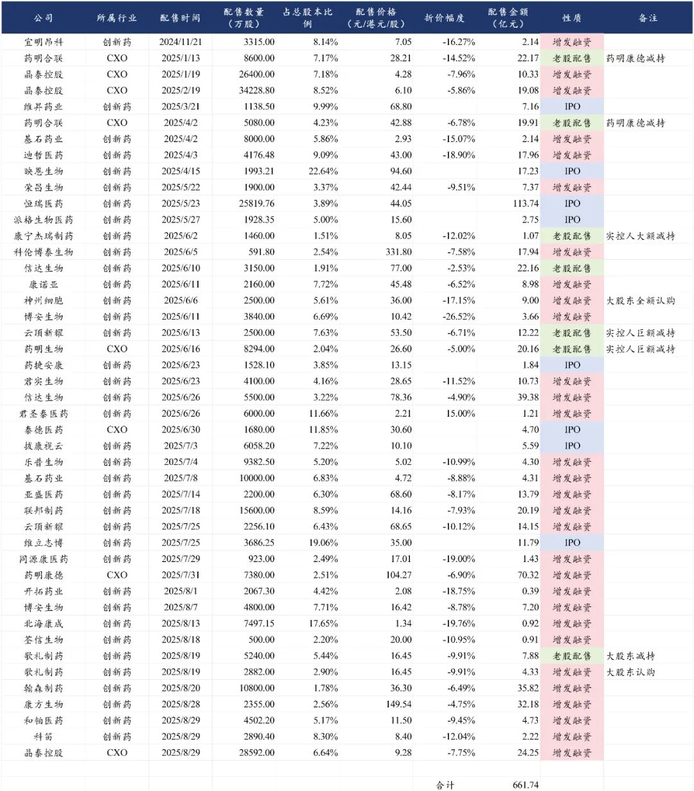
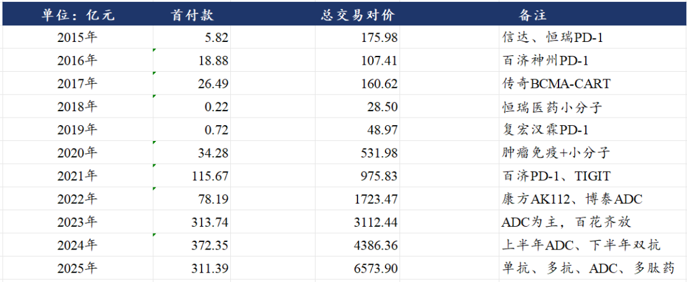
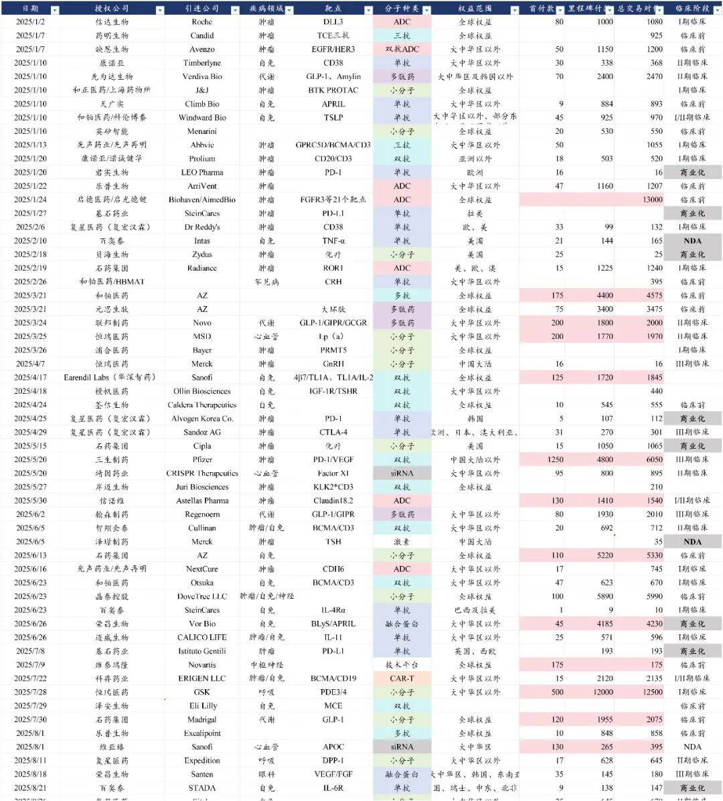

# 2025创新药融资之王

2025年以来，国内创新药+CXO公司自二级市场融资合计660亿元，BD首付款合计311亿元。

二级市场融资金额最高的是恒瑞医药，港股二次上市融资113.7亿元，截至2025年中报在手现金已经达到50亿美元。

- 药明康德增发融资70.3亿元。
- 信达生物增发融资39.4亿元，老股配售减持22.2亿元。
- 晶泰控股3次增发合计融资53.7亿元。
- 药明合联老股配售（药明康德）减持42.1亿元。
- 翰森制药增发融资35.8亿元。
- 康方生物增发融资32.2亿元。
- 联邦制药增发融资20.2亿元。
- 迪哲医药增发融资18.0亿元。
- 科伦博泰生物增发融资17.9亿元。

创新药BD授权首付款最高的是三生制药的PD-1/VEGF双抗授权辉瑞，获得12.5亿美元首付款，总交易对价60.5亿美元。

第二高的是恒瑞医药授权PDE3/4及另外11个分子的产品组合给GSK，首付款5亿美元，总交易对价125亿美元。另外恒瑞医药还将Lp（a）授权给MSD，获得2亿美元首付款，总交易对价19.7亿美元。

- 联邦制药将GLP-1/GIPR/GCGR三靶点减重药授权诺和诺德，获得2亿美元首付款，总交易对价20亿美元。
- 和铂医药授权阿斯利康多抗组合，获得1.75亿美元首付款，总交易对价45.75亿美元。
- 石药集团授权小分子AI制药组合，获得1.1亿美元首付款，总交易对价53.3亿美元。另外授权小分子GLP-1给Madrigal，获得1.2亿美元首付款，总交易对价20.75亿美元。

风险提示：本文仅讨论行业/公司经营情况，投资需综合考虑公司经营、估值、管理层等多方面因素，建议读者审慎参考，本文不作为投资依据，不建议大家根据本文做出投资计划。

<!-- wxmp-comments-begin -->

---

## 留言（12 条，含回复共 25 条）

- **PBalu 一颗尘埃** 👍4 · 2025-08-30 23:33
  直觉是这些创新药企业都在圈钱，不给股东回报，难道创新药还有更难的日子过？
  - ↳ **作者** · 2025-08-30 23:35
    创业公司怎么做股东回报。
  - ↳ **作者** · 2025-08-31 00:33
    你投了好公司赚到钱不算回报？
- **雨泽** 👍3 · 2025-08-30 23:08
  龙哥晚上好，时代天使中报这么好，怎么都不怎么涨呢，市值才一百二十多亿是因为资金不看好吗？
  - ↳ **作者** · 2025-08-30 23:27
    从他发了中报预报以来，从不到60块涨到72块多，在大家预期下半年利润还是有压力的情况下股价还是涨了20%多了，还可以吧。
- **建旺** 👍3 · 2025-08-30 23:30
  总交易对价那么多金额，未来肯定会付吗
  - ↳ **作者** · 2025-08-30 23:34
    当然不肯定，首付款是实实在在拿到手的钱，后面的里程碑付款得是药物临床推进和商业化才能拿到得，不同阶段的创新药成功率有差别，比如I期临床的药物最终成功的概率大概只有10%，所以里程碑付款绝大多数是拿不到的。
- **BO** 👍2 · 2025-08-31 00:29
  龙哥爱博医疗虽然2季度超预期 但是什么时候才能从回高增速呢 如果只是每年十几的增速 对于三十多四十的pe 感觉也是挺贵的
  - ↳ **作者** · 2025-08-31 00:37
    眼科现在这种行业β之下能有十几二十的增速已经是非常强的α了，要回到三五十的增长，那得多方面的因素，行业β消费环境的显著修复，加上新业务的超预期
- **BO** 👍1 · 2025-08-30 23:07
  龙哥 普心寺和诺斯哥财报如何呀
  - ↳ **作者** · 2025-08-30 23:24
    普蕊斯收入符合预期，利润超预期。诺思格符合预期。
- **低碳哥** 👍1 · 2025-08-30 23:08
  龙大，心脉医疗自中报发布以来，连跌几天，不认可吗？😓
  - ↳ **作者** · 2025-08-30 23:26
    一方面是整个医药行业周三周四都在回调，另一方面包括心脉在内的器械板块，即便此前有预期，但中报确实普遍是偏弱的，所以肯定谈不上认可。
- **西城老舅** 👍1 · 2025-08-30 23:22
  晶泰控股那个58.9亿美元里程碑靠谱吗？
  - ↳ **作者** · 2025-08-30 23:29
    晶泰控股那个BD和石药集团的那个超50亿美金的BD，都是CRO的授权模式，或者说是利用AI技术平台进行定制化分子开发，他一个总包可能包含十几个分子，然后每个分子有一个里程碑，加在一起是50多亿美金，这种合作模式一般其中能成功一两个分子都不容易了。
- **肥锋  家诚哥** 👍1 · 2025-08-30 23:41
  龙哥晚上好，CXO那边还是大哥稳啊，泰格出报告，感觉国内这部分可能要到第四季度才有望看到好转。
  - ↳ **作者** · 2025-08-30 23:48
    我们一直说，CDMO和CRO处于不同的产业逻辑和周期阶段呀
- **王涛** 👍1 · 2025-08-30 23:51
  龙哥 医药连锁怎么看？反内卷，药店关了不少，应该利好龙头公司。这几年跌跌不休的，有机会吗？
  - ↳ **作者** · 2025-08-30 23:55
    药店行业的关店潮其实在反内卷之前就开始了，是行业过度竞争、总量没有增长后的出清阶段，药店行业总体可能要关掉三分之一之后可能会趋于稳定，但即便稳定下来，行业β也不会很强，还要持续受到互联网公司的线上化影响，主要看个别运营能力非常优秀的龙头比如益丰。
- **Berry** 👍1 · 2025-08-30 23:53
  龙哥，能帮忙看下阳光诺和的财报吗？
  - ↳ **作者** · 2025-08-30 23:56
    这公司没怎么看，不好意思[抱拳]
- **Nautilus** · 2025-08-30 23:25
  龙哥 泰格中报咋看
  - ↳ **作者** · 2025-08-30 23:33
    上半年泰格总体的毛利下滑还是比预计的要大一些，但就财报内容看下来和基于对行业β的判断，应该也是在企稳的边缘了。项目数下降比较多，在行业价格战较为严峻的环境下，公司上半年单个临床项目平均贡献收入提升了10%左右到227万元，说明公司的确是剔除了一部分不太创造收入的老旧项目，这个对公司的影响应该相对有限。另外泰格医药还有140亿的创新药股权和基金的投资，在创新药牛市里相当于加杠杆。
- **口天吴** · 2025-08-31 00:07
  通策医疗的寒冬过去了吗龙哥
  - ↳ **作者** · 2025-08-31 00:36
    齿科目前看并没有

<!-- wxmp-comments-end -->
