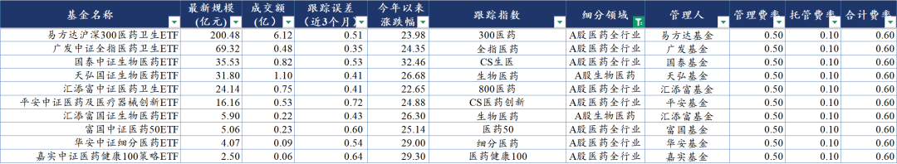
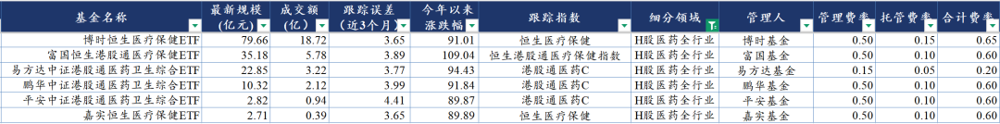
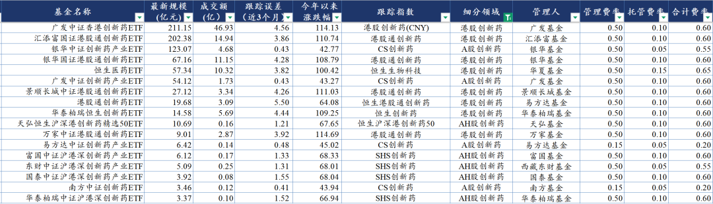
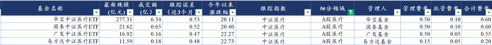
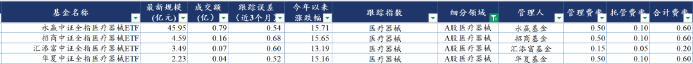
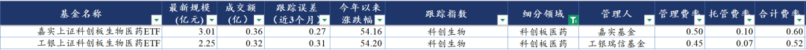
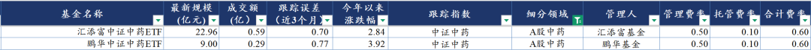

# 最全ETF梳理

大家好，我是龙哥。

2025年中报季结束，后续还会陆续给大家梳理几个细分行业的业绩情况，今天来结合各行业的业绩趋势再帮大家梳理一下医药行业ETF的情况。

我们统计了全行业69个医药行业的ETF基金，截至最新的总规模是1832亿元（今年2月26日给大家梳理医药行业ETF时，61个医药ETF总规模1355亿），当时规模最大的中证医疗ETF和沪深300医药ETF，份额都逆势下降，与之相应的是港股创新药ETF规模暴增。

我们看这些ETF的数据可以在wind数据库直接导出数据，大部分投资人可能没有wind的数据库，或者是梳理不到那么全的数据，这里可以用红色火箭的小程序，比如指数浏览器这里就可以直接看到所有的医药行业ETF，包括规模、涨跌幅、成交量、费率、溢价率等等指标。

这小程序之前也有简单用过，也在以前的文章有提过，最近发现跟踪ETF的时候用起来很舒服，基本上大家想要的信息都可以很全面和清晰的呈现。

今天我们还是分行业梳理一下最新的医药ETF，下文中合计给大家梳理的45个医药行业ETF，相较总体的69个，剔除了规模2亿以下的、跟踪误差超过5%的，规模2亿以下的可能流动性不足，而跟踪误差超过5%的......作为被动基金在3个月内能做到和指数偏离5%以上也挺离谱的，有3个ETF因此被剔除，就不点名了。

1、A股医药全行业ETF

这10个A股医药全行业ETF总规模395亿，跟踪指数和持仓略有不同，费率都是0.60%，今年以来的涨幅在22%-32%之间，今年以来申万医药的涨幅大概在27%-28%，所以指数基金这个涨幅基本就是和A股医药行业指数差不多，这个涨幅和H股医药的涨幅相去甚远。

今年来很多读者抱怨买A股医药ETF涨幅不大，甚至很多还没从熊市被套的状态中走出来，我们过去3年基本就清一色的讲港股医药、尤其是港股创新药，在熊市里大家可能感受不明显，涨跌幅都拉不开差距，但真到价值兑现的时候大家才会发现差距有多大。

A股医药全行业ETF的持仓基本还是老样子，恒瑞医药、药明康德、迈瑞医疗、联影医疗、长春高新、片仔癀、爱尔眼科、科伦药业、上海莱士、泰格医药、云南白药等A股大市值的公司，可以看到创新药在里面的比重并不算高，像医疗服务、血制品、中药这些的权重股在今年表现都不佳，这也和各自板块的产业逻辑有比较大的关系。

可以看到这其中表现最好的一个是生物医药ETF，权重股中包括百济神州，百济神州A股今年大象起舞、也涨了有一倍，市值来到5000亿，总市值仅次于恒瑞医药H股。

2、H股医药全行业ETF

6个H股医药全行业ETF总规模154亿，规模上相较年初还有缩减，资金更集中到港股创新药ETF去了。6个ETF今年来的涨幅在90%-109%之间。

持仓方面，除了跟踪恒生港股通医疗保健指数的ETF的持仓略有不同，其他5个ETF的持仓高度一致，前十大重仓股是信达生物、百济神州、药明生物、石药集团、康方生物、中国生物制药、京东健康、三生制药、翰森制药、阿里健康。前者的区别主要是前十大权重股没有互联网医疗，创新药含量更高，因此今年来的涨幅也是最大的一个。

相比年初时候的持仓变化主要就是国药控股、巨子生物被踢出去前十大，医药流通更偏红利，在今年表现着实一般。

3、创新药ETF

创新药板块毫无疑问是今年的绝对主线，不仅是医药行业最强子领域，从全市场来看也是表现极其靠前的板块。我们刚刚梳理完创新药全行业的中报，在下一篇文章会给大家聊聊今年创新药行业的中报表现。

17个A股和港股创新药ETF合计的规模达到825亿元，年初的时候还只有300多亿，当然那时候的今年来涨幅还都不到20%，而现在我们看到已经有多个涨幅超过100%的ETF，具体来看，港股创新药ETF涨幅普遍是100%，A股创新药ETF的涨幅在40%多，而A+H沪港深创新药ETF的涨幅则是在68%左右......

这里我们再具体看A股、港股、AH股创新药ETF的情况：

①港股创新药ETF

8个产品的规模超过600亿，占了创新药ETF的大头，今年来涨幅基本都在100%以上，除了一个3月底新成立的ETF的涨幅少一些。

持仓方面，权重股基本就是biopharma里的信达生物、百济神州、康方生物、再鼎医药、亚盛医药、云顶新耀，传统pharma里的中国生物制药、石药集团、翰森制药、三生制药，以及CXO里的药明生物、药明康德。

这里我们讲的持仓是单个季度末的静态的持仓，上文提到的红色火箭里还有一个看持仓动态变化的功能，非常贴心：

②A股创新药ETF

4个A股创新药ETF的规模合计187亿，其中银华和广发的两个ETF的费率分别是0.55%和0.60%，规模分别123亿和54亿，而易方达和南方的两个ETF的费率都只有0.20%，反而没什么规模，分别只有6.4亿和3.5亿。

持仓方面，前十大权重分别是药明康德、恒瑞医药、科伦药业、华东医药、长春高新、复星医药、泰格医药、信立泰、百济神州、通化金马。除了最后的通化金马比较扎眼，其他的基本已经是尽力覆盖了A股的创新转型的传统pharma和龙头CXO公司。

③AH股创新药

5个AH股创新药ETF的规模合计是29亿，今年来的涨幅在67%-68%，费率在0.55%-0.60%。ETF作为工具，大家都比较喜欢比较极致的配置方式，比如要么选港股创新药、要么选A股创新药，这种AH都有的均衡型的反而不受待见，但现实的投资，均衡型的是适合大部分投资人的。

持仓方面，前十大重仓股是药明康德、恒瑞医药、百济神州、信达生物、药明生物、康方生物、中国生物制药、石药集团、科伦药业、华东医药等、三生制药等。

4、A股医疗ETF

说实话我不太理解这个A股的中证医疗ETF能长期霸占医药行业ETF的规模之首，A股医疗ETF主要是医疗服务、医疗器械、CXO，在产业逻辑上是远弱于创新药板块的，结果这些年始终能有200亿左右的体量，这4个ETF也基本就是华宝的一支独大，另外易方达的这个费率则是只有0.2%。

持仓方面，药明康德、迈瑞医疗、联影医疗、爱尔眼科、泰格医药、爱美客、惠泰医疗、新产业、康龙化成、鱼跃医疗，和年初时候完全一致，就是权重略有差别，药明康德升到首位。

从25年的中报行业表现来看，CDMO毫无疑问是已经在基本面上走出底部并且高速增长，CRO板块还在底部挣扎，但从毛利率、订单等方面来看也已经开始有改善的趋势，而医院板块、特别是眼科等消费医疗，在二季度行业表现是进一步恶化。

5、医疗器械ETF

医疗器械行业我们此前有两篇文章单独介绍了一下目前行业的情况，行业总体来说还是比较艰难的，行业内部的分化比较大，像我们此前讲到，高值耗材是出于政策出清的阶段，实际中报业绩来看上半年高值耗材板块收入增长4.8%、利润增长0.3%，其中二季度收入同比加速增长、利润端转正，是医疗器械表现最好的子领域。而医疗设备、低值耗材、体外诊断普遍表现较差，尤其是体外诊断以及ICL的表现差的惊人。

也因此，由于板块内部的分化差异，医疗器械ETF今年来的涨幅基本是只有15%左右，前十大重仓股包括迈瑞医疗、联影医疗、爱美客、惠泰医疗、新产业、鱼跃医疗、乐普医疗、山东药玻、华大基因、九安医疗等，这其中除了联影医疗是设备招标反转+出海高增长、惠泰/乐普是高耗龙头外，其他大多在今年也表现很差。

6、科创板医药ETF

科创板医药ETF今年关注度并不高，规模很小，两个产品合计才5个多亿，但实际上的今年来涨幅却是所有A股医药ETF里表现最好的，涨幅均超过50%，科创板医药哪怕很多公司估值偏高，但总体代表的是19年以来上市的最优秀的一批创新药械企业，在成长性和创新属性上还是要明显领先于大部分传统医药公司的。

持仓方面包括联影医疗、百济神州、惠泰医疗、百利天恒、艾力斯、泽璟制药、君实生物、博瑞医药、华大智造、益方生物，创新药含量较高。

7、中药ETF

上一轮医药大熊市里，中药得益于政策面的支持也曾火爆了一波，诞生了多个中药ETF，也是今年来表现最差的医药ETF，今年规模倒还是挺坚挺。而我们知道从24年下半年开始，IVD和中药实际上是受到政策面负面冲击最大的板块，大家如果去看部分院内中药的季度业绩趋势，感受会更明显。

......

以上就是今天梳理的45个医药行业ETF的情况，还是老规矩，所有曾经赞赏过龙哥任意文章、任意金额的读者，如果想要以上数据，可留言或私信留下邮箱，龙哥会在空闲时候集中发送。

风险提示：本文仅讨论行业/公司经营情况，投资需综合考虑公司经营、估值、管理层等多方面因素，建议读者审慎参考，本文不作为投资依据，不建议大家根据本文做出投资计划。

<!-- wxmp-comments-begin -->

---

## 留言（21 条，含回复共 43 条）

- **晨光熹微** 👍4 · 2025-09-03 14:20
  龙哥，药明康德老是玩弄股权转让，最后会不会将药明康德弄成空壳。
  - ↳ **作者** · 2025-09-03 14:22
    如果分拆合全药业独立上市的话就有点麻烦
- **yaya** 👍3 · 2025-09-03 14:13
  龙哥出品必属精品[强][强][强]
  - ↳ **作者** · 2025-09-03 14:13
    [抱拳][抱拳]
- **执着如呆** 👍3 · 2025-09-03 14:13
  医疗器械汇添富的管理费最低
  - ↳ **作者** · 2025-09-03 14:14
    在跟踪指数和偏离差不多的情况下，大家自行选择费率低的呗
- **Andybroker** 👍3 · 2025-09-03 14:18
  恒瑞医药和百济神州长得头晕目眩，华特达因却没怎么动[捂脸]
  - ↳ **作者** · 2025-09-03 14:21
    恒瑞和百济是创新药龙头，华特达因是什么逻辑？儿童药的逻辑本身就受到人口年龄结构的负面因素影响。
- **D.** 👍2 · 2025-09-03 14:28
  龙哥，长城军工怎么说？
  - ↳ **作者** · 2025-09-03 14:28
    超纲了，不懂军工
- **邝伟斌 (子谋)** 👍2 · 2025-09-03 15:22
  之前看的龙大分享的那个520510，为什么不在这个榜单里的？
  - ↳ **作者** · 2025-09-03 19:22
    那个跟踪的指数比较特殊，没统计到，大家知道有这个就行了[破涕为笑]
- **Mr.姚** 👍1 · 2025-09-03 14:10
  请教一下龙哥，三生制药的年报公布后，贝莱德基金也买入了，是否预示着三生制药会像康方一样，您对三生的看法是怎样的？
  - ↳ **作者** · 2025-09-03 14:13
    三生今年涨了4倍，市场已经给了答案
- **刘虎** 👍1 · 2025-09-03 14:16
  龙哥，三友医疗中报有惊喜吗？
  对比春立医疗，营收净利润差很多，但市值接近，最近股价走势很强劲，帮忙解惑，谢谢
  - ↳ **作者** · 2025-09-03 14:20
    三友医疗的估值里包括了一部分春风化雨机器人的估值，这个是潜在的具有全球顶级竞争力的骨科手术机器人，相比传统骨科手术机器人，不仅用于导航和打螺钉，可以更多参与到手术中，在骨科领域有可能是类似达芬奇手术机器人的地位的产品。只不过距离商业化还需要2年左右。
- **Dengbiao** 👍1 · 2025-09-03 14:22
  我的两个医药etf和医疗etf垃圾的要死，现在还套十几个点
  - ↳ **作者** · 2025-09-03 14:23
    你看，这就是投资医药但完全选错方向的结果
- **叶** 👍1 · 2025-09-03 14:30
  请教龙哥  为什么港股百济跟a股涨幅差距这么大    以后会慢慢拉平么
  - ↳ **作者** · 2025-09-03 14:39
    流通盘差距比较大，A股百济的流通盘很小，加上A股创新药优质标的少，就容易被拉起来。同样的H股的恒瑞也是流通盘非常少，估值被拉到比A股还溢价很多。
- **阿宝** 👍1 · 2025-09-03 14:46
  抬轿的过程etf感觉不如主动基金，感谢龙哥在前几年底部提示的永赢创新药，涨的头晕目眩，回撤控制也挺好的
  - ↳ **作者** · 2025-09-03 14:50
    现在主动基金也被动化
- **Ace凡** 👍1 · 2025-09-03 15:12
  龙哥 你说的太复杂了，直接说哪个ETF还可以上车[旺柴]
  - ↳ **作者** · 2025-09-03 19:22
    这篇文章的意义在于，哪怕有一天龙哥不写公众号了，大家依然知道投医药有哪些etf可以选
- **十二点睡先生** 👍1 · 2025-09-03 15:33
  低位的时候我敢买，从23年24年底陆陆续续加到第一重仓，到今天盈利87.39%，可能跑不赢很多龙哥的粉丝，但也心满意足
  
  现在最大的问题：不知道该什么时候卖出，我是2020年入市的，至今没经历过一轮牛熊，不知道龙哥在这方面有什么建议吗？
  - ↳ **作者** · 2025-09-03 19:16
    买卖这个事我给不了太多建议，说起来都不难，做起来要克服贪婪和恐惧不容易，比如有些人是指数破20日线就兑现，有些人是指数破60日线就兑现。不可能把盈利全部带走，比如你现在有87%的盈利，假如指数破位的时候比如还有60%的盈利那你舍不舍得卖？
- **那年十一月** 👍1 · 2025-09-03 15:56
  龙哥，分析一下泰格医药[鼓掌][鼓掌][鼓掌]
  - ↳ **作者** · 2025-09-03 19:12
    泰格在上周文章评论区有回复过了哈
- **XIN** 👍1 · 2025-09-03 16:22
  龙哥有关注过普洛药业吗，之前看到有个榜单CDMO排第4，它有没有什么看点
  - ↳ **作者** · 2025-09-03 19:09
    这种排名没啥用吧，就收入体量和能力来说普洛都排不上国内第四
  - ↳ **作者** · 2025-09-05 19:33
    兽药上还算有点
- **尘缘** · 2025-09-03 15:08
  迈瑞中报太糟糕了，尽管有预期，整个器械行业业绩也真不好，但是龙头比行业均值还差啊。管理层透露三季度重回增长，这个预期有多大？是不是就增长0.xx％这种？，龙哥，你怎么看？
  - ↳ **作者** · 2025-09-03 19:24
    其实就是行业其他公司先炸了，迈瑞前面一直硬挺着，直到迈瑞也挺不住就也炸了。q3既然公司反复强调了，就大概率是能转正，但你说转正到多少，我确实拿不住，主要是现在国内IVD行业这块太差了。
- **何** · 2025-09-03 15:30
  龙哥，分析一下艾力斯吧，估值不贵吧！还有潜力吗
  - ↳ **作者** · 2025-09-03 19:17
    艾力斯肯定是这两年国内商业化大品种做的最好的公司，没有之一的那种，伏美替尼今年要突破50亿了。不过创新药公司从来都不是看PE决定估值高低，创新药的估值方法我们以前也分享过。
- **海纳百川** · 2025-09-03 16:26
  君实生物怎么就不涨呢？
  - ↳ **作者** · 2025-09-03 19:09
    今年以来涨了180%啊......
- **Doctor  韦** · 2025-09-03 17:14
  谢谢龙哥，收藏转发哈。
  - ↳ **作者** · 2025-09-03 19:11
    [抱拳][抱拳]
- **鲲鹏** · 2025-09-03 17:32
  再鼎医药好像没啥创新，公司股价感觉反应了未来研发成果失败的预期，一直不涨
  - ↳ **作者** · 2025-09-03 19:10
    不是没啥创新，公司选品眼光很强的，只是商业化不及预期
- **DD** · 2025-09-03 18:29
  龙哥，健凯科技怎么看，据说大单品对标康方
  - ↳ **作者** · 2025-09-03 19:11
    牛市嘛，有梦想谁都了不起

<!-- wxmp-comments-end -->
