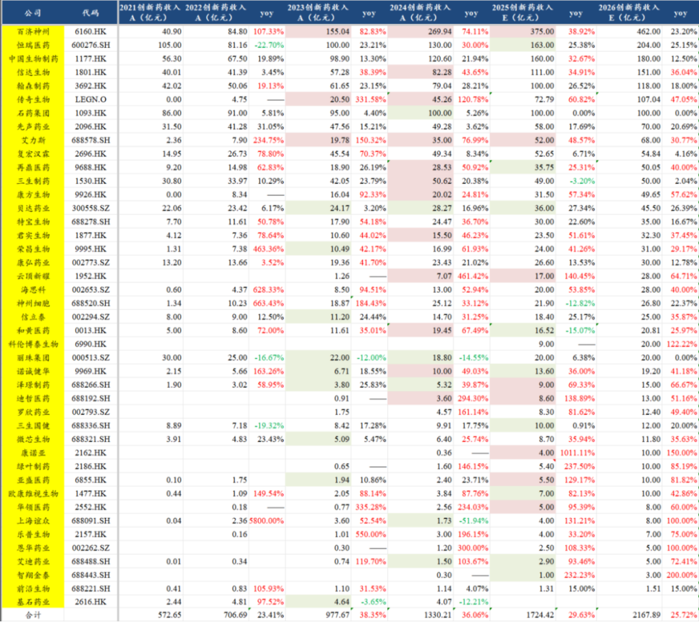
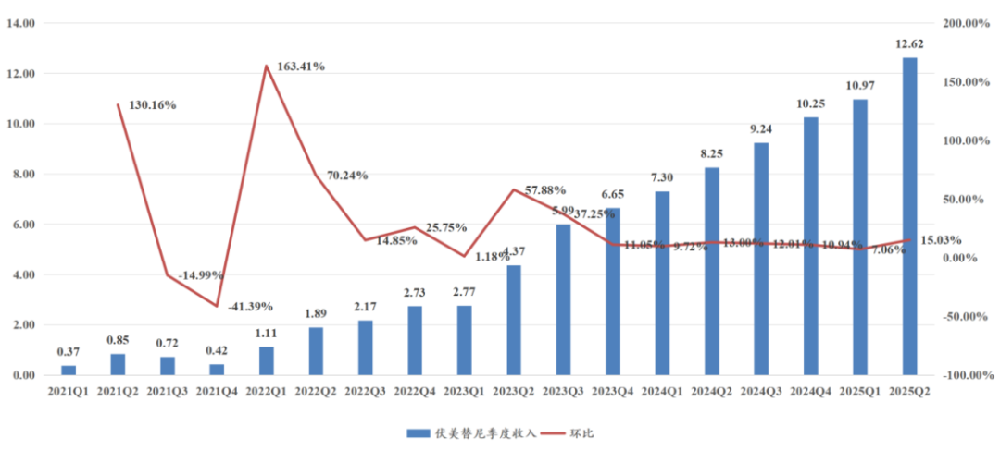
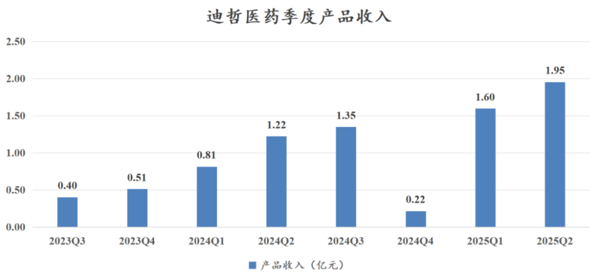
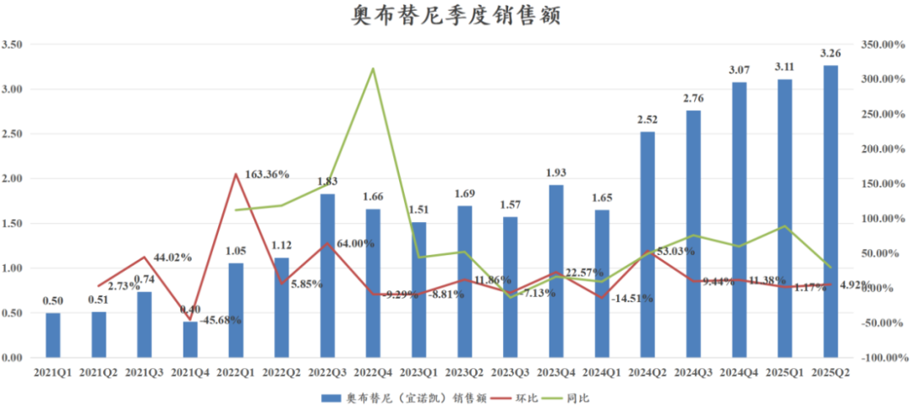

# 2025创新药商业化全梳理

大家好，我是龙哥。

此前我们对创新药行业做过一个中期总结：[创新药行业半年度总结](https://mp.weixin.qq.com/s?__biz=MzkyMzQ3MDc3Mw==&mid=2247484697&idx=1&sn=01a84904aac5ccd436dd6f6fc69790bf&scene=21#wechat_redirect)

并且在上周末还更新了今年以来创新药BD和股权融资的情况：[2025创新药融资之王](https://mp.weixin.qq.com/s?__biz=MzkyMzQ3MDc3Mw==&mid=2247484887&idx=1&sn=6d1b9b5f83f3d0f0b021a716a257cca7&scene=21#wechat_redirect)

今天我们再来梳理一下行业中报的情况。

以下是我们更新的对国内创新药公司产品商业化销售额的预测情况：

对于该表需要做如下几点解释：

①以上只统计产品销售收入，不含BD收入和技术服务收入，BD收入我们在此前的文章里有单列表格。

②中国生物制药、信达生物、复宏汉霖、神州细胞等公司的收入全部调整为包含生物类似药的公司，随着这些公司的商业化品种越来越多，分拆单个品种销售额的误差可能会加大。

③复星医药、人福医药、华东医药、远大医药、康哲药业、长春高新等部分pharma尚未纳入统计中，主要是难以单独分拆创新药收入。

1、25年上半年超预期的创新药公司

①百济神州

泽布替尼季度环比+20%、PD-1国内销售均超预期，且百济首次实现了仅依靠产品商业化的季度盈利，另外公司还上调了全年的指引。

此前我们在文章里有具体介绍：[中国创新药美股五虎剧烈分化](https://mp.weixin.qq.com/s?__biz=MzkyMzQ3MDc3Mw==&mid=2247484834&idx=1&sn=985827b5491440939c3898141bf5a3e3&scene=21#wechat_redirect)

②艾力斯

伏美替尼季度销售12.5亿环比+15%大超预期，高基数之下还能实现加速增长，全年预计将会突破50亿元销售额，后续还有多个适应症在III期临床。

在这个销售业绩的背后，我们还思考了一些投资之外的事情。大家知道三代EGFR从阿斯利康开始已经合计陆续上市了9个品种，另外还有几个在III期或者申报上市阶段的。其中销售体量最大的有3家，分别是阿斯利康奥希替尼（FIC，中国区销售60亿-70亿）、翰森制药阿美替尼（国产首家，25年约60亿）、艾力斯伏美替尼（国产第二家，25年约50亿），以上三家的收入大概在170亿-180亿，如果加上其他几家竞品，合计的市场规模应该接近200亿。

这是个什么概念呢，三代EGFR目前的医保价格大概是6-7万的年用药费用，200亿的销售体量意味着每年有至少30万人用药，换句话说，仅仅在中国，每年有至少【30万条生命】因为三代EGFR药物的发现而得到救助和延长。这是超越了股票投资范畴的东西，可能也是对于我们这些看好和投资创新药械的投资人最大的激励。

③云顶新耀

上半年产品销售4.46亿元略低于预期，主要是国内首款IgA肾病的创新药——耐赋康——由于产能不足有一段时间断货，到8月份已全面修复。

公司非但没有下调全年指引，反而将全年指引由14亿（10亿耐赋康+4亿依嘉）上调至16-18亿（12-14亿耐赋康+4亿依嘉），相当于把耐赋康的销售目标上调了20%-40%，当然这其中会包括部分渠道铺货，但纯销应该也是非常惊人的增长。

④泽璟制药

上半年产品收入3.76亿元同比增长57%，自24年下半年以来产品商业化收入出现显著加速放量，一改过去商业化销售持续miss的情况，除了多纳非尼的增长外，公司今年还增加了吉卡昔替尼（25M5获批治疗中高危骨髓纤维化）、重组人凝血酶（首年进医保，远大医药作为CSO负责国内商业化）。

⑤迪哲医药

两款新药舒沃替尼+戈利昔替尼上半年合计销售3.55亿元，其中Q2单季度销售1.95亿元同比增长60%、环比增长20%，预计包括部分渠道铺货。

另外迪哲在今年8月还启动了第三款小分子创新药DZD8586（BTK/LYN抑制剂）的国际多中心III期临床，用于治疗BTK经治的CLL/SLL患者。

⑥康诺亚

匹康奇拜单抗（IL-4Rα）上半年在无医保的情况下销售1.69亿元，此前的指引和市场预期是1.5亿元。

公司把全年销售指引从5亿元下调到4亿元，主要是今年需要参加医保谈判，医保谈判后渠道调价或者补差价会影响四季度的销售，可以参照上图中迪哲医药去年Q4的情况，但进医保后会快速拉回来。

康诺亚的匹康奇拜单抗是国产首家IL-4Rα单抗，并且还拥有独家适应症——过敏性鼻炎，也是给了重度鼻炎患者一个新的选择。

⑦亚盛医药

奥雷巴替尼上半年销售2.17亿元同比增长92.53%、环比增长70%，新适应症（无T315I突变限制）进医保开始放量。

另外亚盛医药的国产首款、全球第二款Bcl-2抑制剂利沙托克拉已经在25年7月正式获批，虽然无缘25年的医保谈判，但下半年也将开始贡献部分收入。百济神州的Bcl-2抑制剂索托克拉的CLL/SLL和MCL适应症都已经在25年上半年申报NDA，两家公司有可能一起在26年参加国谈。

⑧华领医药

多格列艾汀（华堂宁）上半年销售2.17亿元同比增长112%超公司指引和市场预期，预计其中包含部分渠道铺货。华领医药去年自拜耳拿回华堂宁的国内商业化权益后的商业化做的还算不错，在DPP-4已经集采、SGLT-2即将集采的情况下，华堂宁在口服降糖药中进入更有利的位置。

2、25年上半年低于预期的创新药公司

①恒瑞医药

上半年创新药收入75.7亿元同比增长约22%低于市场预期，员工持股计划考核创新药收入复合增速从30%下调到25%。

此前文章有详细点评：[创新药龙头展望](https://mp.weixin.qq.com/s?__biz=MzkyMzQ3MDc3Mw==&mid=2247484862&idx=1&sn=a789164dfc281cddc917fd5659a1d921&scene=21#wechat_redirect)

②再鼎医药

艾加莫德及其他商业化品种Q2大幅低于预期，全年销售预期也大幅下调。

此前文章有详细点评：[中国创新药美股五虎剧烈分化](https://mp.weixin.qq.com/s?__biz=MzkyMzQ3MDc3Mw==&mid=2247484834&idx=1&sn=985827b5491440939c3898141bf5a3e3&scene=21#wechat_redirect)

③贝达药业

国内商业化常态化miss。

④和黄医药

呋喹替尼海外环比震荡，国内商业化销售全面大幅下滑，大幅miss。

此前文章有点评：[中国创新药美股五虎剧烈分化](https://mp.weixin.qq.com/s?__biz=MzkyMzQ3MDc3Mw==&mid=2247484834&idx=1&sn=985827b5491440939c3898141bf5a3e3&scene=21#wechat_redirect)

⑤诺诚健华

奥布替尼Q1-Q2环比增速均较低，预计是公司在上半年有主动控货应对年底国谈，今年国谈诺诚健华的奥布替尼将会新增一线CLL/SLL这个BTK抑制剂最大的适应症进入医保。

诺诚健华总体的商业化产品梯队还是不错的，25年新增奥布替尼一线CLL/SLL适应症和CD19单抗获批，26年预计有奥布替尼首个自免适应症ITP获批、首个实体瘤药物卓乐替尼（pan-TRK）获批，27年预计有首个TYK2/JAK1抑制剂ICP-332获批，在II/III期临床的药物还有Bcl-2抑制剂和ICP-488（TYK2/JH2）。

⑥三生国健

上半年产品销售低于预期，主要是受到集采影响，不过三生国健现有商业化品种在估值中的占比已经很低，公司核心估值来自PD-1/VEGF的海外授权部分的30%以及后续多个III期和NDA阶段的自免新药。

⑦欧康维视生物

眼科创新药放量显著低于预期。

⑧艾迪药业

HIV新药放量低于预期。

⑨智翔金泰

IL-17A销售持续低于预期，无医保情况下me too类药物销售压力较大。

......

除了以上公司以外，还有两家明星公司要特别提一下，也就是康方生物和科伦博泰。康方生物的AK104/AK112两款IO双抗以及科伦博泰生物的TROP2-ADC是市场此前原本预期较高的品种，上半年的销售均中规中矩。

康方生物的产品销售合并报表的收入为14.02亿元同比增长49.2%、环比增长32%，包括AK104/AK112/AK105/AK102/AK101等5款商业化创新药，其中大家最关注的卡度尼利（PD-1/CTLA-4）和依沃西（PD-1/VEGF）两款新药都是在24年底降价纳入医保。

科伦博泰生物上半年产品商业化销售合计3.1亿元，其中芦康沙妥珠单抗（TROP2-ADC）销售3.02亿元，公司此前的指引是上半年3-4亿元、下半年5-6亿元、全年8-10亿元，目前看可能会更贴近指引的下沿，也既全年争取做到8亿的销售额，在经济环境不佳的情况下，非医保的自费高价药市场确实本身就会有较高的放量难度。

......

总结一下，创新药在国内的商业化销售超预期的公司数量和比例已经不及2024年，超预期和低于预期的公司基本呈现五五开，我们认为主要有三方面原因，其一是24年本身是自2022年底政策拐点以来政策面边际变化最好的一年；其二是在经历了几年的医药熊市后，到24年的股价底部对应的市场预期本身也很低；其三是总体创新药的收入体量提升、竞争增加，同时整个25年上半年的院内诊疗情况、经济环境都不算好。

但总体来说行业仍然在维持高增长，仍然是医药行业最强的行业β，在包含部分生物类似药的情况下，预计25年以上43家公司的创新药产品收入合计1724亿元+30%，预计26年收入合计2168亿元+26%，创新药行业依然有较强的β。

风险提示：本文仅讨论行业/公司经营情况，投资需综合考虑公司经营、估值、管理层等多方面因素，建议读者审慎参考，本文不作为投资依据，不建议大家根据本文做出投资计划。

<!-- wxmp-comments-begin -->

---

## 留言（15 条，含回复共 32 条）

- **rothschild～李** 👍3 · 2025-09-05 08:45
  龙大，cro中报总结什么时候安排？谢谢
  - ↳ **作者** · 2025-09-05 08:51
    最近吧，得挨个写啊，还有几篇要写的
- **和** 👍2 · 2025-09-05 08:31
  昨天恒生医药大跌咋回事？
  - ↳ **作者** · 2025-09-05 08:36
    你应该问，昨天大盘大跌咋回事
- **六爻** 👍1 · 2025-09-05 08:28
  我想说的是云顶新耀完全配不上超预期：
  第一，2023-2025年，两年时间只备三亿的货；
  第二，销售团队一点增长都没有，是打算躺平吗？看看其他公司的销售团队就知道云顶一点进取心都没有，配不上耐赋康这个大单品。
  第三，业绩指引简直无语，今年新增患者6万，明年新增也是6万，这样的公司目标，加上融资策略，你能说他有进取心？
  
  配合市场上的走势，我只能说市场永远是对的，垃圾就应该跌。只能割肉了。
  - ↳ **作者** · 2025-09-05 08:53
    之前一直不太敢聊云顶，就是因为这公司一直有一群投资者怀着过于乐观的预期，只要说的不如他们预期的乐观就会被喷。
- **CHY** 👍1 · 2025-09-05 08:29
  老师好，请教一下，咱们的龙谈美元债，是对标的美债的市场交易价格是不是，那降息到底是利好还是利空？
  - ↳ **作者** · 2025-09-05 08:31
    降息肯定是利好啊，咱们一开始配美元债的逻辑之一不就是除了票息以外还有降息带来的资本利得
- **天涯过客** 👍1 · 2025-09-05 08:31
  龙哥你好，看好时代天使的后续业绩反转吗？
  - ↳ **作者** · 2025-09-05 08:37
    上半年案例数表现是非常不错的，但公司也反复强调了下半年在海外的费用端投入的压力和海外亏损扩大的预期，公司指引是27年海外做到扭亏。
- **17** · 2025-09-05 08:19
  龙哥，求点评兴齐眼药
  - ↳ **作者** · 2025-09-05 08:34
    兴齐眼药在前几天的文章留言有提到，中报收入端还好，利润端比较超预期，随着产品放量还是带来费用率下降和放利润的。今年会有越来越多的院内制剂的注册证到期，届时会有越来越多的医院从院内制剂转到兴齐的产品。
  - ↳ **作者** · 2025-09-09 13:39
    院内制剂的注册证到期后，医院不能续证吗？医院就不能再开自制了？恒瑞也在研制阿托品，预计年底上市，价格可能比兴齐低30%[破涕为笑][破涕为笑]
- **子非** · 2025-09-05 08:23
  龙哥，医疗器械的威高股份连续下跌的，啥情况呢
  - ↳ **作者** · 2025-09-05 08:29
    中报业绩miss
- **范征** · 2025-09-05 08:24
  耐赋康的指引明显低于预期了啊，8月卖断货，后续得增长也只是线性外推，下半年3万人，明年新增6万，太普通了。这么好的宣传机会加上医保独占期，他不大力推广，差点意思
  - ↳ **作者** · 2025-09-05 08:28
    一个月费5000的慢病药，在中国市场卖，今年放量到12-14亿，你们居然还觉得【明显低于预期】，说明你们的预期本来就存在很大的问题，对中国创新药市场有不正常的理解。
  - ↳ **作者** · 2025-09-05 08:40
    首先，他卖断药本身就说明自己供应链问题，备货不积极，还推卸了责任。如果没有卖断药的宣传 这个业绩是很好的，但是经过卖断药，结果还是这样说明什么？8月得销售额和之前比也只是正常的线性外推罢了，没有因为卖断药而超预期 说明公司销售团队有问题的。不是说这款药不好，当然好，但是预期是变化的，在积极因素推动下还是这样就差点意思
- **Iven Ge** · 2025-09-05 08:26
  龙大，再典医药昨天大跌是什么原因呢？
  - ↳ **作者** · 2025-09-05 08:35
    再鼎医药大跌因为安进发布的Bema（FGFR2b）的第一个3期临床最终OS数据低于预期。
- **十丈红尘** · 2025-09-05 08:30
  去年好，今年涨，这买股票真的难啊
  - ↳ **作者** · 2025-09-05 08:36
    也不是，去年只是国内商业化销售做的好，今年行业核心逻辑是叠加了出海逻辑被认可，当然出海逻辑其实也好了两三年了。
- **赶路的** · 2025-09-05 08:41
  改天专门写写康方可以吗
  - ↳ **作者** · 2025-09-05 08:44
    康方其实我在今年的文章里写过很多次，PD-1/VEGF赛道是今年创新药的主线之一呀
- **yhyy** · 2025-09-05 08:47
  龙大，能点评一下安科生物的中报和后续的增长点吗
  - ↳ **作者** · 2025-09-05 09:14
    安科生物后续也是要看创新药这边的研发情况了，生长激素那边总体行业是激烈竞争的，看长春高新的报表就能看得出来，金赛也在加大销售费用和研发费用的投入，上半年金赛的利润率下到20%。
- **Tyrion's admirer** · 2025-09-05 08:53
  贝达这么差劲？
  - ↳ **作者** · 2025-09-05 09:12
    但凡跟踪久一点的都知道贝达这些年miss了多少，倒也不是说他未来一定不行，只是这些年确实消耗的很多投资人的耐心。
- **ALL-IN** · 2025-09-05 08:53
  能聊下爱尔眼科么一直不温不火的
  - ↳ **作者** · 2025-09-05 09:10
    这都不需要我聊啊，你把眼科医疗服务那几家上市公司的财报挨个看一眼就知道了，q2表现多差，所以前几天爱博的那个业绩点评我才说，行业β还是很差的，爱博有业绩完全是他自己的α。
- **雨化心声** · 2025-09-05 08:56
  龙大，恒瑞市值和估值都处于阶段和板块，高位，是不是溢价之外，动能乏力，以及整个板块的动能[太阳]
  - ↳ **作者** · 2025-09-05 08:59
    实际上恒瑞医药7月那个BD是这轮创新药行情持续的重要驱动力。今早恒瑞医药又落地一笔BD，7500万美元首付款+近期付款，10.13亿美元里程碑付款。

<!-- wxmp-comments-end -->
