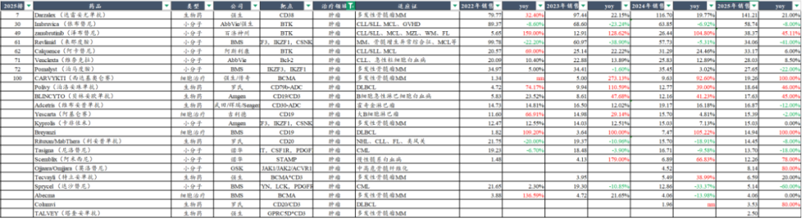
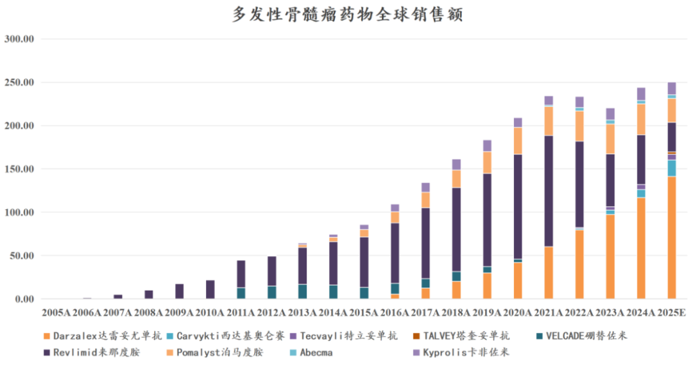
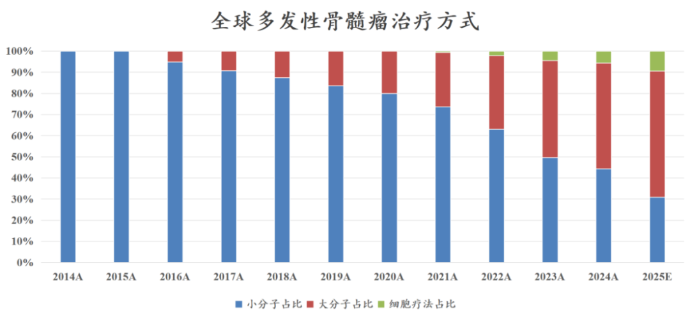
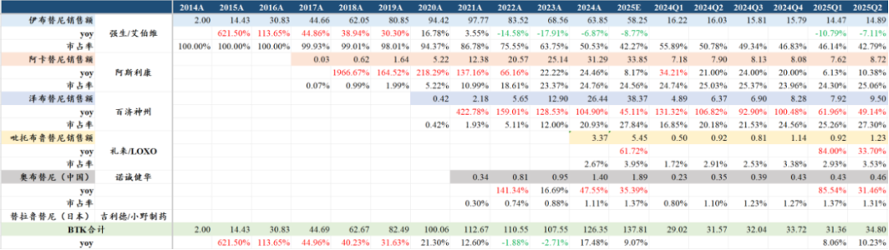
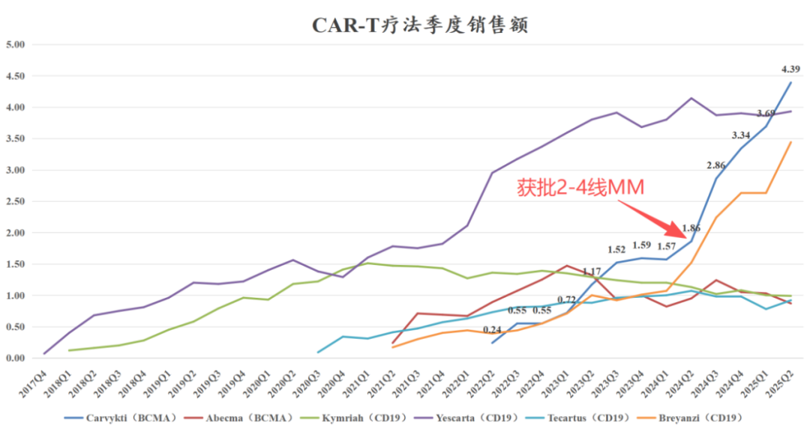

# 中国创新药最具统治力的方向

大家好，我是龙哥。

今年4月给大家写过一篇文章介绍诺诚健华（[横跨两个黄金赛道](https://mp.weixin.qq.com/s?__biz=MzkyMzQ3MDc3Mw==&mid=2247484409&idx=1&sn=cd9c01b6be30e09a0d4fb3c2d15d078b&scene=21#wechat_redirect)），当时写到其横跨两大黄金赛道——血液瘤和自免，这两个赛道的特点就是药物定价高、用药周期长、欧美患者群体大，从而使得这两个领域天生就是诞生大药的领域。

在自免领域中国市场算是起步相对比较晚的，中国企业也逐渐跟上全球的研发趋势，如我们前阵子的文章：[自免再现200亿美金超级大药](https://mp.weixin.qq.com/s?__biz=MzkyMzQ3MDc3Mw==&mid=2247484792&idx=1&sn=8fb59368167f4ed7e950607826df81e7&scene=21#wechat_redirect)有介绍自免领域的情况。

在血液瘤领域情况又有所不同，中国公司已经在全球血液瘤领域站稳脚跟，甚至可以说血液瘤已经成为中国公司在全球创新药行业竞争中最具统治力的方向，已经诞生了两家千亿或者曾达千亿市值的公司（百济+传奇），以及两个数十亿美金销售潜力的超级大药，且后续的血液瘤在研管线中，中国公司依然在快速的突破乃至领先地位。

全球销售体量较大的创新药品种中，我们目前统计的有67个肿瘤药在2024年合计实现1800亿美元的销售金额，预计这些品种在2025年实现接近2000亿美元的销售金额。其中包含23个血液瘤的药物，这23个血液瘤药物在2024年合计实现了接近520亿美元的全球销售额，且预计2025年将会达到约550亿美元的全球销售额。

这其中又有两个疾病领域最大、最值得关注，分别是多发性骨髓瘤（MM）和慢性淋巴细胞白血病/小淋巴细胞淋巴瘤（CLL/SLL）。

多发性骨髓瘤领域几个主要治疗药物的全球销售额已经接近250亿美元，占整个血液瘤市场的半壁江山，且治疗药物在快速更迭中。

达雷妥尤单抗（CD38）随着在一二线治疗的渗透率提升而登顶血液瘤药王，24年全球销售额116.7亿美元，预计25年将突破140亿美元；同时强生/传奇生物的BCMA-CART疗法Carvykti，随着去年在美国和欧盟陆续获批2-4线疗法，已经登顶全球细胞疗法销售冠军（[中国创新药美股五虎剧烈分化](https://mp.weixin.qq.com/s?__biz=MzkyMzQ3MDc3Mw==&mid=2247484834&idx=1&sn=985827b5491440939c3898141bf5a3e3&scene=21#wechat_redirect)），且后续还将在明年读出首个一线治疗的III期临床数据。

另一个值得关注的疾病领域是BTK抑制剂的主战场——CLL/SLL，几款BTK抑制剂在24年的全球销售达到126亿美元，且预计25年将接近138亿美元，其中百济神州的泽布替尼有望实现超过38亿美元的全球销售额，达到接近28%的市场份额，公司有望在2026年实现单季度登顶全球BTK抑制剂销售冠军。

除了以上商业化产品以外，我们再来就国内血液瘤头部公司的产品管线梳理一下，看国内血液瘤领域未来如何进一步提升在全球的统治力。

1、BTK抑制剂

BTK抑制剂作为一个超级大药，国内做的公司反而并不多，一方面是过去普遍认为国内血液瘤市场具有局限性，而出海又要像百济这样与伊布替尼做头对头。目前国内公司中还是只有百济和诺诚两家BTK做到商业化，两家公司在适应症开发上略有差异。

百济的泽布替尼已经不需要我们再做太多的赘述，估计只要看过创新药的投资人都已经对其非常熟悉。总体来看泽布替尼在海外市场是全面覆盖了CLL/SLL、MCL、FL、MZL、WM等适应症，尤其是在美国市场的CLL/SLL新患中已经占据绝对的统治地位；在国内市场泽布替尼仅缺少了MZL适应症，其他适应症与海外看齐。在自免适应症上百济曾在23年启动原发性膜性肾病（pMN）的III期临床。

诺诚健华的BTK抑制剂此前在国内销售压力较大，改观出现在23年底R/R MZL适应症作为国内独家进入医保的MZL靶向创新疗法而实现快速放量，到今年4月诺诚的BTK又获批了最大的适应症——一线CLL/SLL，在今年底谈医保之后诺诚的BTK抑制剂才能在一线CLL/SLL这个主战场与百济竞争。诺诚的BTK后续开发的适应症还有一线MCD亚型DLBCL、一线MCL，其在美国完成了R/R MCL的注册II期临床，但并未提交注册。

奥布替尼与泽布替尼最大的适应症开发的差异还是在自免领域，奥布替尼目前开了PPMS和SPMS的全球III期临床，其首个自免适应症ITP预计可能在26年在国内获批，另外SLE适应症还在IIb期临床。自免适应症的开发另外给了奥布替尼出海的机会。

2025年上半年，百济的泽布替尼在中国销售11.92亿元同比增长36.54%，诺诚健华的奥布替尼在中国销售6.37亿元同比增长52.53%，两个品种25年在国内销售预计将突破38亿元。泽布替尼25H1全球销售额17.42亿美元同比增长54.71%，全年有望突破38亿美元的全球销售额。

2、Bcl-2抑制剂

目前亚盛医药、百济神州、诺诚健华三家国内血液瘤龙头公司都开发了Bcl-2抑制剂，且都已经启动了III期临床，不过3家公司的开发策略、适应症都有所差异。另外还有中国生物制药、复星医药的Bcl-2也在II期临床阶段。

1）亚盛医药

国产首家、全球第二家获批的Bcl-2抑制剂是亚盛医药的利沙托克拉（APG-2575），获批的首个适应症是R/R CLL/SLL，以注册II期临床获批上市。

利沙托克拉后续开发的适应症包括多个国内和国际多中心III期临床，也是国内为数不多敢于开全球多中心注册临床的公司之一。

具体适应症布局包括：

①联合BTKi用于BTKi治疗12个月未达到CR的CLL/SLL，也就是所谓的1.5线疗法，目前在进行包括美国在内的全球多中心注册临床；

②联合阿卡替尼一线治疗CLL/SLL，这个是一个只在国内开的大III期临床；

③一线治疗年老/不耐受标准化疗的急性髓系白血病（AML），这是一个在美国以外开启的全球多中心III期临床，以OS为终点；

④联合阿扎胞苷一线治疗中高危骨髓增生异常综合征（MDS），这是亚盛医药的Bcl-2最具看点和市场潜力的一个适应症，艾伯维的维奈克拉在该适应症上失败，百济、诺诚暂未布局该适应症的注册临床，意味着亚盛医药如果能在该适应症上获得成功，将成为Bcl-2在该适应症的全球FIC药物，对应着至少20亿-30亿美元的全球销售潜力，目前亚盛医药已经在美国和欧盟获批该III期临床。

2）百济神州

百济神州的索托克拉的研发进度仅次于亚盛医药，目前已经有R/R CLL/SLL和R/R MCL两个适应症在今年的4-5月陆续在国内申报上市，有望在2026年上半年获批，比亚盛医药晚一个医保年。

百济神州的索托克拉片也在进行多个国际多中心注册临床，包括：

①联合泽布替尼一线治疗CLL/SLL，这是百济神州的泽布替尼最重要的基本盘，在25年2月已经完成全球多中心III期临床的患者入组，但是由于CLL的无进展生存期（PFS）非常长，这个注册III期的随访周期将会非常长，但该适应症如果能获得成功，将会进一步强化百济神州在全球一线CLL疗法的统治地位。

②R/R CLL/SLL和R/R MCL在进行全球多中心的注册II期临床，预计在海外市场也将以注册II期临床进行快速申报，最快在2025年底有望提交注册。

③AML、MDS等适应症目前在Ib期临床探索中，尚未启动注册临床。

3）诺诚健华

诺诚健华的Bcl-2抑制剂ICP-248在今年2月获批首个III期临床，用于联合奥布替尼一线治疗CLL/SLL。

在亚盛、百济、诺诚3家BCL-2一线治疗CLL/SLL的注册临床中，三家公司选择的对照组有所差异，亚盛选择的对照组是FCR方案（磷酸氟达拉滨、环磷酰胺、苯丁酸氮芥、利妥昔单抗），对照组的mPFS约为6.4年；百济选择的对照组是维奈克拉（Bcl-2）+奥妥珠单抗（CD20），对照组的mPFS约为6.3年；而诺诚健华只做国内市场，选择的对照组是苯丁酸氮芥+奥妥珠单抗，对照组的mPFS约为31个月；由此，诺诚健华在一线CLL/SLL的III期临床如果进展顺利的话有机会第一个达到临床终点，最快在2027年有机会达成。

此外诺诚健华的ICP-248还在国内启动了用于BTKi治疗失败的R/R MCL的注册II期临床，在美国获批开展用于AML和MDS的早期临床探索。

总体Bcl-2抑制剂的竞争格局相较BTK抑制剂会更激烈一些，亚盛医药和诺诚健华相对胜在速度快，百济神州则是稳扎稳打的打法去拓展自己的基本盘，三家公司的差异化竞争预计也将使得未来其各自可以拿到部分国内外的市场份额。

3、其他BTK耐药疗法

除了以上的Bcl-2以外，在BTKi耐药的CLL/SLL后线疗法的开发中，目前海外有礼来的第三代BTKi获批，国内有百济神州、迪哲医药开发的创新疗法进入III期临床。

百济神州开发的BGB-16673（BTK CDAC蛋白降解剂）目前已经在国内和海外启动多个注册临床，包括单药头对头研究者选择疗法治疗R/R CLL/SLL的全球多中心III期临床，以及单药头对头礼来第三代BTK抑制剂pirtobrutinib治疗R/R CLL的全球多中心III期临床，同时百济神州还推进了R/R MCL的全球注册II期临床；在BTK CDAC百济也在探索用于慢性自发性荨麻疹的Ib期临床。

迪哲医药则是通过双靶点的方式克服BTK耐药，其开发的DZD8586是一款BTK/LYN双靶点抑制剂，在今年8月首次启动单药头对头研究者选择疗法用于R/R CLL/SLL的全球多中心III期临床。迪哲医药的创新药开发策略也向来是追求全球创新、同步国内和全球注册临床的思路，其已经有两款小分子新药舒沃替尼和戈利昔替尼获批上市，DZD8586是其第三款进入注册临床的小分子创新药。

4、MM疗法

多发性骨髓瘤目前处于单抗疗法（CD38）渗透率仍在快速提升、细胞治疗初现峥嵘、双抗/ADC陆续成药、小分子疗法专利到期大幅下滑的现状。

CD38单抗方面，国内公司少有跟随者，如康诺亚研发的一款CD38单抗CM313也主要用于开发自免适应症，在今年1月以Newco的方式以3000万美元首付款+3.375亿美元里程碑付款+25.79%的标的公司股权的交易对价授权了大中华区以外权益。

细胞疗法方面，国内已经有多款BCMA-CART疗法获批，但由于单价过高、不在医保的局限性，使得国内可拓展空间相对较为有限。国内公司唯一在海外获批的BCMA-CART——传奇生物/强生的Carvykti，在欧美的单人治疗费用超过40万美元，目前已经累计治疗了大几千例患者，预计25年二季度单季度的治疗人数已经突破1000人，其放量主要得益于2-4线疗法的获批，放量趋势可类比CD38单抗陆续获批前线适应症后的销售表现。

另外在传奇生物Carvykti的惊艳表现之下，强生的另外两款MM的创新疗法BCMA\*CD3双抗和GPRC5D\*CD3双抗的季度销售表现就相对较为平庸，即便强生对这两款产品也给了较高的未来销售预期。在今年7月FDA的专家委员会还投票拒绝批准GSK的BCMA-ADC用于二线以上MM。

多发性骨髓瘤领域开发到Carvykti，在疗效上已经是一款接近“杀死比赛”的品种，未来进一步的突破基本不会是来自疗效上的突破，而是来自安全性方面（Arcellx/吉利德）或者通用型CAR-T，国内代表性公司如科济药业。

5、CML疗法

慢性髓性白血病（CML）最典型的治疗药物，就是大家比较熟悉的《我不是药神》里的“神药格列宁”（格列卫，甲磺酸伊马替尼），其作为第一代的BCR-ABL TKI早已经过了专利期，后续的尼洛替尼、达沙替尼等销售峰值达到20亿美金以上的CML重磅疗法也陆续专利到期和销售金额大幅下滑。

亚盛医药的奥雷巴替尼作为一款第三代的BCR-ABL TKI，在一代/二代TKI耐药的CML不限基因突变类型的全人群适应症获批并在24年底纳入国家医保后，在25年以来的销售终于开始有显著的改善（[2025创新药商业化全梳理](https://mp.weixin.qq.com/s?__biz=MzkyMzQ3MDc3Mw==&mid=2247484922&idx=1&sn=80646a977271d93db81cafc4cc4400de&scene=21#wechat_redirect)）。

除了国内二线CML以外，公司目前还有琥珀酸脱氢酶缺陷型（SDH）胃肠道间质瘤（GIST）、费城染色体阳性急性淋巴细胞白血病（ALL）等适应症在国内正在开展III期临床。

此外公司还在计划在美国开展CML和ALL的注册III期临床，此前奥雷巴替尼的海外权益被授权给武田制药，亚盛医药可获得1亿美元首付款+12亿美元里程碑付款+12%-19%的销售分成。

......

总体来看，百济神州、传奇生物、亚盛医药、诺诚健华等公司在血液瘤领域的药物开发和其全球竞争力已经得到充分的验证，其后续管线也将进一步强化其血液瘤全球竞争力。

在血液瘤后续疗法的海外授权方面，国内有多款TCE的双抗/三抗实现海外BD授权，包括康诺亚和智翔金泰的两款BCMA\*CD3，以及先声药业的BCMA\*GPRC5D\*CD3等。

中国公司在未来将逐步拿下全球血液瘤市场接近半壁江山，成为未来相当长的时间里中国创新药在全球创新药市场最具统治力的疾病领域。

风险提示：本文仅讨论行业/公司经营情况，投资需综合考虑公司经营、估值、管理层等多方面因素，建议读者审慎参考，本文不作为投资依据，不建议大家根据本文做出投资计划。

<!-- wxmp-comments-begin -->

---

## 留言（11 条，含回复共 26 条）

- **口天吴** 👍2 · 2025-09-09 12:57
  复星医药看着二季度增长很快啊，能不能讲讲这个公司
  - ↳ **作者** · 2025-09-09 13:05
    复星医药二季度收入下滑2%，扣非归母净利润下滑15%。复星医药绝大部分看点就是复宏汉霖。
  - ↳ **作者** · 2025-09-09 13:10
    ？他俩的关系就是复星医药对复宏汉霖的持股。
- **苏@163.com** 👍1 · 2025-09-09 12:57
  龙哥，请问如果AK112不能获批在海外上市，也不能被summit二次BD，康方生物的市值还能撑得起千亿吗？
  - ↳ **作者** · 2025-09-09 12:59
    你已经把这个康方生物估值最重要的部分给假设全部失败了，那还何谈估值啊
- **caoguoan** 👍1 · 2025-09-09 13:03
  龙哥，有空请聊聊天智航，上半年营收增长，亏损确不见收窄
  - ↳ **作者** · 2025-09-09 13:09
    天智航上半年设备招标和收入有所改善，但是耗材和服务部分的收入还是提升不明显，商业模式还是说不上完全跑通吧。今年国内为主的手术机器人表现并不算好，股价表现较好一定程度上还是有蹭的机器人概念。微创机器人的情况略有不同，上半年国内虽然是miss的，但是海外的装机和新增订单大超预期。
- **光头的复利人生** 👍1 · 2025-09-09 13:18
  亚盛2575是今年下半年才获批的，百济神州的索托克拉如果在2026年上半年获批，那么就跟2575一起参加明年的医保谈判，怎么会“比亚盛医药晚一个医保年”呢？
  - ↳ **作者** · 2025-09-09 13:22
    是的，百济如果26H1获批，就是共同谈医保。
- **锋** 👍1 · 2025-09-09 13:18
  请问怎么看亚盛和康诺亚呢？
  - ↳ **作者** · 2025-09-09 13:22
    前阵子的自免的文章，这篇血液瘤的文章，不就在写康诺亚和亚盛嘛
- **阿宝** 👍1 · 2025-09-09 13:28
  亚盛有没有可能市值超过白鸡[坏笑]
  - ↳ **作者** · 2025-09-09 13:31
    就目前来看没有可能，目前管线差距太大，并且一个已经成为MNC，另一个是biotech。
- **巴西木** · 2025-09-09 13:10
  龙哥好！
         几个月来，你的文章几乎都是写创新药的。很期待你写一篇关于医疗器械这个细分行业的文章！比如它目前的供应设备产品的适用性、技术先进性情况、医院与居民的需求情况、目前研发对应市场近两年的需求情况、直至政府集采设备的指导意见变化情况，等等。
  - ↳ **作者** · 2025-09-09 13:11
    今年也有多篇文章讲到医疗器械领域，可以去翻翻看历史文章。只是医疗器械确实不算今年的核心主线，所以没有写的特别多。
- **LQ** · 2025-09-09 13:19
  诺诚健华H最近被做空的比例很高，龙哥知道其原因吗？
  - ↳ **作者** · 2025-09-09 13:24
    做空的量并没有显著增加呀
- **求索者** · 2025-09-09 13:51
  “总体Bcl-2抑制剂的竞争格局相较BTK抑制剂会更激烈一些"给我看笑了，海外btk过几年都要够10款了，而bcl-2海外能够成药的最多也就3款；
  ”联合阿卡替尼一线治疗CLL/SLL，这个是一个只在国内开的大III期临床“这个也不严谨，应该是除美国以外的全球临床，固定疗程，但不是12个月，而是18个月。所以龙哥说的上市时间也不对，而且肯定先于诺诚248扩适应症的；
  艾伯维最近发了mds失败的原因，龙哥要不要聊聊诺诚248联用aza之后三级不良率远低于aza单药的原因？
  - ↳ **作者** · 2025-09-09 13:59
    先别笑，Bcl-2抑制剂竞争格局的确比BTK要激烈，国内目前是艾伯维+国产5家，国内BTK是2进口+2国产。
    海外BTK实际上就是强生+AZ+百济+礼来，未来的竞争就是后3家的竞争，其他家BTK都没做美国市场，海外Bcl-2目前尚未分出高下，但百济未来大概率拿到CLL的最大市场，亚盛则是要看MDS的成药。
  - ↳ **作者** · 2025-09-09 14:00
    固定疗程和随访时间、临床终点是两码事，PFS终点之下目前来看诺诚更有可能先达到一线治疗的终点。
  - ↳ **作者** · 2025-09-09 14:09
    一线CLL/SLL虽然公司的PPT里展示的是美国以外的全球多中心III期临床，但公司公开信息只有在国内开展III期临床的信息，目前没看到在其他国家开展III期临床的信息，所以这里写的是中国区的III期临床。如果你有看到在欧洲或者日本入组的信息也可以发一下。
- **甘文武** · 2025-09-09 13:53
  龙哥，当下创新药主要靠BD来催化行情的背景下，以License-in为主的公司是否不应该继续坚守
  - ↳ **作者** · 2025-09-09 14:01
    license in模式的公司就需要销售能持续超预期。
- **Berry** · 2025-09-09 15:35
  龙哥，最近不少公司开始高管减持，有说利于市场后续上涨，把筹码让出来给了机构，机构有足够筹码更好的去拉升股价，您觉得这说法站的住脚吗？
  - ↳ **作者** · 2025-09-09 16:06
    [尴尬][尴尬][尴尬]好好好，上市公司高管无私奉献，把宝贵的筹码交给大家，是吧
  - ↳ **作者** · 2025-09-09 16:34
    只能说在牛市里的减持不是影响中期股价趋势的核心矛盾，但也不能强行解释为这个啊[捂脸][捂脸]

<!-- wxmp-comments-end -->
